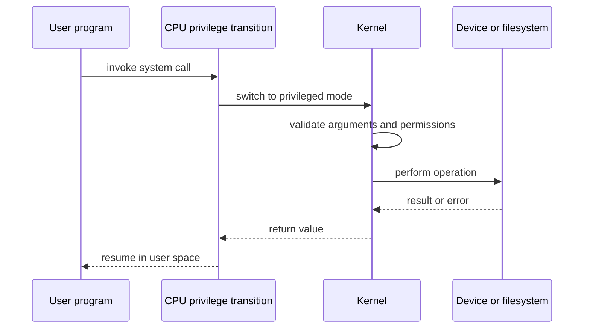

# Systems Engineering Blog Series — Writing and Learning Strategy

This document defines how to turn `ROADMAP.md` into a connected, practical, interview-ready blog series.

`ROADMAP.md` answers:

> What should I learn?

This document answers:

> How should each topic be taught so that I can understand it, remember it, connect it to other topics, and see it working even when I have limited time to practise?

## 1. The goal of the series

The series should help the reader become able to:

- Explain how systems work from first principles.
- Connect hardware, operating systems, networks, storage, databases, and production services.
- Understand code examples that make invisible behavior observable.
- Debug failures using evidence instead of guessing.
- Reason about performance, reliability, security, and compatibility.
- Explain concepts clearly in interviews and design discussions.
- Recognize tradeoffs instead of memorizing isolated facts.

This is not just a collection of definitions. It is a guided mental model of a computer and the systems built on top of it.

The central chain of understanding is:

```text
Hardware
   ↓
Operating system
   ↓
Processes, memory, files, and I/O
   ↓
Concurrency and networking
   ↓
Databases and distributed systems
   ↓
Backend services and infrastructure
   ↓
Production reliability and system design
```

Every article should make it clear where its topic fits in this chain.

## Roadmap hierarchy and blog granularity

The roadmap has three levels:

```text
Stage
  └── Numbered subject area
        └── Individual blog topic
```

For example:

```text
Stage 0: Engineering Foundations
  └── 1. How Professional Software Engineering Works
        ├── What Software Engineering Actually Involves
        ├── Requirements, Constraints, and Tradeoffs
        ├── Reading and Understanding Unfamiliar Codebases
        ├── Code Ownership and Maintenance
        └── Technical Debt
```

The numbered `##` title is a subject area, not normally one enormous blog. Its bullet points are the individual blog topics. This keeps each article focused enough to explain properly and gives the reader a clear progression through the subject area.

The numbered subject area should still have a short overview page or introduction when needed. That overview explains the purpose of the subject area, the order of its articles, the main mental model, and the project that connects them. It should not repeat all the detailed content from the individual articles.

### When one bullet becomes one blog

Make a bullet its own article when it has its own:

- Mental model
- Vocabulary
- Mechanism
- Diagram
- Code example or technical demonstration
- Failure modes or tradeoffs
- Interview questions
- Follow-up project

For example, “What Software Engineering Actually Involves” deserves its own article because it establishes the purpose and boundaries of the field. “Technical Debt” also deserves its own article because it has a distinct model, causes, consequences, and management strategies.

### When multiple bullets should be combined

Combine bullets when separating them would create short, repetitive articles or when the concepts only make sense together. For example, “Requirements, Constraints, and Tradeoffs” can be one article because those ideas form one decision-making model. “System clocks,” “time zones,” and “hostnames” may be combined into a practical Linux environment article if they do not need separate deep treatment.

The rule is:

> One article should teach one coherent idea, not necessarily one bullet mechanically.

The roadmap is a learning map, not a fixed publishing count. We can split or combine bullets after checking whether the resulting article has enough depth and a clear purpose.

### Naming and linking articles

Use the subject area and topic in the article metadata or introduction:

```text
Stage: 0 — Engineering Foundations
Subject area: 1 — How Professional Software Engineering Works
Article: Requirements, Constraints, and Tradeoffs
Prerequisites: What Software Engineering Actually Involves
Next: Technical Debt
```

This makes it easy to understand where an article belongs even when it is opened directly from a search engine or an external link.

## Real-world engineering perspective

The articles should feel like guidance from an experienced engineer who has had to build, debug, operate, and explain real systems. They should not read like textbook summaries or collections of definitions.

For each important concept, explain not only how it works, but how engineers actually encounter it:

- What problem usually leads a team to choose this approach
- What constraints make the decision difficult
- What people commonly misunderstand
- What the first version usually gets wrong
- What breaks in production
- How engineers notice the problem
- How a team decides whether to fix, work around, or accept it
- What changes when the system becomes larger or more important
- How the decision affects other teams and future maintenance

Use realistic situations such as an overloaded database, a deployment that increases tail latency, a retry loop that makes an outage worse, a migration that must remain backward compatible, or a team that has to choose a simple imperfect solution because of time and staffing constraints.

The writing should show how experienced engineers think:

1. Clarify the actual problem.
2. Identify the constraints.
3. Build a simple mental model.
4. Measure or inspect the system.
5. Compare realistic options.
6. Choose a solution with known tradeoffs.
7. Make the change safe to deploy and easy to undo.
8. Observe the result and adjust.

Explain the human side of engineering when it affects the technical result. Large systems are built by teams, so ownership, communication, incentives, deadlines, risk tolerance, on-call burden, and unclear responsibilities all influence architecture and operations. Discuss these naturally when relevant, without turning every article into management advice.

The goal is realism, not pessimism. Do not pretend that production systems are perfectly designed or that experienced engineers always know the answer immediately. Show how good engineers reduce uncertainty, make decisions with incomplete information, communicate risks, and improve systems over time.

This perspective does not require adding links or citations to every article. The article should remain readable and self-contained. External material may be used during research when necessary, but the final writing should stand on its own and present the practical lesson directly.

## No unexplained concepts

An article must not depend on the reader already knowing a non-trivial term. If a concept is important to the explanation, introduce it before using it as if it were familiar.

Use one of these approaches:

1. Explain the term in the sentence where it first appears.
2. Put a short explanation in parentheses after the term.
3. Link to an earlier article when the term has already been explained there, while still giving enough context for the current paragraph to make sense.

For example, do not write:

> A harmless retry feature can create a retry storm, so the service needs circuit breakers.

That sentence assumes the reader already understands three important ideas. Write it like this instead:

> A retry is when a client repeats a failed request because the failure may be temporary. Retries can improve reliability when a server is briefly unavailable, but they can also create a retry storm (many clients repeatedly sending the same failed request at the same time). A circuit breaker is a control that temporarily stops sending requests to a failing dependency, giving it time to recover and preventing the caller from adding more load.

Only then should the article compare retries with timeouts, circuit breakers, backpressure, or graceful failure. The reader must understand each option before being asked to evaluate the tradeoff.

This rule applies to technical terms, abbreviations, system components, organizational language, and assumed background knowledge. Words such as “simple,” “safe,” “fast,” “reliable,” and “scalable” also need context when their meaning depends on a particular workload or constraint.

## The depth standard

Articles should be deeply technical, but not needlessly long. The goal is not to produce ten pages for their own sake. The goal is to explain the mechanism completely enough that the reader can reason about real systems, debug them, design with them, and discuss them confidently in a big-company interview.

Use this rule:

> Include every detail that changes behavior, performance, correctness, security, reliability, debugging, or architectural decisions. Omit details that do not improve one of those abilities.

For each topic, move from the public concept to the internal mechanism and then to the engineering consequences.

### Required depth layers

When relevant, an article should cover:

1. The problem the technology solves.
2. The abstraction exposed to the programmer or operator.
3. The actual data structures, message formats, or state transitions.
4. The sequence of events during normal operation.
5. What happens during errors, delays, retries, crashes, and partial failure.
6. Performance implications and bottlenecks.
7. Security boundaries and attack considerations.
8. How to observe and debug the behavior.
9. The tradeoffs that influence production design.
10. The concise explanation expected in an interview.

The depth should match the topic. A TCP article should go down to packet structure and connection state. A small terminology article may need only a precise model and focused examples.

### Concrete protocol and system details

When a topic involves a protocol, binary format, operating-system boundary, or distributed algorithm, show the concrete mechanism rather than describing it only abstractly.

For example, a TCP article should cover, where relevant:

- The TCP header fields
- Source and destination ports
- Sequence and acknowledgment numbers
- Data offset and header length
- Flags such as SYN, ACK, FIN, and RST
- Window size
- Checksum
- Options such as timestamps and window scaling
- How a TCP segment is carried inside IP and Ethernet frames
- The three-way handshake
- Connection state transitions
- Reliable delivery and retransmission
- Flow control and congestion control
- Connection teardown and `TIME_WAIT`
- What packet capture tools show
- How the behavior affects application latency and failure handling

An SSH article should explain, where relevant:

- The client-server negotiation flow
- Protocol version exchange
- Algorithm negotiation
- Key exchange
- Host-key verification
- Session keys
- User authentication
- Public-key authentication
- Password authentication and its limitations
- Encryption and integrity protection
- Channels, sessions, port forwarding, and multiplexing
- What an SSH packet contains at a conceptual and wire-format level
- How to inspect the handshake safely with verbose client logs
- Which security decisions belong to the user, client, server, and cryptographic protocol

The same standard applies to ELF files, system calls, TLS, DNS, HTTP, WAL records, Raft messages, database pages, and container isolation.

### Relevance filter

Before including a detail, ask:

- Does it affect correctness?
- Does it affect security?
- Does it affect performance or resource usage?
- Does it explain a production failure?
- Does it help interpret a trace, packet capture, debugger output, or log?
- Does it influence a design choice?
- Is it likely to be useful in an interview or technical discussion?

If the answer is no to all of these, the detail should usually be omitted or placed in an optional appendix.

## Writing style and presentation

The writing should use simple English without becoming technically shallow. Prefer common words, direct sentences, and clear explanations. Define technical terms when they first appear, then use them consistently.

Write in normal paragraphs with a natural flow. Do not turn the article into a sequence of fragments such as “Fast. Safe. Scalable.” or put every short sentence on its own line. Use paragraphs to explain cause and effect, and use lists only for actual collections, steps, options, or comparisons.

Prefer:

> A connection pool keeps a bounded number of established connections available for reuse. Each request borrows one connection, performs its database work, and returns it. The application avoids repeated connection setup, and the pool prevents the database from receiving an unbounded number of concurrent sessions.

Avoid:

> Connection pool: fast reuse. Fewer connections. Better performance. More control.

The first style should be the default for explanations, definitions, and transitions. Code, diagrams, tables, and bullet points should be used when they make a technical relationship easier to understand.

Simple English does not mean removing important detail. Explain the difficult mechanism in smaller steps, but keep the real terminology and state the exact boundaries of the explanation.

## Interview definitions should sound natural

Interview definitions should sound like something an experienced engineer would say aloud, not like a list of product features or keywords. Start with the main purpose, then explain the important mechanism and the main reason it matters.

Use this shape:

> **Memorized answer:** What it is and what problem it solves in one sentence.
>
> **Short expansion:** One or two sentences explaining the main mechanism or important distinction if the interviewer asks for more.

Avoid definitions that simply stack terms together:

> SSH is a secure client-server protocol that uses algorithm negotiation, key exchange, host-key verification, encryption, integrity protection, and user authentication.

A better interview answer is:

> **Memorized answer:** SSH is an application-layer protocol, usually running over TCP, that provides secure remote access and encrypted communication between a client and server.
>
> **Short expansion:** It authenticates the server and user, then encrypts the session so it can safely carry commands, files, or port forwarding. The server's host key identifies the server, while temporary session keys protect the connection's data.

The first sentence should be easy to memorize and say immediately. The expansion should be short enough to remember but detailed enough to show real understanding. The full article can explain the complete handshake, packet structure, and cryptographic details separately.

### Interview follow-up structure

The interview section should not stop at the memorized definition. It should prepare the reader for the natural questions that usually follow it, without making the first answer too long.

Use this sequence:

1. **Definition:** one sentence that can be memorized.
2. **How it works:** two or three sentences describing the main flow.
3. **Important distinction:** one sentence covering the detail most often confused with a related concept.
4. **Deeper follow-ups:** short answers for mechanism, failure, security, performance, and design questions.

For SSH, the interview section could look like this:

**Definition:**

> SSH is an application-layer protocol, usually running over TCP, that provides secure remote access and encrypted communication between a client and server.

**How does SSH work?**

> The client and server first exchange protocol and algorithm information. They perform a key exchange to create temporary session keys, verify the server using its host key, and then authenticate the user. After that, the encrypted connection carries a shell, file transfer, or another SSH channel.

**What is the difference between a host key and a session key?**

> The host key identifies the server and usually remains stable across connections. A session key is created for one connection and is used to encrypt that connection's data.

**Why does SSH use key exchange if the server already has a key?**

> The host key is mainly used to prove the server's identity. The key exchange creates temporary session keys for the actual communication, so identity keys and traffic-encryption keys have separate jobs.

**What happens if the server's host key changes?**

> The client warns the user because the server may have been replaced, misconfigured, or targeted by a man-in-the-middle attack. The key should be verified through a trusted channel before updating the known-hosts record.

**Why does SSH usually use TCP?**

> SSH needs a reliable, ordered byte stream for its protocol messages and encrypted channels. TCP provides that transport, so SSH does not need to implement packet ordering and retransmission itself.

The full article can then link to deeper sections on TCP, key exchange, cryptography, authentication, and SSH channels instead of putting every detail inside the first interview answer.

Definitions should prefer strong verbs such as “prevents,” “allows,” “verifies,” “stores,” “reuses,” and “isolates.” Avoid vague phrases such as “is a powerful solution for” or “provides a robust mechanism for.”

## 2. The time constraint

The author may have limited practice time because of military service. Therefore, the series must optimize for learning value per minute.

The default learning philosophy is:

> Make the blog itself useful during short reading periods, then defer larger implementation projects until a scheduled break.

Each article may contain code at three explanation levels:

### Level 1: Read it

The smallest possible code or command that makes the idea concrete. This is included when it improves understanding, but it is not a required exercise.

Examples:

- Use `strace` to observe `open`, `read`, and `write`.
- Use `ps` to inspect a parent-child process relationship.
- Compile a small C program and inspect it with `objdump`.
- Use `perf` or a timer to compare two implementations.
- Run a transaction twice and observe locking behavior.

The reader should be able to understand this level without setting up a full project.

### Level 2: Explain it

A short code example with annotations that shows the important behavior, boundary, or tradeoff.

Examples:

- Add buffering and compare system calls.
- Add a mutex and compare a race with a correct version.
- Change a socket from blocking to non-blocking.
- Add an index and compare query behavior.
- Kill a process and observe recovery.

### Level 3: Optional implementation project

A larger project suggestion that combines the article's ideas. This is intentionally deferred until the reader has a longer break.

Examples:

- Build a tiny shell.
- Build a thread pool.
- Build a TCP server.
- Build a write-ahead log.
- Build a simple key-value store.
- Implement a token-bucket rate limiter.

The article must be complete and valuable without the reader running any code. Code is included to explain the topic, not to create homework during military service.

## 3. The article contract

The article contract is about learning outcomes, not a fixed number of sections.

Every article must explain the concept deeply enough for the reader to:

- Understand what problem it solves
- Understand its important mechanism
- Connect it to the surrounding system
- Observe or reason about its behavior when useful
- Understand meaningful failure modes
- Discuss the tradeoffs that matter for engineering decisions
- Explain the concept clearly in an interview or technical discussion

The following are available writing tools, not mandatory boxes:

- Mental models
- Diagrams
- Code examples
- Packet or file-format layouts
- Internal data structures
- State machines
- Production scenarios
- Failure analysis
- Performance analysis
- Security analysis
- Tradeoff tables
- Interview definitions and follow-up questions
- Common misconceptions
- Optional projects
- Links to related articles

Select only the tools that improve the explanation. A file-descriptors article may need a lifecycle diagram, a short systems example, resource-exhaustion behavior, and an interview definition. It may not need a separate security section, a large tradeoff table, or a project. A TCP article may need packet layouts, state transitions, code, and packet-capture discussion because those details are central to understanding the topic.

The article should still have a clear opening, a logical explanation, a useful conclusion, and navigation to related roadmap topics. The exact section names and order may change according to the subject.

Do not add a section merely because the template mentions it. If a topic has no meaningful security, performance, or production angle, say so briefly or leave that angle out. Never pad an article to satisfy a checklist.

## 4. Opening every article

The beginning must answer three questions quickly:

1. What is this?
2. Why should I care?
3. Where will I use it?

Use a short opening such as:

> A page fault is the event that occurs when a process accesses a virtual-memory page that is not currently mapped to usable physical memory. It matters because page faults connect a simple memory access to the operating system, storage, latency, and process isolation.

Then explain where the topic belongs in the roadmap and link to its prerequisites.

## 5. The one-sentence mental model

Every major concept must have a memorable mental model before the detailed explanation.

Examples:

- **Process:** A process is an isolated resource container containing a running program and its execution state.
- **Thread:** A thread is an execution path inside a process that shares the process's memory and resources.
- **System call:** A system call is a controlled request from user space to the kernel for a privileged operation.
- **Mutex:** A mutex is a coordination mechanism that allows only one owner into a protected critical section at a time.
- **Optimistic locking:** Optimistic locking assumes conflicts are uncommon, so it allows work to proceed and checks for conflict before committing.
- **Pessimistic locking:** Pessimistic locking assumes conflicts are possible, so it locks the resource before allowing conflicting work to proceed.
- **Write-ahead log:** A write-ahead log records the intended change durably before applying the change to the main data structure.
- **Cache:** A cache stores reusable results closer to the consumer to reduce latency or load, at the cost of freshness and complexity.

The mental model should be short enough to repeat from memory.

## 6. Explanation depth

The article should explain each topic in layers.

### Layer 1: Simple intuition

Explain the concept without assuming specialist knowledge.

### Layer 2: Precise definition

State what the concept technically means and what it does not mean.

### Layer 3: Internal mechanics

Explain the important steps, state transitions, data structures, and boundaries.

### Layer 4: Practical evidence

Use code, commands, traces, logs, measurements, or a reproducible experiment.

### Layer 5: Engineering judgment

Explain when to use it, when not to use it, and what tradeoffs it introduces.

Do not jump directly from an analogy to advanced internals. The reader should be able to stop after any layer and still retain a useful understanding.

## 7. Running examples and continuity

The series should use a small number of recurring examples so concepts connect naturally.

Recommended recurring systems:

### The tiny command-line program

Use it for:

- Compilation
- Linking
- Program startup
- System calls
- Memory layout
- Signals
- File descriptors
- Debugging

### The tiny HTTP server

Use it for:

- TCP
- Sockets
- Blocking and non-blocking I/O
- Threads
- Event loops
- Timeouts
- Logging
- Metrics
- Graceful shutdown
- Load testing

### The tiny key-value store

Use it for:

- Files
- Pages
- Indexes
- WAL
- Recovery
- B-trees
- LSM trees
- Locks
- Transactions
- Replication

### The production service

Use it for:

- Containers
- Deployment
- Service discovery
- Caching
- Queues
- SLOs
- Observability
- Incident response
- Disaster recovery

When a new article uses one of these examples, link back to the earlier article where it was introduced and forward to the article that extends it.

## 8. Diagrams

Diagrams are required whenever a concept contains a boundary, sequence, hierarchy, state transition, or relationship that is difficult to understand in prose.

Use Mermaid by default because it is text-based, version-controlled, and easy to update.

### Diagram types

Use:

- Flowcharts for data movement and decision paths
- Sequence diagrams for system calls, network requests, and distributed protocols
- State diagrams for process lifecycles, TCP states, and recovery
- Layer diagrams for hardware, kernel, runtime, and application boundaries
- Entity-relationship diagrams for storage layouts
- Timelines for scheduling, locking, and replication
- Tables for comparisons and tradeoffs

### Diagram rules

- One diagram should explain one relationship.
- Give every important arrow a meaningful label.
- Show ownership of state and data.
- Show failure paths, not only the happy path.
- Keep diagrams small enough to understand on a phone.
- Introduce the diagram before showing it.
- Explain the diagram immediately afterward.
- Do not use diagrams as decoration.

### Example: user space to kernel space



## 9. Code examples and demonstrations

When code is used, it must include:

- What the code demonstrates
- Why this code is appropriate for the concept
- The complete example or a focused excerpt
- An explanation of the important lines
- Expected behavior or output, when relevant
- The connection between the code and the underlying system
- Limitations and what the example simplifies

Code should be added when it makes the explanation materially clearer. It is not necessary for every blog.

For example, a TCP-versus-UDP article should include a small Go example because sockets and message behavior are easier to understand by seeing them. An article about CPU privilege rings may need diagrams and pseudocode instead of a large implementation.

Examples should avoid requiring expensive cloud accounts, complex clusters, or long-running infrastructure unless the article is specifically about them.

Prefer local tools such as:

- C, Rust, Go, or Python
- Linux or WSL
- Docker or Podman
- SQLite
- `strace`
- `lsof`
- `ps`
- `top` or `htop`
- `ss`
- `perf`
- GDB or LLDB
- `curl`
- `tcpdump`
- `hey` or another simple load generator

If a tool is platform-specific, clearly mark the Linux, macOS, and Windows alternatives.

## 10. Optional project at the end of each article

When a practical project would reinforce the topic, the article may end with one optional project idea. The project is intended for a future break from military service, not as required homework.

The project suggestion should include:

- Project name
- What the project should build
- Why it reinforces the article
- Minimum requirements
- Suggested extensions
- Relevant future articles from the roadmap

Examples:

- After TCP and UDP: build a TCP echo server and a UDP message server in Go, then compare connection behavior, message boundaries, and failure handling.
- After processes and signals: build a small shell that supports process creation, foreground jobs, background jobs, and graceful termination.
- After virtual memory: build a program that compares heap allocation, memory mapping, page faults, and access patterns.
- After concurrency: build a bounded worker pool with cancellation, backpressure, and metrics.
- After WAL: build a key-value store that can recover after a simulated crash.

The project should be realistic but not presented as a requirement to finish before continuing with the series.

Do not require a “minimum viable practice” section. Instead, include a short “If you want to build this later” section:

> If you get a longer break, this is a project you can build to turn the article's concepts into working software.

## 11. Definitions and interview memory cards

When interview preparation adds value, include a section called `Interview Definitions`.

Each definition should have four parts:

```text
Term:
One-sentence definition:
Why it matters:
Distinguishing detail:
```

Example:

### Optimistic versus pessimistic locking

**Optimistic locking:** Allows concurrent work to proceed without holding a lock, then verifies at commit time that no conflicting change occurred.

**Pessimistic locking:** Acquires a lock before performing conflicting work, preventing other operations from changing the protected resource until the lock is released.

**Key difference:** Optimistic locking detects conflicts late; pessimistic locking prevents conflicts early.

**Tradeoff:** Optimistic locking performs well when conflicts are rare. Pessimistic locking is useful when conflicts are expensive or correctness requires immediate exclusion, but it can reduce concurrency and create deadlocks.

Definitions must be accurate, short, and repeatable in an interview. They should not replace the detailed explanation.

## 12. Interview questions

When the topic is likely to appear in interviews or design discussions, include questions at the levels that fit the topic. Do not force all three levels into every article.

### Basic

- What is the concept?
- What problem does it solve?
- What is the simplest example?

### Intermediate

- How does it work internally?
- What are its tradeoffs?
- What can go wrong?

### Senior-level

- When would you avoid it?
- How would you measure it?
- How would you debug it in production?
- How does it interact with other systems?
- How would you design around its failure modes?

Answers should use this pattern:

1. Direct answer
2. Explanation
3. Example
4. Tradeoff or limitation
