# Systems Engineering — From Hardware to Production

### A Connected Book for Learning How Systems Work, Why They Fail, and How to Build Them

**Author:** Amr Mubarak — Practical writing on systems, databases, and reliability.  
**Status:** Parts I–V complete (Stages 1–5 polished). Stages 6–18 will be added incrementally. Source blogs in `_posts` are kept as is; this file is the canonical book.  
**How to read:** Start at Part I and read sequentially — the book is a chain, not a collection. Each chapter reuses the same running examples: the tiny command-line program, its compiled form, its processes and threads, and the pipeline that processes work. You do not need earlier page tables or TCP knowledge before Part I; those are built when they first matter.  
**Code:** Go is the primary language for runnable examples (Linux/WSL). Where architecture or kernel behavior is clearer in C, a short C snippet is shown beside the Go. All commands are local (`go`, `ps`, `strace`, `readelf`, `objdump`, `perf`, `gdb`, `numactl`, `systemd-run`) — no cloud account needed.  
**Diagrams:** Mermaid, one concept per diagram, failure path included, introduced before and explained after.

---

## Table of Contents

**Preface** — Why this book is a chain, not a collection  
**How to Use This Book** — Time, practice during limited time, and the three code levels  

**Part I — Systems Programming Foundations** *(Stage 1)*
- Chapter 1 — What Systems Programming Means
- Chapter 2 — CPU, Memory, Storage, and Network Resources
- Chapter 3 — Resource Ownership and Limits
- Chapter 4 — Failure, Determinism, and Control
- Chapter 5 — Performance Constraints in Systems
- Chapter 6 — Portability, Compatibility, and Abstraction Leaks
- Chapter 7 — C as a Systems Programming Language
- Chapter 8 — Rust, Zig, Go, and C Tradeoffs

**Part II — Linux and Operating System Internals** *(Stage 2)*
- Chapter 9 — What the Operating System Provides *(overview)*
- Chapter 10 — System Calls: How Programs Request Kernel Services
- Chapter 11 — Linux Processes and Lifecycle
- Chapter 12 — Linux Signals and Service Supervision
- Chapter 13 — Linux Virtual Filesystems and Device Interfaces
- Chapter 14 — Linux Clocks, Hostnames, and Environment
- Chapter 15 — CPU Scheduling and Context Switching
- Chapter 16 — Linux Resource Limits and the OOM Killer

**Part III — Hardware and Computer Architecture** *(Stage 3)*
- Chapter 17 — How a CPU Executes Instructions
- Chapter 18 — CPU Performance and Hardware Counters
- Chapter 19 — CPU Caches and Memory Locality
- Chapter 20 — Memory Ordering and Atomic Hardware
- Chapter 21 — Interrupts, Traps, Exceptions, and Device I/O
- Chapter 22 — CPU Privilege Levels and Protection

**Part IV — From Source Code to Execution** *(Stage 4, Go)*
- Chapter 23 — The Compilation Pipeline
- Chapter 24 — Assembly, Calling Conventions, and Stack Frames
- Chapter 25 — Object Files, Sections, and Symbols
- Chapter 26 — Linking: Static Libraries and Shared Libraries
- Chapter 27 — Executable Formats and Program Startup (ELF / PE / Mach-O deep)

**Part V — Processes, Threads, and Concurrency Models** *(Stage 5, super detailed)*
- Chapter 28 — Process Isolation and Lifecycle
- Chapter 29 — Threads and Shared Execution State
- Chapter 30 — Scheduling, Affinity, and NUMA Effects
- Chapter 31 — Threads, Processes, Async I/O, and Event Loops
- Chapter 32 — Queues, Pipelines, Backpressure, and Cancellation

**Epilogue** — Where the chain goes next (Stages 6–18 preview, not yet included)  
**Appendix A** — Glossary  
**Appendix B** — Progressive Projects Mapped to Parts

---

## Preface

Systems engineering is not a set of isolated topics. A file read is also a page cache lookup, a scheduling decision, and a device interrupt. A Go `read` that returns `EAGAIN` is also a story about privilege, a system call gate, and an event loop. An `OOMKilled` container is also a story about `RLIMIT`, `memory.max`, and a supervisor's restart policy.

This book is a chain of those connections:

```
Hardware
  ↓
Operating system
  ↓
Processes, memory, files, and I/O
  ↓
Concurrency and networking
  ↓
Databases and distributed systems
  ↓
Backend services and infrastructure
  ↓
Production reliability and system design
```

Each chapter answers: what problem it solves, what interface it exposes, what happens inside during normal operation, what happens when it fails or is slow, how to see it, and what tradeoff it forces. The goal is not to memorize facts, but to be able to explain a failure with evidence, to choose a design with known costs, and to discuss it clearly in an interview or a design review.

The blogs that became this book each had `The short version` and `Where this article fits` for web navigation. The book removes that blog chrome and replaces it with part introductions and bridges that carry the same running examples forward. Code is kept at three levels: read it to see the idea, explain it to see the boundary, and build it later when you have a longer break. The book itself is complete without running any code, but every example can be run locally.

## How to Use This Book

If you have limited practice time, read the book itself during short periods. Each chapter has a production story and interview definitions you can use directly. Code at Level 1 is the smallest command that makes the idea concrete — `strace`, `ps`, `objdump`, `perf stat` — and can be understood without setup. Level 2 is a short annotated snippet that shows the boundary. Level 3 is an optional project at the end of each part that combines the ideas and is intentionally deferred to a break.

The recommended order is the order of the parts. Stage 0 on professional engineering is deferred to an appendix until you have the technical chain, then revisited before interviews.

---

# Part I — Systems Programming Foundations

Stage 1 gives you the vocabulary the rest of the book reuses: resources, ownership, limits, failure, determinism, performance, portability, and the language you choose to express them. The extra chapter on performance constraints is a bridge that was not in the original roadmap but belongs here, because performance is a constraint before it is an optimization.

The tiny command-line program that will follow you through the book is introduced here. It reads a file whose path is in an environment variable and prints it. It looks trivial, but it already touches every idea in this part.

```go
package main

import (
    "fmt"
    "os"
)
func main() {
    path := os.Getenv("TINY_FILE")
    if path == "" { path = "message.txt" }
    data, err := os.ReadFile(path)
    if err != nil { fmt.Fprintf(os.Stderr, "read %s: %v\n", path, err); os.Exit(1) }
    fmt.Print(string(data))
}
```

---


## Chapter 1 — What Systems Programming Means

## Application programming and systems programming

Application programming usually focuses on solving a user or business problem. An application might display a page, process an order, calculate a report, or provide a search feature. It usually uses operating-system facilities through libraries and runtime environments instead of implementing those facilities itself.

Systems programming focuses more directly on how software uses and provides those facilities. A systems program might implement a database, operating-system component, compiler, runtime, storage engine, network proxy, container runtime, device driver, or command-line tool.

The difference is about responsibility, not importance. A web application still depends on memory, files, processes, and networks. It simply relies on other layers to manage much of that complexity. A database must make more of those decisions itself because its performance and correctness depend directly on storage layout, memory usage, concurrency, and crash behavior.

Consider a request that reads a file.

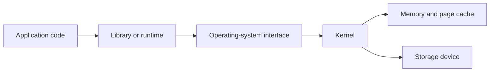

An application developer may think of this as “read a file.” A systems engineer asks more questions. Is the data already in memory? Will the call block? What happens if the file is larger than available memory? Who checks permissions? What happens if the disk is slow or disconnected? How many file descriptors can the process open? What does the application observe when the operation fails?

Both developers are using the same system. The systems engineer is responsible for understanding more of the path and its consequences.

## Systems software and business software

Business software usually represents business concepts such as customers, orders, invoices, products, or permissions. Systems software usually provides the mechanisms that allow other software to run, communicate, store data, or use hardware.

The boundary is not absolute. A database contains business data, but its storage engine is systems software. A cloud control plane may expose business APIs, but it also manages processes, machines, networks, and storage. A web server may serve application content, but it must manage sockets, connections, buffers, timeouts, and processes.

It is more useful to ask what a component is responsible for than to ask which category its name belongs to.

```text
Business or application layer
    Orders, users, search, payments, reports

Systems and infrastructure layer
    Databases, runtimes, proxies, queues, filesystems, schedulers

Operating-system layer
    Processes, memory, files, networking, devices, security

Hardware layer
    CPUs, memory chips, storage devices, network interfaces
```

The layers are connected. A business decision can create a systems problem. For example, a feature that lets users upload large files may require streaming, temporary storage, limits, backpressure, cleanup, and protection against disk exhaustion.

## The operating system as a resource provider

The operating system manages hardware resources and provides controlled interfaces for programs to use them. It decides which process runs on a CPU, which memory pages belong to a process, which files can be opened, how data is sent through a network interface, and which operations a user is allowed to perform.

The operating system is not simply a collection of utilities. It is an active manager of shared resources.

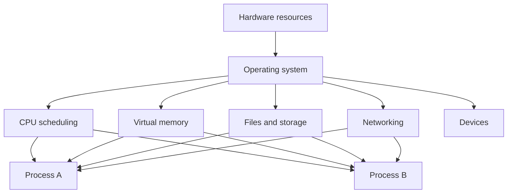

The operating system provides several important properties.

### Abstraction

An abstraction gives a program a simpler interface than the underlying hardware. A program can use a file instead of knowing the physical location of every disk block. It can use a virtual address instead of directly managing physical memory. It can use a socket instead of controlling every network device operation.

An abstraction is not magic. It hides detail, but the hidden detail still affects behavior. A file read can be fast when data is in the page cache and slow when the storage device must be accessed. A memory access can be cheap when the page is mapped and expensive when it causes a page fault. A socket write can block when buffers are full.

### Isolation

The operating system prevents one process from freely reading or modifying another process's memory. It also checks permissions before allowing access to files, devices, and other protected resources.

Isolation makes it possible for multiple programs to share one machine without every program being trusted completely. It is not absolute. Bugs in the kernel, unsafe configuration, or excessive privileges can weaken the boundary.

### Multiplexing

Multiplexing means sharing one resource among multiple users. The operating system gives different processes turns on a CPU, maps different virtual address spaces onto physical memory, and shares a network interface among many connections.

Multiplexing creates contention. If many processes need the same CPU or disk, they must wait or compete. The resulting delay is part of the system's behavior.

### Lifetime management

Resources have lifetimes. A file descriptor must be opened before it can be used and closed when it is no longer needed. Memory must be allocated before it is accessed and released or reclaimed later. A process must be started, monitored, and eventually terminated.

Many production failures are lifetime failures: a connection is never returned to a pool, a file descriptor is leaked, a temporary file is not removed, or a process keeps a resource longer than expected.

## A resource is never free

Every operation consumes some resource, even when the code looks simple.

Creating a thread consumes memory and scheduler capacity. Opening a connection consumes a file descriptor, kernel state, buffers, and often a slot in a remote service. Reading a file consumes CPU time and may consume memory for cached data. Sending a network request consumes bandwidth, socket buffers, CPU, and the attention of another service.

This is why systems engineers ask what an operation costs and how that cost grows.

For example, if one request uses two database connections and a service receives 1,000 concurrent requests, the service may need up to 2,000 connections unless it limits or shares them. The database may reject the connections, spend too much time managing them, or run out of memory. The original code may appear correct for one request but fail when resource usage scales.

This is the beginning of capacity reasoning: connecting an operation to the resources it consumes.

## Ownership and lifetime

Ownership answers the question, “Who is responsible for this resource?” The owner may be a process, a thread, a service, a team, or a component inside a program.

If ownership is unclear, cleanup and failure handling are usually unclear as well. Suppose a function opens a file and returns a data structure. Who closes the file? If the caller does not know that the structure contains an open descriptor, the descriptor may remain open until the process reaches its limit.

Good systems make ownership visible. A component should know:

- Who creates the resource
- Who is allowed to use it
- Who releases it
- What happens when the owner crashes
- What happens when the resource becomes unavailable

Different languages express ownership in different ways. Rust uses ownership and borrowing rules in the type system. C relies more heavily on conventions and explicit cleanup. Garbage-collected languages reclaim some memory automatically, but they do not automatically solve every resource-lifetime problem. A database connection, file descriptor, lock, or network session may still need deliberate management.

The language can help enforce ownership, but the engineering responsibility exists regardless of the language.

## Limits and exhaustion

Resources are finite. A system can run out of memory, CPU capacity, disk space, file descriptors, network ports, connections, or queue capacity.

Resource limits are not always signs of a broken system. A limit can protect the system from one component consuming everything. A bounded connection pool prevents a service from creating unlimited database sessions. A bounded queue prevents memory from growing forever when producers are faster than consumers.

The important question is what the system does at the limit.

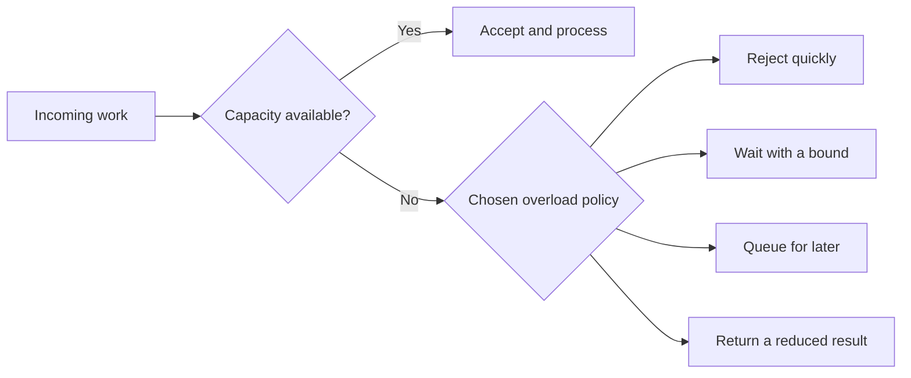

An unbounded queue often looks friendly because it accepts all work. In reality, it moves the failure into memory usage and increases latency until the process becomes unstable. A bounded queue forces the system to make an explicit decision: reject, wait, delay, or degrade.

This is why resource limits are part of correctness, not only operations. A system that behaves correctly only while resources are unlimited is incomplete.

## Failure handling is part of the design

Systems programming assumes that operations can fail. A file may not exist, a device may return an error, a process may be killed, memory allocation may fail, a network connection may close, and a dependency may respond too slowly.

The correct response depends on the operation. A temporary network failure may be worth retrying. A malformed request should usually be rejected. A failed write may require rolling back an in-memory change. A process may need to restart, but an automatic restart is useful only if the underlying cause does not immediately make the new process fail again.

Failure handling must also consider partial completion. An operation can fail after doing part of its work. For example, a service may save a record successfully but lose the network connection before sending the response. The client may retry, creating a duplicate unless the operation is designed to be idempotent.

Idempotent means that repeating the same request produces the same final effect as performing it once. Setting a resource to a value is often easier to make idempotent than incrementing a counter or charging a payment. This distinction becomes important later in networking, databases, and distributed systems.

## Determinism and repeatability

Deterministic behavior means that the same inputs and relevant state produce the same result. Determinism is valuable because it makes systems easier to test, debug, and reason about.

Systems are often not completely deterministic. Thread scheduling can change the order of operations. Network messages can arrive at different times. Disk latency can vary. Random identifiers and clocks can change results. The goal is not to pretend that these sources of variation do not exist. The goal is to control them where possible and make the remaining behavior observable.

For example, a concurrent program may have a race condition (the result depends on an uncontrolled timing relationship between operations). The program may pass a test many times and fail only under a particular schedule. A systems engineer must understand that “it passed once” is weak evidence when timing can change the result.

Determinism also matters for builds and deployments. If the same source code produces different artifacts depending on the machine or time of day, debugging and rollback become harder. Reproducible builds and explicit configuration reduce that uncertainty.

## Performance is a constraint, not a decoration

Performance describes how efficiently a system uses resources and how quickly it responds. Two terms are especially important.

**Latency** is the time taken by one operation.  
**Throughput** is the amount of work completed in a period of time.

A system can have high throughput but poor latency if it processes many requests in batches while each request waits a long time. It can also have low latency for a small number of requests but poor throughput when concurrency increases.

Performance decisions should begin with the requirement and evidence. If users need a response within 100 milliseconds, average latency is not enough; tail latency matters because a small group of very slow requests may still create a poor experience. If a batch job must process millions of records overnight, throughput may matter more than the latency of any individual record.

The systems view asks where time is spent:

```text
Request latency
  = queue waiting
  + CPU work
  + memory stalls
  + storage I/O
  + network time
  + dependency time
  + response processing
```

This is a model, not a universal equation. Its purpose is to prevent vague statements such as “the service is slow” from becoming the entire diagnosis.

## Security boundaries and control

A security boundary separates code or users with different levels of trust. User space and kernel space form one important boundary. A process boundary separates one address space from another. A service boundary can separate teams, credentials, and data ownership.

The boundary is useful only if the system enforces it. A file permission, capability, sandbox, or API authorization check is meaningful only when every relevant access path passes through the check.

Control means deciding more directly how a resource behaves. Convenience means relying on a higher-level layer to make that decision for you. A managed runtime may automatically reclaim memory, schedule work, and provide networking APIs. This improves developer productivity, but it also means the program must understand the runtime's pauses, buffers, limits, and failure behavior when those details affect the system.

More control is not automatically better. Direct control can improve predictability or performance, but it also creates more responsibility. A custom allocator can fit a workload well, but it must handle alignment, fragmentation, concurrency, and failure. A manually managed connection can avoid pooling overhead, but the program must handle cleanup and limits correctly.

Good engineering chooses the lowest level of control that satisfies the real requirements.

## Why abstractions leak

An abstraction leak occurs when details hidden by an interface affect the behavior that the user can observe.

A file abstraction hides disk blocks, but disk latency can still affect a file read. A socket abstraction hides packet transmission, but network loss and congestion can still delay a response. A memory abstraction hides physical pages, but page faults and cache misses can still affect performance. A database abstraction hides storage records, but indexes, locks, and log flushing can still affect latency and durability.

The existence of a leak does not mean the abstraction is bad. Abstractions are valuable because they reduce the amount of detail most code must manage. The systems engineer needs to know which hidden details matter for the current problem and when to look below the abstraction.

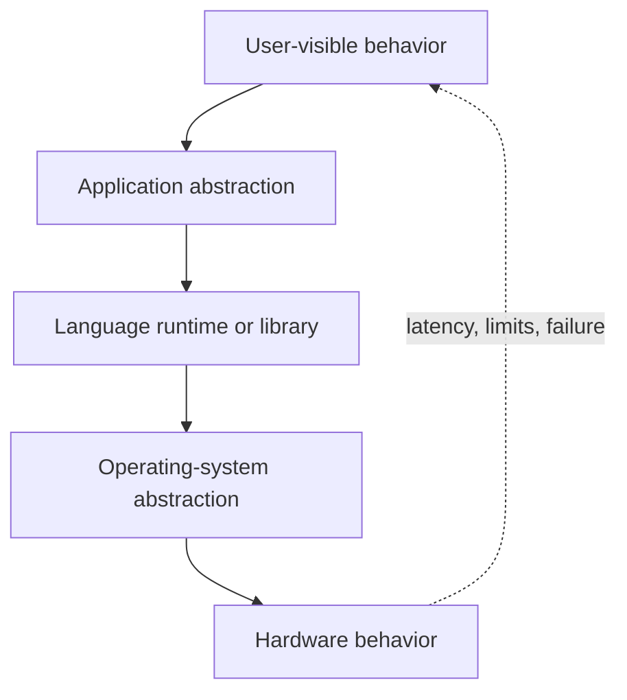

The dotted path is the important lesson. Hidden layers still influence visible behavior through latency, limits, errors, resource consumption, and failure.

## A small code example: convenience versus control

The following Go program uses a high-level file API. It does not directly manipulate a disk or issue raw device commands. The operating system still manages the file descriptor, permissions, page cache, and storage interaction underneath it.

```go
package main

import (
	"fmt"
	"os"
)

func main() {
	data, err := os.ReadFile("message.txt")
	if err != nil {
		fmt.Printf("read message.txt: %v\n", err)
		return
	}

	fmt.Print(string(data))
}
```

This is convenient because the program does not need to manage the individual read operations. The operating system and the Go runtime handle that work. But the abstraction does not remove the underlying costs. The file may be large, the read may fail, the path may be inaccessible, and the data may come from storage rather than memory.

If the program needs to process a very large file, reading the entire file at once may consume too much memory. The engineer may choose a streaming interface instead. That is a systems decision: the higher-level operation is convenient, but the resource behavior determines whether it is appropriate.

## How experienced engineers reason about a systems problem

When a system behaves unexpectedly, an experienced engineer usually moves through a sequence like this:

1. Define the symptom precisely. “The service is slow” is not enough; identify which operation is slow, for whom, and under what load.
2. Identify the resources involved. Consider CPU, memory, storage, network, queues, locks, and dependencies.
3. Find the relevant boundary. The delay may be inside the process, in the kernel, on a device, or in another service.
4. Check the limits and ownership. Look for exhausted descriptors, full queues, memory pressure, connection limits, or unclear cleanup.
5. Collect evidence. Use logs, metrics, traces, system tools, packet captures, or a small reproduction.
6. Choose the smallest safe change that addresses the cause.
7. Make the result observable and reversible.

This approach is useful because it connects the high-level symptom to the lower-level mechanism without assuming that the first explanation is correct.

## What this means for the rest of the roadmap

The rest of systems engineering is a deeper study of the relationships introduced here.

Processes explain isolation, scheduling, and ownership of execution. Virtual memory explains how the operating system gives each process an address space while sharing physical memory. Files and sockets explain how programs interact with storage and networks. Concurrency explains what happens when multiple operations share state. Distributed systems extend the same problems across machines where communication is slower and failure is more complicated.

The same questions will keep returning:

- What resource is being used?
- Who owns it?
- What are its limits?
- What happens when the operation blocks or fails?
- Which boundary does the request cross?
- What does the abstraction hide?
- How do we measure the behavior?
- What tradeoff are we accepting?

Those questions are the foundation of systems thinking.

## Interview definition

> Systems programming is the development of software that manages or directly depends on resources such as CPU, memory, storage, devices, and networks.

### If asked for more detail

> The main difference from ordinary application programming is the level of responsibility. Systems software must reason more directly about resource ownership, limits, performance, isolation, and failure. Examples include operating-system components, databases, runtimes, compilers, storage engines, and network services.

### What is the operating system's role?

> The operating system manages shared hardware resources and provides controlled interfaces that programs use to access them. It also provides isolation, protection, scheduling, and resource limits.

### Why do abstractions leak?

> An abstraction hides implementation details, but those details can still affect observable behavior. For example, a file API hides disk operations, but disk latency, caching, and storage failure can still affect the program.

### Is systems programming only about C or Rust?

> No. The language is only one part of the decision. Systems programming is defined more by the software's responsibility and resource behavior. C, Rust, Go, Zig, and other languages can all be used for systems work when their tradeoffs fit the requirements.

## Common misconceptions

### “Systems programming means writing kernel code.”

Kernel development is one form of systems programming, but databases, compilers, runtimes, filesystems, proxies, storage engines, and infrastructure services are also systems software.

### “High-level languages cannot be used for systems work.”

A high-level language may provide useful control over networking, concurrency, memory, and processes. The important question is whether its runtime behavior and performance are appropriate for the system being built.

### “The operating system hides everything important.”

The operating system hides many implementation details, but resource limits, scheduling, caching, permissions, and failure still affect applications.

### “More control is always better.”

More control can improve predictability, but it also creates more responsibility and more ways to make mistakes. The best design uses enough control to meet the requirements without adding unnecessary complexity.

## Summary

Systems programming is about building software that manages resources and provides reliable foundations for other software. The operating system supplies abstractions, isolation, multiplexing, and lifetime management, but the underlying limits and failure modes remain important.

The central systems-engineering habit is to connect a high-level operation to the resources and boundaries underneath it. When a program reads a file, sends a request, creates a thread, or writes to a database, ask what the operation consumes, who owns that resource, what can block or fail, and how the behavior can be observed.

## If you want to build this later

Build a small resource-inspection command-line tool. It can start with a command that reads a file and reports its size, then grow to show the process's open file descriptors, memory usage, CPU time, and network connections.

The purpose is not to build a complete replacement for operating-system tools. It is to connect a high-level program to the resources it uses and gradually make those resources visible. Later articles about processes, memory, files, and networking can extend the same project.

## Chapter 2 — CPU, Memory, Storage, and Network Resources

*This chapter continues the same running examples — the tiny command-line program, its compiled form, and its processes and threads — so the chain from the previous chapter stays unbroken.*

## What is a resource?

A resource is something a system consumes to perform work and that has a limited capacity or cost. CPU time, memory space, disk bandwidth, and network bandwidth are resources, but so are file descriptors, database connections, threads, queue slots, and locks.

The four resources in this article are useful because they form the basic path of many operations:

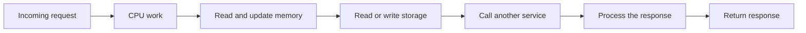

Not every request uses all four resources in the same way. A computation-heavy request may spend almost all its time on the CPU. A file download may spend more time waiting for storage or the network. A request to another service may spend most of its time waiting for the remote service to respond.

The diagram is not a fixed sequence. A real system may read from memory before storage, use the network several times, or process many operations concurrently. It is a starting model for asking where time and capacity go.

## CPU: the resource that executes work

The CPU executes instructions. Instructions perform operations such as arithmetic, comparisons, branches, memory accesses, function calls, and synchronization.

When people say that a program “uses CPU,” they usually mean that the program is actively consuming processor time instead of waiting for another resource. CPU usage is not automatically bad. A CPU running at high utilization may mean the system is using its hardware efficiently. It becomes a problem when work cannot finish within its required latency, tasks wait too long for CPU time, or there is no capacity left for important work.

### CPU capacity

CPU capacity depends on more than the number of cores. It also depends on clock speed, instruction cost, cache behavior, branch prediction, memory latency, and the work being performed.

A core can execute only a limited amount of work at a time. If more runnable work exists than the available cores can execute, the operating system schedules that work over time. Some tasks run while others wait.

```text
Available CPU capacity
    = number of usable cores
    × effective work per core
    × time available
```

This is a simplified model. Effective work per core changes with the instruction mix, cache misses, branch behavior, CPU frequency, and other activity on the machine.

### CPU-bound work

A workload is CPU-bound when the CPU is the main limit on how quickly it can progress. Examples include compression, encryption, image processing, parsing, compilation, and numerical calculations.

If a CPU-bound program receives more CPU capacity and the work scales well across cores, its throughput may improve. If the program is single-threaded, adding more cores may not help. If threads share a lock or compete for memory bandwidth, adding more threads may make the program slower.

This is why “use more threads” is not a universal performance solution. Threads still need CPU time, and coordination between threads has a cost.

### CPU waiting is different from CPU usage

A service can have low CPU utilization and still be slow. It may be waiting for storage, a network dependency, a lock, or a queue. Conversely, a service can have high CPU utilization and still have good latency if the work is predictable and there is enough capacity.

CPU utilization answers “how busy is the processor?” It does not answer “how long is a request waiting?” Both questions matter.

### CPU scheduling and fairness

The operating system scheduler decides which runnable thread receives CPU time. It tries to share the CPU according to priorities and scheduling policies, but the result is not that every task runs continuously.

A context switch occurs when the CPU stops running one thread and starts running another. Context switches are necessary for sharing the CPU, but they require saving and restoring execution state and may reduce cache locality. Excessive thread creation, too many runnable tasks, or heavy synchronization can increase scheduling overhead.

The detailed behavior of scheduling and context switches belongs in later articles. The important point here is that CPU is a shared resource, and waiting for CPU is different from waiting for I/O.

## Memory: the resource that holds active state

Memory, usually referring to RAM in this context, holds the instructions and data that active programs need. The CPU can access memory much faster than storage, but memory is limited and loses its contents when power is removed.

Memory is used for more than application objects. A process also needs memory for its code, stacks, heaps, shared libraries, runtime structures, buffers, caches, and operating-system bookkeeping.

### Why memory matters

When a program needs data, the data must be available through a memory path before the CPU can work with it. If the data is not in a nearby cache, the CPU waits longer. If it is not mapped in the process's usable memory, the operating system may need to handle a page fault. If the system is under memory pressure, it may reclaim pages or move data to storage.

These events have different costs, but they all show the same principle: memory behavior affects CPU progress.

### Memory capacity and memory bandwidth

Memory capacity is how much data can be held. Memory bandwidth is how quickly data can be transferred. Memory latency is how long it takes to begin receiving data after requesting it.

A workload may have enough memory capacity but still be limited by memory bandwidth. For example, a program that scans a very large array repeatedly may spend more time moving data than performing calculations.

Another workload may fit comfortably in total memory but perform poorly because it accesses data randomly and misses the CPU caches frequently. This is why the amount of memory alone does not describe memory performance.

### Memory pressure

Memory pressure occurs when active demand approaches or exceeds the memory available to the system. The operating system may reclaim unused cache pages, compress memory, swap pages to storage, or terminate a process when it cannot satisfy the demand.

Swapping means moving memory pages between RAM and storage to free RAM for other work. Storage is much slower than RAM, so heavy swapping can cause a system to spend most of its time moving pages instead of doing useful work. This condition is called thrashing.

Memory pressure can also create indirect failures. A process may spend more time waiting for page faults. The garbage collector of a managed runtime may run more often. The operating system may kill a process. A cache may evict useful data and force repeated reads from a slower layer.

### Memory ownership

At the application level, memory may be owned by a data structure, request, thread, process, or cache. At the operating-system level, memory is associated with address spaces and pages.

Ownership matters because memory that is no longer needed must become reclaimable. A memory leak occurs when a program keeps references to memory that it no longer needs, preventing that memory from being reused. A cache that grows without a bound is a form of resource-management failure even if every cached object is technically valid.

The virtual-memory article later will explain how each process receives an address space and how the operating system maps that address space to physical memory.

## Storage: the resource that keeps data

Storage keeps data beyond the lifetime of a process and usually beyond a machine restart. Examples include hard drives, SSDs, NVMe devices, distributed filesystems, and object-storage services.

Storage has several properties that must be considered separately:

- Capacity: how much data can be stored
- Throughput: how much data can be read or written per second
- Latency: how long one operation takes
- IOPS: how many individual input/output operations can be completed per second
- Durability: whether acknowledged data survives failures
- Availability: whether the data can be accessed when needed

A storage device can have high throughput and still have poor latency for small random reads. It can have low latency for cached data while a cache miss requires a much slower device operation. It can have enough capacity today but grow beyond its limit next month.

### Storage is not just a large memory

Storage and memory both hold data, but they serve different roles. Memory is designed for fast access by active programs. Storage is designed to retain data and provide more capacity, usually with higher access latency.

The operating system often makes storage appear more memory-like through the page cache. Recently used file data may be kept in memory, so reading the same file again can be much faster. This can make a program appear fast during a test while behaving differently after a restart or under memory pressure.

The page cache is useful, but it can also hide the real storage behavior. A benchmark that reads the same small file repeatedly may measure memory rather than the storage device.

### Storage durability

Durability answers whether data remains available after a failure such as a process crash, operating-system crash, power loss, or device failure.

An application may write data into a process buffer or the operating-system page cache and receive a successful return before the data is physically durable on the device. The exact guarantees depend on the filesystem, storage device, operating system, and flush operations.

This is why databases use techniques such as write-ahead logging and explicit synchronization. They need a reliable boundary that separates “the program requested the write” from “the system can recover the write after a crash.”

### Storage pressure

Storage pressure is not only “the disk is full.” It can also mean that the device is too slow, I/O queues are full, writeback is delayed, or a filesystem has run out of inodes or other metadata capacity.

When storage fills, normal operations may fail in surprising places. A service may be unable to write logs, create temporary files, update a database, or create a socket-related state file. Disk-full conditions should be treated as a planned failure mode, not an impossible event.

## Network: the resource that connects systems

The network moves data between processes, machines, services, regions, and sometimes continents. It introduces a boundary that is different from a function call inside one process.

Network communication can be delayed, lost, duplicated, reordered, rejected, or interrupted. Even when a reliable transport such as TCP is used, the application still has to handle connection establishment, timeouts, remote process failure, and the possibility that a request completed even though its response did not arrive.

### Network capacity

Network capacity includes bandwidth, packet-processing capacity, connection capacity, and the ability of the receiving service to process incoming work.

Bandwidth is the amount of data that can be transferred over a period. Latency is the time taken for data to travel and be processed. A high-bandwidth link can still have high latency. A low-latency link can still become congested when too much data is sent.

```text
Network request time
    = connection setup
    + request transmission
    + server queueing
    + server processing
    + response transmission
```

This is a simplified model, but it shows why network latency is not only the physical distance between two machines. Queueing, encryption, routing, server load, and application processing all contribute.

### Network connections are resources

A connection consumes state in the client, the server, the operating system, and sometimes load balancers or firewalls. A service that creates a new connection for every request may spend significant time on setup and may exhaust connection limits.

A connection pool keeps a bounded number of established connections available for reuse. Each request borrows a connection, performs its work, and returns it. This avoids repeated setup, but it also introduces a new limit: requests may wait for a pool slot when every connection is busy.

The pool does not remove the resource constraint. It makes the constraint explicit and controllable.

### Network failure and timeouts

A network call cannot be allowed to wait forever. A timeout places an upper bound on how long the caller waits before treating the operation as failed. The timeout must be chosen with care. A timeout that is too short rejects slow but valid work. A timeout that is too long ties up threads, memory, connections, and request slots.

Timeouts also do not necessarily cancel work on the remote server. The client may stop waiting while the server continues processing the request. If the client retries immediately, both the original operation and the retry may be running.

This is why network reliability requires more than adding retries. The system must consider idempotency, cancellation, backpressure, connection limits, and the effect of extra requests on a struggling dependency.

## The resources interact

The four resources must be studied separately, but production behavior usually comes from their interaction.

### CPU and memory

A program may have enough CPU capacity but run slowly because it waits for memory accesses. It may also use more CPU because memory pressure causes repeated work, garbage collection, decompression, or page faults.

Adding memory can improve performance when it prevents swapping or allows useful data to remain cached. It may not help when the real problem is expensive computation or a lock that serializes all work.

### Memory and storage

The page cache uses memory to accelerate storage. Increasing memory can reduce storage reads, but a large cache also consumes memory that other processes may need. A database buffer pool makes a similar tradeoff deliberately.

When memory pressure removes cached pages, storage traffic can increase. When storage becomes slow, requests may remain active longer and consume more memory while waiting. A storage problem can therefore become a memory problem.

### CPU and network

Encryption, compression, serialization, packet processing, and TLS can consume CPU. Sending less data may reduce network time but require more CPU for compression. Sending compressed data may improve throughput while increasing latency for small responses.

The best choice depends on whether the system is limited by CPU, bandwidth, latency, or the cost of handling the data.

### Network and storage

A service may read data from storage and send it across the network. The faster component does not determine the total time if another component is slower. A fast disk cannot make a distant client receive data faster than the network allows. A fast network cannot help if the storage engine takes too long to produce the response.

### Queues connect resource limits

When a resource is busy, work waits in a queue. Queues may be explicit, such as a message queue, or hidden, such as threads waiting for a lock, requests waiting for a connection, or packets waiting in a network buffer.

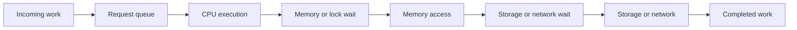

Queueing increases latency. If arrivals are faster than service for long enough, the queue grows until it reaches a limit. At that point, the system must reject work, drop work, delay work, or fail.

This is why throughput and latency cannot be discussed independently. A system may process work at a high average rate but still have unacceptable latency when queues grow near saturation.

## Capacity, utilization, and saturation

Capacity is the amount of work a resource can handle under defined conditions. Utilization is how much of that capacity is currently being used. Saturation is the point where additional work mostly creates waiting rather than useful progress.

These terms are related but not identical.

Imagine a service with four workers processing requests. If all workers are busy but requests finish quickly and no queue forms, utilization is high without immediate saturation. If requests arrive faster than the workers can finish them, the queue grows and the service is becoming saturated.

Utilization is also not always measured correctly. CPU utilization may look low if threads are blocked on storage. Storage utilization may look low while requests wait for a lock before reaching storage. Network bandwidth may be available while a remote service is overloaded.

Good diagnosis examines both the resource and the waiting around it.

## Finding the bottleneck

A bottleneck is the part of a system that limits the overall progress of the workload. The bottleneck may move as the system changes.

Suppose an application reads a large file and sends it to a client. At first, storage may be the bottleneck. Adding a faster disk may reveal that the network is now the bottleneck. Compressing the data may reduce network usage but make CPU the bottleneck. Increasing CPU may reveal that the client connection is slow.

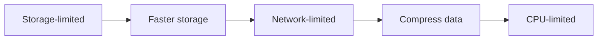

This is why optimization must be measured. Improving a component that is not limiting the workload may have little effect. It may also move the bottleneck somewhere else without improving the end-to-end result.

A useful investigation asks:

1. What user-visible behavior is too slow or failing?
2. Where does the request spend its time?
3. Which resources are busy, and which are waiting?
4. Are queues growing?
5. Is the resource shared with other work?
6. What happens as load increases?
7. What evidence would distinguish the possible causes?

## A realistic production example

Imagine an API that returns a list of products. Users report that it becomes slow during a sale.

The first assumption might be that the database is too slow. Metrics show that database CPU is only 35 percent, but the application has many requests waiting for database connections. The connection pool is too small, so requests wait before their queries even begin.

The team increases the pool size. Latency improves briefly, but the database now receives more concurrent queries than it can process. Database CPU reaches 100 percent, lock waits increase, and all requests become slower.

The team investigates the query and finds that the endpoint reads more columns and rows than it needs. It adds a suitable index, reduces the result, and caches product data that changes infrequently. The final solution is not “increase the pool.” It is a combination of reducing work, controlling concurrency, and reusing stable results.

The lesson is that a resource limit is often a symptom of a deeper mismatch between workload, capacity, and system design. Increasing a limit can help, but it can also move the overload to the next component.

## How to observe the resources

The exact tools depend on the operating system, but the questions are consistent.

For CPU, inspect utilization, run queues, context switches, and profiling data. For memory, inspect resident usage, allocation behavior, page faults, cache pressure, and swapping. For storage, inspect latency, throughput, queue depth, I/O errors, and filesystem capacity. For networks, inspect connection counts, latency, retransmissions, packet loss, bandwidth, and remote-service response time.

On Linux, tools such as `top`, `vmstat`, `iostat`, `pidstat`, `ss`, `lsof`, `df`, and `strace` can provide useful evidence. These tools do not automatically identify the cause. They show different parts of the system, and the engineer must connect the observations to a hypothesis.

For example, high CPU does not prove that inefficient computation is the root cause. It may be caused by a retry loop, excessive serialization, busy polling, or a cache-miss pattern. A full disk does not prove that application data grew unexpectedly; logs, temporary files, or deleted files still held open may be responsible.

The tool is only useful when paired with a question.

## Interview definitions

### What are the main resources a system manages?

> The main resources are CPU for executing work, memory for active data and program state, storage for persistent data, and the network for communication between components.

### What is a CPU-bound workload?

> A CPU-bound workload is mainly limited by the amount of processor time available to execute its instructions.

### What is a memory-bound workload?

> A memory-bound workload is mainly limited by memory capacity, memory bandwidth, or the time required to access data rather than by computation alone.

### What is the difference between storage capacity and storage performance?

> Capacity is how much data storage can hold. Performance includes how quickly it can read or write data, how long individual operations take, and how many operations it can handle concurrently.

### What is network latency?

> Network latency is the time required for communication to travel through the network and for the remote system to process the request and produce a response.

### What is a bottleneck?

> A bottleneck is the part of a system that limits the overall progress of the workload.

### What is resource contention?

> Resource contention occurs when multiple operations compete for the same limited resource, causing some of them to wait.

### What is saturation?

> Saturation occurs when a resource is busy enough that additional work mostly increases waiting instead of increasing useful throughput.

## Interview follow-up questions

### How do you find whether a service is CPU-bound or I/O-bound?

> I measure where requests spend their time and compare CPU activity with the relevant I/O and wait signals. High CPU with little blocking suggests CPU-bound work, while low CPU with requests waiting on storage, network calls, locks, or queues suggests an I/O or coordination bottleneck. I would confirm the hypothesis with profiling and tracing rather than relying on one utilization number.

### Why can a system be slow when CPU usage is low?

> The system may be waiting for storage, a network dependency, a lock, a connection pool, or a queue. CPU utilization measures processor activity, not the total time a request spends waiting.

### Why does adding capacity sometimes make a system worse?

> Increasing capacity at one layer can send more work to a downstream layer that is already saturated. For example, increasing an application's database connection pool may increase database contention and make every query slower.

### Why are bounded resources useful?

> Bounds prevent one workload from consuming all available memory, connections, threads, or queue space. They force the system to choose an overload behavior such as rejection, waiting, queuing, or graceful degradation.

### What is the difference between latency and throughput?

> Latency is how long one operation takes. Throughput is how much work the system completes per unit of time. A system can have high throughput but poor latency if requests wait in large queues or batches.

## Common misconceptions

### “High CPU usage always means the system is unhealthy.”

High CPU may mean the system is using its available capacity efficiently. It becomes a problem when important work waits too long, latency increases, or the system has no headroom for bursts and failures.

### “More memory always makes a system faster.”

More memory can reduce swapping and keep more useful data cached, but it does not fix CPU work, lock contention, slow networks, or inefficient algorithms. Memory can also hide storage behavior during tests.

### “A fast network means network calls are cheap.”

Network calls still have connection setup, serialization, encryption, routing, queueing, remote processing, timeout, and failure costs.

### “A full disk is the only storage problem.”

Storage can also be a problem because of high latency, queueing, I/O errors, exhausted metadata, delayed writeback, or insufficient durability guarantees.

### “The bottleneck is always the busiest resource.”

The busiest resource is a useful clue, but not proof. A low-utilization component can still be on the critical path, and a busy component may be doing useful work without limiting user-visible progress.

## Summary

CPU, memory, storage, and network are the main resources behind most software systems. CPU executes instructions, memory holds active state, storage preserves data, and the network connects components across boundaries.

Each resource has capacity, latency, throughput, limits, and failure modes. They also interact: memory pressure can increase storage traffic, storage delays can increase memory usage, network calls can consume CPU and connection capacity, and adding capacity in one layer can overload another.

The systems-engineering approach is to connect user-visible behavior to resource usage and waiting. Measure the bottleneck, understand the limit, choose an overload policy, and make the result observable. Do not optimize a resource merely because its number looks large; understand whether it is actually limiting the work.

## If you want to build this later

Build a small command-line resource observer that runs another program and records how it uses the machine.

Start by recording elapsed time and exit status. Then add CPU time, maximum memory, output size, and the number of opened files. Later, run a program that reads a large file, performs CPU work, and makes a network request. Compare which resource changes when you modify the input size, file location, or number of concurrent requests.

The goal is not to recreate `top` or build a perfect monitoring system. The goal is to connect an operation to the resources it consumes and learn to distinguish active work from waiting.

## Chapter 3 — Resource Ownership and Limits

*This chapter continues the same running examples — the tiny command-line program, its compiled form, and its processes and threads — so the chain from the previous chapter stays unbroken.*

## What ownership means

Ownership is responsibility, not necessarily exclusive access.

If a service creates a database connection, ownership means the service is responsible for deciding when the connection is created, how it is used, how it is returned or closed, and what happens if the connection becomes invalid. Several requests may share a connection pool, but the service still owns the pool as a resource.

If a function allocates memory and returns an object, ownership means that some part of the program is responsible for keeping the object valid and eventually making the memory available for reuse. The object may be shared, but the program still needs a clear rule for its lifetime.

Ownership can exist at several levels:

```text
Machine or cluster
  └── Service
        └── Process
              └── Thread or request
                    └── Function or data structure
```

At each level, an owner may create smaller resources and pass them to another component. The handoff must be clear. Otherwise, two components may both release the resource, or neither may release it.

## Ownership is not the same as access

A component may be allowed to use a resource without being responsible for its entire lifetime. For example, a request handler may borrow a database connection from a pool. The handler can use the connection while it performs its database work, but it should not permanently close the connection when the request finishes. The pool owns the connection, so the handler must return it and let the pool decide whether to reuse it or close it.

Likewise, several threads may read shared memory. The thread that reads the memory does not necessarily own the memory. Another component may control when it is safe to free or replace it.

This distinction becomes important when resources are shared. A resource can be:

- Owned by one component and used by many components
- Owned by a parent and temporarily borrowed by a child
- Owned by a pool and leased to individual operations
- Owned by the operating system and represented by a handle in a process
- Owned by a service while clients are allowed to access it through an API

The more sharing exists, the more important the lifetime and release rules become.

## A resource has a lifecycle

Most resources follow a lifecycle like this:

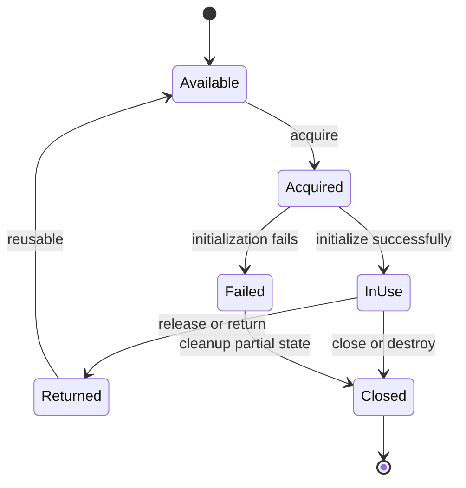

The exact states differ by resource, but the lifecycle questions are similar:

1. How is the resource acquired?
2. What must be initialized before use?
3. Who may use it?
4. Is it reusable or single-use?
5. How is it released?
6. What happens if initialization fails halfway through?
7. What happens if the owner crashes?
8. How do we know that the resource is no longer usable?

Ignoring one of these questions often creates a leak, double release, use-after-close, or stale resource.

## Ownership transfer and borrowing

When one component gives a resource to another, there are two common models.

### Transfer of ownership

The original owner gives responsibility to the new owner. After the transfer, the original component must stop using the resource unless ownership is transferred back.

This model makes lifetime reasoning simpler because one component is responsible at a time. It is common for a process to create a resource and pass it to a worker that becomes responsible for closing it.

### Borrowing

The original owner keeps responsibility while another component uses the resource temporarily. The borrower must follow rules such as not closing the resource, not using it after the borrow ends, and not modifying it in unsafe ways.

Borrowing is useful for pools and shared data, but it requires clear boundaries. A function that returns a reference to internal state may accidentally allow the caller to keep using that state after the owner changes or destroys it.

Languages and libraries use different names for these models. The names are less important than the rule: everyone involved must know who may use the resource and who is responsible for its lifetime.

## Resource lifetime must match the work

A resource should live at the smallest useful scope.

If a file is needed for one operation, keeping it open for the entire process wastes a file descriptor and may keep storage state alive unnecessarily. If a database connection is needed for one request, holding it while waiting for unrelated work reduces the pool's capacity.

On the other hand, creating and destroying an expensive resource for every small operation may be inefficient. A connection pool or reusable buffer can reduce setup cost, but it introduces shared ownership and a limit that must be managed.

The right lifetime depends on the cost of creation, the cost of keeping the resource, the safety of sharing it, and the expected concurrency.

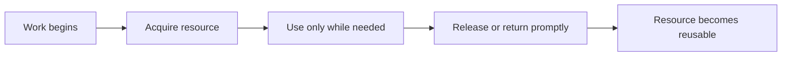

The phrase “release promptly” does not mean “release as quickly as possible” in every case. It means that the lifetime should match the actual need instead of accidentally extending because cleanup was forgotten or delayed by unrelated work.

## Cleanup is part of correctness

Cleanup is not merely an optimization. If a file descriptor is never closed, future operations may fail when the process reaches its descriptor limit. If a lock is never released, other threads may wait forever. If a connection is never returned to a pool, later requests may be unable to make progress.

A resource leak is a correctness problem because the system eventually behaves incorrectly.

In languages with explicit cleanup, code often uses a pattern that makes release close to acquisition. In Go, a file can be closed with `defer` after a successful open:

```go
file, err := os.Open("config.json")
if err != nil {
	return fmt.Errorf("open config.json: %w", err)
}
defer file.Close()

// Read and process the file here.
```

The important idea is not the specific keyword. The important idea is that the cleanup rule is established immediately after ownership is acquired. If later code returns early because of an error, the cleanup still runs.

This pattern also has limits. If `Close` can fail in a way that matters, the program must handle that error. If a resource is borrowed rather than owned, the borrower should not close it. If cleanup must happen before a transaction is committed, simply scheduling cleanup at function return may not be enough.

## Partial acquisition and failure during setup

Acquisition is not always one indivisible operation. A resource may require several steps:

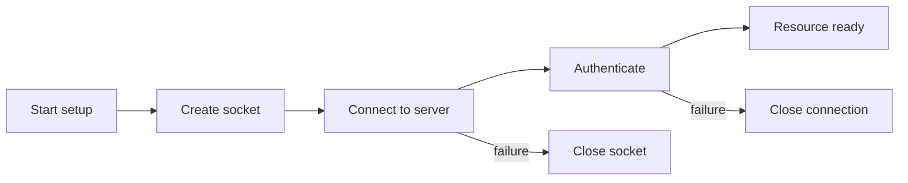

If authentication fails after a socket and connection have been created, those earlier resources still need to be released. A common bug is to clean up only when the final setup step succeeds or to forget the resources created before an error.

Every acquisition step should have a matching cleanup path. This is especially important for files, sockets, temporary directories, memory mappings, locks, and transactions.

## What happens when the owner crashes?

The operating system can reclaim some resources when a process exits. It closes the process's file descriptors, releases its address space, and removes many kernel objects associated with the process.

That does not mean process crashes are harmless. A crash may leave persistent data half-written, a distributed lock held in another system, a transaction uncertain, or a message already sent but not acknowledged. Resources owned outside the process may outlive it.

The recovery behavior depends on the resource:

- Process memory is normally reclaimed by the operating system.
- A file descriptor is normally closed, but buffered or persistent data may still need recovery.
- A database transaction may be rolled back or may require recovery.
- A remote connection may remain visible to the peer until a timeout or disconnect is detected.
- A message may have reached a consumer even if the producer crashed before recording success.
- A lock in an external system may require a lease or expiration mechanism.

This is why “the operating system cleans it up” is only a partial answer. It applies to some local resources, not to every effect the process created.

## Limits protect the system

A limit is a boundary on resource usage. Limits exist because resources are finite and because uncontrolled consumption by one component can harm other components.

Limits can be applied at different levels:

```text
Machine limit       → total CPU, memory, storage, and network capacity
Process limit       → address space, descriptors, threads, CPU time
Service limit       → connections, requests, memory, queue size
Request limit       → body size, time, items, retries, or concurrency
Tenant limit        → quota for one customer or account
```

A useful limit is not chosen only from a convenient number. It should be connected to the resource's safe capacity and the behavior the system can handle.

For example, a maximum request body size protects memory and storage. A connection-pool limit protects the database and the application. A per-tenant rate limit protects fairness. A queue length limit protects memory and latency.

## Hard limits and soft limits

A hard limit is enforced so that usage cannot pass it, or cannot pass it without a clear failure. A process may be unable to open another file after reaching its file-descriptor limit.

A soft limit is a target, warning threshold, or preferred maximum. The system may continue beyond it, but the operator or component should take action before reaching a hard failure.

Soft limits are useful for early warning. A service may alert when memory usage reaches 70 percent of its limit, leaving time to investigate before the operating system kills it. A queue may begin shedding low-priority work before it becomes completely full.

The exact meaning of “soft” depends on the system. Some operating systems expose configurable soft and hard resource limits. In application design, the terms are often used more generally to describe a warning threshold versus an enforced boundary.

## What should happen at the limit?

When a resource is exhausted, the system needs an overload policy. An overload policy is the deliberate behavior used when the system cannot accept more work immediately.

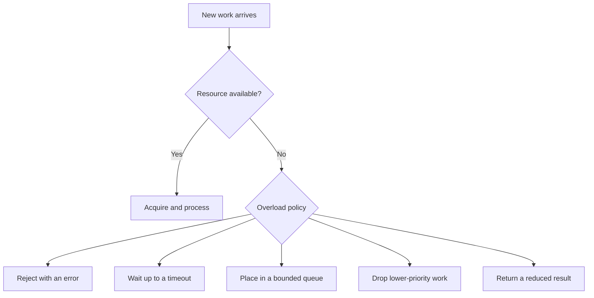

### Reject quickly

Rejecting work protects the system from accepting more than it can handle. The caller receives an error and may retry, show a message, or choose another path.

Fast rejection is often safer than accepting work that will wait so long that it times out. The error should be clear enough for the caller and observable enough for the operator.

### Wait with a bound

Waiting can be reasonable when capacity is expected to become available soon. The wait must have a timeout, otherwise blocked work can accumulate without limit.

For example, a request may wait briefly for a connection from a pool. If no connection becomes available within the request's deadline, it should fail instead of waiting forever.

### Queue for later

A queue separates the arrival of work from its processing. This is useful when work can be delayed and processed asynchronously. The queue must still be bounded or have a well-defined storage limit.

An unbounded queue turns overload into growing memory usage and increasing latency. It does not eliminate the limit; it hides the limit until the system fails in a less controlled way.

### Shed or degrade

Load shedding means refusing less important work to preserve more important work. Graceful degradation means returning a reduced result when the full result is too expensive or unavailable.

For example, a shopping page might serve cached product information while temporarily omitting personalized recommendations. This keeps the core operation available while reducing pressure on a failing dependency.

The correct policy depends on the business and technical requirements. A payment operation should not be dropped in the same way as a recommendation refresh.

## Connection pools: making a limit explicit

A connection pool keeps a bounded number of established connections available for reuse. Each request borrows one connection, performs its database work, and returns it. The application avoids repeated connection setup, and the pool prevents the database from receiving an unbounded number of concurrent sessions.

The pool creates several responsibilities:

- The pool owns creation and destruction of connections.
- A request owns a borrowed connection only for the duration of its work.
- The request must return the connection even when its operation fails.
- The pool must detect connections that are closed or unhealthy.
- The system must decide what happens when every connection is busy.

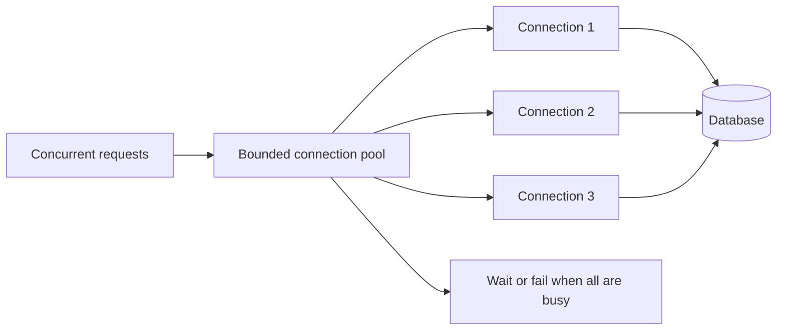

Increasing the pool size is not always an improvement. It may reduce application-side waiting while increasing database contention, memory usage, lock contention, and network load. The pool limit is part of the design of the whole system, not only an application configuration value.

## File descriptors: a concrete operating-system limit

A file descriptor is a small integer handle that a process uses to refer to an open file, socket, pipe, or another kernel-managed object. The descriptor is not the file itself. It is a process-local reference to an open resource maintained by the operating system.

This makes file descriptors a useful example of ownership:

1. A process requests a resource from the kernel.
2. The kernel returns a descriptor.
3. The process uses the descriptor in later operations.
4. The process closes the descriptor when finished.
5. The kernel releases the associated state.

If the process forgets step 4, descriptors accumulate. Eventually a new open or socket operation fails even though the machine may still have memory and storage available.

The failure can appear far away from the leak. A service may report that it cannot accept new network connections, while the real cause is that an unrelated part of the process opened files and never closed them.

This is why resource ownership and observability must work together. An owner needs a way to count, inspect, and attribute resources.

## Queue limits and backpressure

Backpressure is a way for a slower consumer to signal that a faster producer must reduce or stop sending work. It prevents the producer from overwhelming the consumer and causing unbounded buffering.

For example, if a worker can process 100 jobs per second but a producer creates 1,000 jobs per second, the difference must go somewhere. The system can queue jobs, reject them, slow the producer, or lose them. If it accepts all jobs into an unbounded in-memory queue, memory usage grows while job latency becomes worse.

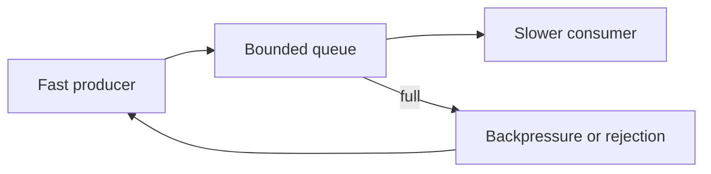

Backpressure is not the same as simply increasing the queue size. A larger queue can absorb a short burst, but it cannot fix a permanent difference between production and consumption rates. It only delays the point at which the limit is reached.

Backpressure appears in network send buffers, message brokers, stream processors, worker pools, database connection pools, and HTTP services.

## Limits and fairness

A global limit protects the whole system, but it may not protect individual users from each other. One tenant may consume most of the available connections or queue space and prevent other tenants from making progress.

Fairness means deciding how limited capacity is shared. Common strategies include per-tenant quotas, weighted priorities, concurrency limits, rate limits, and separate pools.

The choice depends on the system. A batch-processing customer may be allowed more throughput than a small customer but still have a maximum share. A health-check request may receive higher priority than a background report because it is needed to keep the service operating.

Fairness has a cost. Tracking usage and enforcing separate limits consumes memory, CPU, and operational complexity. It should be added when the risk of unfair consumption justifies that cost.

## Limits must be coordinated across layers

A limit in one component can conflict with a limit in another.

Suppose a service runs 20 worker threads but its database pool contains only 5 connections. At most 5 workers can perform database work at once; the other 15 may wait. That may be correct if the database can handle only 5 concurrent operations, or it may indicate that the service is holding workers while waiting for connections.

Now suppose the database allows 100 connections but the service runs in 50 process replicas, each with a pool of 10. The theoretical maximum is 500 connections, which exceeds the database limit. Each replica may look safe in isolation while the deployment is unsafe as a whole.

```text
Per-process pool limit
    × number of process replicas
    = possible database connections
```

Limits must be reasoned about at the scope where they apply. A local limit does not automatically protect a shared global resource.

## Observing ownership and exhaustion

A limit is useful only if the team can tell when it is being approached or reached. Useful signals include:

- Current usage
- Configured limit
- Remaining capacity
- Acquisition wait time
- Rejection count
- Timeout count
- Cleanup failures
- Resource age
- Queue length
- Resource creation rate
- Resource release rate

For a connection pool, measuring only the number of open connections is not enough. The team should also measure how long requests wait for a connection, how often acquisition times out, how long connections are held, and whether connections are returned successfully.

For memory, total usage is not enough. Allocation rate, garbage-collection activity, page faults, cache pressure, and process restarts can explain why usage is changing.

Observability should help answer both questions:

> Is the resource near its limit?

and:

> Which owner or workload is consuming it?

## A realistic production example

Imagine a service that begins returning errors during a traffic increase. The first error says “too many open files.” The team raises the process file-descriptor limit and deploys the change. The error disappears for a few hours, then returns at a larger number.

The limit was real, but increasing it did not fix the cause. The service was opening a new response body for each request and not closing it on an error path. The descriptors accumulated slowly. Eventually, the process could not accept new sockets or open required files.

The correct fix has several parts:

1. Close the resource on every ownership path.
2. Add a test for the failure path.
3. Measure open descriptors and alert before exhaustion.
4. Keep the limit high enough for legitimate load but low enough to contain damage.
5. Investigate why the leak was not visible earlier.

The limit is still valuable. It prevents unlimited growth and creates a detectable failure. But a limit should be a safety boundary, not a substitute for correct ownership.

## How to reason about a new resource

When you encounter a resource in an unfamiliar system, ask these questions:

1. What exactly is the resource?
2. What creates it?
3. Who owns it after creation?
4. Can it be borrowed or shared?
5. What state makes it usable?
6. How long should it live?
7. How is it released or returned?
8. What happens if setup fails halfway through?
9. What happens if the owner crashes?
10. What is the per-process, per-service, and global limit?
11. What happens when the limit is reached?
12. How can we observe usage, waiting, leaks, and failures?

These questions work for a file descriptor, a memory buffer, a database connection, a worker thread, a lock, a queue slot, or an external lease.

## Interview definitions

### What is resource ownership?

> Resource ownership is the responsibility for creating, using, limiting, and releasing a resource during its lifetime.

### Is ownership the same as access?

> No. A component may borrow or use a resource without owning it. The owner remains responsible for its lifetime, cleanup, and health.

### What is a resource limit?

> A resource limit is a boundary on how much of a finite resource a process, service, tenant, or system may consume.

### Why are resource limits useful?

> Limits prevent one workload from consuming all available capacity and force the system to choose an explicit behavior when it reaches the boundary.

### What is a resource leak?

> A resource leak occurs when a program keeps a resource after it is no longer needed, preventing that resource from being reused or released.

### What is backpressure?

> Backpressure is a mechanism that makes a producer slow down or stop when a consumer or downstream resource cannot accept more work.

### What is a connection pool?

> A connection pool is a bounded collection of reusable connections that prevents each request from creating a new connection and limits how many connections are used at once.

## Interview follow-up questions

### How would you design ownership for a shared connection pool?

> The pool owns creation, health checking, and destruction of connections. A request temporarily borrows one, uses it for its database operation, and returns it in both success and failure paths. The pool needs a bound and a policy for requests that arrive when every connection is busy.

### What should happen when a resource limit is reached?

> It depends on the resource and the operation. The system may reject work, wait with a timeout, queue it within a bound, shed lower-priority work, or return a degraded result. The choice should be explicit and should protect more important work.

### Why is increasing a limit not always the right fix?

> A limit may expose a leak or an underlying overload problem. Increasing it can delay the failure or move the pressure to another shared resource. I would first identify who is consuming the resource and why, then decide whether the limit or the behavior should change.

### What is the difference between a bounded and unbounded queue?

> A bounded queue has a maximum size and must apply backpressure, rejection, or another policy when full. An unbounded queue accepts more work until some other resource, usually memory, is exhausted.

### What happens to resources when a process crashes?

> The operating system usually reclaims local process resources such as memory and file descriptors, but external effects may remain. Persistent writes, remote requests, distributed locks, and messages may require their own recovery or expiration mechanisms.

## Common misconceptions

### “If the garbage collector exists, resource ownership is solved.”

Garbage collection can reclaim unreachable memory, but it does not automatically manage every resource. Files, sockets, database connections, locks, transactions, and remote leases still need explicit lifetime rules.

### “A higher limit is always safer.”

A higher limit may allow more legitimate work, but it can also increase memory usage, downstream load, queueing, and the size of a failure. The correct limit balances capacity, isolation, and recovery.

### “Closing a resource is enough.”

Closing is necessary, but the program must also close the correct resource, close it on every path, handle close errors when they matter, and avoid using it after closure.

### “A queue protects the system from overload.”

A bounded queue can absorb a temporary burst and make overload behavior explicit. An unbounded queue only moves the failure into memory and latency.

### “A process-local limit protects the whole system.”

Multiple processes or replicas may each stay under their local limit while exceeding a shared database, disk, network, or cluster limit. Limits must be analyzed at the scope of the resource they protect.

## Summary

Resource ownership defines responsibility across a resource's lifetime. A clear owner creates or acquires the resource, controls its use, releases it when appropriate, and handles failures during setup and cleanup.

Resource limits protect systems from unbounded consumption. When a limit is reached, the system should have an explicit policy such as rejection, bounded waiting, queuing, load shedding, or graceful degradation.

The most important practical lesson is that limits and ownership solve different problems. Ownership prevents leaks and unclear lifetimes. Limits contain damage and control competition. A reliable system needs both, along with enough observability to show usage, waiting, leaks, and exhaustion before they become an outage.

## If you want to build this later

Extend the resource-observer project from the previous article into a bounded worker service.

The service should accept jobs, process them with a fixed number of workers, and place waiting jobs in a bounded queue. When the queue is full, it should reject new jobs with a clear error. Add counters for accepted jobs, rejected jobs, queue length, processing time, and worker usage.

Then introduce a controlled leak by preventing one code path from returning a resource or finishing a job. Observe how usage changes, how the limit is reached, and whether the service rejects work safely. Restore the cleanup path and add a test that prevents the leak from returning.

## Chapter 4 — Failure, Determinism, and Control

*This chapter continues the same running examples — the tiny command-line program, its compiled form, and its processes and threads — so the chain from the previous chapter stays unbroken.*

## Failure is a normal system state

In simple code examples, the main path is usually written as if every operation succeeds. A file opens, a network request returns, memory is allocated, and a database accepts the write. Real systems have more possible outcomes.

An operation can:

- Succeed completely
- Fail before doing any work
- Succeed partially
- Complete remotely but fail to report the result
- Take longer than the caller is willing to wait
- Be interrupted by a crash or cancellation
- Return a result that is valid but no longer useful

These outcomes are different, and the system may need a different response to each one.

For example, if opening a configuration file fails because the file does not exist, retrying immediately may not help. If a network connection is temporarily refused, a bounded retry may be reasonable. If a payment request times out after the remote system may have accepted it, retrying without an idempotency mechanism can create a duplicate charge.

The first step in failure handling is to understand what the failure means.

## Errors, timeouts, and cancellation are different

An error is an explicit result saying that an operation did not succeed in the way requested. The program may know the reason, such as permission denied, invalid input, or a missing file.

A timeout means the caller stopped waiting after a deadline. It does not always mean that the operation failed on the other side. The remote system may still be processing it, or it may have completed just before the response was lost.

Cancellation means that the caller no longer wants the operation to continue. Cancellation is a request, not a guarantee. A local function may stop quickly, but a remote server may not receive the cancellation or may already have committed the work.

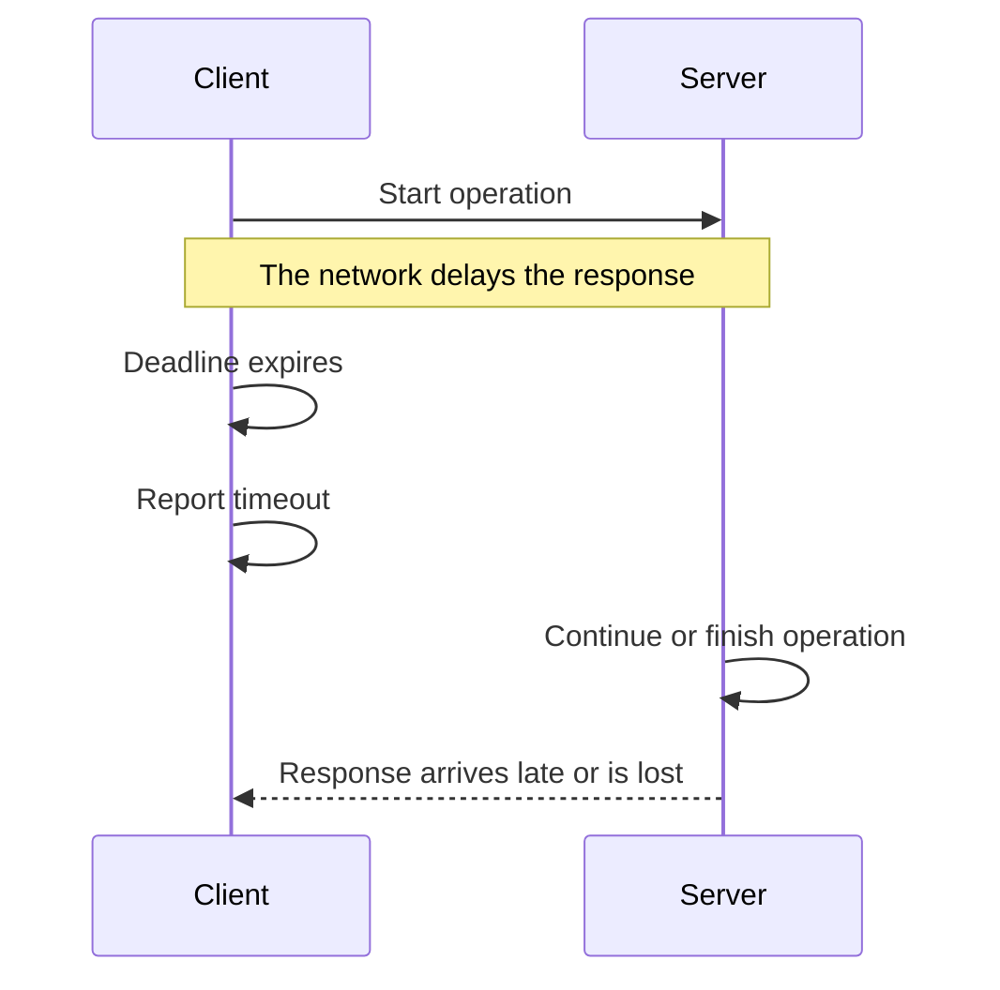

The client knows that it did not receive a response in time. It does not automatically know whether the server performed the operation.

This distinction matters for retries. Retrying a read is often safer than retrying a state-changing operation. A state-changing operation needs a way to recognize that the retry belongs to work already attempted.

## Partial failure

Partial failure occurs when only part of an operation succeeds. It is common whenever an operation crosses a boundary or contains multiple steps.

Imagine a service that creates an order. It may validate the request, write the order to a database, publish an event, and return a response. A failure can happen after any of these steps.

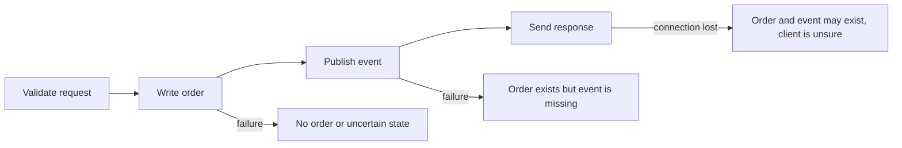

The failure after publishing the event is not the same as the failure before writing the order. The system needs different recovery behavior for each case.

A transaction can make several local database changes appear as one atomic operation, meaning that all changes commit together or none of them become visible. A transaction does not automatically make a database write and a message sent to another service atomic. That boundary requires another design, such as an outbox pattern, a reconciliation process, or an explicit retry and deduplication strategy.

The important question is not simply “Did the operation fail?” It is:

> Which effects definitely happened, which definitely did not happen, and which are uncertain?

## Recovery should be designed before failure happens

Recovery is the process of returning a system to a useful and correct state after a failure. It may involve retrying work, rolling back local changes, replaying a log, rebuilding state, restoring a backup, or asking another component to reconcile what happened.

Good recovery design starts by identifying what must remain true. These conditions are often called invariants (rules that must remain true while the system operates).

For an order system, possible invariants include:

- An order has one stable identifier.
- An order cannot be charged twice for the same payment attempt.
- An order marked as paid has a record of the payment result.
- An order cannot be shipped before it is accepted for fulfillment.

The recovery process should restore or preserve these rules. Restarting a process is not enough if the process starts with inconsistent data.

## Idempotency makes repetition safer

An operation is idempotent when applying it more than once produces the same final effect as applying it once. The operation may still return different responses, but repeating it does not create an additional unwanted effect.

Setting a user's email address to a specific value is naturally close to idempotent. Sending a payment request or incrementing a counter is not. Repeating a payment or increment can apply the effect more than once.

A common way to make a request idempotent is to give it a unique idempotency key. The server stores the reasult associated with that key. If the same key arrives again, the server returns the recorded result instead of performing the operation again.

```text
Client creates request ID: payment-8f31
        ↓
Server receives payment-8f31
        ↓
Server records the request and performs the payment
        ↓
Response is lost
        ↓
Client retries payment-8f31
        ↓
Server finds the existing result and returns it
```

The key must be scoped correctly, stored reliably, and associated with the request's important parameters. If the same key can be reused for a different payment, the protection is unsafe. If the record is lost too soon, a late retry may be treated as new work.

Idempotency does not mean that every operation is safe to repeat without thought. It is a deliberate protocol between the caller and the component performing the operation.

## Retries can help and can hurt

A retry repeats an operation after a failure that may be temporary. Retries are useful for short network interruptions, temporary service unavailability, or transient resource pressure.

Retries can also make an outage worse. If a dependency is already overloaded, every caller that retries immediately sends more work to it. The dependency becomes slower, causing more timeouts and more retries. This feedback loop is called a retry storm.

The usual protections are:

- A limit on the number of attempts
- A deadline for the whole operation
- Exponential backoff, which increases the wait between attempts
- Jitter, which adds a small random variation so clients do not retry at exactly the same time
- Idempotency for operations that change state
- A circuit breaker or load-shedding policy when the dependency is clearly unhealthy

These controls do not make retries universally safe. A retry policy must consider whether the operation is repeatable, whether the failure is likely temporary, and whether the dependency can handle another attempt.

## Timeouts prevent permanent waiting

Every operation that waits for another component should have a reasonable deadline. Without a timeout, a blocked operation can keep a thread, memory, connection, or queue slot forever.

A timeout is a resource-protection mechanism as much as a user-experience setting. If a service receives 1,000 requests and each request waits indefinitely for a broken dependency, the service may exhaust all workers and become unable to answer even simple requests.

Timeouts should be placed at the right boundaries. A database query may have a query timeout. A network connection may have a connect timeout. A request may have an end-to-end deadline that includes all internal work.

The deadlines must be coordinated. If a caller gives a request 500 milliseconds but an internal dependency is allowed to wait for 2 seconds, the dependency can continue working after the caller has already given up. That work consumes resources without helping the original request.

## Cancellation must travel through the system

Cancellation tells work that it is no longer needed. For cancellation to protect resources, it must reach the operations doing the work.

Suppose a user closes a page while the server is generating a large report. If the server notices the disconnected client and cancels the database query, file reads, and computation, it can release resources earlier. If cancellation stops only the final response while the internal work continues, the server still spends CPU, memory, storage, and database capacity on a request nobody needs.

Cancellation is especially important in concurrent systems. A parent operation should know which child tasks it started and should decide whether those tasks continue, finish, or stop when the parent fails.

## Crashes and restart behavior

A process crash ends its current execution state, but it does not automatically undo every effect the process made.

The operating system usually reclaims local memory and closes file descriptors. It cannot automatically undo an email already sent, a message already delivered, a database transaction already committed, or a remote lock that has no expiration.

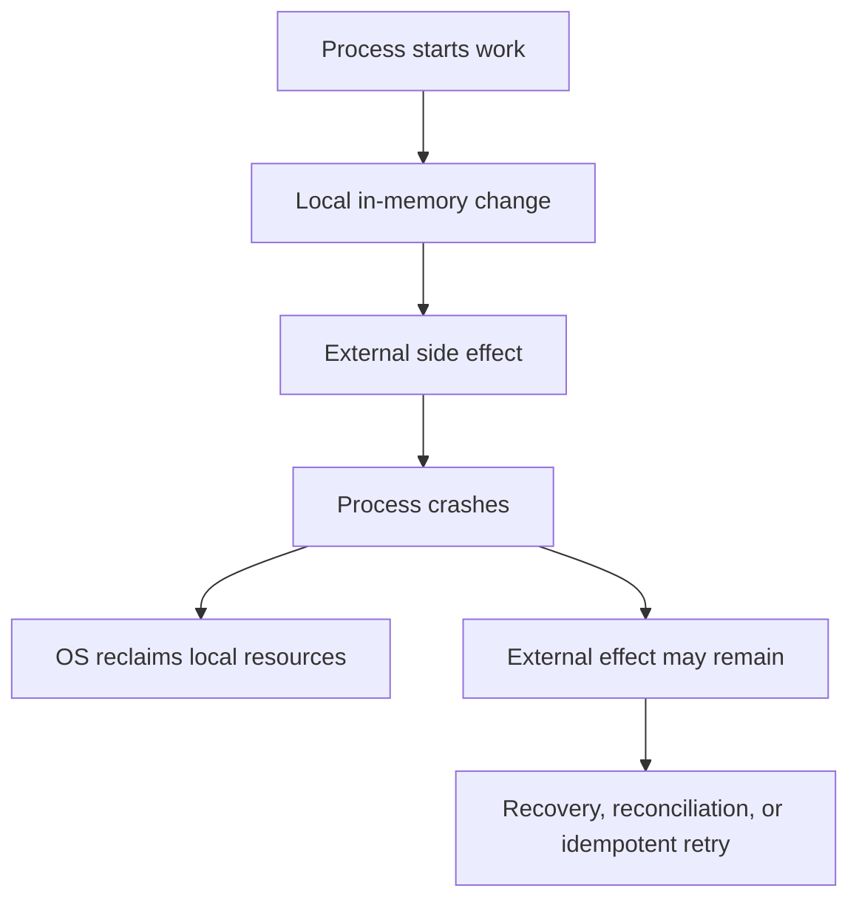

A restart strategy must therefore answer more than “How do we start the process again?” It must answer:

- How does the process know what work was completed?
- How are incomplete operations detected?
- Can work be safely retried?
- How are duplicate effects prevented?
- Which state is authoritative?
- How is inconsistent state repaired?

For local durable storage, a write-ahead log can record intended changes before applying them. After a crash, the system can replay or discard incomplete work according to the log. Distributed services need additional mechanisms because other machines may have observed effects that the crashed process no longer remembers.

## Determinism

Determinism means that the same relevant inputs and state produce the same behavior or result. Determinism makes a system easier to test and debug because a failing case can be repeated.

A program may be deterministic at one level and nondeterministic at another. A function that adds two numbers is usually deterministic. A concurrent program may call that function in an order that changes from run to run. A network service may receive the same messages in a different order. A program using the current time or random numbers has inputs that are not fixed unless they are controlled.

The useful question is not “Is this system completely deterministic?” Most real systems are not. The useful question is:

> Which sources of variation affect correctness, and how can we control or observe them?

### Sources of nondeterminism

Common sources include:

- Thread scheduling
- Network timing and message order
- Disk latency
- Clock readings
- Random-number generation
- External service responses
- Memory allocation addresses
- Unspecified language or hardware behavior

Not all variation is a bug. A network can deliver valid messages at different times. The system becomes unsafe when correctness depends on an order that the system does not guarantee.

## Race conditions

A race condition occurs when the result depends on the timing or order of operations that can run concurrently. A data race is a specific case where concurrent accesses to the same memory include at least one write and are not properly synchronized.

Consider two workers updating a shared counter:

```text
counter starts at 0

Worker A reads 0
Worker B reads 0
Worker A writes 1
Worker B writes 1

Expected result: 2
Actual result:   1
```

The operation “increment” looks simple, but it consists of a read, a calculation, and a write. Without synchronization, those steps can interleave.

The solution may be a lock, an atomic operation, a message-passing design, or a change that avoids shared mutable state. The correct choice depends on the workload and the required behavior. The deeper concurrency articles will examine these options in detail.

## Making systems easier to reproduce

Reproduction is the process of causing the same behavior again under controlled conditions. It is one of the most valuable tools in debugging because it turns an uncertain production symptom into something that can be inspected.

To improve reproduction, control or record:

- Input data
- Configuration
- Software version
- Dependency versions
- Time
- Random seeds
- Machine architecture
- Concurrency level
- Network conditions
- Storage state

You cannot always reproduce a production failure exactly. The goal is to reduce the number of unknowns until a useful explanation can be tested.

For a concurrency bug, repeating the same test may not reproduce the same schedule. A stress test may increase the chance of failure, while a scheduler or race detector may provide more useful evidence. For a time-related bug, injecting a fake clock may be better than waiting for a particular date.

## Reproducible builds

A reproducible build produces the same artifact from the same source and declared inputs. An artifact is a result of the build, such as a binary, container image, or package.

Reproducibility helps with debugging, rollback, security review, and trust. If a binary running in production cannot be recreated from its source and dependencies, it is harder to know what code is actually running or to reproduce its behavior.

Sources of build variation include:

- Unpinned dependencies
- Current timestamps
- Random build identifiers
- Machine-specific compiler behavior
- Environment variables
- Different toolchain versions
- Filesystem ordering

Not every project needs perfect bit-for-bit reproducibility immediately, but important inputs should be known and controlled.

## Control versus convenience

Higher-level tools and runtimes make development faster by managing details for you. A garbage collector manages much of memory reclamation. A connection pool manages reusable connections. A framework manages request routing. A scheduler manages task placement.

This convenience is valuable. It reduces code, common mistakes, and the amount of detail each engineer must handle. The cost is that the program inherits the tool's policies and behavior.

For example, a garbage-collected runtime may pause or consume CPU for collection. A connection pool may queue requests when every connection is busy. A framework may buffer a request body in memory. A scheduler may move work between CPUs and affect cache locality.

These details matter only when they affect the system's requirements. If they do not affect correctness, latency, capacity, or operations, relying on the abstraction is usually the better choice.

### Taking more control

An engineer may take more direct control by managing memory explicitly, choosing a custom allocator, implementing a bounded queue, controlling thread placement, using direct I/O, or writing a specialized protocol.

More control can provide:

- More predictable latency
- Lower overhead for a specific workload
- A better fit for unusual hardware or data layout
- Stronger control over resource limits

It also creates responsibilities:

- Correct cleanup
- Synchronization
- Error handling
- Portability
- Testing
- Security review
- Documentation
- Future maintenance

The decision should come from a measured requirement, not from the idea that lower-level code is automatically better.

## A realistic production example

Imagine a service that receives a request to generate a report. It queries a database, creates a file, uploads the file to object storage, and returns a download link.

Several failures are possible:

1. The database query times out before producing a result.
2. The query completes, but the process crashes while creating the file.
3. The file is created, but the upload fails.
4. The upload succeeds, but the response is lost.
5. The client retries and creates a second report.

A weak design treats every failure as “try again.” A stronger design gives the report a stable job identifier, records its state, uses deadlines, cleans up temporary files, makes upload retries safe, and lets a worker resume or reconcile incomplete jobs.

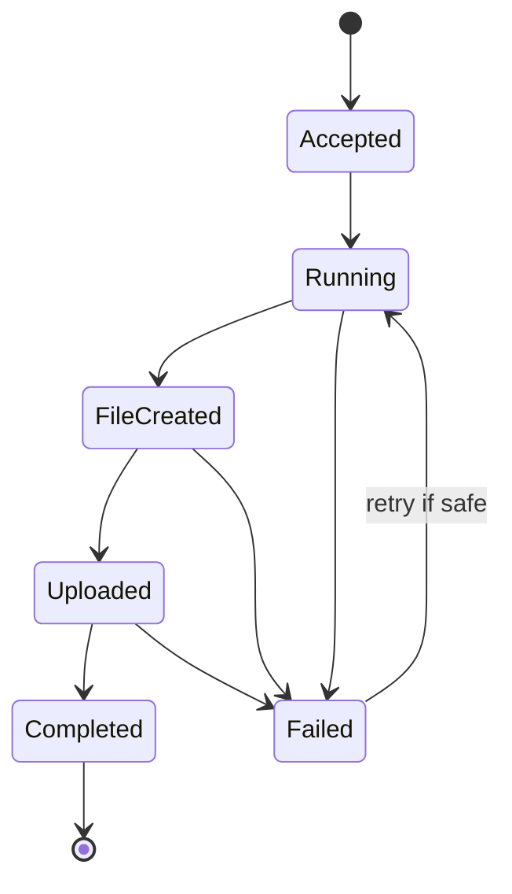

The state machine makes recovery decisions explicit. A failed job in `Running` may need to be retried. A job in `Uploaded` may only need its final metadata updated. A job in `Completed` should not be run again just because a client did not receive the original response.

The design is not only about code. It is about representing enough state to distinguish incomplete work from completed work.

## How experienced engineers investigate failures

When a failure is reported, experienced engineers usually resist the first attractive explanation. They try to establish what is known, what is unknown, and what evidence can separate the possible causes.

They may ask:

- What exactly failed?
- When did it begin?
- Did all requests fail or only some?
- Which version and configuration were running?
- What changed before the failure?
- Did the operation have a deadline?
- Could the work have completed remotely?
- What resources were acquired before the failure?
- Which effects are certain and which are uncertain?
- Can the operation be retried safely?
- What evidence would prove or disprove each explanation?

The goal is not to sound cautious. It is to avoid making a recovery action that creates a second failure, such as retrying a non-idempotent operation, increasing a limit until a downstream system collapses, or deleting state that is still needed for recovery.

## Interview definitions

### What is failure handling in systems?

> Failure handling is deciding how a system detects, contains, reports, recovers from, or safely gives up on operations that do not complete normally.

### What is partial failure?

> Partial failure occurs when part of an operation succeeds while another part fails or becomes uncertain, leaving the system responsible for deciding how to recover or reconcile the result.

### What is a timeout?

> A timeout is a deadline after which a caller stops waiting for an operation. It proves that the caller did not receive a result in time, but it does not always prove that the operation failed remotely.

### What is idempotency?

> An operation is idempotent when repeating it produces the same final effect as performing it once.

### What is determinism?

> Determinism means that the same relevant inputs and state produce the same result or behavior.

### What is a race condition?

> A race condition occurs when the result depends on the timing or order of operations that can happen concurrently.

### What is a retry storm?

> A retry storm occurs when many clients repeatedly retry a failing dependency and create even more load, making the original failure worse.

## Interview follow-up questions

### Why is a timeout not proof that an operation failed?

> The timeout only describes what the caller observed. The request may have reached the server and completed while the response was delayed or lost. This is why retries for state-changing operations often need idempotency.

### How do you make an operation safe to retry?

> I first determine whether repeating the operation can create a duplicate effect. If it can, I use an idempotency key or another deduplication mechanism, store the result for the appropriate lifetime, and define what happens when the request parameters do not match an existing key.

### What is the difference between rollback and compensation?

> Rollback restores a local transactional operation to its previous state. Compensation performs another operation to offset an effect that cannot be rolled back directly, such as issuing a refund for a payment that was already completed.

### When should you use more control instead of a higher-level abstraction?

> I would take more control when measurements show that the abstraction cannot meet an important requirement such as latency, memory usage, or failure behavior. I would also account for the extra responsibility, portability cost, testing burden, and maintenance risk.

### How do you debug a nondeterministic failure?

> I record as much state as possible, reduce the input and concurrency, control time and randomness, and use tracing or race-detection tools. I try to turn the timing-dependent failure into a smaller reproducible case instead of relying only on repeated execution.

## Common misconceptions

### “A timeout means the server did nothing.”

A timeout only means the caller did not receive a result before its deadline. The server may still be working or may have completed the operation.

### “Retrying always improves reliability.”

Retries can recover from temporary failures, but they can overload a failing dependency or duplicate a state-changing operation. They need limits, deadlines, and a safe operation model.

### “A process crash undoes its work.”

A crash usually removes local in-memory state, but it does not undo external effects such as committed database writes, sent messages, or completed remote requests.

### “Deterministic means every system must behave exactly the same every time.”

Real systems have legitimate variation from timing, scheduling, networks, and devices. The goal is to control the variation that affects correctness and make the remaining variation observable.

### “The lowest-level implementation is the most reliable.”

Lower-level code can provide more control, but it also creates more opportunities for memory bugs, cleanup failures, portability problems, and incorrect assumptions. Reliability comes from fitting the design to the requirements and managing its risks.

## Summary

Failure is not an unusual exception to systems behavior. It is one of the conditions that the system must be designed to handle. Errors, timeouts, cancellation, crashes, and partial completion have different meanings and should not all be treated as the same event.

Determinism makes behavior easier to test and debug, but systems naturally contain variation from concurrency, networks, clocks, devices, and external services. Good designs control the variation that affects correctness and record enough information to investigate the rest.

Higher-level abstractions reduce the amount of detail engineers must manage. Taking more direct control can improve predictability or performance, but it also creates responsibility for cleanup, synchronization, portability, security, and maintenance. The right choice is the simplest abstraction that satisfies the real requirements.

## If you want to build this later

Build a small report-generation worker that can survive failure and safe retries.

The worker should accept a job ID, create a report file, and store the job state as it moves through stages such as `accepted`, `running`, `uploaded`, and `completed`. Add deadlines, temporary-file cleanup, controlled retries, and idempotent handling when the same job ID is submitted twice.

Then simulate failures at each stage: stop the worker during file creation, make the upload fail, drop the final response, and submit the same job twice. The goal is to make the worker distinguish “definitely not completed,” “completed but response lost,” and “state is uncertain.”

## Chapter 5 — Performance Constraints in Systems

*This chapter continues the same running examples — the tiny command-line program, its compiled form, and its processes and threads — so the chain from the previous chapter stays unbroken.*

## Performance starts with a requirement

A statement such as “make it faster” is not precise enough to guide engineering work. Faster for which operation, under what load, and measured in what way?

A useful performance requirement identifies the workload, the measurement, and the target.

For example:

> Under 500 requests per second, the search endpoint should respond in less than 200 milliseconds for 99 percent of requests, while keeping the service below 70 percent CPU utilization.

This statement contains several important ideas. It defines the traffic level, the endpoint, the latency target, the percentile, and a resource constraint. A different system might care more about processing a large batch overnight, in which case total completion time and throughput may matter more than the latency of one item.

The right performance goal comes from the system's purpose. A trading system, a web page, a background report, and a metrics pipeline may need very different performance properties.

## Latency

Latency is the elapsed time between an operation starting and its result becoming available. For a user request, it may be the time from receiving the request until the response is sent.

Latency is often made of several waiting and processing stages:

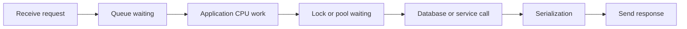

The total latency includes more than the CPU instructions that compute the result. A request may spend most of its time waiting for a connection, a lock, a disk, a remote service, or an available worker.

### Average latency is not enough

The average is calculated by adding all observed latencies and dividing by the number of requests. It is useful for some analysis, but it can hide the experience of slow requests.

Suppose 99 requests take 10 milliseconds and one request takes 10 seconds. The average is much higher than the normal request time, but it still does not tell us how many users experienced the slow result or what the tail of the distribution looks like.

A percentile describes the value below which a given percentage of observations fall. If the 95th-percentile latency is 200 milliseconds, 95 percent of measured requests finished within 200 milliseconds and 5 percent took longer. The 99th percentile focuses on an even slower part of the distribution.

Tail latency is the latency of the slowest portion of requests. It matters because users and upstream services often experience the tail, and because a single slow dependency can affect an entire request chain.

If one request calls five services, the chance that at least one service is slow increases. A service that is fast at the 99th percentile in isolation may still contribute to slow end-to-end requests when many calls are combined.

## Throughput

Throughput is the amount of work completed per unit of time. It might be measured in requests per second, records per second, megabytes per second, messages per second, or transactions per minute.

Throughput is useful for workloads such as:

- Processing a large data set
- Ingesting logs or events
- Writing storage blocks
- Serving network traffic
- Running background jobs

Improving throughput does not necessarily improve latency. Batching can process many records efficiently but make each record wait for the batch to fill. A queue can keep workers busy and increase throughput while increasing the time an individual job waits.

The system needs a balance appropriate to the workload. A user-facing request may prioritize latency. A nightly data pipeline may prioritize throughput and total completion time.

## Latency and throughput can conflict

Many systems have a tradeoff between latency and throughput.

Sending one small database write at a time may give each write a quick response but waste CPU and storage overhead. Grouping writes into batches can improve throughput, but each write waits until the batch is ready.

Using more concurrent workers can increase throughput while there is unused capacity. Beyond a certain point, workers compete for CPU, memory, locks, storage, or connections. Latency grows and throughput may stop improving.

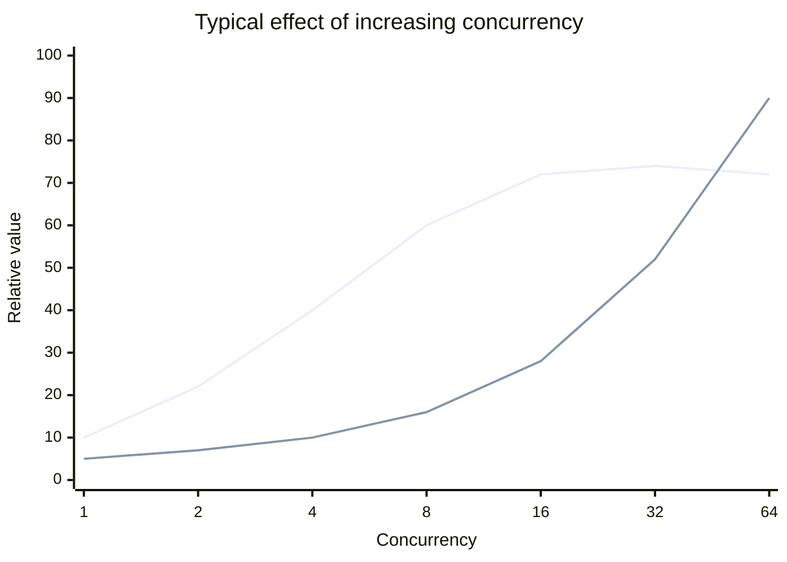

The exact curve differs by system, but the pattern is common: throughput improves until a resource becomes saturated, while latency often rises earlier because requests begin waiting in queues.

## The critical path

The critical path is the sequence of work that determines when an operation can finish. Work outside the critical path may run in parallel or asynchronously without delaying the response.

For a request that loads a user profile and recommendations, the application may need the profile before responding but may be able to load recommendations independently or use a cached result.

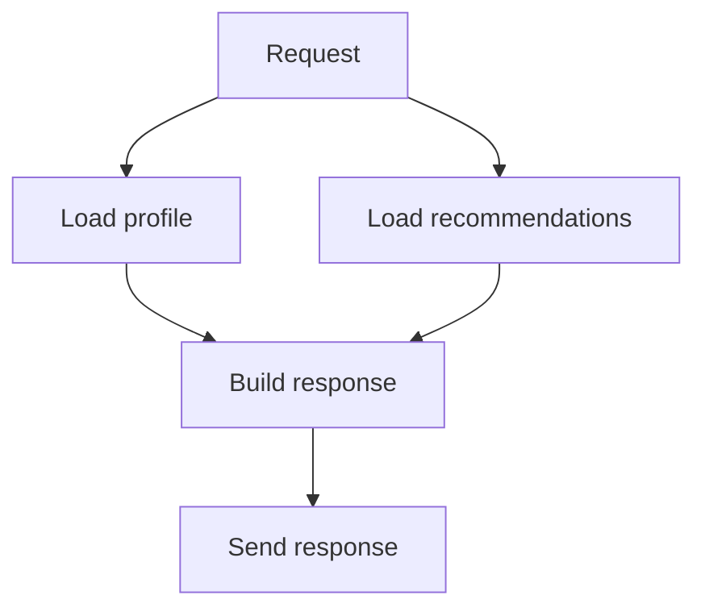

If both branches must finish, the request is limited by the slower branch plus coordination overhead. If recommendations are optional, the system may return the profile without waiting for them.

Finding the critical path helps an engineer decide whether to optimize work, remove work, parallelize work, cache work, or make some work optional.

## Queueing and waiting

When work arrives faster than a component can process it immediately, the work waits. The waiting area may be visible as a queue or hidden inside a thread pool, connection pool, lock, kernel buffer, database, or network device.

```text
Arrival rate > service rate
        ↓
Queue grows
        ↓
Waiting time grows
        ↓
Deadlines are missed
        ↓
Retries or new work add more load
```

The arrival rate is how quickly work enters a component. The service rate is how quickly the component completes work. If the arrival rate stays above the service rate, no amount of queue tuning can prevent eventual overload. The system must reduce arrivals, increase service capacity, reject work, or move work to another resource.

Queueing also explains why latency can increase suddenly near saturation. When utilization is low, a request often starts immediately. As utilization approaches the limit, even a small burst can create a queue, and the queue adds delay to every request behind it.

This is why leaving headroom is important. A system running permanently at its maximum measured throughput has little space for bursts, failures, maintenance, or measurement error.

## Utilization and saturation

Utilization describes how busy a resource is. CPU utilization, memory usage, storage bandwidth, and network bandwidth are common examples.

Saturation describes whether additional work is forced to wait because the resource has no immediate capacity. A resource can have high utilization without being harmful if work remains within its latency target and queues do not grow. A resource can also have moderate average utilization but experience short saturation periods that create unacceptable tail latency.

Important signals include:

- Resource utilization
- Queue length
- Wait time
- Work completion rate
- Rejection rate
- Timeout rate
- Error rate
- Tail latency

Looking at utilization alone can produce bad conclusions. A service with low CPU usage may be waiting on a database. A service with high CPU usage may be healthy if it has enough capacity and stable latency. A database with moderate CPU may still be limited by locks or storage latency.

## Capacity and headroom

Capacity is the amount of work a system can handle while meeting its requirements. It is not simply the maximum amount of work before the machine crashes.

If a service can process 1,000 requests per second before its latency becomes unacceptable, its useful capacity may be much lower than the rate at which it can technically accept requests.

Headroom is unused capacity reserved for bursts, failures, deployments, growth, and uncertainty. A service running at 95 percent of every resource limit may look efficient, but it is fragile. One slow dependency or one failed instance can push the remaining instances into saturation.

Capacity planning should consider failure scenarios. If a service normally runs four instances and must continue operating after losing one, the remaining three must have enough capacity for the expected load. This is sometimes called a failure-domain or spare-capacity requirement.

The correct amount of headroom depends on traffic variability, recovery time, scaling speed, and the cost of failure. Too little headroom creates incidents. Too much headroom wastes money and may hide inefficient design.

## Bottlenecks

A bottleneck is the part of the system that limits end-to-end progress. The bottleneck may be a CPU core, a lock, a database query, a disk, a network link, a connection pool, or a human approval step.

The busiest component is not always the bottleneck. A component may be busy doing work that is not on the critical path, while a lightly utilized lock or queue causes most requests to wait.

The bottleneck can also move after an optimization.

```mermaid
flowchart LR
    Storage[Slow storage] --> OptimizeStorage[Improve storage]
    OptimizeStorage --> Network[Network becomes limiting]
    Network --> Compress[Compress responses]
    Compress --> CPU[CPU becomes limiting]
```

This is normal. The goal of an optimization is not to make every component equally busy. The goal is to improve the required outcome without creating an unacceptable new limit.

## Measurement before optimization

Optimization is changing a system to improve a measured property. Without measurement, an optimization is only a guess.

A useful performance investigation usually has four parts:

1. Define the workload and success metric.
2. Measure a baseline.
3. Change one important factor.
4. Measure again under the same or clearly described conditions.

The baseline should include enough information to explain the result. Record the software version, configuration, input size, concurrency, machine type, dependency state, and whether caches are warm or cold.

Without this information, two benchmark results may look different while measuring different workloads.

### Warm and cold behavior

A warm cache contains data recently used by the system. A cold cache does not. A program that reads the same file repeatedly may be measuring memory and page-cache behavior rather than storage latency.

Both conditions can matter. Warm behavior may represent normal steady-state traffic. Cold behavior may represent a restart, a new deployment, a new tenant, or a cache eviction event.

The benchmark should state which condition it measures instead of presenting one number as universal.

### Microbenchmarks and real workloads

A microbenchmark measures a small operation in isolation. It is useful for comparing implementations or finding a local cost, but it may not predict end-to-end service behavior.

A real workload includes parsing, allocation, logging, scheduling, network calls, storage, contention, and background work. An optimization that makes one function 20 percent faster may have no visible effect if that function represents only 1 percent of total request time.

This is an example of Amdahl's law (the idea that the total speedup is limited by the part of the workload that was not improved). If only a small fraction of the total time is spent in the optimized section, the end-to-end improvement is limited.

## A small code example: measure the whole operation

Suppose a service processes records in batches. A benchmark should measure the operation in a way that includes the work that matters and prevents the compiler from removing unused results.

```go
func BenchmarkProcessBatch(b *testing.B) {
	records := makeRecords(1000)
	b.ResetTimer()

	for i := 0; i < b.N; i++ {
		result := processBatch(records)
		if len(result) == 0 {
			b.Fatal("unexpected empty result")
		}
	}
}
```

The benchmark repeats the operation many times so that timing noise has less influence. It creates the input before the timer starts because the question is about processing cost, not input construction. It also checks the result so the benchmark does not accidentally measure an operation that the compiler can remove or simplify.

This is still only a local measurement. It does not tell us how the function behaves when many requests share memory, compete for a lock, wait for a database, or run on a different machine.

## Profiling shows where time goes

Profiling collects evidence about where a program spends CPU time, memory, lock time, or I/O time. A CPU profile may show that a service spends time in parsing, encryption, garbage collection, or a retry loop. A memory profile may show allocation rate or retained objects. A lock profile may show contention.

The profile does not automatically identify the correct solution. It identifies where the measured workload spent time. The engineer still has to ask whether that work is required, whether it can be reduced, whether it can be parallelized, and whether changing it creates another problem.

For example, if a profile shows that a service spends 30 percent of CPU time serializing data, possible responses include reducing fields, changing the format, reusing buffers, compressing less, or moving serialization to another stage. The correct choice depends on network bandwidth, compatibility, memory, and latency requirements.

## Optimization choices

Several common techniques improve performance, but each changes another property.

### Remove unnecessary work

The best optimization is often avoiding work. Filtering data earlier, selecting only required columns, avoiding repeated parsing, and not generating unused results can improve performance without adding a new subsystem.

Removing work is usually safer than making the same work faster because it also reduces resource usage and failure surface.

### Cache reusable results

A cache stores a result closer to the consumer so that later requests can avoid repeating expensive work. Caching can reduce latency and load, but it introduces freshness, memory, invalidation, and eviction decisions.

A cache is useful only when the cost of stale data and cache management is acceptable. A cache that is always invalidated immediately may add complexity without reducing work.

### Batch operations

Batching combines multiple small operations into one larger operation. It can reduce per-operation overhead and improve storage or network efficiency. The tradeoff is that items may wait for the batch and a failed batch may require partial-result handling.

### Parallelize independent work

Parallelism allows independent operations to make progress at the same time. It can reduce latency when the operations use separate capacity, but it can also increase contention, memory usage, connection usage, and downstream load.

Parallelism is valuable only when the work is actually independent and the system has enough capacity to support it.

### Add capacity

Scaling up provides more capacity on one machine. Scaling out adds more machines or processes. Both can help, but they may expose a new bottleneck and add cost or coordination complexity.

Adding capacity is often the right short-term response to growth, but it should not hide an unbounded leak, an inefficient query, or an overload policy that is missing.

## Performance versus simplicity

A more complex design can improve performance, but complexity is itself a cost. It increases the number of states, failure modes, tests, configuration values, operational procedures, and concepts that future engineers must understand.

Before adding a cache, worker pool, custom allocator, asynchronous pipeline, or specialized storage path, ask:

- What measured problem does this solve?
- What improvement is required?
- What new resource does it consume?
- What happens when it is full or stale?
- How will it be tested?
- How will it be observed?
- Can it be disabled or rolled back?
- Who will maintain it?

Performance work should improve the whole system, not merely make one benchmark look better.

## A realistic production example

Imagine an API that returns a user's dashboard. The average latency is 120 milliseconds, which appears acceptable. Users still report that the dashboard sometimes takes several seconds to load.

The team checks percentiles and finds that the 99th percentile is 2.4 seconds. Traces show that most requests are fast, but a small number wait for a database connection and then call three downstream services sequentially.

The team considers running the downstream calls in parallel. That may reduce latency, but it also triples the number of concurrent requests sent to the dependencies. Before making the change, the team checks dependency capacity and adds deadlines so the dashboard does not wait forever for one optional component.

The team then makes recommendations optional. If that dependency is slow, the dashboard returns the core account data and displays recommendations later. The result improves tail latency without simply adding more threads or increasing every timeout.

The final design is a combination of measurement, parallelism, deadlines, and graceful degradation. No single performance trick solved the problem.

## Performance and failure are connected

Performance problems can become reliability problems.

A slow dependency causes requests to remain active longer. More active requests consume memory, workers, connections, and queue slots. As those resources fill, new requests wait longer and time out. Callers retry, increasing the load on the already slow dependency.

```text
Slow dependency
    ↓
Requests remain active longer
    ↓
Workers and connections become occupied
    ↓
Queues grow
    ↓
Timeouts increase
    ↓
Retries add more work
    ↓
System becomes less reliable
```

Performance engineering therefore includes limits, timeouts, backpressure, load shedding, and graceful degradation. A fast design that fails catastrophically under overload is not a good production design.

## How experienced engineers approach a performance problem

An experienced engineer does not start by naming an optimization. They first clarify the impact and the workload.

They ask:

1. Which user or system behavior is too slow?
2. Is the problem latency, throughput, capacity, cost, or all of them?
3. Is the problem constant or only present under a particular load?
4. Which percentile or completion target matters?
5. Where does the critical path spend time?
6. Which resource is saturated or causing waiting?
7. Is the measured bottleneck inside the system or in a dependency?
8. What is the smallest change that can test the hypothesis?
9. What new failure mode will the change introduce?
10. How will the improvement be measured after deployment?

This process prevents two common mistakes: optimizing a component that is not limiting the result and improving normal-case speed while making overload behavior unsafe.

## Interview definitions

### What is latency?

> Latency is the time taken by one operation from its start until its result is available.

### What is throughput?

> Throughput is the amount of work a system completes per unit of time.

### What is tail latency?

> Tail latency describes the slower part of a latency distribution, such as the 95th or 99th percentile, where a smaller group of requests takes much longer than normal.

### What is a bottleneck?

> A bottleneck is the part of a system that limits the progress of the overall workload.

### What is headroom?

> Headroom is unused capacity reserved for traffic bursts, failures, growth, maintenance, and uncertainty.

### What is saturation?

> Saturation occurs when a resource has so little available capacity that additional work mostly creates waiting instead of useful progress.

### What is a performance constraint?

> A performance constraint is a requirement that limits how much time, capacity, or resource usage a system can spend while doing its work.

## Interview follow-up questions

### Why is average latency often a poor service metric?

> Average latency can hide a slow tail. A small percentage of very slow requests may have a serious user or dependency impact even when the average looks acceptable, so I also look at percentiles such as p95 and p99.

### How do you find the bottleneck in a slow service?

> I define the workload and latency target, then use traces, profiles, metrics, and resource measurements to see where time is spent and where work is waiting. I compare the evidence with a hypothesis and measure again after changing one important factor.

### Why can adding more workers make a system slower?

> More workers can increase useful parallelism until a shared resource becomes saturated. After that point, workers compete for CPU, memory, locks, connections, or downstream capacity, so queues and latency grow.

### What is the difference between scaling up and scaling out?

> Scaling up gives an existing machine more capacity. Scaling out adds more machines or processes. Scaling up is often simpler, while scaling out can provide more total capacity and failure isolation but requires coordination and distribution.

### Why is caching not a universal performance solution?

> Caching helps when repeated work can be reused and stale data is acceptable. It also introduces memory usage, invalidation rules, eviction behavior, and possible inconsistency. If the data changes often or the cache hit rate is low, it may add complexity without enough benefit.

### What makes a benchmark trustworthy?

> It has a defined workload, a meaningful metric, controlled inputs and configuration, enough repetitions, and a comparison against a baseline. It should also state whether caches are warm, how much concurrency is used, and whether the measured operation represents the real bottleneck.

## Common misconceptions

### “The fastest function makes the fastest system.”

An optimized function may not matter if it is a small part of the critical path. End-to-end performance depends on the work that determines when the operation can finish.

### “High utilization means the system is healthy.”

High utilization can be healthy when latency and queues remain controlled. Near saturation, small bursts or failures can create large delays, so headroom and wait time matter too.

### “More concurrency always increases throughput.”

More concurrency helps while there is useful independent work and available capacity. Beyond that point, contention and queueing can reduce throughput and increase latency.

### “A benchmark number is a property of the code.”

A measurement is a property of the code, workload, machine, compiler, configuration, dependencies, and measurement method together. Changing any of those can change the result.

### “Performance and reliability are separate concerns.”

Slow work occupies resources longer, causes queues and timeouts, and can trigger retries. Performance behavior can directly affect reliability.

## Summary

Performance is a set of constraints around time, work, capacity, and resource usage. Latency describes one operation, throughput describes completed work, and tail latency shows the experience of slower requests. Capacity and headroom determine how a system behaves during growth, bursts, and failures.

The practical method is to define a real requirement, measure a representative workload, find the critical path and bottleneck, make the smallest useful change, and measure again. Caching, batching, parallelism, and scaling can help, but each introduces tradeoffs and new failure modes.

The best performance work often removes unnecessary work and keeps the system simple. When complexity is necessary, it should come with limits, observability, safe overload behavior, and a clear reason for existing.

## If you want to build this later

Build a small performance laboratory with three programs: a CPU-heavy program, a file-reading program, and a network client.

Give each program configurable input size and concurrency. Measure total time, throughput, average latency, and p95 latency. Then change one factor at a time: add workers, increase input, reuse buffers, batch operations, or add an artificial delay to a dependency.

The goal is to observe where throughput stops improving, where latency begins to grow, and how the bottleneck moves after an optimization. Record each result with the workload and configuration so that the numbers remain meaningful.

## Chapter 6 — Portability, Compatibility, and Abstraction Leaks

*This chapter continues the same running examples — the tiny command-line program, its compiled form, and its processes and threads — so the chain from the previous chapter stays unbroken.*

## Portability and compatibility are different

Portability asks whether the same software can run in different environments. The environment may differ by operating system, CPU architecture, compiler, runtime, filesystem, or cloud platform.

Compatibility asks whether two versions or components can continue working together. The components may be two versions of an API, a client and server, a program and a shared library, or a database and an application.

A system can be portable but not compatible. A program may compile on both Linux and Windows, but a new version of its file format may break older clients.

A system can be compatible but not portable. A service may preserve its network API across versions while only running on one operating system.

```rs
Portability
    Same software across different environments

Compatibility
    Different versions or components continuing to work together
```

The distinction matters because the solutions are different. Portability often requires isolating environment-specific behavior. Compatibility often requires versioning, stable contracts, migration paths, and careful changes.

## The environment is part of the program

Source code is not the complete input to a running program. The result also depends on the compiler, linker, libraries, runtime, operating system, CPU architecture, configuration, filesystem, environment variables, clock, locale, and external services.

```mermaid
flowchart TB
    Source[Source code] --> Build[Compiler and linker]
    Build --> Binary[Executable or package]
    Binary --> Runtime[Runtime and libraries]
    Runtime --> OS[Operating system]
    OS --> CPU[CPU architecture]
    OS --> Config[Configuration and environment]
    OS --> Data[Filesystem and external data]
    Binary -. assumptions .-> Runtime
    Runtime -. assumptions .-> OS
```

Two machines can run the same source code and produce different behavior because one of these inputs changed. Sometimes the difference is a compile error. Sometimes it is a different result. The most dangerous case is behavior that looks correct until a rare input or failure occurs.

## Operating-system portability

Operating systems expose similar ideas through different interfaces. They all have processes, files, memory, and networking, but the details and guarantees differ.

Examples include:

- Path separators and filesystem naming rules
- File permissions and ownership models
- Process creation APIs
- Signal behavior
- File-locking semantics
- Clock and timer behavior
- Socket options
- Event notification APIs
- Shared-library formats
- Service managers

An application that uses a high-level standard library may avoid many differences. A systems program that needs process groups, filesystem notifications, direct I/O, or kernel tracing may need platform-specific code.

The goal is not to pretend that operating systems are identical. The goal is to place differences in a small, clear part of the program instead of spreading them through every component.

```mermaid
flowchart LR
    Core[Portable core logic] --> Interface[Small platform interface]
    Interface --> Linux[Linux implementation]
    Interface --> Mac[macOS implementation]
    Interface --> Windows[Windows implementation]
```

This structure lets most of the program use one stable model while the platform interface handles differences explicitly.

## CPU architecture portability

A CPU architecture defines the instructions a processor understands and important rules about registers, memory access, alignment, and data representation. Common server architectures include x86-64 and ARM64.

Most application code does not need to know individual CPU instructions. It still depends on architecture details through:

- Integer and pointer sizes
- Alignment requirements
- Endianness
- Atomic instructions
- Memory-ordering behavior
- Floating-point behavior
- Compiler-generated code
- Available vector instructions

Endianness describes the order in which the bytes of a multi-byte value are stored. In little-endian representation, the least significant byte is stored first. In big-endian representation, the most significant byte is stored first.

If a program writes a multi-byte integer directly to a file or network connection, the reader needs to know the byte order. Otherwise, the same bytes can represent different values on different systems.

Alignment describes where a value may be placed in memory. Some architectures allow unaligned access with a performance cost. Others may reject it or require special instructions. Code that assumes every address can hold every type may work on one architecture and fail on another.

## Data representation is a compatibility boundary

Data must have an agreed representation when it crosses a process, machine, or version boundary. The representation must define field sizes, byte order, encoding, alignment, optional fields, and error behavior.

Writing an in-memory object directly to disk or across the network is often unsafe because the in-memory layout may contain padding or architecture-specific details.

Consider this C structure:

```c
struct Header {
    uint16_t version;
    uint32_t payload_length;
};
```

A programmer might be tempted to write the structure's raw bytes to a file. The compiler may insert padding between the fields so that `payload_length` is aligned. The total size may differ between compilers or architectures. The byte order may also differ.

The safer design defines a wire or file format explicitly:

```text
Bytes 0-1: version, unsigned 16-bit integer, big-endian
Bytes 2-5: payload length, unsigned 32-bit integer, big-endian
Bytes 6-n: payload bytes
```

The encoder writes each field according to that definition. The decoder reads the defined number of bytes and validates the values before using them.

This costs a small amount of code, but it creates a stable boundary. The file or message format no longer depends on the compiler's private memory layout.

## Source compatibility and binary compatibility

Source compatibility means that existing source code can still be compiled against a newer version of a library or interface. A change to a function name or type may break source compatibility even if the underlying binary behavior could have remained similar.

Binary compatibility means that an already-compiled program can continue to run with a newer library or component. The function symbols, calling conventions, data layouts, and runtime expectations must remain compatible.

These are different. A library may preserve binary compatibility while changing a source-level declaration. It may also preserve source compatibility while changing a binary layout in a way that breaks already-compiled programs.

An ABI, or application binary interface, defines low-level rules that compiled components use to communicate. It includes calling conventions, data layout, symbol names, register usage, stack layout, and object formats.

An API, or application programming interface, is the source-level contract that programmers use. An ABI is the lower-level contract that compiled code depends on.

```text
Application source code
        ↓ API
Compiler-generated code
        ↓ ABI
Library, runtime, operating system, or other binary
```

An API change may require recompiling clients. An ABI change may break clients even when their source code has not changed.

## Compatibility is a promise with a scope

When engineers say that an interface is “backward compatible,” the statement needs a scope.

It may mean:

- A new server accepts requests from old clients.
- A new client can read old data.
- An old client can read responses from a new server.
- An existing database schema remains readable.
- An already-compiled program still loads a shared library.
- A configuration file continues to parse.

These guarantees are not identical. A change can preserve one direction and break another.

For example, adding an optional response field may be safe for clients that ignore unknown fields. Removing a field may break clients that require it. Changing the meaning of an existing field can be more dangerous than adding a new field because old clients may continue to run while interpreting the value incorrectly.

Compatibility should therefore be described in terms of producers, consumers, versions, and directions.

## Versioning and evolution

Systems change over time. A protocol, file format, API, database schema, or configuration format needs a way to evolve without forcing every component to change at exactly the same moment.

Common techniques include:

- Optional fields with safe defaults
- Explicit version numbers
- Additive changes before removal
- Supporting old and new formats during migration
- Capability negotiation
- Feature flags
- Deprecation periods
- Translators between versions

```mermaid
sequenceDiagram
    participant OldClient
    participant Server
    participant NewClient

    Note over OldClient,NewClient: Compatibility window
    OldClient->>Server: Old request format
    Server-->>OldClient: Compatible response
    NewClient->>Server: New request format
    Server-->>NewClient: New response format
    Note over Server: Translate or support both formats
```

The compatibility window is temporary. Supporting old behavior forever increases code and testing cost. A responsible migration includes a plan for measuring old usage, communicating a deadline, moving consumers, and eventually removing the old path.

## Configuration is also an interface

Engineers often treat configuration as separate from compatibility, but configuration is an input contract. Environment variables, command-line flags, YAML files, database settings, and feature flags are all interfaces between operators and software.

Changing a default can change behavior without changing the code. Renaming a configuration key can prevent a service from starting. Changing the meaning of a timeout can make a service retry too aggressively or wait too long.

Good configuration design defines:

- The name and type of each value
- The default
- The allowed range
- Whether the value can change at runtime
- What happens when it is missing or invalid
- Whether old names remain supported

Configuration should fail clearly when a dangerous value is invalid. Silently accepting an unknown key can create a false sense that an important setting is active.

## Filesystem abstractions leak

A high-level file API may make every file look like a sequence of bytes, but filesystem behavior can still affect the program.

Important differences include:

- Case sensitivity
- Maximum path length
- Filename encoding
- Permission behavior
- Symbolic links
- Atomic rename guarantees
- Timestamp precision
- Locking semantics
- Flush and durability behavior
- Local versus network filesystem behavior

A test may pass on a case-sensitive Linux filesystem and fail on a case-insensitive development machine because two filenames differ only by case. A program may assume that renaming a file is immediately durable when the filesystem only guarantees atomic visibility, not persistence after power loss.

The file abstraction remains useful. The engineer must identify which filesystem properties the application actually depends on and document or enforce them.

## Network abstractions leak

A network client may expose a simple function such as `Get(url)`, but the call crosses several boundaries: DNS, routing, connection setup, TLS, server queueing, application processing, and response transfer.

The abstraction leaks when any of those details affect behavior. A DNS cache can return an old address. A connection pool can be exhausted. A certificate can expire. A proxy can impose a request limit. A remote server can complete the operation after the client timeout.

This does not mean every application must understand every packet. It means the system should know which assumptions matter. A latency-sensitive service may need connection reuse and deadlines. A security-sensitive client must validate certificates. A long-lived connection may need keep-alive and reconnect behavior.

## Runtime abstractions leak

Language runtimes provide useful services such as memory management, scheduling, networking, reflection, and garbage collection. They also have behavior that can affect a program.

A garbage collector may use CPU and pause or slow application work. An asynchronous runtime may schedule tasks cooperatively, meaning one task that does not yield can delay others. A runtime's network API may buffer data or impose a particular cancellation model.

The right response is not to avoid runtimes. It is to understand the parts that affect the requirements. If a service has strict latency goals, measure runtime pauses and allocation behavior. If a program performs blocking work inside an event loop, understand how that blocks unrelated tasks.

## Portability through boundaries

Portable systems usually separate stable logic from environment-specific behavior.

For example, a storage engine may define an internal interface:

```text
read(block_number) -> bytes
write(block_number, bytes)
flush()
```

One implementation may use a local file. Another may use a block device or a remote storage service. The storage engine's higher-level logic can remain stable if the implementations provide the required guarantees.

The boundary must describe behavior, not only function names. It should specify whether reads can be partial, whether writes are durable after return, whether operations are thread-safe, and what errors can occur.

An interface that hides the wrong details creates surprises. An interface that exposes every platform-specific detail destroys portability. Good interface design chooses the smallest set of guarantees that the higher-level component truly needs.

## Feature detection and capability negotiation

Portable software should not assume that every environment supports every feature. It can detect capabilities or negotiate them.

Feature detection asks the local environment what it supports. Capability negotiation allows two communicating components to choose a common set of features.

For example, a client and server may negotiate compression or a protocol version. A program may check whether a filesystem supports a particular operation before using it. A compiler may expose a feature flag for a CPU instruction set.

A capability is not the same as a version number. Two systems with the same version may have different configuration or hardware capabilities. When possible, checking the behavior or capability directly is safer than assuming it from a version string.

## Portability versus lowest common denominator

Portable software does not need to use only the weakest feature available everywhere. It can have a portable base and optional optimized paths.

```mermaid
flowchart TD
    Request[Operation] --> Detect{Feature available?}
    Detect -->|No| Portable[Portable implementation]
    Detect -->|Yes| Specialized[Optimized implementation]
    Portable --> Result[Same required behavior]
    Specialized --> Result
```

The optimized path must preserve the required behavior and have tests. If it is not available or fails, the portable path should remain correct.

This pattern lets software use hardware acceleration, platform-specific filesystem features, or specialized system calls without making those features a requirement for every environment.

## A realistic production example

Imagine a service that stores a small binary record on disk. It works correctly on a developer's laptop and on the first production machines. The company later moves part of the workload to ARM64 machines and discovers that some records cannot be read.

The service had written an in-memory C structure directly to disk. The structure contained compiler-inserted padding, and the code assumed a particular byte order. The file format had never defined either property.

The short-term fix is to write a reader that can detect and convert the old format. The long-term fix is to define an explicit format with field sizes, byte order, versioning, and validation. New records use the stable format, while old records are migrated or supported during a compatibility window.

The original code was not obviously wrong on its first machine. The problem was that an environment assumption had become an undocumented file-format contract.

## How experienced engineers handle compatibility changes

When changing a public interface, experienced engineers consider the consumers that they do not control directly.

They ask:

- Who produces this data and who consumes it?
- Which versions are currently deployed?
- Can old and new versions run together during a rolling deployment?
- What happens if a client is upgraded before the server?
- What happens if the server is upgraded before the client?
- Can the old data be read after the change?
- How will old usage be measured?
- How will the change be rolled back?
- When can the old behavior be removed?

This is why additive changes are often safer than replacement changes. A new optional field can be introduced, populated, observed, and eventually made required. Removing an old field immediately forces coordination across all consumers.

Compatibility work is partly technical and partly organizational. The system may be correct while the migration still fails because a team did not know that its client depended on the old behavior.

## How to investigate a portability problem

When software behaves differently in another environment, compare assumptions systematically.

Check:

1. Operating system and version
2. CPU architecture
3. Compiler, linker, and runtime versions
4. Dependency versions
5. Environment variables and configuration
6. Filesystem type and mount options
7. Locale, timezone, and clock behavior
8. Permissions and user identity
9. Available CPU, memory, storage, and network features
10. External service versions and responses

Then reduce the problem to the smallest difference that changes the result. A small compatibility test is more valuable than a general statement that “the platforms behave differently.”

## Interview definitions

### What is portability?

> Portability is the ability of software to run correctly in different environments, such as operating systems, CPU architectures, runtimes, or filesystems.

### What is compatibility?

> Compatibility is the ability of different versions or components to continue working together under a defined contract.

### What is an API?

> An API is the source-level interface that defines how a program uses a component or service.

### What is an ABI?

> An ABI is the binary-level contract that defines how compiled components communicate, including calling conventions, data layout, symbols, and object formats.

### What is an abstraction leak?

> An abstraction leak occurs when an implementation detail hidden by an interface affects the behavior that users or developers can observe.

### What is backward compatibility?

> Backward compatibility means that a newer component continues to support the behavior or data expected by older clients or versions.

### What is a compatibility window?

> A compatibility window is the period during a migration when old and new versions are intentionally supported together.

## Interview follow-up questions

### What is the difference between an API and an ABI?

> An API is the interface source code uses, while an ABI is the lower-level contract used by compiled code. The ABI includes details such as calling conventions, symbol names, register usage, and data layout.

### How would you make a binary file format portable?

> I would define field sizes, byte order, alignment, encoding, versioning, and validation explicitly. I would avoid writing raw in-memory structures because their padding and layout can vary between compilers and architectures.

### How do you change an API without breaking clients?

> I first identify the clients and their version constraints. I prefer additive and backward-compatible changes, support old and new behavior during a migration window, measure old usage, and remove the old path only after consumers have moved or an explicit deprecation deadline has passed.

### Why can the same program behave differently on two operating systems?

> The operating systems may provide different filesystem, process, networking, permission, timing, or library behavior. The program may also depend on environment configuration, compiler behavior, or architecture-specific data representation.

### How do you handle platform-specific behavior?

> I isolate it behind a small interface with clearly defined guarantees. The main logic uses the interface, while separate implementations handle each platform. I test both the shared behavior and the platform-specific boundary.

### Why should a program not write raw structs to a network connection?

> The struct layout may contain padding, use architecture-dependent sizes, or have a different byte order. An explicit wire format makes the representation stable between compilers, architectures, and versions.

## Common misconceptions

### “If it compiles on two platforms, it is portable.”

Compilation proves only that the source can be built in those environments. Runtime behavior, performance, permissions, filesystem semantics, timing, and failure behavior may still differ.

### “Backward compatibility means old clients always work forever.”

Compatibility is a defined promise with a scope and often a time period. Supporting old behavior forever can create growing complexity, so migrations need clear ownership and removal plans.

### “An API is only a set of function names.”

An API also includes data meanings, error behavior, ordering, limits, timing expectations, defaults, and compatibility promises.

### “Abstraction leaks mean the abstraction failed.”

Abstractions are valuable even when lower-level behavior sometimes matters. A leak simply means that the hidden detail affects an observable requirement and must be understood for that situation.

### “Using platform-specific code is always bad.”

Platform-specific code can be appropriate when it provides an important capability or performance improvement. The risk comes from scattering it through the system without a clear boundary and fallback behavior.

## Summary

Portability is about running across environments. Compatibility is about allowing different versions and components to continue working together. Both depend on making assumptions explicit.

Operating systems, CPU architectures, filesystems, compilers, runtimes, configurations, and external services can all change the behavior of software. Stable systems isolate environmental differences, define data formats explicitly, version interfaces carefully, and test the boundaries where assumptions can fail.

The goal is not to hide every difference or support every platform. The goal is to know which differences matter, contain them in clear interfaces, and evolve systems without surprising the components that depend on them.

## If you want to build this later

Build a small cross-platform file-format tool. Define a binary record format with an explicit version, fixed-width fields, byte order, payload length, and checksum.

Write records on one machine and read them on another environment. Add a second format version with an optional field, then make the reader support both versions during a migration. Test truncated records, invalid lengths, corrupted checksums, and unknown fields.

The project should teach the difference between in-memory representation and portable representation, and it should make compatibility a deliberate part of the design rather than an accidental property of one machine.

## Chapter 7 — C as a Systems Programming Language

*This chapter continues the same running examples — the tiny command-line program, its compiled form, and its processes and threads — so the chain from the previous chapter stays unbroken.*

## Why C became important for systems

Early systems software was often written in assembly language. Assembly gives direct control over instructions and registers, but programs become difficult to move between processors and difficult to maintain as they grow.

C provided a middle ground. It allowed programmers to work with addresses, arrays, structures, and explicit memory while still compiling to efficient machine code on many processors. Operating systems, compilers, databases, networking libraries, embedded systems, and command-line tools could be written in a language that was more expressive than assembly without requiring a large managed runtime.

The important property is not that C is “low level” in every possible sense. C still provides functions, types, expressions, control flow, and a standard library. Its important property is that the programmer can see and control many costs that higher-level environments may manage automatically.

## The C execution model

A C program is translated into machine code before it runs. The compiler converts C source into object code, and the linker combines object code with libraries to produce an executable or library.

```mermaid
flowchart LR
    Source[C source] --> Compiler[Compiler]
    Compiler --> Object[Object file]
    Object --> Linker[Linker]
    Library[C library and other libraries] --> Linker
    Linker --> Binary[Executable]
    Binary --> Loader[Operating-system loader]
    Loader --> Process[Running process]
```

The C language defines many rules, but the compiler, operating system, processor, and libraries also influence the final program. A C program can use the standard C library for portable operations or call operating-system interfaces for platform-specific behavior.

For example, `fopen` is a C library function. On a Unix-like system, the library may eventually use the `open` system call. The C source does not need to contain the system call instruction itself, but the program still depends on the operating system's file and permission behavior.

## C values and memory

When a C program runs, its values occupy memory or processor registers. A variable is not only a name with an abstract value; it has a type, a location, a size, and a lifetime.

```c
int count = 42;
```

This declares an integer object named `count` and initializes it with the value 42. The exact representation and size of `int` are implementation-defined, meaning the compiler and platform choose them within the rules of the language. If a program needs an exact-width integer, it can use types such as `uint32_t` from `<stdint.h>` when the platform provides them.

The location of an object matters when the program passes its address to another function, shares it between threads, writes it to a file, or uses it after another operation changes its lifetime.

## Pointers: values that represent addresses

A pointer is a value that refers to an object or function. It can be used to access an object indirectly.

```c
int count = 42;
int *pointer = &count;

*pointer = 43;
```

Here, `&count` produces the address of `count`. The type `int *` says that `pointer` is intended to refer to an `int`. The expression `*pointer` accesses the object at that address, so assigning 43 changes `count`.

Pointers make several systems techniques possible:

- Passing large objects without copying them
- Sharing memory between functions
- Accessing arrays and buffers
- Building linked data structures
- Calling operating-system interfaces that fill caller-provided buffers
- Mapping hardware or files into an address space
- Interacting with memory allocated dynamically

Pointers do not automatically prove that an address is valid. A pointer can be null, uninitialized, out of bounds, misaligned, or pointing to an object whose lifetime has ended.

## Arrays and pointer arithmetic

An array stores a fixed number of elements next to each other in memory.

```c
int values[3] = {10, 20, 30};
```

The elements can be accessed by index. In many expressions, an array is converted to a pointer to its first element. This is why functions that receive an array usually also need its length.

```c
void print_values(const int *values, size_t length) {
    for (size_t i = 0; i < length; i++) {
        printf("%d\n", values[i]);
    }
}
```

The pointer does not contain the length. The function receives two separate pieces of information: where the elements begin and how many elements may be accessed.

This is a small example of a larger C pattern. The language gives the programmer a pointer, but the programmer must preserve the metadata and rules that make the pointer safe to use.

Pointer arithmetic is defined in relation to elements of the same array. Moving one position forward increases the address by the size of the pointed-to type, not necessarily by one byte. Accessing beyond the valid array range is undefined behavior.

## Structures and data layout

A structure groups fields into one object.

```c
struct Point {
    int x;
    int y;
};
```

The fields are stored in a layout chosen by the implementation. The compiler may insert padding between fields or at the end of the structure to satisfy alignment requirements.

Padding is important when a structure is copied inside one program, but it becomes a compatibility problem when the raw bytes are written to disk or sent over a network. The object layout may differ between architectures or compilers.

For an external format, define the representation explicitly rather than assuming that `sizeof(struct Point)` and the field layout are portable.

## Lifetime and storage duration

An object's lifetime is the period during which the object exists and may be accessed according to the language rules. C commonly uses three storage-duration patterns.

### Automatic storage

Local variables inside a function usually have automatic storage duration. They are created when execution enters the relevant scope and cease to exist when the scope ends.

```c
void process(void) {
    int value = 10;
    // value is valid here
}
// value no longer exists here
```

Returning a pointer to `value` would be wrong because the object stops existing when the function returns.

### Static storage

Global variables and variables declared with `static` can have static storage duration. They exist for the lifetime of the program.

Static state can be useful, but it creates shared mutable state and initialization-order concerns. A global buffer may also make testing and concurrency harder because many callers can depend on the same object.

### Allocated storage

Functions such as `malloc` obtain dynamically allocated storage. The storage remains available until the program releases it with `free` or the process exits.

```c
int *value = malloc(sizeof *value);
if (value == NULL) {
    return ERROR_OUT_OF_MEMORY;
}

*value = 42;
free(value);
```

The pointer returned by `malloc` must be checked before use. The program must also ensure that it calls `free` exactly once for the allocation and does not use the pointer afterward.

The language does not automatically connect the pointer to the correct cleanup path. That is the programmer's responsibility.

## Stack and heap are useful models, not complete definitions

People often say that local variables live on the stack and dynamically allocated objects live on the heap. This is a useful starting model, but compilers can optimize variables into registers, remove them, or place them differently as long as the observable behavior follows the language rules.

The stack usually stores function-call state such as return information and local data. It has limited space and follows nested call lifetimes. The heap is a region managed by an allocator for objects whose lifetime is not tied directly to one function scope.

The important engineering difference is lifetime and ownership, not only physical location. A large local array may exhaust the stack. A heap object may leak because nobody releases it. A pointer to a stack object becomes invalid after its lifetime ends.

## Manual memory management

Manual memory management means that the program explicitly decides when dynamically allocated storage is acquired and released.

This can provide useful control over allocation timing, layout, reuse, and failure behavior. It also creates several classes of bugs.

### Memory leak

A memory leak occurs when allocated memory is no longer needed but the program has lost the information required to release it. The process may continue running while its memory usage grows.

### Use-after-free

A use-after-free occurs when a program accesses an object after its allocated storage has been released. The memory may now contain another object or unrelated data.

### Double-free

A double-free occurs when the same allocation is released more than once. Allocators may detect it, but the behavior is invalid and can become a security vulnerability.

### Buffer overflow

A buffer overflow occurs when a program writes outside the storage reserved for a buffer. It can corrupt adjacent data, control state, or memory-management metadata.

These bugs are not merely “C syntax mistakes.” They result from violating lifetime and bounds rules that the language does not automatically enforce.

## Undefined behavior

Undefined behavior is a situation where the C language standard places no requirements on the result. Once a program executes undefined behavior, the compiler is not required to preserve the intuitive behavior that the programmer expected.

Examples include:

- Accessing an array outside its valid range
- Dereferencing a null or invalid pointer
- Using an object after its lifetime ends
- Signed integer overflow
- Reading an uninitialized value in an invalid way
- Modifying an object more than once between sequence points in older C rules
- Violating alignment requirements

Undefined behavior is especially dangerous in optimized builds. The compiler may assume that valid programs do not perform undefined operations and use that assumption when removing checks or rearranging code.

Consider:

```c
int get_value(const int *pointer) {
    if (pointer == NULL) {
        return 0;
    }

    return *pointer;
}
```

This function is valid if the caller passes either a null pointer or a pointer to a live, readable `int`. The null check does not make every pointer safe. A pointer to freed memory is not null, but dereferencing it is still invalid.

The safe rule is to prevent invalid states from reaching the operation. Do not rely on undefined behavior producing a convenient result on one compiler or machine.

## Integer sizes and arithmetic

Integer operations look simple, but their behavior depends on the type and whether the result fits.

Unsigned integer arithmetic is defined modulo the type's range. Signed integer overflow is undefined behavior in C. This difference matters when calculating buffer sizes, offsets, lengths, and allocation amounts.

```c
size_t total = count * element_size;
```

Even with `size_t`, the multiplication can wrap if the result is too large. An allocation using the wrapped value may reserve less memory than the program later writes.

A careful implementation checks arithmetic before allocating or indexing:

```c
if (count > SIZE_MAX / element_size) {
    return ERROR_SIZE_OVERFLOW;
}

size_t total = count * element_size;
```

The exact checks depend on the types and operation. The general lesson is that input lengths and sizes are part of the security and correctness boundary.

## C does not remove the operating-system boundary

C gives direct access to memory and can call operating-system interfaces, but the program still runs under the operating system's rules.

Opening a file can fail because of permissions, a missing path, a resource limit, or a device error. Allocating memory can fail because the process or system has reached a limit. Reading from a socket can return fewer bytes than requested or report that the connection closed.

```c
ssize_t result = read(fd, buffer, buffer_size);
if (result < 0) {
    // Inspect errno and handle the error.
} else if (result == 0) {
    // The peer or input reached end-of-file.
} else {
    // Only result bytes are valid data.
}
```

This example illustrates two important points. A system call can fail, and a successful read may return fewer bytes than the buffer can hold. The program must use the returned count rather than assuming that the entire buffer was filled.

The later system-call and I/O articles will explain these interfaces in more detail. For now, the important lesson is that C exposes the boundary clearly, but it does not make the boundary reliable by itself.

## Error handling in C

C functions often report errors through return values, output parameters, and a separate error indicator such as `errno`. The caller must know which values indicate success, which indicate failure, and whether the output is valid in each case.

An error path should release resources that were acquired before the failure. For a function with several setup steps, a common C pattern uses one cleanup section:

```c
int load_config(const char *path) {
    int result = -1;
    int fd = -1;
    char *buffer = NULL;

    fd = open(path, O_RDONLY);
    if (fd < 0) {
        goto cleanup;
    }

    buffer = malloc(4096);
    if (buffer == NULL) {
        goto cleanup;
    }

    // Read and validate the configuration.
    result = 0;

cleanup:
    free(buffer);
    if (fd >= 0) {
        close(fd);
    }
    return result;
}
```

Using `goto` for structured cleanup can be clearer than duplicating cleanup code across many error branches. The important property is not the keyword; it is that every acquired resource has one understandable cleanup path.

In real code, the function would also need to distinguish read errors, invalid configuration, cleanup errors, and partial results. The example shows the ownership pattern, not a complete configuration parser.

## The C standard and the platform are different layers

The C standard describes language and library behavior that can be implemented on many platforms. Operating-system interfaces such as file descriptors, `fork`, `epoll`, or memory mappings are platform-specific APIs outside the portable core of the language.

This creates two kinds of C code:

```text
Portable C
    Language and standard-library behavior shared across platforms

Platform C
    Operating-system calls, compiler extensions, hardware access, and ABI details
```

Portable C can still have undefined behavior if written incorrectly. Platform-specific C can be correct and appropriate when the target environment is known. The important decision is to state the scope rather than accidentally assuming that a Unix-specific program is portable C.

## C and data ownership

C does not have a built-in ownership system that automatically verifies which function may free or modify an object. Teams usually establish ownership through conventions, naming, documentation, function contracts, and code review.

A function may:

- Borrow a pointer for the duration of the call
- Take ownership and require the caller not to use the pointer again
- Return ownership to the caller
- Return a pointer to internal storage that must not be freed
- Write into a caller-provided buffer with a specified maximum length

These rules should be visible in the API. A function named `destroy_buffer` suggests that it consumes ownership. A parameter called `const char *` communicates that the function will not modify the pointed-to characters, but it does not by itself explain who frees the memory.

Many serious C bugs are contract bugs. The code compiles because the types allow the call, but the caller and callee disagree about lifetime, ownership, size, or mutability.

## C and concurrency

C can create threads and shared memory through platform libraries, but the language does not automatically make shared access safe. If two threads access shared mutable data without the required synchronization, the program may have a data race and undefined behavior.

The programmer must choose a synchronization rule:

- Protect the data with a mutex
- Use atomic operations
- Give each thread private state
- Communicate through messages
- Make the data immutable after initialization

The correct choice depends on the workload. A pointer being machine-sized or a write appearing to take one instruction does not automatically make an operation safe between threads.

Concurrency and memory ordering will be covered later. The important point here is that C exposes shared memory without automatically assigning a safe access policy.

## Why C can be fast

C can produce efficient programs for several reasons:

- It has little mandatory runtime machinery.
- Data layout can be controlled closely.
- Memory allocation can be chosen explicitly.
- The compiler can optimize code with strong assumptions.
- Calls to operating-system interfaces can be direct.
- The language works well with existing binary interfaces.

These advantages are not guarantees. A C program can be slow because it allocates too often, misses caches, copies data unnecessarily, performs excessive system calls, uses poor algorithms, or waits on locks and I/O.

The language makes efficient implementations possible. It does not automatically produce them.

## Why C can be dangerous

C gives the programmer enough access to create memory corruption, resource leaks, data races, integer errors, and portability bugs. The compiler may not be able to prove that every pointer is valid or that every buffer is large enough.

Modern C development reduces these risks with:

- Compiler warnings
- Static analysis
- AddressSanitizer and UndefinedBehaviorSanitizer
- ThreadSanitizer
- Fuzz testing
- Code review
- Safer wrappers
- Clear ownership conventions
- Careful API design
- Testing on multiple architectures

These tools do not make unsafe code safe automatically. They provide evidence and catch many classes of mistakes before or during execution.

## A realistic production example

Imagine a network service that receives a length field from a client and then reads that many bytes into a buffer.

The first version converts the length to an integer, allocates a buffer, and reads the data. It works with normal inputs. A malicious or corrupted length can be extremely large, negative after a signed conversion, or large enough to overflow the allocation calculation.

A robust implementation defines limits and checks every conversion:

```text
Read length field
    ↓
Validate encoding and maximum allowed size
    ↓
Check arithmetic before allocation
    ↓
Allocate or use a bounded buffer
    ↓
Read until the required bytes arrive or the deadline expires
    ↓
Reject malformed or incomplete input
```

The problem is not solved by using a faster allocator. It is solved by treating external data, integer arithmetic, memory ownership, I/O completion, and resource limits as one boundary.

This is a typical systems problem: several small details interact, and correctness depends on the complete contract rather than one line of code.

## How experienced engineers use C safely

Experienced C engineers do not rely on memory alone or assume that code is safe because it is short. They make contracts explicit and reduce the number of places where a dangerous operation can occur.

They ask:

- Who owns this pointer?
- How many elements are valid?
- What happens if allocation fails?
- Can the size calculation overflow?
- Is the object still alive here?
- Is the data initialized?
- Can another thread access it at the same time?
- Which behavior is guaranteed by C, and which depends on the operating system?
- Is this representation portable?
- How will sanitizers, tests, and monitoring detect a mistake?

They also avoid treating cleverness as quality. Clear code with a visible lifetime and a simple cleanup path is often safer than a compact trick that saves a few instructions but makes ownership difficult to review.

## Interview definitions

### Why is C considered a systems programming language?

> C is considered a systems programming language because it gives direct control over memory, data layout, and resource management while compiling efficiently to many machine architectures and operating-system interfaces.

### What is a pointer?

> A pointer is a value that refers to an object or function, usually by holding an address. Using a pointer safely requires the target to be valid, correctly aligned, within its lifetime, and accessible for the requested operation.

### What is undefined behavior?

> Undefined behavior is an operation for which the C language imposes no requirements on the result, allowing the compiler to make assumptions that can produce surprising or unsafe behavior.

### What is a memory leak?

> A memory leak occurs when a program no longer needs allocated memory but can no longer release it, causing usage to grow or remain higher than necessary.

### What is use-after-free?

> Use-after-free occurs when a program accesses dynamically allocated storage after it has been released.

### What is the difference between the stack and heap?

> The stack usually holds function-call state with scope-based lifetimes, while the heap provides dynamically managed storage whose lifetime can extend beyond one function call. The important difference is ownership and lifetime, not only physical location.

### Why does C need explicit buffer lengths?

> A pointer to an array does not normally carry the array's length, so the caller and callee need a separate length or a sentinel rule to know which elements are valid.

## Interview follow-up questions

### Why does C allow unsafe memory access?

> C was designed to provide close control over memory and efficient compilation across many machines. That control means the language does not automatically check every pointer, bound, or lifetime, so the programmer and tools must enforce those rules.

### Why is returning a pointer to a local variable wrong?

> A local variable normally stops existing when its function returns. The returned pointer would refer to an object whose lifetime has ended, so using it is undefined behavior.

### Why can writing a raw C struct to disk be non-portable?

> The compiler may insert padding, field sizes may differ, and byte order can vary between architectures. A portable format must define the representation explicitly.

### How do you reduce memory-safety bugs in C?

> I use explicit ownership and length contracts, check allocation and arithmetic, keep cleanup paths clear, enable compiler warnings and sanitizers, fuzz input boundaries, and test under the target architectures and concurrency conditions.

### Is C faster than Rust or Go by definition?

> No. C can provide low overhead and close control, but performance depends on the algorithm, memory access, allocation, concurrency, compiler, and workload. Rust and Go can also produce high-performance systems while offering different safety or runtime tradeoffs.

### What is the difference between a C language guarantee and an operating-system guarantee?

> A C language guarantee applies to valid C behavior across conforming implementations. An operating-system guarantee comes from a platform API such as a system call or filesystem contract and may not exist on another platform.

## Common misconceptions

### “C is basically portable assembly.”

C maps relatively closely to machine behavior, but it has its own type, object-lifetime, optimization, and undefined-behavior rules. Code that works in assembly or on one processor is not automatically valid C.

### “A pointer is just an integer address.”

A pointer represents a reference to an object or function under the language rules. Treating it as an arbitrary integer can violate representation, alignment, provenance, or lifetime requirements.

### “If a program does not crash, its memory access is valid.”

Invalid access may appear to work because the memory is currently mapped and contains expected bytes. The behavior is still not guaranteed and may change after recompilation, optimization, or deployment on another machine.

### “`free` makes a pointer safe.”

`free` releases the allocation; it does not update every copy of the pointer. Those copies must not be used afterward, and the ownership contract must prevent another component from freeing the same allocation.

### “C has no abstractions.”

C has functions, types, arrays, structures, libraries, and interfaces. It simply exposes more of the representation and resource behavior than many higher-level languages.

## Summary

C gives systems programmers direct control over memory, data layout, compilation, and operating-system interfaces. This makes it useful for kernels, runtimes, databases, compilers, storage engines, networking software, and embedded systems.

The same control creates responsibility. The programmer must track object lifetime, ownership, bounds, alignment, arithmetic, error paths, synchronization, and portability. Undefined behavior is not a harmless edge case; it gives the compiler freedom to assume that invalid operations never happen.

The best C code is not code that uses the most tricks. It is code with clear contracts, visible ownership, checked boundaries, predictable cleanup, and enough tooling to catch mistakes before they become production failures.

## If you want to build this later

Build a small C command-line utility that reads a length-prefixed binary file format and prints its records.

Define the file format explicitly, validate every length, handle truncated and corrupted input, allocate memory safely, clean up on every error path, and run the program with AddressSanitizer and UndefinedBehaviorSanitizer enabled.

Then add a second format version and make the reader support both versions. This project connects C's pointers, buffers, structures, error handling, ownership, undefined behavior, and portability concerns in one focused system.

## Chapter 8 — Rust, Zig, Go, and C Tradeoffs

*This chapter continues the same running examples — the tiny command-line program, its compiled form, and its processes and threads — so the chain from the previous chapter stays unbroken.*

## Compare responsibilities, not syntax

A language comparison is not mainly about whether one language has shorter syntax or more convenient features. It is about which responsibilities the language handles, which it exposes, and which it makes easier or harder to verify.

```text
System requirements
        ↓
Memory and ownership model
        ↓
Runtime and scheduling behavior
        ↓
Error and concurrency model
        ↓
Tooling, deployment, and team cost
        ↓
Language choice
```

For example, a small command-line tool, a kernel component, a high-throughput proxy, and a backend API may all have different requirements. Choosing the language before understanding those requirements turns a technical decision into a preference argument.

## A practical comparison

| Concern | C | Rust | Zig | Go |
| --- | --- | --- | --- | --- |
| Memory | Manual | Ownership and borrowing, with controlled unsafe code | Explicit allocation, manual lifetime | Garbage-collected runtime |
| Runtime | Small and platform-dependent | Usually small, configurable | Minimal by default | Includes runtime and garbage collector |
| Memory safety | Mostly programmer responsibility | Many errors prevented at compile time | Mostly programmer responsibility with explicit tools | Strong runtime memory safety, but not all resource safety |
| Concurrency safety | Mostly programmer responsibility | Type system helps prevent many races | Explicit, lower-level approach | Simple built-in concurrency model, runtime scheduling |
| Interoperability | Native baseline | Strong C interoperability | Strong C interoperability | Good interoperability, but crossing the boundary has costs |
| Tooling | Mature but varied | Integrated and strong | Simple integrated toolchain | Integrated and highly productive |
| Best fit | Existing systems, kernels, embedded, stable ABI work | Safety-critical or complex systems with low-level control | Explicit low-level software and build control | Network services, infrastructure, operational tools |

The table is a starting point, not a ranking. The details matter more than the labels.

## C: maximum responsibility and established reach

C gives direct control over memory layout, allocation, data representation, and operating-system interfaces. It has decades of libraries, compilers, debuggers, documentation, and existing production code behind it.

That reach is one of its strongest advantages. A new component may need to integrate with a C library, operating-system ABI, device driver, or existing codebase. Rewriting everything in another language may be more expensive and riskier than adding safe boundaries around the existing C.

C's main cost is that many important rules are conventions rather than compiler-enforced constraints. The programmer must manage:

- Object lifetime
- Ownership
- Buffer lengths
- Allocation failure
- Integer conversions
- Thread synchronization
- Error paths
- Portability assumptions
- Resource cleanup

Tools can detect many mistakes, but the type system does not usually prevent them before compilation.

C is often the practical choice when an existing ABI, tiny runtime, unusual hardware, or direct platform access is the main constraint. It is a risky choice when the team cannot maintain clear ownership and boundary rules.

## Rust: low-level control with enforced ownership

Rust is designed to provide low-level control while preventing many memory and concurrency errors at compile time. Its ownership model gives each value a clear owner, and borrowing rules control how references may be used.

An ownership rule says that a value has one responsible owner at a time. When the owner goes out of scope, the value is normally cleaned up automatically. Borrowing allows other code to use a reference temporarily without taking ownership.

```rust
fn length_of_text(text: &String) -> usize {
    text.len()
}

fn main() {
    let text = String::from("systems");
    let length = length_of_text(&text);
    println!("{length}: {text}");
}
```

The function borrows `text`, so it can read it without taking responsibility for destroying it. The owner remains valid after the function returns.

Rust's compiler rejects many programs that could create use-after-free, double-free, or conflicting mutable access. The programmer may still write unsafe code when direct operations are necessary, but unsafe code is marked and can be isolated for review.

Rust's main cost is complexity in the type system and development process. Ownership, lifetimes, traits, generics, and asynchronous abstractions can require significant learning. Some designs that are easy to express in an unmanaged language require more explicit structure in Rust.

That cost can be valuable when the system will be maintained for many years, has complex concurrency, or has a high cost of memory-safety failures. It can be unnecessary for a small tool whose behavior is simple and well contained.

## Zig: explicit behavior and simple control

Zig is designed around explicit control, simple language rules, and a tightly integrated toolchain. It does not use a garbage collector, and allocation is commonly made visible through allocator parameters.

The caller often decides which allocator a function uses and how long the allocated data should live. This makes allocation behavior easier to see in the API.

```zig
const std = @import("std");

fn makeMessage(allocator: std.mem.Allocator) ![]u8 {
    const message = try allocator.alloc(u8, 7);
    @memcpy(message, "systems");
    return message;
}
```

The caller must eventually free the returned memory with the same allocator according to the contract. The example is intentionally small; real code must also handle errors and ensure cleanup if later work fails.

Zig's explicit style can be useful for embedded software, tools, build systems, and programs where runtime behavior must be visible. Its ecosystem and adoption are smaller than C, Rust, and Go, which affects library availability, hiring, long-term support, and integration risk.

Zig is not automatically safer than C. It can make allocation and control more explicit, but the programmer still needs correct bounds, lifetime, synchronization, and error handling.

## Go: operational simplicity and a managed runtime

Go is designed to make it easy to build, test, deploy, and operate networked and concurrent software. It includes garbage collection, a runtime scheduler, a simple type system, built-in concurrency primitives, a strong standard library, and a standard toolchain.

Go's garbage collector automatically reclaims memory that is no longer reachable by the program. This removes many manual memory-management bugs, but it does not remove all resource-lifetime responsibilities. Files, sockets, database connections, locks, temporary files, and external operations still need explicit cleanup.

```go
func readConfig(path string) ([]byte, error) {
	file, err := os.Open(path)
	if err != nil {
		return nil, fmt.Errorf("open config: %w", err)
	}
	defer file.Close()

	return io.ReadAll(file)
}
```

The garbage collector manages the memory returned by `io.ReadAll` after it becomes unreachable. The file still needs to be closed because the operating system resource is not just memory.

Go's goroutines make it inexpensive to express many concurrent tasks, and channels provide one way to communicate between them. The runtime schedules goroutines onto operating-system threads.

```go
jobs := make(chan Job, 100)

for i := 0; i < 4; i++ {
	go worker(jobs)
}
```

This code creates a bounded queue and four workers, but it does not automatically make the whole system reliable. The program still needs to decide what happens when the queue is full, how workers stop, how job errors are reported, and how long a job may run.

Go's managed runtime is often a strong choice for network services and infrastructure tools. It may be a poor fit when the system requires extremely predictable pauses, a tiny bare-metal runtime, precise object layout, or direct control over every allocation.

## Memory management: four different models

Memory management is one of the clearest differences between these languages.

### C: manual lifetime

The programmer explicitly allocates and releases dynamic memory. This provides direct control but requires careful ownership and cleanup.

### Rust: ownership and borrowing

The compiler tracks many ownership and aliasing rules. Memory is normally released automatically when its owner leaves scope, without requiring a tracing garbage collector.

### Zig: explicit allocation contracts

Allocators are visible and chosen by the program. The language emphasizes control and explicit behavior, but the programmer remains responsible for correct lifetime and access.

### Go: garbage collection

The runtime identifies memory that is no longer reachable and reclaims it. The programmer gets simpler memory management but must account for allocation rate, heap growth, garbage-collection work, and runtime behavior.

None of these models removes all memory problems. Rust can still have leaks through reference cycles or intentional forgetting, unsafe code can violate its guarantees, Zig and C require explicit discipline, and Go can retain objects accidentally by keeping references or growing caches without bounds.

## Safety has different meanings

“Safe” is too vague unless the type of safety is named.

Memory safety means that a program does not perform invalid memory access such as use-after-free or out-of-bounds access. Thread safety means that concurrent access follows rules that prevent data races and invalid state. Resource safety means that files, connections, locks, and other resources are released or recovered correctly. Input safety means that external data is validated before use.

Rust's type system helps enforce many memory and thread-safety properties. Go provides memory safety through its runtime and garbage collector, but data races are still possible and resource cleanup remains explicit. C and Zig provide more direct control but rely more heavily on programmer discipline and tools.

No language automatically solves authentication, authorization, database correctness, distributed failure, or safe operations. Language safety reduces certain classes of bugs; it does not replace system design.

## Runtime behavior

A runtime is the support code that helps a program execute. It may manage memory, threads, scheduling, reflection, exceptions, garbage collection, startup, and interaction with the operating system.

C programs can use a small runtime and can start close to the operating system. Rust programs can also be built with different runtime choices, depending on the libraries and target. Zig aims to keep runtime assumptions explicit. Go programs include a runtime that manages goroutines, garbage collection, scheduling, networking support, and other behavior.

Runtime behavior affects:

- Binary size
- Startup time
- Memory usage
- Tail latency
- Debugging
- Cross-compilation
- Deployment
- Failure behavior

The presence of a runtime is not automatically bad. It is a dependency with behavior that should fit the system. A runtime that simplifies concurrency and deployment may be worth more than the small amount of control lost over memory or startup.

## Concurrency models

Concurrency means that multiple tasks can make progress during the same period. Parallelism means that tasks are executing at the same time on different processor cores. A language's concurrency model affects how easily the program expresses shared state, cancellation, scheduling, and communication.

C gives the programmer low-level access to threads and synchronization through platform libraries. This is flexible but places most safety responsibility on the programmer.

Rust's ownership model prevents many forms of unsynchronized shared mutation at compile time. Its type system can express whether data is safe to send between threads or share between threads, although unsafe code and incorrect synchronization can still create problems.

Go makes concurrent tasks easy to start and provides channels, mutexes, contexts, and a runtime scheduler. This improves productivity, but a program can still leak goroutines, deadlock, race on shared data, or create too much concurrent work.

Zig provides lower-level building blocks and explicit control. The programmer generally chooses the concurrency architecture and synchronization rules directly.

The important comparison is not “which language has concurrency?” They all can. The comparison is:

> Which language makes the concurrency behavior clear, efficient, testable, and safe for this team and workload?

## Error handling

Errors are part of normal systems behavior. A language's error model affects whether failures are visible, composable, and easy to handle consistently.

C commonly uses return values, output parameters, and `errno`. The caller must understand each function's contract.

Rust uses `Result` and `Option` types to represent success, failure, and absence explicitly. The `?` operator can propagate an error while preserving a clear return type.

```rust
fn read_config(path: &str) -> std::io::Result<String> {
    let contents = std::fs::read_to_string(path)?;
    Ok(contents)
}
```

Go returns errors as values, commonly as a second return value. This keeps error handling visible and simple, although repetitive handling can become noisy.

```go
data, err := os.ReadFile("config.json")
if err != nil {
	return fmt.Errorf("read config: %w", err)
}
```

Zig uses error unions and explicit error propagation. The syntax makes failure part of the function's type and supports explicit recovery or propagation.

No error model removes the need to decide whether an error is retryable, fatal, recoverable, or safe to expose to a caller.

## Interoperability and FFI

FFI, or foreign-function interface, is a way for code written in one language to call code written in another language. C is often the common boundary because many operating systems, libraries, and tools expose C-compatible interfaces.

Interoperability is useful when:

- Reusing mature libraries
- Calling operating-system APIs
- Migrating an existing C codebase gradually
- Using optimized native code
- Sharing a stable binary interface

The boundary introduces risks. The languages may disagree about memory ownership, string representation, error handling, thread safety, struct layout, or who releases an object.

```text
Rust or Go code
        ↓ FFI boundary
C-compatible function and data layout
        ↓
Native library or operating-system interface
```

The safest FFI boundary is small, explicit, and tested. Avoid exposing complex language-specific objects across the boundary. Define who owns returned memory, how lengths are represented, how errors are reported, and whether calls may block.

Go's cgo can call C code, but crossing the boundary has runtime, build, and pointer-management costs. Rust's `unsafe` blocks can isolate calls that the compiler cannot verify. Zig is designed to interoperate with C directly. C naturally calls other C-compatible interfaces but can still get the contracts wrong.

## Build systems and dependency management

A language is also a build and dependency experience.

C projects may use Make, CMake, Meson, Bazel, or custom scripts. This flexibility supports many environments but can make builds difficult to reproduce.

Rust provides Cargo for package management, building, testing, formatting, and documentation. This integrated experience is a major productivity advantage, although native dependencies and long compile times can still matter.

Zig includes a build system and cross-compilation support designed to keep many build decisions in one toolchain. Its ecosystem is smaller, so teams may need to write or maintain more integrations themselves.

Go includes a standard module system, formatter, test runner, compiler, linker, and cross-compilation workflow. This makes it easy to produce and deploy a service, especially when dependencies remain close to the standard library.

Build simplicity affects operations. A language that produces one self-contained binary may be easier to deploy than a program that depends on a large collection of system libraries, even if the source code is equally simple.

## Portability and cross-compilation

Cross-compilation means building a program on one environment for another target environment. It is useful for release automation, embedded systems, different CPU architectures, and repeatable builds.

C can be cross-compiled effectively, but the toolchain, system libraries, headers, linker, and native dependencies must be managed carefully.

Rust and Zig provide strong cross-compilation workflows, although native dependencies and platform APIs still require attention.

Go is known for straightforward cross-compilation for many targets, especially when the program uses the standard library and does not depend on cgo. Enabling cgo can make the build depend on a target C compiler and system libraries.

The language does not eliminate platform differences. A cross-compiled binary still depends on the target operating system's ABI, filesystem, permissions, CPU features, and runtime environment.

## Performance tradeoffs

Performance depends on the workload and implementation, not only the language.

C can avoid runtime overhead and make data layout explicit, but a poor algorithm or memory access pattern can make it slower than a well-designed program in another language.

Rust can provide low-level performance with memory-safety checks that are mostly removed or resolved at compile time. Its abstractions are often designed to have no unnecessary runtime cost, but compile-time complexity and code size can increase.

Zig offers explicit allocation and control, which can help predictable systems. The team must implement or choose more of the supporting infrastructure.

Go can produce fast network services and tools, but garbage collection, allocations, goroutine scheduling, interface usage, and runtime behavior can affect latency and memory. These costs are often acceptable and can be measured and managed.

The correct question is not which language has the lowest theoretical overhead. It is whether the language can meet the required latency, throughput, memory, startup, and deployment targets with acceptable engineering cost.

## A realistic language-selection example

Imagine a company has a mature C storage library that is used by several products. A new service needs a network API around it.

The team has several options:

1. Build the service in C and use the storage library directly.
2. Build it in Rust and create a small FFI boundary to the library.
3. Build it in Go and use cgo.
4. Rewrite the storage library in another language.

Rewriting the library may offer long-term safety improvements, but it creates a large compatibility and validation project. Using C may reduce integration risk but expose more memory-safety responsibility in the service. Rust may provide a strong boundary and safer service code, but the team needs Rust experience and careful FFI contracts. Go may make the network service and deployment simple, but cgo introduces build and runtime considerations.

The right decision depends on service latency, memory risk, team experience, migration time, existing operational support, and the library's stability. There is no technically honest answer without those constraints.

## A second example: a small infrastructure tool

Suppose a team needs a command-line tool that reads configuration, calls an API, performs a small amount of processing, and runs in CI and on developer machines.

Go may be attractive because it has a strong standard library, simple builds, good cross-compilation, and easy distribution. Rust may also be appropriate if the tool handles untrusted input or shares complex low-level code with another Rust component. C may be unnecessary unless it must integrate with a C library or operate under a very constrained environment. Zig may be a good choice if the team values explicit low-level behavior and already has the required ecosystem knowledge.

The best choice is often the language that lowers the total risk of building and maintaining the tool, not the one with the most control.

## Safety versus control

The languages can be viewed along two related dimensions: how much direct control they provide and how much safety they enforce automatically.

```text
More direct control
        ↑
        | C, Zig                 Rust
        |
        |                         Go
        +--------------------------------→ More managed behavior
```

This diagram is only a rough mental model. Rust can provide very direct control while enforcing more rules. Go can use low-level operating-system interfaces, and C can use higher-level libraries.

The tradeoff is not a simple line. It is a set of choices about which costs are paid by the compiler, runtime, library, or programmer.

## How experienced engineers choose a language

They begin with the system rather than personal preference.

They ask:

- What are the latency and throughput requirements?
- Is predictable memory behavior important?
- Is a garbage collector acceptable for this workload?
- How much unsafe or manual code is necessary?
- Does the system need a tiny runtime or bare-metal support?
- What operating systems and CPU architectures must be supported?
- What existing libraries and ABIs must be used?
- How much concurrency will the system manage?
- How important are fast builds and simple deployment?
- What skills does the team already have?
- How long will the software be maintained?
- What is the cost of a memory-safety or availability failure?

They also distinguish a language problem from a design problem. A service with poor timeouts, unbounded queues, or an inefficient database query will not become reliable merely because it is written in Rust or Go.

## Interview definitions

### What is the main difference between C, Rust, Zig, and Go?

> C provides direct control with mostly manual safety responsibility. Rust adds compile-time ownership and borrowing checks while preserving low-level control. Zig emphasizes explicit behavior and simple low-level tooling. Go prioritizes development and operational simplicity with a managed runtime and garbage collection.

### Which language is best for systems programming?

> There is no universal best language. The choice depends on memory safety, runtime behavior, performance, portability, interoperability, team skills, and maintenance requirements.

### What is memory safety?

> Memory safety means that programs do not perform invalid memory operations such as out-of-bounds access, use-after-free, or double-free.

### What is the tradeoff of garbage collection?

> Garbage collection removes much manual memory-management work, but it adds runtime behavior such as allocation overhead, heap growth, and collection work that must fit the system's latency and memory requirements.

### What is FFI?

> FFI, or foreign-function interface, is a mechanism that allows code in one language to call functions or use data from another language through a defined binary contract.

### What is unsafe code?

> Unsafe code is code that uses operations the compiler cannot fully verify, so the programmer must uphold additional rules about memory, lifetime, alignment, or concurrency.

## Interview follow-up questions

### Why might a team choose Rust over C?

> Rust can prevent many memory and concurrency bugs at compile time while still providing low-level control. The tradeoff is greater language complexity, a learning curve, and sometimes more difficult integration with existing code or build environments.

### Why might a team choose Go over Rust?

> Go can reduce development and operational complexity for network services and infrastructure tools through its simple language, standard library, runtime concurrency model, and easy deployment. The tradeoff is less control over memory and runtime behavior and the need to account for garbage collection.

### Why might a team choose C despite its safety risks?

> Existing code, stable C ABIs, operating-system integration, embedded constraints, or a very small runtime may make C the lowest-risk practical choice. The team then needs strong ownership conventions, testing, static analysis, sanitizers, and careful review.

### Does Rust have no runtime cost?

> Rust avoids a tracing garbage collector by default and can provide predictable low-level behavior, but libraries and application design still have costs such as allocation, async runtimes, synchronization, and bounds or state checks. Performance must still be measured.

### Is Go suitable for systems programming?

> Go is suitable for many systems and infrastructure services, especially network servers, orchestration tools, proxies, and control planes. It is less suitable when the system requires very tight memory control, no garbage collector, bare-metal execution, or strict low-level data-layout requirements.

### When should a language migration be avoided?

> I would avoid a migration when the current language is not the actual source of the problem, when the compatibility and operational risks are larger than the expected benefit, or when the team cannot support the new language. A narrow boundary or gradual migration is often safer than rewriting everything.

## Common misconceptions

### “Rust makes all programs safe.”

Rust prevents many classes of safe-code memory and concurrency errors, but unsafe code, logic errors, resource leaks, incorrect protocols, bad authorization, and distributed failures are still possible.

### “Go is only for web applications.”

Go is widely useful for infrastructure, networking, command-line tools, runtimes, control planes, and other systems software. Its runtime tradeoffs determine where it fits.

### “Zig is just a safer C.”

Zig emphasizes explicit control and simple tooling, but it does not provide the same compile-time ownership model as Rust. Its safety and ecosystem tradeoffs are different from both C and Rust.

### “C is always faster.”

C can make low-overhead implementations possible, but actual performance depends on the algorithm, memory access, compiler, workload, and system design.

### “Garbage collection means resources clean themselves up.”

Garbage collection reclaims unreachable memory. It does not automatically release files, sockets, locks, database connections, or external resources at the time the system needs them released.

### “The language choice determines the architecture.”

Language affects implementation and operational tradeoffs, but requirements, boundaries, data flow, failure behavior, and ownership still determine the architecture.

## Summary

C, Rust, Zig, and Go all support systems work, but they place different responsibilities on the programmer and the runtime.

C offers established integration and direct control with substantial manual safety responsibility. Rust uses ownership and borrowing to prevent many memory and concurrency bugs while preserving low-level control. Zig keeps allocation and platform behavior explicit with a smaller ecosystem. Go favors simple development, built-in concurrency, fast builds, and operational productivity while using a managed runtime.

The right language is the one whose tradeoffs fit the system. A language can reduce certain classes of bugs or make deployment easier, but it cannot replace good boundaries, resource limits, failure handling, measurement, or engineering judgment.

## If you want to build this later

Build the same small length-prefixed file reader in C, Rust, Zig, and Go.

Use the same file format, validation rules, corrupted-input tests, and expected outputs in each implementation. Compare how each language expresses ownership, allocation, error handling, cleanup, binary parsing, testing, and cross-compilation.

Do not judge the languages only by lines of code. Record what each version makes easy to express, what mistakes the compiler or runtime catches, what responsibilities remain manual, how the binaries are built, and how easy each version is to explain and maintain.

# Part II — Linux and Operating System Internals

Stage 2 moves from general resources to the concrete place they are managed: the kernel and the Linux interfaces that expose it. The tiny program becomes a process you can inspect.

---


## Chapter 9 — What the Operating System Provides

*This chapter continues the same running examples — the tiny command-line program, its compiled form, and its processes and threads — so the chain from the previous chapter stays unbroken.*

## The operating system sits between programs and hardware

A computer contains hardware that can execute instructions, store bits, move data, and communicate with devices. Hardware alone does not provide the policies needed to run many independent programs safely.

The operating system supplies those policies and interfaces.

```mermaid
flowchart TB
    Apps[Applications and services]
    Runtime[Language runtimes and libraries]
    User[User-space programs]
    Kernel[Operating-system kernel]
    Hardware[CPU, memory, storage, network, and devices]

    Apps --> Runtime
    Runtime --> User
    User -->|controlled requests| Kernel
    Kernel --> Hardware
    Hardware --> Kernel
    Kernel -->|results and events| User
```

User space is the part of the system where ordinary programs run. Kernel space is the privileged part where the operating-system kernel runs. The distinction is not simply about where files are stored. It is a protection boundary enforced by the processor and operating system.

An application cannot normally execute privileged instructions, change another process's page tables, or program a device directly. It must request those operations through an operating-system interface. The kernel checks the request, performs the operation if allowed, and returns a result or error.

## Why programs need an operating system

Without an operating system, a program could theoretically control the hardware directly. That can be appropriate for a small embedded program with one purpose, but it becomes difficult when several programs need to share the same machine.

The operating system solves several problems at once:

- It gives each program a controlled execution environment.
- It shares the CPU between runnable work.
- It maps and protects memory.
- It provides common interfaces for storage and devices.
- It moves network data between programs and interfaces.
- It checks permissions and separates trust levels.
- It tracks resources and enforces limits.
- It handles hardware events and interrupts.
- It provides mechanisms for programs to communicate.

The operating system is therefore both a resource manager and a protection system. These roles are connected. Sharing a resource safely requires controlling who can access it and how much they can consume.

## The main services of an operating system

The exact design differs between Linux, Windows, macOS, and other systems, but the major responsibilities are similar.

```mermaid
mindmap
  root((Operating system))
    Process management
      Execution
      Scheduling
      Signals
      Process lifecycle
    Memory management
      Address spaces
      Page mappings
      Permissions
      Allocation
    Files and storage
      Paths
      Files
      Filesystems
      Page cache
    Networking
      Sockets
      Routing
      Buffers
      Network devices
    Device management
      Drivers
      Interrupts
      DMA
      Device files
    Security
      Users
      Permissions
      Capabilities
      Isolation
```

These services are not independent. A network socket is represented through file-descriptor-like state. A process has a virtual address space. A file read may use memory for caching and CPU time for copying data. Security checks can affect access to files, processes, devices, and network operations.

## Process management

A process is a running program together with its execution state and resources. The program is the code and data stored in an executable. The process is the operating system's managed instance of that program while it runs.

The operating system gives a process:

- An address space
- One or more threads of execution
- Open file and socket references
- Environment variables and arguments
- Identity and permissions
- Resource limits
- Signal state
- Scheduling state

Two processes can run the same executable but have different arguments, environment variables, open files, memory contents, and permissions.

```mermaid
flowchart LR
    Executable[Program image] --> P1[Process A]
    Executable --> P2[Process B]
    P1 --> State1[Its memory, files, identity, and threads]
    P2 --> State2[Its memory, files, identity, and threads]
```

The operating system creates, schedules, pauses, resumes, and terminates processes. It also provides ways for processes to communicate and for a parent to observe a child's exit.

The process is an important isolation boundary, but it is not the smallest unit of execution. Threads inside the same process share much of the process's memory and resources. The process and thread articles will separate those concepts carefully.

## CPU management and scheduling

The CPU can execute only a limited amount of work at one time. The operating system scheduler chooses which runnable thread should execute on which processor.

When a thread is waiting for a file, network operation, lock, or timer, it may not need CPU time. The scheduler can run another thread instead. When the operation becomes ready, the waiting thread can become runnable again.

```mermaid
stateDiagram-v2
    [*] --> Runnable
    Runnable --> Running: scheduler selects thread
    Running --> Runnable: time slice or preemption
    Running --> Waiting: blocks on I/O, lock, or timer
    Waiting --> Runnable: event becomes ready
    Running --> Terminated: thread exits
    Terminated --> [*]
```

Scheduling is not only about fairness. It affects latency, throughput, priorities, CPU affinity, cache locality, and behavior under overload. A process may have enough total CPU capacity but still experience delays because its threads are waiting behind other work or competing for a lock.

Later articles will explain context switches, scheduling policies, priorities, affinity, and the cost of too much concurrency.

## Memory management

The operating system gives each process a virtual address space. A virtual address is an address used by a process. The operating system and hardware translate it to a physical memory location or identify that the page is not currently available.

This gives processes the impression that they own a large, private memory space even though physical memory is shared.

```mermaid
flowchart LR
    P1[Process A virtual address space] --> MMU[Hardware address translation]
    P2[Process B virtual address space] --> MMU
    MMU --> RAM[Physical memory]
    MMU --> Storage[Storage for selected pages]
```

The operating system uses memory protection to prevent a process from normally reading or writing another process's memory. It also marks regions as readable, writable, or executable and manages page faults when a process accesses a page that needs operating-system attention.

Memory management includes more than giving programs bytes. It includes:

- Creating and destroying address spaces
- Mapping code, data, stacks, heaps, and shared libraries
- Enforcing page permissions
- Sharing pages when safe
- Reclaiming memory under pressure
- Handling page faults
- Accounting for memory usage
- Protecting the kernel from user programs

Virtual memory, page tables, address translation, and page faults will receive separate deep articles because they are central systems concepts.

## Files, filesystems, and storage

The operating system provides a file interface so programs can store and retrieve data without managing the physical layout of every storage device directly.

A file is a named object with data and metadata. A filesystem organizes files, directories, permissions, timestamps, and storage allocation. The operating system resolves a path, checks access, finds the relevant filesystem objects, and moves data through the page cache or storage device.

```mermaid
sequenceDiagram
    participant App as Application
    participant Kernel as Kernel
    participant FS as Filesystem
    participant Device as Storage device

    App->>Kernel: Open path
    Kernel->>FS: Resolve path and check permission
    FS-->>Kernel: File object
    Kernel-->>App: File descriptor
    App->>Kernel: Read data
    Kernel->>FS: Find file blocks
    FS->>Device: Read if not cached
    Device-->>FS: Data
    FS-->>Kernel: Data
    Kernel-->>App: Bytes or error
```

The file abstraction hides physical details, but storage latency, caching, durability, permissions, and filesystem semantics can still affect the program.

The operating system also exposes devices through drivers and interfaces. A device driver translates general operating-system operations into commands understood by a particular device. Drivers may manage interrupts, DMA, queues, and device-specific errors.

## Networking

The operating system provides networking interfaces so programs can communicate without controlling the network card directly. Applications usually use sockets. A socket represents one endpoint of a communication channel managed by the kernel.

The kernel handles or coordinates many network tasks:

- Creating and tracking sockets
- Managing send and receive buffers
- Connecting ports and addresses
- Routing packets
- Applying firewall rules
- Handling retransmission for reliable protocols such as TCP
- Delivering received data to the correct process
- Interacting with network devices

```text
Application
    ↓ socket API
Kernel networking stack
    ↓ driver
Network interface
    ↓
Physical or virtual network
```

The network interface is another shared resource. Many processes may send data through it, and buffers can fill when applications produce data faster than the network or receiver can accept it.

The socket and networking articles will later explain connection state, TCP segments, UDP datagrams, event-driven I/O, and the relationship between kernel buffers and application buffers.

## Device management

Hardware devices differ widely. A storage device, keyboard, network card, GPU, and sensor do not expose the same operations. The operating system uses device drivers to provide a common interface where possible and device-specific behavior where necessary.

A driver may manage:

- Device initialization
- Register access
- Interrupts
- DMA transfers
- Request queues
- Device state
- Error recovery
- Power management

DMA, or direct memory access, allows a device to transfer data to or from memory without requiring the CPU to copy every byte itself. The operating system must still configure the transfer, protect memory, and handle completion or failure.

Devices can be represented through special files or other operating-system interfaces. The representation is an abstraction, not proof that the device behaves exactly like a regular disk file. Device operations may have different blocking, error, and ordering behavior.

## Security and protection

The operating system enforces boundaries between users, processes, devices, and privileged operations.

Important security mechanisms include:

- User and group identity
- File permissions
- Access-control lists
- Capabilities
- Process isolation
- Memory permissions
- Privilege levels
- Sandboxing
- Resource limits
- Security modules and audit records

Authentication answers who a user or process is. Authorization answers what that identity is allowed to do. The operating system participates mainly in enforcing authorization for local resources, although applications and services often implement their own authorization rules.

A process may have permission to open one file but not another. It may be able to create a network connection but not bind to a privileged port. It may be prevented from accessing another process's memory even if it knows the address.

Security checks are part of normal operating-system behavior. They can also add cost and create failure paths that applications must handle.

## User space and kernel space

User space is the restricted execution environment for ordinary programs. Kernel space is the privileged environment for the operating-system kernel and trusted kernel components.

The CPU has modes that control which instructions and memory regions code may access. When a user-space program needs a privileged service, it performs a system-call transition. The processor changes execution mode, the kernel validates the request, performs or starts the operation, and then returns to user space.

```mermaid
sequenceDiagram
    participant App as User-space program
    participant CPU as CPU protection mechanism
    participant Kernel as Kernel
    participant HW as Hardware

    App->>CPU: Request protected operation
    CPU->>Kernel: Enter privileged mode
    Kernel->>Kernel: Validate pointer, identity, and permissions
    Kernel->>HW: Perform or schedule operation
    HW-->>Kernel: Result or event
    Kernel-->>CPU: Return value or error
    CPU-->>App: Resume in user space
```

The kernel must treat user-space input as untrusted, even when the program is running under the same user account. Pointers may be invalid, lengths may be malicious, and memory may change while the kernel is checking or using it. System-call validation is therefore both a correctness and security responsibility.

The next article will focus on system calls and explain arguments, return values, transitions, validation, and common examples in detail.

## Resource management and accounting

The operating system must track resources so that it can enforce limits and make scheduling decisions. It records information about processes, threads, open files, memory mappings, sockets, users, and devices.

Resource accounting can answer questions such as:

- How much CPU time did a process use?
- How much memory is resident?
- How many file descriptors are open?
- Which process owns a socket?
- Which user opened a file?
- How many processes are in a control group?

Accounting supports debugging and operations, but it also has limits. A process's memory usage may include shared pages. A connection may consume resources in several processes and devices. A service's total database connections may be the sum of many process-local pools.

The numbers are useful when interpreted in the right scope.

## Interprocess communication

Processes are isolated by default, but real systems need them to cooperate. The operating system provides interprocess communication mechanisms such as:

- Pipes
- Signals
- Unix domain sockets
- Network sockets
- Shared memory
- Message queues
- File-based coordination

Each mechanism makes different tradeoffs around copying, ordering, buffering, failure, and security.

For example, a pipe carries a byte stream between processes. Shared memory can avoid copying large data but requires synchronization and careful ownership. A Unix domain socket can provide local message communication and pass file descriptors.

IPC is another place where the operating system is both a provider and a boundary. The processes must agree on a protocol, and each process must handle the other process disappearing or sending invalid data.

## The operating system is not the same as the kernel

The kernel is the privileged core that manages hardware, memory, processes, filesystems, networking, and security mechanisms. An operating system distribution includes much more:

```text
Operating system environment
├── Kernel
├── System libraries
├── Init and service manager
├── Shells and command-line tools
├── Device management
├── Filesystem utilities
├── Network utilities
├── Package management
└── Applications and services
```

When engineers say “Linux,” they may mean the Linux kernel, a complete Linux distribution, or the environment inside a container. Those are related but not identical.

The kernel provides the core mechanisms. User-space libraries and tools provide convenient interfaces and operational behavior on top of them.

## A request crosses multiple layers

Consider an application reading a file:

```text
Application function
    ↓
Language runtime or standard library
    ↓
System-call interface
    ↓
Kernel file and filesystem code
    ↓
Device driver
    ↓
Storage device
```

Each layer has its own contract and failure modes. The application may receive an error from the library. The library may have translated an operating-system error. The kernel may have returned data from the page cache without touching the device. The device may have reported an I/O error.

When debugging, the engineer may need to identify which layer produced the observed behavior. A high-level error message often does not reveal the complete path.

## A realistic production example

Imagine a service that cannot accept new client connections. The application reports a generic “server busy” error.

The investigation finds that the CPU is only moderately used and memory is available. The process has reached its file-descriptor limit because a code path failed to close connections after a protocol error. The kernel is still healthy, but the process cannot create the descriptors required for new sockets.

The operating system provided the limit and returned the failure. The application was responsible for closing resources and exposing enough metrics to identify the leak.

The fix is not simply to increase the limit. The team should close the connection on every path, add tests for protocol errors, monitor descriptor usage, and choose a limit that provides enough capacity without hiding future leaks.

This example shows why the operating system and application share responsibility. The kernel enforces a boundary. The application must behave correctly within it.

## How experienced engineers use the operating-system model

When an application behaves strangely, experienced engineers place the symptom in the operating-system model.

They ask:

- Is the process running, blocked, or stopped?
- Is the thread waiting for CPU, a lock, a file, or a network event?
- Is the memory mapped and resident?
- Is the file operation using the page cache or the storage device?
- Is the socket connected, buffered, or waiting for the peer?
- Which identity and permissions apply?
- Which resource limit could be involved?
- Did the request cross into the kernel or another machine?
- Which layer produced the error?

They then choose a tool that can observe the relevant layer: process inspection, system-call tracing, memory statistics, filesystem tools, socket inspection, packet capture, or a debugger.

The model is not a substitute for evidence. It tells the engineer where to look.

## Interview definitions

### What does an operating system provide?

> An operating system manages hardware and provides controlled interfaces for programs to use CPU, memory, storage, networking, devices, and interprocess communication. It does this through abstractions that make hardware easier to use, isolation that keeps processes from interfering, and policies like scheduling and limits that share resources safely.

### What is the kernel?

> The kernel is the privileged core of the operating system. It manages hardware, processes, memory, filesystems, networking, and protection, and it is where privileged operations are allowed. System libraries and `systemd` run in user space on top of it.

### What is a process?

> A process is a running instance of a program with its own address space, execution state, identity, and operating-system-managed resources. The same binary can become many processes with different PIDs, arguments, environment, and file descriptors.

### What is user space vs kernel space?

> User space is where ordinary programs run with restricted instructions and no direct access to privileged state. Kernel space is where the kernel runs with privilege. A system call is the controlled way to cross from one to the other.

### What is a system call?

> A system call is the controlled entry point that lets a user program ask the kernel to perform a privileged operation, like opening a file or creating a process. The kernel validates the pointers and lengths at this boundary before touching protected state.

## Interview follow-up questions

### Why can an application not access hardware directly?

> Direct access would allow one program to interfere with other programs, corrupt shared state, or bypass security checks. The operating system provides controlled interfaces that validate requests and coordinate access to shared hardware.

### What is the difference between a process and a program?

> A program is the code and data stored in an executable. A process is a running instance of that program with its own execution state, address space, identity, and resources.

### What happens when a program needs a privileged operation?

> It enters the kernel through a system call. The kernel validates the arguments and permissions, performs or schedules the operation, and returns a result or error to user space.

### Why does the kernel validate system-call arguments?

> User-space pointers and lengths cannot be trusted. They may be invalid, point outside the process, change during the operation, or be deliberately crafted to bypass checks. Validation protects correctness and the kernel's security boundary.

### Is the kernel the entire operating system?

> No. The kernel is the privileged core. A complete operating-system environment also includes system libraries, service managers, shells, device tools, package management, and other user-space programs.

### Why can a file read be fast sometimes and slow at other times?

> The data may already be in the kernel's page cache, or the system may need to read it from storage. Memory pressure, storage load, filesystem behavior, and concurrent access can also change the latency.

## Common misconceptions

### “The operating system only manages CPU and memory.”

It also manages files, storage, network interfaces, devices, security, process communication, timers, resource limits, and many other shared services.

### “A process is just a program currently running.”

A process includes execution state, an address space, identity, open resources, limits, and relationships with other processes.

### “Kernel space is just another folder.”

Kernel space is a privileged execution environment protected by the processor and operating system. It is not a directory or ordinary storage location.

### “A system call is the same as a normal function call.”

A normal function call stays within the current process and privilege level. A system call crosses from user space into the privileged kernel and follows a different validation and execution path.

### “The operating system hides all hardware behavior.”

It hides many details through abstractions, but hardware latency, device errors, cache behavior, capacity limits, and ordering guarantees can still affect programs.

### “If the kernel reclaims resources after a crash, application cleanup does not matter.”

The kernel can reclaim many local resources, but it cannot undo every external effect. Persistent data, messages, remote requests, and distributed state still need application-level recovery.

## Summary

The operating system is the layer that manages shared hardware and provides controlled services to programs. It manages processes, scheduling, memory, files, storage, networking, devices, security, resource limits, and interprocess communication.

User space and kernel space form an important protection boundary. Programs request privileged operations through system calls, and the kernel validates those requests before accessing protected state or hardware.

The operating system provides useful abstractions, but the details underneath can still affect correctness, performance, security, and failure behavior. When debugging a system, place the symptom in the operating-system model and identify which layer is responsible for the observed result.

## If you want to build this later

Build a small Linux process-inspection tool that reports the operating-system resources of a target process.

Start with the process ID and command line. Then read information from `/proc` such as memory usage, open file descriptors, CPU time, and status. Add a mode that watches the process over time and reports changes.

The goal is not to recreate every feature of `ps` or `top`. It is to connect an ordinary process to the operating-system services introduced in this article and prepare for the deeper articles about system calls, processes, memory, files, and resource limits.

## Chapter 10 — System Calls: How Programs Request Kernel Services

*This chapter continues the same running examples — the tiny command-line program, its compiled form, and its processes and threads — so the chain from the previous chapter stays unbroken.*

## Why a program cannot simply call the kernel's functions

The kernel runs with privileges that ordinary programs do not have. It can change page tables, access device registers, schedule processes, inspect protected memory, and modify filesystem state.

If any program could call arbitrary kernel functions or write directly to kernel memory, one buggy or malicious program could take control of the machine or corrupt every other process. The operating system therefore exposes a narrow, documented interface instead of allowing user code to call internal kernel functions directly.

```mermaid
flowchart LR
    App[User-space application] --> Library[Library or runtime wrapper]
    Library --> Boundary[System-call entry point]
    Boundary --> Kernel[Kernel implementation]
    Kernel --> Resource[Protected resource or device]
    Resource --> Kernel
    Kernel --> Boundary
    Boundary --> Library
    Library --> App
```

The system-call interface is a contract. It defines the operation number, argument meaning, return-value rules, error behavior, and sometimes blocking or ordering behavior.

## A system call is not the same as a library function

Many programs call library functions rather than writing system-call instructions directly. A library function may:

- Call one system call
- Combine several system calls
- Add buffering
- Convert data types
- Retry an interrupted operation
- Validate arguments at the library level
- Implement behavior entirely in user space

For example, `printf` is a library function. It formats values and may buffer the result before eventually using a `write` system call. `fopen` is a C library function that parses the path and mode before using lower-level file operations. `memcpy` normally does not need a system call at all because it copies data within the process's own memory.

```text
Application calls printf
        ↓
C library formats and buffers text
        ↓
Library eventually calls write
        ↓
Kernel validates the file descriptor and buffer
        ↓
Kernel writes to a file, pipe, terminal, or socket
```

This distinction matters when counting system calls or measuring performance. A program may execute many library calls while making few system calls, or one high-level operation may cause many system calls.

## The general system-call path

The exact implementation depends on the operating system and architecture, but the path usually looks like this:

```mermaid
sequenceDiagram
    participant App as User program
    participant CPU as CPU
    participant Entry as Kernel entry code
    participant Kernel as Kernel subsystem
    participant Resource as Resource or device

    App->>App: Prepare syscall number and arguments
    App->>CPU: Execute syscall instruction
    CPU->>Entry: Switch to privileged kernel entry
    Entry->>Entry: Save user state and establish kernel state
    Entry->>Kernel: Dispatch syscall number
    Kernel->>Kernel: Validate arguments and permissions
    Kernel->>Resource: Perform or schedule operation
    Resource-->>Kernel: Result, event, or error
    Kernel-->>Entry: Return value
    Entry-->>CPU: Restore user execution state
    CPU-->>App: Continue after syscall instruction
```

The operation may complete immediately, or the process may block while waiting for a device, file, socket, lock, timer, or another event. If it blocks, the scheduler can run another thread or process while this one waits.

## The user/kernel transition

The processor has privilege modes. User-mode code is restricted. Kernel-mode code can perform privileged operations and access protected kernel state.

On Linux x86-64, a user program commonly enters the kernel with the `syscall` instruction. The instruction transfers control to an address configured by the kernel and changes the processor's execution mode. Kernel entry code saves enough user state to return later and switches to a safe kernel stack.

The transition is not the same as a normal function call. A normal call changes the instruction pointer within the current process and privilege level. A system call crosses a protection boundary, requires state handling and validation, and may interact with the scheduler or hardware.

On Linux x86-64, the conventional raw syscall register arrangement is:

| Meaning | Register |
| --- | --- |
| System-call number | `rax` |
| First argument | `rdi` |
| Second argument | `rsi` |
| Third argument | `rdx` |
| Fourth argument | `r10` |
| Fifth argument | `r8` |
| Sixth argument | `r9` |
| Return value | `rax` |

The `syscall` instruction also has architecture-specific effects on registers such as `rcx` and `r11`. These details are part of the Linux x86-64 ABI and should not be copied blindly to ARM64, another operating system, or a language-level function call.

The important concept is not memorizing every register. It is understanding that the system-call ABI is a binary contract between user-space code and the kernel.

## System-call numbers

The kernel needs to know which operation the program is requesting. A system-call number identifies the operation in the ABI.

For example, Linux assigns numbers to operations such as `read`, `write`, `openat`, `mmap`, and `exit`. The numbers are architecture-specific. The number for a syscall on x86-64 may not be the same on another architecture.

Libraries and language runtimes normally hide these numbers behind names. Direct code that places a number into a register is tightly coupled to a specific operating system and architecture.

```text
System-call number + arguments
        ↓
Kernel dispatch table
        ↓
Implementation for that operation
```

The dispatch table is an internal kernel mechanism that maps the requested number to the appropriate handler. A user program should normally use the documented library or syscall interface rather than depending on kernel-internal function addresses.

## Arguments cross a trust boundary

System-call arguments come from user space, so the kernel must treat them as untrusted input. This includes integers, file descriptors, flags, pointers, lengths, paths, structures, and arrays.

Consider a call that asks the kernel to read data into a user-provided buffer. The kernel must determine whether:

- The pointer refers to an address in the process's allowed address space
- The requested length is valid
- The memory is writable by the process
- The range is large enough for the operation
- The file descriptor refers to a valid readable object
- The operation is permitted for the process's identity

The kernel cannot simply dereference the pointer as if it were kernel memory. It uses safe access mechanisms to copy data between user and kernel memory or to validate a mapping before accessing it.

```mermaid
flowchart LR
    UserBuffer[User-space pointer and length] --> Validate[Kernel validates address, range, and permissions]
    Validate --> Copy[Copy or safely access data]
    Copy --> KernelBuffer[Kernel-managed state]
    KernelBuffer --> Device[Filesystem, socket, or device]
```

A malicious program may pass an invalid pointer intentionally. A normal program may pass one accidentally because of a bug. The kernel must handle both cases without crashing or exposing protected data.

## Pointers can change while the kernel works

A pointer is not a permanent promise that the memory will remain unchanged. A multithreaded program may modify memory while another thread is making a system call. A signal handler or another operation may change state. A page may become unavailable or have its permissions changed.

The kernel must structure its access carefully. It may copy data into kernel-owned memory before using it, validate again at the point of access, or use synchronization that prevents unsafe changes.

This is one reason system-call interfaces use explicit sizes and carefully defined structures. The kernel needs to know how much data it may read or write and how to handle changes safely.

## Return values and errors

A system call returns a value that describes success or failure. The meaning depends on the particular call.

For `read`:

- A positive value means that many bytes were read.
- `0` means end-of-file for a regular file or an orderly stream close for many sockets.
- `-1` from the C library wrapper indicates an error, with details available through `errno`.

For `write`:

- A positive value means that many bytes were accepted, which may be less than requested.
- `-1` indicates an error through the library interface.

For process creation, the return value may identify the child or distinguish parent and child execution. For `mmap`, the return value is an address on success or a failure indication. The contract is specific to each call.

The raw kernel convention and the C library convention are related but not identical. On Linux, a raw syscall commonly returns a negative error number in the range reserved for errors. The C library wrapper converts that into `-1` and stores the positive error number in `errno`.

Applications should use the documented wrapper or language API unless they have a specific reason to call the raw syscall interface.

## `read` and `write` are not guaranteed to process everything

A common beginner mistake is assuming that one `read` fills the entire requested buffer or one `write` sends all requested bytes.

The kernel may return a short result because only some data is available, a pipe or socket has limited space, a signal interrupted the operation, or the underlying object has a boundary or limit.

```c
ssize_t total = 0;

while (total < wanted) {
    ssize_t n = read(fd, buffer + total, wanted - total);

    if (n > 0) {
        total += n;
        continue;
    }

    if (n == 0) {
        break; // End-of-file or orderly stream close.
    }

    if (errno == EINTR) {
        continue; // Retry if the operation was interrupted.
    }

    return -1; // A real error occurred.
}
```

This loop is only an example. Non-blocking descriptors, cancellation, deadlines, and application-level message framing require additional decisions. The important lesson is that the return value describes what happened, not what the caller hoped would happen.

## Blocking system calls

A blocking operation waits until it can make progress or until it fails. A blocking `read` may wait for data. A blocking `write` may wait for buffer space. A blocking `accept` may wait for a new connection. A blocking lock operation may wait for ownership.

When a thread blocks, the operating system can mark it as waiting and schedule other runnable work. Blocking is not automatically inefficient. It can be a simple and effective model when the number of concurrent operations is manageable.

The problem appears when a system holds too many resources while waiting. A request thread that waits for a slow dependency may keep memory, a connection, a transaction, and a queue slot. Enough blocked requests can exhaust the service even when CPU usage is low.

Later networking articles will compare blocking, non-blocking, and event-driven I/O.

## Interrupted system calls

A signal can interrupt a system call while it is waiting. Depending on the operation and signal behavior, the call may return an error such as `EINTR`, or it may be automatically restarted by the library or kernel configuration.

Code must follow the contract for the specific call. Blindly retrying every interrupted operation can be wrong if the operation has side effects or if the caller's deadline has expired.

For a read that has not produced data, retrying may be reasonable. For an operation that may have partially completed, the program must inspect the result and avoid duplicating effects.

This is another example of why errors are part of the interface. A return value does not only say “success” or “failure”; it may describe how far the operation progressed.

## A concrete example: `write`

Suppose a program wants to write text to standard output.

At the application level, it may call:

```c
const char message[] = "hello\n";
write(STDOUT_FILENO, message, sizeof message - 1);
```

The program supplies:

- A file descriptor identifying standard output
- A pointer to the bytes
- The number of bytes it wants to write

The library or compiler exposes the call according to the platform's ABI. The kernel checks the descriptor, validates that the user buffer can be read, and routes the data to the object behind the descriptor. That object could be a terminal, pipe, regular file, socket, or redirected output.

The system call does not need to know that the application thinks of the destination as “the screen.” It operates on the kernel-managed object represented by the descriptor.

## File descriptors are capabilities within a process

A file descriptor is a small process-local handle referring to a kernel-managed open object. It may refer to a file, socket, pipe, device, or another resource with a file-like interface.

The descriptor is meaningful in the process that owns it. Another process cannot use the same integer as if it automatically referred to the same object. Descriptors can be inherited across process creation, duplicated, or passed to another process through a special IPC mechanism.

```mermaid
flowchart LR
    Process[Process descriptor table]
    Process --> FD3[3]
    Process --> FD4[4]
    FD3 --> File[Kernel open file object]
    FD4 --> Socket[Kernel socket object]
```

This model explains why closing a descriptor changes what later operations can do and why descriptor leaks eventually cause new system calls to fail.

## Common system-call families

System calls are often grouped by the resource or service they manage.

### Process and thread operations

These include creating, replacing, waiting for, and terminating execution. Linux calls such as `clone`, `fork`, `execve`, `wait4`, and `exit` participate in process lifecycle behavior.

### File and filesystem operations

These include opening paths, reading, writing, seeking, syncing, changing metadata, creating directories, and removing names. Examples include `openat`, `read`, `write`, `lseek`, `fsync`, `stat`, and `rename`.

### Memory operations

These include creating mappings, changing permissions, unmapping regions, and advising the kernel about memory usage. Examples include `mmap`, `munmap`, `mprotect`, and `madvise`.

### Networking operations

These include creating sockets, binding addresses, listening, accepting connections, connecting, sending, receiving, and changing socket options. Some systems expose separate calls; others combine operations through interfaces such as `socketcall` or related APIs.

### Information and synchronization

These include reading clocks, waiting for events, changing scheduling properties, locking, and querying process or resource state.

The names and exact interfaces vary by operating system. The common pattern is a request to the kernel for a protected service.

## Observing system calls with `strace`

`strace` traces system calls made by a process on Linux. It can show the call name, arguments, return value, and timing information.

For a simple program:

```bash
strace ./program
```

A shortened trace might look like:

```text
openat(AT_FDCWD, "message.txt", O_RDONLY) = 3
read(3, "hello\n", 4096)                  = 6
close(3)                                  = 0
write(1, "hello\n", 6)                   = 6
exit_group(0)                             = ?
```

The exact output depends on the program and system. The trace shows several important facts:

- The library opened a path and received descriptor 3.
- The process read 6 bytes from that descriptor.
- It closed the descriptor.
- It wrote 6 bytes to descriptor 1, standard output.
- The process exited.

Tracing is useful because it reveals what a program actually asks the kernel to do. It can show unexpected file access, repeated operations, blocking calls, permission errors, and descriptor leaks.

It also has overhead and may expose sensitive arguments. It should be used carefully in production.

## System-call cost

A system call costs more than a normal in-process function call because it crosses a privilege boundary, saves and restores state, validates arguments, and may interact with kernel data structures or devices.

The cost depends on the operation. A call that returns from a cache may be much cheaper than one that waits for storage. A system call that blocks can involve scheduling and wake-up work. A call that transfers a large buffer may spend most of its time copying data rather than entering the kernel.

Reducing system-call count can help when calls are small and frequent. Common techniques include:

- Buffering small writes
- Batching operations
- Reading or writing larger chunks
- Using vector operations
- Reusing connections and descriptors
- Using memory mappings where appropriate
- Using event-driven interfaces for many sockets

Fewer system calls are not always better. A large batch may increase latency or memory use. A memory mapping may make access convenient but introduce page faults and difficult lifetime behavior. The optimization must fit the workload.

## A system call does not always mean a context switch

People often say that every system call causes a context switch. That is not precise.

A system call does cause a transition from user mode to kernel mode and back. A context switch usually means changing the currently running thread or process, including saving one execution context and restoring another.

If a system call completes immediately, the same thread may enter the kernel and return without another thread running. If the call blocks, the scheduler may switch to another runnable thread or process. The two concepts are related but different.

This distinction matters when measuring performance. Privilege-transition cost and scheduling cost are separate parts of the path.

## Security at the system-call boundary

The system-call interface is a security boundary because it gives user-space code access to operations that affect shared or privileged state.

The kernel must check:

- The process identity
- The requested operation
- File and device permissions
- Pointer validity
- Buffer lengths
- Flags and modes
- Resource limits
- Namespace or sandbox restrictions
- Whether the operation is allowed in the current context

A bug in argument validation can be more serious than an application crash because it may allow a user program to read protected data, corrupt kernel state, or gain privileges.

System-call filtering tools such as seccomp can restrict which calls a process may make. Sandboxes and containers use several mechanisms together to limit what a process can see and do. These topics will be covered in the security and container stages.

## A realistic production example

Imagine a service that has low CPU usage but cannot keep up with incoming requests. Tracing shows that each request opens several files, performs many small reads, and repeatedly asks the kernel for status information. The storage device is not fully saturated, but the process spends time making system calls and waiting for small operations.

The team considers several changes:

1. Buffer small reads into larger operations.
2. Reuse open descriptors where the lifetime allows it.
3. Cache metadata that is stable enough to reuse.
4. Batch status checks.
5. Measure whether the workload is actually storage-bound or syscall-overhead-bound.

After batching, CPU usage may increase slightly because more data is processed per operation, while request latency and throughput improve. The team still needs limits so buffering does not create unbounded memory usage.

The important lesson is not “always reduce syscalls.” It is that system-call traces can reveal the real interaction between application code and the kernel, and that the correct optimization depends on the operation's resource behavior.

## How experienced engineers reason about system calls

When an operation behaves unexpectedly, experienced engineers ask:

- Which system call or library operation is involved?
- Is the library making more calls than expected?
- What arguments and buffers cross the boundary?
- What does the return value actually mean?
- Can the call return a partial result?
- Can it block or be interrupted?
- Which resource or permission can make it fail?
- Does the call create or consume a handle?
- Does it affect persistent or external state?
- Is the behavior portable or platform-specific?

They use the highest-level explanation that remains accurate, then inspect lower layers when the abstraction no longer explains the result. `strace`, a debugger, metrics, logs, and source code can each answer different parts of the question.

## Interview definitions

### What is a system call?

> A system call is a controlled entry point that lets a user-space program request a service from the privileged operating-system kernel.

### Why are system calls needed?

> Programs need system calls to perform operations that require kernel-managed resources or privileges, such as accessing files, creating processes, using sockets, and managing memory mappings.

### What happens during a system call?

> The program prepares a syscall number and arguments, enters the kernel through a protected CPU transition, and the kernel validates the request, performs or schedules the operation, and returns a result or error.

### What is the difference between a system call and a library call?

> A library call stays in user space unless it chooses to enter the kernel. A system call crosses into the privileged kernel. A library function may wrap one system call, combine several, add buffering, or perform its work entirely in user space.

### Why does the kernel validate user pointers?

> User pointers may be invalid, point outside the process, have the wrong permissions, or be deliberately malicious. Validation prevents crashes, memory corruption, and unauthorized access to kernel state.

### What is a short read or short write?

> A short read or write is a successful operation that transfers fewer bytes than requested. The caller must use the returned count and continue or finish according to the operation's contract.

## Interview follow-up questions

### Does every system call cause a context switch?

> Every system call crosses from user mode to kernel mode, but it does not necessarily switch to another thread or process. A context switch may happen if the call blocks or the scheduler makes another decision.

### Why can a system call block?

> It can block when the requested resource is not ready, such as data not yet arriving on a socket, space not being available in a buffer, a lock being held, or storage I/O still being in progress.

### How does `errno` work?

> In the common C library interface, a failing wrapper returns `-1` and stores an error number in thread-local `errno`. The caller must inspect it according to the specific call's contract and should not assume every error is retryable.

### Why can `read` return fewer bytes than requested?

> The available data may be smaller than the requested amount, the source may reach end-of-file, a stream may deliver data incrementally, or an interruption may occur. The return value tells the caller how much was actually transferred.

### How would you reduce system-call overhead?

> I would first measure the call pattern. Depending on the workload, I might buffer or batch small operations, reuse descriptors, use vector I/O, reduce unnecessary metadata calls, or choose an appropriate event-driven interface. I would verify that the change does not increase memory, latency, or failure complexity.

### Why is the system-call boundary important for security?

> It is where untrusted user-space input becomes a request to modify protected or shared state. The kernel must validate arguments, identity, permissions, and resource limits before performing the operation.

## Common misconceptions

### “Every library function is a system call.”

Many library functions are entirely user-space operations. Others call the kernel only when needed or buffer multiple application operations into fewer system calls.

### “A successful system call completed all requested work.”

Some calls return partial progress. A successful return may mean that only part of a buffer was read or written, or that an operation was accepted for later processing.

### “A system call is just a slow function call.”

A system call crosses a privilege boundary, requires validation, and may interact with kernel state, devices, scheduling, and blocking behavior. Its cost and semantics are different from an ordinary function call.

### “The kernel can trust pointers from a process.”

Pointers and lengths come from user space and must be treated as untrusted input. They may be invalid or intentionally crafted.

### “If a call timed out, the operation did not happen.”

A timeout tells the caller that no result arrived before the deadline. The operation may still have completed remotely or may continue after the caller stops waiting.

## Summary

A system call is the protected path from user-space code to kernel-managed services. The program supplies a syscall number and arguments, the processor enters privileged kernel code, and the kernel validates, performs, or schedules the operation before returning a result.

System calls have precise contracts around arguments, pointers, lengths, return values, partial progress, blocking, interruption, and errors. The C library or language runtime may wrap those calls with buffering, conversion, retries, or higher-level behavior.

The system-call boundary is both a performance boundary and a security boundary. It can introduce transition and validation costs, and it must prevent untrusted programs from corrupting protected state. Understanding the boundary makes tools such as `strace` much more useful and prepares us to study processes, files, memory, networking, and devices in detail.

## If you want to build this later

Build a small Linux system-call observability tool.

Start with a program that opens a file, reads it in chunks, writes the data to standard output, and closes the file. Trace it with `strace` and compare the source-level operations with the actual calls. Then add buffering, change the chunk size, introduce an error path, and observe how the trace changes.

The goal is to see the difference between library code and kernel requests, understand return values and cleanup, and connect system-call count with performance and resource behavior.

## Chapter 11 — Linux Processes and Lifecycle

*This chapter continues the same running examples — the tiny command-line program, its compiled form, and its processes and threads — so the chain from the previous chapter stays unbroken.*

## A program is not a process

A program is a stored set of instructions and data, usually represented by an executable file. A process is a live execution context created from that program.

The same executable can produce many independent processes:

```mermaid
flowchart LR
    Program[Executable file] --> P1[Process A]
    Program --> P2[Process B]
    Program --> P3[Process C]
    P1 --> S1[Different arguments, memory, identity, and open resources]
    P2 --> S2[Different arguments, memory, identity, and open resources]
    P3 --> S3[Different arguments, memory, identity, and open resources]
```

The executable file is not the process's complete state. The process also has:

- A process identifier
- An address space
- One or more threads
- A current working directory
- Environment variables
- Command-line arguments
- User and group identity
- Signal dispositions and masks
- Open file descriptors
- Resource limits
- Scheduling state
- Parent and child relationships

Two processes running the same program can behave differently because these parts of their state differ.

## Process identifiers and relationships

Linux assigns a process identifier, or PID, to a process. Other processes use the PID when sending signals, waiting for termination, inspecting state, or applying resource policies.

Processes also have relationships. A process that creates another process is usually called its parent, and the newly created process is its child.

```mermaid
flowchart TD
    Init[Service manager or init process] --> Shell[Shell process]
    Shell --> Command[Command process]
    Command --> Worker[Worker child]
    Command --> Helper[Helper child]
```

The relationship matters because the parent may be responsible for collecting the child's exit status. It also affects signal delivery, process groups, job control, and what happens if the parent exits first.

The PID is meaningful only within a PID namespace. Containers can use namespaces so that a process sees a different process-numbering environment from the host. The underlying process still has a host-level identity, but the visible PID depends on the namespace.

## What Linux creates when it creates a process

Creating a process requires more than choosing a PID. Linux must create or establish execution state, memory mappings, credentials, file-descriptor state, signal state, scheduling information, and relationships with other processes.

Some of these resources can be shared between related processes. Others are copied or created independently. The exact behavior depends on the creation interface and flags.

The traditional Unix model is often explained with two operations:

1. `fork` creates a child process based on the calling process.
2. `exec` replaces the current process image with another program.

Linux also provides the more general `clone` and related interfaces, which can create processes or threads while choosing which parts of the execution state are shared. The simple `fork` and `exec` model is still the best starting point.

## `fork`: creating a child

`fork` creates a child process that initially resembles the calling process. The child receives a different PID and begins execution near the return from `fork`.

The call returns different values:

- In the child, it returns `0`.
- In the parent, it returns the child's PID.
- If creation fails, the parent receives `-1` and an error.

```c
pid_t child = fork();

if (child < 0) {
    perror("fork");
    return 1;
}

if (child == 0) {
    // Child process.
    printf("child: pid=%ld\n", (long)getpid());
} else {
    // Parent process.
    printf("parent: child pid=%ld\n", (long)child);
}
```

The return value tells the parent and the child apart. The parent sees the child's PID, the child sees zero, and that is how a shell decides which branch should become the command. Logically `fork` duplicates the address space, but the kernel uses copy-on-write to make it cheap until the child calls `exec`. If you run the program, you should see two lines, one from the parent with the child's PID and one from the child with its own PID.

After `fork`, both processes continue from the same point in the source, but they have separate execution contexts. A variable that appears to have the same value in both processes is no longer shared memory simply because it had the same value before the fork.

### Copy-on-write

Copying an entire address space immediately would be expensive. Linux commonly uses copy-on-write. The parent and child initially refer to shared physical pages marked so that a write causes a private copy to be created.

```mermaid
flowchart LR
    Fork[fork] --> Shared[Parent and child initially share read-only pages]
    Shared --> ParentWrite[Parent writes a page]
    Shared --> ChildWrite[Child writes a page]
    ParentWrite --> ParentCopy[Kernel copies that page for parent]
    ChildWrite --> ChildCopy[Kernel copies that page for child]
```

Copy-on-write makes process creation cheaper when the child quickly calls `exec` and replaces its address space. It still has costs: page-table work, memory pressure when pages are modified, and complications for large processes or memory-heavy workloads.

## `exec`: replacing the process image

An `exec` operation loads a new executable into the current process and replaces the old program image. It does not normally create a new PID. The process keeps its identity while its code, data, stack, and other program image state are replaced.

```mermaid
sequenceDiagram
    participant Parent as Parent process
    participant Child as Child process
    participant Kernel as Kernel
    participant Program as New executable

    Parent->>Kernel: fork
    Kernel-->>Child: Child begins with copied state
    Child->>Kernel: exec(new program)
    Kernel->>Program: Load executable and libraries
    Kernel-->>Child: Child now runs new program
    Parent->>Kernel: wait for child
```

This separation is useful. A shell can create a child and then ask that child to become any command. The shell keeps running while the child process runs the selected program.

The `exec` family differs in how it specifies the program path, arguments, and environment. The common behavior is that successful `exec` does not return to the old program because the old process image no longer exists. If `exec` returns, it failed and the child must handle the error.

## File descriptors across `fork` and `exec`

Open file descriptors are part of process state. After `fork`, the child normally inherits descriptors that refer to the same underlying open file descriptions as the parent.

This is how a shell can create a pipeline:

```text
process A stdout → pipe write end
process B stdin  → pipe read end
```

The parent creates a pipe, forks children, and connects each child's standard input or output with `dup2`. The children then call `exec` to become the requested commands.

Descriptors can also remain open across `exec` unless they have the close-on-exec flag. Accidental descriptor inheritance can keep pipes from reaching end-of-file, keep files open longer than expected, or give a new program access to a resource it should not have.

The close-on-exec rule is therefore both a correctness and security concern.

## `wait`: collecting a child

When a child process exits, the kernel records information such as its exit status and keeps a small process-table entry until the parent collects it. The parent collects that state with `wait`, `waitpid`, or a related interface.

```c
int status;
pid_t result = waitpid(child, &status, 0);

if (result == -1) {
    perror("waitpid");
    return 1;
}

if (WIFEXITED(status)) {
    printf("child exit code: %d\n", WEXITSTATUS(status));
} else if (WIFSIGNALED(status)) {
    printf("child was terminated by signal %d\n", WTERMSIG(status));
}
```

The call lets the parent collect the child's exit status so the child does not stay a zombie. `WIFEXITED` and `WIFSIGNALED` tell the parent whether the child exited normally or was terminated by a signal, which is how a supervisor decides whether to restart. When you run it, it prints the exit code or the signal number.

The parent can choose to wait for a specific child, wait for any child, or use a non-blocking mode to check whether a child has changed state.

## Zombies and orphans

A zombie is a child that has exited but whose parent has not yet collected its exit status. The child is no longer executing and its memory has been reclaimed, but the kernel keeps a small record so the parent can learn how it ended.

```text
Child exits
    ↓
Kernel releases most child resources
    ↓
Exit status remains
    ↓
Parent calls waitpid
    ↓
Zombie record is removed
```

A few short-lived zombies may be harmless, but a parent that continually creates children and never reaps them can exhaust process-table resources.

An orphan is a process whose parent has exited. Linux reparents it to an appropriate system process, often PID 1 inside its PID namespace, or to a configured subreaper. The new parent can then perform required supervision or reaping.

Zombies and orphans are different:

- A zombie has exited but has not been reaped.
- An orphan is still running but has lost its original parent.

Confusing these terms can lead to incorrect debugging and cleanup decisions.

## Exit status

A process can exit normally with an integer status, or it can be terminated by a signal. The parent can inspect which occurred.

Exit status conventions are not a complete error-reporting system, but they are useful for scripts, service managers, and parent processes. A program should choose meaningful status values and avoid treating every nonzero value as the same kind of failure.

When a process is terminated by a signal, the parent can identify the signal. A service manager may use that information to distinguish a deliberate stop from a crash or resource failure.

## A realistic production example

A backend job runner forks a worker per job but forgets to `wait` in the parent when the job succeeds quickly. Under load, `ps` shows dozens of `defunct` entries. New `fork` calls begin failing with `EAGAIN` — not because memory is full, but because the process table is full of zombies.

The fix is not to raise `RLIMIT_NPROC`. It is to reap every child path, including the success path: `fork → child exec worker → parent waitpid` with `SIGCHLD` handling, and monitor `ps` `stat=Z` count. The next article will add `SIGTERM` handling so workers stop gracefully instead of being killed.

## How experienced engineers investigate a process problem

When a process behaves unexpectedly, experienced engineers check:

- Is the process running, sleeping, or becoming a zombie (`ps -o stat`)?
- What is its PID, parent PID, and PID namespace (`/proc/<pid>/status`)?
- Which file descriptors are inherited across `exec` (`/proc/<pid>/fd`, `lsof`)?
- Is the parent reaping children (`strace -e waitpid`, `pstree`)?

Tools such as `ps`, `/proc`, `pstree`, `lsof`, and `strace` answer different parts of this investigation. The tool output becomes useful only when connected to a lifecycle hypothesis.

## Interview definitions

### What is a process?

> A process is a running instance of a program with its own address space, execution state, identity, and operating-system-managed resources. The same executable can become many processes, each with its own PID, arguments, environment, and file descriptors.

### What does `fork` do?

> `fork` creates a child process that initially resembles the parent. In the child it returns zero, in the parent it returns the child's PID.

### What does `exec` do?

> `exec` replaces the current process image with a new executable. The PID stays the same, but the old code and data are gone.

### What does `waitpid` do?

> `waitpid` lets a parent collect a child's exit status so the child does not remain a zombie. A zombie has exited but not been reaped, while an orphan is still running after its parent exited and has been reparented.

### Why can a restart policy hide a bug?

> If a service fails for the same persistent reason, restarting it immediately just repeats the failure, fills logs, and hides the original configuration error. A delay with `RestartSec` and different exit codes for config versus transient errors prevents the loop.

## Interview follow-up questions

### Why are `fork` and `exec` separate?

> Separating them lets a parent configure the child's descriptors, env, and process group with `dup2`/`setpgid` before the child becomes the desired program — how shells build pipelines.

### Does `exec` create a new PID?

> No. It replaces the image in place; `fork` creates the new PID.

### Why do zombies exist?

> The kernel keeps a small exit record until `wait` so the parent can learn the exit code or terminating signal.

## Common misconceptions

### “`fork` copies all memory immediately.”

Copy-on-write shares pages until a write — logical spaces are separate, physical pages temporarily shared.

### “`exec` starts a child.”

It replaces the current image; it does not create a new PID.

### “A zombie holds all its memory.”

Most resources are reclaimed; only a small exit record remains, but many zombies exhaust the process table.

## Summary

A process is the kernel's lifecycle abstraction: `fork` creates, `exec` replaces, `wait` reaps. Copy-on-write, descriptor inheritance with `close-on-exec`, and zombie/orphan handling determine whether a backend leaks resources or cleans up. The next layer is *notification* — signals and supervision — which decides how a process is asked to stop.

## If you want to build this later

Build a tiny shell that does one `fork → exec → wait` pipeline. Start with a single command, then add `close-on-exec` verification by listing `/proc/self/fd` before and after `exec`. Inject a bug where the parent skips `wait` on success and observe zombies with `ps`. Fix it and add `waitpid(-1, &status, WNOHANG)` in a loop to reap all children. This connects lifecycle, descriptor inheritance, and reaping before you add signals in the next article.

## Chapter 12 — Linux Signals and Service Supervision

*This chapter continues the same running examples — the tiny command-line program, its compiled form, and its processes and threads — so the chain from the previous chapter stays unbroken.*

## Signals are asynchronous notifications

A signal can be sent by the kernel itself, by another process with `kill`, by a terminal when you press Ctrl-C, or by the process that raised it. The signal does not carry a payload like a message queue. It is just a number with a meaning.

Some signals appear often enough to remember. `SIGINT` is what the terminal sends on Ctrl-C. `SIGTERM` is the polite request to terminate. `SIGKILL` and `SIGSTOP` are the two that cannot be caught or ignored. `SIGHUP` once meant a terminal closed, and many services now use it to reload configuration. `SIGCHLD` tells a parent that a child changed state. `SIGSEGV` usually means an invalid memory access. `SIGPIPE` often means writing to a pipe whose reader closed. `SIGUSR1` and `SIGUSR2` are left for an application to define.

A signal is not a reliable message queue. If the same signal is sent twice quickly, the kernel may coalesce them and deliver it once. The default action for a signal depends on the signal. It may terminate the process, stop it, resume it, ignore it, or dump core. Because delivery is asynchronous, the signal can arrive while the program is in the middle of holding a lock or updating a structure.

## Signal dispositions and masks

For each signal, a process has a disposition. It can be the default action, it can be ignored, or it can be a handler function that the kernel will run. A process can also block a signal. A blocked signal does not disappear. It becomes pending and will be delivered when the process unblocks it. This is useful when a short section of code must not be interrupted, for example while updating a global list of children.

```mermaid
flowchart LR
    Signal[Signal sent] --> Blocked{Is it blocked?}
    Blocked -->|yes| Pending[Becomes pending]
    Blocked -->|no| Deliver[Runs handler or default action]
    Pending --> Unblock[Unblocked later] --> Deliver
```

The diagram shows the path, but the explanation after matters more. Blocking does not mean the signal is lost, only delayed. Threads make this more subtle. A signal can be directed to a specific thread, or to the process as a whole. In the second case, the kernel chooses a thread that is allowed to handle it. You should not assume that `SIGTERM` sent to a multi-threaded HTTP server arrives on the thread running your handler.

## Signal handlers must be very small

Because a signal can arrive between any two instructions, the handler runs in a context where most library functions are not safe. Calling `printf`, allocating memory, or taking a mutex inside a handler can corrupt the same state the interrupted code was using.

The safe pattern is to do as little as possible in the handler and let the main loop do the real work. Usually that means setting a flag of type `volatile sig_atomic_t` or writing a single byte to a `self-pipe` that the main loop watches.

The following program shows the flag pattern.

```c
static volatile sig_atomic_t stop_requested = 0;

static void handle_term(int signal_number) {
    (void)signal_number;
    stop_requested = 1;
}

int main(void) {
    struct sigaction action = {0};
    action.sa_handler = handle_term;
    sigemptyset(&action.sa_mask);
    sigaction(SIGTERM, &action, NULL);

    while (!stop_requested) {
        do_one_unit_of_work();
    }

    release_resources_and_exit();
}
```

The handler only records that termination was requested. The loop sees the flag on its next iteration, stops taking new work, and cleans up in ordinary code where `printf` and locks are safe again. In a real program you also need to plan for blocking calls like `read` or `accept`. A signal may make them return with `errno == EINTR`, or you may need to use `pselect` or `signalfd` so the wait can be interrupted cleanly. The important rule stays the same. Keep the asynchronous part minimal and move decisions to the synchronous loop.

## `SIGTERM` and graceful shutdown

When a supervisor wants a service to stop, it sends `SIGTERM`. The word asks is important. `SIGTERM` does not mean the process must disappear instantly. It means the process should start shutting down.

A graceful shutdown follows a protocol between the manager and the service. The manager sends `SIGTERM` and waits.

```mermaid
sequenceDiagram
    participant Manager as Service manager
    participant Service as Running service
    participant Clients

    Manager->>Service: SIGTERM
    Service->>Service: Stop accepting new work
    Service->>Clients: Finish or cancel in-flight with a deadline
    Service->>Service: Flush state and close resources
    Service-->>Manager: Exit 0
    Manager->>Service: SIGKILL only if deadline expires
```

For a backend, that means a few concrete steps. Close the listening socket so the load balancer can route new requests elsewhere. That is why a readiness probe should start failing as soon as `SIGTERM` is received. Give in-flight requests a deadline that is shorter than the supervisor's `TimeoutStopSec`, so they have time to finish or cancel. For HTTP handlers that is where `context.WithTimeout` belongs. Tell background workers to stop taking new jobs, flush what must be durable, and close file descriptors. If the service needs more than the time allowed, the manager will send `SIGKILL` and the remaining state will be lost, so each stage should have its own timeout.

## `SIGKILL` is not graceful

`SIGKILL` ends a process immediately. The kernel still releases memory and file descriptors, but the program's own cleanup does not run. Buffered logs may not be flushed, temporary files can be left behind, and a message that was already sent but not acknowledged will remain uncertain.

It is the right tool when a process is stuck and does not respond to `SIGTERM`, but it should not be the normal way to stop a service. A deployment that routinely uses `kill -9` is hiding a shutdown bug.

## Signals are not a general control plane

Signals are good for small, infrequent notifications. Telling a process to stop soon, to reload configuration, to reap children, or to dump diagnostics all fit. They are not good for sending work descriptions, payloads, or ordered commands. A program that needs those should use a pipe, a socket, or a queue where bytes are buffered, ordered, and acknowledged. If you need backpressure, signals cannot provide it.

## Process groups and sessions

A process group is a set of processes that the shell manages together. A session is a set of process groups, often associated with a terminal. When you run a pipeline in a shell and press Ctrl-C, the terminal sends `SIGINT` to the foreground process group, not to a single PID.

```mermaid
flowchart TD
    Session[Shell session] --> Shell[Shell process group]
    Session --> Job[Foreground job process group]
    Job --> A[Command A]
    Job --> B[Command B]
    Terminal[Controlling terminal] -->|Ctrl-C| Job
```

The same idea matters for a supervisor. If a service started several workers and you only send `SIGTERM` to the parent, the workers can keep running and hold the listening port. The supervisor should send the signal to the process group or, more reliably, track the whole control group so it can stop everything that belongs to the service.

## Daemons and long-running services

A daemon is just a long-running service without a terminal, like a web server or a scheduler. Older guides tell you to double-fork, create a new session, change directories, and close standard streams. On modern Linux, the service manager already does that. You get more value by making the service itself behave well. Start with known configuration and validate it at boot. Report a clear error if startup fails. Handle `SIGTERM` and `SIGHUP`. Expose logs and a readiness endpoint. Drain on shutdown and exit with a status that tells the manager whether to restart.

## Service supervision

On most systems today, `systemd` is that manager. It provides environment setup, restart policy, resource limits, dependency ordering, logging, and a deadline for shutdown.

A small unit shows the important fields.

```ini
[Unit]
Description=Example worker
After=network-online.target

[Service]
ExecStart=/usr/local/bin/example-worker
Restart=on-failure
RestartSec=2
TimeoutStopSec=30

[Install]
WantedBy=multi-user.target
```

The file says to start the binary, restart it a few seconds after a failure, and wait up to thirty seconds for it to stop after `SIGTERM`. The unit does not make the program graceful on its own. The program still has to handle the signal, stop new work, and exit before the deadline.

## Crash loops

A restart policy helps when a failure is temporary, like a downstream dependency that is briefly unavailable. It hurts when the failure is persistent, like a bad configuration file. Then the service starts, fails for the same reason, exits, and is restarted immediately. It burns CPU, fills logs, and hides the original error.

A good supervisor adds a delay and a rate limit, and a good service uses different exit codes for different cases. A code that means a configuration error should tell the manager not to restart, while a code that means a transient error can allow a restart.

The same check applies to health probes. A liveness probe that restarts a container while it is still warming up can create the loop it was meant to cure.

## Parent death and orphaned children

When a parent exits, its children do not necessarily exit. Linux reparents them to PID 1 or to a configured subreaper in that PID namespace. An orphaned worker can keep serving traffic, hold a port, or keep files open after the service that created it is gone. This is why checking only whether one PID exists is not enough. The supervisor should know which control group or process group belongs to the service and be able to stop the whole group. Health checks should test whether the service can handle a request, not just whether a process is alive.

## A realistic production example

A service received `SIGTERM` during a rolling deployment and exited immediately because it had not installed a handler. It used the default action, so in-flight HTTP handlers were cut, messages that lived only in memory were lost, and clients retried. Those retries created duplicate work while the new replica was still starting, and a downstream connection pool spiked.

The team made shutdown explicit. On `SIGTERM` the service marked itself as not ready so the load balancer would drain. It stopped the accept loop, gave in-flight requests a deadline a few seconds shorter than `TimeoutStopSec`, told background workers to stop taking new jobs, flushed important state to durable storage, closed listeners and idle connections, and then exited. When the next deployment sent `SIGTERM`, traffic drained instead of dropping. The change was not about adding a new library. It was about treating termination as a protocol with a deadline.

## How experienced engineers investigate

When a process does not behave as expected, they rarely look at signals first. They start with the lifecycle they already know. Is the process running, sleeping, stopped, or a zombie? What are its PID, parent PID, and process group? Which user and groups does it run as? Which file descriptors and sockets does it hold? How much CPU and memory does it use? Are any signals blocked or pending in `/proc/<pid>/status`? Does it have children that outlived it, visible in `pstree`? Is a service manager restarting it, visible in `systemctl status` and `journalctl -u example-worker`?

The tools answer only when connected to a hypothesis. Knowing that `SIGTERM` was delivered but the handler blocked on `accept` without handling `EINTR` explains why the process did not stop, while just seeing that the PID exists does not.

## Interview definitions

### What is a signal?

> A signal is a small asynchronous notification that the kernel or another process sends to a process, for example to tell it to terminate, to report that a child changed state, or to indicate an invalid memory access. It carries little data, it can be coalesced, and it can arrive between any two instructions.

### What is the difference between `SIGTERM` and `SIGKILL`?

> `SIGTERM` asks a process to terminate and can be handled, so the process can drain and clean up. `SIGKILL` cannot be caught or ignored and ends the process immediately, so no application cleanup runs.

### What is graceful shutdown?

> Graceful shutdown is a procedure where a process stops accepting new work, finishes or cancels in-flight work within a deadline, flushes important state, releases resources, and exits, so the supervisor only needs to use `SIGKILL` if the deadline expires.

### What is a zombie process? An orphan?

> A zombie is a process that has exited but whose parent has not yet collected its status with `wait`. An orphan is a still-running process whose parent has exited and which has been reparented to another supervisor.

## Interview follow-up questions

### Why should a signal handler do very little?

> The handler can run between any two instructions, while the interrupted code might hold a lock or be in the middle of updating a structure. Many library functions are not safe there, so the handler should just set a flag and let the main loop do the work.

### How should a backend handle `SIGTERM`?

> It should mark itself not ready, stop accepting, give in-flight handlers a timeout shorter than `TimeoutStopSec`, stop workers from taking new jobs, flush state, and exit before the deadline.

### Why can a restart policy create an outage?

> If the service exits because of a persistent configuration error, restarting it immediately just repeats the failure, burns resources, and hides the original error. A delay and a rate limit, plus distinct exit codes for config versus transient errors, prevent the loop.

## Common misconceptions

### “A service is healthy if its PID exists.”

A PID can exist while the process is stuck, blocked on a resource, or returning errors to every request. Check readiness and metrics, not just whether the process is alive.

### “Signals are reliable messages.”

They are not. They carry little information, they can be coalesced, and they have no acknowledgment. Use a pipe or a queue when you need payloads and ordering.

### “`SIGKILL` is the safe way to stop a service.”

It skips cleanup. Buffered data can be lost and external leases can be left in an uncertain state. Prefer `SIGTERM` with a deadline.

## Summary

A process gives you a container for execution. Signals give you a way to notify it. `SIGTERM` asks for a graceful drain, `SIGKILL` forces an immediate end, and a handler should do almost nothing except tell the main loop what happened. Long-running services need a supervisor that provides configuration, restart policy, resource limits, logging, and a deadline for shutdown. A healthy service is not just a live PID. It is a process that can make progress, report whether it is ready, and stop without dropping correctness.

## If you want to build this later

Extend the small shell from the previous article. Make it handle `SIGTERM` with the flag pattern and make a supervisor that respects a timeout. The supervisor should send `SIGTERM`, wait for `TimeoutStopSec`, and then send `SIGKILL` if the process has not exited. Have it kill the whole process group, not just the parent. Test it with a handler that sleeps through `SIGTERM` and with a pipeline where one stage ignores the signal. Check that the group is stopped and that zombies are still reaped. Then run the same logic as a `systemd` unit and watch how it throttles a crash loop.

## Chapter 13 — Linux Filesystem and System Interfaces

*This chapter continues the same running examples — the tiny command-line program, its compiled form, and its processes and threads — so the chain from the previous chapter stays unbroken.*

## Not every file is stored on disk

A regular file is persistent data stored through a filesystem. A pseudo-file is an interface that presents information through file-like operations without necessarily representing persistent disk data.

The file-like design is useful because programs already know how to open, read, write, and close file descriptors. The kernel can expose dynamic state through the same general mechanism.

```mermaid
flowchart LR
    Tool[Inspection tool] --> Open[open/read/write interface]
    Open --> Proc["/proc"]
    Open --> Sys["/sys"]
    Open --> Dev["/dev"]
    Proc --> Kernel[Kernel runtime state]
    Sys --> Kernel
    Dev --> Driver[Device driver or kernel resource]
```

Reading a pseudo-file may cause the kernel to format current state into text. Writing to one may change a kernel setting or send a request to a device driver. The meaning depends on the path and the interface contract.

This means ordinary filesystem assumptions do not always apply. A pseudo-file may change between reads, have no useful disk size, reject normal file operations, or require specific permissions.

## `/proc`: process and kernel runtime information

`/proc` is a pseudo-filesystem that exposes process information and selected kernel state. It is usually mounted at `/proc` on Linux systems.

```text
/proc
├── 1/
├── 2450/
├── self/
├── thread-self/
├── cpuinfo
├── meminfo
├── mounts
├── net/
├── sys/
└── uptime
```

Numeric directories usually represent process IDs. A process directory contains information about that process, such as its command line, memory mappings, file descriptors, status, and resource statistics.

Some entries describe the whole system rather than one process. `cpuinfo` describes processor information. `meminfo` describes memory statistics. `uptime` reports system uptime. `mounts` and related files describe mounted filesystems.

## Inspecting a process through `/proc`

Suppose a process has PID 2450. Useful paths include:

```text
/proc/2450/cmdline       Command-line arguments
/proc/2450/environ       Environment variables
/proc/2450/status        Human-readable process status
/proc/2450/stat          Process statistics in a compact format
/proc/2450/fd/           Symbolic links for open file descriptors
/proc/2450/maps          Current memory mappings
/proc/2450/smaps         Detailed mapping statistics
/proc/2450/limits        Resource limits
/proc/2450/cgroup        Control-group membership
/proc/2450/task/         Threads belonging to the process
```

The permissions on these paths depend on the user, system configuration, security settings, and kernel version. A process may be prevented from inspecting another process's environment or memory details.

### `/proc/<pid>/status`

The `status` file provides readable fields such as:

- Process name
- State
- Process ID and parent process ID
- Number of threads
- Virtual memory size
- Resident memory size
- User and group identifiers
- Capability information
- Signal masks

Resident memory means pages currently held in physical memory for the process. Virtual memory size includes address-space mappings that may not currently occupy physical memory. Confusing these numbers can lead to incorrect conclusions about memory pressure.

### `/proc/<pid>/fd`

The `fd` directory contains one symbolic link for each file descriptor visible to the process.

```text
/proc/2450/fd/0 → /dev/null
/proc/2450/fd/1 → /var/log/example.log
/proc/2450/fd/2 → /var/log/example.log
/proc/2450/fd/7 → socket:[123456]
```

Descriptors 0, 1, and 2 are conventionally standard input, standard output, and standard error. Other descriptors may refer to files, pipes, sockets, devices, event objects, or anonymous kernel objects.

This interface is useful when diagnosing “too many open files,” unexpected files that remain open, or a service that is holding a socket or pipe longer than expected.

### `/proc/<pid>/maps`

The `maps` file shows the process's virtual-memory regions. A mapping may represent:

- The executable
- A shared library
- The heap
- A thread stack
- An anonymous allocation
- A memory-mapped file
- A special kernel-provided region

An entry typically includes an address range, permissions, file offset, device and inode information, and an optional pathname.

```text
address range        permissions  offset  object
55a00000-55a12000    r-xp         ...     /usr/bin/example
7f000000-7f020000    rw-p         ...     [heap]
7ffc0000-7ffc21000   rw-p         ...     [stack]
```

The permissions often appear as `r` for read, `w` for write, `x` for execute, and `p` or `s` for private or shared mapping. Memory maps are useful for understanding address-space layout, shared libraries, executable permissions, and memory growth.

## `/proc/self` and `/proc/thread-self`

`/proc/self` is a convenient link to the `/proc` directory of the process performing the access. A program can read `/proc/self/status` without knowing its own PID.

`/proc/thread-self` refers to the current thread's view where thread-specific information matters.

These paths are useful in tools and diagnostics because they avoid a race where a program discovers its PID and then accidentally inspects a different process after a PID reuse event.

## `/proc` is a live view

The state exposed through `/proc` can change while a program reads it. A process can exit, create a thread, open a descriptor, close a descriptor, or change its memory mappings between two reads.

This creates an important rule:

> A `/proc` observation is a snapshot or view of state at a particular point, not automatically a transactionally consistent picture of the entire system.

A monitoring tool that reads several files may observe values from slightly different moments. That is usually acceptable for diagnosis, but it matters when a program makes a safety-critical decision from the data.

## `/sys`: the kernel's device and object model

`/sys`, usually mounted as `sysfs`, exposes information about devices, drivers, buses, kernel objects, and relationships between them. It is different from `/proc`, although the two interfaces may contain related information.

Where `/proc` focuses heavily on processes and general kernel runtime state, `/sys` presents a structured view of devices and the kernel object hierarchy.

```text
/sys
├── block/
├── bus/
├── class/
├── devices/
├── firmware/
├── fs/
├── kernel/
├── module/
└── power/
```

The exact entries depend on the hardware, drivers, kernel configuration, and system state.

### `/sys/devices`

This hierarchy represents devices as they exist in the system's device tree. It may show relationships between a device, its bus, its parent controller, and its driver.

The relationship matters when investigating a device problem. A network interface may depend on a PCI device, a driver, firmware, power-management state, and a physical link. `/sys` helps connect those pieces.

### `/sys/class`

The class hierarchy groups devices by their functional role rather than only their physical location. Examples include:

```text
/sys/class/net/      Network interfaces
/sys/class/block/    Block devices
/sys/class/tty/      Terminal devices
/sys/class/power_supply/
```

This provides a convenient way to discover devices by function. A network tool can inspect `/sys/class/net` without knowing where each network interface appears in the hardware tree.

### `/sys/block`

Block devices provide storage in addressable blocks. `/sys/block` can expose device names, queue information, sizes, partitions, and relationships to underlying devices.

Storage performance and behavior may depend on queue depth, scheduler settings, rotational characteristics, device state, and layered devices such as RAID or device-mapper targets.

### Reading and writing `/sys`

Some sysfs files are read-only observations. Others are writable configuration interfaces. Writing a value does not mean writing persistent data to a disk file; it may change kernel behavior immediately.

A setting may apply only until reboot, require a specific unit, or have safety restrictions. Writing to a sysfs entry without understanding its contract can change device behavior or system performance.

This is why `/sys` should be treated as a typed kernel interface represented through files, not as an ordinary directory that can be edited casually.

## `/dev`: device nodes and special resources

`/dev` contains device nodes and other special entries through which programs access devices or kernel-managed resources.

Common examples include:

```text
/dev/null       Discards writes and returns end-of-file on reads
/dev/zero       Produces zero bytes
/dev/random     Kernel-provided random-data interface
/dev/tty        Controlling terminal
/dev/sda        A block-device node, when present
/dev/console    System console interface
```

The entries are not regular files containing the device's complete data. They are names associated with device drivers or kernel subsystems. Opening and using one invokes behavior defined by that device interface.

### Character and block devices

A character device generally represents a stream of bytes or operations that are not addressed as fixed storage blocks. Terminals and many sensors are examples.

A block device provides block-oriented storage operations. Disks and virtual block devices are examples.

The distinction is useful but not enough to predict all behavior. A device's driver defines details such as blocking, buffering, supported operations, errors, and synchronization.

### Device permissions

Device nodes have ownership and permission rules. Access to `/dev` can expose hardware, sensitive random data, input devices, storage, or kernel functionality. Giving a process broad device access can weaken isolation even if the process has no permission to ordinary files.

Containers and service managers often use device policies to control which devices a process can see.

## Kernel messages

The kernel and device drivers need a way to report events such as hardware detection, driver initialization, memory pressure, device errors, and security decisions. Linux maintains kernel logging facilities that user-space tools can read.

`dmesg` commonly displays messages from the kernel ring buffer:

```bash
dmesg --level=err,warn
```

The ring buffer is finite. Older messages may be overwritten by newer ones. Access may also be restricted because kernel messages can contain sensitive information.

Kernel messages are useful during boot, device discovery, driver failures, filesystem errors, and hardware problems. They are not a complete application log and should not replace service-level logging.

## Service logs and the system journal

User-space services report events through standard output, standard error, log libraries, files, or a logging service. On systems using `systemd`, the journal can collect service output and metadata such as the unit name, PID, user, boot identifier, and timestamp.

Useful commands include:

```bash
journalctl -u example-worker
journalctl -u example-worker --since "10 minutes ago"
journalctl -b
journalctl -k
```

The first command filters logs for a service unit. The second limits the time range. `-b` selects the current boot, and `-k` focuses on kernel messages stored in the journal.

The journal is a user-space logging system with its own storage, filtering, rotation, and access policies. It is different from the kernel ring buffer even when it contains forwarded kernel messages.

Good service logs explain events with useful context:

- What operation was attempted
- Which resource or request was involved
- What failed
- What decision the service made
- Whether a retry or recovery occurred
- A request, job, or correlation identifier

Logging every internal detail is not automatically useful. Logs consume storage, may expose sensitive data, and can become noisy during an incident.

## The same interface can expose and change state

Linux system interfaces often support both observation and control.

Reading `/proc/<pid>/status` observes process state. Writing a value to a control interface under `/proc/sys` may change a kernel setting. Reading `/sys` may show a device property. Writing to a writable sysfs attribute may change a device or driver setting. Sending a signal changes process state through a separate interface.

The difference between observation and control should be clear in tools and documentation. A diagnostic command that accidentally changes a live setting is dangerous.

## A small code example: inspect a process from user space

The following Go function reads a process's status file. It uses an ordinary file API, but the path refers to a live kernel-generated view rather than persistent application data.

```go
func processStatus(pid int) ([]byte, error) {
 path := fmt.Sprintf("/proc/%d/status", pid)
 data, err := os.ReadFile(path)
 if err != nil {
  return nil, fmt.Errorf("read %s: %w", path, err)
 }
 return data, nil
}
```

The function looks like ordinary file reading, but the path is not a regular file. `fmt.Sprintf` builds a name that the kernel will recognize, and `os.ReadFile` makes the kernel format the current process state as text. If it succeeds, you get lines like `Name: example-worker` and `VmRSS: 12345 kB`. If the process exited between the time you listed it and the time you read, you get `no such file or directory`. If you do not have permission, you get `permission denied`. The example is intentionally small. A more complete version would read `/proc/<pid>/cmdline` as well to check that the PID was not reused, and it would handle the case where the text changes while you read it.

Even though the interface looks like a file, the program still has to think about permissions, races, and changing state.

## Inspection tools are views built on these interfaces

Many familiar Linux tools read from these interfaces or use related system calls.

| Question | Useful tools or interfaces |
| --- | --- |
| Which processes are running? | `ps`, `pstree`, `/proc` |
| What is a process doing? | `/proc/<pid>/status`, `strace`, `top` |
| What files and sockets are open? | `lsof`, `/proc/<pid>/fd`, `ss` |
| What memory is mapped? | `/proc/<pid>/maps`, `pmap`, debugger |
| What devices exist? | `/sys`, `udevadm`, `/dev` |
| What did the kernel report? | `dmesg`, `journalctl -k` |
| Why did a service fail? | `systemctl`, `journalctl -u` |
| What time behavior is available? | `clock_gettime`, `timedatectl`, `/proc/uptime` |

The tool is an interface to evidence, not an explanation by itself. `ps` may show that a process is sleeping, but a trace or stack inspection may be needed to learn what it is waiting for.

## Race conditions while inspecting state

Inspection can race with the system changing. A process may exit after a tool lists its PID but before the tool reads `/proc/<pid>/status`. A file descriptor may close between listing `/proc/<pid>/fd` and reading one of its links. A device may disappear during a hardware event.

Tools should handle these races as normal conditions. A missing entry does not always mean the original observation was wrong; it may mean the system changed between operations.

This is one reason a single snapshot is not always enough for diagnosis. Repeated observations, timestamps, tracing, and correlation with service logs can provide a more reliable explanation.

## A realistic production example

Imagine a service that is reported as “running,” but requests are failing. The supervisor shows that the process has a live PID. The first assumption is that the application is healthy.

The engineer checks `/proc/<pid>/status` and sees that the process has many threads but little CPU activity. The file-descriptor directory shows a large number of sockets. `ss` shows many connections waiting in a state associated with slow clients. Service logs show request deadlines being exceeded, while kernel and network statistics show no hardware failure.

The process is alive but unable to make useful progress because resources are tied up by slow connections. The fix may involve connection timeouts, bounded concurrency, backpressure, or a change in how responses are streamed. Restarting the process may restore service temporarily, but the interfaces reveal the resource behavior that caused the problem.

## How experienced engineers use these interfaces

They start with a question rather than opening every file in `/proc`.

For a process problem, they might ask:

- Is it alive, blocked, or repeatedly restarting?
- What resources does it hold?
- Which files, sockets, and memory mappings are open?
- What identity and limits apply?
- Which threads are waiting?

For a device problem, they might ask:

- Does the kernel see the device?
- Which driver is attached?
- What does the device state say in `/sys`?
- Did the kernel log an error?
- Are permissions or device policies blocking access?

For a service problem, they might ask:

- Did the service start with the expected environment?
- Which unit owns the process?
- What did the journal record before the failure?
- Is the manager restarting it?
- Did the clock, hostname, or configuration change?

The goal is to turn a vague symptom into a system-level hypothesis that can be checked.

## Interview definitions

### What is `/proc`?

> `/proc` is a Linux pseudo-filesystem that exposes live process information and selected kernel runtime state through file-like interfaces. Reading `/proc/<pid>/status` formats the current state of that process, and reading `/proc/<pid>/fd` lists its open descriptors. The data is a live view, not a persistent file.

### What is `/sys`?

> `/sys` is a pseudo-filesystem that exposes the kernel's device, driver, and hardware relationships. It shows the device tree under `/sys/devices` and a class view like `/sys/class/net`. Some entries are writable controls that change kernel behavior immediately when you write to them.

### What is `/dev`?

> `/dev` holds device nodes that let programs talk to drivers through file-like operations. `/dev/null` discards what you write and returns end of file on read, while `/dev/sda` is an interface to a block device driver. Operations there have device semantics, not ordinary file guarantees.

### What is the difference between `/proc` and `/sys`?

> `/proc` is mostly about processes and general runtime state, while `/sys` is about devices and the kernel object model. Both are virtual, but `/proc/<pid>` is process centered and `/sys/class/net` is device centered.

### What is a pseudo-filesystem?

> A pseudo-filesystem creates file-like entries from live system state instead of storing them as persistent files. Programs can use `open`, `read`, and `write` to inspect kernel state, but the contents can change between reads and some operations may be rejected.

## Interview follow-up questions

### Why does Linux expose kernel state through files?

> File operations provide a familiar interface that tools and programs can use to inspect or control state. The file-like representation does not mean the data is stored on disk; it is often generated dynamically by the kernel.

### Can `/proc` data be treated as a consistent snapshot?

> Not necessarily. Processes and resources can change while the files are being read, so observations from multiple entries may represent slightly different moments.

### What is the difference between `/dev/null` and a regular file?

> `/dev/null` is a device interface implemented by the kernel. Writes are discarded and reads return end-of-file; it does not contain persistent file data on disk.

### Why might a process be alive but unhealthy?

> It may be blocked on a resource, stuck in a retry loop, unable to accept work, holding exhausted connections, or failing every request. A live PID proves only that the process has not exited.

### Why might a `/proc` entry disappear during inspection?

> The process may have exited between the directory listing and the read. `/proc` exposes live state, so programs and tools must handle changes and races.

## Common misconceptions

### “Everything under `/proc` is a normal file.”

The entries use file-like operations, but many are generated dynamically and have behavior that differs from persistent files.

### “Writing to `/sys` edits a configuration file.”

Writing to a sysfs attribute usually sends a control request to the kernel or driver. The change may be immediate, temporary, restricted, or hardware-affecting.

### “`/dev/sda` contains the entire disk as a normal file.”

It is a device node that provides access to a block-device driver. Operations on it have device and kernel semantics, not just ordinary file semantics.

### “A process list is a reliable snapshot of the machine.”

Processes can start, exit, and change state while the list is being collected. It is an observation taken over a period, not necessarily one atomic view.

## Summary

Linux exposes live system state through file-like interfaces. `/proc` shows process and kernel runtime information, `/sys` presents devices and kernel-object relationships, and `/dev` provides access to devices and special resources. Kernel logs and service journals expose events from the kernel and user services.

These interfaces are powerful because they let ordinary tools inspect a complex machine without requiring every tool to know the kernel's internal data structures. They also have limits: state can change while it is being read, permissions can hide information, and file-like behavior does not mean ordinary persistent-file semantics.

The systems-engineering habit is to begin with a question, inspect the interface that can provide evidence, understand its consistency and permission limits, and connect the observation to a process, resource, device, or service hypothesis.

Clocks, hostnames, and environment — the configuration side of these interfaces — are covered in the next article, *Linux Clocks, Hostnames, and Environment*.

## If you want to build this later

Build a small Linux system-inspection command that reports one target process in a readable format.

Read `/proc/<pid>/status`, `/proc/<pid>/limits`, `/proc/<pid>/maps`, `/proc/<pid>/fd`, and `/proc/<pid>/cmdline`. Add options to show memory, open descriptors, threads, and resource limits. Handle processes that exit during inspection and explain in the output that the values are observations rather than one atomic snapshot.

Then add a device mode that lists network interfaces through `/sys/class/net` and reports their state. The project should teach you to treat `/proc`, `/sys`, and `/dev` as system interfaces with contracts, permissions, races, and changing state.

## Chapter 14 — Linux Clocks, Hostnames, and Environment

*This chapter continues the same running examples — the tiny command-line program, its compiled form, and its processes and threads — so the chain from the previous chapter stays unbroken.*

## Time appears simple until you measure

A backend often needs three kinds of time. One is for people, like the timestamp in a log line. One is for measuring, like how long a request took. One is for deciding, like giving up after 500 milliseconds. Linux keeps these separate for a reason.

Imagine a request that needs to decide whether to give up. You can picture it as a choice between two clocks.

```mermaid
flowchart LR
    App[Backend request] --> Choice{Do you need a calendar date or a duration?}
    Choice -->|calendar| Wall[wall-clock CLOCK_REALTIME]
    Choice -->|duration or deadline| Mono[monotonic CLOCK_MONOTONIC]
    Wall --> Display[logs and certificates]
    Mono --> Timeout[timeouts and SLOs]
```

The diagram says most of what you need. If you are showing a time to a person, use the wall clock. If you are measuring how long something took, use the monotonic clock. Getting this wrong creates bugs that only appear when time is corrected.

## Wall-clock time

Wall-clock time, `CLOCK_REALTIME` on Linux, is the calendar time. It is the time you see with `date` or `timedatectl`. Because it is meant to match the real world, it can be stepped forward or backward. NTP synchronization, a manual `date -s`, or a timezone change can move it.

This makes it the right clock for anything that is about a point in time. Log timestamps, certificate validity, and user-visible dates should use it. It is the wrong clock for measuring a duration. The reason is straightforward. If you take two wall-clock readings and subtract them, the result can be wrong when the clock moved between the readings.

The following code looks reasonable, but it has that exact problem.

```c
struct timespec a, b;
clock_gettime(CLOCK_REALTIME, &a);
do_work();
clock_gettime(CLOCK_REALTIME, &b);
long duration = b.tv_sec - a.tv_sec;
```

If NTP steps the clock back by two seconds while `do_work` runs, the calculated duration can be negative. If you used this to implement a 500 ms timeout, the timeout could appear to take 2.5 seconds, or never fire at all. This is not a theoretical concern. It happens in production when a VM's clock is disciplined after a pause.

## Monotonic time

A monotonic clock, `CLOCK_MONOTONIC` on Linux, is built for measuring. It always moves forward. On Linux, NTP may change how fast it ticks to keep it close to real time, but it will not make it jump.

You should use it whenever you care about how much time has passed. Request timeouts, deadlines, retry budgets, and latency histograms all fit here. In Go, `time.Now` and `time.Since` already use this clock in their internal representation. In C, you ask for it explicitly.

```c
struct timespec start, now;
clock_gettime(CLOCK_MONOTONIC, &start);
// deadline is start + 500ms
```

Choosing the wrong clock is a common mistake because both clocks look similar in a small test. The test runs when the wall clock is stable, so subtracting it works. The failure only shows up later when time is corrected.

## Timers

A timer asks the kernel to wake a thread after a certain amount of time. It might be a `timerfd`, an `epoll` timeout, or a `sleep` in a language runtime. Two things can still go wrong.

First, when a timer expires, that only means the event is ready. It does not mean your thread runs immediately. The scheduler still has to give it a CPU, and under load that can take extra time.

Second, a timer built on the wrong clock will fire at the wrong moment. A `timerfd` created with `CLOCK_REALTIME` will be affected by a step, while one created with `CLOCK_MONOTONIC` will not. The correct pattern for a deadline is to compute the remaining time from a monotonic clock.

```text
deadline = monotonic_now() + 200ms
while work not done:
    remaining = deadline - monotonic_now()
    wait_for_event(remaining)
```

If you compute that remaining time with the wall clock, a step can make `remaining` suddenly large or negative, and a caller that retries on timeout can create a storm.

## Hostnames and identity

A hostname is the name a machine calls itself. You can see it with `hostname`, from `/proc/sys/kernel/hostname`, or in a container with its own network namespace. It is useful for log lines, shell prompts, and as a hint for service discovery.

It is not proof of identity. A hostname can change after a reboot or when a container is rescheduled. It may not be unique, because two clusters can both have a machine called `web-1`. It can resolve to different addresses depending on whether you look at DNS or `/etc/hosts`. Inside a container, the hostname is different from the host's hostname, because they are in different network namespaces.

Backend systems therefore keep several separate ideas of identity. The kernel hostname is for local display. A fully qualified DNS name is for routing. A machine ID or cloud instance ID is for inventory or autoscaling. A container hostname is only local to that pod. For authentication, a service identity carried in a TLS certificate is what you should verify. If you log that you talked to `host=web-3`, that only proves which log line was written, not which service you authenticated with. Use service discovery together with certificate verification, not string matching on hostnames.

## Environment variables and process configuration

An environment variable is a key and a value that a parent passes to a child when it calls `exec`. The child inherits the values that exist at that moment. Changing the parent's environment afterward does not change a child that is already running. The child would need to be restarted to see the new value.

This inheritance is convenient, but it brings limitations that cause real outages. An environment variable is just a string, so there is no type checking. One program might expect `TIMEOUT=500` to mean milliseconds, while another expects `TIMEOUT=0.5s`. If `PORT` is missing, code that silently defaults to 8080 in production but 3000 on a laptop can start on the wrong port. Because the environment is inherited, changing a unit file's `Environment=` in `systemd` has no effect until you run `daemon-reload` and restart the service. The environment is also visible in `/proc/<pid>/environ` and can appear in crash dumps, so putting a raw `DATABASE_URL` there can leak a secret through `ps e` or an error reporter. For sensitive values, a file mount or secret manager is safer.

Good configuration code validates at startup, fails quickly if a required value is missing, states the allowed range and default, and documents whether an old name is still supported.

```mermaid
flowchart LR
    Parent[Parent has PORT=8080] -->|inherit at exec| Child[Child starts]
    Child --> Behavior[Listens on 8080 unless overridden]
```

Treat writing to `/proc/sys/kernel/hostname` or running `timedatectl set-ntp` as calling a typed kernel API. It changes live state immediately and is not like editing a file that will be read later. A diagnostic command that accidentally writes there can affect the running machine.

## A small code example

Go already does the right thing in its standard library. `time.Since(start)` subtracts monotonic time, while `time.Unix` is wall-clock time. In C you choose explicitly. The following function waits for an event but uses the correct clock for the deadline and keeps wall-clock only for logging.

```c
#include <time.h>

int wait_with_deadline_ms(long timeout_ms) {
    struct timespec start, now, deadline, wall;

    clock_gettime(CLOCK_MONOTONIC, &start);
    deadline = start;
    deadline.tv_sec  += timeout_ms / 1000;
    deadline.tv_nsec += (timeout_ms % 1000) * 1000000;
    if (deadline.tv_nsec >= 1000000000) {
        deadline.tv_sec++;
        deadline.tv_nsec -= 1000000000;
    }

    clock_gettime(CLOCK_REALTIME, &wall);
    // wall is only for a log line like "started at 2026-08-23T12:00:00Z"

    do {
        clock_gettime(CLOCK_MONOTONIC, &now);
        long remaining_ms = (deadline.tv_sec - now.tv_sec) * 1000
                          + (deadline.tv_nsec - now.tv_nsec) / 1000000;
        if (remaining_ms <= 0) return -1;
        // poll with remaining_ms
    } while (1);
}
```

The important line is the first `clock_gettime` with `CLOCK_MONOTONIC`. That is the clock used for the deadline. The wall-clock read is only for display. If you run this and step the wall clock in a VM, the timeout still fires after about 500 ms. If you replace `CLOCK_MONOTONIC` with `CLOCK_REALTIME`, the same step makes it fire early or late. The code does not handle scheduler delays, so in a real service you would still add a small jitter and measure the actual wakeup time.

## A realistic production example

A small Go service used `time.Now().Add(200*time.Millisecond)` for a downstream call. That part was correct, because Go's `time.Now` includes monotonic time. After a deployment, a teammate added a new database host through an environment file but forgot to run `systemctl daemon-reload`. The old process kept the old `DB_HOST` value that you could still see in `/proc/<pid>/environ`, so requests went to the wrong shard. The hostname in that environment, `db-primary`, also resolved to an old address because of a stale entry in `/etc/hosts`. At the same time, a dashboard calculated p99 latency by subtracting wall-clock timestamps. When NTP stepped the clock, the graph showed a two-second spike that did not exist, and the alert fired.

The team fixed it in a few places. They made the program check for `DB_HOST` at startup and exit with a clear error if it was missing. They stopped using the hostname string for routing and relied on service discovery with a TLS certificate for identity. They kept `time.Since` for durations and used wall-clock only for log timestamps, and they changed the alert to use the monotonic-based histogram. Each change matches the earlier rule. For display, use wall-clock. For how long, use monotonic. For identity, verify the service, not the name. For configuration, validate at start.

## How experienced engineers handle this

They ask different questions for each interface. For time, they ask whether the value is for a person or for measuring, and they choose the clock before any code is written. In tests they inject a fake clock so they can simulate a step without changing the real machine. For identity, they ask which name the peer will actually verify — a local hostname, a DNS entry, or a name inside a certificate — and they document which one is authoritative. For environment variables, they ask who sets the value, who inherits it, whether it is a secret, and what happens if it is missing. They validate required keys at boot and restart the process to pick up changes.

You can see which path a program uses with ordinary tools. `strace -e clock_gettime` shows which clock is asked for. `date` and `timedatectl status` show wall-clock versus NTP discipline. `hostname` and `hostname -f` show the local name versus the DNS name, while `cat /etc/machine-id` shows a more stable identifier. `tr '\0' '\n' < /proc/<pid>/environ` shows exactly what a running service saw at start.

## Interview definitions

### What is wall-clock time?

> Wall-clock time is the calendar time that can be adjusted to match the real world. It is the time you display in logs and use for certificate checks, but subtracting two wall-clock readings can give the wrong duration if the clock steps.

### What is monotonic time?

> Monotonic time always moves forward and is meant for measuring how long something took. NTP may adjust how fast it ticks, but it will not make it jump, so timeouts and SLO measurements should use it.

### What is a hostname?

> A hostname is the local name a machine calls itself. It is useful for logs and prompts, but it can change, it may not be unique, and it can resolve differently in DNS and `/etc/hosts`. It does not prove which service you talked to.

### What is an environment variable?

> An environment variable is a string passed from a parent to a child at `exec`. The child inherits it once, and a later change in the parent does not affect a running child. Because it is just a string and often visible in `/proc`, you should validate it at startup and avoid putting high-value secrets there.

## Interview follow-up questions

### Why is monotonic time better for timeouts?

> Wall-clock time can jump because of NTP or a manual change. If you compute how much time is left with wall-clock time, a step can make the remaining time suddenly long or negative. Monotonic time does not jump, so the remaining budget stays correct.

### Why can a hostname not be used as a secure identity?

> The name can change when a machine or container restarts, two clusters can use the same name, and DNS and `/etc/hosts` can give different answers. A TLS certificate or a cloud instance identity is the right thing to verify.

### Why does changing an environment variable not update a running service?

> The variable is copied once when the child is created. A running process keeps the old copy. You need to restart or reload the service to make it see the new value.

## Common misconceptions

### “Changing an environment variable updates a running service.”

It does not. The value is inherited at start. An already running process keeps what it got. You need to restart the service.

### “A hostname proves which service I talked to.”

It is only a hint. A local name can collide or be changed. Prove identity with a certificate or with the platform's instance identity, not with a string comparison on the hostname.

### “Wall-clock time is fine for timeouts.”

It can be stepped. If you subtract two wall-clock times, the result can be negative or very large. Use monotonic time for deadlines and keep wall-clock time for display.

## Summary

Time, hostname, and environment look small, but they sit on every request. Use wall-clock time for when something happened and monotonic time for how long it took. Treat a hostname as a hint for humans, not as proof for authentication. Treat environment variables as input that is copied once, so validate it early, document defaults, and restart to pick up changes.

The habit to keep is to ask where each value comes from, whether it can change underneath you, and who the correct consumer is. Is the value for a person, for measuring, or for identity?

## If you want to build this later

Extend the inspection tool from the previous article. Add a mode that prints both clocks every half second and a mode that simulates a deadline with each clock. Add another mode that reads `/proc/<pid>/environ` and prints the keys, redacting anything that looks like a secret, and that prints `hostname`, `hostname -f`, and `machine-id` side by side.

Run it in a VM where you can step the wall clock. The monotonic deadline should stay close to correct while the wall-clock deadline moves. Restart a child after changing the parent's environment and show that the old child still sees the old value while a new child sees the new one. The exercise makes it clear which values are live observations and which are one-time inputs.

## Chapter 15 — CPU Scheduling and Context Switching

*This chapter continues the same running examples — the tiny command-line program, its compiled form, and its processes and threads — so the chain from the previous chapter stays unbroken.*

## The smallest unit the scheduler works with

On Linux the scheduler works with threads, not whole processes. A process is a container for resources like an address space and file descriptors. Inside it there can be one or many threads that share that address space.

A process with one thread has one path of execution that the scheduler can choose. A process with three threads has three paths that can be chosen independently, even though they share the same memory and file descriptors.

```mermaid
flowchart TD
    Process[Process has address space and resources]
    Process --> T1[Thread 1]
    Process --> T2[Thread 2]
    Process --> T3[Thread 3]
    T1 --> CPU[Scheduler picks among runnable threads]
    T2 --> CPU
    T3 --> CPU
```

This matters when you read CPU usage. A process can show high usage because one thread is busy, or because many threads are each a little busy. A process with many threads can still make slow progress if most of them are waiting for the same lock.

## States a thread moves through

A thread is not always running. It moves between a few states as it runs, waits, and finishes.

```mermaid
stateDiagram-v2
    [*] --> Runnable
    Runnable --> Running: scheduler puts it on a CPU
    Running --> Runnable: its turn ends or it is interrupted
    Running --> Sleeping: it waits for disk, network, lock, or timer
    Sleeping --> Runnable: the thing it waited for is ready
    Running --> Stopped: signal or debugger stops it
    Stopped --> Runnable: it is continued
    Running --> Exited: it finishes
    Exited --> [*]
```

A running thread is currently on a CPU executing instructions. A thread that is runnable is ready to run but is not on a CPU. It may be waiting because all CPUs are busy or because another thread has higher priority in the scheduling policy. Runnable is different from sleeping. A runnable thread wants a CPU now. A sleeping thread is waiting for something else and should not be given a CPU until that thing happens. A stopped thread is not allowed to run until it is continued, for example after `SIGSTOP` or when a debugger stops it.

## Why the kernel has to decide

If one thread could run forever without being interrupted, no other thread would make progress. The kernel therefore shares the CPUs.

```mermaid
flowchart LR
    A[Runnable thread A] --> Queue[Queue of runnable threads]
    B[Runnable thread B] --> Queue
    C[Runnable thread C] --> Queue
    Queue --> Decision[Scheduler chooses]
    Decision --> CPU0[CPU 0]
    Decision --> CPU1[CPU 1]
```

On a machine with several cores, several threads run at once, but there can still be more runnable threads than cores. Each CPU has its own queue, and the kernel may move threads between CPUs to balance the load.

## The kernel can interrupt a running thread

On Linux the scheduler is preemptive, which means the kernel can interrupt a running thread and give the CPU to another thread. The running thread does not have to call a function to give up the CPU for this to happen. This protects fairness. A program that does a lot of computation and never waits would otherwise keep the CPU forever.

The kernel may make a new decision after a timer interrupt, after a thread becomes runnable, after a running thread blocks, after a priority changes, after a CPU becomes idle, or after a system call returns.

Interrupting has a cost. The kernel must save the thread's registers, choose the next thread, and restore its registers. Doing this very often helps the system feel responsive, but it adds overhead and makes caches less effective.

## Programs should still wait in a good way

Even though the kernel can interrupt, programs should not waste CPU. A common waste is a loop that keeps checking whether work is available without sleeping.

```c
while (!work_available) {
    // keeps using the CPU while checking
}
```

If `work_available` changes rarely, this loop burns a CPU that could do useful work. A better way is to wait for an event, a condition variable, a file descriptor, or a timer, so the thread sleeps until there is something to do.

An interrupt guarantees that a busy thread does not starve others forever, but it does not make busy waiting free.

## Priorities and fairness

The scheduler uses a policy and priorities to decide which runnable thread should run. For ordinary work, the policy tries to share CPU time fairly and keep the system responsive. A nice value can give a hint. A program that is nicer lets other programs run more, while a less nice program asks for more CPU.

There are also policies for work with deadlines. They can give a thread stronger priority, but if they are used without care they can starve ordinary work. A priority is not the same as business importance. Giving a thread a high kernel priority means it will run even when that makes other work miss its deadline, so the choice should consider the whole machine.

Fairness does not mean every thread gets the same amount of time. A thread that is sleeping should not get CPU while it has nothing to do. A thread in a group that is limited by a control group may get less than a thread in another group. The exact algorithm changes across kernel versions, so it is better to think in terms of policy, priority, whether a thread is runnable, and measured waiting time, rather than memorizing one implementation.

## Time slices

You may hear about a time slice as the amount of time a thread can run before the scheduler considers another thread. Modern Linux is more complex than giving every thread a fixed slice, but the idea is still useful. A thread that runs briefly and then blocks may get many chances to run without ever using a full slice. A thread that runs continuously may be interrupted so others get a turn.

Very frequent switching makes the system feel quick, but it adds overhead. Very infrequent switching helps a long computation finish faster, but it can make interactive work feel slow. The scheduler balances the two.

## What a context switch does

A context switch changes which thread a CPU runs. The kernel saves the execution state of the old thread and restores the state of the new thread. That state includes general registers, the instruction pointer, the stack pointer, flags, and when needed floating point state and scheduling information. If the next thread belongs to a different process, the kernel may also change the address space it uses.

```mermaid
sequenceDiagram
    participant CPU
    participant Kernel
    participant A as Thread A
    participant B as Thread B

    A->>CPU: running instructions
    CPU->>Kernel: timer, block, or wakeup
    Kernel->>Kernel: save state of A
    Kernel->>Kernel: pick B from runnable queue
    Kernel->>Kernel: restore state of B
    Kernel-->>CPU: resume B
    B->>CPU: running instructions
```

The switch does not copy all of the process's memory. It only saves and restores the registers and other execution state needed to resume. Changing the address space when switching processes can make it a bit more expensive, but modern hardware reduces some of that cost with tagged translation caches.

## Why a switch costs more than just saving registers

Saving and restoring registers is only part of the cost. When a new thread starts, the data it needs may not be in the CPU caches. The instructions it will run and the data it touches may have to be fetched again.

```text
Thread A had useful lines in the caches
    switch to Thread B
Thread B needs different lines, so some are fetched again
    some of A's lines are evicted
```

If many threads take turns on the same CPUs, they keep displacing each other's working sets. The cost also includes the scheduler's own work, any contention on kernel locks, and the work to wake and sleep threads.

## Two reasons a switch happens

A switch can happen because the running program asked to wait. For example, it tried to read from a socket with no data, wait for a lock, or sleep for a timer. In that case the kernel puts it to sleep and runs another thread. This kind of switch tells you the thread is waiting for something other than CPU.

A switch can also happen because the kernel decided to interrupt the running thread. Its time was up, or another thread with higher priority became runnable. This tells you that many threads want CPU at the same time or that the system is preempting often.

The distinction helps you debug. Many switches where threads give up the CPU suggest they wait for disk, network, or locks. Many switches where the kernel interrupts suggest many runnable threads competing for the same CPUs.

Neither kind is automatically bad. The question is whether the waiting and the switching match what the workload should do.

## Moving between CPUs and keeping data close

On a machine with many cores, a thread can run on different CPUs over time. Moving helps balance load, but it can hurt caches and memory locality. The new CPU may not have the thread's recent data, and on a NUMA machine some memory is cheaper to reach from one CPU than from another.

Pinning, which means restricting a thread to a set of CPUs, can make latency more predictable for a special workload or keep a thread near a device queue. It can also hurt when the chosen CPU becomes busy and the thread could have run elsewhere. The scheduler usually knows more about the overall balance than a single program, so pinning should be used only after measuring and for a clear reason like device affinity or real-time needs.

Tools like `taskset` and `numactl` can show or set affinity, but they should be used with an understanding of the whole workload.

## When waiting is better than looping

A thread that has nothing to do should usually wait for an event instead of looping.

```mermaid
flowchart TD
    Check{Is there work?}
    Check -->|yes| Do[Do the work]
    Check -->|no, loop| Waste[Uses CPU checking again]
    Check -->|no, wait| Sleep[Sleep until woken]
    Sleep --> Check
    Do --> Check
```

Looping can be right when the wait is expected to be extremely short and every microsecond matters, or in specialized high-performance code. For ordinary work, waiting with an event, condition variable, or file descriptor uses far less CPU and leaves it for other threads.

## Why more threads can make things slower

Threads are not free. Each one needs a stack, kernel bookkeeping, and often application state. If many threads are runnable at once, they compete for the same CPUs and spend more time switching and waiting for locks.

If most threads are waiting for disk or network, having many can be reasonable. If most are doing computation, the number that can usefully run at once is close to the number of CPUs that can do the work, after accounting for memory and locks.

A thread pool makes the limit explicit, but its size should match the workload. Too small and work waits even though CPUs are free. Too large and memory grows, contention rises, and queueing hurts latency. The right question is not how many threads the machine can create, but how many concurrent operations the CPUs, memory, and dependencies can actually support.

## Real-time work

Some work has deadlines that are more important than average speed. A hard real-time system must meet its deadlines under its stated conditions, while a soft real-time system tries but may miss occasionally. Policies that give a thread stronger priority can help protect that work, but a misconfigured real-time thread can also keep ordinary system threads from running at all.

Deadlines also depend on more than the scheduler. Interrupt handling, memory allocation that faults, locks, and device latency all affect whether a deadline is met. Choosing a real-time policy alone does not guarantee it.

## How to look at scheduling

Linux lets you see scheduling through ordinary tools.

```bash
ps -eLo pid,tid,psr,stat,pri,ni,pcpu,comm
pidstat -w -p 2450 1
taskset -pc 2450
perf stat -e context-switches,cpu-migrations ./program
```

These show the process and thread identifiers, which CPU a thread last ran on, its state, priority and nice value, and how often it switched or moved. A large count of switches or migrations alone does not say why. Combined with CPU usage, lock wait time, and latency, it points to whether many threads are runnable and competing or many are waiting and waking often.

For example, a service that was changed from 16 workers to 256 workers used more CPU, but throughput hardly changed and tail latency got worse. Measuring switches, migrations, and lock waits showed the workers were mostly doing computation and fighting over the same cache lock. Fewer workers with less sharing improved latency, even though the number of threads went down.

## How experienced engineers think about it

They first ask what the thread is doing. Is it actually running, is it ready but waiting for a CPU, is it sleeping for disk or a lock, is it stopped, or is it waking and sleeping repeatedly. Then they compare that with what the user sees. Is CPU usage high, is the run queue long, are there many switches, are migrations high, how long do locks wait, how long does disk or network wait, and what happens to tail latency and throughput.

They do not pin CPUs or raise priorities just because those knobs exist. A change is made to fix a specific observation, and afterward they check that it did not starve another part of the system.

## Interview definitions

### What is CPU scheduling?

> CPU scheduling is how the kernel chooses which runnable thread should run on each CPU and when to give the CPU to another thread.

### What is a runnable thread?

> A runnable thread is ready to run but is waiting for a CPU. It is different from a sleeping thread, which is waiting for a disk operation, a lock, or a timer and should not be given a CPU until that thing is ready.

### What is preemptive scheduling?

> Preemptive scheduling means the kernel can interrupt a running thread and run another thread, without waiting for the first thread to say it is willing to give up the CPU.

### What is a context switch?

> A context switch is when the kernel saves the execution state of one thread and restores the state of another so the CPU can continue different work.

### What is a switch because the thread waited versus a switch because it was interrupted?

> In one case the running thread asked to wait, for example for disk or a lock, so the kernel runs another thread while it waits. In the other case the running thread could continue, but the kernel interrupted it because another thread had been waiting or had higher priority.

### What is CPU affinity?

> CPU affinity restricts a program to a set of CPUs. It can help keep data close to the cache or near a device, but it can also make balance worse if the chosen CPU becomes busy.

## Interview follow-up questions

### What is the difference between a process and a thread for the scheduler?

> The kernel schedules threads. Threads in one process share the same address space, while threads in different processes have separate spaces.

### Why does a context switch have a cost?

> The kernel must save and restore registers, and the new thread may have lost the data that was warm in the caches. It may need to fetch instructions and data again, and the kernel also does scheduling work.

### Why can more threads make a program slower?

> Many runnable threads compete for the same CPUs and the same locks, and they cause more switches and more cache misses. More concurrency only helps while there is useful independent work and a resource to run it.

### What is the difference between runnable and sleeping?

> Runnable means ready and waiting for a CPU. Sleeping means waiting for something else, like disk or a lock, and not needing a CPU until that thing is ready.

### When can pinning help?

> Pinning can help when you want to keep a latency-sensitive thread near its data or near a device queue, or when you have a specific real-time need. It can hurt when it stops the scheduler from balancing load or keeps work on a CPU whose memory is far away on a NUMA machine.

### What is starvation?

> Starvation is when a runnable thread waits for a very long time because other threads with higher priority or better sharing always get chosen first.

### Is many context switches always bad?

> No. Switches are needed when threads wait for disk or when many threads share a CPU. It becomes a problem when switching and waking use a noticeable amount of CPU or when they contribute to higher latency.

## Common misconceptions

### “The scheduler runs processes, not threads.”

The scheduler runs individual threads. A process is the container with address space and resources, but the schedulable unit is the thread.

### “A context switch copies all memory.”

It saves and restores registers and execution state. It does not copy the whole address space, although changing address spaces can make the next accesses miss in the translation cache.

### “More cores always fix scheduling.”

More cores help when CPU is the bottleneck, but locks, memory bandwidth, disk, and serial parts of the workload can still be the limit.

### “A sleeping thread wastes CPU.”

A sleeping thread is waiting and does not use a CPU. A loop that keeps checking again without waiting is the pattern that wastes CPU.

### “Pinning always makes things faster.”

It can keep data close, but it can also keep work on a busy or distant CPU and prevent the scheduler from balancing a burst.

### “Real-time priority guarantees real-time behavior.”

Priority helps choose who runs, but deadlines also depend on interrupts, memory, locks, and devices, not just the scheduling class.

## Summary

The kernel schedules threads, not processes. A thread can be running, runnable and waiting for a CPU, or sleeping and waiting for something else. Preemptive scheduling lets the kernel interrupt a running thread so others get a turn. A context switch saves and restores state, and it often loses some cache warmth. Many runnable threads cause more switches and more competition for locks without adding useful throughput. The right way to diagnose is to look at thread states, CPU usage, queue length, switching, lock waits, and latency together, and to change affinity or priority only to fix a specific observation.

## If you want to build this later

Write a small program that can start a chosen number of threads that either do computation or mostly sleep. Measure how long it takes, how much CPU it uses, and how often it switches and migrates. Start with a number close to the number of CPUs and then increase it. Add a shared lock that all workers use, then change the program so each worker touches less shared data. Compare the default scheduler with a run where you pin threads to CPUs. The goal is to see the difference between running, runnable, and sleeping, and to see when adding concurrency turns into overhead.

## Chapter 16 — Linux Resource Limits and the OOM Killer

*This chapter continues the same running examples — the tiny command-line program, its compiled form, and its processes and threads — so the chain from the previous chapter stays unbroken.*

## Why limits are needed

Without limits, one program could create processes until the table is full, open files until no one else can open one, or allocate memory until the machine becomes unstable.

Limits do two things. They stop usage from spreading and breaking the whole machine, and they create a point where the program must decide what to do when it cannot get more. That second point is easy to miss. A limit does not remove failure. It moves failure to a place where the program can reject work, wait with a timeout, or tell an operator.

```mermaid
flowchart LR
    Work[New work] --> Use[Uses a resource]
    Use --> Check{At limit?}
    Check -->|no| Continue[Continue]
    Check -->|yes| Policy[Choose a policy]
    Policy --> Reject[Reject]
    Policy --> Wait[Wait with deadline]
    Policy --> Reclaim[Free something]
    Policy --> Kill[End a task as last resort]
```

What to do at the limit depends on the resource. Running out of a file descriptor is not handled like running out of memory, and a full queue is not handled like a crashed process.

## Limits for one process

Linux keeps a set of limits for each process that can be read with `getrlimit` and changed with `setrlimit`. A shell shows them with `ulimit -a`. Each limit has two numbers. The soft limit is what is enforced now. The hard limit is the largest value an ordinary program can raise the soft limit to. Raising the hard limit needs permission.

```text
hard limit is the ceiling
    soft limit is what is enforced now, and can be raised up to the ceiling
```

A limit set in one shell affects programs started from that shell, but a service started by `systemd` or a container runtime may have different limits set by that manager.

### File descriptors

One limit controls how many file descriptors a process may have open. Descriptors are used for files, sockets, pipes, and many other kernel objects. When the limit is reached, calls like `open` or `socket` fail and a program that prints `too many open files` is telling you exactly that, even though disk and memory may still look fine. The cause can be legitimate concurrency, a limit that is too low, or a leak where the program opened descriptors and forgot to close them.

### Count of processes and threads

One limit controls how many processes or threads a user may have. When it is reached, creating a new thread or process fails with `EAGAIN`. This is a per-user limit, not a per-service limit. A user that runs several services can hit the total even when each service looks small.

### Address space

One limit controls how large the virtual address space of a process may grow. This is not the amount of resident memory currently in RAM. A program can map a large address range while only a part of it is in RAM. Reaching this limit makes new mappings fail even when the machine still has free RAM.

### CPU time, stack, and locked memory

Other limits control how much CPU time a process may consume, how large its stack may grow, and how much memory an ordinary program may lock so it cannot be swapped. Locked memory is used by some real-time and security-sensitive programs, but allowing it without bound could starve the rest of the machine. The details of each limit, including its unit and when it is checked, are in the manual, and similar names do not mean the same behavior.

## A limit is not usage

A limit says how much a program may use. It does not say how much it uses now. To debug you compare the two.

For example, the descriptor limit is the ceiling while `/proc/<pid>/fd` shows the current entries. The address space limit is the ceiling while `/proc/<pid>/maps` shows the current mappings and different files show resident usage. The CPU time limit is the ceiling while process accounting shows what has been used so far. For a group, the file `memory.max` is the ceiling and `memory.current` is what is used now. You need the current value, the ceiling, how fast the current value is changing, and which call failed.

## What happens when a per-process limit is reached

The kernel usually just rejects the call that would cross the limit and returns an error that matches the resource.

```mermaid
sequenceDiagram
    participant App as Program
    participant Kernel
    participant Resource
    App->>Kernel: ask for resource
    Kernel->>Kernel: check limit for that process
    alt still below limit
        Kernel->>Resource: allocate or open
        Resource-->>Kernel: handle
        Kernel-->>App: success
    else at limit
        Kernel-->>App: error like EMFILE or EAGAIN
    end
```

The program must handle that error. The kernel cannot know whether it should try again, close an old resource, reject a request, or exit. If `accept` fails because descriptors are exhausted, trying again immediately will fail again. The program may need to close idle descriptors, reject new connections, or alert an operator.

## When a limit is for many programs

A single process limit is not enough when a service is many processes. A database that allows 200 connections can be exceeded by twenty service replicas that each open 20 connections, even though each process stays below its own setting.

```text
connections per process × number of processes = total demand on the shared resource
```

The same is true for memory, threads, and temporary files. A local limit does not protect a shared resource unless you add them up at the level of the shared resource.

## Groups of processes with control groups

A control group, usually called a cgroup, is the kernel's way to track a group of processes together. A cgroup can hold a single service and all its children, a container, or any other set of programs that you want to account for together.

```mermaid
flowchart TD
    Machine[Machine] --> Root[Root group]
    Root --> A[Service A group]
    Root --> B[Service B group]
    A --> A1[Worker]
    A --> A2[Helper]
    B --> B1[Worker]
```

Cgroups can account for and control CPU time, memory usage, number of processes, disk I/O, and which devices can be accessed. They are important for containers because a service is rarely one process. If you only track the parent, you miss the workers it started.

## Memory controls for a group on modern Linux

Current systems usually use cgroup v2, which has one hierarchy and a set of memory files per group. The exact files depend on the kernel, but a few ideas matter most.

`memory.current` shows how much memory the group and its children use right now. It is useful, but it does not tell you how much reclaim work is happening.

`memory.peak` remembers the largest value `memory.current` has had since the group was created or reset. It matters because a measurement taken after a burst can look calm even though the group was close to its limit a moment ago.

`memory.high` is a point where the kernel starts to throttle the group. When the group goes above it, its programs are put under heavy reclaim and may slow down while the kernel tries to bring usage down. Crossing it does not by itself end a process. It is an early pressure signal that can give an external manager time to react.

`memory.max` is the hard ceiling. If the group reaches it and the kernel cannot reclaim enough, the group is out of memory and the OOM killer may end one of its tasks.

`memory.events` is a set of counters that records how often the group was throttled, hit its high or max, or had an OOM kill. Watching these counters tells you whether the group was merely under pressure or actually lost a process.

`memory.oom.group` changes what happens on OOM. When it is enabled, the whole group is treated as one job and all its tasks may be ended together. That is right for a stateless set of workers that should be restarted together, and wrong for a group that holds unrelated programs.

## What happens before the killer runs

The kernel does not immediately end a process when memory gets scarce. It first tries to reclaim memory. It can drop clean pages from the file cache, write dirty pages back to disk, swap anonymous pages if swapping is allowed, and shrink kernel caches. Reclaim takes CPU and can make programs slower.

```mermaid
flowchart TD
    Need[Need more memory] --> Free{Is there free or reclaimable memory?}
    Free -->|yes| Done[Allocate]
    Free -->|no| TryReclaim[Reclaim caches, write back, swap]
    TryReclaim --> Enough{Did reclaim free enough?}
    Enough -->|yes| Done
    Enough -->|no| OOM[Choose a task to end]
```

A machine can be very slow before any process is ended, because it spends its time reclaiming and paging while throughput falls.

## Two different out-of-memory situations

The kernel can run out of memory for the whole machine or for one group that hit its `memory.max` while the machine still has free memory. In the first case it may choose a task anywhere on the machine. In the second case it is limited to the group that hit its ceiling.

```text
Whole machine out of memory → may end a task anywhere
One group at memory.max → ends a task inside that group
```

This distinction matters. A container that is killed for exceeding its limit does not mean the host is out of memory. A host that is out of memory can affect programs that were individually below their limits.

## What the choice of victim looks like

When the OOM killer is needed, the kernel picks a task to sacrifice. It does not always pick the program that uses the most memory, and a privileged operator can make a program more or less likely to be chosen by writing to `/proc/<pid>/oom_score_adj`. A value of `-1000` protects a task completely, but protecting everything leaves the kernel with no useful choice and the machine may stay under pressure.

The task that triggered the final allocation is not necessarily the program that slowly grew over time. The program that happened to ask for memory at the moment the system ran out is the one that is seen asking, while the program that grew earlier may be the real cause. A log line that says which task was chosen is evidence, not proof of the root cause.

## What you see after an OOM kill

The chosen task is usually sent `SIGKILL`, which it cannot handle, so it does not run any cleanup code. The kernel will reclaim its memory and descriptors, but any external effects it already caused, like a message it sent or a file it left half written, remain.

Typical signs are messages about OOM in the kernel log, a process that exited due to signal 9, a service manager that reports the process was killed, a container runtime that reports an OOM kill, rising reclaim and swapping before the kill, counters in `memory.events` increasing, and later a restart loop as the supervisor starts the program again. Because `SIGKILL` cannot be handled, the program itself may not have logged anything useful at the end, so kernel and supervisor logs become important.

## An OOM kill is not the same as an allocation failure

A program can get an allocation failure without any process being ended. A mapping can fail because of a per-process address space limit, a group limit, an overcommit policy, or because the kernel could not satisfy the specific request. Some kernel allocations do not trigger the killer at all and just return an error.

The program should still check every allocation and handle failure. It should not assume that the kernel will end something else and make room.

## Overcommit and address space

Linux can allow a program to reserve more virtual address space than can be backed by RAM right now. This is called overcommit. It is useful because programs often reserve large ranges and touch only a part of them. The risk is that many programs eventually touch their reservations at once and the total demand exceeds what the machine can provide.

The kernel has a policy that decides when to allow a reservation and how much total reservation is considered commitable. That policy is a system-wide setting, not something a single program controls.

Trying to reserve address space and actually being able to use the memory are different things. A successful `malloc` does not guarantee that every byte can be touched later without pressure. A program still needs to watch real usage and handle failures.

## Why memory accounting can be confusing

Memory is used for anonymous heap and stack, file mappings, the page cache, shared pages, kernel structures, and socket buffers. The same physical page can be shared by several programs, so adding up each program's virtual or resident size can overstate what is physically used. A group view and a per-process view count sharing differently.

That is why you compare several views together. The per-process resident size, its mappings, its allocation profile, the group's current and peak usage, the page cache, swapping, pressure, and the kernel log together tell the story that one number alone cannot.

## An example where the limit hides the real problem

A service runs in a container with a 2 GiB limit. Its heap is 1.4 GiB and its in-memory cache grows during a traffic spike. At the same time it uses a few hundred megabytes of page cache and socket buffers. The container hits `memory.max`. The kernel tries to reclaim, but the active anonymous memory that the program actually needs cannot be reclaimed, so a task in the group is ended. Other containers on the same host stay fine because the host still has free memory.

The first reaction is to raise the limit to 4 GiB. The service survives the next spike, but the usage keeps growing. The real problem was a cache without a bound and without an eviction rule.

A lasting fix bounds the cache by size and age, measures heap, cache, page cache, and group usage separately, uses `memory.high` as an early warning where it fits, and alerts on `memory.events`, peak usage, and restart counts. It also keeps headroom for bursts and for two copies of the service running during a deployment. The limit remains useful as a safety net, but it does not fix unbounded growth by itself.

## How to look at descriptor exhaustion

When a program reports `too many open files`, a practical sequence is to confirm which process failed, check its soft and hard descriptor limits, count entries under `/proc/<pid>/fd`, sort them into files, sockets, and pipes to see what kind of descriptor is leaking, watch whether the count grows over time and compare that growth with the lifetime of requests or connections, look at error paths where cleanup might be missed, and only then decide whether the limit is too low for the real workload. The key is to tell the difference between a limit that is too low and a leak that the limit exposed.

## How to look at an OOM

When a process was ended for memory, a practical sequence is to find whether the host or just one group ran out, check kernel and manager logs, note which task was chosen and what its `oom_score_adj` was, look at current and peak usage before the event, check allocation rate, cache growth, reclaim and swapping, compare the workload with its expected working set and its limit, and see whether another program caused the pressure to grow slowly. The chosen task is a clue, not automatically the cause, and the fix may be to repair a leak, bound a cache, limit concurrency, change placement, or add capacity.

## Limits should lead to a policy

A limit should be paired with a decision about what the program does when it is reached. For memory, that could be rejecting new work before allocating more, dropping cache entries, limiting how many requests run at once, spilling work to disk, turning off an optional feature, or, for a disposable worker, allowing the whole group to be ended together.

What is appropriate depends on what the program owns. A cache entry can be dropped, a payment cannot. A background job can be delayed, a health check should stay available while optional work is shed. Limits are therefore part of program design, not just kernel configuration.

## How to choose a limit

A good limit starts from how the workload actually behaves and what failure mode is acceptable. It helps to ask what the normal and peak usage are, what burst must be handled, what other work shares the machine, what the working set that must stay resident is, what can be reclaimed or dropped, what work can be rejected or delayed, what should happen at the boundary, how quickly the service can scale or restart, what happens when two copies run during a deployment or when a machine fails, and which signal will show the limit is approaching.

A limit chosen from one successful test is rarely enough, because concurrency, data size, traffic shape, background work, and allocator behavior all affect what will be needed in production.

## Interview definitions

### What is a resource limit?

> A resource limit is a bound on how much CPU, memory, processes, file descriptors, or another finite resource a program or a group may use.

### What is the difference between a soft and a hard limit?

> The soft limit is what is enforced now. The hard limit is the largest value an ordinary program may raise the soft limit to. Raising the hard limit needs permission.

### What is `RLIMIT_NOFILE`?

> `RLIMIT_NOFILE` bounds how many file descriptors a process may have open, including files, sockets, and pipes.

### What is a cgroup?

> A control group is how Linux tracks a group of programs together so their resource use can be accounted for and limited as one unit.

### What is the OOM killer?

> The OOM killer is the kernel's last resort when it cannot reclaim enough memory to satisfy an important allocation. It ends a chosen task so the rest of the system can continue.

### What is `memory.high`?

> `memory.high` in cgroup v2 is the point where a group is throttled and put under heavy reclaim but is not yet at the hard ceiling. It is an early pressure signal.

### What is `memory.max`?

> `memory.max` in cgroup v2 is the hard ceiling. If the group reaches it and reclaim cannot bring usage down, the group can trigger an OOM kill inside it.

## Interview follow-up questions

### Why is raising a limit not always the right fix?

> The limit may be showing a leak or unbounded work. Raising it can just hide the failure or push pressure to a shared resource downstream. I would first look at who uses the resource, how fast it grows, and what the real capacity needs to be.

### What is the difference between a per-process limit and a cgroup limit?

> A per-process limit applies to one program, while a cgroup limit applies to a group and its children. A service that is many processes needs a group limit to be contained.

### Does the OOM killer always end the program that uses the most memory?

> No. It uses a heuristic that considers usage and how the administrator adjusted `oom_score_adj`. The program that triggered the final allocation may not be the one that slowly grew.

### What is the difference between a host OOM and a container OOM?

> A container can hit its `memory.max` while the host still has free memory and only that container's tasks may be ended. A host-wide OOM happens when the whole machine cannot reclaim enough and may affect work outside the original container.

### What should a program do when an allocation fails?

> It should check the failure, free or drop what is optional if possible, reject or delay work according to its contract, and record enough context to debug. It should not assume the kernel will end something else or that trying again immediately will help.

### How would you look into an OOM kill?

> I would check kernel and manager logs, see whether it was host-wide or group-local, look at current and peak usage, check reclaim and swapping, note which task was chosen and its adjustment, and look for the workload that made usage grow.

## Common misconceptions

### “The OOM killer allocates memory.”

It does not. It is the recovery step that runs after normal reclaim has failed. Allocation, reclaim, and swapping happen first.

### “The killed program must have had a leak.”

The chosen task is often the one that happened to ask for memory when the system ran out, while another program slowly grew beforehand. Logs and history are needed to know the cause.

### “A container limit protects the whole host.”

It protects that group, but the host still needs memory for the kernel and other work. The host can run out even when each program stays below its own limit.

### “More swap always prevents OOM.”

Swap can hold some anonymous memory, but it is slower than RAM and it cannot fix unbounded growth or every kind of pressure. Heavy swapping can make the machine unusable before any kill happens.

### “`memory.high` and `memory.max` are the same.”

`memory.high` is where the group is throttled and reclaim is forced. `memory.max` is the hard ceiling where tasks inside the group may be ended.

### “Per-process limits are enough for a service.”

A service is often many programs and replicas that share a resource. Containing it usually needs group accounting as well as per-process limits.

## Summary

Limits keep a program from taking more than it should, and they create a clear boundary where the program must decide what to do. Per-process limits like `RLIMIT` bound one program, while control groups bound a set of programs together, which is how services and containers are contained. Under pressure the kernel reclaims first and may throttle a group at `memory.high`. That hard ceiling at `memory.max` or a whole-machine shortage can trigger the OOM killer, which is a last resort that keeps the machine alive but does not fix the workload. Reliable services use bounded caches and queues, limit concurrency, have a clear policy at the boundary, and watch usage, peaks, pressure, and kill counters.

## If you want to build this later

Make a small laboratory on Linux for limits. Write programs that open files until `RLIMIT_NOFILE` is hit, create threads until a limit is hit, and allocate memory inside a small cgroup. Note the errors you get, look at `/proc`, and compare a per-process limit with a group limit. For the memory experiment, use a disposable workload and a conservative limit, watch `memory.current`, `memory.peak`, and `memory.events`, and make the program drop its cache or reject work when pressure appears. The goal is to see how containment behaves and why the killer is not a normal control mechanism.

# Part III — Hardware and Computer Architecture

Hardware is the reason the operating system exists. It executes instructions, keeps data close to execution, communicates between cores, and enforces privilege.

---


## Chapter 17 — How a CPU Executes Instructions

*This chapter continues the same running examples — the tiny command-line program, its compiled form, and its processes and threads — so the chain from the previous chapter stays unbroken.*

## From source code to instructions

The CPU does not execute C, Rust, Go, or another high-level language directly. The compiler translates source code into an object file containing machine instructions for a particular instruction set architecture. The linker combines that object file with other objects and libraries to create an executable. The loader maps the executable into memory and starts a thread at its entry point.

```mermaid
flowchart LR
    A[Source code] --> B[Compiler]
    B --> C[Machine instructions]
    C --> D[Linker and loader]
    D --> E[Instruction bytes in memory]
    E --> F[CPU fetches and executes]
```

The same source code can produce different instructions for x86-64 and ARM64. It can also produce very different instructions for the same CPU depending on compiler options. Optimization level, inlining, vectorization, debugging information, and the selected target architecture all affect the final machine code.

For example, a simple loop may be transformed into fewer instructions, unrolled so that several iterations are handled together, or converted to vector instructions that operate on multiple values at once. To reason about performance, you eventually need to inspect the generated code rather than assuming that the source structure maps directly to CPU work.

## What an instruction is

An instruction is a binary encoding that tells the processor what operation to perform. The encoding usually contains an operation code, called an opcode, and information about its operands.

An operand can be a register, a constant embedded in the instruction, or a memory location described by an address calculation. Common operations include adding values, comparing values, loading data from memory, storing data to memory, jumping to another instruction, and calling or returning from a function.

Consider this simplified operation:

```text
add rax, rbx
```

It means: read the values in two registers, add them, and place the result in `rax`. The actual machine instruction is encoded as bytes. The names `rax` and `rbx` are x86-64 register names; they are not universal CPU concepts. ARM64 uses a different register naming scheme and a different instruction encoding.

The CPU does not need to understand the original variable names, loops, classes, or functions. It sees instruction bytes, register values, memory addresses, and control-flow decisions.

## The registers that matter

Registers are small storage locations inside the CPU. They are much closer to the execution units than main memory, so instructions can usually use register values with very low latency.

The exact register set depends on the architecture, but a useful mental model includes these roles:

- General-purpose registers hold integer values, addresses, and temporary results.
- Floating-point and vector registers hold floating-point values or multiple packed values.
- The instruction pointer, also called the program counter, identifies the address of the next instruction in the current control flow.
- The stack pointer identifies the current location of the thread's stack.
- A status or flags register records results such as zero, negative, carry, or overflow, depending on the architecture.

The instruction pointer is not simply incremented forever. It normally advances to the next sequential instruction, but a branch, function call, function return, interrupt, or exception can replace it with another address.

The register state is part of a thread's architectural state. When the operating system stops one thread and runs another, it must preserve the first thread's registers and restore the second thread's registers. The deeper CPU pipeline state is handled by the processor; the operating system is responsible for the architectural state it exposes to software.

## The fetch-decode-execute model

The classic teaching model is:

```mermaid
flowchart LR
    A[Fetch instruction bytes] --> B[Decode opcode and operands]
    B --> C[Read registers and calculate addresses]
    C --> D[Execute operation]
    D --> E[Write result]
    E --> A
```

During fetch, the CPU reads instruction bytes from the address indicated by the instruction pointer. During decode, it determines what the bytes mean and what resources the instruction needs. The instruction then reads its inputs, performs an operation, and writes a result to a register or memory.

This model is useful for learning, but it is not a description of the timing of a modern CPU. The processor overlaps these stages. While one instruction is executing, another can be decoded and another can be fetched. Several instructions may be partly processed at the same time.

## The instruction set and the microarchitecture

The instruction set architecture, or ISA, is the contract visible to software. It defines the instructions, registers, data types, memory behavior, exceptions, and other rules that compiled programs depend on. x86-64 and ARM64 are two different ISAs.

The microarchitecture is the internal design used to implement that contract. It includes the pipeline, caches, branch predictor, execution units, instruction decoder, register renaming machinery, and retirement logic.

Two processors can implement the same ISA and run the same executable while having very different performance. One may have a wider pipeline, better branch prediction, larger caches, or more execution units. This is why “the program uses x86-64” does not tell you how fast it will run on every x86-64 processor.

The ISA tells the compiler what behavior is allowed. The microarchitecture determines how efficiently a particular sequence of allowed instructions runs.

## RISC, CISC, x86-64, and ARM64

RISC and CISC describe broad ISA design traditions. RISC designs traditionally favor a smaller set of regular instructions, while CISC designs traditionally provide more complex instructions and richer addressing modes.

The distinction is useful historically, but it should not be used as a shortcut for modern performance. Modern x86 processors often decode complex instructions into simpler internal micro-operations. Modern ARM processors also contain sophisticated decoders, predictors, caches, and out-of-order execution machinery.

x86-64 and ARM64 differ in instruction encodings, registers, calling conventions, memory-ordering rules, and available instructions. A compiler can hide many of these differences, but systems code still encounters them when it uses assembly, writes a compiler backend, analyzes performance counters, builds operating-system components, or moves software between machines.

The practical rule is simple: write to the intended architectural contract, then measure the behavior on the actual processors that matter. Do not assume that an ISA label alone predicts performance.

## Why CPUs use pipelines

Suppose a processor had to fetch, decode, execute, and finish one instruction before beginning the next. Much of the hardware would sit idle during each stage. A pipeline allows different instructions to occupy different stages at the same time.

```mermaid
gantt
    title Simplified instruction pipeline
    dateFormat  X
    axisFormat %s
    section Instruction 1
    Fetch       :a1, 0, 1
    Decode      :a2, 1, 1
    Execute     :a3, 2, 1
    Write       :a4, 3, 1
    section Instruction 2
    Fetch       :b1, 1, 1
    Decode      :b2, 2, 1
    Execute     :b3, 3, 1
    Write       :b4, 4, 1
    section Instruction 3
    Fetch       :c1, 2, 1
    Decode      :c2, 3, 1
    Execute     :c3, 4, 1
    Write       :c4, 5, 1
```

The first instruction still takes several stages to pass through the pipeline. The benefit appears after the pipeline fills: the processor can complete instructions regularly instead of waiting for the entire path to finish before starting more work.

Pipeline depth is not the same as performance. A deeper pipeline can support a high clock frequency, but a mistake in branch prediction may require more work to be discarded. The useful measure is how much correct work the CPU completes over time and how much latency individual dependencies experience.

## Pipeline hazards and dependencies

The CPU cannot execute every instruction independently. A hazard is a situation that prevents an instruction from safely moving forward at the desired time.

A data hazard occurs when one instruction needs a result produced by another instruction:

```text
a = b + c
d = a + 1
```

The second calculation cannot use the new value of `a` until the first calculation produces it. The processor may forward the result directly between execution stages, but a true dependency still limits how much parallelism is available.

A control hazard occurs around a branch. The CPU does not know which instructions come next until it determines whether a condition is true. A structural hazard occurs when multiple instructions need the same internal resource at the same time.

Compilers reduce some hazards by reordering independent operations, keeping values in registers, unrolling loops, and using vector instructions. The CPU handles many remaining cases dynamically. Neither the compiler nor the CPU can remove a dependency that is fundamental to the algorithm.

## Superscalar execution

A superscalar CPU can issue more than one instruction in a cycle when the instructions are independent and the required execution units are available. One unit may handle integer arithmetic while another handles loads, stores, branches, or vector operations.

For example, these operations have little direct dependency on each other:

```text
x = a + b
y = c * d
```

The processor may execute them at the same time if it has suitable resources. In contrast, a long chain such as `x = x + 1` repeated many times creates a dependency from each operation to the next. The code may contain many instructions, but the CPU has less freedom to overlap them.

This is why instruction count alone is not enough to explain performance. The shape of the dependency graph matters.

## Out-of-order execution

Program instructions are written in a specific order, but the CPU may execute independent instructions in a different order. This is called out-of-order execution.

Imagine that one instruction is waiting for data from memory while a later instruction uses values already available in registers. The processor can execute the later instruction while the memory request is outstanding. If it had to wait strictly in program order, the execution units would be idle even though useful independent work was available.

The CPU tracks dependencies and keeps temporary results in internal structures. It can rename registers internally so that unrelated uses of the same architectural register do not create false dependencies. It can then execute ready operations as resources become available.

The results must still appear to software as if the instructions followed the architectural rules. Modern processors therefore retire, or commit, instructions in program order. If an instruction causes an exception, the processor can present a precise architectural state corresponding to the correct point in the program.

```mermaid
flowchart LR
    A[Instructions in program order] --> B[Decode and dependency tracking]
    B --> C[Execute ready instructions out of order]
    C --> D[Retire results in program order]
    D --> E[Architectural state visible to software]
```

Out-of-order execution improves throughput; it does not change the program's defined result. It also cannot create unlimited parallelism. A long dependency chain, a full execution unit, or a cache miss can still become the limiting factor.

## Branch prediction and speculation

A branch changes the instruction pointer based on a condition:

```c
if (request_is_valid) {
    handle_request();
} else {
    reject_request();
}
```

The CPU may not know the condition immediately, but waiting would leave the front end of the pipeline empty. A branch predictor guesses which path will be taken and begins fetching instructions from that path.

This is speculative execution. If the prediction is correct, the CPU has saved time. If it is wrong, the speculative work is discarded and the correct path is fetched. The cost of a misprediction depends on the processor, but it can be significant because the pipeline must be redirected and refilled.

Predictable branches are usually easier for the processor than branches whose outcome changes in an irregular pattern. This does not mean that every branch should be removed or replaced with clever arithmetic. Branchless code can introduce extra operations, harder-to-read logic, or memory accesses that are worse than a well-predicted branch. Measure the real workload.

Speculation is also relevant to security. A CPU may perform work speculatively even though the architectural result will later be discarded. Some historical vulnerabilities showed that discarded speculative work could influence microarchitectural state, such as caches, in ways observable by an attacker. The security details belong in the later security articles, but the important foundation is that “not architecturally committed” does not always mean “had no physical effect inside the processor.”

## Loads, stores, and why memory matters

Arithmetic on registers is only useful when the required values are available. A load reads data from memory into a register. A store writes a register value to memory.

```text
load  r1, [address_of_a]
add   r1, r1, r2
store [address_of_a], r1
```

The brackets represent a memory access in this simplified example. The actual instruction syntax depends on the ISA.

Memory access is not one fixed-cost operation. If the data is already available in a nearby cache, the load may complete quickly. If the CPU must request it from a slower level of the memory hierarchy or from main memory, the dependent instructions may wait much longer.

Out-of-order execution can hide some of that latency by doing independent work. It cannot hide a miss that sits directly on the critical path of a computation. This is the connection between CPU execution and the earlier discussion of locality: the processor can be very fast at arithmetic and still spend much of its time waiting for data.

The details of cache levels, cache coherence, and memory ordering deserve separate articles. For now, remember that a machine instruction that looks small in source code may include an address calculation, a memory request, permission checks, cache lookup, and dependency waiting.

## What a function call looks like to the CPU

At the source level, a function call looks like a transfer of control:

```c
int total(int left, int right) {
    return left + right;
}
```

At the machine level, a calling convention defines how the caller and callee exchange arguments, return values, and saved state. A convention is an agreement between separately compiled code. It specifies which registers carry early arguments, where additional arguments go, which registers a function must preserve, and where the return value is placed.

A call instruction normally records a return location and transfers control to the function. The callee may create a stack frame by reserving stack space and saving registers. It performs its work, places the result in the agreed register, restores required state, and returns to the caller.

The exact sequence varies by architecture, compiler, optimization level, and whether the function is recursive, variadic, or called across a binary interface. An optimizer may inline a small function, which removes the call and allows more optimization across the original function boundary.

On x86-64, a compiler might produce assembly resembling this for a simple addition:

```asm
; x86-64 illustration, syntax and register choices are architecture-specific
lea     eax, [rdi + rsi]
ret
```

This example assumes the calling convention placed the two integer arguments in `rdi` and `rsi`, and that the result is returned in `eax`. The important lesson is not to memorize these registers for every platform. The important lesson is that source-level function calls become a calling-convention protocol implemented with instructions, registers, the stack, and control-flow changes.

## What the operating system sees

The operating system schedules threads, not individual source-level functions. A thread runs a sequence of instructions using a register state and an address space. When the scheduler decides to run another thread, the kernel saves the current thread's architectural register state and restores another thread's state.

The CPU continues to execute instructions according to its architecture. The kernel controls when a thread is allowed to run, which memory mappings it can use, and which privilege level it runs at. A system call, interrupt, or exception transfers control into the kernel through an architecture-defined mechanism.

The operating system does not normally inspect every instruction or decide the order of independent instructions inside a thread. That work belongs to the CPU. This boundary is important: the scheduler controls thread-level execution, while the processor controls instruction-level execution within the running thread.

## A performance example: dependency versus available parallelism

Compare these two loops conceptually:

```c
// One long dependency chain.
for (size_t i = 0; i < n; i++) {
    total = total + values[i];
}

// Several partial sums create more independent work.
for (size_t i = 0; i < n; i += 4) {
    sum0 += values[i];
    sum1 += values[i + 1];
    sum2 += values[i + 2];
    sum3 += values[i + 3];
}
```

The second form gives the compiler and CPU several partial-sum chains instead of forcing every addition to wait for the previous addition. The final partial sums still need to be combined, but much of the loop has more instruction-level parallelism.

This transformation is not automatically better in every situation. The loop may be limited by memory bandwidth, the values may not be safely readable in groups of four, or the compiler may already perform the transformation. The engineering method is to inspect the generated code and measure representative input rather than changing code based only on intuition.

## Seeing instructions and measuring behavior

A small experiment can connect the concepts in this article without requiring a large project. Create a program that performs arithmetic, branches over predictable and unpredictable data, and reads a large array.

Compile it with debug information and optimization enabled:

```bash
cc -O2 -g example.c -o example
```

Disassemble the executable:

```bash
objdump -d -Mintel example
```

Use a debugger when you want to stop at a function and inspect registers or the instruction pointer:

```bash
gdb ./example
```

On Linux, `perf stat` can report hardware and software counters:

```bash
perf stat -e cycles,instructions,branches,branch-misses,cache-misses ./example
```

Counter names and availability depend on the processor and operating system. Treat the output as evidence about one machine and one workload, not as a universal constant. Useful questions include whether the program is retiring many instructions per cycle, whether branch misses are unusually high, and whether cache misses are contributing to stalls.

The most valuable habit is to connect three views of the same behavior:

1. The source code describes the algorithm and intended work.
2. The disassembly shows the instructions the compiler actually produced.
3. Performance counters and measurements show where the processor spent time.

Systems engineers use all three because each view hides something important.

## Interview definitions

### What does a CPU do when it executes an instruction?

> A CPU executes machine instructions by fetching and decoding them, operating on registers or memory, and updating the architectural state while advancing the instruction pointer.

### What is the difference between an ISA and a microarchitecture?

> An ISA defines the instructions and behavior visible to software, while a microarchitecture is the internal CPU design used to implement that contract.

### What is out-of-order execution?

> Out-of-order execution allows a CPU to execute ready, independent instructions before earlier instructions that are waiting, while retiring results in program order so software observes the required behavior.

## Interview follow-up questions

### Why does out-of-order execution not change the program's result?

> The processor may execute independent operations in a different internal order, but it preserves the architectural rules of the ISA and retires results in program order. This also allows it to present a precise state when an exception occurs.

### What limits instruction-level parallelism?

> True data dependencies, branch decisions, limited execution resources, and memory latency can prevent instructions from running in parallel. The CPU can hide some waiting with independent work, but it cannot remove a dependency that the algorithm requires.

### What does a context switch have to do with CPU execution?

> The kernel saves one thread's architectural register state and restores another thread's state. The CPU then executes the new thread's instructions; scheduling between individual instructions remains the processor's responsibility.

## Common misconceptions

**“The CPU executes one line of source code at a time.”** Source lines are not CPU instructions. One source statement can become many instructions, several statements can be optimized together, and some statements can disappear completely.

**“A higher clock speed always means a faster program.”** Clock speed describes cycles per second, not how much useful work completes per cycle. Pipeline stalls, branch mispredictions, cache misses, dependencies, and execution-unit limits also matter.

**“Out-of-order execution means the program runs in a different order.”** Internal execution can be reordered, but the processor preserves the architectural behavior required by the ISA and retires results carefully.

**“RISC is fast and CISC is slow.”** These labels describe ISA design traditions. Modern performance depends on the complete implementation, compiler output, workload, memory behavior, and processor design.

**“A branchless rewrite is automatically faster.”** Removing a branch can help when prediction is poor, but it can also add instructions or memory work. Measure both versions on realistic input.

**“A memory access has one predictable cost.”** The cost depends on where the data is found, whether the access is dependent on earlier work, whether other cores are modifying it, and whether the access causes translation or cache misses.

## Summary

The CPU executes an architectural instruction stream, but it does so using a much more complicated internal machine. It fetches ahead, predicts control flow, decodes several instructions, tracks dependencies, executes ready work, and retires results in order.

The key question is whether the processor has useful independent work available. A program slows down when instructions depend on a long chain, wait for memory, compete for an execution resource, or repeatedly mispredict control flow. The only reliable way to understand a real case is to connect the source code, the generated instructions, and measurements.

## If you want to build this later

Build a small **CPU behavior laboratory** in C. Include benchmarks for a dependency chain, several independent accumulators, predictable branches, unpredictable branches, and sequential versus scattered array access. Add a command-line option for the input size.

For each benchmark, record the runtime, inspect the disassembly, and collect `perf stat` counters when Linux is available. Write a short explanation for every difference you observe. The purpose is not to create a production benchmark suite; it is to train yourself to explain CPU behavior using evidence instead of only source-level intuition.

## Chapter 18 — CPU Performance and Hardware Counters

*This chapter continues the same running examples — the tiny command-line program, its compiled form, and its processes and threads — so the chain from the previous chapter stays unbroken.*

## What performance actually means

When engineers say that one version is faster, they usually mean that it completes the same required work in less elapsed time. That is wall-clock latency for one operation or one request. For a service, they may also care about throughput, which is how many operations complete per second.

Latency and throughput are related but different. A system can process many independent operations at high throughput while each individual operation still has noticeable latency. A CPU can also have high arithmetic throughput while one dependency chain has high latency because every operation waits for the previous one.

Before measuring, define the quantity that matters:

- Request latency: how long one request takes from the caller's perspective.
- Throughput: how many operations complete in a period of time.
- CPU time: how much time a CPU spends running the process or thread.
- Wall-clock time: elapsed time, including time waiting for other processes, the scheduler, or I/O.
- Tail latency: a high percentile such as p95 or p99, which shows slow cases that an average can hide.

A change that improves average latency but worsens p99 latency may be a bad change for a production service. A change that reduces CPU time but increases memory usage may be worthwhile in one workload and harmful in another.

## The basic performance equation

For a single thread, a useful approximation is:

```text
time = instruction count × cycles per instruction × seconds per cycle
```

Since seconds per cycle is the inverse of frequency:

```text
time = instruction count × CPI ÷ frequency
```

`CPI` means cycles per instruction. `IPC`, instructions per cycle, is its reciprocal in a simplified setting:

```text
IPC = instructions ÷ cycles
CPI = cycles ÷ instructions
```

The relationship is useful, but real processors retire instructions unevenly and may run at changing frequencies. A measured IPC is an average over an interval, not a promise that every cycle retires the same number of instructions.

This equation gives three broad ways to improve CPU-bound code:

1. Execute fewer instructions.
2. Make the same instructions require fewer cycles by improving dependencies, branches, or memory behavior.
3. Run at a higher effective frequency, when the hardware and workload allow it.

The third option is usually not something application code controls directly. Frequency depends on the processor, power limits, temperature, number of active cores, and workload. Software engineers usually focus first on instruction count and cycles per instruction.

## Clock frequency is not work completed

Clock frequency tells us how many clock cycles occur per second. A 4 GHz processor has roughly four billion cycles per second while it is actually running at 4 GHz. A cycle is an opportunity for internal CPU work; it is not one completed instruction.

One CPU might retire several independent instructions per cycle. Another might retire fewer. A program with long dependency chains may retire less work per cycle even on a wide processor. A program waiting for memory may spend cycles with execution units that could otherwise perform useful work.

This is why comparing processors by GHz alone is unreliable. The processor's microarchitecture, compiler output, instruction mix, memory behavior, branch behavior, and number of active cores all matter.

## Frequency, turbo behavior, and throttling

Modern CPUs do not necessarily run at one fixed frequency. They may raise frequency above a nominal value when there is enough power and thermal headroom. This behavior is commonly called turbo or boost.

The processor may reduce frequency when it reaches a power limit or becomes too hot. Thermal throttling means lowering operating speed to control temperature. A workload that uses vector units heavily may reach power or thermal limits more quickly than a workload doing ordinary integer operations.

Frequency can also vary because of the number of active cores, operating-system policy, battery settings, virtualization, and background work. Two runs of the same benchmark can therefore have different cycle counts, elapsed times, or effective frequencies.

```mermaid
flowchart TD
    A[Workload] --> B[CPU utilization and instruction mix]
    B --> C[Power and thermal demand]
    C --> D[Available frequency]
    D --> E[Cycles completed per second]
    E --> F[Elapsed execution time]
    G[Active cores and system policy] --> D
```

When a benchmark reports a time improvement, ask whether the code became more efficient or whether the processor simply ran at a different frequency. Both affect the result, but they imply different engineering conclusions.

## Retired instructions and cycles

The processor may fetch, decode, and speculatively execute instructions that are later discarded. A retired instruction is an instruction whose result has been committed to the architectural state. Retired instructions are usually a better measure of completed program work than fetched instructions because speculative and wrong-path work is excluded.

The exact event names differ between processors, but tools often provide a general instruction count and a cycle count. Their ratio gives an approximate IPC:

```text
IPC = retired instructions / CPU cycles
```

Suppose two versions execute these measured values:

```text
Version A: 1.0 billion instructions, 2.0 billion cycles
Version B: 0.8 billion instructions, 1.8 billion cycles
```

Version B executes fewer instructions and fewer cycles, so it is likely faster on the same machine and workload. Its IPC is also higher:

```text
Version A: 0.50 IPC
Version B: 0.44 IPC
```

The lower IPC of Version B does not contradict its improvement. It executes so much less work that the total cycle count still falls. IPC is a diagnostic signal, not a score that must always increase.

## What IPC can and cannot tell you

High IPC usually means that the processor found enough independent work and had the required data and execution resources available. Low IPC can indicate dependency chains, cache or translation misses, branch recovery, front-end limits, execution-unit contention, or a workload that naturally contains little parallelism.

IPC by itself does not identify the cause. A low-IPC program may be memory-bound, but it may also be waiting on a serial dependency chain. A high-IPC program may still be inefficient if it performs far more instructions than necessary.

The correct interpretation compares IPC with other evidence:

```mermaid
flowchart LR
    A[Cycles and instructions] --> B[IPC]
    C[Branch misses] --> E[Control-flow evidence]
    D[Cache and memory events] --> F[Data-access evidence]
    G[Frequency and CPU time] --> H[Runtime context]
    B --> I[Performance explanation]
    E --> I
    F --> I
    H --> I
```

An explanation such as “IPC is low, so the cache is the problem” is a hypothesis, not a conclusion.

## Branch instructions and branch misses

A branch instruction changes control flow. It can be a source-level `if`, loop condition, `switch`, function return, indirect call, or jump created by the compiler.

The branch predictor guesses the direction and sometimes the target of a branch before the condition is fully known. A branch miss, more precisely a branch misprediction, occurs when that guess is wrong. The CPU must discard instructions fetched from the wrong path and redirect execution to the correct path.

A useful derived value is the branch-miss rate:

```text
branch miss rate = branch misses ÷ branch instructions
```

A high miss rate often indicates irregular control flow, but the cost also depends on how frequently branches occur and how expensive recovery is on that CPU. A 50% miss rate on a rare branch may matter less than a 2% miss rate on a branch executed billions of times.

Branch prediction is usually good for stable patterns. A loop that runs the same number of iterations repeatedly is easy to predict after warm-up. A branch whose result follows random data is much harder.

Do not treat every branch as a problem. Branches can avoid unnecessary work, protect invalid accesses, and make code clear. Replacing a branch with arithmetic or a lookup can increase instruction count, memory traffic, or security risk. Measure the complete workload.

## Cache references, cache misses, and memory stalls

The CPU uses caches to keep recently or frequently used data close to the execution units. A cache hit finds the requested data at that level. A cache miss requires looking in a slower level or in main memory.

Cache counters are easy to misunderstand. “Cache miss” may refer to a particular cache level, a particular type of access, or an event whose meaning depends on the processor. A miss does not always equal a long stall: the request may be served by another cache, overlap with independent work, or be prefetched.

Still, cache-related measurements are valuable when combined with code and memory-access patterns. Sequential traversal often benefits from spatial locality, meaning nearby addresses are used close together in time. Reusing the same data benefits from temporal locality, meaning the same data is used again before it leaves the cache.

```c
// Usually cache-friendly: adjacent elements are read together.
for (size_t i = 0; i < n; i++) {
    sum += values[i];
}

// May be cache-unfriendly when indexes are scattered.
for (size_t i = 0; i < n; i++) {
    sum += values[indexes[i]];
}
```

The second loop is not automatically slow. The indexes may happen to be local, the data may fit in cache, or the access pattern may be predictable. The code gives us a hypothesis; measurement tells us whether it matters.

## Front-end and back-end limits

A modern CPU can be viewed as having a front end and a back end. The front end fetches instruction bytes, predicts control flow, and decodes instructions. The back end schedules and executes decoded work using arithmetic units, load/store units, and other resources.

If the front end cannot provide decoded instructions quickly enough, execution units may be underused even though the program has independent work. Large instruction footprints, difficult-to-decode instruction sequences, instruction-cache misses, and branch redirection can contribute to front-end pressure.

If the back end cannot execute the available instructions quickly enough, the limitation may be arithmetic throughput, load/store capacity, memory latency, dependency chains, or a busy execution unit.

This separation helps avoid vague explanations. “The CPU is slow” is not a diagnosis. A better statement is “the workload is spending cycles waiting for data dependencies” or “the front end is repeatedly redirected by unpredictable branches,” provided measurements support it.

## Why one counter is never the whole story

Hardware counters are measurements of events, not direct explanations. Several events can occur together, and one event can have multiple causes.

For example, a cache miss can cause a load to wait, but the program may continue executing independent instructions. A branch miss can reduce IPC, but low IPC can also come from memory latency. A high instruction count may result from a compiler decision, input-dependent behavior, or a hot library function.

Counters can also be multiplexed. If a processor cannot measure all requested events at once, the operating system may measure different events during different time intervals and scale the results. Scaled values are useful, but they are less direct than events measured continuously. Virtual machines may expose incomplete or virtualized counters.

The reliable process is:

1. Measure a stable baseline.
2. Form one concrete hypothesis.
3. Choose counters that could support or reject it.
4. Change one relevant factor.
5. Measure again under equivalent conditions.
6. Explain the result in terms of the workload and hardware.

## Measuring with `perf stat`

On Linux, a common starting point is:

```bash
perf stat ./program
```

This commonly reports elapsed time, task-clock time, context switches, CPU migrations, page faults, cycles, instructions, branches, and branch misses. The exact output depends on the kernel, permissions, and processor.

For a focused run, request a smaller group of events:

```bash
perf stat -e cycles,instructions,branches,branch-misses ./program
```

To include cache-related events when supported:

```bash
perf stat -e cycles,instructions,cache-references,cache-misses ./program
```

The command measures the complete program, including startup and shutdown. If the interesting operation is short, repeat it many times inside the program or use a benchmark harness so setup costs do not dominate the result.

For a process that is already running, `perf stat -p PID` can attach to it. Production profiling requires care: the measurement itself can have overhead, and attaching to a sensitive process may affect behavior. Start with a staging environment or a controlled sample when possible.

## A small benchmark that teaches useful lessons

The following program creates three different kinds of work. The first loop contains a serial dependency chain. The second provides several independent accumulators. The third makes branch outcomes depend on input data.

```c
#include <stdint.h>
#include <stdio.h>
#include <stdlib.h>
#include <time.h>

static uint64_t serial_sum(const uint32_t *values, size_t n) {
    uint64_t sum = 0;
    for (size_t i = 0; i < n; i++) {
        sum += values[i];
    }
    return sum;
}

static uint64_t parallel_sum(const uint32_t *values, size_t n) {
    uint64_t a = 0, b = 0, c = 0, d = 0;
    size_t i = 0;

    for (; i + 3 < n; i += 4) {
        a += values[i];
        b += values[i + 1];
        c += values[i + 2];
        d += values[i + 3];
    }

    for (; i < n; i++) {
        a += values[i];
    }

    return a + b + c + d;
}

static uint64_t branch_work(const uint32_t *values, size_t n) {
    uint64_t result = 0;
    for (size_t i = 0; i < n; i++) {
        if (values[i] & 1u) {
            result += values[i];
        }
    }
    return result;
}

int main(void) {
    const size_t n = 64 * 1024 * 1024;
    uint32_t *values = malloc(n * sizeof(*values));
    if (values == NULL) {
        return 1;
    }

    for (size_t i = 0; i < n; i++) {
        values[i] = (uint32_t)(i * 2654435761u);
    }

    printf("%llu\n", (unsigned long long)serial_sum(values, n));
    printf("%llu\n", (unsigned long long)parallel_sum(values, n));
    printf("%llu\n", (unsigned long long)branch_work(values, n));

    free(values);
    return 0;
}
```

This is an educational benchmark, not a laboratory-quality benchmark suite. The compiler may transform the functions, the array may not fit in cache, and the memory allocation and initialization can affect the run. Compile it, inspect the assembly, and measure each function separately if you want a cleaner comparison.

```bash
cc -O2 -g benchmark.c -o benchmark
perf stat -e cycles,instructions,branches,branch-misses,cache-misses ./benchmark
objdump -d -Mintel benchmark > benchmark.asm
```

One important lesson is that the compiler may already turn the second loop into a vectorized implementation. If you want to understand what happened, check the disassembly instead of assuming that the source loop is the final loop.

## Benchmarking without fooling yourself

A benchmark is a controlled experiment that measures a defined workload. A timing printed by a program is not automatically a useful benchmark.

Run enough work for the signal to be larger than startup noise. Warm up code when runtime compilation, lazy linking, cache filling, or branch-predictor training matters. Use the same input and output requirements for both versions. Prevent the compiler from deleting work that has no observable result. Repeat runs and report a distribution rather than one lucky number.

Control or record factors that can change the result:

- CPU model and number of active cores
- operating-system version and power policy
- background processes and CPU migrations
- turbo or boost behavior
- thermal state
- input size and data distribution
- compiler version and optimization flags
- whether data is warm in cache or newly loaded
- whether the program is running inside a virtual machine

If a change improves a five-microsecond operation by 0.2 microseconds, the result may be real, but it may also be dominated by measurement overhead or environmental noise. If the change improves a ten-minute workload by 10%, the evidence is usually easier to establish.

Wall-clock time and CPU counters answer different questions. Wall-clock time tells you what the caller experienced. CPU time tells you how much processor time was consumed. Counters explain what happened inside that processor time. A useful investigation often needs all three.

## A practical diagnosis example

Suppose a request handler becomes slower after a code change. Start with a representative benchmark or production trace and measure:

```text
elapsed time
CPU time
retired instructions
cycles
IPC
branch misses
cache or memory events when available
```

Consider three possible outcomes.

If instructions increase by 40% while IPC and frequency remain similar, the code is probably doing more work. Inspect the compiler output and the new algorithm or data path.

If instructions stay similar but cycles increase and cache misses rise, the new access pattern may have reduced locality or increased the working set. Inspect data layout, allocation behavior, and access order.

If instructions and cache behavior stay similar but branch misses increase sharply, the new input distribution or control flow may be harder to predict. Test whether the branch is actually hot before changing it.

If CPU time stays similar but wall-clock latency increases, the bottleneck may be scheduling, lock contention, I/O, CPU migration, or another process rather than instruction execution. CPU counters alone cannot explain a problem that is mostly outside the CPU.

This is how measurements become engineering reasoning: each observation narrows the set of plausible causes.

## Hardware counters in production

Counters are useful in production, but continuous collection has costs and operational risks. Sampling every process at high frequency can add overhead and produce a large volume of data. Some counters are only available with elevated permissions, and virtualized or cloud environments may restrict access.

Teams often use a combination of approaches. They use application metrics for request latency and throughput, system metrics for CPU utilization and load, sampled profiles for hot functions, and targeted hardware-counter runs during an investigation or performance test.

The most useful production question is usually not “what is the CPU doing globally?” It is “which service, endpoint, workload, or deployment changed, and what evidence explains the change?” Correlate CPU measurements with version, input shape, traffic level, and latency percentiles.

## Interview definitions

### What are hardware performance counters?

> Hardware performance counters are processor-maintained measurements of events such as CPU cycles, retired instructions, branch misses, and cache misses. Engineers use them with timing and profiling data to investigate where a program spends its time.

### What is IPC?

> IPC, or instructions per cycle, is the number of retired instructions divided by the number of CPU cycles over a measured interval. It indicates how much instruction work the processor completed per cycle, but it does not identify the bottleneck by itself.

### Why is clock frequency not enough to compare performance?

> Frequency tells us how many cycles occur per second, but not how much useful work completes in each cycle. Instruction dependencies, branch prediction, memory behavior, execution resources, and microarchitecture also determine performance.

## Interview follow-up questions

### How would you investigate a CPU slowdown?

> I would establish a reproducible baseline, measure elapsed and CPU time, compare retired instructions and cycles, calculate IPC, and then use branch and memory-related counters to test specific hypotheses. I would also inspect the generated code and repeat the measurement under equivalent conditions.

### Does a cache miss always stall the CPU?

> No. The miss may be served by another cache, overlap with independent instructions, or be hidden by out-of-order execution. It matters most when it is on the critical dependency path or occurs frequently enough to consume memory-system capacity.

### Why can a version with lower IPC still be faster?

> IPC is only work completed per cycle. A version can have lower IPC but execute substantially fewer instructions, resulting in fewer total cycles and lower runtime.

## Common misconceptions

**“More IPC is always better.”** Higher IPC can be good, but executing fewer total instructions may be a larger improvement. IPC must be considered with instruction count and total cycles.

**“A cache miss counter directly gives the time lost to cache misses.”** It reports an event according to the processor's definition. Misses can overlap, have different service costs, and affect only some instructions.

**“One benchmark run proves the optimization works.”** One run cannot separate the change from frequency variation, background work, cache state, scheduling, or measurement noise.

**“CPU utilization tells you whether the CPU is the bottleneck.”** High utilization suggests the process is using available CPU time, but it does not identify whether the code is efficiently using the CPU. Low utilization may still coexist with latency caused by one busy core or waiting on another resource.

**“The compiler output is stable because the source code is unchanged.”** Compiler version, flags, target CPU options, link-time optimization, libraries, and profile information can all change generated instructions.

**“Hardware counters are exact and universal.”** Event definitions, availability, skid, multiplexing, virtualization, and kernel support vary by processor and environment. Treat counter output as evidence with a measurement context.

## Summary

CPU performance is not explained by clock speed alone. A useful first model is instruction count, cycles per instruction, and effective frequency. Hardware counters help connect that model to reality by showing how much work retired, how many cycles were spent, and which events may be contributing to stalls.

The disciplined approach is to measure before changing code, form a specific hypothesis about where time goes, select counters that can test it, look at the generated instructions, and repeat the experiment. Counters do not replace understanding; they make your explanation testable.

## If you want to build this later

Build a **microbenchmark and counter report tool**. It should run several small workloads, measure wall-clock time, and invoke or document the relevant `perf stat` commands. For each workload, report instructions, cycles, IPC, branches, branch misses, and cache events when available.

Then write a short report answering three questions for every workload: what was the limiting factor, what evidence supports that conclusion, and what measurement could still prove you wrong? That final question is important. Good performance engineering is not finding a counter that agrees with your first guess; it is reducing uncertainty until the bottleneck is clear.

## Chapter 19 — CPU Caches and Memory Locality

*This chapter continues the same running examples — the tiny command-line program, its compiled form, and its processes and threads — so the chain from the previous chapter stays unbroken.*

## Why caches exist

The processor operates in cycles measured in fractions of a nanosecond. Main memory is much farther away in the system and has substantially higher access latency. If every load had to wait for main memory, the CPU would spend much of its time idle.

```mermaid
flowchart LR
    A[CPU execution units] --> B[L1 cache]
    B --> C[L2 cache]
    C --> D[L3 or shared cache]
    D --> E[Main memory]
    E --> F[Storage and other slower systems]
```

The exact cache arrangement depends on the processor. A typical multi-core machine has small private L1 caches, larger L2 caches, and a larger cache shared by several or all cores. Some processors have different arrangements, and the names do not guarantee identical behavior across CPU families.

The hierarchy is a compromise. Smaller storage can be built closer to the execution units and accessed more quickly. Larger storage holds more data but usually takes longer to search or reach. The CPU tries to make most accesses hit in a nearby level.

## What a cache stores

A cache does not usually store one independent variable at a time. It transfers and tracks fixed-size blocks called cache lines. A cache line commonly contains several adjacent bytes, often 64 bytes on modern systems, but the exact size is architecture-dependent.

If a program loads one byte from an address, the CPU may bring the entire containing cache line into the cache. A later load from a nearby address can then hit because that data arrived in the same line.

```text
Cache line:  [byte 0 ... byte 63]
Address:                  ^
                       requested byte
```

This is the hardware reason sequential access is often efficient. The program requests one element, and the cache brings nearby elements along with it. It is also why touching one byte per large, widely separated region can waste much of every fetched line.

## Tags, sets, and cache lookup

At a high level, a cache divides an address into parts. The cache uses some bits to select a set, stores some address bits as a tag, and uses the offset bits to identify the byte within the cache line.

```text
Address bits:
    [              tag ][ set index ][ line offset ]
                              |              |
                              |              +-- byte inside the cache line
                              +----------------- cache set to inspect
```

The exact bit layout depends on the cache size, line size, number of sets, and associativity. A set-associative cache allows several lines with the same set index to exist in one set. If too many active addresses map to the same set, they can evict one another even when the total working data could theoretically fit in the cache. This behavior is called conflict pressure.

Software engineers usually do not calculate cache index bits during ordinary application development. The useful idea is that a cache has finite capacity and placement rules. A working set can miss because it is too large, because the access pattern causes conflicts, or because other cores and programs are using the cache.

## Cache hits and misses

A cache hit occurs when the requested cache line is present at the level being checked and can be used. A cache miss occurs when it is absent from that level.

A miss in L1 does not necessarily mean a trip to main memory. The CPU may find the line in L2, L3, or another cache. A miss at every cache level requires a more expensive request to memory.

```mermaid
flowchart TD
    A[Load address] --> B{L1 hit?}
    B -- Yes --> C[Return data to execution]
    B -- No --> D{L2 hit?}
    D -- Yes --> C
    D -- No --> E{Shared cache hit?}
    E -- Yes --> C
    E -- No --> F[Request from main memory]
    F --> C
```

The latency of a miss matters most when a dependent instruction cannot continue without the data. The CPU can sometimes hide a miss by executing independent instructions while the request is outstanding. If many loads miss at the same time, the memory system can also become saturated, limiting throughput even when individual misses overlap.

## Temporal locality

Temporal locality means that recently used data is likely to be used again soon. A small hot set of data can remain in a cache and be reused without repeatedly reading it from slower memory.

```c
for (size_t round = 0; round < 1000; round++) {
    for (size_t i = 0; i < 1024; i++) {
        totals[i] += 1;
    }
}
```

If `totals` is small enough for the relevant cache, later rounds can repeatedly reuse the same cache lines. The program still performs many additions, but it does not need to fetch the same data from main memory on every iteration.

Temporal locality is also important in services. A routing table, configuration object, allocator metadata, or frequently accessed user record may become a hot data set. If the hot set grows beyond a cache level, latency can increase even when the algorithm has not changed.

## Spatial locality

Spatial locality means that nearby addresses are likely to be used close together in time. Arrays are a natural example because adjacent elements occupy adjacent memory.

```c
for (size_t i = 0; i < n; i++) {
    sum += values[i];
}
```

When `values[i]` causes a cache line to be fetched, the line usually contains several later elements. The next iterations can therefore use data that is already nearby.

Spatial locality can be damaged by a large stride or by pointer chasing:

```c
for (size_t i = 0; i < n; i += 1024) {
    sum += values[i];
}
```

This loop may use only one element from each fetched line. It is not always wrong; sometimes the algorithm requires this access pattern. But it gives the cache less useful work per fetched line.

Pointer-based structures can be even harder for the hardware:

```c
node = node->next;
```

The address of the next node is not known until the current node is loaded. The CPU cannot easily prefetch a chain of unrelated nodes far in advance, and each load may depend on the previous one.

## Arrays, structures, and data layout

Data layout determines which values share cache lines. Consider an array of structures:

```c
struct Particle {
    float x;
    float y;
    float z;
    float mass;
    int active;
};

struct Particle particles[count];
```

If a loop updates only `x`, `y`, and `z`, each cache line also brings `mass`, `active`, and possibly padding. That may be acceptable, but it is extra data traffic.

A structure-of-arrays layout stores each field separately:

```c
struct Particles {
    float x[count];
    float y[count];
    float z[count];
    float mass[count];
    int active[count];
};
```

Now a loop that updates positions can read the position arrays without loading unrelated fields. This layout can improve locality and vectorization, but it may make operations that need an entire particle less convenient. The right choice depends on the dominant access patterns.

The general rule is not “arrays are always better than structures.” The rule is: organize data around the operations that are actually hot. A layout that is excellent for one access pattern may be poor for another.

## Working sets and cache capacity

A working set is the data a workload actively needs during a period of execution. If the working set fits comfortably in a cache level, repeated access may be fast. If it exceeds that cache, lines are evicted and later accesses must fetch them again.

```mermaid
flowchart LR
    A[Small hot working set] --> B[Repeated cache hits]
    C[Working set exceeds cache] --> D[Evictions]
    D --> E[More cache misses]
    E --> F[More memory-system traffic]
    F --> G[Lower effective throughput]
```

There is not one global “cache-friendly” size. L1, L2, and shared caches have different capacities. Other threads, the operating system, and unrelated processes also consume cache capacity. A data set that fits in L2 on an otherwise idle machine may not behave the same way under a real multi-threaded workload.

Blocking, also called tiling, is a technique for processing a large problem in smaller pieces so that a piece stays in cache while it is reused. Matrix multiplication is a classic example. Instead of operating on an entire large matrix at once, the algorithm works on smaller blocks.

```text
Large matrix:
    [ block ][ block ][ block ]
    [ block ][ block ][ block ]
    [ block ][ block ][ block ]

Process one group of blocks while they are still cache-resident.
```

Blocking does not make the cache larger. It changes the order of work so that the program reuses data before the cache has to evict it.

## A concrete locality example

For a two-dimensional array stored in row-major order, adjacent elements in a row are adjacent in memory:

```c
for (size_t row = 0; row < rows; row++) {
    for (size_t col = 0; col < cols; col++) {
        sum += matrix[row][col];
    }
}
```

This usually has good spatial locality. The following loop visits columns first:

```c
for (size_t col = 0; col < cols; col++) {
    for (size_t row = 0; row < rows; row++) {
        sum += matrix[row][col];
    }
}
```

If each row is far apart, the inner loop may touch one element from many different cache lines before returning to the next element of the first row. The algorithm performs the same number of additions, but the memory behavior can be much worse.

This example depends on the language's layout, dimensions, cache sizes, compiler transformations, and machine. Measure it rather than treating the loop order as a universal rule.

## Cache coherence between cores

Each CPU core may have private caches. If two cores access the same memory, the processor must maintain a coherent view of which value is current. Cache coherence is the mechanism that keeps cached copies consistent according to the architecture's rules.

Suppose Core 0 and Core 1 both have a cache line containing a shared counter. If Core 0 writes to the counter, Core 1's copy cannot remain silently valid. The hardware communicates between cores and changes ownership or invalidates stale copies according to its coherence protocol.

```mermaid
sequenceDiagram
    participant C0 as Core 0 cache
    participant M as Coherence system
    participant C1 as Core 1 cache
    C0->>M: Write shared cache line
    M->>C1: Invalidate or update other copy
    C0->>C0: Keep modified line
    C1->>M: Later read requests current line
    M-->>C1: Provide current data
```

The exact protocol is processor-specific, but the performance consequence is general: sharing data between cores creates communication traffic. Frequent writes to the same line can make a multi-threaded program spend time transferring ownership instead of doing useful work.

Coherence is not the same as the language-level memory model. Coherence concerns the consistency of cached memory locations in the hardware. Atomic operations and memory-ordering rules determine what threads are allowed to observe and when. Those topics will be covered separately.

## False sharing

False sharing occurs when independent variables used by different cores happen to occupy the same cache line. The variables are logically unrelated, but the hardware tracks and transfers the line as one unit.

```c
struct Counters {
    uint64_t requests_core_0;
    uint64_t requests_core_1;
};
```

If two threads repeatedly increment these fields on different cores, each write can invalidate or transfer the cache line used by the other thread. The threads are not sharing the same counter, but they are sharing the cache line.

Padding or separating frequently written per-core data can reduce false sharing:

```c
struct PaddedCounter {
    uint64_t value;
    char padding[64 - sizeof(uint64_t)];
};
```

This example assumes a 64-byte cache line and needs careful handling in real code. Hard-coding a size without considering the target platform can be incorrect. Many languages and libraries provide alignment or cache-line-size facilities.

Padding consumes memory and can sometimes make locality worse. Use it when measurements show contention caused by adjacent writes, not as a decoration on every shared structure.

## Hardware prefetching

A prefetcher observes memory-access patterns and requests data before the CPU explicitly needs it. Sequential and regular-stride access patterns are often easy to prefetch. When the load arrives, the cache line may already be available or closer in the hierarchy.

Prefetching can hide memory latency, but it is not free. An incorrect prediction can consume cache space and memory bandwidth. A scattered or data-dependent access pattern may be difficult to prefetch. Software prefetch instructions exist on some architectures, but they are specialized tools and can hurt when used without measurement.

The practical approach is to write a clear access pattern with good locality first. Let the hardware prefetcher help when it can. Consider manual prefetching only after profiling shows that a predictable, important access is missing in a way the hardware does not handle well.

## Memory latency versus memory bandwidth

Memory latency is the time needed to begin receiving or complete a particular memory request. Memory bandwidth is the amount of data that can be transferred per unit of time once the system is moving data.

A pointer-chasing workload may be latency-bound. Each load depends on the previous load, so the CPU cannot issue many requests ahead of time:

```c
for (size_t i = 0; i < steps; i++) {
    node = node->next;
}
```

A sequential copy may be bandwidth-bound. It can issue many independent transfers, but eventually the memory channels or cache hierarchy reach their transfer limit.

Improving locality can reduce latency and traffic. Increasing parallelism can improve bandwidth utilization, but it cannot make the memory system transfer unlimited data. The right optimization depends on which limit the workload has reached.

## Cache behavior in multi-threaded services

A service can have good single-threaded cache behavior and still scale poorly across cores. Threads may contend for shared cache capacity, repeatedly update shared structures, or cause cache lines to move between cores.

For example, a request counter updated by every worker can become a coherence hotspot. Replacing one global counter with per-thread counters and periodically combining them may reduce sharing, although it introduces aggregation work and makes the value less immediately current.

Similarly, a shared hash table may have good average lookup complexity but poor locality if its buckets and entries are scattered across memory. A compact table with predictable probing may use the cache more effectively, but it may have different resizing and collision tradeoffs.

Production performance is therefore shaped by both the algorithm and the data movement. At scale, moving a cache line between cores or fetching data from memory can matter more than the few arithmetic instructions used to process it.

## Seeing locality with a benchmark

Here is a small C example that compares a contiguous walk with a strided walk:

```c
#include <stddef.h>
#include <stdint.h>

uint64_t sequential_sum(const uint64_t *values, size_t n) {
    uint64_t sum = 0;
    for (size_t i = 0; i < n; i++) {
        sum += values[i];
    }
    return sum;
}

uint64_t strided_sum(const uint64_t *values, size_t n, size_t stride) {
    uint64_t sum = 0;
    for (size_t i = 0; i < n; i += stride) {
        sum += values[i];
    }
    return sum;
}
```

Compile with optimization and make sure the returned result is used so the compiler cannot remove the loop:

```bash
cc -O2 -g locality.c -o locality
perf stat -e cycles,instructions,cache-references,cache-misses ./locality
```

A useful experiment varies the array size. Very small arrays may fit in a cache and show little difference. Larger arrays can expose memory latency and bandwidth. Vary the stride as well. A stride of one uses every element; a large stride may use only a small portion of each fetched line.

Do not expect the same numbers on every machine. Cache sizes, line sizes, prefetchers, memory channels, compiler vectorization, and operating-system behavior differ. The purpose is to observe the relationship, not memorize a particular timing.

## How to investigate a cache-related slowdown

Start with a workload that reproduces the slowdown. Measure wall-clock time, CPU time, instructions, cycles, and IPC. If the changed version has more cache misses, inspect how the working set and access pattern changed.

Ask concrete questions:

- Did the data set become larger than a cache level?
- Did a contiguous array become a pointer-heavy structure?
- Did the loop change from sequential access to a large stride?
- Did a new field make each structure much larger?
- Are multiple threads writing different values on the same cache line?
- Is the workload limited by individual load latency or total memory bandwidth?
- Did the compiler stop vectorizing or change the generated access pattern?

Then test one change at a time. Reorder fields, change the layout, block the operation, separate contended counters, or alter the access order only when the proposed change addresses an observed behavior.

## Interview definitions

### What is a CPU cache?

> A CPU cache is a small, fast memory layer that stores recently or nearby used data so the processor can avoid waiting for slower memory.

### What is locality?

> Locality is the tendency of a program to reuse recently accessed data or access data near an address it already used, allowing the cache to serve more loads as hits.

### What is false sharing?

> False sharing occurs when independent variables used by different cores occupy the same cache line. Writes to one variable then cause unnecessary cache-line invalidation or transfer for the other core.

## Interview follow-up questions

### What is the difference between temporal and spatial locality?

> Temporal locality means recently used data is likely to be used again soon. Spatial locality means nearby addresses are likely to be used soon. Sequential array traversal mainly benefits from spatial locality, while repeatedly reusing a hot data set benefits from temporal locality.

### Why can an array be faster than a linked list?

> Array elements are usually contiguous, so one cache-line fetch brings several useful neighboring elements and hardware prefetching can recognize the pattern. Linked-list nodes may be scattered, and each next address depends on the previous load, reducing locality and parallelism.

### Does a cache miss always mean main-memory access?

> No. A miss at one cache level can still hit in a lower cache. The request reaches main memory only when the line is absent from the relevant cache hierarchy or must be supplied from there.

### How would you investigate poor cache performance?

> I would measure the workload, inspect cache-related events and runtime, then examine the working set, data layout, access stride, pointer chasing, and cross-core sharing. I would change one access pattern or layout decision and measure again.

## Common misconceptions

**“Caches make memory free.”** Caches reduce the average cost of access; they do not remove capacity limits, misses, coherence traffic, or memory bandwidth limits.

**“A cache miss always costs the same amount.”** The cost depends on which level supplies the line, whether the request is on the critical path, whether it overlaps with other work, and what the rest of the memory system is doing.

**“Using less memory always improves cache performance.”** Smaller data can help capacity and bandwidth, but compressing or packing data may add decoding work, reduce useful alignment, or create other costs.

**“False sharing means two threads access the same variable.”** That is ordinary sharing. False sharing means the variables are different but happen to occupy the same cache line.

**“Manual prefetching is always an optimization.”** A bad prefetch can waste bandwidth and evict useful data. It should be introduced only after measurement shows a relevant miss pattern.

**“Changing a structure to a structure-of-arrays layout is automatically better.”** It may improve a hot field-wise loop but make whole-object operations less convenient or increase complexity. Layout should follow the dominant workload.

## Summary

The CPU moves data in cache lines, not in isolated source-level variables. A cache hit is fast because the required line is already nearby; a miss requires data to travel through a slower part of the hierarchy. Programs run well when they reuse data and access nearby addresses in patterns the hardware can predict.

The important concepts are capacity, locality, latency, bandwidth, and coherence. A single thread can suffer from poor locality, for example scanning a matrix in the wrong order for how it is stored, while multiple threads can suffer from cache-line movement and false sharing when they update nearby counters. The right fix depends on the actual access pattern, so look at the hot data layout and measure the workload instead of applying cache advice mechanically.

## If you want to build this later

Build a **cache locality laboratory**. Implement benchmarks for sequential access, different strides, row-major versus column-major matrix traversal, array-of-structures versus structure-of-arrays layouts, and two counters that either share or avoid a cache line.

For every benchmark, record input size, runtime, CPU cycles, instructions, IPC, and cache-related counters when available. Then write down where the working set fits, which cache lines are reused, whether the workload is latency- or bandwidth-sensitive, and whether your measurements support that explanation.

## Chapter 20 — Memory Ordering and Atomic Hardware

*This chapter continues the same running examples — the tiny command-line program, its compiled form, and its processes and threads — so the chain from the previous chapter stays unbroken.*

## Start with a counter

A counter that many threads increment looks simple, but it is a read, an addition, and a write.

```text
counter starts at 0

Worker A reads 0
Worker B reads 0
Worker A writes 1
Worker B writes 1

expected: 2
actual: 1
```

Both workers read the old value before either writes the new one, so one update is lost. This happens when the result depends on the timing of operations that can interleave. In that case we say there is a race condition. A data race is the specific case where two threads access the same memory, at least one is a write, and the accesses are not ordered by synchronization.

The fix for counting is to make the increment indivisible. An atomic operation on a shared object cannot be observed as a partial update. Another thread does not see half the old bits and half the new bits. With an atomic increment, the final value is correctly two.

Atomicity fixes the counter, but it does not by itself fix publishing other data together with a flag. That needs ordering.

## Three questions that are easy to confuse

When you look at shared memory, it helps to ask three separate questions.

The first is whether an operation is atomic. This asks whether another thread can see the operation halfway through. A store of an atomic integer is not seen as half old and half new.

The second is whether a write becomes visible to another thread. Eventually hardware will make it visible, but the language only lets you rely on it when you use the required synchronization. Without that, the access may be a data race and the program has undefined behavior in C and C++.

The third is whether operations are ordered. If one thread sees that a flag is set, is it guaranteed to see the data that was written before the flag? Atomicity of the flag alone does not promise that. Ordering decides what other writes travel with the flag.

## The compiler can reorder first

Before the CPU runs anything, the compiler is allowed to change the order of operations as long as the current thread still behaves as required by the language. It can move independent stores, keep a value in a register instead of reloading it, or remove a load whose result is not used.

The following two lines look ordered, but for another thread the order only matters if you use synchronization.

```c
data = 42;
ready = 1;
```

In a single thread, the compiler must keep the effect that the program can observe. For another thread, the compiler is not required to keep the order unless the accesses use atomics or locks that create a rule between threads. Adding `volatile` does not fix this in general. `volatile` tells the compiler that an access has observable side effects, which is useful for a device register, but it does not make the access atomic and it does not publish surrounding writes.

The rule is to use the memory model of the language, not the order you wrote the source or the assembly one build produced.

## The CPU and its buffers can reorder as well

The CPU also reorders. It can execute independent instructions out of order to keep its execution units busy, and it can keep stores in a small buffer before they become visible to other cores. Loads can be tracked in a buffer and completed when data arrives.

These buffers help performance. A core does not have to stop every time a store waits for a cache line to be obtained. It can continue with useful work while the store waits.

The effect is that three orders are different. The order you wrote, the order the CPU executes internally, and the order another core observes can be different. The language and the architecture together decide which observations a program may rely on.

```mermaid
flowchart LR
    A[Source order] --> B[Compiler may reorder]
    B --> C[CPU may execute out of order and buffer stores]
    C --> D[Other core observes after coherence]
```

You do not control these buffers directly from application code. They explain why you need explicit ordering operations and why a program that looks ordered can still need synchronization.

## The flag that publishes data

Suppose one thread prepares data and then signals another thread. The simplest attempt uses ordinary variables.

```c
int data = 0;
int ready = 0;

// writer
data = 42;
ready = 1;

// reader
if (ready == 1) {
    printf("%d\n", data);
}
```

This program has a race. The reader may never be promised to see `data` as 42 after seeing `ready` as 1, and in C the unsynchronized accesses make the program undefined. A correct version uses an atomic flag where the writer publishes and the reader observes.

```c
#include <stdatomic.h>

int data = 0;
_Atomic int ready = 0;

// writer
data = 42;
atomic_store_explicit(&ready, 1, memory_order_release);

// reader
if (atomic_load_explicit(&ready, memory_order_acquire) == 1) {
    printf("%d\n", data);
}
```

The store that uses release publishes the earlier write to `data`. The load that uses acquire and reads the value written by that release is allowed to rely on the published data. The important point is the pair. The writer's release and the reader's acquire together create the link. An atomic flag alone, without that pairing, does not publish surrounding data. This example publishes once and assumes `data` is not changed again after the flag is set.

## Happens-before as a reasoning tool

It helps to speak of one operation happening before another from the program's point of view. If a write happens before a read, the read can rely on that write.

In the publication above, the relationship looks like this.

```text
writer: write data
          |
          | sequenced before the release store
          v
writer: release store to ready = 1
          |
          | synchronizes with the acquire load that reads 1
          v
reader: read data
```

The release and the acquire create the edge across threads. Without that edge, the source order inside the writer does not by itself give the reader a guarantee. Happens-before is a way to reason about the program, not a wire between cores. The hardware provides the guarantee with fences, cache messages, and the right instructions for the processor.

## Release and acquire

Release and acquire are designed for publishing. A store with release says that earlier writes in the same thread should be made available to a thread that does a matching acquire. A load with acquire says that later reads in the same thread can rely on what was published, once the acquire has observed the release.

```mermaid
flowchart LR
    A[Writer prepares object] --> B[Release store to flag]
    B --> C[Acquire load sees flag]
    C --> D[Reader uses object]
```

This does not stop the whole machine. It creates a targeted link around that flag. It is often cheaper than a stronger ordering that would order many more operations. The link only exists if the reader's acquire actually reads the value written by the writer's release. If it reads a different value, the publication did not happen for that read.

## When you want a single global order

Sometimes you want atomic operations to appear in one global order that respects each thread's own order. That stronger model is called sequential consistency, often written as `seq_cst`.

It gives a simpler way to reason about the atomic operations themselves, because they seem to happen in one shared sequence. It does not make ordinary non-atomic accesses safe, and it does not fix a bad algorithm on its own. It is often a good choice when the synchronization is not on a hot path and clarity matters. If performance requires it and you can reason precisely, a weaker ordering can be correct, but using a weaker ordering than the algorithm needs is wrong.

## When atomicity without ordering is enough

An atomic operation that uses `memory_order_relaxed` is still atomic, but it does not order surrounding memory. It participates in the order of that one object, but it does not publish other data.

This is useful when the atomic object itself is the only shared state you care about, like a counter of requests or an identifier allocator.

```c
_Atomic unsigned long requests = 0;
atomic_fetch_add_explicit(&requests, 1, memory_order_relaxed);
```

If the only promise you need is that increments are not lost and you will eventually see a count, relaxed can be right. If reading the count should also mean that other writes are visible, you need release and acquire or a lock.

## Fences

A fence, also called a barrier, is an operation that constrains ordering around it. The compiler must also respect its meaning.

You sometimes see a pattern where a fence is placed before publishing or after observing.

```text
write shared data
release fence
publish flag
```

```text
observe flag
acquire fence
read shared data
```

The exact instruction and its cost depend on the processor. On some architectures an acquire load or a release store may already be strong enough that no extra instruction is needed. On others an explicit barrier is required. You should not judge correctness by looking at one assembly listing. The guarantee that matters is the one in the language, because a different processor may need different instructions to keep the same promise.

## Store buffers and a small test

A store buffer lets a core keep a write while it continues. That is why another core may not see the write at the exact moment the first core executed the store.

Consider two atomic flags that start at zero and two threads that each set one flag and read the other, both using relaxed ordering.

```c
// Thread 0
atomic_store_explicit(&x, 1, memory_order_relaxed);
int r0 = atomic_load_explicit(&y, memory_order_relaxed);

// Thread 1
atomic_store_explicit(&y, 1, memory_order_relaxed);
int r1 = atomic_load_explicit(&x, memory_order_relaxed);
```

It is possible for both reads to see zero, even though each thread set its own flag. Each core can read the other flag before the other core's store has become visible to it. This surprises people who picture a single global timeline, but it can happen with weaker ordering.

With a stronger ordering like sequential consistency, the outcomes are more restricted. The details depend on the language rules and the architecture, but the lesson is stable. Seeing a write from another core is not instantaneous, and the ordering you chose decides which outcomes are allowed.

This kind of small program is sometimes called a litmus test. It is useful for learning and for checking a low-level assumption, but not seeing a result in a test does not prove the result can never happen.

## Loads, speculation, and later reads

Cores also keep track of outstanding loads and can issue a later load before an earlier operation has fully completed when the architecture allows it. Speculation lets the CPU guess a path and then discard work if the guess was wrong.

This is another reason source order alone is not a guarantee for other threads. The architecture decides whether a later read that was issued early can affect what the program is allowed to observe.

Again, these buffers are implementation details, not something application code controls. They matter because they explain why ordering operations exist.

## Operations that read and write as one

Some algorithms need to read a value, compute a new one, and publish it as a single indivisible step. These are atomic read-modify-write operations. Examples are atomic increment, exchange, fetch-and-add, and compare-and-swap.

Compare-and-swap checks whether the memory still holds an expected value and, if it does, replaces it.

```text
if memory == expected:
    memory = desired, report success
else:
    report failure and return current value
```

The check and the update happen together with respect to other threads. A common use is to claim a state once.

```c
#include <stdbool.h>
#include <stdatomic.h>

bool try_claim(_Atomic int *state) {
    int expected = 0;
    return atomic_compare_exchange_strong_explicit(
        state, &expected, 1,
        memory_order_acquire, memory_order_relaxed);
}
```

The function tries to change the state from available to claimed. If another thread claimed it first, the call fails. The example shows only the indivisible transition, not a full lock.

A loop that retries compare-and-swap can build counters, stacks, and queues. It can be fast when contention is low, but many threads retrying can become expensive. It also brings hard problems like the ABA problem, safe memory reclamation, and progress guarantees. In many cases a mutex is the simpler and better choice.

## The ABA problem

ABA happens when a thread reads a value `A`, another thread changes it to `B` and then back to `A`, and the first thread's compare-and-swap sees `A` and succeeds even though the value went through another state in between.

```text
Thread 0 reads A
Thread 1 changes A to B then back to A
Thread 0 compare-and-swap for A succeeds, but missed the intermediate change
```

Whether this matters depends on what the value represents. For a pointer to a node that can be removed, freed, and reused at the same address, it can be a real bug. Techniques like version counters, tagged pointers, hazard pointers, or epoch reclamation are needed. This is why using atomics instead of locks is not just a replacement. The hardware gives you building blocks. The algorithm must still define ownership, lifetime, and what happens under contention.

## A mutex also uses atomic hardware

A mutex looks like a higher-level blocking primitive, but its fast path is built from atomics. A thread tries to change the mutex from unlocked to locked as an atomic step. If it cannot acquire it, the runtime may put it to sleep and wake it later.

```mermaid
flowchart TD
    A[Try to acquire with atomic] --> B{Was it free?}
    B -- Yes --> C[Enter critical section]
    B -- No --> D[Wait or sleep]
    D --> E[Woken after unlock] --> A
    C --> F[Release with atomic]
```

The atomic operation protects the lock state itself. Releasing the lock with release makes writes inside the critical section available, and acquiring the lock with acquire lets the next owner see them.

## Atomicity is not lock-freedom

An atomic operation is indivisible for that object. Lock-freedom is a different kind of guarantee about progress. A lock-free algorithm promises that the system as a whole keeps making progress even if one thread is delayed, but a single thread may still starve. Wait-freedom is stronger. It promises that every operation finishes in a bounded number of its own steps.

```text
Atomic:    this operation is indivisible
Lock-free: some thread makes progress
Wait-free: every operation finishes in a bounded number of steps
```

A loop that retries compare-and-swap uses atomics and can be lock-free if some thread always succeeds, but it is not necessarily wait-free for each thread. A mutex can be correct and fast enough while providing blocking instead of lock-free progress.

## Why the same code can work on one CPU and fail on another

Different processors provide different ordering guarantees for ordinary loads and stores. Code that happens to work on x86, which is relatively strong, may fail on ARM, which is weaker. The compiler can also reorder, so the program may already be undefined in the language even before it runs. This is common when code is only tested on one kind of machine and later runs on another.

Portable concurrent code should use the atomics and synchronization that the language provides. Architecture-specific instructions are appropriate only in a small, carefully reviewed low-level piece that states the required guarantee for each target.

## A correct single-writer example

The following publishes one integer with a flag. One thread writes the integer and then publishes, the other thread checks the flag and then reads.

```c
#include <stdatomic.h>
#include <stdio.h>

struct Message {
    int value;
    _Atomic int published;
};

void publish(struct Message *m, int v) {
    m->value = v;
    atomic_store_explicit(&m->published, 1, memory_order_release);
}

int try_read(const struct Message *m, int *out) {
    if (atomic_load_explicit(&m->published, memory_order_acquire) == 0)
        return 0;
    *out = m->value;
    return 1;
}
```

The store with release is the point where the earlier write to `value` is published. The load with acquire is the point where a reader that sees the published value can safely read it. This example publishes once. A reusable queue needs more, like who owns each slot and when it can be overwritten, which cannot be omitted just because the flag is atomic.

## How to look for ordering problems

Ordering problems are hard to see because they are rare and timing dependent. Adding logging can hide them by changing timing. A passing test does not prove ordering is correct.

Start with the code and the language rules. List every shared object, who writes it, who reads it, and which operation links them. If you cannot point to a link between the writer and the reader, the code deserves a closer look.

Thread sanitizers can find many data races, but they do not prove that the ordering you intended is correct. Stress tests that run the protocol many times with different inputs and thread counts help, and running on different architectures can show assumptions. Counters can show contention, but they usually cannot prove a particular ordering bug. A program can be correct but slow because many cores fight over one atomic, or it can be fast in a short test while still being wrong.

On Linux, a C program can be built with ThreadSanitizer where the compiler supports it.

```bash
cc -fsanitize=thread -g -O1 program.c -o program-tsan
```

A good stress test runs the algorithm many times with varied scheduling rather than just once.

## How to choose between a mutex, an atomic, or something else

Use a mutex when the work is naturally a critical section, when contention is moderate, or when blocking is acceptable. A mutex gives a clear ownership rule and makes more complex invariants easier to protect.

Use an atomic variable when the state is small, the operation is naturally indivisible, and the ordering need is easy to state. Counters, flags, reference counts, and simple state changes are typical cases.

Consider a lock-free or wait-free structure only when measurement shows that blocking is a real problem and the team can maintain the more complex code. The design must cover memory reclamation, shutdown, starvation, testing, and observability.

Consider passing work through a queue instead of sharing memory when too many threads need synchronization on the same data. Moving an item through a queue makes ownership clear, although the queue itself still needs synchronization and can become a source of backpressure.

For production, the question is rarely which primitive is fastest in theory. It is which design is correct, has acceptable latency, is understandable, and can be maintained at a cost the team can carry.

## Interview definitions

### What is memory ordering?

> Memory ordering is the set of rules that decides how one thread's reads and writes are seen by other threads.

### What is an atomic operation?

> An atomic operation on a shared object cannot be seen halfway through by other threads.

### What is the difference between atomicity and visibility?

> Atomicity means the operation itself cannot be seen as a partial update. Visibility is about when another thread can see the result. An atomic flag alone does not make surrounding data visible.

### What are acquire and release?

> A store with release publishes earlier writes in the same thread, and a load with acquire that sees that store can rely on what was published.

### What is sequential consistency?

> Sequential consistency is a stronger model where atomic operations appear to happen in a single global order that respects each thread's own order.

## Interview follow-up questions

### Why can the compiler reorder concurrent operations?

> The compiler may reorder as long as the current thread still behaves as required by the language. For other threads, only atomics and synchronization create a guarantee. Without them, the source order does not promise an order across threads.

### Is `volatile` enough for sharing between threads?

> No. `volatile` can make an access visible for a device register, but it does not make the operation atomic and it does not publish surrounding writes with acquire and release.

### Why is an atomic flag needed to publish data?

> The flag gives a point to link the writer and the reader. The writer publishes with release, the reader observes with acquire, and then the reader can safely use the data that was written before the flag.

### What is the difference between relaxed and acquire/release?

> Relaxed keeps atomicity but does not order other memory. Acquire and release create a link that publishes and observes surrounding writes.

### What is compare-and-swap?

> Compare-and-swap checks whether the memory still holds an expected value and, if it does, replaces it in one atomic step. It is used for state transitions and for building some lock-free structures.

### Does using atomics make code lock-free?

> No. Atomics are operations. Lock-freedom is a progress guarantee. Code that uses atomics can still block, starve, or retry many times and need careful reclamation.

### Why can code work on x86 and fail on ARM?

> The architectures give different default ordering, and compilers can generate different instruction sequences. Code that relies on what happened to work on one CPU needs to state its ordering with the language's atomics to be portable.

### How would you look for a suspected ordering problem?

> I would list all shared state and the links between threads, check the language rules, run a thread sanitizer and stress tests, look at state transitions, and test on different architectures where possible. One passing run does not prove correctness.

## Common misconceptions

**“Atomic means synchronized.”** Atomicity protects one operation on one object. It does not by itself publish other data.

**“If a write eventually becomes visible, the program is correct.”** A reader may need to see several writes in a specific order. Eventual visibility without the required ordering is not enough.

**“Source order is execution order.”** The compiler and the CPU can transform and overlap work when allowed. Synchronization says what order another thread can rely on.

**“Flushing a cache line fixes sharing.”** Cache maintenance is architecture specific and is about caches, while thread synchronization needs the ordering that the language provides.

**“Sequential consistency fixes every bug.”** It gives a strong order for atomic operations, but it does not fix wrong ownership, missing lifetime handling, or data races on non-atomic objects.

**“Lock-free means faster.”** Lock-free can avoid blocking, but it often costs more under contention and is harder to check and maintain.

## Summary

When threads share memory, three questions matter. Can an operation be seen partially, when does another thread see it, and what other operations are ordered around it. Atomicity, visibility, and ordering answer different parts.

The compiler and the CPU reorder work to make it faster. Atomics, release and acquire, sequential consistency, fences, and locks give you the guarantees you choose. Use the smallest ordering that is clearly correct when performance requires it, but prefer a simpler design when the cost has not been measured. The most reliable way to reason about concurrent code is to name who owns what, list the shared state, draw the links, and state which transitions are allowed. If the explanation relies on what the CPU probably does first, it is not yet a correctness argument.

## If you want to build this later

Build a bounded queue that has one producer and one consumer and uses atomics. Start with a version that uses a mutex so you have a clearly correct baseline. Then build a ring buffer where the producer and consumer each track a position, state who owns each slot, and use release to publish a new entry and acquire to observe it.

Test when the queue is empty and full, when the indices wrap around, when the program shuts down, and when the handoff is repeated many times. Build with ThreadSanitizer where it is available, stress with different sizes, and compare against the mutex version. End by writing down why each atomic uses its ordering and what would break if you made that ordering weaker.

## Chapter 21 — Interrupts, Traps, Exceptions, and Device I/O

*This chapter continues the same running examples — the tiny command-line program, its compiled form, and its processes and threads — so the chain from the previous chapter stays unbroken.*

## The CPU cannot poll everything

A device is asynchronous. A packet can arrive at any moment, a disk can finish a request after a varying time, and a timer can fire. If the CPU checked each device in a tight loop, it would waste cycles when there is nothing to do and still react late when something happens.

Interrupts solve this by turning the direction around. The CPU runs useful work until the device tells it there is work to do.

```mermaid
flowchart LR
    CPU[CPU running a thread] --> Choice{Any device event?}
    Choice -->|polling| Waste[Loop checking, no useful work]
    Choice -->|interrupt| Handler[Save state and run handler]
    Handler --> Resume[Resume thread when done]
```

The point of the diagram is not that polling is always wrong. Polling can be the right choice when events are very frequent, but for most devices waking only when needed is cheaper.

## Interrupts, traps, and exceptions are different

It helps to separate the three, because they come from different places and have different handlers. An interrupt comes from outside the CPU, from a device or a timer, and it is not tied to the current instruction. A trap is caused by the current instruction on purpose. The program executes `syscall` on x86-64 or `svc` on ARM64 because it wants the kernel to do something. An exception is also caused by the current instruction, but it is a fault that the program did not intend, like touching an unmapped page or executing a privileged instruction in user mode.

An interrupt might mean a network packet is ready. A trap might mean the program wants to open a file. An exception might mean the program used an address that has no page behind it and the kernel must handle the page fault or send `SIGSEGV`.

All three use a table that tells the CPU where the handler lives. On x86-64 this is the IDT, on ARM64 it is the vector table. The CPU looks up the number for the event and jumps to that address in privileged mode.

## What an interrupt handler does

The hardware does a small sequence when an interrupt arrives. It finishes the current instruction, saves the program counter and flags, switches to the kernel stack, consults the vector, and jumps to the handler. The handler acknowledges the device, moves the data or schedules more work, and wakes any thread that was waiting. Then the CPU restores the saved state and returns to what it was doing.

```mermaid
sequenceDiagram
    participant Thread as User thread
    participant CPU
    participant Device as Device
    participant Handler as Handler

    Thread->>CPU: running
    Device->>CPU: interrupt
    CPU->>Handler: switch to privileged mode, save state
    Handler->>Handler: acknowledge, schedule work
    Handler->>CPU: wake blocked thread if needed
    CPU-->>Thread: restore and resume
```

Two details matter here. First, the handler runs between any two instructions of the interrupted thread, so from that thread's point of view it is atomic. Second, the handler itself is short. It cannot sleep, it should not take locks that might sleep, and it should not allocate much. If there is more to do, it schedules it for later.

## Deferred work

The rule is to handle the urgent part now and the rest later. The first part, often called the top half or hard IRQ context, only acknowledges the hardware, copies a small amount of state, and schedules the second part. It runs with interrupts disabled on that CPU, so staying long would delay other devices.

The second part, the bottom half, does the heavier work. On Linux this can be a softirq, a tasklet, a workqueue, or a threaded interrupt. There, the code can take normal locks, run the network protocol, or do filesystem writeback.

A useful way to picture a network packet is a short hard IRQ that moves the packet into memory and schedules a softirq, which then parses headers and wakes the socket. If the softirq part becomes heavy, it can starve user threads on that CPU. You can see this with `mpstat -I` where softirq time is high, or by looking at `/proc/interrupts` and seeing one CPU handle all the network interrupts.

When a device is very busy, Linux can switch from interrupts to polling for a while. The network subsystem calls this NAPI. After a burst of interrupts, it stops taking interrupts and polls a budget of packets. When the burst is done, it goes back to interrupts. This keeps the cost bounded when the packet rate is high.

## How devices move data

A device has registers that control it. Older machines used special port instructions, `in` and `out` on x86, to reach those registers. Most modern devices use memory-mapped I/O. Their registers appear as memory addresses. A normal load or store to that address goes to the device instead of RAM. The page tables mark that range as uncacheable and with ordering that preserves side effects, because a read from a device register can clear an interrupt, which is not true for normal memory.

Bulk data is different. Copying every byte with the CPU would keep the core busy and pollute the caches. Direct memory access lets the device write directly to RAM. The kernel pins the pages so they cannot be swapped out, tells the device the physical address and length, and lets it write. When the write is done, the device interrupts.

```mermaid
flowchart LR
    App[App buffer] --> Kernel[Kernel pins pages]
    Kernel --> Device[Program device with address and length]
    Device -->|writes| RAM[RAM]
    Device -->|interrupts| CPU[CPU wakes waiter]
    CPU --> App2[App sees data ready]
```

Without DMA, the CPU would loop and copy. With DMA, the CPU does the setup, the device does the transfer, and an interrupt tells the CPU when to wake the waiting thread. Zero-copy paths like `sendfile` or `io_uring` with fixed buffers build on this, plus keeping pages pinned so no extra copy is needed.

A driver is the kernel code that knows how to do this for one device. It initializes the hardware, programs queues, registers the interrupt with `request_irq`, maps DMA buffers, and handles errors and power management. A common bug is to sleep inside a hard IRQ handler or to forget to unmap a DMA buffer, which leaks or corrupts.

## Polling versus interrupts

Interrupts and polling trade latency for CPU. At low rates, interrupts are better because the CPU can sleep until work arrives. At very high rates, each interrupt adds overhead, and the system can spend more time entering and exiting handlers than doing useful work. Polling avoids that per-event cost but burns cycles even when there is nothing to do.

A table makes the tradeoff more concrete, but the exact numbers depend on the machine.

Interrupts have a small wakeup delay and use little CPU when idle, but they can storm under load. Polling has no per-event wakeup cost and its CPU usage is predictable, but it wastes work when idle. Linux uses a hybrid. At low rates it is interrupt driven, at high rates it polls a budget of packets and then re-enables interrupts. For a backend, you would only enable busy polling like `SO_BUSY_POLL` or `io_uring`'s `SQPOLL` after measuring that p99 improves more than CPU rises.

```mermaid
flowchart TD
    Rate{Is the device bursty?}
    Rate -->|low rate| Irq[Stay interrupt driven]
    Rate -->|high rate| Poll[Poll a budget, then re-enable IRQs]
    Poll --> More{More packets?}
    More -->|yes| Poll
    More -->|no| Irq
```

## Seeing interrupts on a real machine

You can observe these mechanisms without writing a driver. Look at the per-CPU interrupt counts to see which CPU handles which device.

```bash
cat /proc/interrupts | head
```

For storage, you can watch queue depth and wait time while you copy a large file.

```bash
cat /sys/block/nvme0n1/queue/nr_requests
iostat -x 1
```

For networking, `mpstat` shows how much time is spent in softirqs, and tracing can show the vector that fired.

```bash
mpstat -I SUM -P ALL 1
perf stat -e irq_vectors:local_timer_entry ./program
```

On a virtual machine the numbers are virtualized and less meaningful. On bare metal, balance matters. If a network card's interrupts are pinned to one CPU, that CPU can become the bottleneck while others are idle. The affinity is visible in `/proc/irq/*/smp_affinity` and can be changed.

A small experiment helps make DMA concrete. Read the same large file once normally and once with `O_DIRECT`, and compare the time, the `r_await` in `iostat`, and the `nvme` interrupt count. One path goes through the page cache with copies, the other avoids the cache and completes through DMA and an interrupt. The point is not that one is always better, but that the difference shows up in those counters.

## A realistic production example

A team ran a Go HTTP service at about 80k requests per second. Median latency was fine, but p99 `recv` latency spiked to 20 ms while overall CPU was only 40 percent. `mpstat -I` showed one CPU saturated with softirq time while the others were idle. `/proc/interrupts` showed all network interrupts on CPU 0. The NAPI budget was being hit, and the burst of hard interrupts left little time for user handlers.

Adding more HTTP workers did not help, because the bottleneck was not in the workers. The team spread the interrupts across CPUs by writing to `smp_affinity`, enabled RPS to spread protocol processing, and later changed the hottest path to use `io_uring` with polling instead of interrupts. After spreading, p99 fell to a couple of milliseconds and CPU rose to about 55 percent. The extra CPU was the measured cost of better latency. The takeaway was that not every slow backend is slow in application code. Sometimes the notification path itself is saturated.

## How experienced engineers investigate

They start with whether the interrupt is firing at all, which you can see from the count in `/proc/interrupts`. Then they check balance, whether one CPU does all the work. They look at whether softirqs are starving user threads, which shows up in `mpstat` or `perf`. They check `dmesg` for IOMMU or driver errors that would mean DMA was not mapped correctly, and they look at driver messages in the journal. Finally they ask whether the choice between interrupts and polling matches the actual rate, comparing p99 before and after a change instead of guessing.

## Interview definitions

### What is an interrupt?

> An interrupt is an asynchronous signal from a device that tells the CPU to pause the current thread, run a kernel handler, and then return. A network card uses it to say a packet is ready, and the handler wakes the thread that was waiting.

### What is a trap? An exception?

> A trap is a synchronous, intentional transfer to the kernel, like the `syscall` instruction that asks to open a file. An exception is also synchronous, but it is a fault, like a page fault when an address has no mapped page. Both are looked up in the vector table, but they have different handlers.

### What is a hard interrupt versus deferred work?

> The hard interrupt is the tiny first part that runs immediately with interrupts disabled. It only acknowledges the device and schedules more work. Deferred work, like a softirq or workqueue, runs later and does the heavier parsing or filesystem work where it can sleep.

### What is DMA?

> DMA lets a device transfer bulk data directly to and from RAM without the CPU copying each byte. The kernel pins the pages, tells the device the address and length, the device writes and then interrupts, and the waiting thread is woken. This is how zero-copy works.

### What is MMIO?

> Memory-mapped I/O exposes a device's registers as memory addresses. A normal load or store to that address talks to the hardware. The mapping is marked uncacheable, and a read can have side effects, so it needs ordering barriers.

## Interview follow-up questions

### Why must a handler be short?

> It runs in an atomic context with interrupts disabled on that CPU. It cannot sleep, it should not take sleeping locks, and it delays everything else on that core, so heavy work is deferred to a softirq or workqueue.

### When would you use polling instead of interrupts?

> At a sustained high rate where the per-interrupt entry and exit cost is higher than busy polling and you care about tail latency. At low rates polling wastes CPU, so Linux normally uses interrupts and switches to polling only during bursts, like NAPI does.

### How does DMA differ from a CPU copy?

> A CPU copy loops on the core, uses cycles, and moves data through caches. With DMA, the kernel programs the device once and the device moves the data. The CPU only handles the final interrupt and wakes the waiter.

### How do you see which device is interrupting?

> `cat /proc/interrupts` shows per-CPU counts for each vector, `mpstat -I` shows how much time is spent in softirqs, and `dmesg` or `journalctl -k` shows driver errors.

## Common misconceptions

### “Interrupts are just system calls.”

A system call is a trap that the program runs on purpose. An interrupt comes from a device at an arbitrary time. They use the same entry mechanism but come from different sources and run in different contexts.

### “DMA means no CPU work.”

DMA avoids copying every byte, but the CPU still has to pin pages, program the device, handle the interrupt, and wake the waiter. The work is smaller, not zero.

### “More interrupts always means faster.”

At high rates a storm of interrupts and softirqs can saturate a core and delay user threads. Coalescing or polling can be faster when measured.

### “MMIO memory is normal RAM.”

It is not. A read can clear a status register, caching is disabled, and ordering requires barriers. It behaves like device communication, not storage.

## Summary

Devices and the CPU coordinate through interrupts that arrive from hardware, traps that user code runs intentionally, and exceptions that are faults. The first handler must be tiny and atomic, and heavier work is deferred to softirqs or workqueues. Data reaches devices through memory-mapped registers and reaches RAM in bulk through DMA, both managed by drivers. Polling trades steady CPU for lower tail latency when the rate is high. For a backend, a packet or a disk completion follows the same path every time, from interrupt to DMA to softirq to wakeup, and where that interrupt lands determines latency.

## If you want to build this later

You can study this without custom hardware. Write one program that blocks on a pipe read and another that waits with `epoll`, and compare the wakeup latency. Look at `/proc/interrupts` before and after copying a large file with `dd`, and note how the count grows. If you can, trace softirq time with `mpstat -I` at low and high load, then enable busy polling with `SO_BUSY_POLL` and see how p99 and CPU change. The goal is to decide for your own workload whether the notification path should be interrupt driven or polled.

## Chapter 22 — CPU Privilege Levels and Protection

*This chapter continues the same running examples — the tiny command-line program, its compiled form, and its processes and threads — so the chain from the previous chapter stays unbroken.*

## Why privilege is needed

If every program could run any instruction, there would be no isolation. A program could read another process's memory by mapping any physical page, it could overwrite scheduling tables and starve others, or it could tell a network card to send any packet.

The operating system would be just a library that a buggy program could ignore. Hardware privilege turns it into an enforcer. Even when user code is buggy or malicious, it cannot bypass the checks, because the CPU itself refuses the operation.

```mermaid
flowchart TB
    User[User thread can only touch own pages]
    User -->|syscall| Gate[Gate checks number and pointers]
    Gate --> Kernel[Kernel can touch page tables and devices]
    Kernel -->|return| User
    User -.->|tries direct device access| Fault[Fault to kernel]
    Fault --> Kernel
```

The diagram shows the two paths. The intended path goes through a gate that validates. Any attempt to go around the gate faults, and the fault itself is delivered to the kernel so it can decide what to do.

## User mode and supervisor mode

User mode is where your program runs most of the time. It can use ordinary instructions and touch pages that are marked as accessible to user code. It cannot use instructions like `cli` to disable interrupts on x86, or write to the register that holds the page table base.

Supervisor or kernel mode can do those things. It can access all memory, including pages marked as kernel only, and it can program devices.

A thread spends almost all of its time in user mode. It only enters kernel mode when a defined event happens, which is a system call, an interrupt from a device, or an exception from its own instruction. When it returns, it uses a special instruction, `sysret` on x86-64 or `eret` on ARM64, that restores the previous mode.

It helps not to confuse kernel mode with kernel space as a software idea. In the earlier overview article, user space and kernel space were about which software owns the memory and which interfaces are used. Privilege levels are the hardware that makes that ownership stick. User space is restricted because the CPU enforces it, not just because files are organized a certain way.

## Protection rings and exception levels

Different architectures give these modes different names, but the idea is the same.

On x86-64 there are four rings in the specification, but modern operating systems use only two. Ring 3 is user, ring 0 is kernel. The middle rings are mostly unused. Virtualization adds another layer below the kernel, often called ring -1, where the hypervisor runs.

On ARM64 there are exception levels, EL0 for user, EL1 for the kernel, EL2 for the hypervisor, and EL3 for the secure monitor that starts the machine. A system call from user code is `svc`, which moves from EL0 to EL1, while other transitions use `hvc` or `eret`.

The exact number of levels matters less than the rule they enforce. More privileged code can look at less privileged memory if it chooses, but less privileged code cannot reach more privileged state except through a gate.

```mermaid
flowchart TB
    EL3[EL3 Secure Monitor] --> EL2[EL2 Hypervisor]
    EL2 --> EL1[EL1 Kernel]
    EL1 --> EL0[EL0 User]
    EL0 -.->|svc / syscall| EL1
```

## Memory protection on every page

Permission is checked on every memory access, and the check is stored in the page table entry. On x86-64, a page can be marked readable, writable, executable with the `U` bit for user access and the `NX` bit for no-execute. On ARM64, fields like `AP`, `XN`, and `PXN` do the same job with more detail.

For example, a page that holds your program's code might be marked as user-readable and executable, but not writable. A page that holds the heap might be readable and writable, but not executable. A page that holds kernel data is marked as not accessible to user code at all.

When user code tries to write a read-only page, or execute a page marked `NX`, the access faults. The CPU delivers the fault to the kernel, which sends `SIGSEGV` to the process. When kernel code tries to access user memory by mistake, mitigations like SMAP on x86 or PAN on ARM can also fault. This is intentional. It stops an attacker who controls a user pointer from tricking the kernel into using it.

Guard pages use the same mechanism. The kernel leaves an unmapped page at the end of a stack. If recursion goes too far and touches it, the access faults immediately instead of silently corrupting the next mapping.

For a backend, you meet this when you call `mmap` with `PROT_READ` and then try to write, or when you `mprotect` a page to make it executable. The call can fail, but an access can also fault later. Both are the hardware saying the permission was not allowed.

## Controlled transitions

User code cannot jump to an arbitrary address in the kernel. The CPU only allows entry through addresses stored in tables that the kernel set up. On x86-64 this is the interrupt descriptor table, on ARM64 it is the vector table. Each entry says what privilege is needed to use it.

A system call is one of those entries. User code puts a number in `rax` on x86-64 or `x8` on ARM64, puts arguments in the other registers, and runs `syscall` or `svc`. The CPU switches to the kernel stack, saves registers, and jumps to the single kernel entry point. From there the kernel can check the number, validate every user pointer and length, check the process's capabilities, and then decide what to do. If the number is wrong or a pointer is invalid, it returns `EPERM` or `EFAULT` instead of crashing.

```mermaid
sequenceDiagram
    participant App as User app
    participant CPU
    participant Entry as Kernel entry
    participant Check as Validation

    App->>CPU: syscall
    CPU->>Entry: save state, switch to privileged stack
    Entry->>Check: check number, pointers, credentials
    Check->>Entry: invalid? return error
    Entry->>CPU: return result
    CPU-->>App: resume in user mode
```

The kernel copies user memory with helpers like `copy_from_user` for a reason. Between the time it checks a pointer and the time it uses it, the user thread could change the memory. The helper handles that safely, which is the same point made in the system call article about trusting user pointers.

## Secure Boot and other hardware protections

Privilege protects the machine while it is running. Secure Boot protects which code is allowed to get privilege at all. Firmware checks the bootloader's signature, the bootloader checks the kernel's signature, and the kernel checks module signatures. The chain starts from a key burned into hardware or stored in a TPM. If a step fails, the machine stops or falls back instead of running a tampered kernel with full privilege.

Two other protections matter for a backend. An IOMMU gives devices their own page tables. Without it, a device that does DMA could write to any physical page. With it, DMA is limited to pages the kernel mapped for that device, so a network card cannot overwrite kernel memory even if its firmware is buggy. A TPM or secure enclave stores keys and can attest what software booted, which is how a cloud VM can prove to a peer that it is really the payment service and not an impostor.

In production, your service often relies on all three together. Secure Boot makes sure the right kernel gained ring 0, the IOMMU bounds DMA, and a certificate name proves which service you talked to. A hostname string alone does not prove that.

## Seeing protection without a kernel module

You do not need to write kernel code to observe this. The kernel already exposes the protections.

```bash
cat /proc/self/maps | head
```

The first columns show the address range and permissions. `r--p` or `rw-p` are ordinary user pages, and later lines will show where the heap and stack sit.

You can provoke a fault safely from a scripting language.

```bash
python3 -c "import mmap; m=mmap.mmap(-1, 4096, prot=mmap.PROT_READ); m[0]=1"
```

The write to a read-only mapping raises `SIGBUS` or `SIGSEGV` instead of corrupting another mapping.

System calls still cross the gate, and you can watch them.

```bash
strace -e trace=mmap,mprotect ./program
```

Protection details appear in kernel logs and in process status.

```bash
dmesg | grep -i "NX\|SMEP\|SMAP"
cat /proc/self/status | grep -E "CapEff|Seccomp"
```

If you run the same binary under a tighter `seccomp` filter, the same `mprotect` can return `EPERM` even though the page exists. The error comes from the gate, not from the arithmetic in your program.

A deeper experiment is to map a page as readable, fill it, then change it to readable and executable and call it through a function pointer. First try mapping it as writable and executable at the same time and see that some configurations reject it, because write and execute together is treated as a risk. Then map it writable, write, and `mprotect` to executable after, which separate steps are usually allowed.

## A realistic production example

A team added a native Python extension that used `mmap` and `mprotect` with `PROT_WRITE|PROT_EXEC` to create a small JIT. It worked on their laptops, but in production the service crashed on startup with `SIGSEGV` and `EPERM` in `strace`. The container runtime there enabled a `seccomp` profile that blocks `mprotect` with execute permission, and the kernel enforced `W^X`, which means a page should not be both writable and executable at once.

The first reaction was to disable the filter. That would have worked, but it would have removed a mitigation whose job is to stop an attacker from writing code and then running it. The better fix was to keep the mitigation and change the allocation. The code allocated a page writable, wrote the generated instructions, and then changed the mapping to readable and executable before calling it. It never asked for write and execute together, and it used an approved JIT path that the platform allowed. Latency stayed the same, but the service no longer needed to weaken the boundary.

The lesson was not that protection is slow. The extra `mprotect` is cheap. The lesson was that when `mmap` succeeds but `mprotect` or an access fails, the layer that rejected you is the privilege boundary, and the correct fix is to follow its rules instead of disabling them.

## How experienced engineers think about privilege

When a call fails with `EPERM`, `EFAULT`, or `SIGSEGV`, they check future possibilities before blaming logic. They look at `errno`, at the mapping in `/proc/<pid>/maps`, and at `CapEff` and `Seccomp` in `/proc/<pid>/status`. They run `strace` to see whether a `syscall` was rejected at the gate or whether the error happened after. They check `dmesg` for IOMMU messages when DMA is involved, and for a production service they check whether Secure Boot or TPM attestation is part of how the peer proves its identity.

The habit is to ask which level said no. A page permission fault, a `seccomp` filter, and a normal permission check all look similar at first, but they are enforced by different layers and have different fixes.

## Interview definitions

### What are privilege levels?

> Hardware modes that separate user code, which is restricted, from kernel code, which is privileged. On x86 user code runs in ring 3 and the kernel in ring 0, on ARM in EL0 and EL1, and transitions are only allowed through gates like `syscall`.

### What is user mode versus kernel mode?

> User mode runs ordinary code with access only to its own virtual pages. Kernel mode can manage page tables, program devices, and touch other processes' state. A user thread must trap to do privileged work. If it tries directly, the access faults.

### What is memory protection?

> Each page has permission bits that are checked on every access, such as readable, writable, executable, and user accessible. If user code tries to break them, the access faults and the kernel delivers `SIGSEGV`. This is how the system enforces `W^X` and keeps one process from reading another's memory.

### What is a controlled transition?

> The only legal way to enter privileged mode. User code runs `syscall` or `svc`, the CPU looks up the handler in the IDT or vector table, switches to the kernel stack, and the kernel validates the number, pointers, and credentials before dispatching.

### What is Secure Boot?

> A hardware-rooted chain that checks each boot stage's signature before that stage is given privilege. Firmware checks the bootloader, the bootloader checks the kernel, and the chain starts from a key in hardware.

## Interview follow-up questions

### Why can user code not change page tables?

> The page table decides which physical page a virtual address maps to. If user code could write the table, it could map any physical page, including kernel memory, and break isolation. Only privileged mode may write the table base register.

### What does `NX` or `W^X` enforce?

> `NX` marks a page as not executable, so trying to run code there faults. `W^X` is the rule that a page should not be both writable and executable at once, which stops an attacker from writing shellcode and then running it.

### How does the kernel safely read user pointers?

> It checks that the range is inside user space, verifies the user-accessible bit, and then copies with a helper like `copy_from_user` that handles the case where the user thread changes the memory during the check.

### What does the IOMMU do?

> It gives I/O devices their own page tables, so DMA is limited to the pages the kernel mapped for that device. Without it, a device could overwrite any RAM, including kernel memory.

## Common misconceptions

### “Kernel space is just a folder.”

It is a privilege mode enforced by hardware. Directories like `/boot` have nothing to do with it. One is about files, the other is about which instructions the CPU will allow.

### “More privilege is always faster.”

Entering the kernel is slower because the CPU must switch mode, save state, and validate. Privilege is for protection, not speed. If you cross it often, batch system calls or use `io_uring` to reduce trips.

### “If I am root, privilege does not matter.”

`root` is a software identity. Even as `root`, user code still runs in user mode until it traps. Container `root` can still be blocked by `seccomp`, capabilities, and page protections.

### “Secure Boot is just for laptops.”

Cloud VMs and containers use measured boot to seal keys and attest which kernel booted. That attestation is how you know the kernel that gained privilege is the one you expected.

## Summary

Privilege levels are the hardware reason the operating system can actually enforce isolation. User code asks through traps, the CPU only allows entry through gates, each page carries its own permission bits, and features like IOMMU and Secure Boot extend the same idea beyond the basic rings. For a backend, the difference between `EPERM`, `EFAULT`, and `SIGSEGV`, or between `mmap` succeeding and `mprotect` failing, is the sound of this boundary doing its job.

## If you want to build this later

Extend the inspection tool you built earlier. Make it parse `CapEff`, `Seccomp`, and the permission column of `/proc/self/maps`, and print the protection reported in `dmesg`. Then write a small C program that maps a page readable and tries to write it to see `SIGSEGV`, and another that does a correct write-then-execute JIT transition with two `mprotect` steps. Run the same binary under `seccomp` with `prctl` and note which layer rejected each attempt, from the page bit to the kernel filter.

# Part IV — From Source Code to Execution

The tiny program that has been a process so far now becomes the file that the kernel maps. Go is the primary language for the examples, because the book's runnable code is Go, but the concepts are the same for any compiled language.

---


## Chapter 23 — The Compilation Pipeline

*This chapter continues the same running examples — the tiny command-line program, its compiled form, and its processes and threads — so the chain from the previous chapter stays unbroken.*

## The tiny program we will follow

To keep the series connected, we will use one small Go program through all of Stage 4. It reads a file whose path is in an environment variable and prints its contents. It touches compilation, assembly, symbols, linking, and startup, and it is small enough to inspect with local tools.

```go
package main

import (
    "fmt"
    "os"
)

func main() {
    path := os.Getenv("TINY_FILE")
    if path == "" {
        path = "message.txt"
    }
    data, err := os.ReadFile(path)
    if err != nil {
        fmt.Fprintf(os.Stderr, "read %s: %v\n", path, err)
        os.Exit(1)
    }
    fmt.Print(string(data))
}
```

The program looks ordinary, but the toolchain will decide how the `if` becomes branches, whether `path` lives in a register, what sections the string `"read %s: %v\n"` goes in, and what debug records map the `Exit(1)` back to this line.

## The stages as the compiler sees them

Different compilers name the stages differently, but the flow is similar. Source text is preprocessed or parsed, turned into an intermediate representation that is easier to analyze, improved, and then lowered to machine code.

```mermaid
flowchart LR
    Source[Go source main.go] --> Parse[Parsing and type checking]
    Parse --> IR[Intermediate representation: AST → SSA]
    IR --> Opt[Optimization: inline, escape analysis, dead code]
    Opt --> Codegen[Code generation: SSA → assembly for amd64/arm64]
    Codegen --> Assemble[Assemble into object file]
    Assemble --> Debug[Attach debug info: DWARF, line tables]
```

The diagram is a simplification, but it helps you ask the right question when something surprises you. If a variable disappears in a debugger, you are probably looking at the effect of optimization or debug information, not at a bug in the logic.

Go's toolchain makes the stages visible. `go build -x` shows the commands it runs, `go tool compile -S` shows the assembly it generated, and `go build -gcflags="-m"` explains inlining and whether a value escapes to the heap.

## Parsing and type checking

The first step reads the text as tokens, builds a tree that shows the structure of the program, and checks that the structure makes sense. The tree is often called an abstract syntax tree. It records that `os.Getenv` is a call with one argument and that `if path == ""` is a condition.

Type checking then asks whether those operations are allowed. Is `path` a string, does `os.ReadFile` exist for the target operating system, and does the call have the right number of arguments. If not, the compiler stops before any machine code is made.

This stage is the place where most everyday errors are caught, and it is also where the compiler builds the information that later stages will use to decide what code is correct to keep or remove.

## An intermediate representation

After parsing, the compiler lowers the tree into a form that is easier to improve. Go uses Static Single Assignment, where each variable is assigned once and each use is explicit. Other compilers use their own forms, like LLVM IR, but the purpose is the same. The representation makes control flow, data flow, and dependencies visible, so the compiler can reason about the program without getting distracted by syntax.

A representation also lets the compiler work at a level above one processor. An optimization that removes an unused result or moves a loop invariant does not need to know every detail of `x86-64` or `ARM64` yet.

## Optimization and what it changes

Optimization improves the representation before it becomes machine code. Common improvements are inlining, which replaces a call with the body of the function, escape analysis, which decides whether a value can stay on the stack or must go on the heap, dead code elimination, and register allocation.

A small example helps. The call `os.Getenv("TINY_FILE")` is a function call with allocation implications. The compiler may inline the check `if path == ""` or keep `path` in a register instead of the stack. These decisions change which instructions you will see in `objdump`, which variables a debugger can show, and sometimes which panics or races are visible.

Optimization levels choose the tradeoff. With `go build -gcflags="all=-l -B"` you disable inlining and optimization, which keeps the binary closer to the source and easier to step through. With the normal `go build -o tiny` you allow inlining and the usual optimizations, which makes the binary smaller and faster but can make a single source line correspond to no single instruction, or to instructions that have been reordered.

The effect on debugging is direct. Debug information tries to map the optimized code back to source lines, but an inlined function may not have its own frame, and a value that lives in a register may be reported as optimized away.

## Code generation, assembly, and object files

Code generation turns the improved representation into assembly for the target. Assembly is the textual form of machine instructions, like `MOVQ AX, BX` or `CALL runtime.mallocgc`. That text is then assembled into an object file, which is a binary container with sections, symbols, and relocations. An object file is not yet runnable, because it may refer to symbols like `os.ReadFile` that live in other files or in the runtime.

A Go build produces one package at a time and writes an object-like file in its build cache, then the linker combines them. You can see the assembly for the current package without linking the whole program.

```bash
go tool compile -S -o /tmp/main.o main.go | head -n 40
```

The output shows Go assembly, which is higher level than `x86-64` but already close to it. An instruction like `MOVQ $0, AX` moves a value into a register, and a `CALL` lowers a Go function call to a jump. The same program built for `GOARCH=arm64` would show `MOV` and `BL` with different registers, because code generation targets the processor you asked for.

## Debug information

Debug information is extra data the compiler can emit to help a debugger map the binary back to source. On Go and C binaries on Linux this is often DWARF. It includes line tables that say which address came from which line, and information about types, variables, and where they live at each point.

Building with `go build -o tiny` already includes debug information. Building with `go build -ldflags="-s -w" -o tiny.stripped` asks the linker to strip symbol tables and DWARF with `-s` and `-w`. The stripped binary is smaller, but `gdb` and `go tool addr2line` have less to work with, and a profile has fewer names.

Debug information does not affect the instructions that fix correctness. It does affect whether you can see a variable that was optimized away or whether a sample in a profile can be mapped to a line.

## Undefined behavior and the optimizer

The compiler is allowed to assume the program is valid according to the language rules. Code that breaks those rules is said to have undefined behavior. When it does, the compiler may make assumptions that make the result surprising after optimization.

In C, signed integer overflow, using memory after it was freed, or reading an uninitialized value are classic examples. The optimizer may assume such a program never does those things and remove a check that seemed necessary.

In Go, the language makes fewer things undefined, but some still are. A data race on ordinary memory is undefined in the sense that the program has no defined meaning, and the race detector `go build -race` exists to find it. Calling assembly that breaks the calling convention, or relying on the exact layout of a map, also has no guaranteed meaning. The debugger may warn about `optimized away`, and `go vet` and `staticcheck` catch some of these cases before you run.

The practical habit is to fix the rule violation, not to argue that the optimizer is wrong. If a program is correct at `-O0` but fails at `-O2`, the first question is whether the source broke a language rule that the optimizer assumed would not happen.

## Seeing the pipeline with Go

The following sequence is a Level 1 read that you can run without any setup beyond a Go toolchain on Linux. It makes the pipeline concrete for the tiny program.

```bash
go version
go build -x -o tiny main.go 2>&1 | head -n 20
ls -lh tiny && file tiny
go tool compile -S -o /tmp/main.o main.go | head -n 30
```

What it demonstrates is the boundary between source and binary. The first command shows the toolchain invoking `compile` and `link`. The second shows the size and type of the executable. The third shows the assembly before it is linked.

You should see that `go tool compile -S` prints Go assembly with labels like `TEXT main.main(SB), $40-0`. The important line is `TEXT`, which says this is a function body with a stack frame size, and the `$` value, which is how much stack space the function reserves. On `amd64` you will see `AX`, `BX`, `CX` registers, on `arm64` you will see `R0`, `R1`.

A Level 2 exercise compares optimization and debug information.

```bash
go build -gcflags="all=-l -B" -o tiny.noopt main.go
go build -o tiny.opt main.go
ls -lh tiny.noopt tiny.opt

go build -o tiny.withdbg main.go
go build -ldflags="-s -w" -o tiny.stripped main.go
ls -lh tiny.withdbg tiny.stripped
size tiny.withdbg tiny.stripped
```

You will typically see that the optimized binary is smaller and that the stripped binary loses the symbol and DWARF sections. The difference is not just cosmetic. A debugger will show fewer variables in the stripped case, and a profiler will show raw addresses instead of Go function names. In a production service you often want one binary with debug information for profiling and a stripped one for distribution, or you keep the debug info separately.

The same program built for another architecture shows why intermediate representation matters.

```bash
GOARCH=arm64 go tool compile -S -o /tmp/main_arm64.o main.go | head -n 30
```

The structure of the function is the same, but the registers and instructions differ. The compiler chose the same optimizations on a different target, which is exactly the separation the pipeline is meant to provide.

## A realistic production example

A team had a small Go tool that built correctly locally but failed in CI with a different Go version. The tool also crashed only when built with `-ldflags="-s"` in production. Locally, developers used `go run` which builds with the local toolchain and leaves symbols, so the profile they collected had clear names and the crash report had line numbers. In CI, the builder used a newer Go where a small inlining change moved an allocation, and the stripped production binary had no line tables, so the stack trace was just addresses.

The team first assumed the CI machine was at fault. The actual causes were in the pipeline. One was that the code relied on the exact timing of a goroutine without synchronization, which is a race. The race only showed as a failure after an inlining decision changed. The other was that the production artifact was the stripped binary, so the crash reporter could not map it. They fixed the race by adding the missing synchronization instead of adding `//go:noinline` everywhere, built a `-race` binary for tests, kept one unstripped binary with `go build -o tiny.dbgsym` for diagnostics, and shipped the stripped one. The pipeline did not hide a bug. It showed where the real bug was.

## How experienced engineers use the pipeline

They start by asking which stage would explain what they see. If a variable is missing in `gdb`, they ask whether debug information was stripped or the value was optimized away. If two binaries behave differently but the source is the same, they compare `go version`, `GOARCH`, `GOOS`, and the flags in `go build -x`. If an inlined function appears to have no frame, they look at `go tool compile -S` or `objdump` rather than assuming the source is wrong.

A useful check for the tiny program is to ask whether the binary contains the file name you wrote. `strings tiny | grep main.go` will show it when debug info is present, and `readelf --debug-dump=info` will show the DWARF entries. When those are stripped, the binary is still correct, but it is harder to observe.

## Interview definitions

### What is the compilation pipeline?

> The sequence where a compiler turns source text into an executable, through parsing and type checking, an intermediate representation, optimization, code generation to assembly, assembly into object files, and linking, with optional debug information to map the result back to source.

### What is an object file?

> A binary file produced for one package that holds machine code in sections, a table of symbols defined or needed, and relocations that say where addresses must be fixed later. It is not runnable until it is linked.

### What is an intermediate representation?

> A form of the program that is easier for the compiler to analyze and improve than source text, like Go SSA. The compiler optimizes there and only then lowers it to a specific processor's instructions.

### What is debug information?

> Extra data, often DWARF, that records which address came from which source line and where each variable lives, so a debugger or profiler can show you the program in terms you wrote, even after optimization.

### What is undefined behavior?

> Code that breaks the language's rules so the standard gives it no meaning, which lets the optimizer assume it never happens. The fix is to make the program valid, not to expect the optimizer to preserve the buggy behavior.

## Interview follow-up questions

### Why does the same source produce different assembly with different flags?

> The intermediate representation is optimized differently before code generation. Inlining, register allocation, and other passes change which instructions are kept and where values live. Debug information then records the new mapping, which is why a variable can appear optimized away.

### Why can a stripped binary still run but be harder to debug?

> Stripping removes the symbol table and DWARF that a debugger uses to translate addresses to names and lines. The instructions are still there, so the program runs, but tools have less to show you.

### How does the pipeline explain a race that appears only in CI?

> Different toolchain versions or flags can inline or reorder differently, changing timing. The race existed before, but the new code generation makes it visible. The fix is the missing synchronization, not pinning the old compiler version.

## Common misconceptions

### “Optimization is just making the same instructions faster.”

It can remove instructions, inline calls, move allocations from heap to stack, and keep values in registers. The same source line may correspond to many instructions, no instruction, or a value that lives in a register instead of memory.

### “If the program works at `-O0`, it is correct.”

The optimizer is allowed to assume the program follows the language rules. A bug like a data race can hide at low optimization and appear at higher optimization, not because the optimizer is wrong but because the program was already invalid.

### “The compiler output is stable across machines.”

Toolchain version, `GOARCH`, `GOOS`, `CGO_ENABLED`, and flags in `go build -x` all affect which instructions are generated. You need to record the build that produced the binary to reproduce it.

### “A binary is just its sections.”

An object file and an executable also carry symbols, relocations, and debug information that are not code, but they decide whether a reference can be resolved and whether a debugger can map an address to a line.

## Summary

Source text becomes a running program through several stages. Parsing and type checking ensure the program is valid, an intermediate representation makes it easy to improve, optimization chooses tradeoffs between speed and observability, code generation lowers it to the target processor, assembly turns it into object files with sections and symbols, and debug information records how to map the result back to source. The same program can look very different after those stages, which is why you record the toolchain version and flags that built the binary you are debugging.

## If you want to build this later

Extend the tiny program so it has two packages, where `main` calls a function in the other package. Build it with `go build -x -o tiny` and save the compile and link commands. Compare `go tool compile -S` for the package with and without `all=-l`, and note which calls were inlined with `go build -gcflags="-m"`. Inspect the result with `objdump -d --no-show-raw-insn tiny | grep -A 5 "main.main"` and with `readelf --debug-dump=info tiny | head`. Build once more with `go build -ldflags="-s -w"` and compare `ls -lh` and `size`. Write down which optimization you would keep for a production service and which artifact you would keep for debugging, and why the two should not be the same binary when you care about both speed and observability.

## Chapter 24 — Assembly, Calling Conventions, and Stack Frames

*This chapter continues the same running examples — the tiny command-line program, its compiled form, and its processes and threads — so the chain from the previous chapter stays unbroken.*

## Registers and instructions

A register is a small storage location inside the CPU that an instruction can use quickly. General-purpose registers hold integers, addresses, and temporary results. Other registers hold floating-point or vector values, the current stack location, and the address of the next instruction.

An instruction is a binary pattern that says what operation to do and with which operands. An operand can be a register, a constant written into the instruction, or a memory location computed from registers. Common operations are to move data between memory and registers, to add or compare values, to jump to another address, and to call and return from functions.

Consider a very small Go function. The name `add` and the type `int` are for source code. The CPU sees only registers and jumps.

```go
package main

func add(a, b int) int {
    return a + b
}
```

If you ask the Go compiler to show the assembly for the current package, you see the lowering of that return.

```bash
go tool compile -S -o /tmp/p.o main.go 2>&1 | grep -A 10 '"".add'
```

On `amd64` you will see something like `TEXT "".add(SB), $0-24` with `MOVQ` and `ADDQ` using registers like `AX` and `BX`. On `arm64` you will see `MOV` and `ADD` with registers like `R0` and `R1`. The names differ because the processors have different registers and encodings, but the idea is the same. The function reads two values, adds them, and makes the result available to the caller.

## Function calls, arguments, and return values

At source level you write `add(x, y)`. At machine level that becomes a protocol between the caller and the callee.

An ABI says which registers carry the first few arguments, where additional arguments go, which registers a callee must preserve, and where the return value is left. On Go's `amd64` `ABIInternal`, the first arguments and results are often passed in registers rather than on the stack, which is why `go tool compile -S` shows `AX` and `BX` being used. On `arm64` the first arguments are in `R0` to `R7`. C's System V ABI on `amd64` uses `DI`, `SI`, `DX`, `CX`, `R8`, `R9` for integer arguments and `XMM0` for floating point.

A call instruction usually saves a return address and transfers control. On `amd64` that return address is pushed, on `arm64` it is saved in a link register. A `ret` instruction uses that saved address to go back.

A tiny caller makes this concrete. The tiny program calls `os.ReadFile`, which eventually calls runtime helpers. Even a call you did not write directly, like the implicit call that grows the stack for a goroutine, follows the same ABI.

```go
// in main.go
data, err := os.ReadFile(path)
```

If you disassemble the built binary you see the `CALL` for `os.ReadFile` and the code that checks `err` after it returns.

```bash
go build -o tiny main.go
go tool objdump -s "main.main" tiny | head -n 40
```

Look for `CALL` and for the instructions that move the results into the slots the caller reserved. The `if err != nil` becomes a test and a conditional jump, which is the same control flow you saw in the CPU pipeline article, now visible as `JE` or `B.EQ`.

## Stack frames, prologues, and epilogues

A stack is a region of memory that grows and shrinks as functions call and return. A stack frame is the portion a single active call reserves for its own use. It may hold the return address, the previous frame pointer where one is kept, saved registers the function must preserve, the function's local variables, and space for arguments that did not fit in registers.

The code that creates a frame is often called the prologue. It subtracts from the stack pointer to reserve space and saves registers. The code that removes the frame is the epilogue. It restores registers, adds back the stack size, and returns.

```mermaid
flowchart TB
    High[Higher addresses]
    High --> Saved[Caller frame]
    Saved --> Ret[Return address]
    Ret --> SavedRegs[Saved registers]
    SavedRegs --> Locals[Locals of current function]
    Locals --> Args[Space for stack-passed args]
    Args --> Low[Lower addresses / stack pointer]
```

The diagram shows the layout from high to low addresses on a typical `amd64` stack that grows downward, but the exact order depends on the ABI, the compiler, and whether a frame pointer is kept. Go's toolchain often omits a traditional frame pointer in optimized builds and records frame sizes in tables for the garbage collector and for stack traces. That is why `go tool objdump` shows `TEXT "".add(SB), $0-24` where `$0` is the frame size for that function, and why `gdb` may still show a backtrace without every frame having a saved `RBP`.

The size after the dash, `-24` in that example, is the space the caller reserves for arguments and results when they do not fit in registers. The callee will read and write that space as part of the call.

## ABI differences you will actually see

An ABI is the binary contract that lets separately compiled pieces work together. It covers how arguments and returns are passed, how the stack is aligned, which registers are caller-saved versus callee-saved, and how the stack is unwound for a backtrace or for garbage collection.

Go has its own ABI called `ABIInternal` for most non-assembly functions, and `ABI0` for the few places where it must interoperate with C. The C System V ABI is the more widely documented example you see in `objdump` for programs that call the OS through `libc`. The difference is why a Go function and a C function with the same signature can use different registers for the same call.

A simple way to see the effect is to build the tiny program for two architectures and compare the prologues.

```bash
GOARCH=amd64 go tool compile -S -o /tmp/a.o main.go 2>&1 | grep -A 8 '"".add'
GOARCH=arm64 go tool compile -S -o /tmp/b.o main.go 2>&1 | grep -A 8 '"".add'
```

You will see that the `amd64` version mentions `AX`, `BX`, `SP`, and `CALL`, while the `arm64` version mentions `R0`, `R1`, `SP`, and `BL`. The source `add` did not change, but the instructions that implement it did, because the calling convention is per architecture.

Another difference is whether a frame pointer is kept. A frame pointer, like `RBP` on `amd64`, makes walking the stack trivial for a debugger, but it costs a register and a couple of instructions. An optimized Go build often recovers that cost and keeps precise tables for stack walking instead. That is why `gdb` can show a Go backtrace even when no `RBP` chain exists.

## Seeing frames with a debugger

A Level 1 read you can do without any extra setup is to build the tiny program with debug information and ask a debugger where it is.

```bash
go build -o tiny main.go
gdb -ex "break main.main" -ex "run" -ex "backtrace" -ex "info registers" --args ./tiny 2>&1 | head -n 40
```

What it demonstrates is that a source-level call is now a set of frames. Each line of the backtrace is a frame. The debugger shows the function name, the source file and line that the debug information records, and the address where the thread stopped. Registers like `RSP` show the current stack pointer, and `RIP` or `PC` shows the next instruction.

If you run `info frame` or `info registers` at that breakpoint, you will see the saved return address and the locals that the compiler decided to keep. In an optimized build some locals may be reported as `<optimized out>`, which is not a debugger bug. It means the value lives in a register or was removed entirely, as described in the pipeline article.

A Level 2 exercise makes the convention visible by forcing a difference.

```bash
go tool compile -S -o /tmp/inline.o main.go 2>&1 | grep -A 5 'CALL.*add'
go build -gcflags="all=-l" -o tiny.noinline main.go
go tool objdump -s "main.main" tiny.noinline | grep -A 5 'CALL.*add'
```

With inlining allowed, the call to a small helper like `add` may disappear because the body was inlined. With `-l` to disable inlining, the `CALL` remains and you can see the argument moves before it and the result use after it. The same program semantics produce different call sequences because the convention is about the boundary, and inlining removes the boundary.

## A realistic production example

A team saw a crash in a mixed Go and C service that used `cgo` to call a C helper for a fast checksum. The helper took a pointer and a length. The crash only happened on `arm64` and only when the helper was called from a hot path. The stack trace showed the C helper reading past its buffer, but the Go code always passed a valid slice.

The source for the call looked correct. The Go code passed the slice header as a pointer and length, but the helper expected the C layout where a pointer and a length are two separate arguments with C ABI alignment. On `amd64` the Go `ABIInternal` and the C ABI happened to place the two values in registers that the helper read as if they were one struct, and the length was read correctly by chance because the stack happened to be aligned. On `arm64` the two ABIs place arguments in different registers, so the helper received the pointer correctly but read an old value for the length.

The fix was to not pass a Go slice directly to C. The Go side copied the slice header into a C struct with explicit `C.size_t` fields and called a helper with that struct, and added a check that the length matched `cap`. It also added a test that built and ran for both `GOARCH` values in CI with `go vet` and `cgo` checks. The instructions that implement a call are not just a jump. They are a contract about where each byte lives, and the contract changes when the architecture changes.

## How experienced engineers use this

They do not memorize every register for every processor. They ask where the call boundary is, what the ABI says about that boundary, and what the tools show was actually generated. If a debugger shows a variable as optimized away, they check whether inlining removed the frame. If `cgo` corrupts a value, they compare the Go assembly for the caller with the C assembly for the callee and check which registers each expects. If a backtrace looks wrong, they check whether the binary was stripped and whether frame tables are present.

## Interview definitions

### What is a calling convention?

> The agreement between caller and callee about where arguments are placed, where a return value is left, which registers are preserved, and how the return address is saved, so separately compiled code can call each other correctly.

### What is a stack frame?

> The region of stack memory a single active function call reserves for its return address, saved registers, locals, and space for arguments that do not fit in registers. Each active call has one frame, and a backtrace walks those frames.

### What are a prologue and an epilogue?

> The prologue is the code at the start of a function that reserves a frame and saves registers. The epilogue is the code at the end that restores registers, frees the frame, and returns.

### What is an ABI?

> An application binary interface, like Go's `ABIInternal` or the C System V ABI, which says how separately built pieces communicate at the instruction level, including calling convention, register use, and stack layout.

### Why can the same source use different registers on two machines?

> The source describes a call, but the calling convention is per architecture. The compiler lowers the same call to `AX` on `amd64` and `R0` on `arm64` because those are the registers the ABI says to use.

## Interview follow-up questions

### Why can a variable be missing in a debugger?

> The compiler may have inlined the function that held it, kept it in a register that has already been reused, or removed it as dead. The source still names the variable, but the optimized code has no single location for it.

### Why does Go have its own calling convention?

> Go can choose a convention that fits its runtime, like fast calls with registers and precise tables for garbage collection and stack traces. Where it must call C, it uses the C ABI so the two sides agree.

### What does a frame pointer give you and why might you omit it?

> A saved frame pointer makes walking the stack cheap and simple for a debugger. Omitting it frees a register and removes instructions, so the compiler uses tables instead when it can.

## Common misconceptions

### “A function call is just a jump.”

It is a jump with a contract. Where arguments and return values live, which registers are saved, and where the return address is stored must match on both sides, otherwise the callee reads the wrong bytes.

### “The same source gives the same registers everywhere.”

Registers and instruction names differ by architecture and ABI. The source `add(a,b)` can be `AX` on one machine and `R0` on another.

### “The debugger is wrong when it shows optimized out.”

The debugger is showing what the binary contains. The optimizer may have inlined the call or kept the value only in a register that is no longer live.

### “Stack frames are always the same size.”

Frame size depends on locals, saved registers, and whether arguments spill to the stack. Inlined functions may have no frame at all.

## Summary

A call becomes a protocol. The caller puts arguments where the ABI says, saves the return address, and jumps. The callee builds a frame in its prologue, uses registers and stack slots for locals, puts a result where the caller expects it, and restores the frame in its epilogue. The same source can give different registers and stack layouts on `amd64` and `arm64` because the convention is per architecture. A debugger and `objdump` show you that mapping, and an optimized build can hide it by inlining the call entirely.

## If you want to build this later

Extend the tiny program so `main` calls a helper that takes two integers and returns their sum, and build it twice, once normally and once with `all=-l`. Use `go tool compile -S` to note whether the helper was inlined and how many `CALL` instructions remain. Then use `go tool objdump -s "main.main"` to record where the arguments are moved before each call and where the result is used after. Break in `gdb` at `main.main`, run `backtrace` and `info frame`, and write down the current stack pointer and the return address for each frame. Compare `amd64` and `arm64` output and note which registers changed for the same source call.

## Chapter 25 — Object Files, Sections, and Symbols

*This chapter continues the same running examples — the tiny command-line program, its compiled form, and its processes and threads — so the chain from the previous chapter stays unbroken.*

## Why an object file is not a program

An object file produced for one Go package cannot be run by itself. It refers to names that live in other packages, like `runtime.mallocgc` or `os.ReadFile`, and it contains placeholders where the address of such a name must be filled in later. The linker will collect many such files, lay out their sections, and patch those placeholders.

```mermaid
flowchart LR
    Source[main.go + runtime packages] --> Compile[go tool compile per package]
    Compile --> Obj[Object file for main: sections + symbols + relocations + DWARF]
    Obj --> Link[Link collects sections from many objects]
    Link --> Exec[Executable ready for loading]
```

The diagram separates what the compiler knows now, which is the layout inside one file, from what the linker decides later, which is the final addresses for the whole program.

## Sections hold different kinds of bytes

Sections let the toolchain treat code as code and data as data. The loader, the linker, and debuggers all rely on that separation.

- `.text` holds executable instructions. On Linux it will be marked as readable and executable when it is eventually mapped. Writing to it at runtime should fault, because code should not be writable.
- `.rodata` holds constants that the program reads but should not change, like string literals, jump tables, and constant structs. The tiny program's `"read %s: %v\n"` lives here.
- `.data` holds writable values that start with a specific pattern, like a global `var counter = 3` that must be 3 at startup.
- `.bss` does not store bytes in the file. It records that a region of writable memory should be zeroed at startup. A `var buf [4096]byte` that starts zero is described here, so the file stays smaller.
- Other sections hold tables. `.symtab` is the symbol table, `.strtab` is the strings for those symbols, `.rel.text` holds relocations for `.text`, and `.debug_info` and `.debug_line` hold DWARF.

For Go, there are also Go-specific sections like `gopclntab` that the runtime uses for stack traces and line numbers. They serve the same role as DWARF for Go's own tools.

## Symbols name what is defined or needed

A symbol is a name plus metadata. It says what the name refers to, where it lives, which section it is in, how many bytes it covers, and whether it is visible outside this file.

A symbol can be local, meaning it is only visible inside this file, or global, meaning the linker may use it to resolve references from other files. A variable named inside a function is usually local and may not appear in the table at all when it was optimized away. A top-level function like `main.main` is global when it must be found by the linker or by the runtime.

Symbols also say whether they are defined here or undefined. An object for `main` will define `main.main` but leave `os.ReadFile` as undefined, because that function lives in the `os` package's object. The linker will later find the definition and connect the two.

## Relocations say what still needs fixing

When the compiler sees a call or a reference to a symbol defined elsewhere, it cannot know the final address at the time it writes the object file. Instead it writes a relocation. A relocation is a record that says, at a certain offset in a certain section, patch the bytes so they refer to a given symbol, possibly added to a constant.

A call is the simplest example. The compiler knows the call should go to `os.ReadFile`, but the address of `os.ReadFile` will only be known after all objects are laid out.

```text
section: .text
offset: 0x42
kind: R_X86_64_PLT32 or R_ARM64_CALL26
symbol: os.ReadFile
addend: -4
```

The linker will later place `os.ReadFile` at some address, compute the distance, and write the correct relative offset into the instruction bytes. Other relocations do the same for data references, like loading the address of a string in `.rodata`.

## Debug symbols and DWARF

Debug symbols are not the same as ordinary symbols. Ordinary symbols say where a function starts and how large it is. Debug symbols say which source line, file, and variable correspond to each address, and where that variable lives at each point.

DWARF is the format most tools on Linux use for this. It is split into several sections, like `.debug_info` for types and declarations and `.debug_line` for the mapping from addresses to file and line. When you run `gdb` and it shows you are at `main.go:12`, or when `go tool pprof` shows a Go function name for a sample, DWARF is what lets it do so.

A symbol table lets the linker connect objects. DWARF lets a human connect the final addresses back to the source.

## Seeing sections and symbols with Go

You can inspect the same tiny program at the object level without any extra setup beyond the Go toolchain and standard Linux tools. The following sequence is a Level 1 read.

```bash
go build -o tiny main.go
file tiny
size tiny
readelf -S tiny | head -n 30
```

`file` tells you the kind of executable, `size` shows how many bytes are in `text`, `data`, and `bss`, and `readelf -S` lists the section headers. Look for `.text`, `.rodata`, `.data`, `.bss`, `.symtab`, and `.debug_info` among many Go-specific sections like `.gopclntab`. The short strings in the output, `AX` for execute or `WA` for write-allocate, tell you how the loader will map each section.

To see symbols, ask for the table with demangled Go names.

```bash
go tool nm tiny | grep "main\."
nm -g tiny | head
```

What it demonstrates is which names are global and where they live. You should see `main.main` as a global text symbol with a type `T`, and `os.ReadFile` resolved to its address. Before linking, an intermediate object would have shown `os.ReadFile` as undefined.

To see relocations as they looked before linking, ask the compiler to keep the object for one package.

```bash
go tool compile -S -o /tmp/main.o main.go
readelf --relocs /tmp/main.o 2>&1 | head -n 40
```

The relocation entries show where the compiler left holes that the linker later fixed. Each line names the offset, the relocation type, and the symbol.

A Level 2 exercise shows why debug information matters.

```bash
go build -o tiny.withdbg main.go
go build -ldflags="-s -w" -o tiny.stripped main.go
ls -lh tiny.withdbg tiny.stripped
readelf -S tiny.withdbg | grep debug
readelf -S tiny.stripped | grep debug
size tiny.withdbg tiny.stripped
addr2line -e tiny.withdbg 0x401000 2>&1 | head
addr2line -e tiny.stripped 0x401000 2>&1 | head
```

With `-s -w` the linker removed the symbol table and DWARF. The stripped file still runs, because the instructions and relocations were resolved, but tools have less to show. `addr2line` can translate an address to a line in the unstripped file and fails in the stripped one. A profile that collected raw addresses will look empty without that mapping, which is why many teams keep one unstripped file for diagnostics.

## A realistic production example

A team shipped a Go service with a stripped binary to save a few megabytes of distribution size. The service ran correctly, but when it panicked in production the alert included only raw addresses like `0x4a3f10` and the profile collected with `pprof` showed many entries as `unknown`. The developers tried to reproduce locally with `go run`, where the binary still had symbols, and could not map the production addresses to any line.

The problem was not the code. It was the artifact. The object files had been produced with full information, but the final executable that was shipped had been stripped, so the data needed to connect addresses back to Go source was gone. The sections that were stripped hold no instructions that affect whether the program can run. They affect whether a human can understand it afterward.

The team changed the build to keep both artifacts. The deployment used the stripped binary, while the build stored an unstripped copy with the same git hash. When an alert arrived, they ran `addr2line` or loaded the unstripped file into the debugger, and the same addresses now pointed to `main.go` lines that showed which `os.ReadFile` call had returned the error. The file size saving remained, but observability was restored because the data that describes the program was not discarded.

## How experienced engineers use this

They do not look at sections to admire the file. They look when a reference cannot be resolved, when a string they expect is not where they thought, or when a profile is missing names. If `nm` does not show a symbol they expect, it may be local, inlined away, or stripped. If `readelf --relocs` shows a relocation for a name that remains undefined after linking, the build did not include the object that defines it. If a debugger shows the wrong line, they compare `objdump` with the DWARF line table instead of assuming the source is wrong.

## Interview definitions

### What is an object file?

> A file the compiler produces for one package that holds code and data in sections, a table of symbols, relocations that say where addresses must be fixed, and debug information. It is not runnable until it is linked.

### What are `.text`, `.rodata`, `.data`, and `.bss`?

> `.text` holds executable instructions. `.rodata` holds read-only constants like string literals. `.data` holds writable data that starts with a specific value. `.bss` reserves zero-initialized writable space without storing those zeros in the file.

### What is a symbol table?

> A table that records each name, whether it is defined here or needed from elsewhere, whether it is visible outside this file, and where it lives and how large it is.

### What is a relocation?

> A record that says at a given offset in a section, patch the bytes to refer to a symbol whose final address will only be known at link time, like the target of a call to another package.

### What are debug symbols and DWARF?

> Debug symbols record how to map an address back to a source file, line, type, and variable location. DWARF is the format that holds this on Linux, split into sections like `.debug_info` and `.debug_line`, and it is what lets a debugger show Go source while the CPU runs instructions.

## Interview follow-up questions

### How do you tell whether a name is defined here or needed from elsewhere?

> In the symbol table or `nm` output an undefined symbol is marked with `U` and has no address in this file. A defined global symbol is marked with `T` for text or `D` for data and has an address. The linker must find a definition for every `U` that is actually used.

### Why can `.bss` be large while the file stays small?

> `.bss` describes memory that should be zeroed at startup. Storing millions of zeros in the file would waste space, so the file only records how many bytes are needed and the loader reserves the space when the program starts.

### What happens if a relocation is not fixed?

> The instruction would still contain a placeholder and would jump or load the wrong address. The linker is the step that writes the correct relative or absolute value, so an executable with unresolved relocations cannot be started correctly.

## Common misconceptions

### “A symbol table is just a list of function names.”

It also records visibility, size, and whether a name is defined or needed, and it is what the linker uses to decide if a reference can be resolved.

### “`.data` and `.bss` are the same.”

`.data` stores bytes in the file for initialized data, while `.bss` only records how much zeroed space to reserve, which keeps the file smaller.

### “Debug symbols change whether the program runs.”

They change whether tools can map an address back to source. The instructions and relocations are what decide whether the program can run. A stripped program still runs, but profiles and stack traces have fewer names.

### “The compiler leaves no notes for the linker.”

Relocations are those notes. They say exactly where to patch once the final layout is known.

## Summary

Object files separate concerns. Sections keep code, read-only data, initialized data, and zeroed space distinct. The symbol table says which names are defined here and which are needed elsewhere. Relocations say where the final addresses must be written. Debug information records how to translate the result back to Go source. None of these run by themselves. They are what the linker will collect and patch to build the executable the loader can map.

## If you want to build this later

Build the tiny program with `go build -o tiny main.go` and record `readelf -S tiny`, `nm tiny`, and `size tiny`. Then build the package as an object with `go tool compile -S -o /tmp/main.o main.go` and run `readelf --relocs /tmp/main.o` to note which symbols were still undefined. Rebuild with `go build -ldflags="-s -w"` and compare the section list and the `nm` output. For each of `main.main`, a string literal, and a `var` you add, write down which section it lives in, whether its symbol is local or global, and whether any relocation refers to it. Keep the unstripped file for `addr2line` and note what is lost when it is stripped.

## Chapter 26 — Linking: Static Libraries and Shared Libraries

*This chapter continues the same running examples — the tiny command-line program, its compiled form, and its processes and threads — so the chain from the previous chapter stays unbroken.*

## What the linker does

The linker has three main jobs. It lays out the sections from many inputs into one address space, it resolves symbols by matching each undefined reference to a global definition, and it applies relocations by patching the bytes that refer to those symbols.

An undefined symbol is not an error by itself. The object for `main` leaves `os.ReadFile` undefined and expects the object for the `os` package to define it. An error happens when no input defines a needed symbol, or when two inputs define the same global symbol in a way that conflicts.

```mermaid
flowchart LR
    MainObj[main package object] --> Link[Linker: layout + resolve + patch]
    OsObj[os package objects] --> Link
    Runtime[Go runtime objects] --> Link
    Archive[Archive of helpers .a] --> Link
    Link --> Exec[Executable with final addresses]
```

The diagram shows why an object file alone cannot run. Until the linker has placed all sections and patched relocations, calls and data references still contain placeholders.

## Static linking

Static linking copies the needed code into the executable. When the linker sees a reference to `os.ReadFile` and finds that symbol in an archive or object, it extracts just that part and adds its code and data to the output. The final file contains everything it needs to run on its own for those symbols.

A Go program built with `go build -o tiny main.go` is normally statically linked for Go code. The runtime and all Go packages it uses are copied into one file. You can see that no Go shared objects are needed at runtime.

```bash
go build -o tiny main.go
ldd tiny 2>&1 | head
file tiny
```

On a typical Linux build, `ldd` will report that `tiny` is not a dynamic executable for Go parts, or that it only needs the system loader and a few system libraries like `libc` when `cgo` is enabled. `file` will say the executable is `statically linked` in the Go sense.

The advantage of static linking is that the binary does not depend on separate files being present on the target machine. The tradeoff is size. Copying everything makes the file larger, and if many programs use the same library, that library is duplicated on disk and in memory rather than shared.

## Dynamic linking and shared objects

Dynamic linking leaves a reference rather than a copy. The executable records that it needs a shared object, like `libfoo.so`, and that a certain symbol will come from there. At startup the dynamic loader brings that shared object into the address space, or the program loads it later.

A shared object, often called a shared library, is a binary that was built to be mapped at different addresses in different programs. To allow that, it is usually built as position-independent code. Position-independent code does not assume it will live at a fixed address. Instead of writing an absolute address into an instruction, it loads the address through a table that the loader fills when the final location is known.

You can build the tiny program to show the difference, even when the program itself is pure Go.

```bash
go build -o tiny.static main.go
go build -buildmode=pie -o tiny.pie main.go
ls -lh tiny.static tiny.pie
readelf -h tiny.static | grep Type
readelf -h tiny.pie | grep Type
```

The static file is often shown as `EXEC` and the PIE file as `DYN`, but both can be executed because the kernel's loader knows how to start a PIE executable at a randomized address. The important distinction is that the PIE file can be placed at a different base with address randomization, which helps security.

A truly dynamic Go case appears when `cgo` is enabled or when you build a shared library from Go.

```bash
CGO_ENABLED=1 go build -o tiny.cgo main.go
ldd tiny.cgo | head
```

Now `ldd` shows dynamic dependencies like `libc.so.6` and `libpthread.so.0`, because the C parts of the runtime are linked dynamically. A pure Go build with `CGO_ENABLED=0` removes those.

## Symbol resolution

When several inputs define names, the linker must decide which definition wins. For Go's own packages, the rule is simpler than in C because Go does not have a global namespace that lets two packages define the same top-level name for the same import path. A reference to `fmt.Fprintf` should resolve to exactly one definition in the `fmt` package's object.

In a C-like model you more often see the effects of resolution. An archive is a collection of object files. When the linker walks an archive, it only extracts the members that define a currently undefined symbol. If the archive appears before any object that needs it, nothing will be extracted.

```mermaid
flowchart LR
    Cmd[Link command order] --> Need[U refers to foo]
    Need --> Archive[Archive ... .a]
    Archive --> Found{Does member define foo?}
    Found -->|yes| Extract[Extract and link that member]
    Found -->|no| Skip[Skip]
    Extract --> Next[Next undefined]
```

This is why link order matters when archives are used. Placing a library before the object that needs it can lead to an unresolved symbol even though the library contains the definition. The fix is to place dependents first and their dependencies after, or to repeat the archive.

## Shared objects, symbol visibility, and PIC

A shared object exposes some symbols for others to use and hides the rest. Visibility controls which global symbols are available to the dynamic linker. A library that makes every internal helper global makes linking easier in the short term, but it increases the chance that two libraries expose the same name and interfere.

Position-independent code adds a layer of indirection. A call through the Procedure Linkage Table and a table of addresses called the Global Offset Table lets the call target be filled by the loader after the shared object has been placed. A direct call can be patched once, while an indirect call needs that table.

```mermaid
flowchart LR
    Call[Call site in .text] --> PLT[PLT stub]
    PLT --> GOT[GOT entry]
    GOT --> Target[Target function in shared object]
    Loader[Loader at startup] --> GOT
```

When the program is still static, the call is fixed at link time. When it goes through a shared object, the final address is not known until the loader runs, which is why the first call can be slower and why more indirection exists.

## Link order and binary size

The order of inputs and the choice between static and shared change the size and sharing of the final binary.

A static Go binary that includes the runtime, `os`, and `fmt` is larger than the sum of their source files, because it contains the compiled code for each. Stripping debug information with `go build -ldflags="-s -w"` removes symbol and debug sections and makes it smaller, as you saw in the object file article.

A dynamic build that leaves a dependency as a shared object is smaller on its own, but it is not self-contained. If that shared object is not present at runtime, the program fails to start with an error from the loader, like `error while loading shared libraries: libfoo.so: cannot open shared object file`.

## Seeing linking with Go

The following sequence is a Level 1 read that you can run on Linux without any extra setup beyond the toolchain. It makes static, PIE, and dynamic differences concrete for the same tiny program.

```bash
go build -x -o tiny main.go 2>&1 | grep "link"
ls -lh tiny
ldd tiny 2>&1 | head -n 10
nm -g tiny 2>&1 | grep -E " main\.| os\." | head
```

What it demonstrates is that `go build` invokes `link` after compiling the packages. The `ldd` line shows whether any shared objects are needed. The `nm` lines show global symbols that the linker kept, like `main.main`.

A Level 2 exercise compares visibility and size.

```bash
go build -o tiny.base main.go
go build -ldflags="-s -w" -o tiny.stripped main.go
go build -buildmode=pie -o tiny.pie main.go
ls -lh tiny.base tiny.stripped tiny.pie
size tiny.base tiny.stripped tiny.pie
readelf --dynsym tiny.pie 2>&1 | head -n 20
```

You will typically see that the stripped file loses `.symtab` and `.debug_*` sections, the PIE file has type `DYN` but is still executable, and the dynamic symbol table lists only the symbols that need to be visible to the loader. The difference between `size` for the three files shows how much of the file is code that will be mapped as executable and how much is data that will be writable.

To see link order, you can force the toolchain to show the link line and read it.

```bash
go build -x -o tiny main.go 2>&1 | grep -E "compile|link"
```

The line that starts with `link` lists the objects and archives in the order the linker sees them. If you built a small helper as an archive with `go tool pack`, swapping its position relative to the object that uses it would change which members are extracted, which is why the order is part of the contract, not just aesthetics.

## A realistic production example

A team built a Go service with `CGO_ENABLED=1` because they added a small C helper for a checksum. The binary ran correctly on their development machines, but it failed to start in a minimal container with `exec format error` or `cannot open shared object file` depending on how it was built. Another build of the same source with `CGO_ENABLED=0` started fine, but the checksum was slower.

The binary that used C was dynamically linked against the system's C library, which was present on the development machines but not in the minimal container image. The statically built pure Go binary did not need that library, so it started everywhere. The minimal image had no loader for the expected library path, so the dynamic loader reported the missing object before `main` ever ran.

The team first tried to copy the missing `.so` into the image. That made the program start, but it introduced a second failure. The copied library was built for a different distribution and depended on another library with a different version, so the loader found the file but failed on a symbol version. They fixed the build rather than the image. Pure Go packages stayed statically linked and self-contained. The C helper was replaced with a Go implementation for the container image, and the `CGO_ENABLED=1` build was kept only where the full base image was required. They also added a test in CI that runs `ldd` or `readelf -d` on the artifact and fails the build if an unexpected `NEEDED` entry appears. The link step did not hide a bug. It showed which runtime the binary actually needed.

## How experienced engineers use this

They look at linking when a binary is too large, fails to start, or has symbol conflicts. If a binary grew suddenly, they compare `size` and `readelf -S` before and after. If it fails with `undefined symbol` or `cannot open shared object`, they check `ldd`, `readelf -d` for `NEEDED`, and the link order. If two shared objects export the same global name, they reduce visibility so only the intended names are exported.

A useful habit for the tiny program is to always note the build that produced the binary you are running, including `go version`, `GOARCH`, `GOOS`, `CGO_ENABLED`, and the flags in `go build -x`. Those decide whether a reference was resolved statically or left for the loader.

## Interview definitions

### What is static linking?

> Static linking copies the code for the symbols a program needs into the executable, so the result is self-contained and does not need those shared objects at runtime, at the cost of a larger file.

### What is dynamic linking?

> Dynamic linking leaves a reference to a shared object in the executable and lets the loader bring that object at startup, so the file is smaller and can share the library in memory, but it will not start if the object is missing.

### What is symbol resolution?

> The linker's decision for each undefined reference about which global definition from the inputs satisfies it. An archive member is only extracted when it defines a currently needed symbol, which is why archive order matters.

### What is a shared object?

> A binary like `libfoo.so` built to be mapped at different addresses in different programs, usually with position-independent code and tables that the loader fills at startup.

### What is position-independent code?

> Code that does not assume a fixed address and instead reaches external symbols through an indirection table that the loader patches after the final base address is chosen, so the same shared object can be used at different addresses.

## Interview follow-up questions

### Why does archive order matter?

> The linker walks inputs left to right and only extracts archive members that define a currently undefined symbol. If the archive appears before any object that needs it, that member is skipped and the reference can remain undefined.

### Why can a dynamic program fail to start even though it linked?

> Linking recorded that the program needs a shared object, but the loader must find that object at runtime via `rpath`, `LD_LIBRARY_PATH`, or the system library path. If the file is missing or has the wrong version, the loader fails before `main` runs.

### Why is visibility important for shared objects?

> Only global symbols with default visibility are available for dynamic linking. Making every internal helper globally visible increases the chance that two libraries export the same name and interfere, so well-designed libraries hide what is not part of their interface.

## Common misconceptions

### “A larger object file always makes a larger executable by the same amount.”

The linker only extracts from archives the members it needs, and it discards unused sections. An object may be large on its own, but only a part of it may be included.

### “Static binaries have no dependencies.”

A statically linked Go binary still needs the kernel to map it, and a binary built with `cgo` can still need `libc` at runtime. Static for Go code does not automatically mean static for every system library.

### “Dynamic linking is just a smaller static link.”

A dynamic reference adds a runtime dependency on a file and on the loader's search, plus indirection through tables for position-independent code. It trades file size for a startup requirement.

### “The linker error tells you which library to add.”

It tells you which symbol is undefined. Which library defines that symbol is something you find with `nm` or `readelf` on the candidate inputs.

## Summary

Object files describe what is defined and what is needed. The linker decides where each section will live, matches each needed name with a definition, and patches code and data references that depend on those addresses. Static linking copies the needed code into the executable, while dynamic linking records a shared object to be loaded at startup. Archives are only searched for currently needed symbols, so order matters, and shared objects rely on position-independent code and visibility to be safely mapped at different addresses.

## If you want to build this later

Build the tiny program in three ways and record `ls -lh`, `size`, `ldd`, and `readelf -d` for each: a normal `go build -o tiny`, a `go build -ldflags="-s -w" -o tiny.stripped`, and a `go build -buildmode=pie -o tiny.pie`. Then add a small helper package and rebuild, noting which symbols appear in `nm -g` and which disappear when you hide them. Swap the order of an archive you create with `go tool pack` relative to the object that uses it and note when the link fails with an undefined symbol. Write down which artifact you would ship for size, which for debuggability, and which would fail to start if the shared object were missing at runtime.

## Chapter 27 — Executable Formats and Program Startup

*This chapter continues the same running examples — the tiny command-line program, its compiled form, and its processes and threads — so the chain from the previous chapter stays unbroken.*

## From object to executable

An object file is organized for the linker. It keeps code and data in sections, keeps a symbol table that says which names are defined or needed, and keeps relocations that say where to patch. An executable keeps those ideas but adds a view for the loader.

Headers sit at the front and say what kind of file this is, for which architecture, and where to find the tables that describe it. Sections are the toolchain's view. They separate `.text` for instructions, `.rodata` for constants, `.data` for initialized data, and they keep tables like `.symtab` and `.debug_info` for tools. Segments are the loader's view. A segment says a range of file bytes should be mapped as a contiguous virtual region with permissions like read, write, or execute.

```mermaid
flowchart LR
    Obj[Object: sections .text/.rodata/.data + symtab + relocs] --> Link[Linker collects sections]
    Link --> Exec[Executable: headers + segments + tables + entry]
    Exec --> Load[Loader maps segments per header]
    Load --> Run[Runtime init → main]
```

The distinction between sections and segments is not just naming. A debugger uses sections to find source lines, while the kernel uses segments to map the program. An executable still contains section headers for tools, but at startup the kernel follows segments.

## Headers, sections, and segments in an ELF executable

ELF, the format on Linux, starts with an `Elf64_Ehdr` header that says the file is ELF, whether it is 64-bit, its endianness, the architecture, the file type, and where the program and section header tables live. The program header table describes segments, and the section header table describes sections.

A section header says a chunk of the file, like `.text` at offset `0x401000` with size `0x12000` and flags `AX`, holds executable code. A program header says a segment like `LOAD` at file offset `0x0` for `0x200000` bytes should be mapped at virtual address `0x400000` with permissions `R E`.

Entry points and interpreters are also in headers. `e_entry` says the virtual address of the first instruction the kernel should run after mapping. For a dynamically linked executable, a `PT_INTERP` segment says which loader to run first, like `/lib64/ld-linux-x86-64.so.2`. For a statically linked Go program, the entry points directly into Go's runtime.

You can see these tables for the tiny program without running it.

```bash
go build -o tiny main.go
readelf -h tiny | head -n 20
readelf -l tiny | head -n 40
readelf -S tiny | head -n 40
```

Look at `readelf -h` for `Type`, `Machine`, and `Entry point address`. In `readelf -l`, each `LOAD` line shows `Offset`, `VirtAddr`, `FileSiz`, `MemSiz`, and `Flags` like `R E` or `RW`. In `readelf -S`, the same bytes appear as sections with `Addr`, `Off`, and flags `AX` for execute or `WA` for write-allocate. The executable can be understood either way, as segments to map or as sections to inspect, and both views describe the same bytes.

## ELF, PE, and Mach-O compared in depth

All three formats solve the same problems, but they organize the answers differently. The table below is a reference you can check with `readelf`, `objdump`, or `otool`.

| Idea | ELF (Linux) | PE (Windows) | Mach-O (macOS) |
|---|---|---|---|
| Magic and header | `7f 45 4c 46` `Elf64_Ehdr` at 0, says ELF, 32/64, endian, `EM_X86_64` or `EM_AARCH64` | `MZ` DOS header at 0, `e_lfanew` points to `PE\0\0` + `IMAGE_FILE_HEADER` + `IMAGE_OPTIONAL_HEADER` | `FEEDFACE`/`FEEDFACF`/`CFFAEDFE` `mach_header_64`, says `MH_EXECUTE`/`MH_DYLIB`, `CPU_TYPE_X86_64`/`ARM64` |
| Section view (toolchain) | Section header table, names in `.shstrtab`, sections `.text/.rodata/.data/.bss/.symtab/.strtab/.debug_*` | Section table after optional header, names `.text/.rdata/.data/.reloc`, data directories for imports/exports | `LC_SEGMENT_64` load commands contain sections, names like `__TEXT.__text`, `__DATA.__data`, `__DWARF.__debug_info` |
| Segment view (loader) | Program header table, types `PT_LOAD`, `PT_INTERP`, `PT_DYNAMIC`, `PT_GNU_STACK` | `IMAGE_OPTIONAL_HEADER` `AddressOfEntryPoint` + section `Characteristics`, imports via `IMAGE_DIRECTORY_ENTRY_IMPORT`, relocations in `.reloc` | Load commands `LC_SEGMENT_64` with `vmaddr/vmsize/filesize/maxprot/initprot`, `LC_DYLD_INFO`, `LC_LOAD_DYLIB` |
| Entry point | `e_entry` virtual address | `AddressOfEntryPoint` RVA plus `ImageBase` | `LC_MAIN` or `LC_UNIXTHREAD` entry |
| Loader path | `PT_INTERP` string like `/lib64/ld-linux-x86-64.so.2` | Data directory import table that the Windows loader walks | `LC_LOAD_DYLINKER` like `/usr/lib/dyld` |
| Symbols | `.symtab` + `.strtab`, global vs local, `.dynsym` for dynamic | `COFF` symbol table and import/export tables, `IMAGE_DIRECTORY_ENTRY_EXPORT` | `LC_SYMTAB` + `LC_DYSYMTAB`, two-level namespace |
| Debug info | DWARF `.debug_info`/`.debug_line` | PDB via CodeView in `.debug` directory (often external `.pdb`) | DWARF in `__DWARF` or external `.dSYM` |
| Typical tool | `readelf -h -S -l`, `objdump -h`, `nm` | `dumpbin /headers`, `objdump -p`, `x64dbg` | `otool -l -h`, `nm -m`, `otool -L` |

A few differences matter in practice. ELF keeps program headers and section headers as separate top-level tables, while PE derives segment-like behavior from section characteristics and data directories, and Mach-O nests sections inside segment load commands. ELF dynamic linking uses `.dynamic` and an interpreter string, while PE uses import tables and Mach-O uses `LC_LOAD_DYLIB` commands. Go's toolchain hides most of this when you run `go build`, but the file it produces still follows the platform's rules, which is why `file tiny` reports `ELF 64-bit LSB executable` on Linux and `PE32+ executable` on Windows for the same Go source.

## Entry points and the dynamic loader

An executable says where its first instruction lives, but that first instruction is not usually the `main` you wrote. For a dynamically linked program, the kernel first maps the executable and the interpreter named in `PT_INTERP`, then the interpreter maps shared objects and fixes relocations. Only then does control go to the entry.

When position-independent code used a Global Offset Table and a Procedure Linkage Table, the first call to a shared function goes through a stub.

```mermaid
sequenceDiagram
    participant App as Call site in .text
    participant PLT as PLT stub
    participant GOT as GOT entry
    participant Loader as Dynamic loader
    participant Target as Target in shared object

    App->>PLT: call PLT entry
    PLT->>GOT: load address from GOT
    GOT-->>PLT: initially points back to PLT resolver
    PLT->>Loader: call resolver
    Loader->>GOT: patch GOT to real target address
    Loader-->>PLT: jump to target
    PLT->>Target: now direct after first fix-up
```

The first call is slower because the loader must resolve the symbol and write the real address into the GOT. Later calls jump directly. This is often called lazy binding, because a symbol is only resolved when it is first used. A Go program that is statically linked for Go code has fewer of these stubs for its own packages, but a Go program that uses `cgo` still has a dynamic import for `libc`.

You can see the loader and the tables without running the program.

```bash
readelf -l tiny | grep -A 2 INTERP
readelf -d tiny | head -n 20
objdump -R tiny | head -n 20
```

`readelf -l` shows the interpreter path when there is one, `readelf -d` shows the `NEEDED` shared objects, and `objdump -R` shows the dynamic relocations that the loader will patch at startup. For a pure Go `tiny` with `CGO_ENABLED=0`, `NEEDED` is often empty, which is why `ldd tiny` reports `not a dynamic executable`.

## Program arguments, environment, and stack at entry

When the kernel creates a new address space for `execve`, it places argument strings, environment strings, and an auxiliary vector on the stack before jumping to the entry. The auxiliary vector carries information the runtime needs, like the address of the program headers, the page size, and a random value for stack canaries.

From user space you see this as the Go variables `os.Args` and `os.Environ`, and as the initial stack layout that a debugger shows.

```mermaid
sequenceDiagram
    participant Kernel as Kernel after execve
    participant Stack as Initial stack
    participant Entry as Entry point (_start / _rt0_amd64_linux)
    participant Runtime as Go runtime
    participant Main as main.main

    Kernel->>Stack: place argc, argv, envp, auxv
    Kernel->>Entry: jump to e_entry
    Entry->>Runtime: set up TLS, args, GC
    Runtime->>Main: call main.main with prepared stack
```

A Level 1 read makes this concrete for the tiny program without any C.

```bash
go build -o tiny main.go
strace -e trace=execve ./tiny 2>&1 | head -n 5
strings -a tiny | grep -E "TINY_FILE|message.txt" | head
```

`strace` shows the `execve` that the shell performed for you, including the filename, argument vector, and environment pointer. `strings` shows that the literal `"message.txt"` is in `.rodata` and will be referenced after the stack is set up.

## Runtime initialization before your `main`

The first instruction in the file is not `main.main`. On Linux a tiny ELF has an entry like `_rt0_amd64_linux` from the Go runtime, which sets up thread-local storage, parses the auxiliary vector, initializes the scheduler and garbage collector, and prepares `os.Args`. Only then does it call the `main` you wrote.

You can see the chain with tools.

```bash
readelf -h tiny | grep Entry
go tool objdump -s "runtime.rt0_go" tiny 2>&1 | head -n 20
go tool objdump -s "main.main" tiny 2>&1 | head -n 20
gdb -ex "break main.main" -ex "run" -ex "backtrace" --args ./tiny 2>&1 | head -n 30
```

What it demonstrates is the boundary between the file format and the language runtime. The kernel jumps to `e_entry`, the runtime in `_rt0_*` prepares the world that Go code expects, and then `main.main` runs with the stack that already holds `argc` and `envp`. A `panic` before `main` that shows `runtime` frames is not mysterious once you see this chain. It is the runtime initializing.

## Hardening: ASLR, PIE, stack canaries, and non-executable memory

An executable says what should be mapped, but the loader also decides where and with what protections. Modern systems add several defenses that are visible in the headers.

Address space layout randomization chooses a different base for the executable and for shared objects each time. For it to work for the main executable, the file must be position independent. A Go binary built with `go build -buildmode=pie` has type `DYN` and can be placed at a randomized base, while the normal `go build` produces an `EXEC` that historically had a fixed base. Both are executable, but `readelf -h` shows the difference in `Type`, and `ldd` or `/proc/<pid>/maps` shows the actual base at runtime.

Non-executable memory marks regions that should not be executed. The `PT_GNU_STACK` program header and section flags tell the loader whether the stack should be executable. A `RW` stack without `E` is the normal, safer choice.

Stack canaries are values the compiler places near the return address and checks on return, so an overflow that overwrites the canary is detected. The random value for the canary is one of the auxiliary vector entries the kernel placed on the initial stack, which is why startup and the loader are involved in a compiler defense.

You can check these properties for the Go binary you just built.

```bash
go build -o tiny main.go
go build -buildmode=pie -o tiny.pie main.go
readelf -h tiny | grep Type
readelf -h tiny.pie | grep Type
readelf -Wl tiny | grep -E "GNU_STACK|LOAD"
checksec --file=tiny 2>&1 | head -n 20
```

What it demonstrates is not just file size. The PIE file is built to allow randomization, and the `GNU_STACK` line shows `RWE` versus `RW` and whether the stack is executable. Stripping with `-s -w` does not change these load properties. It removes the section names and debug information that tools use to show you source, but the loader still maps the same segments.

## A realistic production example

A team shipped a Go service as a container image built from `scratch`. They built the binary on their laptops with `CGO_ENABLED=1` and `go build -o tiny`, which on their machines was dynamically linked against the host's `glibc`. The binary ran locally, but in the `scratch` container it failed immediately with `no such file or directory` from `execve`. The file was clearly there when they listed the image, so they first thought the image was corrupt.

The file `readelf -l tiny | grep INTERP` showed `/lib64/ld-linux-x86-64.so.2` as the interpreter, and `ldd tiny` showed `libc.so.6` as `NEEDED`. The error `no such file or directory` was not about `tiny`. It was about its interpreter, which was not present in `scratch`. A pure Go build with `CGO_ENABLED=0` had no `INTERP` and no `NEEDED` for `libc`, and it started in the same container. A second team built a macOS binary on Linux with `GOOS=darwin` and tried to run it on Linux, where `file` reported `Mach-O 64-bit executable` and the kernel again refused to start it, this time because the format was wrong for the loader.

They fixed the pipeline instead of the image. The `scratch` image kept the statically linked pure Go binary built with `CGO_ENABLED=0` and `go build -buildmode=pie -ldflags="-s -w"` for hardening and size, while a separate image based on a full distribution kept the `cgo` binary where it was needed. They added a CI step that runs `readelf -l` and `ldd` on the artifact and fails if an unexpected `NEEDED` appears. The file format did not hide a bug. It described exactly what the loader would need, which is what the error was reporting.

## How experienced engineers use this

They look at executable format when a program fails to start, crashes before `main`, or shows a surprising address. If `execve` returns `ENOENT` for a file that exists, they check `readelf -l` for `INTERP`. If a debugger shows raw addresses instead of Go names, they check whether the file was stripped and whether `readelf -S` still has `.debug_info`. If an address is randomized on each run, they check `readelf -h` for `Type: DYN` and `/proc/<pid>/maps` for the actual base.

## Interview definitions

### What is ELF, PE, and Mach-O?

> The executable file formats for Linux, Windows, and macOS. Each has a header that says the file type and architecture, a section view that the toolchain uses for debugging, a segment or load command view that the loader uses for mapping, an entry point where the first instruction lives, and data for dynamic linking.

### What is the difference between sections and segments?

> Sections are the toolchain's view, like `.text` or `.debug_info`, and they keep code separate from debug data. Segments are the loader's view, like a `LOAD` that says a file range should be mapped as a readable and executable region. An executable contains both, but the kernel maps segments at startup.

### What is an entry point?

> The virtual address in the header where the kernel jumps after mapping the file and its interpreter. For a Go program it points into the runtime's startup code, which initializes the scheduler before calling `main.main`.

### What is the dynamic loader and what are PLT and GOT?

> The dynamic loader is the program named in `PT_INTERP` or the Windows/macOS loader that maps shared objects at startup. The PLT is a small stub for each imported call and the GOT is a table of addresses that the loader fills. The first call goes through the PLT, consults the GOT, calls the loader to resolve the real address, and later calls use the filled GOT entry.

### What are ASLR, PIE, stack canaries, and NX?

> ASLR randomizes where the executable and its libraries are mapped each time. PIE is a position-independent executable that can be randomized, with type `DYN`. A stack canary is a random value the kernel places on the initial stack and the compiler checks on return to detect overflow. NX means the stack and data are not executable, so an overflow cannot directly run injected code.

## Interview follow-up questions

### How do you tell whether a Go program is statically or dynamically linked?

> Run `ldd` and `readelf -d`. A pure Go `tiny` with `CGO_ENABLED=0` often shows no `NEEDED` and `ldd` reports it is not dynamic for Go code. A `CGO_ENABLED=1` binary shows `libc` in `NEEDED`, which must be present at runtime.

### Why does `execve` report `no such file or directory` when the file exists?

> The error is often about the interpreter named in `PT_INTERP`, not the file itself. `readelf -l` shows that interpreter path, and if that loader file is not in the image, the kernel cannot start the program even though the executable is there.

### Why does a stripped binary still run but a debugger shows less?

> Stripping with `-s -w` removes `.symtab` and `.debug_info`, which are section data for tools, not segment data for the loader. The instructions in `LOAD` segments are still mapped, so the program runs, but a debugger or profiler has no names to map addresses to lines.

## Common misconceptions

### “A binary is just its sections.”

Sections are for the toolchain. The kernel maps segments. An executable needs both views, and stripping sections does not change which segments are mapped.

### “The entry point is `main`.”

The entry is the runtime's startup code like `_rt0_*` that prepares thread-local storage and the Go scheduler. `main.main` is called after that preparation.

### “The same source gives the same file type everywhere.”

The format follows the target. The same Go source built with `GOOS=linux` gives an ELF, with `GOOS=windows` a PE, and with `GOOS=darwin` a Mach-O, because the loader on each system expects that header.

### “`exec` replaces every byte of the old address space with file bytes.”

It maps segments from the file, places arguments and environment on the stack, and sets up the auxiliary vector. Some regions like `heap` and `thread stacks` are allocated fresh, and hardening decides where and with what permissions each segment is placed.

## Summary

Source text becomes an executable through headers that say what kind of file it is, sections that keep code, data, and debug information separate, a symbol table and relocations that the linker resolved, and, when needed, a dynamic section that names shared objects and tables for lazy binding. ELF on Linux, PE on Windows, and Mach-O on macOS all describe the same ideas with different tables. At startup the kernel maps the `LOAD` segments, sets up argument, environment, and auxiliary values on the stack, jumps to the entry in the runtime, and the runtime initializes before calling the `main` you wrote. Hardening like PIE for ASLR, non-executable memory, and stack canaries is visible in the same headers.

## If you want to build this later

Build the tiny program four ways and record `file`, `readelf -h`, `readelf -l`, `readelf -S`, `ldd`, and `size` for each: a normal `go build -o tiny`, a pie `go build -buildmode=pie -o tiny.pie`, a stripped `go build -ldflags="-s -w" -o tiny.stripped`, and a cross `GOOS=windows go build -o tiny.exe` or `GOOS=darwin go build -o tiny.macho`. Compare `Type: EXEC` versus `DYN`, note where `PT_INTERP` appears, and note which file has no `.debug_info`. Run `strace -e execve ./tiny` and note the `execve` arguments, then break in `gdb` at `main.main` and walk the initial stack that holds `argc` and `envp`. Keep the unstripped ELF for debugging and ship the stripped or pie binary, and write down which header field made each choice possible.

# Part V — Processes, Threads, and Concurrency Models

A single process can only do one thing at a time without more workers. The model you choose decides what is shared, where failure stops, and whether the bottleneck is CPU, waiting, or coordination.

---


## Chapter 28 — Process Isolation and Lifecycle

*This chapter continues the same running examples — the tiny command-line program, its compiled form, and its processes and threads — so the chain from the previous chapter stays unbroken.*

## What isolation means

Isolation means that one process cannot normally read or change another process's memory, and that it must ask the kernel to perform operations that affect shared or protected state.

The kernel gives each process a virtual address space. A virtual address like `0x7ffc8a0000` in one process refers to a different physical location than the same address in another process, or to no physical memory at all if that page is not mapped. The hardware translates each access through page tables that the kernel controls, and permission bits decide whether the page is readable, writable, or executable for that process.

```mermaid
flowchart LR
    P1[Process A virtual addresses] --> T1[Page tables for A]
    P2[Process B virtual addresses] --> T2[Page tables for B]
    T1 --> RAM[Physical RAM]
    T2 --> RAM
    P1 -.->|cannot directly| P2
```

The diagram shows the separation. Two processes can use the same virtual address for different data, and the translation chooses the physical pages. The dotted line says there is no direct path from one process's memory to another's. A separate request through the kernel, like a pipe or shared memory mapping created on purpose, is needed to share.

Isolation also covers file descriptors. Each process has its own table that maps a small integer like `3` to a kernel object. Two processes can both have a descriptor `3`, but those integers refer to different objects unless the descriptor was inherited across `fork` or passed intentionally. The same is true for process identifiers, signal dispositions, working directories, and resource limits. Each process has its own copy.

This is different from a thread. A thread is an execution path inside a process that shares the same address space and most of the same kernel objects. Isolation is the reason you choose a process when you want strong separation and pay the cost of separate tables.

## Address spaces

An address space is the set of virtual addresses a process may use and the rules for each region. A typical process has code and read-only data from the executable and its libraries, a heap that can grow as the program allocates, stacks for its threads, and regions for shared libraries and for mappings created with `mmap`. Each region has permissions. Code is readable and executable, constants are readable, the heap and stack are readable and writable, and guard pages are inaccessible.

The kernel creates the address space when the program starts, and the program can change it later by mapping files, allocating memory, or mapping shared regions. When the program accesses an address that is not mapped or with the wrong permission, the CPU faults and the kernel delivers `SIGSEGV`. That fault is not a bug in the translation. It is the intended protection telling you the program used an address it was not allowed to use.

Address spaces are the reason two processes can load the same shared library at different addresses when address randomization is enabled. Each process sees its own virtual base, while the physical pages for read-only parts may be shared.

## Creation and replacement

Unix creates a new process in a way that looks odd at first. It makes a child that starts as a copy of the parent, and then the child can replace itself with a different program.

The first part is `fork`, and on Linux more generally `clone` with flags that say what to share. A plain `fork` creates a child that starts with the same virtual memory contents, the same file descriptor table referring to the same kernel objects, the same working directory and signal dispositions, but a different process identifier and its own scheduling state. The return value tells the two apart. In the parent, `fork` returns the child's PID. In the child, it returns zero. On failure, the parent gets `-1` and no child exists.

The second part is `exec`, which loads a new executable into the calling process and replaces the old code, data, and stack while keeping the process identifier and many of its kernel objects. After a successful `exec`, the old program no longer exists in that process. Only the new one remains, with arguments and environment taken from the caller.

Go does not expose `fork` directly because the runtime has threads and locks that would be unsafe to copy, but it uses the same mechanism in the standard library. The following Go program shows the lifecycle without calling `fork` itself.

```go
package main

import (
    "fmt"
    "os"
    "os/exec"
)

func main() {
    cmd := exec.Command("/bin/sleep", "2")
    cmd.Stdout = os.Stdout
    cmd.Stderr = os.Stderr
    if err := cmd.Start(); err != nil {
        fmt.Fprintf(os.Stderr, "start: %v\n", err)
        os.Exit(1)
    }
    fmt.Printf("started child pid %d\n", cmd.Process.Pid)
    if err := cmd.Wait(); err != nil {
        fmt.Printf("child finished with error: %v\n", err)
    } else {
        fmt.Println("child finished cleanly")
    }
}
```

The call to `Start` asks the library to create a new process. On Linux it will use `clone` or `fork` and then `exec` the named program. The parent can continue while the child runs, and `Wait` later collects the child's status. The important line is `cmd.Wait`. Without it, the child becomes a zombie after it exits, because the kernel keeps a small record until the parent collects it.

A more explicit view with `syscall` shows the inherit column. The parent opens a file and then the child inherits a reference to the same kernel file description.

```go
package main

import (
    "fmt"
    "os"
    "syscall"
)

func main() {
    f, _ := os.OpenFile("/tmp/tiny.log", os.O_CREATE|os.O_WRONLY|os.O_APPEND, 0644)
    defer f.Close()

    attr := &os.ProcAttr{
        Files: []*os.File{os.Stdin, os.Stdout, f},
    }
    proc, _ := os.StartProcess("/bin/sh", []string{"sh", "-c", "echo hello from child >> /tmp/tiny.log"}, attr)
    fmt.Printf("child %d started\n", proc.Pid)
    proc.Wait()
}
```

The child inherits descriptor numbers `0`, `1`, and `2` as wired in `Files`. Both parent and child have a descriptor that refers to the same open file description, so writes from the child append to the same file. If the parent had not intended to share that file, it should have marked the descriptor close-on-exec or not passed it.

The same mechanism is what a shell uses for a pipeline. The shell holds a pipe with a read end and a write end, forks a child for the left command with its standard output connected to the write end, forks a child for the right command with its standard input connected to the read end, closes the ends it no longer needs, and then waits.

## Termination

A process ends when it calls `exit`, when it returns from `main`, or when it is terminated by a signal. `exit` takes a small integer status between 0 and 255 where zero usually means success. Termination by a signal is different. The kernel records which signal caused it, and the parent can tell the difference with `wait`.

Termination does not mean all effects are undone. The kernel reclaims the address space, file descriptors, and many kernel objects, but it cannot undo work that already left the machine, like data written to a file, a message sent through a socket, or a lock held in another service. A process that is killed with `SIGKILL` does not run any handler, so buffered data that the program had not yet flushed may be lost.

A useful check for the tiny program is to run it and look at the exit code.

```bash
go build -o tiny main.go
./tiny; echo "exit $?"
TIMY_FILE=/tmp/missing ./tiny; echo "exit $?"
```

The first run should print the file and exit zero. The second fails to open the missing file, writes to standard error, and exits with a non-zero status that `echo` then shows. The parent that started `tiny` can see that same status with `wait`.

## Parent and child relationships

Every process except the first has a parent. The parent can wait for its children, it determines what happens to its children if it exits, and its identity affects signal delivery and job control.

When a child exits, it becomes a zombie until the parent collects its status. A zombie still occupies a slot in the process table so the parent can learn how it finished, but most of its memory has already been reclaimed. Many short-lived zombies are not a problem, but a parent that keeps creating children and never calls `wait` can fill the table and make future `fork` fail.

```mermaid
stateDiagram-v2
    [*] --> Running: fork creates child
    Running --> Exited: child calls exit or is signaled
    Exited --> Zombie: parent has not yet called wait
    Zombie --> Reaped: parent calls wait, record removed
    Running --> Orphan: parent exits first
    Orphan --> Reparented: adopted by PID 1 or subreaper
    Reaped --> [*]
    Reparented --> [*]
```

An orphan is the opposite situation. The child is still running, but its original parent has exited. The kernel reparents it to a supervising process, usually PID 1 in that PID namespace or a configured subreaper. The new parent can then wait for it.

Process groups and sessions build on this parent and child tree for job control. A shell places a pipeline into a process group, and the terminal delivers `SIGINT` on Ctrl-C to that whole group. A supervisor that only signals the parent may leave workers running and holding a listening port, so it should signal the group or, more reliably, the whole control group.

## Supervision

A process that does work by itself is often not enough. Long-running programs need to be started after the machine boots, restarted when they fail, stopped with a deadline, and observed through logs and resource accounting. A service manager does those jobs.

On most Linux systems today, `systemd` is that manager. A unit file says what to start, what it depends on, what environment to give it, what limits to apply, how to restart it, and how to stop it.

```ini
[Unit]
Description=Tiny reader
After=network-online.target

[Service]
ExecStart=/usr/local/bin/tiny
Restart=on-failure
RestartSec=2
TimeoutStopSec=30

[Install]
WantedBy=multi-user.target
```

The file says to start the program, restart it a few seconds after a failure, and wait up to thirty seconds after `SIGTERM` before sending `SIGKILL`. The program must still handle `SIGTERM` itself to drain work. The manager only enforces the deadline. The same binary that runs on your laptop with `go run` will run under `systemd` with a different parent, a different PID namespace when contained, and different limits from `LimitNOFILE` or `MemoryMax`.

Supervision also decides what to do with children. A manager that tracks the whole control group can stop all workers that belong to a service. One that tracks only the main PID may leave orphans. Health checks that test readiness, not just whether the main PID exists, are what tell the manager whether to restart.

A Level 1 read that makes supervision concrete without any extra service is to run the tiny program under a temporary unit.

```bash
go build -o /tmp/tiny main.go
systemd-run --user --unit=tiny-demo /tmp/tiny
systemctl --user status tiny-demo --no-pager -l
journalctl --user -u tiny-demo -n 20 --no-pager
```

The `systemd-run` line asks the manager to start a process with its own control group. `status` shows the main PID and whether it is active, and `journalctl` shows its standard output that the manager collected.

A Level 2 exercise makes restart policy visible.

```bash
systemd-run --user --unit=tiny-fail --property=Restart=on-failure --property=RestartSec=2 /bin/sh -c 'echo failing; exit 1'
watch -n 1 'systemctl --user show tiny-fail -p ActiveState -p SubState -p NRestarts 2>&1 | head'
```

What it demonstrates is that a program that exits immediately with a persistent error is restarted repeatedly. The manager keeps starting it because the policy says to do so, which burns CPU and fills logs. A program that exits with a different code for a configuration error can tell the manager not to restart by using a condition or a different policy.

## Worker processes and process pools

A single process can only do one thing at a time unless it uses threads or events inside. Another way to do more work is to make a pool of worker processes. The pool holds a fixed number of children, gives each a task, collects results, replaces workers that exit, and respects a deadline when shutting down.

A pool gives you strong isolation. Each worker has its own address space, its own file descriptor table, and its own crash boundary. A heap corruption or a leak in one worker does not directly corrupt another. The tradeoff is that sharing is explicit. Workers that need to share data must use a pipe, a socket, or a shared mapping created on purpose, and passing that data costs.

Go's `os/exec` can build a simple pool. The main process starts a fixed number of children, sends each a task on its standard input or through a pipe, and reads results back, while a supervisor watches for exits.

```go
package main

import (
    "bufio"
    "fmt"
    "os"
    "os/exec"
)

func startWorker(id int) *exec.Cmd {
    cmd := exec.Command(os.Args[0], "-worker")
    cmd.Env = append(os.Environ(), fmt.Sprintf("WORKER_ID=%d", id))
    stdin, _ := cmd.StdinPipe()
    cmd.Stdout = os.Stdout
    cmd.Stderr = os.Stderr
    cmd.Start()
    // tiny protocol: one line per task
    go func() {
        defer stdin.Close()
        w := bufio.NewWriter(stdin)
        for i := 0; i < 5; i++ {
            fmt.Fprintf(w, "task %d\n", i)
        }
        w.Flush()
    }()
    return cmd
}

func main() {
    if len(os.Args) > 1 && os.Args[1] == "-worker" {
        s := bufio.NewScanner(os.Stdin)
        for s.Scan() {
            fmt.Printf("worker %s handled %s\n", os.Getenv("WORKER_ID"), s.Text())
        }
        return
    }
    // supervisor part
    var cmds []*exec.Cmd
    for i := 0; i < 3; i++ {
        cmds = append(cmds, startWorker(i))
    }
    for _, c := range cmds {
        c.Wait()
        fmt.Printf("worker pid %d finished with %v\n", c.Process.Pid, c.ProcessState)
    }
}
```

The important lines are `StdinPipe` and `Wait`. `StdinPipe` creates a pipe that the parent can write to and the child reads as its standard input. `Wait` is the parent's way to avoid a zombie and to learn whether the worker exited cleanly or due to a signal. A real pool adds a deadline on shutdown, where the supervisor first closes the pipe to signal no more tasks, waits with a timeout, and only then sends `SIGTERM` to the workers' process group.

### Which parts are copied and which are shared

`fork` is a special case of `clone` on Linux. `clone` takes flags that say what to share. `CLONE_VM` would share the address space, `CLONE_FILES` would share the descriptor table by reference rather than copying it, `CLONE_FS` would share the working directory and root, `CLONE_SIGHAND` would share signal handlers. A normal `fork` is `clone` without those sharing flags, so the child gets its own copies. A thread created with `pthread_create` is `clone` with `CLONE_VM` and several sharing flags, which is why threads share memory while processes do not. Go avoids exposing `fork` directly because the runtime has background threads and locks that would be in an unknown state in the child if they were copied.

### PID namespaces

A PID is only unique inside its PID namespace. A container is often a set of namespaces where the first process sees itself as PID 1 and its children have small numbers, while from the host those same processes have larger host PIDs. You can see both views.

```bash
ps -o pid,ppid,comm
ls /proc/self/ns/pid -l
unshare --pid --fork --mount-proc ps -o pid,ppid,comm
```

What it demonstrates is that `ps` inside the new namespace shows a different PID for the same process. A signal sent to a PID must be sent in the right namespace, and a manager outside must use the host PID. The reparenting that was described as to PID 1 is to PID 1 inside the same namespace, which is why a container's init must reap.

### Passing a descriptor when you want to share

Inheritance across `fork` is not the only way to share a descriptor, and it is not always the right one. When a parent wants to give an already-running worker a new file, it uses a Unix domain socket with the `SCM_RIGHTS` message, which asks the kernel to install a duplicate descriptor in the target process.

```go
// parent sends an open file to a worker over a Unix socket
// socketpair, then sendmsg with SCM_RIGHTS
```

The important distinction is intent. Inheritance shares everything the parent had at `fork` time, including descriptors the child did not ask for, unless they were marked close-on-exec. `SCM_RIGHTS` shares one descriptor explicitly, with a clear sender and receiver, and it works even when the processes are not parent and child. A descriptor leak is usually the first kind. A deliberate hand-off should be the second.

### Waiting with options

`wait` is not just one call. `waitpid` can wait for a specific child, for any child in a process group, or for any child at all. Flags change whether it blocks. `WNOHANG` says to return immediately if no child has exited, which lets a supervisor poll for exits while it does other work. `WUNTRACED` and `WCONTINUED` let it see when a child stops or continues, not just when it exits. `waitid` with `P_PIDFD` on newer kernels lets a manager wait on a pid file descriptor that cannot be reused, which avoids the race where a PID is recycled between checking it and waiting on it.

A common pattern for a supervisor is to block on `wait` in one goroutine and handle `SIGCHLD` in another, or to use `signal.Notify` with `SIGCHLD` and then loop over `waitpid(-1, WNOHANG)` to reap all children that have exited.

```go
for {
    var ws syscall.WaitStatus
    pid, err := syscall.Wait4(-1, &ws, syscall.WNOHANG, nil)
    if pid <= 0 {
        break
    }
    fmt.Printf("reaped %d status %v\n", pid, ws)
}
```

The loop matters. One signal can mean many children exited, so the parent should reap in a loop until `Wait4` says there is nothing left.

### Double fork and `sd_notify`

An older way to make a daemon was to fork, call `setsid` to become a new session leader, fork again so it cannot acquire a terminal, change directory, and close descriptors. The second fork made the daemon a child of PID 1 so the original shell did not wait for it. Modern managers like `systemd` prefer that the service not daemonize itself at all. The program stays in the foreground and the manager tracks its main PID in the control group.

When a service needs time to start, it can use `Type=notify`. The service calls `sd_notify(0, "READY=1")` from `libsystemd` after it has bound its socket and is ready to serve, and the manager waits for that notification instead of just watching the PID. That avoids the race where the manager thinks the service is ready because the first fork returned, while the service is still initializing.

## How to observe isolation and lifecycle

You can see the current lifecycle with ordinary tools without any special setup. The following sequence is a Level 1 read that connects the model to the machine.

```bash
go build -o tiny main.go
./tiny &
pid=$!
ps -o pid,ppid,pgid,stat,cmd -p $pid
cat /proc/$pid/status | grep -E "PPid|VmPeak|Threads|CapEff"
ls -l /proc/$pid/fd
ps -o pid,stat,cmd -p $pid
wait $pid; echo "exit $?"
```

What it demonstrates is that the shell started a child with a new PID, the child has a parent identifier equal to the shell, its file descriptors are visible under `/proc`, and after it exits `wait` reaps it and reports the status. If you run the same program twice, the two processes have different PIDs and different descriptor tables, even though the binary is the same file on disk.

A Level 2 check for a pool is to start three workers as above and watch process state while they run.

```bash
go run pool.go &
pool_pid=$!
pstree -p $pool_pid
ps -o pid,ppid,stat,cmd --forest | grep -A 5 pool
kill -TERM $pool_pid
```

The `pstree` line shows the supervisor and its children. The `kill` line exercises the shutdown path. If the supervisor only waited for one child, the others would remain as orphans and be reparented, which is why a real supervisor waits for all children or stops the whole control group.

## A realistic production example

A team ran a Go job runner that started a new process per job by forking a helper. Under steady load it worked, but during a traffic spike `fork` began failing with `EAGAIN` even though memory and disk looked fine. At the same time `ps` showed many entries in `Z` state and `systemctl status` showed the main process at 100 percent CPU in `wait` for a moment, then the failures resumed.

The problem was not memory. The parent created workers quickly during the spike but only called `wait` on the success path where the child printed its result. On the error path where `exec` failed, it logged and continued without collecting the child. Each failed launch left a zombie that kept a slot in the process table. After several hundred, the limit for the user, controlled by `RLIMIT_NPROC` and by `TasksMax` on the control group, was reached.

The team first raised `TasksMax` and the `NOFILE` limit. The rate of zombies slowed, but the table still filled. The real fix was to collect every child, including the error path, with a loop around `wait`. They also marked descriptors that should not be inherited with close-on-exec so a worker could not hold the supervisor's listening socket, and they changed the pool to a fixed size of workers instead of one process per job. After the fix `ps` showed no `Z` entries under load, `fork` succeeded, and tail latency fell because the spike no longer left the table full of zombies that the kernel had to scan.

The lesson was that a process that looks cheap when you create it becomes expensive when you forget its lifecycle. The kernel gives you isolation, but it also asks the parent to do the bookkeeping that completes the separation.

## How experienced engineers think about processes

They start with the resource that is limited or leaking. Is it a slot in the process table, a file descriptor that was inherited, a page that was copied, or a signal that was not handled. Then they connect that resource to the lifecycle step that manages it. A descriptor leak points to `fork` and `exec` and to close-on-exec. A zombie points to `wait`. An orphan that keeps serving points to parent death and to supervision that tracks only one PID.

They also ask whether a process is the right granularity. If workers share a lot of data and need fine-grained coordination, threads or events inside one process may be cheaper than many address spaces and many pipes. If workers must be isolated so a corruption in one cannot affect another, or if they must run a different binary entirely, processes are the clearer choice.

## Interview definitions

### What is a process?

> A process is a running program with its own virtual address space, file descriptor table, identity, and kernel-managed lifecycle. It is isolated from other processes by the kernel's translation and permission checks.

### What does `fork` do and what does `exec` replace?

> `fork` or `clone` creates a child that starts with a copy of the parent's address space and descriptor table and a new PID. `exec` replaces the calling process's program with a new executable while keeping its PID and many of its kernel objects.

### What is a parent-child relationship?

> Every process except the first has a parent that created it. The parent can wait for the child's exit status, and if the parent exits first the kernel reparents the child to a supervisor. The relationship also affects signal delivery and job control.

### What is a zombie and an orphan?

> A zombie is a child that has exited but whose parent has not yet called `wait`. An orphan is a still-running child whose parent has exited and which has been reparented to PID 1 or a subreaper.

### What is process supervision?

> The management of a long-running program by a manager like `systemd` that starts it, restarts it on failure, stops it with a deadline, and keeps its logs and resource accounting in a control group.

### What is a process pool?

> A fixed set of worker processes that a supervisor keeps, gives tasks to, collects results from, and replaces when a worker exits, so concurrency is bounded and each worker has its own address space and crash boundary.

## Interview follow-up questions

### Why are `fork` and `exec` two steps?

> The split lets the parent change the child's file descriptors, environment, working directory, and process group between the two calls, which is how a shell builds a pipeline where each stage has different standard input and output before it becomes the requested program.

### What does close-on-exec do?

> It marks a descriptor so it is automatically closed when `exec` succeeds. Without it, the new program inherits descriptors it did not ask for and may hold a listening socket or keep a pipe from reaching end of file.

### How is an address space isolated?

> Each process has its own page tables that translate its virtual addresses to physical pages with per-page permissions. The same virtual address in two processes can refer to different physical pages, and the CPU faults if a process touches a page it was not allowed to use.

### Why can `fork` fail with `EAGAIN` when memory looks free?

> The system may have hit a per-user process limit or a control group's `TasksMax`, or the process table may be full of zombies that still occupy slots until their parents call `wait`.

### When would you choose processes over threads?

> When you want strong isolation so a fault in one worker cannot corrupt another, when workers should run different binaries, or when you need a clear crash boundary at the cost of more explicit communication.

## Common misconceptions

### “A program and a process are the same.”

A program is a file of instructions and data. A process is a running instance of that program with its own address space, file descriptors, and lifecycle that the kernel tracks.

### “`fork` copies all memory immediately.”

It logically copies, but the kernel uses copy-on-write. Parent and child share physical pages until one writes, so `fork` is cheap when the child soon calls `exec`.

### “`exec` creates a new PID.”

It replaces the program in the existing process. The PID stays the same, which is why a shell can fork a child and then make that child become any command without changing which process the parent waits for.

### “A zombie still uses all its memory.”

Most of its memory has been reclaimed. Only a small record with the exit status remains until the parent calls `wait`.

### “A process is the right unit for every concurrent task.”

Isolation has a cost in file descriptors, address space, and communication. Inside one service, threads or events that share an address space are often cheaper when isolation is not the primary need.

## Summary

A process gives you a container with its own virtual addresses, its own table of file descriptors, and a lifecycle that the kernel tracks from creation through exit. `fork` or `clone` creates a child that starts as a copy, `exec` replaces the program in a process while keeping its identity, and `wait` lets a parent collect a child's status and avoid a zombie. Parent and child relationships shape reparenting, process groups, and who is signaled. Supervision with a manager adds restart policy, resource limits, and a deadline for shutdown, and a process pool uses that supervision to bound concurrency while keeping strong isolation between workers.

## If you want to build this later

Build a small process pool that starts three workers and keeps them. The supervisor should create each worker with a pipe for tasks, mark file descriptors close-on-exec, and wait for any child that exits to replace it. Add a mode where a worker is killed with a signal and watch the supervisor restart it. Then add a graceful shutdown where the supervisor closes the task pipes, waits up to five seconds, and only then sends `SIGTERM` to the workers' process group. Write down where a descriptor leak would show in `/proc/<pid>/fd` and where a missing `wait` would show `Z` in `ps`.

## Chapter 29 — Threads and Shared Execution State

*This chapter continues the same running examples — the tiny command-line program, its compiled form, and its processes and threads — so the chain from the previous chapter stays unbroken.*

## User threads and kernel threads

A kernel thread is a thread the kernel knows about and schedules. A user thread is a thread a language runtime creates and schedules itself, often on top of kernel threads.

On Linux, a thread created with `pthread_create` is a kernel thread. The kernel gives it a thread identifier, puts it in the scheduler, and switches to it like any other schedulable entity. It shares the process's address space, but the kernel still tracks its registers and stack.

A Go goroutine is a user thread. The Go runtime multiplexes many goroutines onto a smaller number of kernel threads. From the kernel's point of view, the number of schedulable threads may be much smaller than the number of goroutines a Go program created. When a goroutine blocks on a Go channel, it is the runtime that parks it, not necessarily the kernel.

```mermaid
flowchart LR
    Process[Process address space] --> K1[Kernel thread 1]
    Process --> K2[Kernel thread 2]
    K1 --> G1[Goroutine A]
    K1 --> G2[Goroutine B]
    K2 --> G3[Goroutine C]
    G1 -.->|runtime schedules| K1
```

The distinction matters for what you observe. `ps -o nlwp` shows the number of kernel threads in a process, while runtime metrics like `runtime.NumGoroutine()` show the number of goroutines. A Go program may report thousands of goroutines while the kernel sees only eight threads.

User threads make creation cheaper and let the runtime choose a policy that fits the language. Kernel threads are what the scheduler and cgroup limits actually count.

## What a thread owns and what it shares

A thread's private state is the minimum needed to resume it. That is its general-purpose registers, its instruction pointer, its stack pointer, its thread-local storage, and its scheduling state. Each thread also has its own stack, which is a region of the shared address space that grows for that thread. The stack size is not unlimited. On Linux it is often a few megabytes per kernel thread, and each goroutine starts much smaller.

Everything else in the address space is shared by default. Code, globals, heap objects, memory-mapped files, and file descriptor tables are visible to every thread. Two threads can read the same global without a system call, and two threads can write the same heap object at the same time if nothing stops them.

The shared file descriptor table is a subtle case. Two threads share the same integer table, so closing a descriptor in one thread affects the other immediately. This is why closing a file descriptor from the wrong thread can cause an unrelated operation to fail with the wrong file, and why Go's `os` package counts references for some descriptors instead of closing them blindly.

A simple program makes the sharing concrete. Two goroutines increment a counter without coordination.

```go
package main

import (
    "fmt"
    "sync"
)

func main() {
    var counter int
    var wg sync.WaitGroup
    wg.Add(2)
    go func() {
        for i := 0; i < 100000; i++ {
            counter++
        }
        wg.Done()
    }()
    go func() {
        for i := 0; i < 100000; i++ {
            counter++
        }
        wg.Done()
    }()
    wg.Wait()
    fmt.Println(counter)
}
```

The variable `counter` is in shared heap memory. The two goroutines run concurrently and each does a read, an add, and a write. Without synchronization the final value is not reliably `200000`. The program has no defined meaning for that access in the Go memory model, and the race detector can find it.

## Thread-local storage

Thread-local storage is a small region where each thread has its own copy of a variable. The variable has the same name in source code, but the address is different per thread. The runtime uses this for per-thread data like the current goroutine pointer or the location of a per-thread cache.

Thread-local storage is useful when sharing would cause contention. A per-thread counter that is aggregated infrequently is faster than a single global counter that every thread updates under a lock, because each thread writes to its own cache line and avoids coherence traffic. The tradeoff is that the value is not coherent until it is collected, so it is right for statistics and wrong for a shared invariant that must be seen immediately.

You can think of thread-local storage as the exception to the rule that everything is shared. By default, memory is shared. Thread-local storage is the place you opt into privacy.

### How the Go runtime schedules goroutines

Go does not run one kernel thread per goroutine. It keeps three kinds of structures. A `G` is a goroutine with its stack and where it should resume. An `M` is a kernel thread that can run. A `P` is a processor resource that holds a run queue and a per-P cache for the allocator. A `P` says how many goroutines can run in parallel, which is why `GOMAXPROCS` defaults to the number of CPUs.

A goroutine is queued on a `P`. An `M` that is attached to that `P` picks the next `G` and runs it. If the goroutine blocks on a channel or on network I/O that the runtime knows about, the runtime parks the `G` and the `M` picks another `G` without blocking the kernel thread. If the goroutine blocks in a system call the runtime does not know about, the `M` really blocks and the runtime may create another `M` to keep the `P` busy.

```mermaid
flowchart LR
    G1[Goroutine G1 runnable] --> P[P run queue]
    G2[Goroutine G2 runnable] --> P
    P --> M[M kernel thread]
    M --> CPU[CPU]
    M -.->|parks G that waits| P
```

You can see the three counts. `runtime.NumGoroutine()` is `G`, `ps -o nlwp` is `M`, and `GOMAXPROCS` is `P`.

### How thread-local storage is implemented

Thread-local storage is not magic. On `amd64` a segment register points at a per-thread block. The `FS` register on Linux often points at the current thread's control block, while `GS` may point at per-CPU data. A variable declared as thread-local is accessed as an offset from that base, so `mov %fs:0x10, %rax` loads a different address for each thread even though the instruction is the same.

In Go, the current goroutine pointer is kept in a thread-local slot, so `runtime.getg()` is a single load from `FS`. A per-thread allocator cache is also kept there, which is why a small allocation can be fast when it stays on the same thread.

### Stack growth and why a goroutine starts small

A kernel thread starts with a fixed stack, often 8 MiB, and a guard page at the end that faults on overflow. A goroutine starts with a few kilobytes and grows as needed. The runtime inserts a check at function entry that compares the stack pointer to a guard. If the remaining space is too small, it calls `morestack` to allocate a larger stack, copy the active frame, and update pointers.

An overflow in Go therefore looks like a `morestack` call rather than a segfault, but a C thread that overflows its fixed stack still faults on the guard page. The shared address space means a runaway recursion in one goroutine can still grow until the process hits a limit, which is why a pool matters.

## Creating and shutting down a thread

A thread is created when the runtime decides it needs a new execution path. For a kernel thread, the kernel allocates a stack, a thread identifier, and scheduling state. For a goroutine, the runtime allocates a small stack and a control block and places the goroutine in a run queue.

Shutdown is where most bugs live. A thread that was created must eventually be waited for or explicitly detached so its stack and control block can be reused. For a kernel thread, that is `pthread_join` or detaching. For a goroutine, that is waiting on a `WaitGroup`, closing a signal channel, or returning from the function that started it.

An abrupt stop is harder. Terminating a thread with a signal or by cancelling it while it holds a lock can leave shared state inconsistent. A mutex that is locked when its owner disappears will never be unlocked unless the program uses a robust mutex or a timeout. A more reliable pattern is cooperative shutdown. The owner signals the thread with a context or a channel, the thread notices the signal at a place where it is safe to stop, releases its resources, and returns.

```go
package main

import (
    "context"
    "fmt"
    "time"
)

func worker(ctx context.Context) {
    for {
        select {
        case <-ctx.Done():
            fmt.Println("worker: stopping")
            return
        default:
            // do a small unit of work
            time.Sleep(10 * time.Millisecond)
        }
    }
}

func main() {
    ctx, cancel := context.WithCancel(context.Background())
    go worker(ctx)
    time.Sleep(50 * time.Millisecond)
    cancel()
    time.Sleep(20 * time.Millisecond)
}
```

The important lines are the select on `ctx.Done()` and the single place where `cancel` is called. The worker does not need to be killed. It checks the signal at a safe boundary and decides to return. Later articles about queues and cancellation will build a fuller protocol where the worker also stops taking new items and drains what it has.

## Thread pools

Because a kernel thread needs a stack and kernel bookkeeping, creating one for every small task does not scale. A thread pool keeps a fixed set of threads and gives them work through a queue. The pool bounds concurrency, reuses stacks, and limits the number of schedulable entities the kernel must track.

A pool has a few numbers that matter. One is the size, which says how many threads can run at once. One is the queue depth, which says how many tasks can wait. One is the policy when the queue is full, which is backpressure or rejection.

Go's runtime is itself a kind of pool. It keeps a number of kernel threads close to `GOMAXPROCS` and schedules goroutines onto them. An application-level pool on top of that bounds the number of concurrent goroutines that do a specific kind of work, like handling requests.

```go
package main

import (
    "fmt"
    "sync"
)

func main() {
    const workers = 4
    tasks := make(chan int, 20)
    var wg sync.WaitGroup

    wg.Add(workers)
    for i := 0; i < workers; i++ {
        go func(id int) {
            defer wg.Done()
            for t := range tasks {
                fmt.Printf("worker %d handled %d\n", id, t)
            }
        }(i)
    }

    for t := 0; t < 10; t++ {
        tasks <- t
    }
    close(tasks)
    wg.Wait()
}
```

The channel is the queue, the four goroutines are the pool, and closing the channel tells workers there will be no more work. The size `4` is where the tradeoff lives. With a very small pool, work waits even though CPUs are free. With a very large pool, many goroutines are runnable at once and compete for the same CPUs and locks, and memory grows with each stack.

A Level 1 read that makes the pool visible without writing a pool is to run the tiny program with `GOMAXPROCS` set and watch the runtime use it.

```bash
go run main.go
GOMAXPROCS=2 go run main.go
go run -exec "strace -f -e clone,clone3" main.go 2>&1 | head
```

What it demonstrates is how many kernel threads the runtime actually creates. The two runs produce the same result with different parallelism, and the `clone` trace shows how many schedulable entities the kernel saw.

## Exhaustion

A thread pool can run out in several ways at once. It can run out of threads because every worker is blocked on a downstream call. It can run out of queue space because tasks arrive faster than they are processed. It can run out of memory because each thread's stack and each queued task needs space, and it can run out of file descriptors or other kernel objects that the work holds.

Exhaustion looks different depending on where it happens. When the pool is full and the queue is bounded, new work is rejected with an error that the caller can see. When the queue is unbounded, the program keeps accepting and grows until it hits a memory or descriptor limit somewhere else, where the failure is harder to connect to the pool. A pool that blocks the submitter when full creates backpressure that the caller feels immediately, but it can also propagate the block to the caller of the caller.

A practical way to tell the difference is to measure not just the queue length, but how long a task waits before a worker starts it, how long a worker holds a thread, and how often submission is rejected or blocks.

## Observing shared state and threads

You can see how many kernel threads a process has, which addresses it shares, and whether a race exists.

```bash
go build -o tiny main.go
./tiny &
pid=$!
ps -o pid,nlwp,stat,cmd -p $pid
cat /proc/$pid/status | grep -E "Threads|VmPeak"
ls -l /proc/$pid/task
```

What it demonstrates is the boundary between the runtime's view and the kernel's view. `nlwp` is the number of light-weight processes the kernel schedules, while the runtime may report a much larger number of goroutines. The directory `/proc/<pid>/task` lists one entry per kernel thread.

For a shared-memory bug, the race detector is more direct than a debugger.

```bash
go run -race main.go 2>&1 | head -n 20
```

The detector prints which two accesses raced, which goroutines they were in, and which lines created those goroutines. A program that passes without `-race` is not proof that it is race free. The detector only finds races that happened in the run it observed, and the same program can pass and fail depending on timing.

A running process can also be inspected with `pprof` and `trace` without restarting it.

```bash
go tool pprof -top http://localhost:6060/debug/pprof/goroutine
go tool pprof -top http://localhost:6060/debug/pprof/threadcreate
go tool trace -pprof=net http://localhost:6060/debug/pprof/trace?seconds=2
```

What it demonstrates is where goroutines are blocked and where kernel threads were created. The goroutine profile shows how many goroutines are waiting on the same channel or mutex, while `threadcreate` shows how many kernel threads the runtime actually created. Learning to read those two together tells you whether the problem is runnable goroutines waiting for a `P` or kernel threads blocked in the kernel.

When the runtime reports `pthread_create failed: Resource temporarily unavailable`, that is the same `EAGAIN` you would see from `clone` when `ThreadsMax` or `ulimit -u` is hit. The fix is not to raise the limit blindly, but to bound the pool that created the threads, as the next section discusses.

## A realistic production example

A team ran a Go service that handled incoming events by starting a new goroutine per event without any bound. The handler for each event fetched a record from a database, updated an in-memory map protected by a mutex, and wrote a result to a file through a shared descriptor.

At first the pattern worked because the event rate was low. During a traffic spike, the number of live goroutines grew to tens of thousands. Each goroutine held a stack, and the shared map caused many goroutines to wait for the same lock. The number of kernel threads stayed close to `GOMAXPROCS`, but the number of runnable goroutines far exceeded it, so the run queue grew and tail latency rose from milliseconds to seconds. Some goroutines blocked on the database and held their goroutine stacks for a long time. A few closed the shared file descriptor while others still tried to use it, which caused writes to go to the wrong file after the descriptor was reused.

The team first raised `GOMAXPROCS` and increased the database connection limit. The spike still hurt, because the number of concurrent operations was unbounded. They introduced a pool with a fixed number of workers and a bounded channel for pending events, where the submitter would block and then return `busy` if the channel stayed full. They moved the shared map updates behind a single writer goroutine that read from a channel, so the mutex went away, and they stopped sharing the raw descriptor and instead gave each worker its own file or used a single writer with proper reference counting. They also ran `go test -race` and `go run -race` in CI and added a metric for `runtime.NumGoroutine()` and for how long a task waited in the channel.

After the change the number of goroutines stayed near the pool size plus a small queue, memory became predictable, and latency degraded gracefully when the pool filled instead of growing without bound.

## How experienced engineers think about threads

They start with ownership. Which data is shared and which is private, and which synchronization protects each shared field. Then they ask about lifetime. Which goroutine creates which other goroutine, which one waits for it, and where the shutdown signal flows.

They treat a shared address space as the default, not the exception. Any variable that is not on a thread's stack or in thread-local storage is assumed to be reachable by another thread unless proven otherwise. They use tools where appropriate. `go vet`, `-race`, and `ps` show different parts, but none replaces the design question of who owns what and when it is safe to touch.

## Interview definitions

### What is a thread?

> A thread is a path of execution inside a process with its own registers, stack, and scheduling state, but sharing the process's address space and most kernel objects.

### What is the difference between a kernel thread and a user thread?

> A kernel thread is scheduled directly by the kernel and appears in `ps` as a light-weight process. A user thread, like a Go goroutine, is scheduled by the runtime onto a smaller number of kernel threads, so the kernel sees fewer schedulable entities than the language created.

### What is shared memory?

> Shared memory is any memory that more than one thread can reach through the shared address space. By default, heap objects and globals are shared, while a thread's stack and its thread-local storage are private.

### What is thread-local storage?

> A region where each thread has its own copy of a variable with the same name. It is the place to opt into privacy when sharing would cause contention, like per-thread counters that are merged later.

### What is a thread pool?

> A fixed set of threads that take work from a bounded queue. The pool bounds concurrency, reuses stacks, and makes exhaustion visible as queue waiting or rejection instead of unbounded growth.

### What is thread exhaustion?

> The condition where a program cannot make progress because every thread it can use is blocked, or the queue of pending work is full, or the memory needed for more stacks is not available. The symptom is usually higher latency and growing queueing before any explicit error appears.

## Interview follow-up questions

### Why can a program with many goroutines still have few kernel threads?

> The Go runtime schedules many goroutines onto a small number of kernel threads, often around `GOMAXPROCS`. The kernel schedules the threads, while the runtime schedules the goroutines. `ps` shows one count and `runtime.NumGoroutine` shows the other.

### Why does a shared address space make bugs easier to create?

> Any heap or global that is not kept on a stack or in thread-local storage can be read and written by another thread without a system call. A mistake is visible immediately as corrupted data or a race, and the detector can only find races that happened in the run it observed.

### When would you use thread-local storage?

> When many threads update the same counter or buffer and you want to avoid the coherence traffic of a single shared location. Each thread writes its own copy and the copies are merged infrequently, which trades immediate visibility for less contention.

### How do you shut down a thread safely?

> Cooperatively. Signal the thread with a context or channel, have it notice the signal at a point where it does not hold a lock that would be left inconsistent, release its resources, and return, rather than terminating it abruptly.

### How do you size a thread pool?

> By measuring the concurrency the work actually needs, the time a worker holds a thread, how long tasks wait in the queue, and which downstream resource saturates first. A pool that is too small leaves CPUs idle, while one that is too large adds memory, contention, and queueing without more useful throughput.

## Common misconceptions

### “Threads share nothing by default.”

Inside a process, the opposite is true. Stack and thread-local storage are private, but heap, globals, and descriptor tables are shared unless you make them private.

### “More threads always give more concurrency.”

More runnable threads can help while there are independent CPUs and no shared bottleneck, but beyond that they add switching, memory for stacks, and contention without more useful work.

### “A goroutine is a kernel thread.”

It is a user thread managed by the Go runtime. The kernel schedules the smaller number of underlying threads, not the large number of goroutines.

### “Thread-local storage is the same as a global.”

The name is the same, but each thread has its own copy. A write in one thread does not affect the copy in another, which is why it helps with contention.

### “Closing a descriptor in one thread is safe for others.”

The descriptor table is shared. Closing in one thread affects every other thread that shares it, and a new descriptor can reuse the same number, so a later operation may act on the wrong file.

## Summary

A process gives you an isolated address space. Threads give you many execution paths inside that space. Kernel threads are what the kernel schedules, while user threads like goroutines are what the runtime schedules onto them. By default, memory is shared, with a thread's stack and its thread-local storage as the places that are private. Pools bound how many threads can run at once, and exhaustion shows up as waiting, rejection, or growth in memory and queueing. The safe pattern for shutdown is cooperative, where a thread is asked to stop and chooses a safe point to return.

## If you want to build this later

Extend the tiny program so the main goroutine creates a fixed worker pool with a bounded channel. Make the workers touch a shared map, first with a race and then with a correct synchronization where only one goroutine mutates the map. Add a mode where each worker increments a per-goroutine counter in thread-local-like storage and a separate aggregator merges them. Run with `go run -race` to see the race, with `ps` to see kernel threads versus `runtime.NumGoroutine`, and with a blocked downstream to see queue growth. Then add a cancellable context so the main function can signal shutdown and each worker drains or discards pending tasks before returning.

## Chapter 30 — Scheduling, Affinity, and NUMA Effects

*This chapter continues the same running examples — the tiny command-line program, its compiled form, and its processes and threads — so the chain from the previous chapter stays unbroken.*

## How the scheduler sees the machine

A modern machine has several cores, sometimes grouped into sockets, and each socket may have its own memory controller and a set of cores that are closer to that memory than to others. The kernel keeps a run queue of runnable threads for each scheduling domain, which often corresponds to a core or a cache domain.

When a thread becomes runnable, the scheduler chooses a CPU for it. When a CPU becomes idle, the scheduler may steal a runnable thread from another CPU's queue. The goal is to keep cores busy while keeping latency reasonable. The same mechanism also tries to keep a thread on the CPU where it last ran, because its code and data may still be in that CPU's caches.

```mermaid
flowchart LR
    New[Thread becomes runnable] --> Choose[Choose a CPU: least loaded near its last CPU]
    Choose --> Queue[Place on that CPU's run queue]
    Queue --> Run[Run when that CPU schedules]
    Idle[CPU goes idle] --> Steal[Steal from busiest queue]
    Steal --> Run
```

The diagram shows the two directions. Placement on wakeup and stealing on idle both move work, but they move it at different times and for different reasons. If the machine is lightly loaded, the same thread may run on the same CPU repeatedly and keep its cache warmth. If the machine is heavily loaded, threads move more often.

### How CFS decides with vruntime

Linux's normal scheduler is called the Completely Fair Scheduler. Each runnable thread has a virtual runtime that grows as the thread runs, scaled by its nice value and weight. The scheduler keeps runnable threads in a red-black tree ordered by that virtual time and picks the thread with the smallest value, which is the thread that has had the least fair share so far. A thread with a lower nice value grows slower and is chosen more often, but the tree still ensures every runnable thread eventually gets a turn, which is how the scheduler avoids starvation without a fixed time slice table.

### Scheduling domains and cache awareness

The scheduler does not treat all CPUs as equal. It groups them into domains for a single hardware thread, a core with two threads, a set of cores sharing a cache, and a socket with its own memory. Balancing happens at each level with different costs. Moving a thread within a core's shared cache is cheap, moving it across sockets is more expensive because its cache warmth is lost and its next accesses may be remote. That is why the scheduler prefers the least loaded CPU that is still near the thread's previous cache, not just the absolute least loaded CPU in the machine.

## Affinity and pinning

Affinity is the set of CPUs a thread is allowed to run on. Pinning is the extreme case where that set is one CPU or a small group. By default, affinity is all CPUs, which lets the scheduler use the whole machine. Restricting it keeps a thread and its data close to a particular core, but it can also leave that core overloaded while others are free.

A common way to see affinity is with `taskset`.

```bash
ps -o pid,psr,comm -p 2450
taskset -pc 2450
taskset -pc 0-1 2450
```

The first line shows the process and which CPU its threads last ran on. The second line shows the current allowed mask as a bitmask. The third line changes the mask to only CPUs 0 and 1. The change stays until it is changed again or the process exits.

In Go you can keep a goroutine on a fixed kernel thread for a short section.

```go
package main

import (
    "runtime"
    "sync"
)

func pinnedWork(wg *sync.WaitGroup) {
    defer wg.Done()
    runtime.LockOSThread()
    defer runtime.UnlockOSThread()
    // work that benefits from staying on this thread, like touching a per-CPU structure
    for i := 0; i < 1000000; i++ {
    }
}
```

`LockOSThread` says the current goroutine should stay on its current kernel thread, and the thread stays where the scheduler placed it, subject to the process's affinity. A matching `UnlockOSThread` lets the goroutine move again. The pattern is useful around code that uses thread-local storage or a device queue that is per CPU.

Pinning helps when you know that a thread and a device queue share a cache domain, or when you want to keep a latency-sensitive thread away from noisy neighbors. It hurts when the pinned CPU becomes the bottleneck while other CPUs could have taken the work, or when a pinned thread touches memory that is far away on a NUMA machine.

A Level 1 read that makes affinity concrete without writing any pinning is to watch where a busy program runs.

```bash
go run cpu_busy.go &
pid=$!
mpstat -P ALL 1 2 | head -n 20
ps -o pid,tid,psr,comm -p $pid -L | head
taskset -pc $pid
```

What it demonstrates is that the same process appears on different CPUs over time when affinity is wide, and stays where you put it when affinity is narrow. The cost of narrow affinity shows up as higher run queue latency on the chosen CPU.

A Level 2 exercise forces the tradeoff. Run two CPU-bound workers, first with wide affinity and then with both pinned to the same CPU, and compare elapsed time and context switches.

```bash
go run two_workers.go
taskset -c 0 go run two_workers.go
perf stat -e context-switches,cpu-migrations ./two_workers 2>&1 | head
```

You will typically see that pinning both workers to one CPU makes them take turns on the same core while the other cores are idle, so elapsed time grows even though the work is the same.

## NUMA locality

NUMA means that the time to access memory depends on which CPU touches which memory. A machine with two sockets has two memory controllers. Memory attached to the socket where a thread runs is local. Memory attached to the other socket is remote and must cross an interconnect.

Local access is faster and has more bandwidth. Remote access adds latency, often a few tens of nanoseconds more, and it shares the interconnect with other remote traffic. The effect is not a sharp failure. A program still runs, but a workload that touches a lot of memory can be noticeably slower when its memory is on the wrong socket.

```mermaid
flowchart TB
    SocketA[Socket A: CPUs 0-7 + Memory A]
    SocketB[Socket B: CPUs 8-15 + Memory B]
    SocketA -->|local fast| MemA[Access to A]
    SocketA -->|remote slower| MemB[Access to B]
    SocketB -->|remote slower| MemA
    SocketB -->|local fast| MemB
```

The diagram says most of what matters for placement. Threads and the data they touch most often should be on the same socket when possible. An allocator that is NUMA aware allocates from local memory, and a scheduler that is NUMA aware tries to wake a thread on a CPU near its previous memory.

You can see the topology with `numactl` and `lscpu`.

```bash
numactl --hardware
lscpu | grep NUMA
numactl --cpunodebind=0 --membind=0 go run mem_touch.go
numactl --cpunodebind=0 --membind=1 go run mem_touch.go
```

What it demonstrates is that the same access pattern with the same CPU can have different times when the memory is bound to the local node versus the remote node. The difference is not always large for one access, but it adds up when the workload touches gigabytes. The earlier cache locality article showed how a core likes data that is already close in caches. NUMA adds that some memory is closer in the first place.

A Level 2 exercise measures whether a real program is sensitive. Run the tiny program's larger variant that touches a few hundred megabytes, bind it both ways, and compare `perf stat` for `cycles` and `cache-misses` and wall time. A workload that is limited by memory bandwidth shows a clearer NUMA effect than one that fits in cache.

### First-touch, interleaving, and pinning memory

On Linux, the node where anonymous memory is allocated is often decided by first touch, which means the CPU that first writes the page determines which node's memory backs it. If the main thread allocates and first touches a large buffer on node 0 and then workers on node 1 use it, the buffer stays on node 0 even though the workers run on node 1. Allocating in the worker that will use the memory, or using `mbind` with `MPOL_BIND` or `MPOL_INTERLEAVE` to spread pages, changes the placement.

```bash
numactl --membind=0 ./tiny  # all pages on node 0
numactl --interleave=all ./tiny  # spread pages round-robin
numactl --membind=1 --cpunodebind=0 ./tiny  # CPU 0 with remote memory
cat /proc/<pid>/numa_maps | head
```

What it demonstrates is that affinity and memory policy are two different knobs. `cpunodebind` says where the thread runs, `membind` says where its pages come from, and `numa_maps` shows per-mapping counters for `N0` versus `N1`. Huge pages, often 2 MiB, make translation cheaper but make placement coarser, so a huge page that straddles a boundary can keep remote pages longer.

## Load balancing

Load balancing is the kernel's way to keep the machine even. When a new thread becomes runnable, the scheduler prefers a CPU that is least loaded but still near the thread's previous cache. When a CPU goes idle, it looks for a busy queue to steal from.

Balancing is not free. Moving a thread means its cache warmth is lost and its next accesses will miss. Moving a thread that just touched a large buffer can be worse than leaving it where its data is, even if another CPU is a little less loaded. The scheduler therefore balances with thresholds and with awareness of cache domains.

A more application-level balance happens in a worker pool. When tasks are small and arrive quickly, a single shared queue lets any idle worker take the next task, which balances naturally. When tasks are long or need locality, a per-CPU or per-socket queue with stealing can keep data close while still moving work when a queue is empty. Go's own scheduler uses a similar idea for goroutines, with per-processor queues and stealing.

## Priority inversion

Priority inversion happens when a lower-priority thread holds a resource that a higher-priority thread needs, and a medium-priority thread prevents the lower-priority thread from running and releasing it.

```mermaid
sequenceDiagram
    participant Low as Low priority holds lock
    participant Med as Medium priority runnable
    participant High as High priority waits for lock

    Low->>Low: holds lock
    High->>Low: tries to lock, blocks
    Med->>Med: runs, preempts Low because High is blocked
    Note over Low,High: Low cannot run to release, High waits
```

The high-priority thread is ready but cannot make progress because the low-priority holder cannot run. The medium thread, which does not even need the lock, keeps the low thread from being scheduled. The fix is to temporarily raise the holder's priority while it holds the lock, which is called priority inheritance, or to use a lock that is aware of priority, or to avoid the shared lock entirely by moving the data to a channel or a per-CPU structure.

A simple way to see inversion without writing a priority scheduler is to run a Go program that mimics it with a mutex and three workers that log when they hold the lock.

```go
package main

import (
    "fmt"
    "sync"
    "time"
)

func main() {
    var mu sync.Mutex
    var wg sync.WaitGroup
    wg.Add(3)
    go func() { // low holds lock
        defer wg.Done()
        mu.Lock()
        fmt.Println("low holds")
        time.Sleep(200 * time.Millisecond)
        mu.Unlock()
        fmt.Println("low released")
    }()
    time.Sleep(10 * time.Millisecond)
    go func() { // medium keeps CPU
        defer wg.Done()
        for i := 0; i < 5; i++ {
            fmt.Println("medium running")
            time.Sleep(30 * time.Millisecond)
        }
    }()
    go func() { // high waits for lock
        defer wg.Done()
        time.Sleep(20 * time.Millisecond)
        fmt.Println("high waits")
        mu.Lock()
        fmt.Println("high got lock")
        mu.Unlock()
    }()
    wg.Wait()
}
```

What it demonstrates is not a true kernel priority inversion, because Go's scheduler is not a strict priority scheduler, but it shows the ordering problem. The high waiter cannot proceed until the low holder runs, and any other runnable work that keeps the low holder from being scheduled makes the wait longer. In a real kernel with strict priorities, the same pattern would make a deadline miss.

## Starvation

Starvation is what happens when a thread that is runnable keeps not being chosen because other threads with higher priority or better balance always win. Fairness in the kernel's complete fair scheduler tries to avoid this by tracking virtual runtime and by periodically considering all runnable threads, but a thread that is given a very low priority or that shares a heavily loaded control group can still see long delays.

Starvation does not always look like a crash. It can look like high tail latency for one tenant while others are fine, or like a background job that never finishes when the machine is busy. The symptom is that `runnable` time grows while `running` time does not, which you can infer from run queue length and from lock wait time that is actually scheduling wait in disguise.

## Real-time scheduling

Real-time work has a deadline that is part of correctness, not just performance. A hard real-time system must meet its deadline under its stated conditions, while a soft real-time system tries to meet it but can miss occasionally and recover.

Linux has real-time classes that give stronger priority than the normal fair class. A thread in a real-time class can preempt normal threads and can run until it blocks. That guarantee is useful for work like audio or control loops that must run at a precise time, but it is dangerous when used without care. A real-time thread that loops without blocking can starve not only other applications but also kernel threads that the system needs.

Real-time behavior also depends on more than the scheduling class. Interrupt handling, page faults, allocations that fault, and locks shared with normal threads all affect whether a deadline is met. Choosing a real-time policy without also pinning the thread, locking its memory so it does not fault, and avoiding blocking on a lock held by a normal thread is incomplete. Tools like `chrt` set the class and priority from the command line, but they do not create a full real-time system by themselves.

```bash
chrt -f 10 ./rt_task
chrt -r 20 ./rt_task
```

What it demonstrates is that the same binary can be started in the normal fair class or in a real-time FIFO or round-robin class with a priority. The real-time instance will preempt the fair instance, which is helpful for the deadline and harmful if the real-time thread is buggy.

### Priority inheritance with futexes

A `pthread_mutex` that is created with `PTHREAD_PRIO_INHERIT` uses the kernel's PI futex. When a higher-priority waiter blocks on the futex, the kernel temporarily raises the holder's priority to that of the waiter until it releases. Without that flag, the holder stays at its normal priority and can be preempted by medium-priority work, which recreates the inversion. A Go `sync.Mutex` does not have kernel priority inheritance, which is why the earlier fix replaced the shared lock with a single owner goroutine and a channel. The kernel primitive exists, but the language runtime may not use it.

### SCHED_DEADLINE and bandwidth

For stricter deadlines, Linux has `SCHED_DEADLINE`, which is not a fixed priority but a reservation. Each task declares a runtime, a period, and a deadline, and the kernel's `SCHED_DEADLINE` scheduler uses Earliest Deadline First and Constant Bandwidth Server to guarantee that the task gets its runtime every period as long as total reservations fit. A task that exceeds its runtime is throttled until the next period, which contains a real-time loop that would otherwise starve the machine. The tradeoff is that admission control can refuse a new deadline task when the system is already fully reserved, where `SCHED_FIFO` would have let it start and then missed deadlines.

```bash
chrt -d --sched-runtime 5000000 --sched-period 20000000 --sched-deadline 20000000 ./periodic_task
```

What it demonstrates is that the task says it needs 5 ms every 20 ms before its deadline, and the kernel decides whether that fits with existing reservations.

## How to look at affinity and NUMA

You can see where threads run, what affinity they have, and which NUMA node their memory is on.

```bash
numactl --hardware
taskset -pc 2450
ps -o pid,tid,psr,comm -L -p 2450
numactl --show
perf stat -e cycles,cache-misses,cpu-migrations ./tiny 2>&1 | head
```

What it demonstrates is the boundary between the kernel's view and the application's design. `numactl --hardware` shows which CPUs belong to which node and which memory is local. `taskset` shows the allowed mask. `psr` shows where each thread last ran. `perf` shows whether pinning reduced migrations and whether it hurt or helped.

A more complete check adds memory binding.

```bash
numactl --cpunodebind=0 --membind=0 ./tiny
numactl --cpunodebind=0 --membind=1 ./tiny
```

The first run keeps memory near the CPU, the second forces remote memory and will usually be slower for a memory-heavy workload.

## A realistic production example

A team ran a Go service that handled events with a pool of workers. Each worker kept a per-worker buffer of a few megabytes that it reused to avoid allocation. The service ran on a two-socket machine. At first the pool was created with no affinity and no NUMA awareness, and the buffer for each worker was allocated on the node where the worker first ran.

Under light load the service was fast, because a worker usually ran on the same socket where its buffer lived. Under heavier load the scheduler began to steal workers across sockets to balance. A worker that had built a buffer on node 0 was woken on node 1, and its next batch of events touched that buffer as remote memory. Cache misses rose and `perf` showed more cycles per request. At the same time the workers all updated a shared counter protected by a single mutex, and one low-priority background job that held that mutex was preempted by medium-priority workers, which made the high-priority request path wait longer than expected.

The team first tried to fix it by pinning all workers to the same socket. Tail latency for the pinned workers improved, but throughput fell because the second socket was idle and latency for traffic that arrived when the pinned socket was busy got worse. They instead made two changes. They partitioned the pool by socket, so a request was handed to a worker on the same socket where its buffer lived, and they replaced the shared counter with per-worker counters that were merged infrequently. For the mutex, they removed the shared state entirely and moved it to a single goroutine that owned the data and received updates through a channel, which removed the priority inversion without needing a special lock.

After the changes `numactl --hardware` still showed two nodes, but workers stayed near their memory, coherence traffic fell, and the run queue on each socket stayed short. The machine did the same work with fewer cycles and more predictable latency, not because they added cores, but because they kept work near the memory it touches and removed the single lock that made priority matter.

## How experienced engineers think about scheduling, affinity, and NUMA

They start with whether the machine is balanced and where memory lives. Is one socket much busier than the other, is one run queue longer, are many threads migrating, and is the workload's working set near the CPUs that run it.

Then they decide whether the fix is to let the scheduler do more or less. Allowing wide affinity and relying on the scheduler's cache-aware placement is right when the workload has little per-thread state. Narrowing affinity or partitioning per socket is right when each worker reuses a large buffer or a per-CPU structure and the cost of moving is larger than the benefit of perfect balance.

For priority they ask whether the shared resource can be removed. A lock that must be held across a priority boundary is a design risk. If it must stay, they use priority inheritance where available or make the holder very short, so inversion cannot last long. For real-time they check the whole path, not just the scheduling class, including page faults, interrupts, and locks.

## Interview definitions

### What is CPU affinity?

> CPU affinity is the set of CPUs a thread is allowed to run on. Pinning is the case where that set is one CPU or a small group, which keeps the thread's caches warm but can make load balance harder.

### What is NUMA?

> Non-uniform memory access, where the time and bandwidth to access memory depend on which CPU touches which memory. Memory attached to the same socket as the CPU is local and faster, while memory on another socket is remote and slower.

### What is load balancing?

> The kernel's work to keep CPUs busy and run queues short, by placing a new runnable thread on a least-loaded CPU and by letting idle CPUs steal work from busy ones.

### What is priority inversion?

> The condition where a lower-priority thread holds a lock that a higher-priority thread waits for, and a medium-priority thread keeps the lower-priority holder from running, so the high-priority thread waits longer than it should.

### What is starvation?

> The condition where a runnable thread keeps not being chosen because other threads with higher priority or better placement always win, so it makes little progress even though it is ready.

### What is real-time scheduling?

> Scheduling that tries to meet deadlines, where a real-time class can preempt normal work and run until it blocks. It helps deadline work but can starve the system if the real-time thread loops or holds a lock needed by others.

## Interview follow-up questions

### When would you pin a thread?

> When you want to keep it near its data or near a per-CPU device queue and you have measured that the cache warmth or locality gain outweighs the loss of balance.

### How do you see NUMA effects?

> Run the same memory-heavy workload with `numactl --membind` on the local node versus the remote node and compare time and cache misses, or look at `numactl --hardware` and `perf` for the node where the memory was allocated.

### How do you fix priority inversion without raising priority?

> Remove the shared lock by moving the data to one owner that receives updates through a channel, or make the critical section very short so the inversion cannot last long.

### Why can pinning hurt?

> The chosen CPU can become overloaded while other CPUs are idle, and on NUMA the pinned thread may touch remote memory, so balance and locality get worse even though placement looks more controlled.

### What is the difference between fairness and throughput for the scheduler?

> Fairness gives each runnable thread a reasonable turn, while throughput finishes the most work per second. The scheduler trades the two, and giving one thread more time can increase throughput for that thread while hurting tail latency for others.

## Common misconceptions

### “Pinning always makes things faster.”

It keeps caches warm, but it can make balance worse and force remote memory accesses, so it can be slower when the pinned CPU is busy.

### “NUMA is just about memory size.”

Size matters, but NUMA is about which memory is near which CPU. A program can have enough memory and still be slow because it touches the far node.

### “Priority inversion is just low priority being slow.”

It is a specific case where a low-priority holder blocks a high-priority waiter while a medium-priority thread keeps the holder from running. The medium thread is what makes it inversion.

### “Real-time priority makes a program real-time.”

The scheduling class is one part. Page faults, interrupts, and locks shared with normal threads also affect whether a deadline is met.

### “Load balancing always helps.”

Moving a thread helps balance, but it also makes the new CPU miss in its caches. Balance helps when a CPU is idle, but not when the cost of moving exceeds the wait it avoids.

## Summary

Scheduling chooses which runnable thread runs on which CPU, affinity restricts where a thread may run, and NUMA says which memory is near which CPU. Load balancing moves work to keep the machine even, pinning keeps work near its data, and the two can conflict. Priority inversion, starvation, and real-time deadlines are the failure modes that appear when priority and placement are chosen poorly. The right choice is not a fixed rule about pinning or priority. It is where the working set lives, how long a thread holds a shared resource, and whether moving work helps balance more than it hurts locality.

## If you want to build this later

Write a program that can start a fixed number of workers that each touch a few megabytes of private buffer and also update a shared counter. First run it with no affinity and record time, `perf` cache misses, and migrations. Then pin the workers to one socket with `taskset` and repeat. Then partition the workers per socket with separate buffers and compare again. Add a mode that binds memory with `numactl --membind` to the local versus remote node. The goal is to see when keeping work near its memory helps, when pinning hurts balance, and how removing a single shared lock changes the picture more than any affinity.

## Chapter 31 — Threads, Processes, Async I/O, and Event Loops

*This chapter continues the same running examples — the tiny command-line program, its compiled form, and its processes and threads — so the chain from the previous chapter stays unbroken.*

## Multi-threading

A multi-threaded program runs many threads inside one or a few processes. Each thread has its own stack and registers, but all threads see the same heap, globals, and file descriptor table.

This sharing makes communication cheap. A producer can put a pointer to a buffer in a queue and a consumer can read it without copying the buffer's bytes. It also makes every shared write a place where a race can happen. A counter, a cache, a linked list, and a file descriptor are all shared by default unless they are on a private stack or in thread-local storage.

Threads work well when the work shares a lot of state that is naturally in memory, when latency matters and context switches are cheaper than process switches, and when the program is prepared to protect or partition the shared state. The cost is that the program must get every access right. A single missed lock or an inconsistent ordering can corrupt the shared structure, and the fault is not contained to one thread. An address fault or an invalid file descriptor close can affect the whole process.

A Level 1 read that shows threads in the kernel is the same `ps` view from the thread article, but with a shared address space.

```bash
go build -o tiny main.go
./tiny &
pid=$!
ps -o pid,nlwp,cmd -p $pid
cat /proc/$pid/maps | head
ls /proc/$pid/task | wc -l
```

What it demonstrates is that one address space contains many threads. Every line in `maps` is visible to every thread, which is why sharing is cheap and why coordination is not optional.

## Multi-processing

A multi-process program runs many processes instead of many threads. Each process has its own address space and its own table of descriptors, so a bug that corrupts memory in one process does not directly corrupt another.

Communication must be explicit. A parent can create a pipe and fork children that inherit it, it can create a socket pair, or it can map a shared file. All of those require a system call to set up, and the program must decide on a protocol for bytes, ordering, and who closes which end.

```go
package main

import (
    "fmt"
    "os"
    "os/exec"
)

func main() {
    r, w, _ := os.Pipe()
    cmd := exec.Command(os.Args[0], "-child")
    cmd.Stdin = r
    cmd.Stdout = os.Stdout
    cmd.Start()
    fmt.Fprintln(w, "task")
    w.Close()
    cmd.Wait()
}
```

The pipe is the shared channel, but the address spaces stay separate. The child inherits a reference to the read end, the parent keeps the write end, and closing the write end lets the child see end of file.

Processes work well when isolation outweighs sharing cost. A crash in a worker does not take the supervisor with it, and a worker can be started with different privileges, limits, or even a different binary. The tradeoff is that sharing large data costs a copy or a deliberate shared mapping, and the kernel must track more address spaces and page tables.

## Single-threaded event loops

An event loop is a single thread that waits for events and runs a handler for each event until the handler returns. No two handlers run at the same time, so shared state does not need a lock between handlers.

The typical loop uses `epoll` or `kqueue` to wait for many descriptors at once.

```mermaid
flowchart LR
    Loop[Event loop] --> Wait[Wait with epoll for readiness]
    Wait --> Ready[Descriptor ready]
    Ready --> Handler[Run handler to completion]
    Handler --> Loop
```

The benefit is that concurrency is explicit in the code. There is no preemptive switch in the middle of a handler, so a handler can touch shared structures without locking as long as it does not yield in the middle. The cost is that a handler must never block for a long time. A handler that reads a large file or does a long computation without yielding keeps the loop from handling the next event, and latency for all connections grows. Handlers therefore do a little work, register interest in the next event, and return.

Go's netpoller is an event loop that the runtime uses for network I/O. A goroutine that waits on a socket does not block a kernel thread. The runtime parks the goroutine and the netpoller's loop wakes it when the descriptor is ready.

### Level-triggered versus edge-triggered

`epoll` can be used in two modes. In level-triggered mode, which is the default, the kernel reports a descriptor as ready as long as it is ready. If you do not consume all the data, the next `epoll_wait` will report it again. In edge-triggered mode, set with `EPOLLET`, the kernel reports a transition from not ready to ready only once. If you do not read until `EAGAIN`, you will not get another notification until new data arrives. Edge-triggered needs a loop that reads until `EAGAIN` and is easy to get wrong, but it avoids repeated wakeups. Level-triggered is more forgiving for a handler that does a little work and returns.

```go
// edge-triggered loop must drain
for {
    n, err := syscall.Read(fd, buf)
    if err == syscall.EAGAIN {
        break // must wait for next edge
    }
    // handle n bytes
}
```

What it demonstrates is that the handler, not the kernel, is responsible for knowing it is done. A level-triggered handler that reads one chunk and returns will be woken again, while an edge-triggered handler that does the same will wait forever.

### How Go's netpoller parks a goroutine

When a goroutine does a `net` read, the runtime does not block the underlying kernel thread. It calls `gopark`, records that this goroutine waits on this descriptor, and schedules another goroutine on the same `M`. The netpoller thread, which is its own kernel thread, loops on `epoll_wait`. When the descriptor becomes ready, the netpoller marks the waiting goroutine as runnable and the scheduler later resumes it on a `P`.

```mermaid
flowchart LR
    G[Goroutine does Read] --> Park[Runtime parks G, not M]
    Park --> Poller[Netpoller waits on epoll]
    Poller --> Ready[Descriptor ready]
    Ready --> Wake[Mark G runnable]
    Wake --> Run[Scheduler runs G again]
```

The important distinction is between the kernel thread that is parked and the goroutine that is parked. `ps` shows the first, `runtime.NumGoroutine` shows the second. A program that parks ten thousand goroutines on network wait may still show only eight kernel threads.

### `io_uring` as a completion model

`epoll` is a readiness model. It says a descriptor is ready, and the program then does the `read`. `io_uring` is a completion model. The program submits a request like `read at offset` into a submission queue and later looks at a completion queue for the result. The same thread can submit many requests without waiting for each one, and the kernel can do the work with fewer system calls.

The tradeoff is interface complexity. `epoll` is a single `epoll_wait` plus ordinary reads and writes. `io_uring` needs two rings, memory ordering for the rings, and handling of completions that may arrive out of order. For a Go HTTP server that already uses the netpoller, `io_uring` is not automatically faster, but for a storage-heavy program that does many random reads it can reduce the number of context switches.

## Async runtimes

Async runtimes make waiting look like blocking code, but the thread is not blocked. A function that looks like it reads a file actually suspends, lets the runtime run other tasks, and resumes after the data is ready.

In Go, a goroutine that blocks on a channel or on a `net` operation suspends, and the Go scheduler runs another goroutine on the same kernel thread.

```go
package main

import (
    "fmt"
    "sync"
    "time"
)

func fetch(id int) {
    time.Sleep(10 * time.Millisecond)
    fmt.Printf("fetched %d\n", id)
}

func main() {
    var wg sync.WaitGroup
    for i := 0; i < 3; i++ {
        wg.Add(1)
        go func(n int) {
            defer wg.Done()
            fetch(n)
        }(i)
    }
    wg.Wait()
}
```

The three `fetch` calls appear to run together, but on a single kernel thread they are interleaved at the suspension points. The code looks synchronous, while the runtime schedules it as events. This gives some of the simplicity of threads with some of the efficiency of an event loop, as long as the runtime's scheduler is understood. A goroutine that does long computation without a suspension point still keeps its kernel thread busy, so CPU-bound work still needs enough threads or explicit yielding.

## Coroutines and green threads

Coroutines and green threads are names for user-space threads that a language, not the kernel, schedules. Goroutines, Lua coroutines, and Kotlin coroutines all fit here. The kernel sees only the smaller number of carrier threads, while the language sees many small tasks.

The advantage is creation cost. A green thread often starts with a few kilobytes of stack that can grow, while a kernel thread starts with megabytes and kernel bookkeeping. That lets a program keep tens of thousands of concurrent tasks where a thread-per-task model with kernel threads would exhaust memory.

The tradeoff is that the language must be involved. Code that blocks in a system call that the runtime does not know about blocks the carrier thread and can stall other green threads on that carrier. Modern runtimes integrate blocking operations so they suspend the green thread instead, but a call into a C library that blocks can still block a kernel thread.

## Actors

An actor is a concurrency model that removes shared mutable state by rule. Each actor owns its private state and only communicates with messages through a mailbox. No other owner touches that state directly.

```mermaid
flowchart LR
    A[Actor A owns state] -->|message| B[Actor B owns its state]
    B -->|message| A
    A -.->|no shared access| Shared[(no shared memory)]
```

An actor processes one message at a time, so inside one actor there is no race on that actor's state. The program scales by having many actors, each small. The cost is that anything that was a direct access becomes a message and a copy, and the program must decide on delivery guarantees, ordering between actors, and what to do when a message queue grows.

Actors are a good fit when the domain is naturally isolated by entity, like one actor per connection or per entity, and when the failure of one entity should not corrupt another's state.

## Structured concurrency

Structured concurrency is a design rule that says a parent task owns its children, waits for them, and propagates cancellation to them. A function that starts concurrent work does not return until that work is done or cancelled, and a failure in a child fails the parent.

In Go, an `errgroup` shows the idea, and `context.Context` carries cancellation.

```go
package main

import (
    "context"
    "fmt"
    "golang.org/x/sync/errgroup"
)

func work(ctx context.Context) error {
    g, ctx := errgroup.WithContext(ctx)
    g.Go(func() error { <-ctx.Done(); return ctx.Err() })
    g.Go(func() error { return doTask(ctx) })
    return g.Wait()
}

func doTask(ctx context.Context) error {
    select {
    case <-ctx.Done():
        return ctx.Err()
    default:
        fmt.Println("doing task")
        return nil
    }
}
```

The important lines are `WithContext` and `Wait`. `Wait` does not return until every goroutine the group started has finished, and cancellation of the context signals those children at a safe point. Without a structure like this, a function can return while a goroutine it started keeps running and holds resources, which looks like a leak and makes shutdown hard to reason about.

Structured concurrency does not say which primitive to use. It says who is responsible for waiting and who owns the signal to stop.

### What survives a failure in each model

A crash or panic has a different blast radius depending on the container.

| Model | What fails together | What survives | What must be restarted |
|---|---|---|---|
| Multi-thread, one process | One thread corrupts shared heap → whole process may be corrupt | Nothing in the same address space can be trusted | Restart the process, or at least re-initialize the shared state |
| Multi-process pool | One worker faults with `SIGSEGV` | Supervisor and other workers, because they have separate address spaces | Supervisor restarts that one worker from its executable |
| Event loop, one thread | One handler panics and is not recovered → loop stops | No handler runs until loop is recovered | `recover` inside the loop or restart the process; other handlers do not run during the panic |
| Goroutines on netpoller | One goroutine panics without `recover` | Other goroutines and the netpoller, but the panic that escapes to the runtime exits the whole program | Use `recover` in the goroutine or `errgroup` to fail the group |
| Actors | One actor panics | Other actors and their mailboxes, if they share nothing | Supervisor restarts that actor from its last snapshot |

What it demonstrates is that isolation is not just about sharing. A thread pool shares the failure domain of the address space, while a process pool shares only the supervisor. An event loop isolates handlers in time, so a long handler delays everyone even when it does not corrupt memory.

## Choosing based on workload and failure behavior

The same work can be organized in any of these models, but the tradeoffs point to different choices for different workloads.

- When the work shares a lot of in-memory data and needs low latency, threads inside one process share that data cheaply. The team must be prepared to protect every shared access or to partition the data so each worker owns its shard.
- When the work must be isolated so a corruption in one worker cannot affect another, or when workers should run different binaries with different limits, processes give the strongest boundary. The program then pays for explicit communication.
- When the work is mostly waiting for many descriptors and each handler is short, a single-threaded event loop avoids many context switches and keeps memory small. The handlers must not block.
- When the code should look synchronous but many tasks should wait at once, an async runtime with coroutines or green threads lets many logical tasks suspend on one kernel thread. Blocking system calls that the runtime does not know about still block a carrier.
- When each entity owns its state and communicates only with messages, actors remove shared-memory races by construction at the cost of copies and message protocol design.
- When lifetime and cancellation must be clear, structured concurrency says a parent waits for its children and owns the cancellation signal, regardless of which primitive it uses.

Failure behavior is often the deciding factor. A process pool contains a crash to one worker and the supervisor can restart that worker. An event loop contains a handler bug to one event but a panic that escapes the loop can take the whole process if not recovered. A set of threads that share a map can corrupt the map for everyone if one thread updates it incorrectly. A set of actors that share no memory can still fill each other's queues if backpressure is missing.

A useful check is to ask three questions for each candidate. What is shared by default and what must be made private on purpose. Where does a failure stop and what must be restarted or reconciled. And what is the bottleneck, CPU, waiting, or coordination, and how does the model move waiting off the limited resource.

A Level 1 read that makes the choice visible is to run the tiny program in two forms.

```bash
go run tiny.go &
ps -o pid,nlwp,cmd -p $!
# compare with a Go event loop that handles many connections in one thread
go run many_tasks_as_goroutines.go &
ps -o pid,nlwp,cmd -p $!
```

What it demonstrates is that the number of kernel threads the kernel schedules is not the same as the number of concurrent tasks the language sees. The first program with many processes shows many PIDs, the second with many goroutines shows one PID with many logical tasks.

A Level 2 exercise compares behavior under failure. Start a multi-process pool and kill one worker, then start a multi-threaded program and cause one goroutine to panic without recovery, and note which other work survives in each case.

## Interview definitions

### What is concurrency vs parallelism?

> Concurrency is dealing with many tasks by interleaving their execution, while parallelism is running tasks at the exact same time on different CPUs. A single-core event loop can be concurrent without being parallel.

### What is an event loop?

> A single thread that waits for many descriptors to become ready and runs one handler at a time to completion. No two handlers overlap, so shared state does not need a lock between them as long as a handler does not block.

### What is an async runtime?

> A runtime that lets code look like it blocks but actually suspends the current task and runs another task on the same thread. In Go, a goroutine that waits on a network socket is parked by the runtime and resumed when the socket is ready.

### What is a goroutine or green thread?

> A user-space thread the language schedules onto a smaller number of kernel threads. It starts with a small stack and is cheap to create, but a blocking system call the runtime does not know about can still block its carrier.

### What is an actor?

> A concurrency model where each owner holds private state and communicates only through messages. No owner touches another's state directly, so races on shared state are avoided by construction at the cost of copies and message protocol design.

### What is structured concurrency?

> The rule that a parent task that starts concurrent children waits for them and owns their cancellation and error propagation, so a function does not return while work it started keeps running.

## Interview follow-up questions

### Why can an event loop be efficient for many connections?

> One thread waits for many descriptors with `epoll`, and handlers run without a context switch between them. The cost is that a handler must not block for a long time, or it delays every other connection.

### When would you choose processes over threads?

> When you want strong isolation so a fault in one worker cannot corrupt another, when workers should run different binaries or with different privileges, and when you are willing to pay for explicit communication through pipes or sockets.

### What does an async runtime not fix?

> It does not make CPU-bound work free. A long computation without a suspension point still keeps its kernel thread busy. It also does not make a blocking C call that the runtime does not know about stop blocking.

### Why can goroutines be many while kernel threads are few?

> The Go runtime multiplexes many goroutines onto a small number of kernel threads. The kernel schedules the threads, the runtime schedules the goroutines onto them, so `ps` and `runtime.NumGoroutine` show different counts.

### How does structured concurrency help shutdown?

> The parent owns a context and waits for its children. Canceling the context signals every child at a safe point, and `Wait` ensures the parent does not return and leak a child that keeps running.

## Common misconceptions

### “Concurrency is the same as parallelism.”

It is not. Concurrency is about dealing with many tasks by interleaving, parallelism is about doing work at the exact same time on different CPUs. An event loop can be useful without any parallelism.

### “More threads always give more throughput.”

More threads help while there are independent CPUs and no shared bottleneck. Beyond that they add switching, memory for stacks, and contention without more useful work.

### “An event loop never blocks.”

The loop itself blocks in `epoll`, but handlers should not block for a long time. A handler that reads a large file without yielding blocks the whole loop.

### “Async code runs in parallel by itself.”

Async code is concurrent by interleaving. It only runs in parallel when the runtime schedules it on multiple threads, which depends on configuration and whether the work has suspension points.

### “Goroutines are free.”

They are cheap to create, but each has a stack and each holds resources the work needs. An unbounded number of goroutines that each block on a downstream call still exhausts memory and downstream capacity.

## Summary

Threads share an address space and communicate cheaply, but every shared access must be coordinated. Processes share little and communicate through kernel objects, so they isolate failures better at the cost of explicit messages. An event loop avoids preemptive races by running one handler at a time, but handlers must not block. Async runtimes suspend rather than block, coroutines and green threads make many tasks cheap by letting the language schedule them, and actors avoid shared state by using messages. Structured concurrency adds the ownership rule that a parent waits for its children and controls their cancellation. The right model depends on what is shared, where failure should stop, and whether the work is limited by CPU, by waiting, or by coordination.

## If you want to build this later

Build the tiny program in three forms that do the same work, which is to read a list of files and count lines. Build it with a fixed process pool that communicates through pipes, with a fixed thread pool that shares a queue, and with a single-threaded event loop that uses `epoll` or Go's netpoller to wait for readiness. Measure elapsed time, CPU usage, and the number of kernel threads with `ps`. Kill one worker in each form and note which other work survives. Then add a cancellable context that the main function owns and make each form respect it, and compare how cleanly each shuts down when the context is cancelled while tasks are in flight.

## Chapter 32 — Queues, Pipelines, Backpressure, and Cancellation

*This chapter continues the same running examples — the tiny command-line program, its compiled form, and its processes and threads — so the chain from the previous chapter stays unbroken.*

## Work queues

A work queue is where tasks wait before a worker takes them. It decouples the producer that creates work from the consumer that does it. The producer does not need to know which worker will take the task, and the consumer does not need to know which producer created it.

A queue has a few properties that affect the program. One is order. A first-in first-out queue preserves arrival order, while a priority queue reorders by importance. One is where it lives. An in-memory queue is fast but loses tasks if the process exits. A durable queue keeps tasks after a crash. One is whether one queue is shared by many workers or each worker has its own queue that can be stolen from.

In Go, an unbuffered channel is a queue with capacity zero. A send blocks until a receiver is ready. A buffered channel is a queue with a fixed capacity.

```go
tasks := make(chan string, 20)

go func() {
    for t := range tasks {
        fmt.Println(t)
    }
}()

tasks <- "hello"
tasks <- "world"
close(tasks)
```

What it demonstrates is the boundary between arrival and processing. The sender can continue after `tasks <- "hello"` as long as the channel is not full. The receiver iterates until the channel is closed, which is the Go way to say there will be no more tasks.

What matters for the system is not just the send, but whether the channel can grow. A buffered channel that is made larger and larger to avoid blocking just moves the problem to memory.

## Pipeline stages

A pipeline breaks work into stages where each stage does one transformation and passes the result to the next stage through a queue. Reading a file, parsing it, and compressing it can be three stages. Handling a request can be parsing, authorization, business logic, and encoding response as four stages.

```mermaid
flowchart LR
    In[Input] --> S1[Stage 1: read]
    S1 --> Q1[Queue A]
    Q1 --> S2[Stage 2: parse]
    S2 --> Q2[Queue B]
    Q2 --> S3[Stage 3: compress]
    S3 --> Out[Output]
```

The diagram shows the separation. Each stage can have its own concurrency. Stage 1 may have one reader, stage 2 may have four parsers, and stage 3 may have two compressors. Each queue between stages is a place where work waits, so each queue is a place where backpressure and cancellation must be decided.

A pipeline written with goroutines and channels makes the stages visible.

```go
package main

func stage1(in <-chan string, out chan<- string) {
    defer close(out)
    for s := range in {
        out <- "parsed:" + s
    }
}

func stage2(in <-chan string, out chan<- string) {
    defer close(out)
    for s := range in {
        out <- "compressed:" + s
    }
}

func main() {
    in := make(chan string, 10)
    mid := make(chan string, 10)
    out := make(chan string, 10)

    go stage1(in, mid)
    go stage2(mid, out)

    in <- "hello"
    close(in)
    for r := range out {
        _ = r
    }
}
```

The important lines are the `defer close(out)` in each stage, which says this stage will not send more after its input ends. The pipeline as a whole finishes when every stage has seen its input close and has closed its output. If a stage fails to close or to handle cancellation, the downstream stage waits forever.

A pipeline can be linear like the example, it can have a fan-out where one input goes to many workers, or a fan-in where many producers feed one consumer. The same queue questions apply at each edge.

### Fan-out, fan-in, and ordering

A fan-out makes a stage faster by running many workers on the same queue. A fan-in merges many producers into one consumer that needs a single view. Both break the simple order of the linear example. If order still matters, the program must put it back.

A common pattern is to give each task a sequence number at the fan-out and have the stage after the fan-in reorder by that number before it forwards. Another pattern is to shard by key, where all tasks for the same key go to the same worker so order per key is preserved while different keys run in parallel. A pipeline that fans out without a plan for ordering and then claims to be ordered will reorder under load when one worker is slower than another.

```mermaid
flowchart LR
    In[In order 1,2,3] --> FanOut[Fan-out to 3 workers]
    FanOut --> W1[Worker A handles 1]
    FanOut --> W2[Worker B handles 2 slow]
    FanOut --> W3[Worker C handles 3]
    W1 --> Merge[Reorder by seq]
    W2 --> Merge
    W3 --> Merge
    Merge --> Out[Out in order 1,2,3 or per-key order]
```

What it demonstrates is that concurrency and order are a choice. A fan-out without reordering is faster but not ordered, while a reorder buffer adds latency and memory to restore order. The queue between stages is where that buffer lives.

## Bounded queues

A bounded queue has a fixed capacity. When it is full, a send must decide what to do. In Go with `select` and `default`, the program can try to send without blocking and handle the case where the queue is full.

```go
select {
case tasks <- task:
    // accepted
default:
    // full, decide
    fmt.Println("dropping", task)
}
```

An unbounded queue is often described as a queue with no limit, but in a real program it is bounded by memory. Making the buffered channel larger just lets the program hold more tasks before it fails. Each task holds memory, and each goroutine that will process it holds a stack and possibly a descriptor, so the cost grows with the number of pending tasks.

A useful way to think about a bounded queue is as a counter for concurrency that is waiting. The queue length tells you how many tasks have arrived but have not started, while the number of workers tells you how many are running at once. If tasks arrive faster than workers can finish them for a sustained period, the queue will stay full and the system must reject, drop, or block.

### How a bounded queue is built

Most bounded queues are a ring buffer with a head and a tail index and a fixed array. A send writes at the tail and advances it, a receive reads at the head and advances it, and both wrap around. The count is `(tail - head) mod capacity`. When the count equals capacity the queue is full, when it equals zero the queue is empty. A `sync.Cond` or a semaphore wakes a waiter when the count changes.

A Go buffered channel is a ring buffer with that logic built in, plus the close state. An unbounded queue is often a linked list that allocates a new node per task. It appears to have no limit, but each node is a heap allocation that the garbage collector must track, so throughput can fall as the queue grows even before memory is exhausted.

### Little's Law and what the queue stores

A queue stores not just tasks, but time. Little's Law says that for a stable system, the average number of tasks in the system equals the arrival rate multiplied by the average time a task spends in the system.

```text
L = λ × W
L is tasks in queue + in service, λ is arrivals per second, W is time in system
```

If tasks arrive at 100 per second and each waits an average of 2 seconds before a worker starts it, the system holds about 200 tasks on average. Doubling the queue capacity without adding workers does not change `W`. It just lets `L` grow, which is why tail latency grows with an unbounded queue even when throughput looks fine.

## Backpressure

Backpressure is the signal a downstream stage sends to an upstream stage that it should slow down. It is not a single mechanism. It is a policy that the program chooses when a queue is full.

The simplest policy is to block the producer. The call that submits work waits until there is space. The producer feels the slowness immediately and cannot create work faster than it is consumed. The tradeoff is that the block propagates. The caller's caller now waits, and so on, until the whole chain slows.

Another policy is to reject or drop. The submitter gets an error like `busy` and can retry later, shed lower-priority work, or tell its own caller. The downstream is protected, but the caller must have a way to handle rejection that does not retry immediately in a tight loop.

A third policy is to use a bounded queue with a single shared queue and a fixed pool, which is backpressure by design. When all workers are busy and the queue is full, the submitter blocks or is rejected. When the queue is large but not bounded, the system appears to accept everything while memory grows and latency becomes unpredictable.

```mermaid
flowchart LR
    Producer[Producers create tasks fast] --> Queue[Bounded queue, capacity 100]
    Queue --> Workers[4 workers]
    Queue -.->|full| Signal[Backpressure: block / reject / drop]
    Signal -.-> Producer
```

The diagram shows the feedback. The queue is the sensor, and the policy is the line that goes back to the producer. Without that line, the queue is just a place where tasks accumulate until memory is exhausted.

The earlier resource ownership article showed a bounded connection pool with the same tradeoff. A bounded queue protects the system, while an unbounded queue hides overload until a limit elsewhere fails.

## Cancellation

Cancellation says that work that was started should stop because its result will not be used, or because a higher-level operation was cancelled. The program must decide how that signal flows and where it is checked.

In Go, cancellation is usually carried by a `context.Context`. A context is created with a parent, it can be cancelled by calling a `cancel` function, and every operation that should be cancellable selects on its `Done` channel.

```go
package main

import (
    "context"
    "fmt"
    "time"
)

func worker(ctx context.Context, tasks <-chan string) {
    for {
        select {
        case <-ctx.Done():
            fmt.Println("worker: context cancelled", ctx.Err())
            return
        case t, ok := <-tasks:
            if !ok {
                return
            }
            // check context also while doing work
            select {
            case <-ctx.Done():
                return
            case <-time.After(10 * time.Millisecond):
                fmt.Println("handled", t)
            }
        }
    }
}

func main() {
    ctx, cancel := context.WithCancel(context.Background())
    tasks := make(chan string, 10)
    go worker(ctx, tasks)
    tasks <- "a"
    cancel()
    close(tasks)
}
```

The important lines are the two selects on `ctx.Done()`. One is at the top of the loop where the worker decides whether to take the next task. The other is inside the handling where the worker decides whether to continue the current task. Without the second check, a worker that is already doing work would keep doing it even though the caller gave up.

Cancellation should be cooperative. The signal is a request, not a forced kill. The worker chooses safe points to check it, releases any resources it holds, and returns. A worker that is terminated abruptly while holding a lock can leave shared state inconsistent.

Structured concurrency, described in the previous article, adds the rule that a parent that started concurrent work waits for that work before it returns and that cancellation of the parent cancels the children. In Go, an `errgroup.Group` with a context shows this.

```go
g, ctx := errgroup.WithContext(ctx)
g.Go(func() error { return do(ctx) })
if err := g.Wait(); err != nil {
    fmt.Println("group finished", err)
}
```

What it demonstrates is ownership. `Wait` does not return until every goroutine started through the group has finished, and cancelling the context signals those goroutines at places where they check `Done`.

## Timeouts

A timeout places an upper bound on how long an operation may take before it is considered failed. A timeout should be carried by the same context that carries cancellation, so the deadline is visible to every stage.

```go
ctx, cancel := context.WithTimeout(context.Background(), 30*time.Millisecond)
defer cancel()
select {
case <-doWork(ctx):
    fmt.Println("done")
case <-ctx.Done():
    fmt.Println("timed out", ctx.Err())
}
```

The important lines are the `WithTimeout` and the `defer cancel`. The context is done either when the work finishes or when the deadline expires, and the deferred `cancel` releases the timer. A common mistake is to create a timeout for a downstream call but not give it to the actual I/O, so the outer timer fires while a lower layer keeps running without knowing it should stop.

Timeouts have two failure modes. A timeout that is too short fails work that could have succeeded if it had a little more time. A timeout that is too long holds a worker, a buffer, and possibly a file descriptor for longer than the caller is willing to wait, which reduces the capacity for other work.

A pipeline that has a timeout on each stage and a timeout on the whole pipeline must decide how they compose. The whole pipeline's deadline should bound the sum, not be added to each stage's deadline, otherwise the total can be much longer than the caller expected.

### Composing timeouts without adding them

The correct way to compose timeouts is to derive each stage's context from the same parent deadline. The parent has a deadline like `now + 100ms`, and each stage does `context.WithTimeout(parent, 30ms)` only if it needs a tighter bound than the parent, or it simply uses the parent directly. The remaining time is `deadline - now`, not a fresh 30 ms per stage.

```go
parent, cancel := context.WithTimeout(context.Background(), 100*time.Millisecond)
defer cancel()

// stage 1 gets 30ms but never beyond parent
s1ctx, s1cancel := context.WithTimeout(parent, 30*time.Millisecond)
defer s1cancel()
doStage1(s1ctx)

// stage 2 uses parent directly, so it sees the 100ms deadline minus time already spent
doStage2(parent)
```

What it demonstrates is that `context.Deadline()` travels. If stage 1 took 80 ms, stage 2 sees only 20 ms left even though its own timeout says 30 ms, because the parent expires first. Adding a fresh timeout per stage without linking to the parent would let a three-stage pipeline take 90 ms when the caller asked for 100 ms total, while still reporting success per stage. The deferred `cancel` for each derived context is still needed to release the timer even when the parent fires first.

## Graceful shutdown

Graceful shutdown is the procedure a program follows when it is told to stop. It stops accepting new work, lets in-flight work finish or cancels it within a deadline, releases resources, and then exits. A parent that shuts down gracefully does not leave a task stuck in a queue that will never be drained.

A small supervisor shows the steps.

```mermaid
sequenceDiagram
    participant Main as Main
    participant Workers as Worker pool
    participant Queue as Bounded queue
    participant Signal as Supervisor

    Signal->>Main: SIGTERM or cancel
    Main->>Queue: close input, stop accepting
    Main->>Workers: cancel context
    Workers->>Workers: finish or cancel current task
    Workers-->>Main: done
    Main->>Main: close output stages and flush
    Main-->>Signal: exit
```

The important lines in code are `close(in)` to signal no more input, `cancel()` to signal running tasks, and a `Wait` that the main function does not skip. The close tells workers that will not receive more tasks, the cancel tells workers that are already running that their result may not be needed, and the wait ensures the main function does not return and reclaim resources while a worker still touches them.

A Level 1 read that makes graceful shutdown visible without writing a supervisor is to run the tiny program under a timeout.

```bash
go run main.go &
pid=$!
sleep 0.1
kill -TERM $pid
wait $pid; echo "exit $?"
```

What it demonstrates is whether the program handles the signal and exits with a status the parent can see. A program that ignores `SIGTERM` will be killed later with `SIGKILL`, while a program that handles it can flush and exit cleanly.

A Level 2 exercise adds a cancellable pipeline where each stage respects context.

```go
func stage(ctx context.Context, in <-chan string, out chan<- string) {
    defer close(out)
    for {
        select {
        case <-ctx.Done():
            return
        case s, ok := <-in:
            if !ok {
                return
            }
            select {
            case <-ctx.Done():
                return
            case out <- s:
            }
        }
    }
}
```

The double select is the important pattern. The outer select decides whether to take the next input, the inner select decides whether to send the result or stop because the context was cancelled while waiting to send. Without the inner select, a stage that blocks on `out <- s` when the downstream is full would ignore cancellation.

## Observing queues, pipelines, and cancellation

You can see queue behavior without any special tooling by exposing a few numbers. One is how many tasks are currently queued. One is how long a task waited before a worker started it. One is how many workers are busy. And one is how often the program rejected or blocked because the queue was full. For cancellation, the useful numbers are how many tasks were cancelled before they started and how many were cancelled while they were running.

In Go you can expose those with the race detector and with simple metrics around the channel operations, and you can watch the scheduler with `GODEBUG=gctrace`.

A useful check for the tiny pipeline is to run it with the race detector and with varying queue sizes.

```bash
go run -race pipeline.go 2>&1 | head
go run pipeline.go -queue 1
go run pipeline.go -queue 100
```

What it demonstrates is that the same logic behaves differently when the queue is tiny versus large. A tiny queue applies backpressure early, while a large queue hides it until memory pressure appears.

### What to measure and alert on

A queue that is not measured is a queue that will surprise you. Four numbers decide whether a pipeline is healthy.

One is `queue_depth`, how many tasks sit in each inter-stage channel right now. One is `wait_duration`, how long a task waited before a worker took it, which is the `W` in Little's Law and the main contributor to tail latency. One is `worker_busy`, how many workers are doing work versus idle, which tells you whether adding workers would help. And one is `rejected_or_dropped`, how often submission failed because the first queue was full, which is the backpressure you chose.

```mermaid
flowchart LR
    Q[Queue depth + wait time] --> Alert{Alert if wait p99 > SLO or depth grows}
    Alert -->|yes| Action[Scale workers, shed, or slow producers]
    W[Worker busy + GC] --> Alert
    R[Rejections] --> Alert
```

A dashboard that shows all four together lets you tell the difference between a downstream that is slow, where `wait_duration` grows while `worker_busy` is high, and a producer that is too fast, where `rejected` grows while `depth` stays at capacity. A pipeline that only shows `queue_depth` will look fine when a large queue hides growing `wait_duration` until the next limit fails.

## A realistic production example

A team ran a service that read events from a file, parsed them, and wrote results to a downstream service through a pipeline of three stages. Each stage had a buffered channel that the team had sized to 10,000 to avoid blocking the producer. The program created a goroutine per event without a pool, because that seemed simpler than managing workers.

Under steady load the pipeline worked, but during a backfill it read millions of lines quickly. The first channel filled to 10,000, then the first stage kept reading because the channel was unbounded in practice and the producer did not block. The second stage could not keep up because the downstream was slow, so the second channel also filled. Memory grew because each pending task kept a buffer, and the garbage collector ran more often and used more CPU. Many tasks held a file descriptor to the downstream connection while they waited in the queue, so the process hit `too many open files` even though the downstream was the real bottleneck. When the operator sent `SIGTERM` to deploy a fix, the main function returned immediately without cancelling the workers or closing the input, so workers kept holding memory and descriptors after the parent had exited and had to be killed.

The team fixed the pipeline in stages. They added a fixed worker pool for the middle stage and a bounded channel of 100 where the producer would block and then return `busy` to its caller instead of holding more tasks. They made the block visible with a metric for queue length and for how long a task waited before it started. They changed the goroutine-per-event pattern to the pool so the number of live goroutines stayed near the pool size plus a small queue. They threaded a single `context.Context` through the whole pipeline, where the main context was cancelled on `SIGTERM` and each stage checked `ctx.Done()` both before taking the next input and while blocked on sending. They added a shutdown sequence where the main function closed the input channel, cancelled the context, waited for workers with `Wait`, and only then closed the output and flushed. Under the next backfill the first stage blocked quickly, the producer slowed, memory stayed flat, and a `SIGTERM` drained or cancelled within the deadline instead of leaking.

## How experienced engineers think about pipelines

They start with the bound. How many tasks can wait and how many can run at once, and what happens to the next task when both are full. Then they ask where the signal flows. Does cancellation go from the caller through every stage to the work that is already running, and does the main function wait for that work before it returns.

They treat a queue as a place where time is stored. A task that waits in a queue adds to tail latency, and a queue that grows without bound adds to memory without adding to useful throughput. A pipeline that cannot reject when full is not a pipeline with backpressure. It is a buffer that will overflow at the next limit.

They also keep timeouts and cancellation together. A timeout is a cancellation that happens because a deadline expired, and the same `ctx.Done()` path should handle both, so a stage does not need two different ways to stop.

## Interview definitions

### What is a work queue?

> A work queue holds tasks that have arrived but have not yet started. It decouples a producer that creates work from the consumers that do it, and its order, capacity, and what happens when it is full decide how the system behaves under load.

### What is a pipeline?

> A pipeline is a chain of stages where each stage does one transformation and passes the result to the next stage through a queue. Each stage can have its own concurrency, and each queue between stages is a place where backpressure and cancellation must be decided.

### What is a bounded queue?

> A queue with a fixed capacity where a send must handle the case that the queue is full, by blocking, rejecting, or dropping, rather than growing without bound. A queue that can grow until memory is exhausted is bounded by memory, not by design.

### What is backpressure?

> The policy a program uses when a downstream queue is full to tell the upstream to slow down. It can be to block the producer, to reject with an error the caller can handle, or to drop lower-priority work, and the choice decides whether overload is visible or hidden.

### What is cancellation?

> A signal that work that was started should stop because its result will not be used or a deadline passed. In Go it is usually carried by a `context.Context` that each stage checks at safe points, so the signal can flow from a parent to its children.

### What is a timeout?

> An upper bound on how long an operation may take before it is considered failed, usually carried as a deadline in the same context that carries cancellation, so the operation and its stages share one signal.

### What is graceful shutdown?

> The procedure where a program stops accepting new work, cancels or lets in-flight work finish within a deadline, waits for workers to return, and only then releases resources and exits, so no task is left stuck in a queue that will never be drained.

## Interview follow-up questions

### Why is a bounded queue better than an unbounded one?

> A bounded queue makes overload visible as waiting or rejection, which the caller can handle. An unbounded queue accepts everything until memory or another limit is hit, where the failure is harder to connect to the queue.

### What is the difference between blocking and rejecting when a queue is full?

> Blocking makes the producer wait and propagates the slowness to its caller. Rejecting returns an error immediately so the caller can retry later, shed work, or tell its own caller. Blocking is not better by itself, because it can propagate and stall the whole chain.

### How should cancellation flow through a pipeline?

> A single parent context should be given to every stage, and each stage should check `ctx.Done()` both before taking the next input and while blocked on sending, and the main function should wait for all stages after cancelling.

### Where should a timeout be set in a pipeline?

> As a deadline on the whole operation that is shared through the context, not as separate timeouts added per stage, otherwise the sum can be much longer than the caller expected.

### What can go wrong if `close` is not used correctly?

> Closing a channel that still has senders causes a panic. Not closing when the input is done leaves the downstream stage waiting forever. Each stage should close its output after its input ends or its context is cancelled, and no other owner should close it.

## Common misconceptions

### “A larger queue protects the system from overload.”

It hides overload. A larger queue lets more tasks wait, which grows memory and latency without adding useful throughput when the downstream is the real bottleneck.

### “Backpressure is just a bigger queue.”

Backpressure is the policy when the queue is full, like block, reject, or drop. A bigger queue without a policy only delays when that policy will be needed.

### “Cancellation should kill a thread immediately.”

It should be cooperative. The worker checks the signal at a safe point, releases resources, and returns, so it does not leave a lock held or a file descriptor half closed.

### “A timeout and cancellation are different.”

A timeout is a cancellation that happens because a deadline expired. The same `Done` channel should handle both, so a stage has one way to stop.

### “Graceful shutdown just means handling `SIGTERM`.”

Handling the signal is one part. Draining the input queues, cancelling in-flight work, waiting for workers, and flushing are what make it graceful. Without the wait, the signal alone still leaks.

## Summary

A queue is where waiting is stored, a pipeline is a chain of queues and stages, and the capacity of those queues decides whether overload is visible or hidden. A bounded queue forces a choice when it is full, and backpressure is that choice, whether it is to block, reject, or drop. Cancellation tells work that its result is no longer needed, timeouts bound how long to wait, and graceful shutdown is the sequence where the program stops accepting, cancels what is running, waits for that cancellation, and then exits.

## If you want to build this later

Build the tiny pipeline from this article with three stages, each with its own bounded channel and fixed workers, and a single cancellable context that the main function owns. Add metrics for queue length, wait time, busy workers, and how often the program rejected because the first queue was full. Run it with a fast producer and a slow downstream, first with a tiny queue of 1 and a `select` with `default` that rejects, then with a large queue of 10,000 that blocks, and compare memory and tail latency. Add `SIGTERM` handling where the main function closes the input, cancels the context, waits for all workers with a deadline, and only then closes the output and exits. Test the shutdown where tasks are queued, where they are running, and where they are blocked on sending, and note which path would leak without the double select on `ctx.Done()`.

# Epilogue — Where the Chain Goes Next

This book stops at coordinated workers by design. The current source blogs are kept as is, and the book will grow incrementally as each next stage is reviewed to the same standard.

**Stages 6–18 not yet in the book (preview, not included until reviewed):**
- **Stage 6 — Memory Management** — virtual memory, page tables, TLBs, faults, `mmap`, heap/stack layout, allocators and fragmentation, safety with sanitizers, zero-copy and DMA.
- **Stage 7 — Filesystems, Devices, and Storage I/O** — descriptors and `VFS`, inodes and mounts, permissions, buffered vs direct and blocking vs non-blocking, page cache and `fsync`, journaling and crash consistency, NVMe and RAID.
- **Stage 8 — Concurrency and IPC** — mutexes/semaphores/condition variables, atomics in programs, lock-free reclamation, deadlocks; pipes/FIFOs, Unix sockets and shared memory with fd passing.
- **Stage 9 — Networking and Protocols** — Ethernet/IP/routing, DNS, TCP handshake/flow/congestion/teardown, UDP/QUIC, sockets, `epoll`/`io_uring`/kernel bypass, TLS/SSH/HTTP/RPC.
- **Stage 10 — Debugging, Performance, and Observability** — systematic debugging, `gdb`/`strace`/`perf` + flame graphs, latency/throughput/saturation, logs/metrics/traces, eBPF.
- **Stage 11 — Systems Security** — trust boundaries, auth, sandboxing, MAC, secrets and supply chain, hardening.
- **Stage 12 — Virtualization, Containers, and Infrastructure** — VMs/hypervisors, containers with namespaces/cgroups, Kubernetes, IaC, cloud fundamentals, control/data planes.
- **Stage 13 — Distributed Systems** — partial failure, time and clocks, replication/consensus (Raft/Paxos), sharding, transactions/sagas, gossip and health.
- **Stage 14 — Databases and Storage Engines** — data modeling, query planning and indexes, pages/buffer pools, B-trees/LSM, WAL/recovery, isolation/MVCC, replication and backups.
- **Stage 15 — Backend and Service Engineering** — API design, monoliths vs microservices, queues/topics, retries/timeouts/circuit breakers, caching, idempotency.
- **Stage 16 — Production Engineering** — SLIs/SLOs, capacity planning, delivery safety, rate limiting, incident response, chaos and disaster recovery.
- **Stage 17 — System Design** — requirements/capacity, hot paths, architecture patterns, data/API/multi-tenancy, evaluation, and design exercises.
- **Stage 18 — Specializations** — kernel, HPC, embedded, storage, networking, formal methods.

Each new part will reuse the same tiny programs and will be added to this file, not as a new series post, so the book stays one continuous narrative.

---

# Appendix A — Glossary

**Address space** — The set of virtual addresses a process may use, translated by page tables to physical pages with per-page permissions.  
**Atomic operation** — An operation that cannot be seen halfway through by other threads; used for counters and flags, but not sufficient alone to publish surrounding data.  
**Backpressure** — The policy when a bounded queue is full, such as blocking, rejecting, or dropping, that tells the upstream to slow down.  
**Bounded queue** — A queue with fixed capacity where a full send must be handled explicitly; an unbounded queue is bounded by memory.  
**Calling convention / ABI** — The agreement about where arguments and return values live, which registers are preserved, and how stack frames are laid out, so separately compiled code can call each other.  
**Cancellation** — A cooperative signal, often a `context.Context`, that tells started work its result is no longer needed and it should stop at a safe point.  
**Cgroup** — Linux control group that accounts for and limits a set of processes together, like a service or container.  
**Context switch** — Saving one thread's registers and restoring another's so the CPU can run different work; it also loses cache warmth.  
**Copy-on-write** — Sharing physical pages after `fork` until one side writes, then copying that page.  
**DMA** — Direct memory access where a device writes directly to RAM and then interrupts, avoiding a CPU copy loop.  
**ELF / PE / Mach-O** — Executable formats for Linux, Windows, and macOS, each with headers, a section view for tools and a segment view for the loader, and an entry point.  
**Graceful shutdown** — Stopping acceptance, cancelling or draining in-flight work within a deadline, waiting for workers, then releasing resources.  
**Happens-before** — The program's guarantee that one operation's effects are visible to another, created by linking a release store with an acquire load that observes it.  
**Little's Law** — `L = λ × W`, average number in system equals arrival rate times time spent, which ties queue depth to waiting.  
**MMIO** — Memory-mapped I/O where device registers appear as memory addresses with side effects and uncacheable ordering.  
**Mmap** — A mapping that makes a file or anonymous memory appear in the address space, with permissions and sharing controlled by the kernel.  
**NUMA** — Non-uniform memory access where local memory is faster than remote memory on another socket.  
**Object file** — Per-package compiler output with sections, a symbol table, relocations, and debug info, not runnable until linked.  
**PLT / GOT** — Procedure Linkage Table and Global Offset Table for lazy binding of shared objects; the loader fills GOT entries on first use.  
**Relocation** — A record that says patch bytes at an offset once a symbol's final address is known.  
**Sections vs segments** — Sections are the toolchain's view (`.text`, `.debug_info`), segments are the loader's view (`LOAD` with `R E`/`RW`).  
**Structured concurrency** — A parent that starts concurrent children waits for them and owns their cancellation.  

---

# Appendix B — Progressive Projects Mapped to Parts

The roadmap's projects are intentional deferred labs that reuse the same ideas without becoming homework during limited time.

- **Project 1 — Systems Utility** (after Part I) — `open`/`read`/`write` with `strace`, file descriptors, and tests.
- **Project 2 — A Small Shell** (after Part II) — `fork`/`exec`/`wait`, pipelines, `close-on-exec`, process groups, and `SIGTERM` drain.
- **Project 3 — A TCP and UDP Server in Go** (after Stage 9, preview) — compare connection setup, message boundaries, timeouts, and concurrent clients.
- **Project 4 — A Memory Allocator** (after Stage 6, preview) — splitting/coalescing, alignment, fragmentation, per-thread caches.
- **Project 5 — A Key-Value Store** (after Stages 6-7, preview) — WAL, recovery, checksums, index, compaction, page cache interaction.
- **Project 6 — A Replicated Service** (after Stage 13, preview) — replication, leader election, retries with idempotency, and fault injection.
- **Project 7 — A Production Service** (after Part V, preview) — containers, limits, `systemd`, TLS, metrics/traces, and SLOs.
- **Project 8 — Incident Simulations** (after Part V, preview) — CPU, memory, disk-full, network loss, and certificate expiry drills.

Use the book for the concepts and the projects for the hours when you have a longer break.

---

*End of Parts I–V. The file `SYSTEM_ENGINEERING_BOOK.md` is the book; the files in `_posts` remain as the blog series. Next incremental addition will be Part VI — Memory Management.*