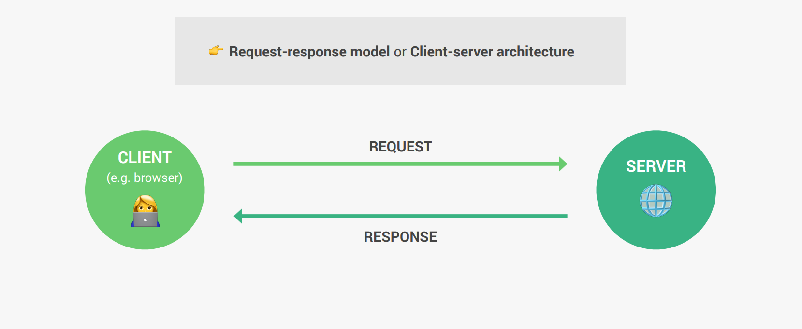
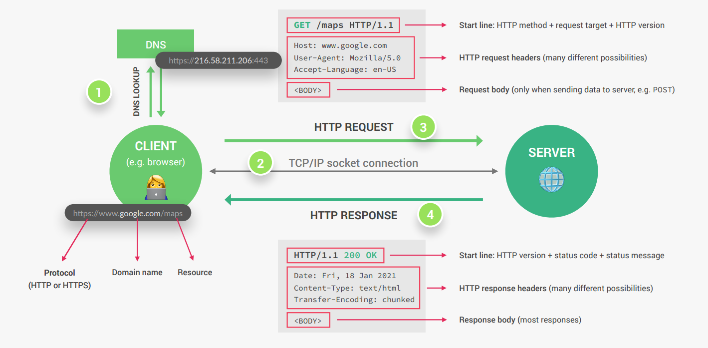

The request-response model defines a communication pattern where a client sends a request to a server, and the server responds with a corresponding response.

## 1. DNS Lookup

When you enter a domain name in your web browser, the first step is to convert this domain name into an IP address that computers can understand. This process is called DNS (Domain Name System) lookup.

- **DNS (Domain Name System):** Think of DNS as the internet's phonebook. It maps domain names (like www.example.com) to their corresponding IP addresses.
- **Port:** Specifies the service running on the server. For example, HTTP typically uses port 80, and HTTPS uses port 443.

## 2. Establishing a TCP/IP Socket Connection

Once the DNS lookup provides the IP address, the client establishes a connection with the server using the TCP/IP protocol suite.

**TCP/IP** stands for Transmission Control Protocol/Internet Protocol. It is a set of networking protocols that allows computers to communicate over a network, such as the internet. This is done through a process called the three-way handshake.

### Three-Way Handshake

1. **SYN (Synchronize):** The client sends a TCP packet with the SYN flag set to the server to initiate a connection.
2. **SYN-ACK (Synchronize-Acknowledge):** The server responds with a TCP packet that has both the SYN and ACK flags set, indicating it has received the client's SYN and is ready to establish a connection.
3. **ACK (Acknowledge):** The client sends back a TCP packet with the ACK flag set, acknowledging the server's SYN-ACK. At this point, the TCP connection is established.

## 3. HTTP Request/Response

After the TCP connection is established, the browser sends an HTTP (Hypertext Transfer Protocol) request to the server for the desired web page or resource.

### HTTP Request

- **Method:** The request method (e.g., GET, POST, PUT, DELETE) specifies the action to be performed.
- **URL:** The path to the resource being requested.
- **Headers:** Additional information about the request, such as the user agent and accepted response formats.
- **Body:** Data sent to the server (primarily in POST or PUT requests).

### HTTP Response

The server processes the request and sends back an HTTP response, which includes the following:

- **Status Code:** Indicates the result of the request (e.g., 200 OK, 404 Not Found).
- **Headers:** Additional information about the response, such as content type and length.
- **Body:** The requested resource (like an HTML file, images, CSS, JavaScript, etc.).

### Additional Steps in the Request-Response Cycle

1. **SSL/TLS Handshake (for HTTPS):** If the connection is secure (HTTPS), an SSL/TLS handshake occurs to encrypt the communication between the client and server.
2. **Caching:** The browser checks if it has a cached version of the resource. If valid, it can serve the resource from the cache instead of requesting it from the server.
3. **Rendering:** The browser parses the HTML, CSS, and JavaScript to render the webpage for the user.

## Conclusion

Understanding the process of accessing a webpage involves knowing about DNS lookup, establishing TCP/IP connections, and the HTTP request/response cycle. These steps ensure that the client and server can communicate efficiently and securely to deliver the desired web content.
