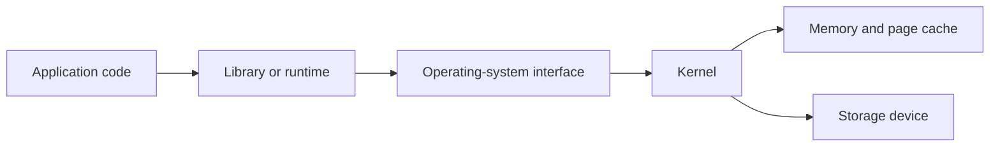
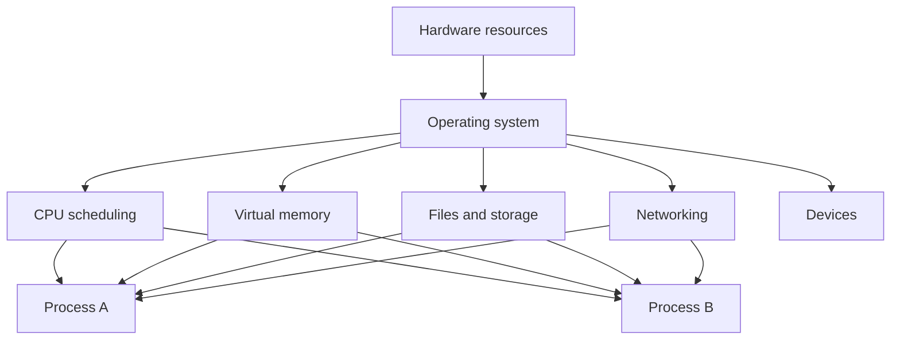
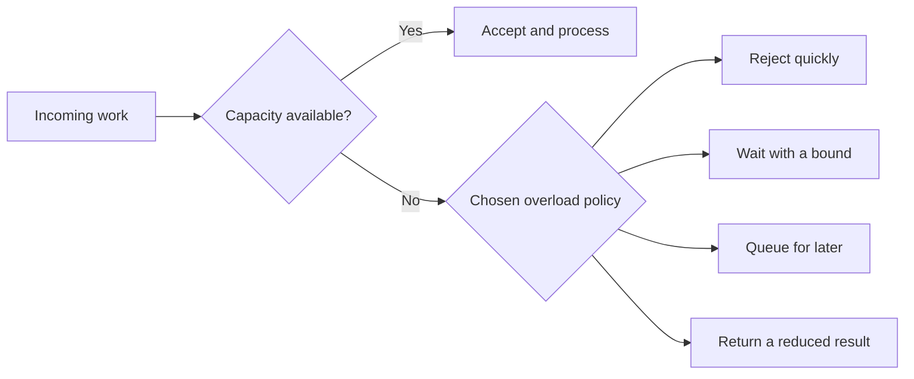
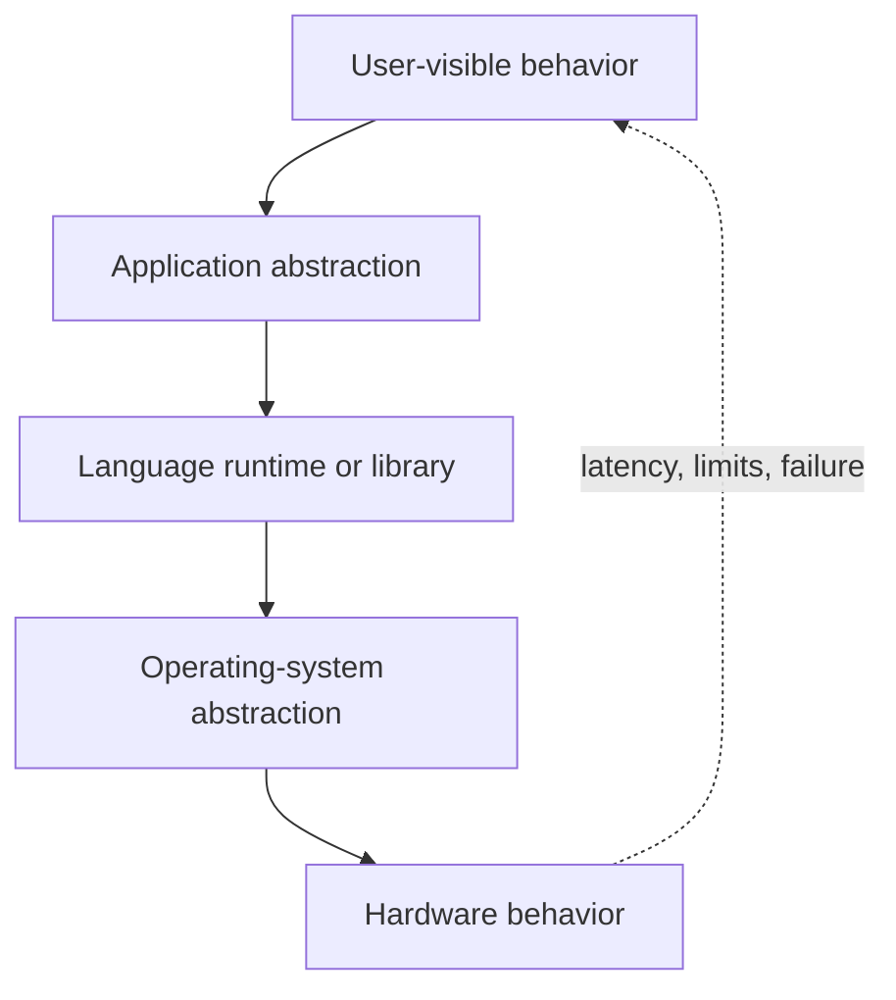

## The plain definition

This is the first chapter in the Systems Programming Foundations arc, and the first article in the whole series. Before we get into CPU caches, file descriptors, schedulers, and distributed consensus, we need to settle one question: what is systems programming, and why does it deserve its own way of looking at software? The rest of this roadmap assumes you will learn to see the resources underneath every operation and to ask who is responsible for them. This chapter builds that habit. It is lighter on mechanics than the chapters that follow, because its only real job is to hand you the lens you will use on everything else.

Systems programming is the work of building software that manages, or directly depends on, resources such as CPU time, memory, storage, devices, and network connections. The operating system sits between most programs and the hardware, so a systems programmer has to understand the boundaries, costs, limits, and failure behavior of that relationship.

It is not defined by the language alone. A program written in C, Rust, Go, or something else is systems software when its main job is to control resources, provide infrastructure, or sit close to the operating system. The useful distinction is the kind of problem the software has to solve, not the syntax used to solve it.

This matters more than it first looks. An engineer who thinks in terms of language, saying "I write Go" or "I write Rust," tends to reach for whatever library solves the immediate problem. An engineer who thinks in terms of responsibility, saying "I own the resource behavior of this component," asks a different set of questions before writing a line: what does this consume, who else depends on it, and what happens when it fails? That second habit of mind is what this entire roadmap is built to install, one layer at a time.

## Two kinds of software work

Application programming usually aims at a user or business problem. An application might render a page, process an order, compute a report, or power a search box. It normally reaches the operating system through libraries and runtime environments instead of implementing those facilities itself. The application developer's mental model can often stop at the API boundary: call a function, get a result, move on.

Systems programming stays closer to how those facilities are actually provided. A systems program might be a database, an operating-system component, a compiler, a runtime, a storage engine, a network proxy, a container runtime, a device driver, or a command-line tool. Here the mental model cannot stop at the API boundary, because the systems program is often the API boundary for something else.

The difference is about responsibility, not rank. A web app still depends on memory, files, processes, and networks. It simply lets other layers manage much of that complexity, and that reliance is a reasonable engineering choice, not a shortcut. A database has to make more of those decisions itself, because its correctness and performance rest directly on storage layout, memory use, concurrency, and crash behavior. Neither kind of software is "more real" than the other. They sit at different points along the same chain of responsibility.

Take a request that reads a file.



An application developer may think of that as "read a file." A systems engineer asks more: is the data already in memory? Will the call block? What if the file is larger than available memory? Who checks permissions? What if the disk is slow or gone? How many file descriptors can the process open? What does the application see when the operation fails?

Both are using the same system, often the same line of code. The difference is not what they type but how many of those boxes they feel responsible for. The systems engineer is responsible for more of the path and its consequences, and that responsibility does not disappear just because the API looks like a single function call.

## Where business logic ends and infrastructure begins

Business software usually represents business concepts: customers, orders, invoices, products, permissions. Systems software usually provides the mechanisms that let other software run, communicate, store data, or drive hardware. It is tempting to draw a clean line here, but the line moves depending on which part of a system you are looking at.

The boundary is not absolute. A database holds business data, yet its storage engine is systems software. A cloud control plane may expose business APIs while also managing processes, machines, networks, and storage. A web server may serve application content while still having to manage sockets, connections, buffers, timeouts, and processes. Even one service can straddle the line: the part that validates an order is business logic, and the part that decides how many worker goroutines to run and how large its connection pool should be is systems work, in the same repository.

It is more useful to ask what a component is responsible for than to ask which category its name belongs to.

```text
Business or application layer
    Orders, users, search, payments, reports

Systems and infrastructure layer
    Databases, runtimes, proxies, queues, filesystems, schedulers

Operating-system layer
    Processes, memory, files, networking, devices, security

Hardware layer
    CPUs, memory chips, storage devices, network interfaces
```

The layers connect, and a choice made at the top can create work at the bottom without anyone intending it. A feature that lets users upload large files may require streaming, temporary storage, limits, backpressure, cleanup, and protection against disk exhaustion. The product decision was "let users upload files." The systems consequence was an entire subsystem for managing storage lifetime under load. Nobody wrote "handle disk exhaustion" into the original request, but it was implied the moment "large files" appeared.

## The operating system as a resource provider

The operating system manages hardware resources and provides controlled interfaces for programs to use them. It decides which process runs on a CPU, which memory pages belong to which process, which files can be opened, how data travels through a network interface, and which operations a user is allowed to perform.

Said plainly: the operating system is not a set of utilities sitting next to your program. It is an active manager of shared resources, constantly making decisions on your program's behalf, whether your program knows it or not. Every one of those decisions has a cost, and every one of them can be observed if you know where to look.



The operating system provides several properties worth slowing down on, because the rest of this roadmap is essentially a long study of what happens when each of them is stressed, bent, or broken.

### Why abstractions hide cost but not consequences

An abstraction gives a program a simpler interface than the hardware underneath. A program can use a file instead of knowing where every disk block lives. It can use a virtual address instead of managing physical memory directly. It can use a socket instead of driving every network device operation.

An abstraction is not magic, and it helps to resist treating it as one. It hides detail, but the hidden detail still shapes behavior. A file read is fast when the data is in the page cache and slow when the storage device must be touched, yet the interface looks identical in both cases. A memory access is cheap when the page is mapped and expensive when it triggers a page fault, and the source code does not change between the two. A socket write can block when buffers are full, and the function signature gives no hint that this is even possible. The abstraction's job is to make the common case simple, not to make the underlying cost disappear.

### Isolation keeps programs apart

The operating system stops one process from freely reading or writing another process's memory. It also checks permissions before allowing access to files, devices, and other protected resources.

Isolation is what lets many programs share one machine without trusting each other completely, which is what makes multi-tenant systems, cloud platforms, and even your own laptop's ability to run untrusted software possible. It is not absolute, and this matters more the deeper you go. Kernel bugs, unsafe configuration, or excess privilege can weaken the boundary, and a meaningful part of Stage 11 of this roadmap is devoted to exactly the ways that boundary gets weakened in practice.

### Multiplexing: sharing one resource with many

Multiplexing means sharing one resource among many users. The operating system gives different processes turns on a CPU, maps different virtual address spaces onto physical memory, and shares a network interface among many connections.

Multiplexing creates contention, and contention is where most of the interesting and painful behavior in systems programming comes from. When many processes need the same CPU or disk, they must wait or compete. That delay is part of the system's behavior, not a bug outside it. When you later read about queueing theory, tail latency, or scheduler fairness, you are really reading about the consequences of multiplexing under load.

### Lifetimes: when resources begin and end

Resources have lifetimes. A file descriptor must be opened before use and closed when no longer needed. Memory must be allocated before access and released or reclaimed later. A process must be started, supervised, and eventually terminated.

Many production failures are lifetime failures, and they are quietly common: a connection is never returned to a pool, a file descriptor leaks, a temporary file is never removed, or a process holds a resource longer than it should. These bugs are dangerous precisely because they are invisible in normal testing. A leaked file descriptor does nothing wrong for the first thousand requests. It only becomes a visible failure once the process hits its limit, usually in production, usually at the worst possible moment.

## Nothing the operating system does comes for free

Every operation consumes some resource, even when the code looks simple. This is one of the most important habits to build early, because it is the easiest to lose once a language or framework makes an operation look free.

Creating a thread eats memory and scheduler capacity. Opening a connection eats a file descriptor, kernel state, buffers, and often a slot in a remote service. Reading a file eats CPU time and may eat memory for cached data. Sending a network request eats bandwidth, socket buffers, CPU, and the attention of another service. None of this shows up in the function signature. `os.ReadFile("message.txt")` looks as cheap as `1 + 1`, and it is not.

This is why systems engineers ask what an operation costs and how that cost grows, not merely whether it works on one input.

For example, suppose one request uses two database connections and a service receives 1,000 concurrent requests. The service may need up to 2,000 connections unless it limits or shares them. The database may reject the connections, spend too long managing them, or run out of memory. The original code can look correct for a single request yet fail once resource usage scales. The bug, if you can call it that, was never in the logic. It was in the assumption that resource usage is a constant instead of a function of load.

This is the start of capacity reasoning: connect an operation to the resources it consumes, then ask how that consumption changes as the number of callers grows from one to a thousand.

## Ownership is the root of most resource bugs

Ownership answers the question: who is responsible for this resource? The owner might be a process, a thread, a service, a team, or a component inside a program. It is a deceptively small question, and almost every resource-related bug you will ever debug can be traced back to it being unclear somewhere in the code.

If ownership is unclear, cleanup and failure handling are usually unclear too. Imagine a function that opens a file and returns a data structure. Who closes the file? If the caller does not know the structure holds an open descriptor, the descriptor may stay open until the process hits its limit. Multiply that across every function in a codebase that quietly holds a resource, and you get the slow, creeping kind of incident that takes days to diagnose, because nothing is obviously wrong until the limit arrives.

A component should know:

- Who creates the resource
- Who is allowed to use it
- Who releases it
- What happens when the owner crashes
- What happens when the resource becomes unavailable

Languages express ownership differently, and it is worth seeing this as a spectrum rather than a binary choice between "safe" and "unsafe" languages. Rust encodes ownership and borrowing in the type system, so the compiler refuses to let ownership become ambiguous. C leans on conventions and explicit cleanup, so the discipline lives in the programmer. Garbage-collected languages reclaim some memory automatically, but they do not automatically solve every resource-lifetime problem. A database connection, file descriptor, lock, or network session can still need deliberate management even in a language that never makes you think about `malloc` and `free`.

The language can help enforce ownership, but the engineering responsibility exists regardless of language. A Go program with a garbage collector can still leak file descriptors forever, because the collector has no idea that a descriptor is a scarce operating-system resource rather than ordinary heap memory.

## What happens when resources run out

Resources are finite. A system can run out of memory, CPU capacity, disk space, file descriptors, network ports, connections, or queue capacity. That sounds obvious written down, yet a surprising amount of production software is written as though it were not true.

A limit is not automatically a sign of a broken system. A limit can protect the system from one component consuming everything. A bounded connection pool stops a service from opening unlimited database sessions. A bounded queue stops memory from growing forever when producers outrun consumers. A limit chosen deliberately is a design decision. A limit hit by accident, with no plan for what comes next, is an incident.

The important question is what the system does at the limit.



An unbounded queue often looks friendly because it accepts all work, and that is exactly why it is a trap. In reality it moves the failure into memory usage and rising latency until the process becomes unstable. It converts an explicit, visible failure, "this request was rejected," into a slow, invisible one, "this process is quietly using more memory every minute until it dies." A bounded queue forces an explicit decision: reject, wait, delay, or degrade. That decision is uncomfortable to make up front, which is exactly why so few systems make it up front, and exactly why so many outages trace back to the moment an unbounded queue met a producer that outran its consumer.

This is why resource limits belong to correctness, not only to operations. A system that behaves correctly only while resources are unlimited is incomplete, in the same way a function that only works for positive numbers is incomplete if negative numbers are valid input.

## Designing as if things will fail

Systems programming assumes operations can fail. A file may be missing, a device may return an error, a process may be killed, memory allocation may fail, a network connection may close, a dependency may respond too slowly. None of these are edge cases in the rare sense. Across a large enough fleet of machines running long enough, every one of them happens continuously, somewhere.

The right response depends on the operation, and part of the craft is knowing which response fits which failure. A temporary network failure may be worth retrying. A malformed request should usually be rejected outright, since retrying it will only fail the same way again. A failed write may require rolling back an in-memory change so the program's internal state does not drift out of sync with what was actually persisted. A process may need to restart, but an automatic restart only helps if the underlying cause does not immediately make the new process fail again. A process that crashes on startup because of a bad config file will simply crash-loop forever if the only response to failure is "restart it."

Failure handling also has to account for partial completion, which is one of the harder ideas to internalize early. An operation can fail after doing part of its work. A service may save a record successfully but lose the network connection before sending the response. The client, having received nothing, may retry, creating a duplicate record unless the operation was designed to be idempotent.

Idempotent means that repeating the same request produces the same final effect as performing it once. Setting a resource to a value is often easier to make idempotent than incrementing a counter or charging a payment, because "set balance to 100" yields the same result no matter how many times it runs, while "add 10 to balance" does not. This distinction matters later in networking, databases, and distributed systems, and it is worth planting the seed here: partial failure is not a special case you handle with a separate code path. It is a routine condition that should shape how an operation is designed from the start.

## Why passing once is not proof

Deterministic behavior means the same inputs and relevant state produce the same result. Determinism is valuable because it makes systems easier to test, debug, and reason about. If you run a piece of code twice with the same input and get two different answers, every tool you normally rely on, unit tests, a debugger, before-and-after comparisons, becomes less trustworthy.

Systems are often not fully deterministic, and it is better to be honest about that than to pretend otherwise. Thread scheduling can change the order of operations. Network messages can arrive at different times. Disk latency can vary. Random identifiers and clocks can change results. The goal is not to pretend those sources of variation do not exist. The goal is to control them where possible and make the remaining behavior observable, so that when something goes wrong you have a way to find out why, rather than shrugging and calling it a fluke.

For example, a concurrent program can have a race condition, a bug where the result depends on an uncontrolled timing relationship that usually resolves one way. The program may pass a test many times and fail only under a particular schedule, one that might occur once in ten thousand runs, or only on a machine under heavy load, or only on a specific day of the month because some unrelated cron job steals CPU at the wrong moment. A systems engineer must understand that "it passed once," or even "it passed a hundred times," is weak evidence when timing can change the result. The absence of a failure is not the same as the absence of a bug.

Determinism also matters for builds and deployments, an area easy to overlook because it feels adjacent to systems programming rather than part of it. If the same source produces different artifacts depending on the machine or the time of day, debugging and rollback get harder, because you can no longer be certain that "the same code" that worked in staging is actually the same binary in production. Reproducible builds and explicit configuration reduce that uncertainty, turning "I think this is the same thing" into something you can verify.

## Performance is a requirement, not a finishing touch

Performance describes how efficiently a system uses resources and how quickly it responds. Two terms matter here, and it is worth being precise about the difference, because they are confused constantly, even by engineers who should know better.

**Latency** is the time taken by one operation.
**Throughput** is the amount of work completed in a period of time.

A system can have high throughput but poor latency if it processes many requests in batches while each request waits a long time, think of a batch job that handles a million records an hour but makes any single record wait up to fifty-nine minutes before it is touched. It can also have low latency for a few requests but poor throughput under concurrency, which is the classic shape of a system that was only ever load-tested with one user in the room.

Performance decisions should start from the requirement and the evidence, not from intuition about what "feels slow." If users need a response within 100 milliseconds, average latency is not enough. Tail latency matters, because a small group of very slow requests can still ruin the experience for a meaningful fraction of real users, even while the average looks healthy on a dashboard. If a batch job must process millions of records overnight, throughput may matter more than the latency of any single record, and optimizing for per-record latency in that case can even be counterproductive if it costs total throughput.

The systems view asks where time is spent:

```text
Request latency
  = queue waiting
  + CPU work
  + memory stalls
  + storage I/O
  + network time
  + dependency time
  + response processing
```

This is a model, not a universal equation, and it will not balance perfectly for every system. Its purpose is to stop vague statements like "the service is slow" from being the entire diagnosis. "Slow" is not an answer, it is a starting point, and the breakdown above is the first tool for turning it into one.

## The boundaries that are meant to hold

A security boundary separates code or users with different trust levels. User space and kernel space form one important boundary. A process boundary separates one address space from another. A service boundary can separate teams, credentials, and data ownership. These boundaries exist at every layer this roadmap covers, from a single CPU's privilege rings up to which team is allowed to deploy which service.

A boundary is useful only if the system enforces it, and that enforcement has to hold on every path, not just the obvious one. A file permission, capability, sandbox, or API authorization check matters only when every relevant access path goes through it. A boundary enforced on the main API endpoint but forgotten on a debug endpoint, an internal admin tool, or a backup script is not really a boundary. It is a boundary with a hole in it, and attackers and bugs alike tend to find the hole rather than the front door.

Control means deciding more directly how a resource behaves. Convenience means relying on a higher-level layer to make that decision for you. A managed runtime may reclaim memory, schedule work, and provide networking APIs automatically. That raises developer productivity, but it also means the program must understand the runtime's pauses, buffers, limits, and failure behavior when those details affect the system. Choosing convenience is not a mistake. It is a trade you are making, often without realizing it, until the day the garbage collector pauses for two hundred milliseconds at exactly the wrong moment.

More control is not automatically better. Direct control can improve predictability or performance, but it also creates more responsibility. A custom allocator can fit a workload well, but it must handle alignment, fragmentation, concurrency, and failure, all of which the standard allocator was already handling for you, invisibly, before you took it over. A manually managed connection can avoid pooling overhead, but the program must handle cleanup and limits correctly, or it recreates every problem a pool exists to solve, just with your own bugs instead of a library's.

Good engineering picks the lowest level of control that meets the real requirements. Reaching for more control than the problem needs is not a sign of seriousness. It is usually a sign of unexamined cost.

## When abstractions leak

An abstraction leak happens when details hidden by an interface affect observable behavior. It is one thing to know, abstractly, that abstractions leak. It is another to spot exactly where, in your own code, one is leaking right now.

A file abstraction hides disk blocks, but disk latency can still affect a file read. The function signature `read()` gives no indication of whether the next call takes a microsecond or ten milliseconds. A socket abstraction hides packet transmission, but network loss and congestion can still delay a response, sometimes by orders of magnitude, with the API offering no visible warning. A memory abstraction hides physical pages, but page faults and cache misses can still affect performance, silently turning what looks like a simple array access into a multi-hundred-cycle stall. A database abstraction hides storage records, but indexes, locks, and log flushing can still affect latency and durability, so two queries that look identical in SQL can have wildly different costs depending on what is happening underneath.

The existence of a leak does not make the abstraction bad, and this is worth repeating, because it is easy to turn cynical about abstractions once you start noticing their leaks everywhere. Abstractions are valuable because they reduce the detail most code must manage most of the time. The systems engineer needs to know which hidden details matter for the current problem and when to look below the abstraction, not to throw abstractions away and reason about disk sectors every time they open a file.



The dotted path is the lesson. Hidden layers still influence visible behavior through latency, limits, errors, resource consumption, and failure, even when every layer in between is working exactly as documented. Nothing needs to be broken for a leak to happen. The leak is built into the nature of hiding detail at all.

## Convenience and cost in one piece of code

The following Go program uses a high-level file API. It does not manipulate a disk directly or issue raw device commands. The operating system still manages the file descriptor, permissions, page cache, and storage interaction underneath it, whether the code acknowledges that or not.

```go
package main

import (
	"fmt"
	"os"
)

func main() {
	data, err := os.ReadFile("message.txt")
	if err != nil {
		fmt.Printf("read message.txt: %v\n", err)
		return
	}

	fmt.Print(string(data))
}
```

This is convenient because the program does not manage the individual read operations. The operating system and the Go runtime handle that. But the abstraction does not remove the underlying costs. The file may be large, the read may fail, the path may be inaccessible, and the data may come from storage rather than memory, and the code above looks exactly the same in all of those cases.

If the program must process a very large file, reading it all at once may use too much memory. The engineer may choose a streaming interface instead, reading and processing the file in chunks rather than loading it whole. That is a systems decision, not a stylistic one. The higher-level operation is convenient, but the resource behavior decides whether it is appropriate for the file sizes this program will actually meet in production, not just in a test with a small sample file.

## How experienced engineers actually debug

When a system behaves unexpectedly, an experienced engineer usually moves through a sequence like this, often without naming each step aloud, but the order matters more than it seems:

1. Define the symptom precisely. "The service is slow" is not enough. Identify which operation is slow, for whom, and under what load.
2. Identify the resources involved. Consider CPU, memory, storage, network, queues, locks, and dependencies.
3. Find the relevant boundary. The delay may be inside the process, in the kernel, on a device, or in another service.
4. Check the limits and ownership. Look for exhausted descriptors, full queues, memory pressure, connection limits, or unclear cleanup.
5. Collect evidence. Use logs, metrics, traces, system tools, packet captures, or a small reproduction.
6. Choose the smallest safe change that addresses the cause.
7. Make the result observable and reversible.

This approach helps because it connects the high-level symptom to the lower-level mechanism without assuming the first explanation is correct. Under the pressure of an incident, it is tempting to jump from symptom to fix, "requests are slow, let's add more servers," and skip the middle steps entirely. Sometimes that guess is right. Often it treats a symptom while leaving the actual resource exhaustion, ownership bug, or boundary crossing exactly where it was, waiting to resurface the next time load increases.

## Where the rest of this roadmap goes from here

The rest of systems engineering is a deeper study of the relationships introduced here. Every later stage is, in a sense, an elaboration on one sentence from this chapter.

Processes explain isolation, scheduling, and ownership of execution, a direct extension of the isolation and multiplexing properties above. Virtual memory explains how the operating system gives each process an address space while sharing physical memory, a direct extension of the abstraction and multiplexing properties. Files and sockets explain how programs interact with storage and networks, and each will turn out to hide cost the same way the file-reading example did. Concurrency explains what happens when multiple operations share state, which is the multiplexing property pushed to its limit. Distributed systems extend the same problems, ownership, limits, failure, determinism, across machines where communication is slower and failure is messier, and nothing fundamentally new is introduced there so much as everything from this chapter is made harder at once.

The same questions will keep returning, article after article, stage after stage:

- What resource is being used?
- Who owns it?
- What are its limits?
- What happens when the operation blocks or fails?
- Which boundary does the request cross?
- What does the abstraction hide?
- How do we measure the behavior?
- What tradeoff are we accepting?

Those questions are the foundation of systems thinking, and if nothing else from this chapter is retained, retaining that list and the habit of asking it automatically is the whole point.

## Definitions

### What is systems programming?

> Systems programming is the development of software that manages or directly depends on resources such as CPU, memory, storage, devices, and networks.

### If asked for more detail

> The main difference from ordinary application programming is the level of responsibility. Systems software must reason more directly about resource ownership, limits, performance, isolation, and failure. Examples include operating-system components, databases, runtimes, compilers, storage engines, and network services.

### What is the operating system's role?

> The operating system manages shared hardware resources and provides controlled interfaces that programs use to access them. It also provides isolation, protection, scheduling, and resource limits.

### Why do abstractions leak?

> An abstraction hides implementation details, but those details can still affect observable behavior. For example, a file API hides disk operations, but disk latency, caching, and storage failure can still affect the program.

### Is systems programming only about C or Rust?

> No. The language is only one part of the decision. Systems programming is defined more by the software's responsibility and resource behavior. C, Rust, Go, Zig, and others can all be used for systems work when their tradeoffs fit the requirements.

## Common misconceptions

### "Systems programming means writing kernel code."

Kernel development is one form of systems programming, but databases, compilers, runtimes, filesystems, proxies, storage engines, and infrastructure services are also systems software. Most engineers who spend a career doing systems work never touch kernel source code at all.

### "High-level languages cannot be used for systems work."

A high-level language may still give useful control over networking, concurrency, memory, and processes. The real question is whether its runtime behavior and performance fit the system being built, not whether the language is fashionable to call "low-level."

### "The operating system hides everything important."

The operating system hides many implementation details, but resource limits, scheduling, caching, permissions, and failure still affect applications. Hiding a detail is not the same as removing its consequences.

### "More control is always better."

More control can improve predictability, but it also creates more responsibility and more ways to make mistakes. The best design uses enough control to meet the requirements without adding unnecessary complexity, and knowing where that line sits is most of what separates a good systems engineer from a merely cautious one.

## Summary

Systems programming is about building software that manages resources and provides reliable foundations for other software. The operating system supplies abstractions, isolation, multiplexing, and lifetime management, but the underlying limits and failure modes stay important no matter how well those abstractions are designed.

The central systems-engineering habit is to connect a high-level operation to the resources and boundaries underneath it. When a program reads a file, sends a request, creates a thread, or writes to a database, ask what the operation consumes, who owns that resource, what can block or fail, and how the behavior can be observed. That habit, repeated across every layer this roadmap will cover, is the actual skill being built here, not any single fact about files, memory, or sockets.
