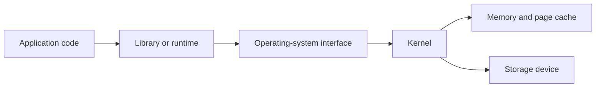
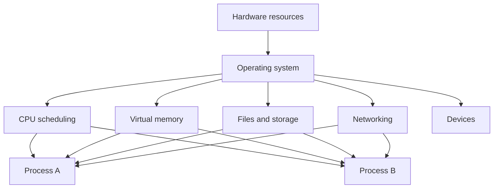
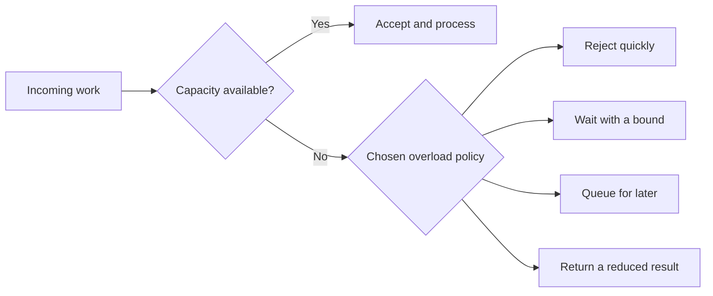
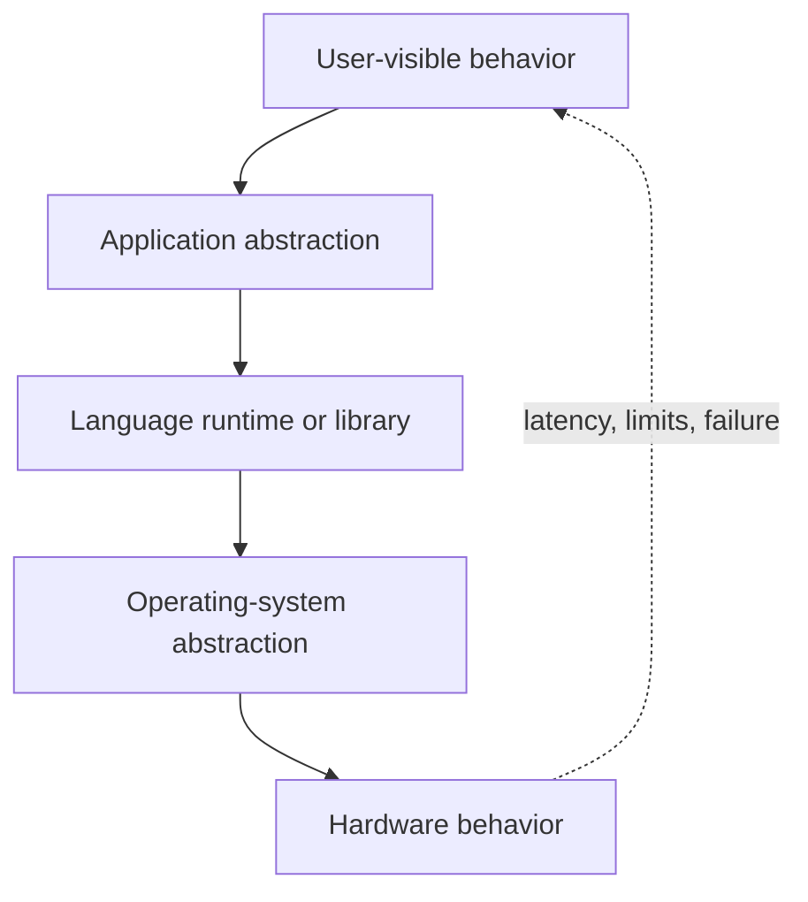

> Stage 1 - Systems Programming Foundations  
> Subject area 1.1 - What Systems Programming Means  
> Article 1

## The short version

Systems programming is the work of building software that manages or directly depends on resources such as CPU time, memory, storage, devices, and network connections. The operating system sits between many programs and the hardware, so systems programmers must understand the boundaries, costs, limits, and failure behavior of that relationship.

Systems programming is not defined only by the language used. A program written in C, Rust, Go, or another language can be systems software if its main responsibility is to control resources, provide infrastructure, or operate close to the operating system. The important difference is the kind of problems the software must solve.

## Where this article fits

This is the first technical article in the roadmap. It gives us the model that the later articles will use when they explain processes, memory, files, sockets, scheduling, databases, and production systems.

The next article, **CPU, Memory, Storage, and Network Resources**, will examine the main resources that software uses. Later articles will explain how the operating system exposes those resources through processes, system calls, virtual memory, filesystems, sockets, and other interfaces.

You do not need to know page tables, TCP packet structure, or kernel source code before reading this article. Those subjects will come later. The goal here is to understand why they matter.

## Application programming and systems programming

Application programming usually focuses on solving a user or business problem. An application might display a page, process an order, calculate a report, or provide a search feature. It usually uses operating-system facilities through libraries and runtime environments instead of implementing those facilities itself.

Systems programming focuses more directly on how software uses and provides those facilities. A systems program might implement a database, operating-system component, compiler, runtime, storage engine, network proxy, container runtime, device driver, or command-line tool.

The difference is about responsibility, not importance. A web application still depends on memory, files, processes, and networks. It simply relies on other layers to manage much of that complexity. A database must make more of those decisions itself because its performance and correctness depend directly on storage layout, memory usage, concurrency, and crash behavior.

Consider a request that reads a file.



An application developer may think of this as “read a file.” A systems engineer asks more questions. Is the data already in memory? Will the call block? What happens if the file is larger than available memory? Who checks permissions? What happens if the disk is slow or disconnected? How many file descriptors can the process open? What does the application observe when the operation fails?

Both developers are using the same system. The systems engineer is responsible for understanding more of the path and its consequences.

## Systems software and business software

Business software usually represents business concepts such as customers, orders, invoices, products, or permissions. Systems software usually provides the mechanisms that allow other software to run, communicate, store data, or use hardware.

The boundary is not absolute. A database contains business data, but its storage engine is systems software. A cloud control plane may expose business APIs, but it also manages processes, machines, networks, and storage. A web server may serve application content, but it must manage sockets, connections, buffers, timeouts, and processes.

It is more useful to ask what a component is responsible for than to ask which category its name belongs to.

```text
Business or application layer
    Orders, users, search, payments, reports

Systems and infrastructure layer
    Databases, runtimes, proxies, queues, filesystems, schedulers

Operating-system layer
    Processes, memory, files, networking, devices, security

Hardware layer
    CPUs, memory chips, storage devices, network interfaces
```

The layers are connected. A business decision can create a systems problem. For example, a feature that lets users upload large files may require streaming, temporary storage, limits, backpressure, cleanup, and protection against disk exhaustion.

## The operating system as a resource provider

The operating system manages hardware resources and provides controlled interfaces for programs to use them. It decides which process runs on a CPU, which memory pages belong to a process, which files can be opened, how data is sent through a network interface, and which operations a user is allowed to perform.

The operating system is not simply a collection of utilities. It is an active manager of shared resources.



The operating system provides several important properties.

### Abstraction

An abstraction gives a program a simpler interface than the underlying hardware. A program can use a file instead of knowing the physical location of every disk block. It can use a virtual address instead of directly managing physical memory. It can use a socket instead of controlling every network device operation.

An abstraction is not magic. It hides detail, but the hidden detail still affects behavior. A file read can be fast when data is in the page cache and slow when the storage device must be accessed. A memory access can be cheap when the page is mapped and expensive when it causes a page fault. A socket write can block when buffers are full.

### Isolation

The operating system prevents one process from freely reading or modifying another process's memory. It also checks permissions before allowing access to files, devices, and other protected resources.

Isolation makes it possible for multiple programs to share one machine without every program being trusted completely. It is not absolute. Bugs in the kernel, unsafe configuration, or excessive privileges can weaken the boundary.

### Multiplexing

Multiplexing means sharing one resource among multiple users. The operating system gives different processes turns on a CPU, maps different virtual address spaces onto physical memory, and shares a network interface among many connections.

Multiplexing creates contention. If many processes need the same CPU or disk, they must wait or compete. The resulting delay is part of the system's behavior.

### Lifetime management

Resources have lifetimes. A file descriptor must be opened before it can be used and closed when it is no longer needed. Memory must be allocated before it is accessed and released or reclaimed later. A process must be started, monitored, and eventually terminated.

Many production failures are lifetime failures: a connection is never returned to a pool, a file descriptor is leaked, a temporary file is not removed, or a process keeps a resource longer than expected.

## A resource is never free

Every operation consumes some resource, even when the code looks simple.

Creating a thread consumes memory and scheduler capacity. Opening a connection consumes a file descriptor, kernel state, buffers, and often a slot in a remote service. Reading a file consumes CPU time and may consume memory for cached data. Sending a network request consumes bandwidth, socket buffers, CPU, and the attention of another service.

This is why systems engineers ask what an operation costs and how that cost grows.

For example, if one request uses two database connections and a service receives 1,000 concurrent requests, the service may need up to 2,000 connections unless it limits or shares them. The database may reject the connections, spend too much time managing them, or run out of memory. The original code may appear correct for one request but fail when resource usage scales.

This is the beginning of capacity reasoning: connecting an operation to the resources it consumes.

## Ownership and lifetime

Ownership answers the question, “Who is responsible for this resource?” The owner may be a process, a thread, a service, a team, or a component inside a program.

If ownership is unclear, cleanup and failure handling are usually unclear as well. Suppose a function opens a file and returns a data structure. Who closes the file? If the caller does not know that the structure contains an open descriptor, the descriptor may remain open until the process reaches its limit.

Good systems make ownership visible. A component should know:

- Who creates the resource
- Who is allowed to use it
- Who releases it
- What happens when the owner crashes
- What happens when the resource becomes unavailable

Different languages express ownership in different ways. Rust uses ownership and borrowing rules in the type system. C relies more heavily on conventions and explicit cleanup. Garbage-collected languages reclaim some memory automatically, but they do not automatically solve every resource-lifetime problem. A database connection, file descriptor, lock, or network session may still need deliberate management.

The language can help enforce ownership, but the engineering responsibility exists regardless of the language.

## Limits and exhaustion

Resources are finite. A system can run out of memory, CPU capacity, disk space, file descriptors, network ports, connections, or queue capacity.

Resource limits are not always signs of a broken system. A limit can protect the system from one component consuming everything. A bounded connection pool prevents a service from creating unlimited database sessions. A bounded queue prevents memory from growing forever when producers are faster than consumers.

The important question is what the system does at the limit.



An unbounded queue often looks friendly because it accepts all work. In reality, it moves the failure into memory usage and increases latency until the process becomes unstable. A bounded queue forces the system to make an explicit decision: reject, wait, delay, or degrade.

This is why resource limits are part of correctness, not only operations. A system that behaves correctly only while resources are unlimited is incomplete.

## Failure handling is part of the design

Systems programming assumes that operations can fail. A file may not exist, a device may return an error, a process may be killed, memory allocation may fail, a network connection may close, and a dependency may respond too slowly.

The correct response depends on the operation. A temporary network failure may be worth retrying. A malformed request should usually be rejected. A failed write may require rolling back an in-memory change. A process may need to restart, but an automatic restart is useful only if the underlying cause does not immediately make the new process fail again.

Failure handling must also consider partial completion. An operation can fail after doing part of its work. For example, a service may save a record successfully but lose the network connection before sending the response. The client may retry, creating a duplicate unless the operation is designed to be idempotent.

Idempotent means that repeating the same request produces the same final effect as performing it once. Setting a resource to a value is often easier to make idempotent than incrementing a counter or charging a payment. This distinction becomes important later in networking, databases, and distributed systems.

## Determinism and repeatability

Deterministic behavior means that the same inputs and relevant state produce the same result. Determinism is valuable because it makes systems easier to test, debug, and reason about.

Systems are often not completely deterministic. Thread scheduling can change the order of operations. Network messages can arrive at different times. Disk latency can vary. Random identifiers and clocks can change results. The goal is not to pretend that these sources of variation do not exist. The goal is to control them where possible and make the remaining behavior observable.

For example, a concurrent program may have a race condition (the result depends on an uncontrolled timing relationship between operations). The program may pass a test many times and fail only under a particular schedule. A systems engineer must understand that “it passed once” is weak evidence when timing can change the result.

Determinism also matters for builds and deployments. If the same source code produces different artifacts depending on the machine or time of day, debugging and rollback become harder. Reproducible builds and explicit configuration reduce that uncertainty.

## Performance is a constraint, not a decoration

Performance describes how efficiently a system uses resources and how quickly it responds. Two terms are especially important.

**Latency** is the time taken by one operation.  
**Throughput** is the amount of work completed in a period of time.

A system can have high throughput but poor latency if it processes many requests in batches while each request waits a long time. It can also have low latency for a small number of requests but poor throughput when concurrency increases.

Performance decisions should begin with the requirement and evidence. If users need a response within 100 milliseconds, average latency is not enough; tail latency matters because a small group of very slow requests may still create a poor experience. If a batch job must process millions of records overnight, throughput may matter more than the latency of any individual record.

The systems view asks where time is spent:

```text
Request latency
  = queue waiting
  + CPU work
  + memory stalls
  + storage I/O
  + network time
  + dependency time
  + response processing
```

This is a model, not a universal equation. Its purpose is to prevent vague statements such as “the service is slow” from becoming the entire diagnosis.

## Security boundaries and control

A security boundary separates code or users with different levels of trust. User space and kernel space form one important boundary. A process boundary separates one address space from another. A service boundary can separate teams, credentials, and data ownership.

The boundary is useful only if the system enforces it. A file permission, capability, sandbox, or API authorization check is meaningful only when every relevant access path passes through the check.

Control means deciding more directly how a resource behaves. Convenience means relying on a higher-level layer to make that decision for you. A managed runtime may automatically reclaim memory, schedule work, and provide networking APIs. This improves developer productivity, but it also means the program must understand the runtime's pauses, buffers, limits, and failure behavior when those details affect the system.

More control is not automatically better. Direct control can improve predictability or performance, but it also creates more responsibility. A custom allocator can fit a workload well, but it must handle alignment, fragmentation, concurrency, and failure. A manually managed connection can avoid pooling overhead, but the program must handle cleanup and limits correctly.

Good engineering chooses the lowest level of control that satisfies the real requirements.

## Why abstractions leak

An abstraction leak occurs when details hidden by an interface affect the behavior that the user can observe.

A file abstraction hides disk blocks, but disk latency can still affect a file read. A socket abstraction hides packet transmission, but network loss and congestion can still delay a response. A memory abstraction hides physical pages, but page faults and cache misses can still affect performance. A database abstraction hides storage records, but indexes, locks, and log flushing can still affect latency and durability.

The existence of a leak does not mean the abstraction is bad. Abstractions are valuable because they reduce the amount of detail most code must manage. The systems engineer needs to know which hidden details matter for the current problem and when to look below the abstraction.



The dotted path is the important lesson. Hidden layers still influence visible behavior through latency, limits, errors, resource consumption, and failure.

## A small code example: convenience versus control

The following Go program uses a high-level file API. It does not directly manipulate a disk or issue raw device commands. The operating system still manages the file descriptor, permissions, page cache, and storage interaction underneath it.

```go
package main

import (
	"fmt"
	"os"
)

func main() {
	data, err := os.ReadFile("message.txt")
	if err != nil {
		fmt.Printf("read message.txt: %v\n", err)
		return
	}

	fmt.Print(string(data))
}
```

This is convenient because the program does not need to manage the individual read operations. The operating system and the Go runtime handle that work. But the abstraction does not remove the underlying costs. The file may be large, the read may fail, the path may be inaccessible, and the data may come from storage rather than memory.

If the program needs to process a very large file, reading the entire file at once may consume too much memory. The engineer may choose a streaming interface instead. That is a systems decision: the higher-level operation is convenient, but the resource behavior determines whether it is appropriate.

## How experienced engineers reason about a systems problem

When a system behaves unexpectedly, an experienced engineer usually moves through a sequence like this:

1. Define the symptom precisely. “The service is slow” is not enough; identify which operation is slow, for whom, and under what load.
2. Identify the resources involved. Consider CPU, memory, storage, network, queues, locks, and dependencies.
3. Find the relevant boundary. The delay may be inside the process, in the kernel, on a device, or in another service.
4. Check the limits and ownership. Look for exhausted descriptors, full queues, memory pressure, connection limits, or unclear cleanup.
5. Collect evidence. Use logs, metrics, traces, system tools, packet captures, or a small reproduction.
6. Choose the smallest safe change that addresses the cause.
7. Make the result observable and reversible.

This approach is useful because it connects the high-level symptom to the lower-level mechanism without assuming that the first explanation is correct.

## What this means for the rest of the roadmap

The rest of systems engineering is a deeper study of the relationships introduced here.

Processes explain isolation, scheduling, and ownership of execution. Virtual memory explains how the operating system gives each process an address space while sharing physical memory. Files and sockets explain how programs interact with storage and networks. Concurrency explains what happens when multiple operations share state. Distributed systems extend the same problems across machines where communication is slower and failure is more complicated.

The same questions will keep returning:

- What resource is being used?
- Who owns it?
- What are its limits?
- What happens when the operation blocks or fails?
- Which boundary does the request cross?
- What does the abstraction hide?
- How do we measure the behavior?
- What tradeoff are we accepting?

Those questions are the foundation of systems thinking.

## Interview definition

> Systems programming is the development of software that manages or directly depends on resources such as CPU, memory, storage, devices, and networks.

### If asked for more detail

> The main difference from ordinary application programming is the level of responsibility. Systems software must reason more directly about resource ownership, limits, performance, isolation, and failure. Examples include operating-system components, databases, runtimes, compilers, storage engines, and network services.

### What is the operating system's role?

> The operating system manages shared hardware resources and provides controlled interfaces that programs use to access them. It also provides isolation, protection, scheduling, and resource limits.

### Why do abstractions leak?

> An abstraction hides implementation details, but those details can still affect observable behavior. For example, a file API hides disk operations, but disk latency, caching, and storage failure can still affect the program.

### Is systems programming only about C or Rust?

> No. The language is only one part of the decision. Systems programming is defined more by the software's responsibility and resource behavior. C, Rust, Go, Zig, and other languages can all be used for systems work when their tradeoffs fit the requirements.

## Common misconceptions

### “Systems programming means writing kernel code.”

Kernel development is one form of systems programming, but databases, compilers, runtimes, filesystems, proxies, storage engines, and infrastructure services are also systems software.

### “High-level languages cannot be used for systems work.”

A high-level language may provide useful control over networking, concurrency, memory, and processes. The important question is whether its runtime behavior and performance are appropriate for the system being built.

### “The operating system hides everything important.”

The operating system hides many implementation details, but resource limits, scheduling, caching, permissions, and failure still affect applications.

### “More control is always better.”

More control can improve predictability, but it also creates more responsibility and more ways to make mistakes. The best design uses enough control to meet the requirements without adding unnecessary complexity.

## Summary

Systems programming is about building software that manages resources and provides reliable foundations for other software. The operating system supplies abstractions, isolation, multiplexing, and lifetime management, but the underlying limits and failure modes remain important.

The central systems-engineering habit is to connect a high-level operation to the resources and boundaries underneath it. When a program reads a file, sends a request, creates a thread, or writes to a database, ask what the operation consumes, who owns that resource, what can block or fail, and how the behavior can be observed.

## If you want to build this later

Build a small resource-inspection command-line tool. It can start with a command that reads a file and reports its size, then grow to show the process's open file descriptors, memory usage, CPU time, and network connections.

The purpose is not to build a complete replacement for operating-system tools. It is to connect a high-level program to the resources it uses and gradually make those resources visible. Later articles about processes, memory, files, and networking can extend the same project.
