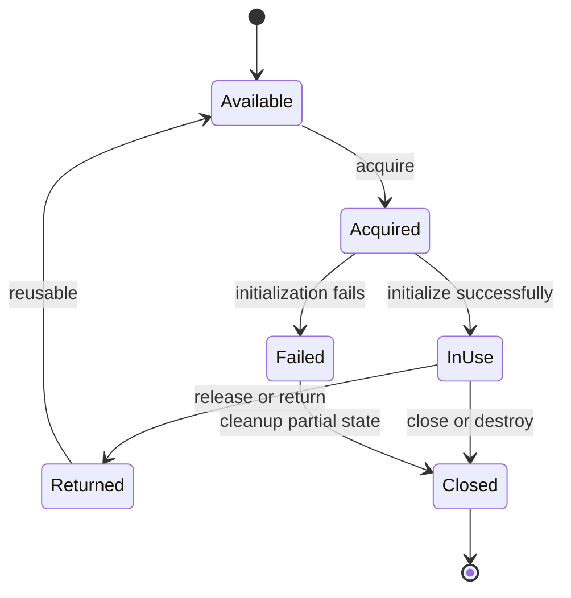
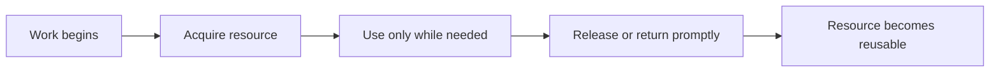
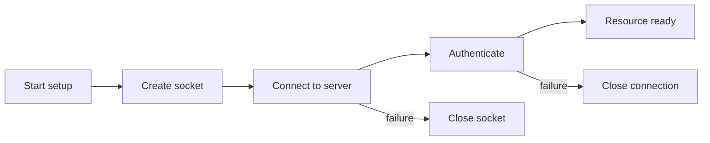
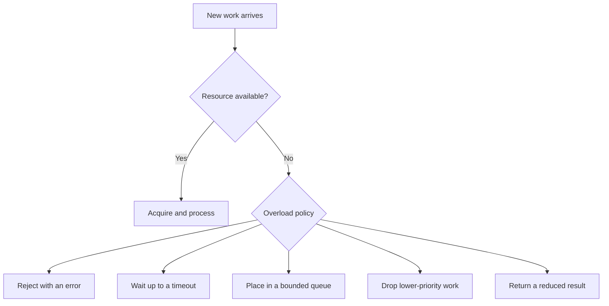
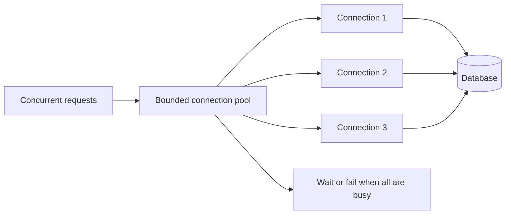
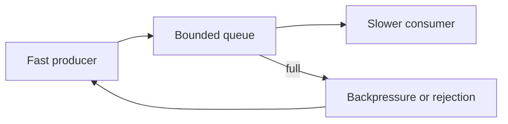

> Stage 1 - Systems Programming Foundations  
> Subject area 1.1 - What Systems Programming Means  
> Article 3

## The short version

Resource ownership answers a simple but important question:

> Who is responsible for creating, using, limiting, and releasing this resource?

Resource limits answer the related question:

> How much of this resource may be used, and what happens when the limit is reached?

These questions apply to memory, files, file descriptors, sockets, database connections, threads, CPU time, storage, queues, and many other resources. If ownership is unclear, cleanup is usually unreliable. If limits are missing, one workload can consume everything and make the whole system fail.

Good systems make ownership visible, give resources a clear lifetime, enforce useful bounds, and choose an explicit behavior for exhaustion.

## Where this article fits

The previous article introduced CPU, memory, storage, and network as limited resources. This article explains how software controls those resources in practice.

The next articles will study the operating-system mechanisms behind these ideas. Processes will explain ownership of execution and address spaces. File descriptors will explain resource handles. Virtual memory will explain memory limits and mappings. Concurrency and networking will explain pools, queues, locks, and connection limits.

This article is about the general engineering model that connects those later topics.

## What ownership means

Ownership is responsibility, not necessarily exclusive access.

If a service creates a database connection, ownership means the service is responsible for deciding when the connection is created, how it is used, how it is returned or closed, and what happens if the connection becomes invalid. Several requests may share a connection pool, but the service still owns the pool as a resource.

If a function allocates memory and returns an object, ownership means that some part of the program is responsible for keeping the object valid and eventually making the memory available for reuse. The object may be shared, but the program still needs a clear rule for its lifetime.

Ownership can exist at several levels:

```text
Machine or cluster
  └── Service
        └── Process
              └── Thread or request
                    └── Function or data structure
```

At each level, an owner may create smaller resources and pass them to another component. The handoff must be clear. Otherwise, two components may both release the resource, or neither may release it.

## Ownership is not the same as access

A component may be allowed to use a resource without being responsible for its entire lifetime. For example, a request handler may borrow a database connection from a pool. The handler can use the connection while it performs its database work, but it should not permanently close the connection when the request finishes. The pool owns the connection, so the handler must return it and let the pool decide whether to reuse it or close it.

Likewise, several threads may read shared memory. The thread that reads the memory does not necessarily own the memory. Another component may control when it is safe to free or replace it.

This distinction becomes important when resources are shared. A resource can be:

- Owned by one component and used by many components
- Owned by a parent and temporarily borrowed by a child
- Owned by a pool and leased to individual operations
- Owned by the operating system and represented by a handle in a process
- Owned by a service while clients are allowed to access it through an API

The more sharing exists, the more important the lifetime and release rules become.

## A resource has a lifecycle

Most resources follow a lifecycle like this:



The exact states differ by resource, but the lifecycle questions are similar:

1. How is the resource acquired?
2. What must be initialized before use?
3. Who may use it?
4. Is it reusable or single-use?
5. How is it released?
6. What happens if initialization fails halfway through?
7. What happens if the owner crashes?
8. How do we know that the resource is no longer usable?

Ignoring one of these questions often creates a leak, double release, use-after-close, or stale resource.

## Ownership transfer and borrowing

When one component gives a resource to another, there are two common models.

### Transfer of ownership

The original owner gives responsibility to the new owner. After the transfer, the original component must stop using the resource unless ownership is transferred back.

This model makes lifetime reasoning simpler because one component is responsible at a time. It is common for a process to create a resource and pass it to a worker that becomes responsible for closing it.

### Borrowing

The original owner keeps responsibility while another component uses the resource temporarily. The borrower must follow rules such as not closing the resource, not using it after the borrow ends, and not modifying it in unsafe ways.

Borrowing is useful for pools and shared data, but it requires clear boundaries. A function that returns a reference to internal state may accidentally allow the caller to keep using that state after the owner changes or destroys it.

Languages and libraries use different names for these models. The names are less important than the rule: everyone involved must know who may use the resource and who is responsible for its lifetime.

## Resource lifetime must match the work

A resource should live at the smallest useful scope.

If a file is needed for one operation, keeping it open for the entire process wastes a file descriptor and may keep storage state alive unnecessarily. If a database connection is needed for one request, holding it while waiting for unrelated work reduces the pool's capacity.

On the other hand, creating and destroying an expensive resource for every small operation may be inefficient. A connection pool or reusable buffer can reduce setup cost, but it introduces shared ownership and a limit that must be managed.

The right lifetime depends on the cost of creation, the cost of keeping the resource, the safety of sharing it, and the expected concurrency.



The phrase “release promptly” does not mean “release as quickly as possible” in every case. It means that the lifetime should match the actual need instead of accidentally extending because cleanup was forgotten or delayed by unrelated work.

## Cleanup is part of correctness

Cleanup is not merely an optimization. If a file descriptor is never closed, future operations may fail when the process reaches its descriptor limit. If a lock is never released, other threads may wait forever. If a connection is never returned to a pool, later requests may be unable to make progress.

A resource leak is a correctness problem because the system eventually behaves incorrectly.

In languages with explicit cleanup, code often uses a pattern that makes release close to acquisition. In Go, a file can be closed with `defer` after a successful open:

```go
file, err := os.Open("config.json")
if err != nil {
	return fmt.Errorf("open config.json: %w", err)
}
defer file.Close()

// Read and process the file here.
```

The important idea is not the specific keyword. The important idea is that the cleanup rule is established immediately after ownership is acquired. If later code returns early because of an error, the cleanup still runs.

This pattern also has limits. If `Close` can fail in a way that matters, the program must handle that error. If a resource is borrowed rather than owned, the borrower should not close it. If cleanup must happen before a transaction is committed, simply scheduling cleanup at function return may not be enough.

## Partial acquisition and failure during setup

Acquisition is not always one indivisible operation. A resource may require several steps:



If authentication fails after a socket and connection have been created, those earlier resources still need to be released. A common bug is to clean up only when the final setup step succeeds or to forget the resources created before an error.

Every acquisition step should have a matching cleanup path. This is especially important for files, sockets, temporary directories, memory mappings, locks, and transactions.

## What happens when the owner crashes?

The operating system can reclaim some resources when a process exits. It closes the process's file descriptors, releases its address space, and removes many kernel objects associated with the process.

That does not mean process crashes are harmless. A crash may leave persistent data half-written, a distributed lock held in another system, a transaction uncertain, or a message already sent but not acknowledged. Resources owned outside the process may outlive it.

The recovery behavior depends on the resource:

- Process memory is normally reclaimed by the operating system.
- A file descriptor is normally closed, but buffered or persistent data may still need recovery.
- A database transaction may be rolled back or may require recovery.
- A remote connection may remain visible to the peer until a timeout or disconnect is detected.
- A message may have reached a consumer even if the producer crashed before recording success.
- A lock in an external system may require a lease or expiration mechanism.

This is why “the operating system cleans it up” is only a partial answer. It applies to some local resources, not to every effect the process created.

## Limits protect the system

A limit is a boundary on resource usage. Limits exist because resources are finite and because uncontrolled consumption by one component can harm other components.

Limits can be applied at different levels:

```text
Machine limit       → total CPU, memory, storage, and network capacity
Process limit       → address space, descriptors, threads, CPU time
Service limit       → connections, requests, memory, queue size
Request limit       → body size, time, items, retries, or concurrency
Tenant limit        → quota for one customer or account
```

A useful limit is not chosen only from a convenient number. It should be connected to the resource's safe capacity and the behavior the system can handle.

For example, a maximum request body size protects memory and storage. A connection-pool limit protects the database and the application. A per-tenant rate limit protects fairness. A queue length limit protects memory and latency.

## Hard limits and soft limits

A hard limit is enforced so that usage cannot pass it, or cannot pass it without a clear failure. A process may be unable to open another file after reaching its file-descriptor limit.

A soft limit is a target, warning threshold, or preferred maximum. The system may continue beyond it, but the operator or component should take action before reaching a hard failure.

Soft limits are useful for early warning. A service may alert when memory usage reaches 70 percent of its limit, leaving time to investigate before the operating system kills it. A queue may begin shedding low-priority work before it becomes completely full.

The exact meaning of “soft” depends on the system. Some operating systems expose configurable soft and hard resource limits. In application design, the terms are often used more generally to describe a warning threshold versus an enforced boundary.

## What should happen at the limit?

When a resource is exhausted, the system needs an overload policy. An overload policy is the deliberate behavior used when the system cannot accept more work immediately.



### Reject quickly

Rejecting work protects the system from accepting more than it can handle. The caller receives an error and may retry, show a message, or choose another path.

Fast rejection is often safer than accepting work that will wait so long that it times out. The error should be clear enough for the caller and observable enough for the operator.

### Wait with a bound

Waiting can be reasonable when capacity is expected to become available soon. The wait must have a timeout, otherwise blocked work can accumulate without limit.

For example, a request may wait briefly for a connection from a pool. If no connection becomes available within the request's deadline, it should fail instead of waiting forever.

### Queue for later

A queue separates the arrival of work from its processing. This is useful when work can be delayed and processed asynchronously. The queue must still be bounded or have a well-defined storage limit.

An unbounded queue turns overload into growing memory usage and increasing latency. It does not eliminate the limit; it hides the limit until the system fails in a less controlled way.

### Shed or degrade

Load shedding means refusing less important work to preserve more important work. Graceful degradation means returning a reduced result when the full result is too expensive or unavailable.

For example, a shopping page might serve cached product information while temporarily omitting personalized recommendations. This keeps the core operation available while reducing pressure on a failing dependency.

The correct policy depends on the business and technical requirements. A payment operation should not be dropped in the same way as a recommendation refresh.

## Connection pools: making a limit explicit

A connection pool keeps a bounded number of established connections available for reuse. Each request borrows one connection, performs its database work, and returns it. The application avoids repeated connection setup, and the pool prevents the database from receiving an unbounded number of concurrent sessions.

The pool creates several responsibilities:

- The pool owns creation and destruction of connections.
- A request owns a borrowed connection only for the duration of its work.
- The request must return the connection even when its operation fails.
- The pool must detect connections that are closed or unhealthy.
- The system must decide what happens when every connection is busy.



Increasing the pool size is not always an improvement. It may reduce application-side waiting while increasing database contention, memory usage, lock contention, and network load. The pool limit is part of the design of the whole system, not only an application configuration value.

## File descriptors: a concrete operating-system limit

A file descriptor is a small integer handle that a process uses to refer to an open file, socket, pipe, or another kernel-managed object. The descriptor is not the file itself. It is a process-local reference to an open resource maintained by the operating system.

This makes file descriptors a useful example of ownership:

1. A process requests a resource from the kernel.
2. The kernel returns a descriptor.
3. The process uses the descriptor in later operations.
4. The process closes the descriptor when finished.
5. The kernel releases the associated state.

If the process forgets step 4, descriptors accumulate. Eventually a new open or socket operation fails even though the machine may still have memory and storage available.

The failure can appear far away from the leak. A service may report that it cannot accept new network connections, while the real cause is that an unrelated part of the process opened files and never closed them.

This is why resource ownership and observability must work together. An owner needs a way to count, inspect, and attribute resources.

## Queue limits and backpressure

Backpressure is a way for a slower consumer to signal that a faster producer must reduce or stop sending work. It prevents the producer from overwhelming the consumer and causing unbounded buffering.

For example, if a worker can process 100 jobs per second but a producer creates 1,000 jobs per second, the difference must go somewhere. The system can queue jobs, reject them, slow the producer, or lose them. If it accepts all jobs into an unbounded in-memory queue, memory usage grows while job latency becomes worse.



Backpressure is not the same as simply increasing the queue size. A larger queue can absorb a short burst, but it cannot fix a permanent difference between production and consumption rates. It only delays the point at which the limit is reached.

Backpressure appears in network send buffers, message brokers, stream processors, worker pools, database connection pools, and HTTP services.

## Limits and fairness

A global limit protects the whole system, but it may not protect individual users from each other. One tenant may consume most of the available connections or queue space and prevent other tenants from making progress.

Fairness means deciding how limited capacity is shared. Common strategies include per-tenant quotas, weighted priorities, concurrency limits, rate limits, and separate pools.

The choice depends on the system. A batch-processing customer may be allowed more throughput than a small customer but still have a maximum share. A health-check request may receive higher priority than a background report because it is needed to keep the service operating.

Fairness has a cost. Tracking usage and enforcing separate limits consumes memory, CPU, and operational complexity. It should be added when the risk of unfair consumption justifies that cost.

## Limits must be coordinated across layers

A limit in one component can conflict with a limit in another.

Suppose a service runs 20 worker threads but its database pool contains only 5 connections. At most 5 workers can perform database work at once; the other 15 may wait. That may be correct if the database can handle only 5 concurrent operations, or it may indicate that the service is holding workers while waiting for connections.

Now suppose the database allows 100 connections but the service runs in 50 process replicas, each with a pool of 10. The theoretical maximum is 500 connections, which exceeds the database limit. Each replica may look safe in isolation while the deployment is unsafe as a whole.

```text
Per-process pool limit
    × number of process replicas
    = possible database connections
```

Limits must be reasoned about at the scope where they apply. A local limit does not automatically protect a shared global resource.

## Observing ownership and exhaustion

A limit is useful only if the team can tell when it is being approached or reached. Useful signals include:

- Current usage
- Configured limit
- Remaining capacity
- Acquisition wait time
- Rejection count
- Timeout count
- Cleanup failures
- Resource age
- Queue length
- Resource creation rate
- Resource release rate

For a connection pool, measuring only the number of open connections is not enough. The team should also measure how long requests wait for a connection, how often acquisition times out, how long connections are held, and whether connections are returned successfully.

For memory, total usage is not enough. Allocation rate, garbage-collection activity, page faults, cache pressure, and process restarts can explain why usage is changing.

Observability should help answer both questions:

> Is the resource near its limit?

and:

> Which owner or workload is consuming it?

## A realistic production example

Imagine a service that begins returning errors during a traffic increase. The first error says “too many open files.” The team raises the process file-descriptor limit and deploys the change. The error disappears for a few hours, then returns at a larger number.

The limit was real, but increasing it did not fix the cause. The service was opening a new response body for each request and not closing it on an error path. The descriptors accumulated slowly. Eventually, the process could not accept new sockets or open required files.

The correct fix has several parts:

1. Close the resource on every ownership path.
2. Add a test for the failure path.
3. Measure open descriptors and alert before exhaustion.
4. Keep the limit high enough for legitimate load but low enough to contain damage.
5. Investigate why the leak was not visible earlier.

The limit is still valuable. It prevents unlimited growth and creates a detectable failure. But a limit should be a safety boundary, not a substitute for correct ownership.

## How to reason about a new resource

When you encounter a resource in an unfamiliar system, ask these questions:

1. What exactly is the resource?
2. What creates it?
3. Who owns it after creation?
4. Can it be borrowed or shared?
5. What state makes it usable?
6. How long should it live?
7. How is it released or returned?
8. What happens if setup fails halfway through?
9. What happens if the owner crashes?
10. What is the per-process, per-service, and global limit?
11. What happens when the limit is reached?
12. How can we observe usage, waiting, leaks, and failures?

These questions work for a file descriptor, a memory buffer, a database connection, a worker thread, a lock, a queue slot, or an external lease.

## Interview definitions

### What is resource ownership?

> Resource ownership is the responsibility for creating, using, limiting, and releasing a resource during its lifetime.

### Is ownership the same as access?

> No. A component may borrow or use a resource without owning it. The owner remains responsible for its lifetime, cleanup, and health.

### What is a resource limit?

> A resource limit is a boundary on how much of a finite resource a process, service, tenant, or system may consume.

### Why are resource limits useful?

> Limits prevent one workload from consuming all available capacity and force the system to choose an explicit behavior when it reaches the boundary.

### What is a resource leak?

> A resource leak occurs when a program keeps a resource after it is no longer needed, preventing that resource from being reused or released.

### What is backpressure?

> Backpressure is a mechanism that makes a producer slow down or stop when a consumer or downstream resource cannot accept more work.

### What is a connection pool?

> A connection pool is a bounded collection of reusable connections that prevents each request from creating a new connection and limits how many connections are used at once.

## Interview follow-up questions

### How would you design ownership for a shared connection pool?

> The pool owns creation, health checking, and destruction of connections. A request temporarily borrows one, uses it for its database operation, and returns it in both success and failure paths. The pool needs a bound and a policy for requests that arrive when every connection is busy.

### What should happen when a resource limit is reached?

> It depends on the resource and the operation. The system may reject work, wait with a timeout, queue it within a bound, shed lower-priority work, or return a degraded result. The choice should be explicit and should protect more important work.

### Why is increasing a limit not always the right fix?

> A limit may expose a leak or an underlying overload problem. Increasing it can delay the failure or move the pressure to another shared resource. I would first identify who is consuming the resource and why, then decide whether the limit or the behavior should change.

### What is the difference between a bounded and unbounded queue?

> A bounded queue has a maximum size and must apply backpressure, rejection, or another policy when full. An unbounded queue accepts more work until some other resource, usually memory, is exhausted.

### What happens to resources when a process crashes?

> The operating system usually reclaims local process resources such as memory and file descriptors, but external effects may remain. Persistent writes, remote requests, distributed locks, and messages may require their own recovery or expiration mechanisms.

## Common misconceptions

### “If the garbage collector exists, resource ownership is solved.”

Garbage collection can reclaim unreachable memory, but it does not automatically manage every resource. Files, sockets, database connections, locks, transactions, and remote leases still need explicit lifetime rules.

### “A higher limit is always safer.”

A higher limit may allow more legitimate work, but it can also increase memory usage, downstream load, queueing, and the size of a failure. The correct limit balances capacity, isolation, and recovery.

### “Closing a resource is enough.”

Closing is necessary, but the program must also close the correct resource, close it on every path, handle close errors when they matter, and avoid using it after closure.

### “A queue protects the system from overload.”

A bounded queue can absorb a temporary burst and make overload behavior explicit. An unbounded queue only moves the failure into memory and latency.

### “A process-local limit protects the whole system.”

Multiple processes or replicas may each stay under their local limit while exceeding a shared database, disk, network, or cluster limit. Limits must be analyzed at the scope of the resource they protect.

## Summary

Resource ownership defines responsibility across a resource's lifetime. A clear owner creates or acquires the resource, controls its use, releases it when appropriate, and handles failures during setup and cleanup.

Resource limits protect systems from unbounded consumption. When a limit is reached, the system should have an explicit policy such as rejection, bounded waiting, queuing, load shedding, or graceful degradation.

The most important practical lesson is that limits and ownership solve different problems. Ownership prevents leaks and unclear lifetimes. Limits contain damage and control competition. A reliable system needs both, along with enough observability to show usage, waiting, leaks, and exhaustion before they become an outage.

## If you want to build this later

Extend the resource-observer project from the previous article into a bounded worker service.

The service should accept jobs, process them with a fixed number of workers, and place waiting jobs in a bounded queue. When the queue is full, it should reject new jobs with a clear error. Add counters for accepted jobs, rejected jobs, queue length, processing time, and worker usage.

Then introduce a controlled leak by preventing one code path from returning a resource or finishing a job. Observe how usage changes, how the limit is reached, and whether the service rejects work safely. Restore the cleanup path and add a test that prevents the leak from returning.
