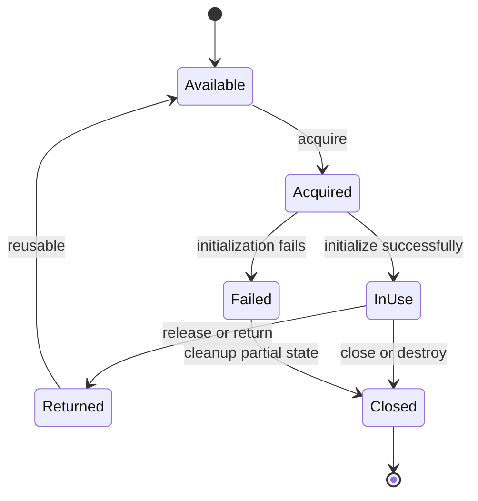
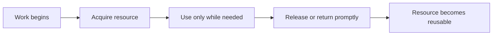
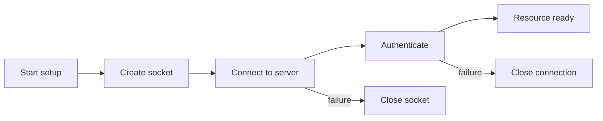
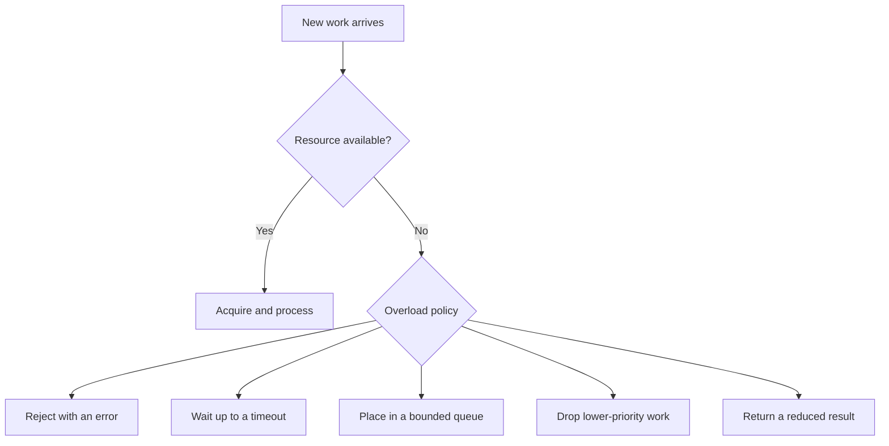
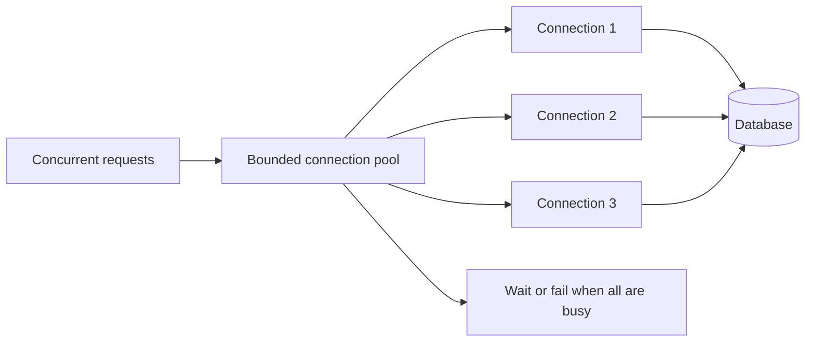
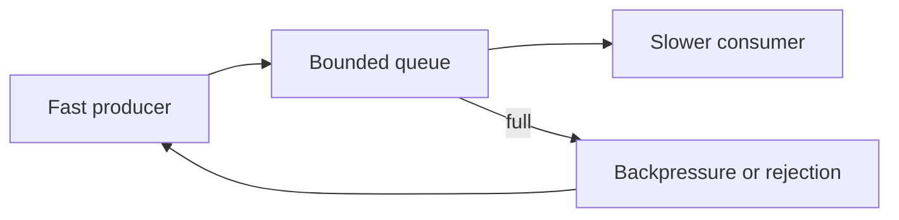

## What we mean by a resource

This is the third chapter in the Systems Programming Foundations arc. The first chapter argued that systems programming is different from application programming because it cannot pretend the machine away. A program running on real hardware lives inside limits it did not choose, and it shares those limits with other programs, with the operating system, and often with other machines across a network. The second chapter named the four fundamental families of resource that every system must account for: CPU time, memory, storage, and network bandwidth. This chapter is where those abstract "resources" turn into concrete rules. Once you accept that a resource is finite and shared, two questions stop being optional.

A resource, in the sense used here, is anything your program asks the system for that is finite and that the system must track on your behalf. Some resources are handed out by the operating system: a block of address space, an open file, a socket, a file descriptor, a thread. Some are created by libraries you link against: a connection pool, a work queue, a buffer arena, a lock. Some live entirely outside your process and are merely represented inside it: a row lock in a database, a lease in a coordination service, a message already placed on a broker. What they share is that they are not infinite, they are not free, and somebody has to decide when they are created, when they are used, and when they are gone.

Ownership is the word we use for accountability. It is tempting to read "ownership" as "who has a pointer to this object," but that reading causes more production incidents than almost any other confusion in systems work. Owning a resource means being the component that is responsible when the resource is created incorrectly, used incorrectly, exhausted, or left behind. In application programming you can often get away with ignoring this, because a framework underneath you has already taken on the accountability. In systems programming you usually are that framework, and there is no layer below you quietly cleaning up.

This distinction is why the topic earns a full chapter rather than a paragraph. A garbage collector can return unused memory to the heap, but it will not close the socket you forgot, release the lock you held, or tell the remote database that the connection you abandoned is now dead. The operating system will reclaim your process memory when the process dies, but it will not roll back the half-written file, undo the distributed lock, or un-send the message you already pushed onto a queue. Ownership and limits are the tools that make those gaps survivable, and the rest of this chapter works through them in detail.

## The two questions every resource raises

Resource ownership answers a simple but important question:

> Who is responsible for creating, using, limiting, and releasing this resource?

Resource limits answer the related question:

> How much of this resource may be used, and what happens when the limit is reached?

Those two questions come up for every kind of resource you will meet: memory, files, file descriptors, sockets, database connections, threads, CPU time, storage, queues, and more. When ownership is muddy, cleanup tends to be unreliable. When limits are missing, one piece of work can eat everything and take the whole system down with it. The nasty part is that neither problem usually shows up early. A system can drift along for months with unclear ownership or no limits, and then fail on the day traffic spikes, or a clock rolls over, or someone ships an unrelated change that finally tips it over.

Here is a concrete picture. A single HTTP request handled by a normal backend service touches a pile of resources. It uses CPU time on some thread. It allocates memory on the heap. It opens or borrows a socket file descriptor to read the request and write the response. It may borrow a database connection from a pool. It may push a job onto a work queue. Every one of those is a resource with an owner and a limit. The request handler does not own any of them for its whole life. It borrows most, uses them for a moment, and is expected to hand them back. The service as a whole owns the pool, the listener socket, and the worker threads. If even one of those handoffs is left undocumented, a later change will eventually close something it should not have, or leak something it should have closed.

Good systems do four things on purpose: they make ownership visible, they give every resource a clear lifetime, they set useful bounds, and they pick an explicit behavior for the moment a resource runs out. Writing those four down as a checklist makes them sound easy. They are not easy in practice, because code that nobody has examined tends to get at least one of them wrong by default.

What that looks like in the field:

- Unclear ownership breeds leaks and double-frees. Capacity bleeds away and nobody notices until it is gone.
- No clear lifetime produces use-after-close and stale handles. The system fails as corruption or a crash somewhere far from the original mistake.
- Missing limits let one path eat everything. A single bad request, one noisy tenant, or one retry storm can take down work that was otherwise healthy.
- No explicit exhaustion behavior means the system falls into whatever accidental behavior the code happens to produce, which is almost never what anyone would have picked on purpose.

The rest of this chapter walks through those four disciplines one at a time, with diagrams, code, and stories of how they go wrong.

## Ownership is responsibility, not just a reference

Ownership means being responsible, not necessarily being the only one who can touch the thing. It is worth sitting with that before we go further, because a lot of real-world confusion comes from treating "who has a reference to this" and "who is on the hook for this" as the same question. They usually are not.

If a service creates a database connection, owning that connection means the service is the one that decides when it is created, how it is used, how it gets returned or closed, and what to do if it goes bad. Many requests may share a connection pool, but the service still owns the pool itself. The individual requests come and go, borrowing what they need, while the pool stays as the one thing that is actually answerable for whether those connections exist.

If a function allocates memory and hands back an object, ownership means some part of the program is responsible for keeping that object valid and eventually giving the memory back. The object may be shared, but the program still needs a clear rule for its lifetime, even if a garbage collector enforces that rule instead of you doing it by hand. A garbage-collected language does not remove the need for an owner. It only changes who does the final reclamation, and when. The owner is still the one who must make sure the object is not used after its logical life is over, because the collector returns memory, not correctness.

Ownership can exist at several levels:

```text
Machine or cluster
  └── Service
        └── Process
              └── Thread or request
                    └── Function or data structure
```

Each of those levels lines up with a concrete set of resources. The machine or cluster owns the physical RAM, the CPU cores, the disk, and the network pipe. The service owns its configuration, its pools, and its long-lived sockets. The process owns its address space, its file-descriptor table, and its threads. The thread or request owns its stack, its registers, and the throwaway objects it builds while handling one unit of work. The function or data structure owns the local buffers and handles it makes for the length of a call. At every level, an owner can create smaller resources and pass them down to another component. That handoff has to be clear. If it is not, two components may both release the same resource, which gives you a double-free or double-close, or neither may release it, which gives you a leak that grows quietly until something else breaks because of it.

A double-free is not a classroom problem. In a language without a garbage collector, if two functions each believe they own the same heap buffer and both call `free` on it, the allocator's bookkeeping gets corrupted. That corruption might not show up at the moment of the second free. It might surface much later, during some unrelated allocation, as a crash nobody can trace back to the original mistake. That distance between the bug and the symptom is the signature of an ownership problem.

## Using a resource without owning it

A component can be allowed to use a resource without being responsible for its whole life. Take a request handler that borrows a database connection from a pool. The handler can use that connection while it does its database work, but it should not permanently close the connection when the request finishes. If it did, it would remove a connection the pool still thinks it owns, and the next borrower would get a connection that no longer exists. The pool owns the connection, so the handler has to return it and let the pool decide whether to reuse it or close it.

Same story with threads reading shared memory. The thread doing the reading does not necessarily own that memory. Something else may control when it is safe to free or replace it, and a thread that assumes otherwise can end up reading memory that was already reclaimed and handed to something else.

When resources are shared, a few shapes show up again and again:

- One component owns it and many use it.
- A parent owns it and lends it to a child for a while.
- A pool owns it and leases it to individual operations.
- The operating system owns it and gives a process a handle to it.
- A service owns it while clients reach it through an API.

All of those show up constantly. The "operating system owns it, process gets a handle" shape is the file descriptor, which we cover later. The "service owns it, clients use an API" shape is every managed object in something like a blob store or a queue: the client holds a reference, but the service owns the bytes and decides when they get deleted. The "pool owns it, leases to operations" shape is the connection pool we work through as an example below.

The more sharing there is, the more the lifetime and release rules matter, because every extra party that can touch a resource is another chance for someone to misunderstand whose job it is to clean it up. A classic incident is a shared cache where one module decides to clear and free the backing memory because it is done with it, while another module still holds pointers into that memory. The second module then reads freed memory. No single line looks wrong on its own. The bug is in the unspoken assumption about who owns the cache.

## The life cycle of a resource

Most resources move through a life cycle that looks roughly like this:



The exact states differ per resource, but the questions are the same, and you should actually run through them rather than glance at the diagram once:

1. How is the resource acquired?
2. What must be initialized before use?
3. Who may use it?
4. Is it reusable or single-use?
5. How is it released?
6. What happens if initialization fails halfway through?
7. What happens if the owner crashes?
8. How do we know that the resource is no longer usable?

Each of those questions has a failure mode attached, and they are worth making explicit:

1. **How is it acquired?** If acquiring can block or fail, the caller needs to know whether to retry, time out, or give up. A connection grabbed without a timeout can hang a thread forever.
2. **What must be initialized before use?** A socket that is open but not yet connected is not usable, and code that assumes otherwise throws confusing errors.
3. **Who may use it?** If the wrong component touches a resource, it can mutate state another component depends on, which gives you races.
4. **Is it reusable or single-use?** A single-use resource that goes back to a pool and gets handed out again can replay old state. A reusable one that gets destroyed while still borrowed gives you use-after-free.
5. **How is it released?** The release path is where most leaks live, because it is the path happy-path tests are least likely to exercise.
6. **What happens if initialization fails halfway through?** Anything created before the failing step still has to be cleaned up, or it leaks.
7. **What happens if the owner crashes?** If the owner was the only thing that knew how to clean up, the resource can survive orphaned, especially if it lives outside the process.
8. **How do we know it is no longer usable?** Without a clear signal, code keeps using a closed handle, and the failure looks like corruption instead of a lifecycle mistake.

Skip any one of those and you usually get a leak, a double release, a use-after-close, or a stale resource. All four tend to stay invisible in normal testing, precisely because tests rarely walk the unhappy paths where these questions actually bite. A test that opens a resource, uses it, and closes it in one function will never catch the bug where the resource leaks only on an error path, because the error path is exactly the one the test skipped.

## Transferring ownership versus lending

When one component hands a resource to another, there are two common models, and mixing them up without realizing it is one of the more frequent sources of ownership bugs.

### Handing over ownership

The original owner gives the responsibility to the new owner. After that, the original component must stop using the resource unless ownership comes back. It is a clean, one-way handoff, and once it happens the old owner has no further business with that resource at all.

This model makes lifetime reasoning simpler because only one component is responsible at a time. A common pattern is a process that creates a resource and passes it to a worker that becomes responsible for closing it. At that point the creator can move on and trust that the resource's fate is no longer its concern.

Languages name this differently, but the rule is the same. In Rust it is a move: the value leaves the old variable and enters the new one, and the compiler will not let the old variable use it again. In C++ it is the intent behind `std::unique_ptr`, where moving the pointer moves the duty to delete it. In C it is just a convention you enforce by discipline: a function that returns a freshly allocated buffer is implicitly saying "you own this now, and you must free it." The mechanism changes; the discipline does not.

### Lending a resource you still own

The original owner keeps the responsibility while another component uses the resource for a while. The borrower has rules to follow: do not close it, do not use it after the borrow ends, do not modify it in unsafe ways. The owner stays accountable, and the borrower's only real job is to not get in the way of that accountability.

Borrowing is handy for pools and shared data, but it needs clear boundaries. A function that returns a reference to its internal state can accidentally let the caller keep using that state after the owner changes or destroys it, at which point the caller holds something that looks valid but is not. That kind of bug can sit quiet for a long time before it finally shows up as a crash or corrupted data.

The danger with borrowing is that the rules are easy to state and easy to forget under deadline pressure. A developer writing a quick helper might close a borrowed connection "just to be safe," not realizing the pool still expects it back. Or a developer might cache a pointer into a buffer that the owner later recycles, and the cached pointer now reads whatever the buffer got reused for. Both are cases of a borrower stepping past the owner's authority.

The names differ across languages and libraries, but the names matter less than the rule: everyone involved has to know who may use the resource and who is responsible for its lifetime, and that agreement has to be explicit instead of assumed, because assumed ownership is exactly where these bugs come from.

## Choosing a lifetime that fits the work

A resource should live at the smallest scope that is actually useful. That sounds simple, and it is easy to break by accident, usually not out of laziness but because in the moment it is genuinely convenient to keep something open "just in case" you need it again soon.

If a file is needed for one operation, keeping it open for the whole process wastes a file descriptor and may keep storage state alive for no reason. A typical Linux process defaults to a limit of 1024 open file descriptors. Open one file per request and forget to close it on an error path, and the process can serve at most 1024 requests before every later open fails, even if the machine has plenty of memory and disk. If a database connection is needed for one request, holding it while you wait on unrelated work shrinks the pool's capacity for every other request trying to use that same pool at the same time.

On the other hand, building and tearing down an expensive resource for every tiny operation can be wasteful, and swinging too far the other way has its own costs. A connection pool or a reusable buffer cuts setup cost, but it introduces shared ownership and a limit you have to manage, trading one kind of complexity for another. Opening a fresh TCP connection to the database for every query might cost a few milliseconds of handshake per query, which is fine at low volume and disastrous at high volume, which is exactly why pools exist. But the pool only helps if its size is chosen on purpose and every borrower returns the connection promptly.

The right lifetime depends on the cost of creating it, the cost of keeping it, whether it is safe to share, and how much concurrency you expect, and there is rarely one correct answer outside those specifics. A temporary file used during a single upload should be scoped to that upload and deleted the moment the upload ends. A thread created to handle one request might be pooled instead, because thread creation and teardown are comparatively expensive and the work is frequent. A large in-memory cache may be deliberately long-lived precisely because rebuilding it is the expensive part, but then its eviction and size bounds become the ownership question that matters most.



"Release promptly" does not mean "release as fast as physically possible" in every case. It means the lifetime should match the actual need instead of stretching out because cleanup was forgotten or delayed by unrelated work. The goal is a lifetime you chose on purpose, not merely a short one. A resource held for exactly as long as it is useful, and no longer, is correct even if that span is measured in minutes. A resource held "just in case" with no defined release point is a leak waiting to be found.

## Cleanup failures are correctness bugs

Cleanup is not just an optimization. If a file descriptor is never closed, later operations can fail once the process hits its descriptor limit, sometimes hours or days after the leaking path first ran. If a lock is never released, other threads can wait forever, effectively freezing part of the system with no error message pointing at the real cause. If a connection is never returned to a pool, later requests may stall, and from the outside that slowdown can look like almost any other performance problem.

A resource leak is a correctness problem, because eventually the system behaves incorrectly, not merely inefficiently. "Eventually" is the operative word: a leak of one descriptor per hour stays invisible for a very long time before it becomes an outage. Picture a service that handles ten requests per second. A single descriptor leaks on an uncommon error path that fires once an hour means the process survives roughly 1024 hours, about 42 days, before it cannot open anything. For 41 of those days nobody notices a thing. Then, out of nowhere, every request starts failing with "too many open files," and the on-call engineer has no recent change to blame, because the bug shipped weeks earlier.

In languages with explicit cleanup, code often uses a pattern that puts the release right next to the acquisition, so the two cannot be separated by accident. In Go, a file can be closed with `defer` right after a successful open:

```go
file, err := os.Open("config.json")
if err != nil {
	return fmt.Errorf("open config.json: %w", err)
}
defer file.Close()

// Read and process the file here.
```

The point is not the keyword. The point is that the cleanup rule is set right next to the line that acquired the resource, so a reader never has to comb through the rest of the function to find out whether the file gets closed. If later code returns early on an error, the cleanup still runs, which is exactly the case a cleanup rule written far from the acquisition is most likely to miss.

This pattern has limits too, and it is worth being honest about where it stops being enough. If `Close` can fail in a way that matters, the program has to handle that error instead of throwing it away; a `defer file.Close()` that ignores the returned error can hide a failed flush of buffered writes. If a resource is borrowed rather than owned, the borrower should not close it no matter how convenient `defer` makes that, because closing a borrowed resource pulls it out of the owner's pool. If cleanup must happen before a transaction commits, merely scheduling it at function return may not be enough, because the order of cleanup relative to other side effects can matter as much as the cleanup itself. A `defer` that closes a file after the function returns will run after the transaction commit the function performed, which may be the wrong order if the file had to be durable before the transaction was acknowledged.

## When setup fails partway

Acquisition is not always a single indivisible step. A resource can need several steps, each of which can fail on its own:



If authentication fails after a socket and a connection were already created, those earlier resources still need to be released. A common bug is to clean up only when the final step succeeds, or to forget the resources created before the error, leaving exactly the kind of small, partial leak that is hardest to spot because it only happens on a failure path that rarely runs.

This pattern shows up across many resource types. A function that creates a temporary file and then fails to open it for writing still has to delete that temporary file. A routine that allocates a buffer, then maps it, then takes a lock, and fails at the lock step has to release the mapping and the buffer, not just the lock. A transaction that begins, writes a record, and then cannot commit has to roll back, not leave the record half-written. Every multi-step setup has a triangular cleanup duty: each step that succeeded before the failure has to be undone in reverse order.

Every acquisition step deserves a matching cleanup path. This matters most for files, sockets, temporary directories, memory mappings, locks, and transactions, all of which tend to be built up in stages where any single stage can be the one that fails. The discipline that prevents these leaks is easy to describe and hard to keep up: treat cleanup as part of the same control flow as acquisition, not an afterthought bolted onto the success path.

## What survives a process crash

The operating system reclaims some resources when a process exits. It closes the process's file descriptors, releases its address space, and removes many kernel objects tied to the process, all without the process doing anything.

That does not make process crashes harmless, and it is a mistake to treat the OS cleanup as a stand-in for thinking about failure. A crash can leave persistent data half-written, a distributed lock held in another system, a transaction uncertain, or a message already sent but not acknowledged. Resources owned outside the process can outlive it, sometimes indefinitely, unless something else is specifically built to notice and reclaim them.

The recovery behavior depends on the resource:

- Process memory is normally reclaimed by the operating system.
- A file descriptor is normally closed, but buffered or persistent data may still need recovery.
- A database transaction may be rolled back or may need recovery.
- A remote connection may stay visible to the peer until a timeout or disconnect is detected.
- A message may have reached a consumer even if the producer crashed before recording success.
- A lock in an external system may need a lease or an expiration mechanism.

Here is a concrete version of the message case. A service reads a job from a queue, starts processing it, and sends a side-effecting request to a downstream system. Before it can acknowledge the job back to the queue, the process crashes. The queue, seeing no acknowledgement, may redeliver the job after a timeout. The downstream system now gets the same request twice. If the operation is not idempotent, the duplicate does real damage. The local resources were reclaimed by the OS, but the external effect was not, and that gap is the actual bug.

That is why "the operating system cleans it up" is only a partial answer, and treating it as a complete one surprises people during incident review. It covers some local resources, not every effect the process created, and the gap between those two groups is exactly where distributed-systems failures like duplicate messages, stuck locks, and inconsistent state tend to come from.

## Why resources need limits

A limit is a boundary on how much of a resource can be used. Limits exist because resources are finite and because uncontrolled use by one component can hurt other components, sometimes components that had nothing to do with whatever caused the usage in the first place.

Limits can be applied at different levels:

```text
Machine limit       → total CPU, memory, storage, and network capacity
Process limit       → address space, descriptors, threads, CPU time
Service limit       → connections, requests, memory, queue size
Request limit       → body size, time, items, retries, or concurrency
Tenant limit        → quota for one customer or account
```

To make those levels less abstract, put plausible numbers on them. A machine might have 64 GB of RAM and 16 CPU cores. A process might be capped at 1024 file descriptors and 2 GB of address space. A service might allow 100 concurrent database connections and 200 in-flight requests. A single request might be limited to a 10 MB body and a 30 second timeout. A tenant might get 1000 requests per minute. None of those numbers come from physics. Each is a choice, and the choice should connect to the resource's safe capacity and to the behavior the system can actually handle at that capacity.

A useful limit is not picked from a convenient round number, and choosing one arbitrarily is a shortcut that tends to bite later. A 10 MB request body limit keeps one oversized upload from eating a disproportionate share of memory and storage. A pool limit of 100 connections keeps the database and the app from being asked to do more concurrent work than either can really process. A per-tenant rate limit of 1000 requests per minute protects fairness so one customer's spike does not degrade service for everyone. A queue length limit of 10,000 protects memory and latency by forcing a real decision once the queue would otherwise grow without end.

The phrase worth holding onto is "forcing a real decision." Without a limit, growth is silent until it is catastrophic. With a limit, the system is forced to choose what to do when the boundary is hit, and that choice is what the next section is about.

## Hard limits and soft limits

A hard limit is enforced so usage cannot pass it, or cannot pass it without a clear failure. A process may simply be unable to open another file once it hits its descriptor limit, and the operating system refuses the request outright, no negotiation.

A soft limit is a target, a warning threshold, or a preferred maximum. The system may go past it, but the operator or the component should act before a hard failure lands. A soft limit is less a wall than a tripwire.

Soft limits are good for early warning. A service might alert when memory hits 70 percent of its limit, leaving time to investigate before the operating system kills it outright with no graceful shutdown. A queue might start shedding low-priority work before it is completely full, buying room before the hard limit is ever reached.

The exact meaning of "soft" depends on the system. Some operating systems expose soft and hard resource limits as a literal, named pair of settings. On Linux, `RLIMIT_FSIZE` can have a soft limit that makes a process receive a signal when it tries to write past a certain file size, while the hard limit is the absolute ceiling only privileged processes may raise. In application design the terms are often used more loosely to mean a warning threshold versus an enforced boundary, and the mechanism varies from system to system even though the underlying idea holds. The practical lesson is to have both: a tripwire that wakes someone up early, and a wall that stops the damage if the tripwire was ignored.

## Choosing a policy for exhaustion

When a resource is exhausted, the system needs an overload policy. An overload policy is the deliberate behavior used when the system cannot take more work right now, and the word "deliberate" matters. A system with no explicit policy still has a behavior at the limit. It is just whatever falls out of the code by accident, which is rarely what anyone would have chosen on purpose.



### Rejecting work outright

Rejecting work keeps the system from accepting more than it can handle. The caller gets an error and can retry, show a message, or take another path, but crucially the system itself never gets more overloaded than it already was.

Fast rejection is often safer than accepting work that will wait so long it times out anyway, because at least a fast rejection frees whatever resources would otherwise have been tied up waiting. The error should be clear to the caller and visible to the operator, so both sides understand what just happened and why. Returning a generic 500 is worse than returning a 429 with a `Retry-After` header, because the caller at least knows to back off instead of hammering the service harder.

### Waiting with a timeout

Waiting makes sense when capacity is expected back soon, and most of the time that expectation is right. Most contention clears within milliseconds. The wait must have a timeout, though, or blocked work piles up without bound, quietly turning a brief spike into an endless stack of stuck requests.

For example, a request might wait briefly for a connection from a pool. If no connection shows up before the request's own deadline, it should fail instead of waiting forever, because a caller that already gave up on the outer request gains nothing from a connection that arrives after the fact. A deadline around 100 milliseconds is often enough to ride out normal pool contention while short enough that a stuck pool does not cascade into thousands of hung requests.

### Bounded queues

A queue separates the arrival of work from its processing. That helps when work can be delayed and handled asynchronously, decoupling how fast work arrives from how fast it gets done. The queue still has to be bounded or have a well-defined storage limit, or this separation becomes a liability instead of a benefit.

An unbounded queue turns overload into growing memory use and rising latency. It does not remove the limit. It hides the limit until the system fails in a less controlled way, usually by running out of memory at a moment nobody picked and in a manner nobody planned for. The queue just moves the exhaustion from "reject now" to "run out of RAM later," and the later failure is harder to diagnose because the backlog hides the cause.

### Load shedding and graceful degradation

Load shedding means refusing less important work to protect more important work. Graceful degradation means returning a reduced result when the full result is too expensive or unavailable. Both are, in effect, admitting up front that not everything can be served, and choosing in advance what gets served first.

For example, a shopping page might serve cached product information while temporarily dropping personalized recommendations. That keeps the core operation available while easing pressure on a failing dependency, sacrificing a nice-to-have to protect the thing users actually came for.

The right policy depends on the business and the technical facts. A payment operation should not be dropped the way a recommendation refresh is, and lumping the two under one blanket overload policy is a common design mistake. Dropping a payment request can lose revenue and corrupt a customer's cart; shedding a recommendation refresh only makes the page a little less tailored. The overload policy has to know the difference, which means the priority of work has to be encoded somewhere the policy can read.

## Connection pools in practice

A connection pool keeps a bounded set of established connections ready to reuse. Each request borrows one, does its database work, and returns it. The application avoids repeating connection setup, and the pool stops the database from receiving an unbounded number of concurrent sessions, which the database might not actually be able to handle all at once.

The pool creates several responsibilities:

- The pool owns creation and destruction of connections.
- A request owns a borrowed connection only for the duration of its work.
- The request must return the connection even when its operation fails.
- The pool must detect connections that are closed or unhealthy.
- The system must decide what happens when every connection is busy.



Making the pool bigger is not always an improvement, even though it is often the first thing anyone tries. It can cut waiting on the application side while increasing database contention, memory use, lock contention, and network load, effectively moving the queueing from a place you can see (the pool) to a place that is harder to see and often more expensive to be stuck in (the database itself). If the database can only usefully process five concurrent queries, a pool of fifty mostly produces fifty queries fighting for the same five units of useful work, plus the overhead of context switching and lock contention between them. The pool limit is part of the design of the whole system, not just an application setting you tune in isolation.

This is also where the pool's ownership model and its limit meet. The pool owns the connections, so a request that borrows one has to return it on every path, success or failure. The pool's limit is the boundary that decides what happens when all connections are busy, and that decision should be the deliberate overload policy from the previous section: wait briefly with a timeout, fail the request, or shed it, rather than letting threads block forever.

## File descriptors

A file descriptor is a small integer handle a process uses to refer to an open file, socket, pipe, or another kernel-managed object. The descriptor is not the file itself. It is a process-local reference to an open resource the operating system maintains, and the distinction matters: the number is nearly meaningless, but what it points to on the kernel side is not.

This makes file descriptors a useful example of ownership, worth walking through step by step:

1. A process requests a resource from the kernel.
2. The kernel returns a descriptor.
3. The process uses the descriptor in later operations.
4. The process closes the descriptor when finished.
5. The kernel releases the associated state.

On Linux the default per-process descriptor limit is typically 1024, configurable through `ulimit -n` or systemd unit settings. That number is the hard ceiling on how many of these kernel objects one process can hold at once, no matter how much memory or disk the machine has free.

If the process forgets step 4, descriptors pile up, slowly and silently, one at a time, with no single moment where anything visibly breaks. Eventually a new open or socket call fails even though the machine may still have memory and storage to spare, which is exactly the kind of failure that confuses whoever gets paged first, because every other resource on the dashboard still looks fine.

The failure can show up far from the leak. A service might report that it cannot accept new network connections, while the real cause is that some unrelated part of the process opened files and never closed them. Two features that seem unrelated share the same finite pool of descriptors, and one quietly starves the other. A log-rotation routine that opens a file to write a debug line and forgets to close it on the error path can, over days, eat enough descriptors that the request-handling path can no longer accept sockets, even though the logging code and the network code have nothing to do with each other except sharing the descriptor table.

That is why ownership and observability have to work together. An owner needs a way to count, inspect, and attribute resources, or a leak like this can run a long time before anyone even thinks to look for it. A process that exposes its current open-descriptor count, the rate descriptors are opened and closed, and the age of the oldest descriptor turns an invisible leak into a graph someone might actually watch.

## Backpressure

Backpressure is a way for a slower consumer to tell a faster producer to slow down or stop. It stops the producer from overwhelming the consumer and causing unbounded buffering, which would otherwise just relocate the overload problem into memory instead of solving it.

For example, if a worker processes 100 jobs per second but a producer creates 1,000 per second, the difference has to go somewhere. It does not simply vanish. The system can queue the jobs, reject them, slow the producer, or lose them. If it accepts them all into an unbounded in-memory queue, memory grows while latency gets worse, and the two problems feed each other the longer the mismatch lasts. After one minute, the queue holds 54,000 jobs that would take nine minutes to drain even if the producer stopped immediately. After ten minutes it holds 540,000 jobs and the process is likely already out of memory.



Backpressure is not the same as just making the queue bigger, and it is worth being precise about that. A larger queue can absorb a short burst, but it cannot fix a permanent gap between production and consumption rates. It only delays the point where the limit is hit, buying time instead of solving the underlying mismatch. If the producer outruns the consumer for good, the queue fills regardless of its size. A bounded queue at least makes the failure moment explicit and controllable, whereas an unbounded one hides the problem until memory is gone.

Backpressure shows up in network send buffers, message brokers, stream processors, worker pools, database connection pools, and HTTP services. It is not a niche idea confined to one corner of systems programming. It is a pattern that recurs wherever a producer and a consumer run at different speeds. A stream processor taking in 10 MB per second of input while producing 1 MB per second of output has to shed, buffer, or slow the input, or it will eventually fall behind without bound. The mechanism varies, but the question is always the same: when the slow side cannot keep up, what does the fast side do?

## Fairness across tenants

A global limit protects the whole system, but it may not protect individual users from each other. One tenant can consume most of the available connections or queue space and stop other tenants from making progress, even while the system as a whole sits comfortably under its overall limit.

Fairness means deciding how limited capacity gets shared. Common strategies include per-tenant quotas, weighted priorities, concurrency limits, rate limits, and separate pools, each trading simplicity against how precisely it protects individuals from one another. A per-tenant quota of 100 requests per minute means no single tenant can take more than its share of the global capacity, even if the global limit is 10,000 per minute. Weighted priorities let an important tenant reserve more than a small one. Separate pools isolate a noisy neighbor entirely, at the cost of running several pools.

The choice depends on the system. A batch-processing customer might be allowed more throughput than a small customer but still capped at a maximum share, so its workload can never fully crowd out everyone else. A health-check request might get higher priority than a background report because it is needed to keep the service running, and treating both identically would risk the service's own ability to stay up.

Fairness costs something. Tracking usage and enforcing separate limits eats memory, CPU, and operational complexity, and none of that is free just because fairness sounds like an obviously good thing. Add it when the risk of unfair consumption justifies the cost, not reflexively everywhere. A system with one internal client and one workload does not need per-tenant fairness. A multi-tenant service on the public internet almost certainly does. Adding fairness to a system with no competing consumers is pure overhead with no payoff.

## When local limits conflict

A limit in one component can conflict with a limit in another, and this is one of the subtler sources of production incidents, because each piece can look completely correct on its own.

Suppose a service runs 20 worker threads but its database pool has only 5 connections. At most 5 workers can do database work at once; the other 15 may wait. That may be fine if the database can only handle 5 concurrent operations, or it may mean the service is holding workers idle while they wait for connections, wasting thread capacity that could have been doing something useful. The thread limit and the connection limit interact, and the larger of the two does not help if the smaller is the real bottleneck.

Now suppose the database allows 100 connections but the service runs in 50 process replicas, each with a pool of 10. The theoretical maximum is 500 connections, which exceeds the database limit. Each replica may look safe in isolation while the deployment is unsafe as a whole, and no single engineer looking at one replica's config would necessarily catch it.

```text
Per-process pool limit
    × number of process replicas
    = possible database connections
```

Limits have to be reasoned about at the scope where they apply. A local limit does not automatically protect a shared global resource, and the arithmetic above is exactly the kind of multiplication you have to do explicitly, because it will never announce itself. The database sees 500 attempted connections, not 10, and its own limit of 100 is the one that actually bites. The fix is not to raise the database limit to 500, which would only let 50 replicas each hold 10 idle connections and starve the database of CPU for query work. The fix is to compute the global total and set each replica's pool so that replicas times pool size stays under the database's safe capacity, leaving room for other consumers of that same database.

## Observing resource usage

A limit is only useful if the team can tell when it is being approached or reached. Useful signals include:

- Current usage
- Configured limit
- Remaining capacity
- Acquisition wait time
- Rejection count
- Timeout count
- Cleanup failures
- Resource age
- Queue length
- Resource creation rate
- Resource release rate

For a connection pool, measuring only the number of open connections is not enough. The team should also measure how long requests wait for a connection, how often acquisition times out, how long connections are held, and whether connections are returned successfully, because any one of those can reveal a problem the raw open-connection count would miss entirely. An open-connection count of 5 out of a pool of 5 looks identical whether those connections are held for 5 milliseconds or 5 seconds. Only the wait-time and hold-time metrics separate a healthy pool from one that is saturated and barely keeping up.

For memory, total usage is not enough. Allocation rate, garbage-collection activity, page faults, cache pressure, and process restarts can explain why usage is changing, turning a flat number into an actual story about what the system is doing. A service sitting at 60 percent of its memory limit looks fine until you notice the allocation rate climbing and the GC pause time growing, which says the limit will be hit soon even though the current number is comfortable.

Observability should help answer both questions:

> Is the resource near its limit?

and:

> Which owner or workload is consuming it?

The second question is usually the harder one, and it is normally the one that matters most once an incident is underway, because knowing a resource is near its limit is far less useful than knowing who to go talk to about it. A dashboard that says "database connection pool 95 percent full" tells you something is wrong. A dashboard that says "tenant X holds 80 percent of the pool" tells you who is causing it and what to do about it.

## A leak that became an outage

Imagine a service that starts returning errors during a traffic increase. The first error says "too many open files." The team raises the process file-descriptor limit and ships the change. The error disappears for a few hours, then comes back at a larger number.

The limit was real, but raising it did not fix the cause. The service was opening a new response body for each request and not closing it on an error path. The descriptors accumulated slowly and invisibly, request after request, only on the specific paths where errors occurred. Eventually the process could not accept new sockets or open required files, and the same symptom returned, just later and at a higher number, because the underlying leak was never actually addressed.

The real fix has several parts:

1. Close the resource on every ownership path. That means finding the error branch that opened the response body and forgot to close it, not just the success branch.
2. Add a test for the failure path. A test that forces the error condition and asserts the descriptor count returns to baseline catches the regression instead of the production on-call.
3. Measure open descriptors and alert before exhaustion. An alert at 80 percent of the limit gives time to investigate while the service still works.
4. Keep the limit high enough for legitimate load but low enough to contain damage. Too low and normal traffic is rejected; too high and a leak runs for weeks before anyone notices.
5. Investigate why the leak was not visible earlier. The answer is usually that nobody was measuring descriptor count, which is an observability gap, not just a code bug.

The limit is still valuable. It prevents unlimited growth and creates a detectable failure, turning what could have been a silent, slow-motion collapse into a specific, loud, investigable error. But a limit should be a safety boundary, not a substitute for correct ownership, and treating it as the latter is exactly what let this incident recur. Raising the limit from 1024 to 4096 only delayed the same outage by a factor of four. It did not change the fact that the service was leaking one descriptor per failed request.

## A checklist for unfamiliar resources

When you meet a resource in a system you do not know well, ask these questions, in roughly this order:

1. What exactly is the resource?
2. What creates it?
3. Who owns it after creation?
4. Can it be borrowed or shared?
5. What state makes it usable?
6. How long should it live?
7. How is it released or returned?
8. What happens if setup fails halfway through?
9. What happens if the owner crashes?
10. What is the per-process, per-service, and global limit?
11. What happens when the limit is reached?
12. How can we observe usage, waiting, leaks, and failures?

These questions work for a file descriptor, a memory buffer, a database connection, a worker thread, a lock, a queue slot, or an external lease, and running through them on purpose, instead of trusting that "it'll probably be fine," is what separates a resource that gets managed correctly from one that eventually becomes an incident report. The order matters because the early questions constrain the later ones: you cannot pick a sensible limit (question 10) until you know who owns the resource and at what scope (questions 2 and 3), and you cannot design the exhaustion behavior (question 11) until you know whether the resource is even shared (question 4). The checklist is not a formality. It is the shortest reliable path through a problem that is easy to get partly right and hard to get wholly right.

## Definitions

### What is resource ownership?

> When we say a component owns a resource, we mean it is the one on the hook for that resource for as long as the resource lives: it decides when the resource is created, how it gets used, what bounds apply, and how it gets released.

### Is ownership the same as access?

> No. A component can borrow or use a resource without owning it. The owner is still the one responsible for its lifetime, its cleanup, and its health.

### What is a resource limit?

> A resource limit is a boundary on how much of a finite resource a process, service, tenant, or system is allowed to consume.

### Why are resource limits useful?

> Limits stop one workload from eating all the available capacity, and they force the system to pick an explicit behavior when it hits the boundary.

### What is a resource leak?

> A resource leak happens when a program keeps a resource after it is no longer needed, so the resource can never be reused or released.

### What is backpressure?

> Backpressure is a mechanism that makes a producer slow down or stop when a consumer or a downstream resource cannot take more work.

### What is a connection pool?

> A connection pool is a bounded set of reusable connections that stops each request from opening a new connection and caps how many connections are used at once.

## Beyond the definitions

### How would you design ownership for a shared connection pool?

> The pool owns creating, health-checking, and destroying the connections. A request borrows one temporarily, uses it for its database operation, and returns it on both success and failure. The pool needs a bound and a policy for requests that show up when every connection is busy.

### What should happen when a resource limit is reached?

> It depends on the resource and the operation. The system might reject the work, wait with a timeout, queue it within a bound, shed lower-priority work, or return a degraded result. The choice should be explicit and should protect the more important work.

### Why is increasing a limit not always the right fix?

> A limit can expose a leak or an underlying overload problem. Raising it can delay the failure or push the pressure onto another shared resource. I would first find out who is consuming the resource and why, then decide whether the limit or the behavior should change.

### What is the difference between a bounded and unbounded queue?

> A bounded queue has a maximum size and must apply backpressure, rejection, or another policy when full. An unbounded queue accepts more work until some other resource, usually memory, runs out.

### What happens to resources when a process crashes?

> The operating system usually reclaims local process resources like memory and file descriptors, but external effects can remain. Persistent writes, remote requests, distributed locks, and messages may need their own recovery or expiration mechanism.

## Common misconceptions

### "If the garbage collector exists, resource ownership is solved."

A garbage collector can reclaim memory that nothing references anymore, but it does not automatically manage every resource. Files, sockets, database connections, locks, transactions, and remote leases still need explicit lifetime rules.

### "A higher limit is always safer."

A higher limit can allow more legitimate work, but it can also raise memory use, downstream load, queueing, and the size of a failure. The right limit balances capacity, isolation, and recovery.

### "Closing a resource is enough."

Closing is necessary, but the program also has to close the correct resource, close it on every path, handle close errors when they matter, and avoid using it after closure.

### "A queue protects the system from overload."

A bounded queue can absorb a temporary burst and make overload behavior explicit. An unbounded queue only moves the failure into memory and latency.

### "A process-local limit protects the whole system."

Multiple processes or replicas can each stay under their local limit while exceeding a shared database, disk, network, or cluster limit. Limits have to be analyzed at the scope of the resource they protect.

## Summary

Resource ownership sets out who is responsible across a resource's lifetime. A clear owner creates or acquires the resource, controls how it is used, releases it when appropriate, and handles the failures that come up during setup and cleanup.

Resource limits protect systems from unbounded consumption. When a limit is hit, the system should have an explicit policy: reject the work, wait within a bound, queue it, shed load, or degrade gracefully.

The most important practical point is that limits and ownership solve different problems. Ownership prevents leaks and unclear lifetimes. Limits contain damage and control competition. A reliable system needs both, plus enough observability to show usage, waiting, leaks, and exhaustion before they turn into an outage.
