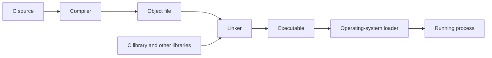

This is the seventh chapter, and the first about a new topic: systems programming languages. The earlier chapters covered resources, ownership, failure, performance, and how environments differ. Now we look at the language itself, because the language decides how clearly you can see and control those things.

C is the natural place to start. It sits close enough to the machine that you can watch source code become memory operations, machine instructions, and operating-system calls. At the same time, it is portable enough to build kernels, databases, runtimes, and compilers. Later chapters compare Rust, Zig, and Go with C, but it helps to understand C first.

C is powerful because it hides very little. It is also dangerous for the same reason. This chapter is about the control C gives you and the rules you must hold in your own head, because the compiler will not hold them for you.

## What makes C a systems language

C is a systems programming language because it gives the programmer a small set of tools that map closely to machine memory, instructions, addresses, and operating-system interfaces. It can build small and fast programs, run without a large runtime, and talk to hardware or other languages through stable binary interfaces.

That control comes with responsibility. C does not automatically track most object lifetimes, stop out-of-bounds memory access, prevent use-after-free bugs, or recover from every failed resource operation. The programmer must state those rules plainly and write code that stays inside the behavior set by the language and the platform.

C is powerful because it does not hide much. It is dangerous for the same reason.

## How C earned its place in systems

Early systems software was often written in assembly language. Assembly gives direct control over instructions and registers, but programs become hard to move between processors and hard to keep up as they grow.

C offered a middle ground. It let programmers work with addresses, arrays, structures, and explicit memory while still compiling to efficient machine code on many processors. Operating systems, compilers, databases, networking libraries, embedded systems, and command-line tools could be written in a language that was more expressive than assembly without needing a large managed runtime.

The key property is not that C is low level in every sense. C still gives you functions, types, expressions, control flow, and a standard library. Its key property is that the programmer can see and control many costs that higher-level environments manage for you.

## How a C program becomes a running process

A C program is translated into machine code before it runs. The compiler turns C source into object code, and the linker joins object code with libraries to produce an executable or library.



The C language sets many rules, but the compiler, operating system, processor, and libraries also shape the final program. A C program can use the standard C library for portable work, or it can call operating-system interfaces for platform-specific behavior.

For example, `fopen` is a C library function. On a Unix-like system, the library may eventually use the `open` system call. The C source does not need to contain the system call instruction itself, but the program still depends on the operating system's file and permission rules.

## Values and the memory they occupy

When a C program runs, its values live in memory or in processor registers. A variable is not only a name with a value; it has a type, a location, a size, and a lifetime.

```c
int count = 42;
```

This sets up an integer object named `count` and starts it with the value 42. The exact size and shape of `int` are implementation-defined, which means the compiler and platform choose them within the rules of the language. If a program needs an integer of an exact width, it can use types such as `uint32_t` from `<stdint.h>` when the platform provides them.

The location of an object matters when the program passes its address to another function, shares it between threads, writes it to a file, or uses it after another operation changes its lifetime.

## Pointers are values that name addresses

A pointer is a value that refers to an object or function. You can use it to reach an object without using its name directly.

```c
int count = 42;
int *pointer = &count;

*pointer = 43;
```

Here, `&count` produces the address of `count`. The type `int *` says that `pointer` is meant to refer to an `int`. The expression `*pointer` reaches the object at that address, so assigning 43 changes `count`.

Pointers make several systems techniques possible:

- Passing large objects without copying them
- Sharing memory between functions
- Reaching arrays and buffers
- Building linked data structures
- Calling operating-system interfaces that fill buffers you provide
- Mapping hardware or files into an address space
- Working with memory set aside at run time

Pointers do not by themselves prove that an address is valid. A pointer can be null, uninitialized, out of bounds, misaligned, or pointing to an object whose lifetime has ended.

## Arrays and pointer arithmetic

An array stores a fixed number of elements next to each other in memory.

```c
int values[3] = {10, 20, 30};
```

You can reach the elements by index. In many expressions, an array becomes a pointer to its first element. This is why functions that receive an array usually also need its length.

```c
void print_values(const int *values, size_t length) {
    for (size_t i = 0; i < length; i++) {
        printf("%d\n", values[i]);
    }
}
```

The pointer does not carry the length. The function gets two separate pieces of information: where the elements begin and how many elements it may access.

This is a small example of a larger C pattern. The language gives the programmer a pointer, but the programmer must keep the metadata and rules that make the pointer safe to use.

Pointer arithmetic is measured in elements of the same array. Moving one step forward adds the size of the pointed-to type to the address, not necessarily one byte. Reading or writing past the valid array range is undefined behavior.

## Structures and their layout

A structure groups several fields into one object.

```c
struct Point {
    int x;
    int y;
};
```

The fields are stored in a layout chosen by the implementation (the compiler and platform). The compiler may insert empty space, called padding, between fields or at the end of the structure to meet alignment rules.

Padding is harmless when a structure stays inside one program, but it becomes a problem when the raw bytes are written to disk or sent over a network. The layout may differ between architectures or compilers.

For an external format, set the representation yourself rather than assuming that `sizeof(struct Point)` and the field layout are portable.

## Lifetime and storage duration

An object's lifetime is the time during which the object exists and may be used under the language rules. C commonly uses three storage-duration patterns.

### Automatic storage

Local variables inside a function usually have automatic storage duration. They are created when execution enters the relevant scope and they stop existing when the scope ends.

```c
void process(void) {
    int value = 10;
    // value is valid here
}
// value no longer exists here
```

Returning a pointer to `value` would be wrong because the object stops existing when the function returns.

### Static storage

Global variables and variables declared with `static` can have static storage duration. They exist for the whole life of the program.

Static state can be useful, but it creates shared, mutable state and raises concerns about the order in which things are set up. A global buffer may also make testing and concurrency harder because many callers can depend on the same object.

### Allocated storage

Functions such as `malloc` obtain storage set aside at run time. The storage stays available until the program releases it with `free` or the process exits.

```c
int *value = malloc(sizeof *value);
if (value == NULL) {
    return ERROR_OUT_OF_MEMORY;
}

*value = 42;
free(value);
```

The pointer returned by `malloc` must be checked before use. The program must also make sure it calls `free` exactly once for the allocation and does not use the pointer afterward.

The language does not automatically tie the pointer to the right cleanup path. That is the programmer's responsibility.

## The stack and heap are models, not the whole story

People often say that local variables live on the stack and objects set aside at run time live on the heap. This is a useful starting model, but compilers can move variables into registers, remove them, or place them differently as long as the visible behavior follows the language rules.

The stack usually holds function-call state such as return information and local data. It has limited space and follows nested call lifetimes. The heap is a region managed by an allocator for objects whose lifetime is not tied directly to one function scope.

The key engineering difference is lifetime and ownership, not only physical location. A large local array may use up the stack. A heap object may leak because nobody releases it. A pointer to a stack object becomes invalid after its lifetime ends.

## Manual memory management

Manual memory management means the program itself decides when storage set aside at run time is acquired and released.

This can give useful control over allocation timing, layout, reuse, and failure behavior. It also creates several kinds of bugs.

### Memory leak

A memory leak happens when allocated memory is no longer needed but the program has lost the information needed to release it. The process may keep running while its memory usage grows.

### Use-after-free

A use-after-free happens when a program reaches an object after its storage has been released. The memory may now hold another object or unrelated data.

### Double-free

A double-free happens when the same allocation is released more than once. Allocators may catch it, but the behavior is invalid and can become a security weakness.

### Buffer overflow

A buffer overflow happens when a program writes outside the storage reserved for a buffer. It can corrupt nearby data, control state, or memory-management metadata.

These bugs are not just C syntax mistakes. They come from breaking lifetime and bounds rules that the language does not enforce on its own.

## Undefined behavior

Undefined behavior is a case where the C standard places no requirements on the result. Once a program runs undefined behavior, the compiler does not have to keep the behavior the programmer expected.

Examples include:

- Reaching an array outside its valid range
- Dereferencing a null or invalid pointer
- Using an object after its lifetime ends
- Signed integer overflow
- Reading an uninitialized value in an invalid way
- Changing an object more than once between sequence points under older C rules
- Breaking alignment requirements

Undefined behavior is especially dangerous in optimized builds. The compiler may assume that valid programs do not perform undefined operations, and it may use that assumption to remove checks or rearrange code.

Consider:

```c
int get_value(const int *pointer) {
    if (pointer == NULL) {
        return 0;
    }

    return *pointer;
}
```

This function is valid if the caller passes either a null pointer or a pointer to a live, readable `int`. The null check does not make every pointer safe. A pointer to freed memory is not null, but dereferencing it is still invalid.

The safe rule is to stop invalid states before they reach the operation. Do not rely on undefined behavior giving a convenient result on one compiler or machine.

## Integer sizes and arithmetic

Integer operations look simple, but their behavior depends on the type and whether the result fits.

Unsigned integer arithmetic wraps within the type's range. Signed integer overflow is undefined behavior in C. This difference matters when you compute buffer sizes, offsets, lengths, and allocation amounts.

```c
size_t total = count * element_size;
```

Even with `size_t`, the multiplication can wrap if the result is too large. An allocation that uses the wrapped value may reserve less memory than the program later writes.

A careful implementation checks arithmetic before allocating or indexing:

```c
if (count > SIZE_MAX / element_size) {
    return ERROR_SIZE_OVERFLOW;
}

size_t total = count * element_size;
```

The exact checks depend on the types and the operation. The general lesson is that input lengths and sizes form part of the security and correctness boundary.

## C does not remove the operating-system boundary

C gives direct access to memory and can call operating-system interfaces, but the program still runs under the operating system's rules.

Opening a file can fail because of permissions, a missing path, a resource limit, or a device error. Allocating memory can fail because the process or system has reached a limit. Reading from a socket can return fewer bytes than asked for or report that the connection closed.

```c
ssize_t result = read(fd, buffer, buffer_size);
if (result < 0) {
    // Inspect errno and handle the error.
} else if (result == 0) {
    // The peer or input reached end-of-file.
} else {
    // Only result bytes are valid data.
}
```

This example shows two important points. A system call can fail, and a successful read may return fewer bytes than the buffer can hold. The program must use the returned count rather than assuming that the whole buffer was filled.

The later system-call and I/O chapters explain these interfaces in more detail. For now, the key lesson is that C exposes the boundary clearly, but it does not make the boundary reliable by itself.

## How errors are handled in C

C functions often report errors through return values, output parameters, and a separate error indicator such as `errno`. The caller must know which values mean success, which mean failure, and whether the output is valid in each case.

An error path should release the resources it acquired before the failure. For a function with several setup steps, a common C pattern uses one cleanup section:

```c
int load_config(const char *path) {
    int result = -1;
    int fd = -1;
    char *buffer = NULL;

    fd = open(path, O_RDONLY);
    if (fd < 0) {
        goto cleanup;
    }

    buffer = malloc(4096);
    if (buffer == NULL) {
        goto cleanup;
    }

    // Read and validate the configuration.
    result = 0;

cleanup:
    free(buffer);
    if (fd >= 0) {
        close(fd);
    }
    return result;
}
```

Using `goto` for structured cleanup can be clearer than copying cleanup code across many error branches. The key property is not the keyword; it is that every acquired resource has one clear cleanup path.

In real code, the function would also need to tell read errors, invalid configuration, cleanup errors, and partial results apart. The example shows the ownership pattern, not a complete configuration parser.

## The standard and the platform are different layers

The C standard describes language and library behavior that can be built on many platforms. Operating-system interfaces such as file descriptors, `fork`, `epoll`, or memory mappings are platform-specific APIs outside the portable core of the language.

This creates two kinds of C code:

```text
Portable C
    Language and standard-library behavior shared across platforms

Platform C
    Operating-system calls, compiler extensions, hardware access, and ABI details
```

Portable C can still have undefined behavior if written incorrectly. Platform-specific C can be correct and fitting when the target environment is known. The key decision is to state the scope rather than accidentally assuming that a Unix-specific program is portable C.

## Ownership in C is a convention

C does not have a built-in ownership system that automatically checks which function may free or change an object. Teams usually set ownership through conventions, naming, documentation, function contracts, and code review.

A function may:

- Borrow a pointer for the duration of the call
- Take ownership and require the caller not to use the pointer again
- Return ownership to the caller
- Return a pointer to internal storage that must not be freed
- Write into a buffer the caller provides, up to a stated maximum length

These rules should be visible in the API. A function named `destroy_buffer` suggests that it takes ownership. A parameter called `const char *` tells you the function will not change the pointed-to characters, but it does not by itself explain who frees the memory.

Many serious C bugs are contract bugs. The code compiles because the types allow the call, but the caller and callee disagree about lifetime, ownership, size, or mutability.

## Concurrency in C

C can create threads and shared memory through platform libraries, but the language does not make shared access safe on its own. If two threads reach shared, mutable data without the required synchronization, the program may have a data race and undefined behavior.

The programmer must pick a synchronization rule:

- Protect the data with a mutex
- Use atomic operations
- Give each thread private state
- Communicate through messages
- Make the data immutable after setup

The right choice depends on the workload. A pointer being machine-sized, or a write looking like one instruction, does not by itself make an operation safe between threads.

Concurrency and memory ordering are covered later. The key point here is that C exposes shared memory without automatically assigning a safe access policy.

## Why C can be fast

C can produce efficient programs for several reasons:

- It has little mandatory runtime machinery.
- Data layout can be controlled closely.
- Memory allocation can be chosen explicitly.
- The compiler can optimize code with strong assumptions.
- Calls to operating-system interfaces can be direct.
- The language works well with existing binary interfaces.

These advantages are not guarantees. A C program can be slow because it allocates too often, misses caches, copies data when it need not, makes too many system calls, uses poor algorithms, or waits on locks and I/O.

The language makes efficient implementations possible. It does not produce them on its own.

## Why C can be dangerous

C gives the programmer enough access to create memory corruption, resource leaks, data races, integer errors, and portability bugs. The compiler may not be able to prove that every pointer is valid or that every buffer is large enough.

Modern C development lowers these risks with:

- Compiler warnings
- Static analysis
- AddressSanitizer and UndefinedBehaviorSanitizer
- ThreadSanitizer
- Fuzz testing
- Code review
- Safer wrappers
- Clear ownership conventions
- Careful API design
- Testing on multiple architectures

These tools do not make unsafe code safe on their own. They give evidence and catch many kinds of mistakes before or during execution.

## A realistic example

Imagine a network service that receives a length field from a client and then reads that many bytes into a buffer.

The first version turns the length into an integer, sets aside a buffer, and reads the data. It works with normal inputs. A hostile or corrupted length can be extremely large, negative after a signed conversion, or large enough to overflow the allocation calculation.

A robust implementation sets limits and checks every conversion:

```text
Read length field
     ↓
Validate encoding and maximum allowed size
     ↓
Check arithmetic before allocation
     ↓
Allocate or use a bounded buffer
     ↓
Read until the required bytes arrive or the deadline expires
     ↓
Reject malformed or incomplete input
```

The problem is not fixed by using a faster allocator. It is fixed by treating external data, integer arithmetic, memory ownership, I/O completion, and resource limits as one boundary.

This is a typical systems problem: several small details interact, and correctness depends on the full contract rather than one line of code.

## How engineers actually use C safely

Experienced C engineers do not trust memory alone, nor do they assume code is safe because it is short. They make contracts explicit and cut down the number of places where a dangerous operation can occur.

They ask:

- Who owns this pointer?
- How many elements are valid?
- What happens if allocation fails?
- Can the size calculation overflow?
- Is the object still alive here?
- Is the data initialized?
- Can another thread reach it at the same time?
- Which behavior is guaranteed by C, and which depends on the operating system?
- Is this representation portable?
- How will sanitizers, tests, and monitoring catch a mistake?

They also avoid treating cleverness as quality. Clear code with a visible lifetime and a simple cleanup path is often safer than a compact trick that saves a few instructions but makes ownership hard to review.

## Definitions

### Why C is a systems programming language

> C is a systems programming language because it gives direct control over memory, data layout, and resource handling, while still compiling efficiently to many machine architectures and operating-system interfaces.

### A pointer

> A pointer is a value that refers to an object or function, usually by holding an address. To use a pointer safely, the target must be valid, correctly aligned, still alive, and reachable for the operation you want.

### Undefined behavior

> Undefined behavior is an operation for which the C language sets no requirements on the result. The compiler may then make assumptions that lead to surprising or unsafe behavior.

### A memory leak

> A memory leak happens when a program no longer needs memory it set aside at run time but cannot release it, so usage keeps growing or stays higher than needed.

### Use-after-free

> Use-after-free happens when a program reaches memory it set aside at run time after it has been released.

### Stack versus heap

> The stack usually holds function-call state with lifetimes tied to scope, while the heap holds memory set aside at run time whose lifetime can outlast a single function call. The key difference is ownership and lifetime, not only physical location.

### Why buffer lengths must be explicit

> A pointer to an array does not normally carry the array's length, so the caller and callee need a separate length value or a sentinel rule to know which elements are valid.

## Beyond the definitions

### Why C allows unsafe access

> C was designed to give close control over memory and efficient compilation across many machines. That control means the language does not automatically check every pointer, bound, or lifetime, so the programmer and tools must enforce those rules.

### Why pointers to locals are dangerous

> A local variable normally stops existing when its function returns. The returned pointer would refer to an object whose lifetime has ended, so using it is undefined behavior.

### Why raw structs are not portable

> The compiler may insert padding, field sizes may differ, and byte order can vary between architectures. A portable format must set the representation out explicitly.

### How to reduce memory-safety bugs

> I use explicit ownership and length contracts, check allocation and arithmetic, keep cleanup paths clear, turn on compiler warnings and sanitizers, fuzz input boundaries, and test under the target architectures and concurrency conditions.

### Is C always faster than Rust or Go?

> No. C can provide low overhead and close control, but performance depends on the algorithm, memory access, allocation, concurrency, compiler, and workload. Rust and Go can also build high-performance systems while offering different safety or runtime tradeoffs.

### Language guarantees versus operating-system guarantees

> A C language guarantee applies to valid C behavior across conforming implementations. An operating-system guarantee comes from a platform API such as a system call or filesystem contract, and it may not exist on another platform.

## Common misconceptions

### "C is basically portable assembly."

C maps fairly closely to machine behavior, but it has its own rules for types, object lifetime, optimization, and undefined behavior. Code that works in assembly or on one processor is not automatically valid C.

### "A pointer is just an integer address."

A pointer represents a reference to an object or function under the language rules. Treating it as a plain integer can break representation, alignment, provenance, or lifetime rules.

### "If a program does not crash, its memory access is valid."

Invalid access may seem to work because the memory is currently mapped and holds the expected bytes. The behavior is still not guaranteed, and it may change after recompilation, optimization, or running on another machine.

### "`free` makes a pointer safe."

`free` releases the allocation; it does not update every copy of the pointer. Those copies must not be used afterward, and the ownership contract must stop another part of the code from freeing the same allocation.

### "C has no abstractions."

C has functions, types, arrays, structures, libraries, and interfaces. It simply shows more of the representation and resource behavior than many higher-level languages.

## Summary

C gives systems programmers direct control over memory, data layout, compilation, and operating-system interfaces. This makes it useful for kernels, runtimes, databases, compilers, storage engines, networking software, and embedded systems.

The same control creates responsibility. The programmer must track object lifetime, ownership, bounds, alignment, arithmetic, error paths, synchronization, and portability. Undefined behavior is not a harmless edge case. It gives the compiler freedom to assume that invalid operations never happen.

The best C code is not code that uses the most tricks. It is code with clear contracts, visible ownership, checked boundaries, predictable cleanup, and enough tooling to catch mistakes before they become production failures.
