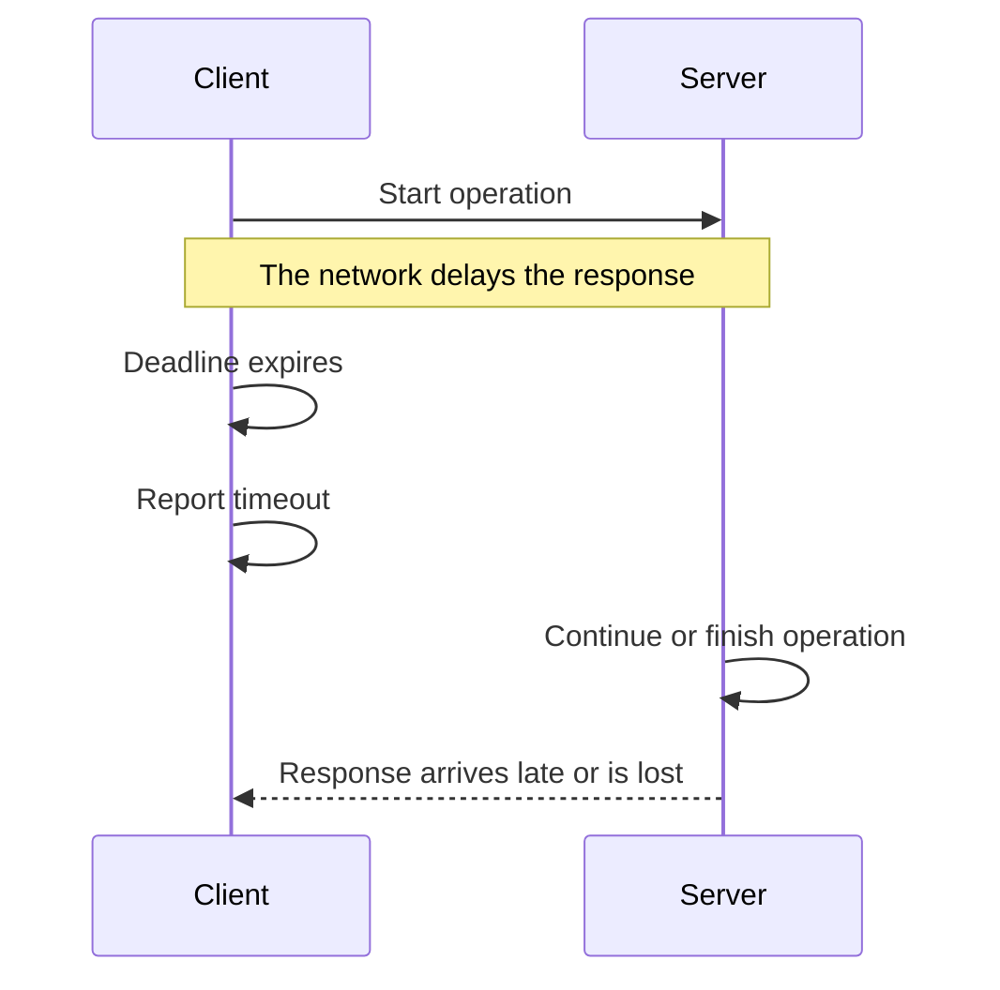
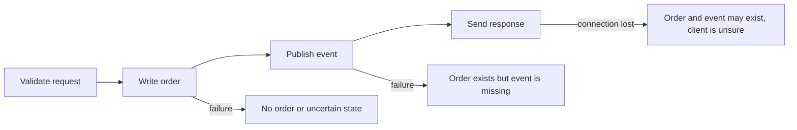
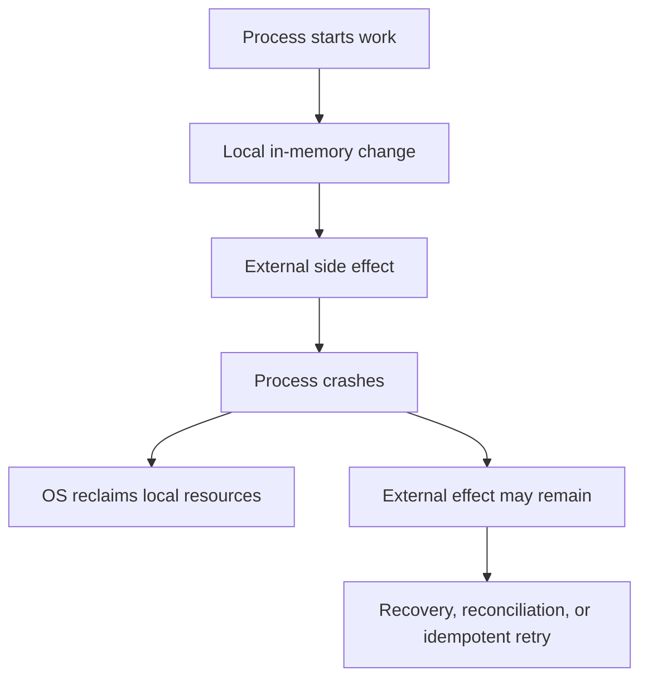
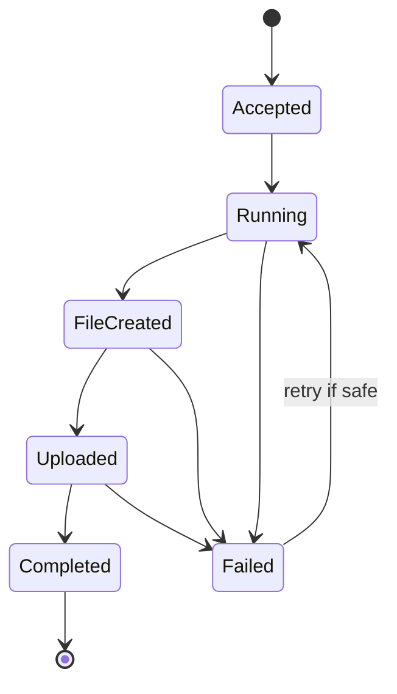

> Stage 1 — Systems Programming Foundations  
> Subject area 1.1 — What Systems Programming Means  
> Article 4

## The short version

Systems do not run in a world where every operation succeeds, finishes on time, and happens in a predictable order. Files disappear, memory runs short, connections close, processes crash, devices return errors, and concurrent operations change the order in which events are observed.

Systems engineering is partly the work of deciding what should happen in those situations. A reliable system does not eliminate every failure. It recognizes important failure modes, limits their impact, makes recovery possible, and gives engineers enough evidence to understand what happened.

Determinism is the ability to get the same result when the relevant inputs and state are the same. It makes testing and debugging easier. Control is the ability to decide how resources, timing, execution, and failure are handled instead of leaving every decision to a higher-level runtime or external component.

The important balance is this:

> Use enough control to meet the system's requirements, but do not take responsibility for details that do not matter to the problem.

## Where this article fits

The previous article explained ownership and limits. This article asks what happens when acquiring, using, or releasing a resource does not go as planned.

Later articles will apply these ideas to processes, memory, files, networking, concurrency, databases, and distributed systems. A system call can fail, a page can be unavailable, a socket can time out, a lock can be held by a crashed thread, and a database operation can complete even when its response is lost.

The same failure questions will return at every layer.

## Failure is a normal system state

In simple code examples, the main path is usually written as if every operation succeeds. A file opens, a network request returns, memory is allocated, and a database accepts the write. Real systems have more possible outcomes.

An operation can:

- Succeed completely
- Fail before doing any work
- Succeed partially
- Complete remotely but fail to report the result
- Take longer than the caller is willing to wait
- Be interrupted by a crash or cancellation
- Return a result that is valid but no longer useful

These outcomes are different, and the system may need a different response to each one.

For example, if opening a configuration file fails because the file does not exist, retrying immediately may not help. If a network connection is temporarily refused, a bounded retry may be reasonable. If a payment request times out after the remote system may have accepted it, retrying without an idempotency mechanism can create a duplicate charge.

The first step in failure handling is to understand what the failure means.

## Errors, timeouts, and cancellation are different

An error is an explicit result saying that an operation did not succeed in the way requested. The program may know the reason, such as permission denied, invalid input, or a missing file.

A timeout means the caller stopped waiting after a deadline. It does not always mean that the operation failed on the other side. The remote system may still be processing it, or it may have completed just before the response was lost.

Cancellation means that the caller no longer wants the operation to continue. Cancellation is a request, not a guarantee. A local function may stop quickly, but a remote server may not receive the cancellation or may already have committed the work.



The client knows that it did not receive a response in time. It does not automatically know whether the server performed the operation.

This distinction matters for retries. Retrying a read is often safer than retrying a state-changing operation. A state-changing operation needs a way to recognize that the retry belongs to work already attempted.

## Partial failure

Partial failure occurs when only part of an operation succeeds. It is common whenever an operation crosses a boundary or contains multiple steps.

Imagine a service that creates an order. It may validate the request, write the order to a database, publish an event, and return a response. A failure can happen after any of these steps.



The failure after publishing the event is not the same as the failure before writing the order. The system needs different recovery behavior for each case.

A transaction can make several local database changes appear as one atomic operation, meaning that all changes commit together or none of them become visible. A transaction does not automatically make a database write and a message sent to another service atomic. That boundary requires another design, such as an outbox pattern, a reconciliation process, or an explicit retry and deduplication strategy.

The important question is not simply “Did the operation fail?” It is:

> Which effects definitely happened, which definitely did not happen, and which are uncertain?

## Recovery should be designed before failure happens

Recovery is the process of returning a system to a useful and correct state after a failure. It may involve retrying work, rolling back local changes, replaying a log, rebuilding state, restoring a backup, or asking another component to reconcile what happened.

Good recovery design starts by identifying what must remain true. These conditions are often called invariants (rules that must remain true while the system operates).

For an order system, possible invariants include:

- An order has one stable identifier.
- An order cannot be charged twice for the same payment attempt.
- An order marked as paid has a record of the payment result.
- An order cannot be shipped before it is accepted for fulfillment.

The recovery process should restore or preserve these rules. Restarting a process is not enough if the process starts with inconsistent data.

## Idempotency makes repetition safer

An operation is idempotent when applying it more than once produces the same final effect as applying it once. The operation may still return different responses, but repeating it does not create an additional unwanted effect.

Setting a user's email address to a specific value is naturally close to idempotent. Sending a payment request or incrementing a counter is not. Repeating a payment or increment can apply the effect more than once.

A common way to make a request idempotent is to give it a unique idempotency key. The server stores the reasult associated with that key. If the same key arrives again, the server returns the recorded result instead of performing the operation again.

```text
Client creates request ID: payment-8f31
        ↓
Server receives payment-8f31
        ↓
Server records the request and performs the payment
        ↓
Response is lost
        ↓
Client retries payment-8f31
        ↓
Server finds the existing result and returns it
```

The key must be scoped correctly, stored reliably, and associated with the request's important parameters. If the same key can be reused for a different payment, the protection is unsafe. If the record is lost too soon, a late retry may be treated as new work.

Idempotency does not mean that every operation is safe to repeat without thought. It is a deliberate protocol between the caller and the component performing the operation.

## Retries can help and can hurt

A retry repeats an operation after a failure that may be temporary. Retries are useful for short network interruptions, temporary service unavailability, or transient resource pressure.

Retries can also make an outage worse. If a dependency is already overloaded, every caller that retries immediately sends more work to it. The dependency becomes slower, causing more timeouts and more retries. This feedback loop is called a retry storm.

The usual protections are:

- A limit on the number of attempts
- A deadline for the whole operation
- Exponential backoff, which increases the wait between attempts
- Jitter, which adds a small random variation so clients do not retry at exactly the same time
- Idempotency for operations that change state
- A circuit breaker or load-shedding policy when the dependency is clearly unhealthy

These controls do not make retries universally safe. A retry policy must consider whether the operation is repeatable, whether the failure is likely temporary, and whether the dependency can handle another attempt.

## Timeouts prevent permanent waiting

Every operation that waits for another component should have a reasonable deadline. Without a timeout, a blocked operation can keep a thread, memory, connection, or queue slot forever.

A timeout is a resource-protection mechanism as much as a user-experience setting. If a service receives 1,000 requests and each request waits indefinitely for a broken dependency, the service may exhaust all workers and become unable to answer even simple requests.

Timeouts should be placed at the right boundaries. A database query may have a query timeout. A network connection may have a connect timeout. A request may have an end-to-end deadline that includes all internal work.

The deadlines must be coordinated. If a caller gives a request 500 milliseconds but an internal dependency is allowed to wait for 2 seconds, the dependency can continue working after the caller has already given up. That work consumes resources without helping the original request.

## Cancellation must travel through the system

Cancellation tells work that it is no longer needed. For cancellation to protect resources, it must reach the operations doing the work.

Suppose a user closes a page while the server is generating a large report. If the server notices the disconnected client and cancels the database query, file reads, and computation, it can release resources earlier. If cancellation stops only the final response while the internal work continues, the server still spends CPU, memory, storage, and database capacity on a request nobody needs.

Cancellation is especially important in concurrent systems. A parent operation should know which child tasks it started and should decide whether those tasks continue, finish, or stop when the parent fails.

## Crashes and restart behavior

A process crash ends its current execution state, but it does not automatically undo every effect the process made.

The operating system usually reclaims local memory and closes file descriptors. It cannot automatically undo an email already sent, a message already delivered, a database transaction already committed, or a remote lock that has no expiration.



A restart strategy must therefore answer more than “How do we start the process again?” It must answer:

- How does the process know what work was completed?
- How are incomplete operations detected?
- Can work be safely retried?
- How are duplicate effects prevented?
- Which state is authoritative?
- How is inconsistent state repaired?

For local durable storage, a write-ahead log can record intended changes before applying them. After a crash, the system can replay or discard incomplete work according to the log. Distributed services need additional mechanisms because other machines may have observed effects that the crashed process no longer remembers.

## Determinism

Determinism means that the same relevant inputs and state produce the same behavior or result. Determinism makes a system easier to test and debug because a failing case can be repeated.

A program may be deterministic at one level and nondeterministic at another. A function that adds two numbers is usually deterministic. A concurrent program may call that function in an order that changes from run to run. A network service may receive the same messages in a different order. A program using the current time or random numbers has inputs that are not fixed unless they are controlled.

The useful question is not “Is this system completely deterministic?” Most real systems are not. The useful question is:

> Which sources of variation affect correctness, and how can we control or observe them?

### Sources of nondeterminism

Common sources include:

- Thread scheduling
- Network timing and message order
- Disk latency
- Clock readings
- Random-number generation
- External service responses
- Memory allocation addresses
- Unspecified language or hardware behavior

Not all variation is a bug. A network can deliver valid messages at different times. The system becomes unsafe when correctness depends on an order that the system does not guarantee.

## Race conditions

A race condition occurs when the result depends on the timing or order of operations that can run concurrently. A data race is a specific case where concurrent accesses to the same memory include at least one write and are not properly synchronized.

Consider two workers updating a shared counter:

```text
counter starts at 0

Worker A reads 0
Worker B reads 0
Worker A writes 1
Worker B writes 1

Expected result: 2
Actual result:   1
```

The operation “increment” looks simple, but it consists of a read, a calculation, and a write. Without synchronization, those steps can interleave.

The solution may be a lock, an atomic operation, a message-passing design, or a change that avoids shared mutable state. The correct choice depends on the workload and the required behavior. The deeper concurrency articles will examine these options in detail.

## Making systems easier to reproduce

Reproduction is the process of causing the same behavior again under controlled conditions. It is one of the most valuable tools in debugging because it turns an uncertain production symptom into something that can be inspected.

To improve reproduction, control or record:

- Input data
- Configuration
- Software version
- Dependency versions
- Time
- Random seeds
- Machine architecture
- Concurrency level
- Network conditions
- Storage state

You cannot always reproduce a production failure exactly. The goal is to reduce the number of unknowns until a useful explanation can be tested.

For a concurrency bug, repeating the same test may not reproduce the same schedule. A stress test may increase the chance of failure, while a scheduler or race detector may provide more useful evidence. For a time-related bug, injecting a fake clock may be better than waiting for a particular date.

## Reproducible builds

A reproducible build produces the same artifact from the same source and declared inputs. An artifact is a result of the build, such as a binary, container image, or package.

Reproducibility helps with debugging, rollback, security review, and trust. If a binary running in production cannot be recreated from its source and dependencies, it is harder to know what code is actually running or to reproduce its behavior.

Sources of build variation include:

- Unpinned dependencies
- Current timestamps
- Random build identifiers
- Machine-specific compiler behavior
- Environment variables
- Different toolchain versions
- Filesystem ordering

Not every project needs perfect bit-for-bit reproducibility immediately, but important inputs should be known and controlled.

## Control versus convenience

Higher-level tools and runtimes make development faster by managing details for you. A garbage collector manages much of memory reclamation. A connection pool manages reusable connections. A framework manages request routing. A scheduler manages task placement.

This convenience is valuable. It reduces code, common mistakes, and the amount of detail each engineer must handle. The cost is that the program inherits the tool's policies and behavior.

For example, a garbage-collected runtime may pause or consume CPU for collection. A connection pool may queue requests when every connection is busy. A framework may buffer a request body in memory. A scheduler may move work between CPUs and affect cache locality.

These details matter only when they affect the system's requirements. If they do not affect correctness, latency, capacity, or operations, relying on the abstraction is usually the better choice.

### Taking more control

An engineer may take more direct control by managing memory explicitly, choosing a custom allocator, implementing a bounded queue, controlling thread placement, using direct I/O, or writing a specialized protocol.

More control can provide:

- More predictable latency
- Lower overhead for a specific workload
- A better fit for unusual hardware or data layout
- Stronger control over resource limits

It also creates responsibilities:

- Correct cleanup
- Synchronization
- Error handling
- Portability
- Testing
- Security review
- Documentation
- Future maintenance

The decision should come from a measured requirement, not from the idea that lower-level code is automatically better.

## A realistic production example

Imagine a service that receives a request to generate a report. It queries a database, creates a file, uploads the file to object storage, and returns a download link.

Several failures are possible:

1. The database query times out before producing a result.
2. The query completes, but the process crashes while creating the file.
3. The file is created, but the upload fails.
4. The upload succeeds, but the response is lost.
5. The client retries and creates a second report.

A weak design treats every failure as “try again.” A stronger design gives the report a stable job identifier, records its state, uses deadlines, cleans up temporary files, makes upload retries safe, and lets a worker resume or reconcile incomplete jobs.



The state machine makes recovery decisions explicit. A failed job in `Running` may need to be retried. A job in `Uploaded` may only need its final metadata updated. A job in `Completed` should not be run again just because a client did not receive the original response.

The design is not only about code. It is about representing enough state to distinguish incomplete work from completed work.

## How experienced engineers investigate failures

When a failure is reported, experienced engineers usually resist the first attractive explanation. They try to establish what is known, what is unknown, and what evidence can separate the possible causes.

They may ask:

- What exactly failed?
- When did it begin?
- Did all requests fail or only some?
- Which version and configuration were running?
- What changed before the failure?
- Did the operation have a deadline?
- Could the work have completed remotely?
- What resources were acquired before the failure?
- Which effects are certain and which are uncertain?
- Can the operation be retried safely?
- What evidence would prove or disprove each explanation?

The goal is not to sound cautious. It is to avoid making a recovery action that creates a second failure, such as retrying a non-idempotent operation, increasing a limit until a downstream system collapses, or deleting state that is still needed for recovery.

## Interview definitions

### What is failure handling in systems?

> Failure handling is deciding how a system detects, contains, reports, recovers from, or safely gives up on operations that do not complete normally.

### What is partial failure?

> Partial failure occurs when part of an operation succeeds while another part fails or becomes uncertain, leaving the system responsible for deciding how to recover or reconcile the result.

### What is a timeout?

> A timeout is a deadline after which a caller stops waiting for an operation. It proves that the caller did not receive a result in time, but it does not always prove that the operation failed remotely.

### What is idempotency?

> An operation is idempotent when repeating it produces the same final effect as performing it once.

### What is determinism?

> Determinism means that the same relevant inputs and state produce the same result or behavior.

### What is a race condition?

> A race condition occurs when the result depends on the timing or order of operations that can happen concurrently.

### What is a retry storm?

> A retry storm occurs when many clients repeatedly retry a failing dependency and create even more load, making the original failure worse.

## Interview follow-up questions

### Why is a timeout not proof that an operation failed?

> The timeout only describes what the caller observed. The request may have reached the server and completed while the response was delayed or lost. This is why retries for state-changing operations often need idempotency.

### How do you make an operation safe to retry?

> I first determine whether repeating the operation can create a duplicate effect. If it can, I use an idempotency key or another deduplication mechanism, store the result for the appropriate lifetime, and define what happens when the request parameters do not match an existing key.

### What is the difference between rollback and compensation?

> Rollback restores a local transactional operation to its previous state. Compensation performs another operation to offset an effect that cannot be rolled back directly, such as issuing a refund for a payment that was already completed.

### When should you use more control instead of a higher-level abstraction?

> I would take more control when measurements show that the abstraction cannot meet an important requirement such as latency, memory usage, or failure behavior. I would also account for the extra responsibility, portability cost, testing burden, and maintenance risk.

### How do you debug a nondeterministic failure?

> I record as much state as possible, reduce the input and concurrency, control time and randomness, and use tracing or race-detection tools. I try to turn the timing-dependent failure into a smaller reproducible case instead of relying only on repeated execution.

## Common misconceptions

### “A timeout means the server did nothing.”

A timeout only means the caller did not receive a result before its deadline. The server may still be working or may have completed the operation.

### “Retrying always improves reliability.”

Retries can recover from temporary failures, but they can overload a failing dependency or duplicate a state-changing operation. They need limits, deadlines, and a safe operation model.

### “A process crash undoes its work.”

A crash usually removes local in-memory state, but it does not undo external effects such as committed database writes, sent messages, or completed remote requests.

### “Deterministic means every system must behave exactly the same every time.”

Real systems have legitimate variation from timing, scheduling, networks, and devices. The goal is to control the variation that affects correctness and make the remaining variation observable.

### “The lowest-level implementation is the most reliable.”

Lower-level code can provide more control, but it also creates more opportunities for memory bugs, cleanup failures, portability problems, and incorrect assumptions. Reliability comes from fitting the design to the requirements and managing its risks.

## Summary

Failure is not an unusual exception to systems behavior. It is one of the conditions that the system must be designed to handle. Errors, timeouts, cancellation, crashes, and partial completion have different meanings and should not all be treated as the same event.

Determinism makes behavior easier to test and debug, but systems naturally contain variation from concurrency, networks, clocks, devices, and external services. Good designs control the variation that affects correctness and record enough information to investigate the rest.

Higher-level abstractions reduce the amount of detail engineers must manage. Taking more direct control can improve predictability or performance, but it also creates responsibility for cleanup, synchronization, portability, security, and maintenance. The right choice is the simplest abstraction that satisfies the real requirements.

## If you want to build this later

Build a small report-generation worker that can survive failure and safe retries.

The worker should accept a job ID, create a report file, and store the job state as it moves through stages such as `accepted`, `running`, `uploaded`, and `completed`. Add deadlines, temporary-file cleanup, controlled retries, and idempotent handling when the same job ID is submitted twice.

Then simulate failures at each stage: stop the worker during file creation, make the upload fail, drop the final response, and submit the same job twice. The goal is to make the worker distinguish “definitely not completed,” “completed but response lost,” and “state is uncertain.”
