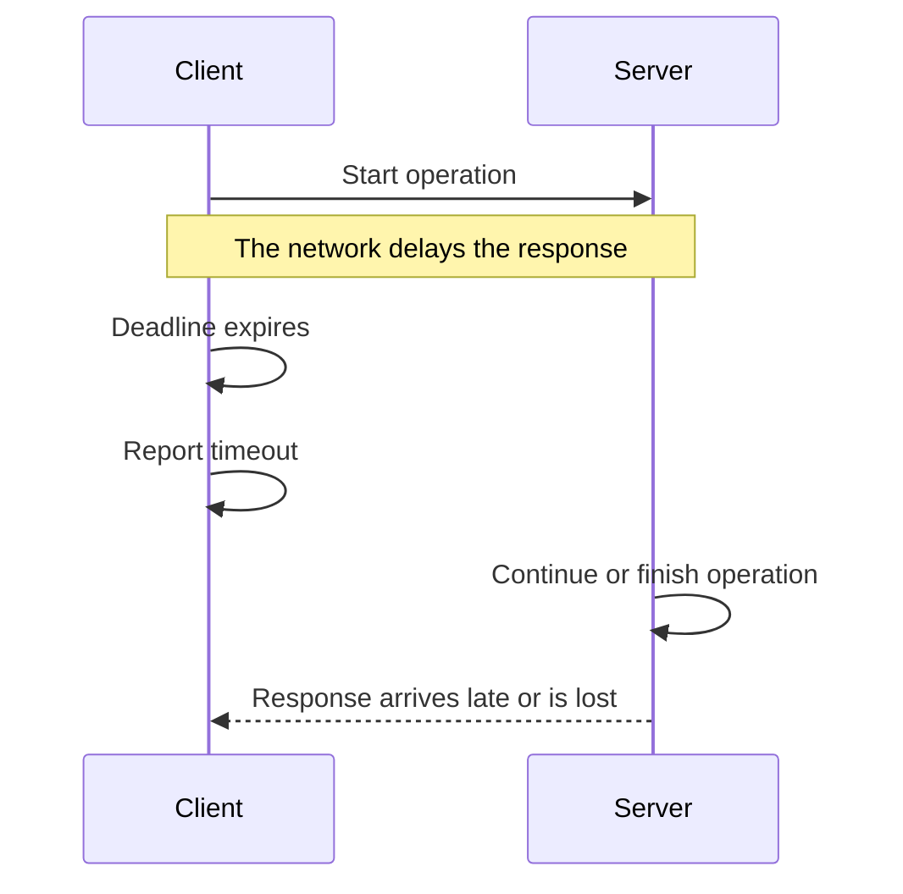
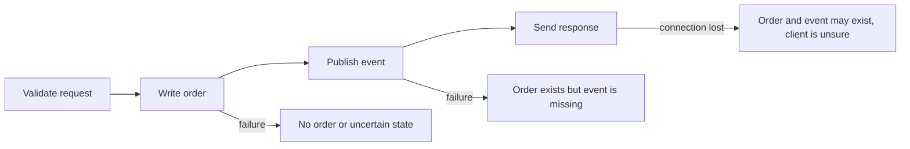
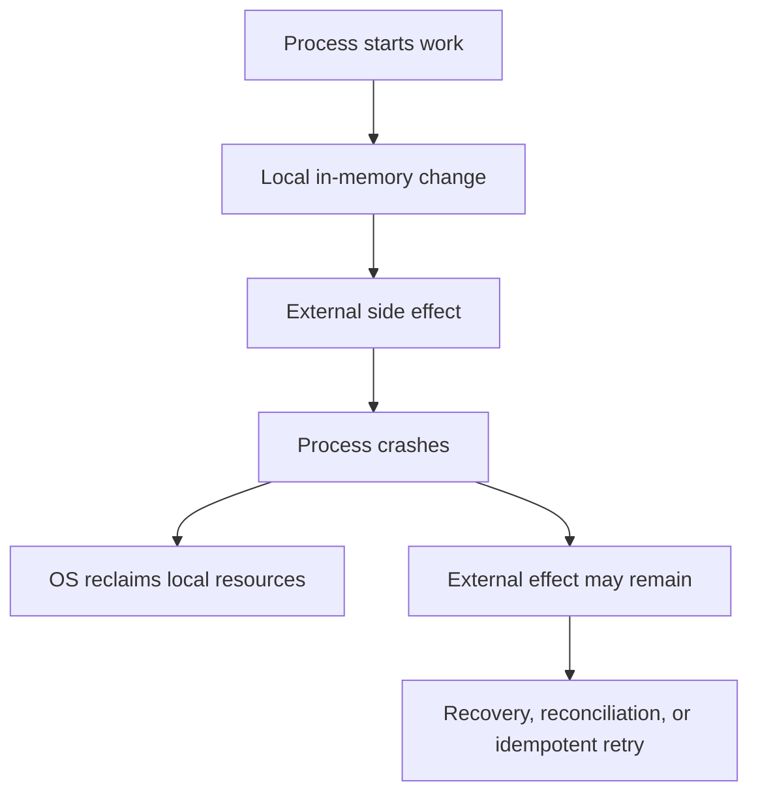
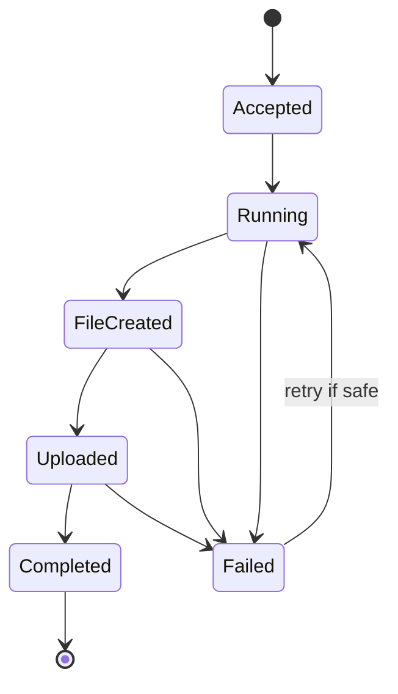

This is the fourth chapter in the Systems Programming Foundations arc. The earlier chapters described what systems programming is, how the machine presents its resources, and what it means to own or borrow one of them. Now we reach the part that makes this kind of code feel different from ordinary application work: things go wrong.

A file is missing. A connection closes before the reply arrives. A process dies halfway through its work. A lock is held by a thread that no longer exists. None of these are unusual events. They are the ordinary weather of a running system, and a system is only as reliable as the decisions it makes when they happen.

This chapter is about those decisions. We look at the ways an operation can fail, why a timeout is not the same as an error, how partial work leaves a system in an awkward state, and what makes retrying safe instead of dangerous. Then we turn to determinism, because the easier a failure is to reproduce, the easier it is to fix. We end with the question of control: how much of the machinery you want to hand to a runtime, and how much you want to own yourself.

## The idea at the center of this chapter

Systems do not run in a world where every operation succeeds, finishes on time, and happens in a predictable order. Files disappear, memory runs short, connections close, processes crash, devices return errors, and concurrent operations change the order in which events are observed.

Systems engineering is partly the work of deciding what should happen in those situations. A reliable system does not eliminate every failure. It recognizes the failure modes that matter, limits their impact, makes recovery possible, and gives engineers enough evidence to understand what happened afterward.

Determinism is the ability to get the same result when the relevant inputs and state are the same. It makes testing and debugging far easier, because a case that failed once can be made to fail again. Control is the ability to decide how resources, timing, execution, and failure are handled, instead of leaving every one of those decisions to a higher-level runtime or to some external component.

The balance worth holding onto is this:

> Use enough control to meet the system's requirements, but do not take responsibility for details that do not matter to the problem you are solving.

## Failure is a normal condition, not an exception

In small code examples, the main path is usually written as if every operation succeeds. A file opens, a network request returns, memory is allocated, and a database accepts the write. Real systems have many more possible outcomes than that.

An operation can land in any of these states:

- Succeed completely
- Fail before doing any work
- Succeed partially
- Complete on the remote side but fail to report the result
- Take longer than the caller is willing to wait
- Be interrupted by a crash or by cancellation
- Return a result that is valid but no longer useful

These are not interchangeable. The system may need a completely different response to each one.

Think about the difference in how you would react. If opening a configuration file fails because the file does not exist, retrying immediately will not help, because the file will still not be there. If a network connection is refused for a moment, a bounded retry may be perfectly reasonable. If a payment request times out after the remote system may already have accepted it, retrying without an idempotency mechanism can create a duplicate charge, which is a much worse outcome than the original delay.

So the first step in handling failure is simply to understand what the failure actually means before you act on it.

## Errors, timeouts, and cancellation are not the same thing

An error is an explicit result saying that an operation did not succeed in the way requested. The program may know the reason, such as permission denied, invalid input, or a missing file.

A timeout means the caller stopped waiting after a deadline it set for itself. It does not automatically mean the operation failed on the other side. The remote system may still be processing it, or it may have completed just before the response was lost on the way back.

Cancellation means the caller no longer wants the operation to continue. Cancellation is a request, not a guarantee. A local function may stop quickly, but a remote server may never receive the cancellation, or it may have already committed the work by the time the message arrives.



The client knows that it did not receive a response in time. It does not automatically know whether the server performed the operation.

This distinction is what makes retries tricky. Retrying a read is often safe, because reading the same data twice changes nothing. Retrying a state-changing operation is a different matter. A state-changing operation needs a way to recognize that the retry belongs to work already attempted, or you risk doing the work twice.

## When only part of an operation succeeds

Partial failure happens when only part of an operation completes. It is common whenever an operation crosses a boundary or contains several steps, because each step can fail independently of the others.

Imagine a service that creates an order. It may validate the request, write the order to a database, publish an event, and return a response. A failure can happen after any of those steps, and the state left behind is different each time.



The failure after the event is published is not the same as the failure before the order is written. In the first case, nothing may have happened. In the second, the order is real but downstream systems never heard about it. The system needs different recovery behavior for each of those cases.

A transaction can make several local database changes appear as one atomic operation, meaning that all of them commit together or none of them become visible. A transaction does not automatically make a database write and a message sent to another service atomic, because the message leaves the database boundary. That cross-service boundary needs another design, such as an outbox pattern, a reconciliation process, or an explicit retry and deduplication strategy.

The useful question is not only whether the operation failed. It is:

> Which effects definitely happened, which definitely did not happen, and which are uncertain?

## Design recovery before the failure occurs

Recovery is the process of returning a system to a useful and correct state after a failure. It may involve retrying work, rolling back local changes, replaying a log, rebuilding state, restoring a backup, or asking another component to reconcile what happened.

Good recovery design starts by naming what must remain true no matter what. These conditions are often called invariants, which are simply rules that have to hold while the system operates.

For an order system, possible invariants include:

- An order has one stable identifier.
- An order cannot be charged twice for the same payment attempt.
- An order marked as paid has a record of the payment result.
- An order cannot be shipped before it is accepted for fulfillment.

The recovery process exists to restore or preserve exactly these rules. Restarting a process is not enough on its own, because the process may come back up with inconsistent data already on disk or already visible to other services.

## Idempotency makes repeating work safe

An operation is idempotent when applying it more than once produces the same final effect as applying it once. The operation may still return different responses on each attempt, but repeating it does not create an additional unwanted effect.

Setting a user's email address to a specific value is naturally close to idempotent, because setting it to the same value twice leaves the same result. Sending a payment request or incrementing a counter is not, because each repetition applies the effect again. Repeating a payment or an increment can change the world more than once.

A common way to make a request idempotent is to give it a unique idempotency key. The server stores the result associated with that key. If the same key arrives again, the server returns the recorded result instead of performing the operation a second time.

```text
Client creates request ID: payment-8f31
         ↓
Server receives payment-8f31
         ↓
Server records the request and performs the payment
         ↓
Response is lost
         ↓
Client retries payment-8f31
         ↓
Server finds the existing result and returns it
```

The key has to be scoped correctly, stored reliably, and tied to the request's important parameters. If the same key can be reused for a different payment, the protection is unsafe. If the record is lost too soon, a late retry may be treated as brand new work and run twice.

Idempotency does not mean every operation is automatically safe to repeat. It is a deliberate protocol between the caller and the component performing the work, and both sides have to honor it.

## Retries can help, and can also make things worse

A retry repeats an operation after a failure that may be temporary. Retries are useful for short network interruptions, temporary service unavailability, or brief resource pressure.

Retries can also deepen an outage. If a dependency is already overloaded, every caller that retries immediately sends more work to it. The dependency becomes slower, which causes more timeouts, which cause more retries. This feedback loop is called a retry storm, and it can take a struggling service all the way down.

The usual protections are:

- A limit on the number of attempts
- A deadline for the whole operation
- Exponential backoff, which increases the wait between attempts
- Jitter, which adds a small random variation so clients do not all retry at the exact same moment
- Idempotency for operations that change state
- A circuit breaker or load-shedding policy when the dependency is clearly unhealthy

These controls do not make retries universally safe. A retry policy still has to consider whether the operation is repeatable, whether the failure is likely temporary, and whether the dependency can absorb another attempt.

## Timeouts keep waiting from becoming permanent

Every operation that waits for another component should have a reasonable deadline. Without a timeout, a blocked operation can hold a thread, memory, connection, or queue slot forever, and slowly starve everything around it.

A timeout is a resource-protection mechanism as much as a user-experience setting. If a service receives a thousand requests and each one waits indefinitely for a broken dependency, the service may exhaust all of its workers and become unable to answer even the simple requests that have nothing to do with the broken part.

Timeouts should be placed at the right boundaries. A database query may have a query timeout. A network connection may have a connect timeout. A request may have an end-to-end deadline that includes all of the internal work it triggers.

The deadlines have to be coordinated with each other. If a caller gives a request five hundred milliseconds but an internal dependency is allowed to wait for two seconds, the dependency can keep working long after the caller has already given up. That work consumes resources without helping the original request, which has moved on.

## Cancellation has to reach the work that is running

Cancellation tells work that it is no longer needed. For cancellation to protect resources, it has to travel all the way to the operations actually doing the work.

Suppose a user closes a page while the server is still generating a large report. If the server notices the disconnected client and cancels the database query, the file reads, and the computation, it can release resources early. If cancellation stops only the final response while the internal work keeps running, the server still spends CPU, memory, storage, and database capacity on a request nobody is waiting for.

Cancellation matters even more in concurrent systems. A parent operation should know which child tasks it started, and it should decide whether those tasks continue, finish, or stop when the parent fails. Otherwise the children keep consuming resources in service of a goal that no longer exists.

## What a crash leaves behind

A process crash ends its current execution, but it does not automatically undo every effect the process had already produced.

The operating system usually reclaims local memory and closes file descriptors. It cannot automatically undo an email already sent, a message already delivered, a database transaction already committed, or a remote lock that has no expiration.



A restart strategy therefore has to answer more than the question of how to start the process again. It has to answer:

- How does the process know what work was completed?
- How are incomplete operations detected?
- Can work be safely retried?
- How are duplicate effects prevented?
- Which state is authoritative?
- How is inconsistent state repaired?

For local durable storage, a write-ahead log can record intended changes before applying them. After a crash, the system can replay or discard incomplete work according to the log. Distributed services need additional mechanisms, because other machines may have observed effects that the crashed process no longer remembers.

## Determinism

Determinism means that the same relevant inputs and state produce the same behavior or result. Determinism makes a system easier to test and debug, because a case that failed once can be made to fail again on demand.

A program can be deterministic at one level and nondeterministic at another. A function that adds two numbers is usually deterministic. A concurrent program may call that same function in an order that changes from run to run. A network service may receive the same messages in a different order. A program that reads the current time or draws a random number has inputs that are not fixed unless you control them.

The useful question is not whether the system is perfectly deterministic, because most real systems are not. The useful question is:

> Which sources of variation affect correctness, and how can we control or observe them?

### Where nondeterminism comes from

Common sources include:

- Thread scheduling
- Network timing and message order
- Disk latency
- Clock readings
- Random-number generation
- External service responses
- Memory allocation addresses
- Unspecified language or hardware behavior

Not every variation is a bug. A network can legitimately deliver valid messages at different times. The system becomes unsafe when correctness depends on an order that the system does not actually guarantee.

## Race conditions

A race condition occurs when the result depends on the timing or order of operations that can run concurrently. A data race is a specific case where concurrent accesses to the same memory include at least one write and are not properly synchronized.

Consider two workers updating a shared counter:

```text
counter starts at 0

Worker A reads 0
Worker B reads 0
Worker A writes 1
Worker B writes 1

Expected result: 2
Actual result:   1
```

The operation called increment looks simple, but it is really a read, a calculation, and a write. Without synchronization, those steps can interleave in a way that loses one of the updates.

The fix may be a lock, an atomic operation, a message-passing design, or a change that avoids shared mutable state entirely. The right choice depends on the workload and the behavior you need. The deeper concurrency material examines these options in detail.

## Making a failure possible to reproduce

Reproduction is the process of causing the same behavior again under controlled conditions. It is one of the most valuable tools in debugging, because it turns an uncertain production symptom into something you can actually inspect.

To improve reproduction, control or record:

- Input data
- Configuration
- Software version
- Dependency versions
- Time
- Random seeds
- Machine architecture
- Concurrency level
- Network conditions
- Storage state

You cannot always reproduce a production failure exactly, and chasing a perfect replay can waste time. The goal is to shrink the number of unknowns until a useful explanation can be tested.

For a concurrency bug, running the same test may not reproduce the same schedule. A stress test may raise the chance of failure, while a scheduler or race detector may give more useful evidence than repeated runs. For a time-related bug, injecting a fake clock may be better than waiting for a particular date to arrive.

## Reproducible builds

A reproducible build produces the same artifact from the same source and declared inputs. An artifact is the result of the build, such as a binary, a container image, or a package.

Reproducibility helps with debugging, rollback, security review, and trust. If a binary running in production cannot be recreated from its source and its dependencies, it is hard to know what code is actually running, and hard to reproduce its behavior when something goes wrong.

Sources of build variation include:

- Unpinned dependencies
- Current timestamps
- Random build identifiers
- Machine-specific compiler behavior
- Environment variables
- Different toolchain versions
- Filesystem ordering

Not every project needs perfect bit-for-bit reproducibility right away, but the important inputs should be known and controlled so you are not guessing later.

## Control and convenience trade off

Higher-level tools and runtimes make development faster by managing details for you. A garbage collector handles much of memory reclamation. A connection pool manages reusable connections. A framework manages request routing. A scheduler manages task placement.

This convenience is genuinely valuable. It reduces the code you write, removes whole classes of common mistakes, and shrinks the amount of detail each engineer has to hold in their head. The cost is that the program inherits the tool's policies and behavior whether you like them or not.

For example, a garbage-collected runtime may pause or spend CPU on collection at an inconvenient moment. A connection pool may queue requests when every connection is busy. A framework may buffer a request body in memory. A scheduler may move work between CPUs and disturb cache locality.

These details only matter when they affect the system's actual requirements. If they do not affect correctness, latency, capacity, or operations, relying on the abstraction is usually the better choice.

### Choosing to take more control

An engineer may take more direct control by managing memory explicitly, choosing a custom allocator, implementing a bounded queue, controlling thread placement, using direct I/O, or writing a specialized protocol.

More control can provide:

- More predictable latency
- Lower overhead for a specific workload
- A better fit for unusual hardware or data layout
- Stronger control over resource limits

It also creates responsibilities:

- Correct cleanup
- Synchronization
- Error handling
- Portability
- Testing
- Security review
- Documentation
- Future maintenance

The decision should come from a measured requirement, not from the belief that lower-level code is automatically better. Sometimes it is, and sometimes it simply trades one hard problem for another.

## A realistic example

Imagine a service that receives a request to generate a report. It queries a database, creates a file, uploads the file to object storage, and returns a download link.

Several failures are possible:

1. The database query times out before producing a result.
2. The query completes, but the process crashes while creating the file.
3. The file is created, but the upload fails.
4. The upload succeeds, but the response is lost.
5. The client retries and creates a second report.

A weak design treats every failure as try again. A stronger design gives the report a stable job identifier, records its state, uses deadlines, cleans up temporary files, makes upload retries safe, and lets a worker resume or reconcile jobs that were left incomplete.



The state machine makes the recovery decisions explicit. A failed job in Running may need to be retried from where it stopped. A job in Uploaded may only need its final metadata updated. A job in Completed should not be run again just because a client never received the original response.

The design is not only about code. It is about representing enough state to tell incomplete work apart from completed work, because the difference is exactly what recovery depends on.

## How engineers actually investigate a failure

When a failure is reported, experienced engineers usually resist the first attractive explanation. They try to establish what is known, what is unknown, and what evidence could separate the possible causes.

They may ask:

- What exactly failed?
- When did it begin?
- Did all requests fail or only some?
- Which version and configuration were running?
- What changed before the failure?
- Did the operation have a deadline?
- Could the work have completed remotely?
- What resources were acquired before the failure?
- Which effects are certain and which are uncertain?
- Can the operation be retried safely?
- What evidence would prove or disprove each explanation?

The point is not to sound cautious. It is to avoid making a recovery action that creates a second failure, such as retrying a non-idempotent operation, raising a limit until a downstream system collapses, or deleting state that is still needed for recovery.

## Definitions

### Failure handling

> When we talk about failure handling, we mean the set of decisions a system makes about operations that do not complete normally: how it detects them, contains their effect, reports what happened, recovers when it can, and gives up cleanly when it cannot.

### Partial failure

> Partial failure is what happens when part of an operation succeeds while another part fails or becomes uncertain, leaving the system responsible for deciding how to recover or reconcile the result.

### A timeout

> A timeout is a deadline after which a caller stops waiting for an operation. It proves that the caller did not get a result in time, but it does not prove that the operation failed on the remote side.

### Idempotency

> An operation is idempotent when repeating it produces the same final effect as performing it once, even if the responses it returns are not identical.

### Determinism

> Determinism means that the same relevant inputs and state produce the same result or behavior, so a failing case can be made to happen again.

### A race condition

> A race condition occurs when the result depends on the timing or order of operations that can happen concurrently, and the system does not guarantee that order.

### A retry storm

> A retry storm occurs when many clients repeatedly retry a failing dependency and create even more load, which makes the original failure worse.

## Beyond the definitions

### Why a timeout is not proof of failure

> The timeout only describes what the caller observed. The request may have reached the server and completed while the response was delayed or lost. This is why retries for state-changing operations usually need idempotency.

### How to make an operation safe to retry

> I first determine whether repeating the operation can create a duplicate effect. If it can, I use an idempotency key or another deduplication mechanism, store the result for the appropriate lifetime, and define what happens when the request parameters do not match an existing key.

### Rollback versus compensation

> Rollback returns a local transactional operation to its previous state. Compensation performs another operation to offset an effect that cannot be rolled back directly, such as issuing a refund for a payment that was already completed.

### When more control is worth the cost

> I would take more control when measurements show that the abstraction cannot meet an important requirement such as latency, memory usage, or failure behavior. I would also weigh the extra responsibility, the portability cost, the testing burden, and the maintenance risk.

### How to debug a nondeterministic failure

> I record as much state as possible, shrink the input and the concurrency, control time and randomness, and use tracing or race-detection tools. I try to turn the timing-dependent failure into a smaller reproducible case instead of relying only on repeated execution.

## Common misconceptions

### "A timeout means the server did nothing."

A timeout only means the caller did not receive a result before its deadline. The server may still be working, or it may have completed the operation and lost the reply on the way back.

### "Retrying always improves reliability."

Retries can recover from temporary failures, but they can also overload a failing dependency or duplicate a state-changing operation. They need limits, deadlines, and a safe operation model to be helpful.

### "A process crash undoes its work."

A crash usually removes local in-memory state, but it does not undo external effects such as committed database writes, sent messages, or completed remote requests. Those outlive the process.

### "Deterministic means every system must behave exactly the same every time."

Real systems have legitimate variation from timing, scheduling, networks, and devices. The goal is to control the variation that affects correctness and to make the remaining variation observable.

### "The lowest-level implementation is the most reliable."

Lower-level code can give more control, but it also creates more room for memory bugs, cleanup failures, portability problems, and incorrect assumptions. Reliability comes from fitting the design to the requirements and managing its risks, not from how close to the metal the code sits.

## Summary

Failure is not an unusual exception to systems behavior. It is one of the conditions the system must be designed to handle. Errors, timeouts, cancellation, crashes, and partial completion have different meanings, and they should not all be treated as the same event.

Determinism makes behavior easier to test and debug, but systems naturally contain variation from concurrency, networks, clocks, devices, and external services. Good designs control the variation that affects correctness and record enough information to investigate the rest.

Higher-level abstractions reduce the detail engineers have to manage. Taking more direct control can improve predictability or performance, but it also creates responsibility for cleanup, synchronization, portability, security, and maintenance. The right choice is the simplest abstraction that satisfies the real requirements, and no simpler.
