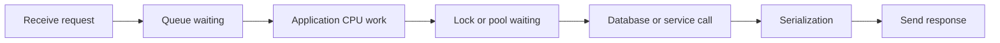
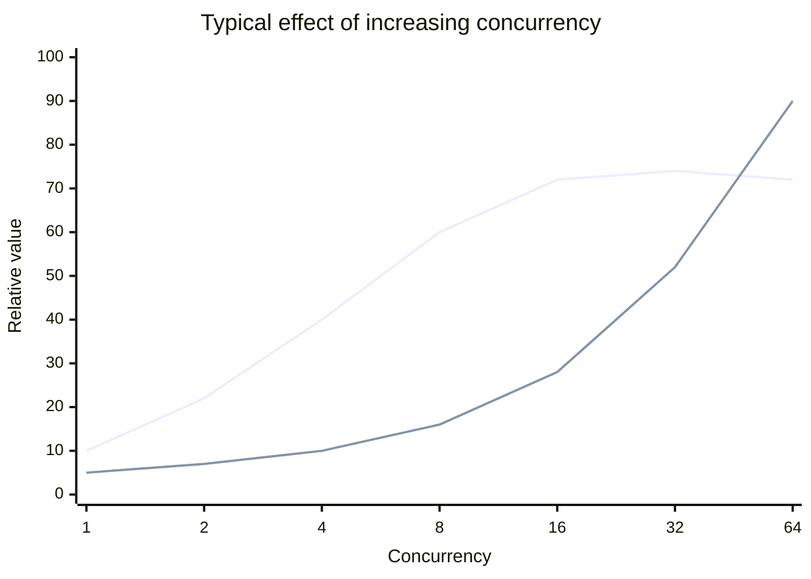
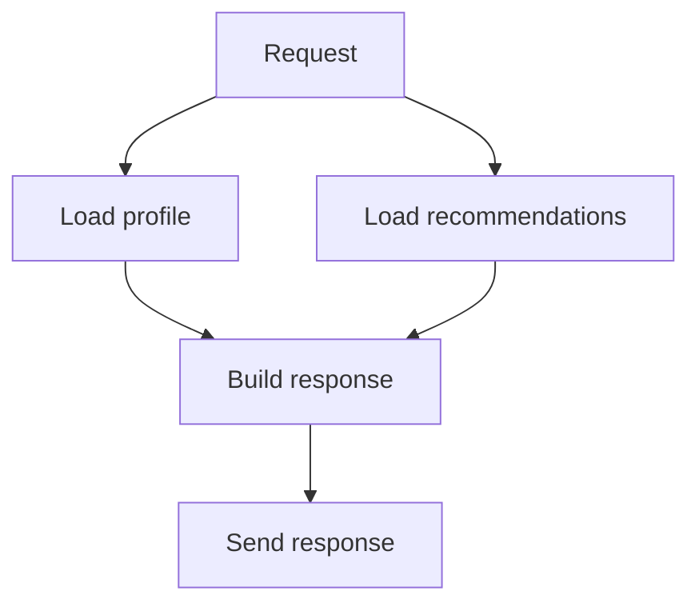
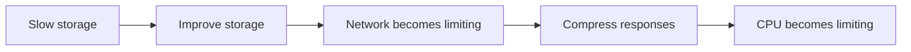

> Stage 1 — Systems Programming Foundations  
> Subject area 1.1 — What Systems Programming Means  
> Article 5

## The short version

Performance is not one number. It describes how quickly a system responds, how much work it completes, how many resources it consumes, and how its behavior changes as the workload grows.

The two most important performance measures are latency and throughput. Latency is how long one operation takes. Throughput is how much work the system completes in a period of time. A system can have high throughput and still give individual requests poor latency. It can also have excellent latency for a small workload and collapse when more users arrive.

Good performance engineering begins with a requirement and evidence. The engineer identifies what users or dependent systems need, measures where time and resources are being spent, finds the bottleneck, and chooses a change whose cost is justified by the improvement.

The central rule is:

> Do not optimize the part that looks interesting. Measure the path that limits the result you actually care about.

## Where this article fits

The previous articles introduced system resources, ownership, limits, and failure. This article explains how those ideas become performance constraints.

Later articles will examine the mechanisms behind many performance problems: CPU caches, scheduling, virtual memory, allocators, storage I/O, TCP, event loops, database indexes, queues, and distributed-service latency.

This article focuses on the reasoning process. It explains what to measure and how to choose a useful optimization before studying every low-level optimization technique.

## Performance starts with a requirement

A statement such as “make it faster” is not precise enough to guide engineering work. Faster for which operation, under what load, and measured in what way?

A useful performance requirement identifies the workload, the measurement, and the target.

For example:

> Under 500 requests per second, the search endpoint should respond in less than 200 milliseconds for 99 percent of requests, while keeping the service below 70 percent CPU utilization.

This statement contains several important ideas. It defines the traffic level, the endpoint, the latency target, the percentile, and a resource constraint. A different system might care more about processing a large batch overnight, in which case total completion time and throughput may matter more than the latency of one item.

The right performance goal comes from the system's purpose. A trading system, a web page, a background report, and a metrics pipeline may need very different performance properties.

## Latency

Latency is the elapsed time between an operation starting and its result becoming available. For a user request, it may be the time from receiving the request until the response is sent.

Latency is often made of several waiting and processing stages:



The total latency includes more than the CPU instructions that compute the result. A request may spend most of its time waiting for a connection, a lock, a disk, a remote service, or an available worker.

### Average latency is not enough

The average is calculated by adding all observed latencies and dividing by the number of requests. It is useful for some analysis, but it can hide the experience of slow requests.

Suppose 99 requests take 10 milliseconds and one request takes 10 seconds. The average is much higher than the normal request time, but it still does not tell us how many users experienced the slow result or what the tail of the distribution looks like.

A percentile describes the value below which a given percentage of observations fall. If the 95th-percentile latency is 200 milliseconds, 95 percent of measured requests finished within 200 milliseconds and 5 percent took longer. The 99th percentile focuses on an even slower part of the distribution.

Tail latency is the latency of the slowest portion of requests. It matters because users and upstream services often experience the tail, and because a single slow dependency can affect an entire request chain.

If one request calls five services, the chance that at least one service is slow increases. A service that is fast at the 99th percentile in isolation may still contribute to slow end-to-end requests when many calls are combined.

## Throughput

Throughput is the amount of work completed per unit of time. It might be measured in requests per second, records per second, megabytes per second, messages per second, or transactions per minute.

Throughput is useful for workloads such as:

- Processing a large data set
- Ingesting logs or events
- Writing storage blocks
- Serving network traffic
- Running background jobs

Improving throughput does not necessarily improve latency. Batching can process many records efficiently but make each record wait for the batch to fill. A queue can keep workers busy and increase throughput while increasing the time an individual job waits.

The system needs a balance appropriate to the workload. A user-facing request may prioritize latency. A nightly data pipeline may prioritize throughput and total completion time.

## Latency and throughput can conflict

Many systems have a tradeoff between latency and throughput.

Sending one small database write at a time may give each write a quick response but waste CPU and storage overhead. Grouping writes into batches can improve throughput, but each write waits until the batch is ready.

Using more concurrent workers can increase throughput while there is unused capacity. Beyond a certain point, workers compete for CPU, memory, locks, storage, or connections. Latency grows and throughput may stop improving.



The exact curve differs by system, but the pattern is common: throughput improves until a resource becomes saturated, while latency often rises earlier because requests begin waiting in queues.

## The critical path

The critical path is the sequence of work that determines when an operation can finish. Work outside the critical path may run in parallel or asynchronously without delaying the response.

For a request that loads a user profile and recommendations, the application may need the profile before responding but may be able to load recommendations independently or use a cached result.



If both branches must finish, the request is limited by the slower branch plus coordination overhead. If recommendations are optional, the system may return the profile without waiting for them.

Finding the critical path helps an engineer decide whether to optimize work, remove work, parallelize work, cache work, or make some work optional.

## Queueing and waiting

When work arrives faster than a component can process it immediately, the work waits. The waiting area may be visible as a queue or hidden inside a thread pool, connection pool, lock, kernel buffer, database, or network device.

```text
Arrival rate > service rate
        ↓
Queue grows
        ↓
Waiting time grows
        ↓
Deadlines are missed
        ↓
Retries or new work add more load
```

The arrival rate is how quickly work enters a component. The service rate is how quickly the component completes work. If the arrival rate stays above the service rate, no amount of queue tuning can prevent eventual overload. The system must reduce arrivals, increase service capacity, reject work, or move work to another resource.

Queueing also explains why latency can increase suddenly near saturation. When utilization is low, a request often starts immediately. As utilization approaches the limit, even a small burst can create a queue, and the queue adds delay to every request behind it.

This is why leaving headroom is important. A system running permanently at its maximum measured throughput has little space for bursts, failures, maintenance, or measurement error.

## Utilization and saturation

Utilization describes how busy a resource is. CPU utilization, memory usage, storage bandwidth, and network bandwidth are common examples.

Saturation describes whether additional work is forced to wait because the resource has no immediate capacity. A resource can have high utilization without being harmful if work remains within its latency target and queues do not grow. A resource can also have moderate average utilization but experience short saturation periods that create unacceptable tail latency.

Important signals include:

- Resource utilization
- Queue length
- Wait time
- Work completion rate
- Rejection rate
- Timeout rate
- Error rate
- Tail latency

Looking at utilization alone can produce bad conclusions. A service with low CPU usage may be waiting on a database. A service with high CPU usage may be healthy if it has enough capacity and stable latency. A database with moderate CPU may still be limited by locks or storage latency.

## Capacity and headroom

Capacity is the amount of work a system can handle while meeting its requirements. It is not simply the maximum amount of work before the machine crashes.

If a service can process 1,000 requests per second before its latency becomes unacceptable, its useful capacity may be much lower than the rate at which it can technically accept requests.

Headroom is unused capacity reserved for bursts, failures, deployments, growth, and uncertainty. A service running at 95 percent of every resource limit may look efficient, but it is fragile. One slow dependency or one failed instance can push the remaining instances into saturation.

Capacity planning should consider failure scenarios. If a service normally runs four instances and must continue operating after losing one, the remaining three must have enough capacity for the expected load. This is sometimes called a failure-domain or spare-capacity requirement.

The correct amount of headroom depends on traffic variability, recovery time, scaling speed, and the cost of failure. Too little headroom creates incidents. Too much headroom wastes money and may hide inefficient design.

## Bottlenecks

A bottleneck is the part of the system that limits end-to-end progress. The bottleneck may be a CPU core, a lock, a database query, a disk, a network link, a connection pool, or a human approval step.

The busiest component is not always the bottleneck. A component may be busy doing work that is not on the critical path, while a lightly utilized lock or queue causes most requests to wait.

The bottleneck can also move after an optimization.



This is normal. The goal of an optimization is not to make every component equally busy. The goal is to improve the required outcome without creating an unacceptable new limit.

## Measurement before optimization

Optimization is changing a system to improve a measured property. Without measurement, an optimization is only a guess.

A useful performance investigation usually has four parts:

1. Define the workload and success metric.
2. Measure a baseline.
3. Change one important factor.
4. Measure again under the same or clearly described conditions.

The baseline should include enough information to explain the result. Record the software version, configuration, input size, concurrency, machine type, dependency state, and whether caches are warm or cold.

Without this information, two benchmark results may look different while measuring different workloads.

### Warm and cold behavior

A warm cache contains data recently used by the system. A cold cache does not. A program that reads the same file repeatedly may be measuring memory and page-cache behavior rather than storage latency.

Both conditions can matter. Warm behavior may represent normal steady-state traffic. Cold behavior may represent a restart, a new deployment, a new tenant, or a cache eviction event.

The benchmark should state which condition it measures instead of presenting one number as universal.

### Microbenchmarks and real workloads

A microbenchmark measures a small operation in isolation. It is useful for comparing implementations or finding a local cost, but it may not predict end-to-end service behavior.

A real workload includes parsing, allocation, logging, scheduling, network calls, storage, contention, and background work. An optimization that makes one function 20 percent faster may have no visible effect if that function represents only 1 percent of total request time.

This is an example of Amdahl's law (the idea that the total speedup is limited by the part of the workload that was not improved). If only a small fraction of the total time is spent in the optimized section, the end-to-end improvement is limited.

## A small code example: measure the whole operation

Suppose a service processes records in batches. A benchmark should measure the operation in a way that includes the work that matters and prevents the compiler from removing unused results.

```go
func BenchmarkProcessBatch(b *testing.B) {
	records := makeRecords(1000)
	b.ResetTimer()

	for i := 0; i < b.N; i++ {
		result := processBatch(records)
		if len(result) == 0 {
			b.Fatal("unexpected empty result")
		}
	}
}
```

The benchmark repeats the operation many times so that timing noise has less influence. It creates the input before the timer starts because the question is about processing cost, not input construction. It also checks the result so the benchmark does not accidentally measure an operation that the compiler can remove or simplify.

This is still only a local measurement. It does not tell us how the function behaves when many requests share memory, compete for a lock, wait for a database, or run on a different machine.

## Profiling shows where time goes

Profiling collects evidence about where a program spends CPU time, memory, lock time, or I/O time. A CPU profile may show that a service spends time in parsing, encryption, garbage collection, or a retry loop. A memory profile may show allocation rate or retained objects. A lock profile may show contention.

The profile does not automatically identify the correct solution. It identifies where the measured workload spent time. The engineer still has to ask whether that work is required, whether it can be reduced, whether it can be parallelized, and whether changing it creates another problem.

For example, if a profile shows that a service spends 30 percent of CPU time serializing data, possible responses include reducing fields, changing the format, reusing buffers, compressing less, or moving serialization to another stage. The correct choice depends on network bandwidth, compatibility, memory, and latency requirements.

## Optimization choices

Several common techniques improve performance, but each changes another property.

### Remove unnecessary work

The best optimization is often avoiding work. Filtering data earlier, selecting only required columns, avoiding repeated parsing, and not generating unused results can improve performance without adding a new subsystem.

Removing work is usually safer than making the same work faster because it also reduces resource usage and failure surface.

### Cache reusable results

A cache stores a result closer to the consumer so that later requests can avoid repeating expensive work. Caching can reduce latency and load, but it introduces freshness, memory, invalidation, and eviction decisions.

A cache is useful only when the cost of stale data and cache management is acceptable. A cache that is always invalidated immediately may add complexity without reducing work.

### Batch operations

Batching combines multiple small operations into one larger operation. It can reduce per-operation overhead and improve storage or network efficiency. The tradeoff is that items may wait for the batch and a failed batch may require partial-result handling.

### Parallelize independent work

Parallelism allows independent operations to make progress at the same time. It can reduce latency when the operations use separate capacity, but it can also increase contention, memory usage, connection usage, and downstream load.

Parallelism is valuable only when the work is actually independent and the system has enough capacity to support it.

### Add capacity

Scaling up provides more capacity on one machine. Scaling out adds more machines or processes. Both can help, but they may expose a new bottleneck and add cost or coordination complexity.

Adding capacity is often the right short-term response to growth, but it should not hide an unbounded leak, an inefficient query, or an overload policy that is missing.

## Performance versus simplicity

A more complex design can improve performance, but complexity is itself a cost. It increases the number of states, failure modes, tests, configuration values, operational procedures, and concepts that future engineers must understand.

Before adding a cache, worker pool, custom allocator, asynchronous pipeline, or specialized storage path, ask:

- What measured problem does this solve?
- What improvement is required?
- What new resource does it consume?
- What happens when it is full or stale?
- How will it be tested?
- How will it be observed?
- Can it be disabled or rolled back?
- Who will maintain it?

Performance work should improve the whole system, not merely make one benchmark look better.

## A realistic production example

Imagine an API that returns a user's dashboard. The average latency is 120 milliseconds, which appears acceptable. Users still report that the dashboard sometimes takes several seconds to load.

The team checks percentiles and finds that the 99th percentile is 2.4 seconds. Traces show that most requests are fast, but a small number wait for a database connection and then call three downstream services sequentially.

The team considers running the downstream calls in parallel. That may reduce latency, but it also triples the number of concurrent requests sent to the dependencies. Before making the change, the team checks dependency capacity and adds deadlines so the dashboard does not wait forever for one optional component.

The team then makes recommendations optional. If that dependency is slow, the dashboard returns the core account data and displays recommendations later. The result improves tail latency without simply adding more threads or increasing every timeout.

The final design is a combination of measurement, parallelism, deadlines, and graceful degradation. No single performance trick solved the problem.

## Performance and failure are connected

Performance problems can become reliability problems.

A slow dependency causes requests to remain active longer. More active requests consume memory, workers, connections, and queue slots. As those resources fill, new requests wait longer and time out. Callers retry, increasing the load on the already slow dependency.

```text
Slow dependency
    ↓
Requests remain active longer
    ↓
Workers and connections become occupied
    ↓
Queues grow
    ↓
Timeouts increase
    ↓
Retries add more work
    ↓
System becomes less reliable
```

Performance engineering therefore includes limits, timeouts, backpressure, load shedding, and graceful degradation. A fast design that fails catastrophically under overload is not a good production design.

## How experienced engineers approach a performance problem

An experienced engineer does not start by naming an optimization. They first clarify the impact and the workload.

They ask:

1. Which user or system behavior is too slow?
2. Is the problem latency, throughput, capacity, cost, or all of them?
3. Is the problem constant or only present under a particular load?
4. Which percentile or completion target matters?
5. Where does the critical path spend time?
6. Which resource is saturated or causing waiting?
7. Is the measured bottleneck inside the system or in a dependency?
8. What is the smallest change that can test the hypothesis?
9. What new failure mode will the change introduce?
10. How will the improvement be measured after deployment?

This process prevents two common mistakes: optimizing a component that is not limiting the result and improving normal-case speed while making overload behavior unsafe.

## Interview definitions

### What is latency?

> Latency is the time taken by one operation from its start until its result is available.

### What is throughput?

> Throughput is the amount of work a system completes per unit of time.

### What is tail latency?

> Tail latency describes the slower part of a latency distribution, such as the 95th or 99th percentile, where a smaller group of requests takes much longer than normal.

### What is a bottleneck?

> A bottleneck is the part of a system that limits the progress of the overall workload.

### What is headroom?

> Headroom is unused capacity reserved for traffic bursts, failures, growth, maintenance, and uncertainty.

### What is saturation?

> Saturation occurs when a resource has so little available capacity that additional work mostly creates waiting instead of useful progress.

### What is a performance constraint?

> A performance constraint is a requirement that limits how much time, capacity, or resource usage a system can spend while doing its work.

## Interview follow-up questions

### Why is average latency often a poor service metric?

> Average latency can hide a slow tail. A small percentage of very slow requests may have a serious user or dependency impact even when the average looks acceptable, so I also look at percentiles such as p95 and p99.

### How do you find the bottleneck in a slow service?

> I define the workload and latency target, then use traces, profiles, metrics, and resource measurements to see where time is spent and where work is waiting. I compare the evidence with a hypothesis and measure again after changing one important factor.

### Why can adding more workers make a system slower?

> More workers can increase useful parallelism until a shared resource becomes saturated. After that point, workers compete for CPU, memory, locks, connections, or downstream capacity, so queues and latency grow.

### What is the difference between scaling up and scaling out?

> Scaling up gives an existing machine more capacity. Scaling out adds more machines or processes. Scaling up is often simpler, while scaling out can provide more total capacity and failure isolation but requires coordination and distribution.

### Why is caching not a universal performance solution?

> Caching helps when repeated work can be reused and stale data is acceptable. It also introduces memory usage, invalidation rules, eviction behavior, and possible inconsistency. If the data changes often or the cache hit rate is low, it may add complexity without enough benefit.

### What makes a benchmark trustworthy?

> It has a defined workload, a meaningful metric, controlled inputs and configuration, enough repetitions, and a comparison against a baseline. It should also state whether caches are warm, how much concurrency is used, and whether the measured operation represents the real bottleneck.

## Common misconceptions

### “The fastest function makes the fastest system.”

An optimized function may not matter if it is a small part of the critical path. End-to-end performance depends on the work that determines when the operation can finish.

### “High utilization means the system is healthy.”

High utilization can be healthy when latency and queues remain controlled. Near saturation, small bursts or failures can create large delays, so headroom and wait time matter too.

### “More concurrency always increases throughput.”

More concurrency helps while there is useful independent work and available capacity. Beyond that point, contention and queueing can reduce throughput and increase latency.

### “A benchmark number is a property of the code.”

A measurement is a property of the code, workload, machine, compiler, configuration, dependencies, and measurement method together. Changing any of those can change the result.

### “Performance and reliability are separate concerns.”

Slow work occupies resources longer, causes queues and timeouts, and can trigger retries. Performance behavior can directly affect reliability.

## Summary

Performance is a set of constraints around time, work, capacity, and resource usage. Latency describes one operation, throughput describes completed work, and tail latency shows the experience of slower requests. Capacity and headroom determine how a system behaves during growth, bursts, and failures.

The practical method is to define a real requirement, measure a representative workload, find the critical path and bottleneck, make the smallest useful change, and measure again. Caching, batching, parallelism, and scaling can help, but each introduces tradeoffs and new failure modes.

The best performance work often removes unnecessary work and keeps the system simple. When complexity is necessary, it should come with limits, observability, safe overload behavior, and a clear reason for existing.

## If you want to build this later

Build a small performance laboratory with three programs: a CPU-heavy program, a file-reading program, and a network client.

Give each program configurable input size and concurrency. Measure total time, throughput, average latency, and p95 latency. Then change one factor at a time: add workers, increase input, reuse buffers, batch operations, or add an artificial delay to a dependency.

The goal is to observe where throughput stops improving, where latency begins to grow, and how the bottleneck moves after an optimization. Record each result with the workload and configuration so that the numbers remain meaningful.
