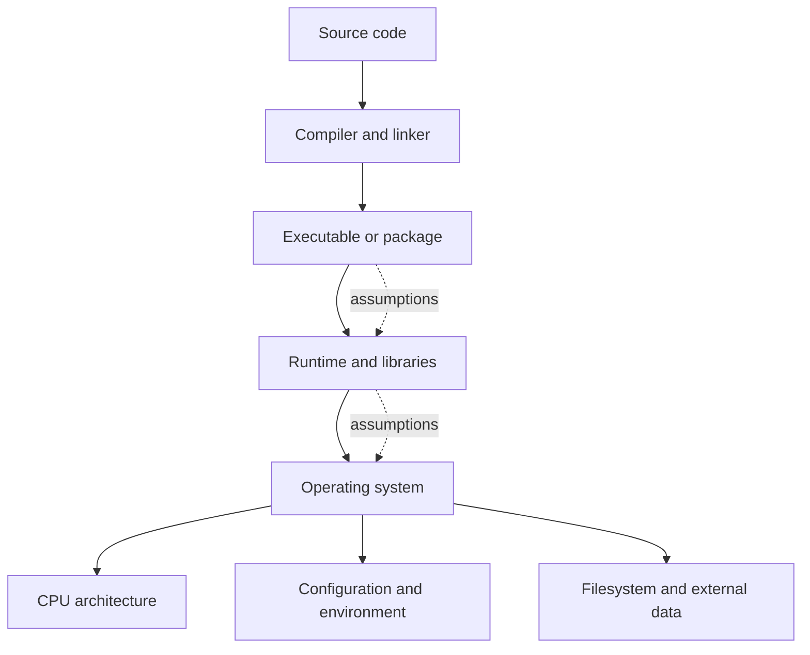
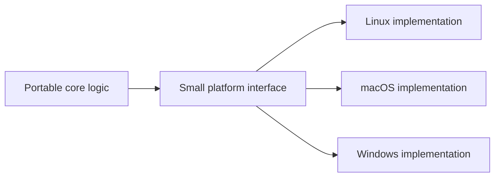
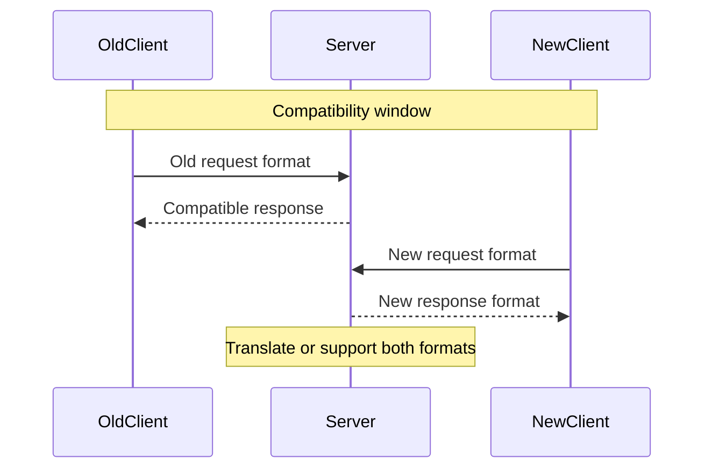
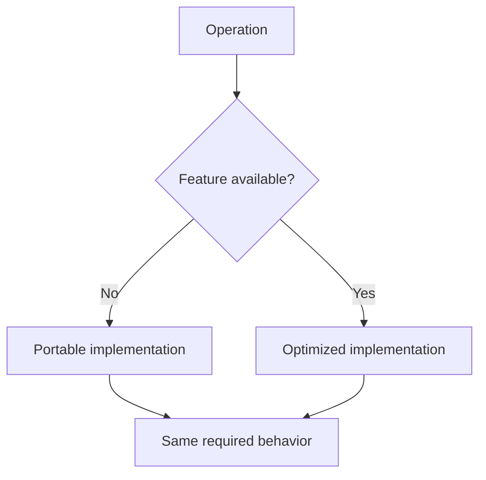

> Stage 1 — Systems Programming Foundations  
> Subject area 1.1 — What Systems Programming Means  
> Article 6

## The short version

Software rarely runs in exactly the environment where it was first written. It may move from one operating system to another, from x86-64 to ARM64, from one compiler version to another, or from one library release to a newer one.

Portability is the ability to run software in different environments. Compatibility is the ability of different versions or components to continue working together. An abstraction leak occurs when a detail hidden by an interface becomes visible because it affects the software's behavior.

These problems usually come from assumptions. The code assumes a path separator, a data size, a byte order, a syscall, a filesystem behavior, a compiler rule, a library symbol, or a protocol field. The assumption may be correct in the original environment and wrong somewhere else.

The central engineering habit is:

> Make important environmental assumptions explicit, isolate them behind clear boundaries, and test the boundaries where the environment can change.

## Where this article fits

The previous article explained how performance depends on resources and system behavior. This article explains why that behavior is not identical across every environment.

Later articles will use these ideas when discussing APIs and ABIs, compilers and loaders, filesystems, networking, security, containers, databases, and deployment. Portability and compatibility are not final cleanup tasks. They influence design from the beginning.

## Portability and compatibility are different

Portability asks whether the same software can run in different environments. The environment may differ by operating system, CPU architecture, compiler, runtime, filesystem, or cloud platform.

Compatibility asks whether two versions or components can continue working together. The components may be two versions of an API, a client and server, a program and a shared library, or a database and an application.

A system can be portable but not compatible. A program may compile on both Linux and Windows, but a new version of its file format may break older clients.

A system can be compatible but not portable. A service may preserve its network API across versions while only running on one operating system.

```rs
Portability
    Same software across different environments

Compatibility
    Different versions or components continuing to work together
```

The distinction matters because the solutions are different. Portability often requires isolating environment-specific behavior. Compatibility often requires versioning, stable contracts, migration paths, and careful changes.

## The environment is part of the program

Source code is not the complete input to a running program. The result also depends on the compiler, linker, libraries, runtime, operating system, CPU architecture, configuration, filesystem, environment variables, clock, locale, and external services.



Two machines can run the same source code and produce different behavior because one of these inputs changed. Sometimes the difference is a compile error. Sometimes it is a different result. The most dangerous case is behavior that looks correct until a rare input or failure occurs.

## Operating-system portability

Operating systems expose similar ideas through different interfaces. They all have processes, files, memory, and networking, but the details and guarantees differ.

Examples include:

- Path separators and filesystem naming rules
- File permissions and ownership models
- Process creation APIs
- Signal behavior
- File-locking semantics
- Clock and timer behavior
- Socket options
- Event notification APIs
- Shared-library formats
- Service managers

An application that uses a high-level standard library may avoid many differences. A systems program that needs process groups, filesystem notifications, direct I/O, or kernel tracing may need platform-specific code.

The goal is not to pretend that operating systems are identical. The goal is to place differences in a small, clear part of the program instead of spreading them through every component.



This structure lets most of the program use one stable model while the platform interface handles differences explicitly.

## CPU architecture portability

A CPU architecture defines the instructions a processor understands and important rules about registers, memory access, alignment, and data representation. Common server architectures include x86-64 and ARM64.

Most application code does not need to know individual CPU instructions. It still depends on architecture details through:

- Integer and pointer sizes
- Alignment requirements
- Endianness
- Atomic instructions
- Memory-ordering behavior
- Floating-point behavior
- Compiler-generated code
- Available vector instructions

Endianness describes the order in which the bytes of a multi-byte value are stored. In little-endian representation, the least significant byte is stored first. In big-endian representation, the most significant byte is stored first.

If a program writes a multi-byte integer directly to a file or network connection, the reader needs to know the byte order. Otherwise, the same bytes can represent different values on different systems.

Alignment describes where a value may be placed in memory. Some architectures allow unaligned access with a performance cost. Others may reject it or require special instructions. Code that assumes every address can hold every type may work on one architecture and fail on another.

## Data representation is a compatibility boundary

Data must have an agreed representation when it crosses a process, machine, or version boundary. The representation must define field sizes, byte order, encoding, alignment, optional fields, and error behavior.

Writing an in-memory object directly to disk or across the network is often unsafe because the in-memory layout may contain padding or architecture-specific details.

Consider this C structure:

```c
struct Header {
    uint16_t version;
    uint32_t payload_length;
};
```

A programmer might be tempted to write the structure's raw bytes to a file. The compiler may insert padding between the fields so that `payload_length` is aligned. The total size may differ between compilers or architectures. The byte order may also differ.

The safer design defines a wire or file format explicitly:

```text
Bytes 0-1: version, unsigned 16-bit integer, big-endian
Bytes 2-5: payload length, unsigned 32-bit integer, big-endian
Bytes 6-n: payload bytes
```

The encoder writes each field according to that definition. The decoder reads the defined number of bytes and validates the values before using them.

This costs a small amount of code, but it creates a stable boundary. The file or message format no longer depends on the compiler's private memory layout.

## Source compatibility and binary compatibility

Source compatibility means that existing source code can still be compiled against a newer version of a library or interface. A change to a function name or type may break source compatibility even if the underlying binary behavior could have remained similar.

Binary compatibility means that an already-compiled program can continue to run with a newer library or component. The function symbols, calling conventions, data layouts, and runtime expectations must remain compatible.

These are different. A library may preserve binary compatibility while changing a source-level declaration. It may also preserve source compatibility while changing a binary layout in a way that breaks already-compiled programs.

An ABI, or application binary interface, defines low-level rules that compiled components use to communicate. It includes calling conventions, data layout, symbol names, register usage, stack layout, and object formats.

An API, or application programming interface, is the source-level contract that programmers use. An ABI is the lower-level contract that compiled code depends on.

```text
Application source code
        ↓ API
Compiler-generated code
        ↓ ABI
Library, runtime, operating system, or other binary
```

An API change may require recompiling clients. An ABI change may break clients even when their source code has not changed.

## Compatibility is a promise with a scope

When engineers say that an interface is “backward compatible,” the statement needs a scope.

It may mean:

- A new server accepts requests from old clients.
- A new client can read old data.
- An old client can read responses from a new server.
- An existing database schema remains readable.
- An already-compiled program still loads a shared library.
- A configuration file continues to parse.

These guarantees are not identical. A change can preserve one direction and break another.

For example, adding an optional response field may be safe for clients that ignore unknown fields. Removing a field may break clients that require it. Changing the meaning of an existing field can be more dangerous than adding a new field because old clients may continue to run while interpreting the value incorrectly.

Compatibility should therefore be described in terms of producers, consumers, versions, and directions.

## Versioning and evolution

Systems change over time. A protocol, file format, API, database schema, or configuration format needs a way to evolve without forcing every component to change at exactly the same moment.

Common techniques include:

- Optional fields with safe defaults
- Explicit version numbers
- Additive changes before removal
- Supporting old and new formats during migration
- Capability negotiation
- Feature flags
- Deprecation periods
- Translators between versions



The compatibility window is temporary. Supporting old behavior forever increases code and testing cost. A responsible migration includes a plan for measuring old usage, communicating a deadline, moving consumers, and eventually removing the old path.

## Configuration is also an interface

Engineers often treat configuration as separate from compatibility, but configuration is an input contract. Environment variables, command-line flags, YAML files, database settings, and feature flags are all interfaces between operators and software.

Changing a default can change behavior without changing the code. Renaming a configuration key can prevent a service from starting. Changing the meaning of a timeout can make a service retry too aggressively or wait too long.

Good configuration design defines:

- The name and type of each value
- The default
- The allowed range
- Whether the value can change at runtime
- What happens when it is missing or invalid
- Whether old names remain supported

Configuration should fail clearly when a dangerous value is invalid. Silently accepting an unknown key can create a false sense that an important setting is active.

## Filesystem abstractions leak

A high-level file API may make every file look like a sequence of bytes, but filesystem behavior can still affect the program.

Important differences include:

- Case sensitivity
- Maximum path length
- Filename encoding
- Permission behavior
- Symbolic links
- Atomic rename guarantees
- Timestamp precision
- Locking semantics
- Flush and durability behavior
- Local versus network filesystem behavior

A test may pass on a case-sensitive Linux filesystem and fail on a case-insensitive development machine because two filenames differ only by case. A program may assume that renaming a file is immediately durable when the filesystem only guarantees atomic visibility, not persistence after power loss.

The file abstraction remains useful. The engineer must identify which filesystem properties the application actually depends on and document or enforce them.

## Network abstractions leak

A network client may expose a simple function such as `Get(url)`, but the call crosses several boundaries: DNS, routing, connection setup, TLS, server queueing, application processing, and response transfer.

The abstraction leaks when any of those details affect behavior. A DNS cache can return an old address. A connection pool can be exhausted. A certificate can expire. A proxy can impose a request limit. A remote server can complete the operation after the client timeout.

This does not mean every application must understand every packet. It means the system should know which assumptions matter. A latency-sensitive service may need connection reuse and deadlines. A security-sensitive client must validate certificates. A long-lived connection may need keep-alive and reconnect behavior.

## Runtime abstractions leak

Language runtimes provide useful services such as memory management, scheduling, networking, reflection, and garbage collection. They also have behavior that can affect a program.

A garbage collector may use CPU and pause or slow application work. An asynchronous runtime may schedule tasks cooperatively, meaning one task that does not yield can delay others. A runtime's network API may buffer data or impose a particular cancellation model.

The right response is not to avoid runtimes. It is to understand the parts that affect the requirements. If a service has strict latency goals, measure runtime pauses and allocation behavior. If a program performs blocking work inside an event loop, understand how that blocks unrelated tasks.

## Portability through boundaries

Portable systems usually separate stable logic from environment-specific behavior.

For example, a storage engine may define an internal interface:

```text
read(block_number) -> bytes
write(block_number, bytes)
flush()
```

One implementation may use a local file. Another may use a block device or a remote storage service. The storage engine's higher-level logic can remain stable if the implementations provide the required guarantees.

The boundary must describe behavior, not only function names. It should specify whether reads can be partial, whether writes are durable after return, whether operations are thread-safe, and what errors can occur.

An interface that hides the wrong details creates surprises. An interface that exposes every platform-specific detail destroys portability. Good interface design chooses the smallest set of guarantees that the higher-level component truly needs.

## Feature detection and capability negotiation

Portable software should not assume that every environment supports every feature. It can detect capabilities or negotiate them.

Feature detection asks the local environment what it supports. Capability negotiation allows two communicating components to choose a common set of features.

For example, a client and server may negotiate compression or a protocol version. A program may check whether a filesystem supports a particular operation before using it. A compiler may expose a feature flag for a CPU instruction set.

A capability is not the same as a version number. Two systems with the same version may have different configuration or hardware capabilities. When possible, checking the behavior or capability directly is safer than assuming it from a version string.

## Portability versus lowest common denominator

Portable software does not need to use only the weakest feature available everywhere. It can have a portable base and optional optimized paths.



The optimized path must preserve the required behavior and have tests. If it is not available or fails, the portable path should remain correct.

This pattern lets software use hardware acceleration, platform-specific filesystem features, or specialized system calls without making those features a requirement for every environment.

## A realistic production example

Imagine a service that stores a small binary record on disk. It works correctly on a developer's laptop and on the first production machines. The company later moves part of the workload to ARM64 machines and discovers that some records cannot be read.

The service had written an in-memory C structure directly to disk. The structure contained compiler-inserted padding, and the code assumed a particular byte order. The file format had never defined either property.

The short-term fix is to write a reader that can detect and convert the old format. The long-term fix is to define an explicit format with field sizes, byte order, versioning, and validation. New records use the stable format, while old records are migrated or supported during a compatibility window.

The original code was not obviously wrong on its first machine. The problem was that an environment assumption had become an undocumented file-format contract.

## How experienced engineers handle compatibility changes

When changing a public interface, experienced engineers consider the consumers that they do not control directly.

They ask:

- Who produces this data and who consumes it?
- Which versions are currently deployed?
- Can old and new versions run together during a rolling deployment?
- What happens if a client is upgraded before the server?
- What happens if the server is upgraded before the client?
- Can the old data be read after the change?
- How will old usage be measured?
- How will the change be rolled back?
- When can the old behavior be removed?

This is why additive changes are often safer than replacement changes. A new optional field can be introduced, populated, observed, and eventually made required. Removing an old field immediately forces coordination across all consumers.

Compatibility work is partly technical and partly organizational. The system may be correct while the migration still fails because a team did not know that its client depended on the old behavior.

## How to investigate a portability problem

When software behaves differently in another environment, compare assumptions systematically.

Check:

1. Operating system and version
2. CPU architecture
3. Compiler, linker, and runtime versions
4. Dependency versions
5. Environment variables and configuration
6. Filesystem type and mount options
7. Locale, timezone, and clock behavior
8. Permissions and user identity
9. Available CPU, memory, storage, and network features
10. External service versions and responses

Then reduce the problem to the smallest difference that changes the result. A small compatibility test is more valuable than a general statement that “the platforms behave differently.”

## Interview definitions

### What is portability?

> Portability is the ability of software to run correctly in different environments, such as operating systems, CPU architectures, runtimes, or filesystems.

### What is compatibility?

> Compatibility is the ability of different versions or components to continue working together under a defined contract.

### What is an API?

> An API is the source-level interface that defines how a program uses a component or service.

### What is an ABI?

> An ABI is the binary-level contract that defines how compiled components communicate, including calling conventions, data layout, symbols, and object formats.

### What is an abstraction leak?

> An abstraction leak occurs when an implementation detail hidden by an interface affects the behavior that users or developers can observe.

### What is backward compatibility?

> Backward compatibility means that a newer component continues to support the behavior or data expected by older clients or versions.

### What is a compatibility window?

> A compatibility window is the period during a migration when old and new versions are intentionally supported together.

## Interview follow-up questions

### What is the difference between an API and an ABI?

> An API is the interface source code uses, while an ABI is the lower-level contract used by compiled code. The ABI includes details such as calling conventions, symbol names, register usage, and data layout.

### How would you make a binary file format portable?

> I would define field sizes, byte order, alignment, encoding, versioning, and validation explicitly. I would avoid writing raw in-memory structures because their padding and layout can vary between compilers and architectures.

### How do you change an API without breaking clients?

> I first identify the clients and their version constraints. I prefer additive and backward-compatible changes, support old and new behavior during a migration window, measure old usage, and remove the old path only after consumers have moved or an explicit deprecation deadline has passed.

### Why can the same program behave differently on two operating systems?

> The operating systems may provide different filesystem, process, networking, permission, timing, or library behavior. The program may also depend on environment configuration, compiler behavior, or architecture-specific data representation.

### How do you handle platform-specific behavior?

> I isolate it behind a small interface with clearly defined guarantees. The main logic uses the interface, while separate implementations handle each platform. I test both the shared behavior and the platform-specific boundary.

### Why should a program not write raw structs to a network connection?

> The struct layout may contain padding, use architecture-dependent sizes, or have a different byte order. An explicit wire format makes the representation stable between compilers, architectures, and versions.

## Common misconceptions

### “If it compiles on two platforms, it is portable.”

Compilation proves only that the source can be built in those environments. Runtime behavior, performance, permissions, filesystem semantics, timing, and failure behavior may still differ.

### “Backward compatibility means old clients always work forever.”

Compatibility is a defined promise with a scope and often a time period. Supporting old behavior forever can create growing complexity, so migrations need clear ownership and removal plans.

### “An API is only a set of function names.”

An API also includes data meanings, error behavior, ordering, limits, timing expectations, defaults, and compatibility promises.

### “Abstraction leaks mean the abstraction failed.”

Abstractions are valuable even when lower-level behavior sometimes matters. A leak simply means that the hidden detail affects an observable requirement and must be understood for that situation.

### “Using platform-specific code is always bad.”

Platform-specific code can be appropriate when it provides an important capability or performance improvement. The risk comes from scattering it through the system without a clear boundary and fallback behavior.

## Summary

Portability is about running across environments. Compatibility is about allowing different versions and components to continue working together. Both depend on making assumptions explicit.

Operating systems, CPU architectures, filesystems, compilers, runtimes, configurations, and external services can all change the behavior of software. Stable systems isolate environmental differences, define data formats explicitly, version interfaces carefully, and test the boundaries where assumptions can fail.

The goal is not to hide every difference or support every platform. The goal is to know which differences matter, contain them in clear interfaces, and evolve systems without surprising the components that depend on them.

## If you want to build this later

Build a small cross-platform file-format tool. Define a binary record format with an explicit version, fixed-width fields, byte order, payload length, and checksum.

Write records on one machine and read them on another environment. Add a second format version with an optional field, then make the reader support both versions during a migration. Test truncated records, invalid lengths, corrupted checksums, and unknown fields.

The project should teach the difference between in-memory representation and portable representation, and it should make compatibility a deliberate part of the design rather than an accidental property of one machine.
