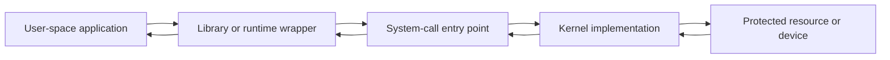
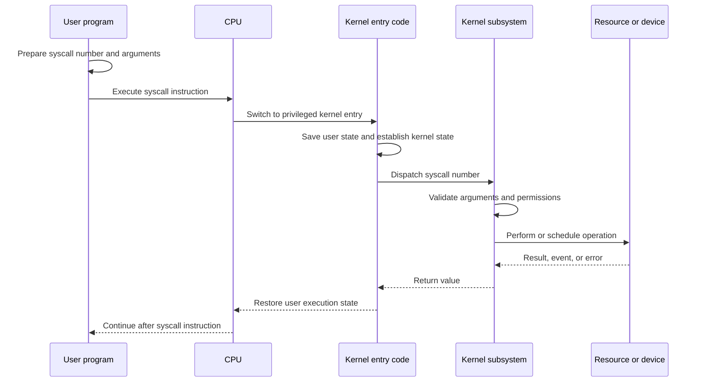
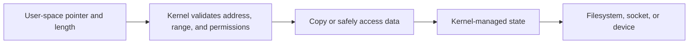
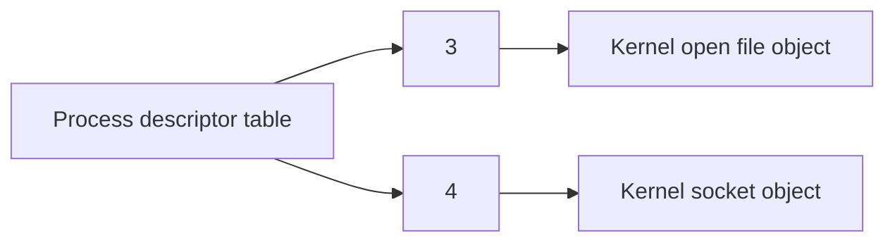

> Stage 2 — Linux and Operating System Internals  
> Subject area 2.1 — The Operating System Model  
> Article 2

## The short version

A system call is a controlled entry point through which a user-space program asks the kernel to perform a privileged operation. A useful way to picture it is as a gate between user space and the kernel. The program puts in a number and arguments, the CPU switches to privileged mode, the kernel checks permissions and the user pointers, does the work or schedules it, and returns a result or an error.

Opening a file, creating a process, allocating a memory mapping, or reading from a socket all go through this gate. The boundary matters because it connects ordinary backend code to protected state, and the kernel cannot trust the pointers, lengths, or file descriptors it is given. For a backend, whether a `read` returns 0, a short count, or `-1` with `EAGAIN` decides whether an HTTP handler sees end of file, needs to retry, or should apply backpressure.


## Where this article fits

The previous article gave the OS model overview. This article explains the *mechanism* that implements it.

**Prerequisites:** What the Operating System Provides — the services that need a gate.  
**Next:** Linux Processes and Lifecycle — the resource that uses those gates to be created.

Later articles will explain the resources that system calls operate on: processes, memory, files, sockets, devices, and scheduling. This article gives us the common path they share.

> Platform note: Register details use **Linux x86-64** as example (`rax` number, `rdi/rsi/rdx/r10/r8/r9` args). ARM64 uses `x8` for number, `x0-x5` for args and `svc` instruction; macOS/Windows use different numbers. The *validated gate* idea is the same.

## Why a program cannot simply call the kernel's functions

The kernel runs with privileges that ordinary programs do not have. It can change page tables, access device registers, schedule processes, inspect protected memory, and modify filesystem state.

If any program could call arbitrary kernel functions or write directly to kernel memory, one buggy or malicious program could take control of the machine or corrupt every other process. The operating system therefore exposes a narrow, documented interface instead of allowing user code to call internal kernel functions directly.



The system-call interface is a contract. It defines the operation number, argument meaning, return-value rules, error behavior, and sometimes blocking or ordering behavior.

## A system call is not the same as a library function

Many programs call library functions rather than writing system-call instructions directly. A library function may:

- Call one system call
- Combine several system calls
- Add buffering
- Convert data types
- Retry an interrupted operation
- Validate arguments at the library level
- Implement behavior entirely in user space

For example, `printf` is a library function. It formats values and may buffer the result before eventually using a `write` system call. `fopen` is a C library function that parses the path and mode before using lower-level file operations. `memcpy` normally does not need a system call at all because it copies data within the process's own memory.

```text
Application calls printf
        ↓
C library formats and buffers text
        ↓
Library eventually calls write
        ↓
Kernel validates the file descriptor and buffer
        ↓
Kernel writes to a file, pipe, terminal, or socket
```

This distinction matters when counting system calls or measuring performance. A program may execute many library calls while making few system calls, or one high-level operation may cause many system calls.

## The general system-call path

The exact implementation depends on the operating system and architecture, but the path usually looks like this:



The operation may complete immediately, or the process may block while waiting for a device, file, socket, lock, timer, or another event. If it blocks, the scheduler can run another thread or process while this one waits.

## The user/kernel transition

The processor has privilege modes. User-mode code is restricted. Kernel-mode code can perform privileged operations and access protected kernel state.

On Linux x86-64, a user program commonly enters the kernel with the `syscall` instruction. The instruction transfers control to an address configured by the kernel and changes the processor's execution mode. Kernel entry code saves enough user state to return later and switches to a safe kernel stack.

The transition is not the same as a normal function call. A normal call changes the instruction pointer within the current process and privilege level. A system call crosses a protection boundary, requires state handling and validation, and may interact with the scheduler or hardware.

On Linux x86-64, the conventional raw syscall register arrangement is:

| Meaning | Register |
| --- | --- |
| System-call number | `rax` |
| First argument | `rdi` |
| Second argument | `rsi` |
| Third argument | `rdx` |
| Fourth argument | `r10` |
| Fifth argument | `r8` |
| Sixth argument | `r9` |
| Return value | `rax` |

The `syscall` instruction also has architecture-specific effects on registers such as `rcx` and `r11`. These details are part of the Linux x86-64 ABI and should not be copied blindly to ARM64, another operating system, or a language-level function call.

The important concept is not memorizing every register. It is understanding that the system-call ABI is a binary contract between user-space code and the kernel.

## System-call numbers

The kernel needs to know which operation the program is requesting. A system-call number identifies the operation in the ABI.

For example, Linux assigns numbers to operations such as `read`, `write`, `openat`, `mmap`, and `exit`. The numbers are architecture-specific. The number for a syscall on x86-64 may not be the same on another architecture.

Libraries and language runtimes normally hide these numbers behind names. Direct code that places a number into a register is tightly coupled to a specific operating system and architecture.

```text
System-call number + arguments
        ↓
Kernel dispatch table
        ↓
Implementation for that operation
```

The dispatch table is an internal kernel mechanism that maps the requested number to the appropriate handler. A user program should normally use the documented library or syscall interface rather than depending on kernel-internal function addresses.

## Arguments cross a trust boundary

System-call arguments come from user space, so the kernel must treat them as untrusted input. This includes integers, file descriptors, flags, pointers, lengths, paths, structures, and arrays.

Consider a call that asks the kernel to read data into a user-provided buffer. The kernel must determine whether:

- The pointer refers to an address in the process's allowed address space
- The requested length is valid
- The memory is writable by the process
- The range is large enough for the operation
- The file descriptor refers to a valid readable object
- The operation is permitted for the process's identity

The kernel cannot simply dereference the pointer as if it were kernel memory. It uses safe access mechanisms to copy data between user and kernel memory or to validate a mapping before accessing it.



A malicious program may pass an invalid pointer intentionally. A normal program may pass one accidentally because of a bug. The kernel must handle both cases without crashing or exposing protected data.

## Pointers can change while the kernel works

A pointer is not a permanent promise that the memory will remain unchanged. A multithreaded program may modify memory while another thread is making a system call. A signal handler or another operation may change state. A page may become unavailable or have its permissions changed.

The kernel must structure its access carefully. It may copy data into kernel-owned memory before using it, validate again at the point of access, or use synchronization that prevents unsafe changes.

This is one reason system-call interfaces use explicit sizes and carefully defined structures. The kernel needs to know how much data it may read or write and how to handle changes safely.

## Return values and errors

A system call returns a value that describes success or failure. The meaning depends on the particular call.

For `read`:

- A positive value means that many bytes were read.
- `0` means end-of-file for a regular file or an orderly stream close for many sockets.
- `-1` from the C library wrapper indicates an error, with details available through `errno`.

For `write`:

- A positive value means that many bytes were accepted, which may be less than requested.
- `-1` indicates an error through the library interface.

For process creation, the return value may identify the child or distinguish parent and child execution. For `mmap`, the return value is an address on success or a failure indication. The contract is specific to each call.

The raw kernel convention and the C library convention are related but not identical. On Linux, a raw syscall commonly returns a negative error number in the range reserved for errors. The C library wrapper converts that into `-1` and stores the positive error number in `errno`.

Applications should use the documented wrapper or language API unless they have a specific reason to call the raw syscall interface.

## `read` and `write` are not guaranteed to process everything

A common beginner mistake is assuming that one `read` fills the entire requested buffer or one `write` sends all requested bytes.

The kernel may return a short result because only some data is available, a pipe or socket has limited space, a signal interrupted the operation, or the underlying object has a boundary or limit.

```c
ssize_t total = 0;

while (total < wanted) {
    ssize_t n = read(fd, buffer + total, wanted - total);

    if (n > 0) {
        total += n;
        continue;
    }

    if (n == 0) {
        break; // End-of-file or orderly stream close.
    }

    if (errno == EINTR) {
        continue; // Retry if the operation was interrupted.
    }

    return -1; // A real error occurred.
}
```

This loop is only an example. Non-blocking descriptors, cancellation, deadlines, and application-level message framing require additional decisions. The important lesson is that the return value describes what happened, not what the caller hoped would happen.

## Blocking system calls

A blocking operation waits until it can make progress or until it fails. A blocking `read` may wait for data. A blocking `write` may wait for buffer space. A blocking `accept` may wait for a new connection. A blocking lock operation may wait for ownership.

When a thread blocks, the operating system can mark it as waiting and schedule other runnable work. Blocking is not automatically inefficient. It can be a simple and effective model when the number of concurrent operations is manageable.

The problem appears when a system holds too many resources while waiting. A request thread that waits for a slow dependency may keep memory, a connection, a transaction, and a queue slot. Enough blocked requests can exhaust the service even when CPU usage is low.

Later networking articles will compare blocking, non-blocking, and event-driven I/O.

## Interrupted system calls

A signal can interrupt a system call while it is waiting. Depending on the operation and signal behavior, the call may return an error such as `EINTR`, or it may be automatically restarted by the library or kernel configuration.

Code must follow the contract for the specific call. Blindly retrying every interrupted operation can be wrong if the operation has side effects or if the caller's deadline has expired.

For a read that has not produced data, retrying may be reasonable. For an operation that may have partially completed, the program must inspect the result and avoid duplicating effects.

This is another example of why errors are part of the interface. A return value does not only say “success” or “failure”; it may describe how far the operation progressed.

## A concrete example: `write`

Suppose a program wants to write text to standard output.

At the application level, it may call:

```c
const char message[] = "hello\n";
write(STDOUT_FILENO, message, sizeof message - 1);
```

The program supplies:

- A file descriptor identifying standard output
- A pointer to the bytes
- The number of bytes it wants to write

The library or compiler exposes the call according to the platform's ABI. The kernel checks the descriptor, validates that the user buffer can be read, and routes the data to the object behind the descriptor. That object could be a terminal, pipe, regular file, socket, or redirected output.

The system call does not need to know that the application thinks of the destination as “the screen.” It operates on the kernel-managed object represented by the descriptor.

## File descriptors are capabilities within a process

A file descriptor is a small process-local handle referring to a kernel-managed open object. It may refer to a file, socket, pipe, device, or another resource with a file-like interface.

The descriptor is meaningful in the process that owns it. Another process cannot use the same integer as if it automatically referred to the same object. Descriptors can be inherited across process creation, duplicated, or passed to another process through a special IPC mechanism.



This model explains why closing a descriptor changes what later operations can do and why descriptor leaks eventually cause new system calls to fail.

## Common system-call families

System calls are often grouped by the resource or service they manage.

### Process and thread operations

These include creating, replacing, waiting for, and terminating execution. Linux calls such as `clone`, `fork`, `execve`, `wait4`, and `exit` participate in process lifecycle behavior.

### File and filesystem operations

These include opening paths, reading, writing, seeking, syncing, changing metadata, creating directories, and removing names. Examples include `openat`, `read`, `write`, `lseek`, `fsync`, `stat`, and `rename`.

### Memory operations

These include creating mappings, changing permissions, unmapping regions, and advising the kernel about memory usage. Examples include `mmap`, `munmap`, `mprotect`, and `madvise`.

### Networking operations

These include creating sockets, binding addresses, listening, accepting connections, connecting, sending, receiving, and changing socket options. Some systems expose separate calls; others combine operations through interfaces such as `socketcall` or related APIs.

### Information and synchronization

These include reading clocks, waiting for events, changing scheduling properties, locking, and querying process or resource state.

The names and exact interfaces vary by operating system. The common pattern is a request to the kernel for a protected service.

## Observing system calls with `strace`

`strace` traces system calls made by a process on Linux. It can show the call name, arguments, return value, and timing information.

For a simple program:

```bash
strace ./program
```

A shortened trace might look like:

```text
openat(AT_FDCWD, "message.txt", O_RDONLY) = 3
read(3, "hello\n", 4096)                  = 6
close(3)                                  = 0
write(1, "hello\n", 6)                   = 6
exit_group(0)                             = ?
```

The exact output depends on the program and system. The trace shows several important facts:

- The library opened a path and received descriptor 3.
- The process read 6 bytes from that descriptor.
- It closed the descriptor.
- It wrote 6 bytes to descriptor 1, standard output.
- The process exited.

Tracing is useful because it reveals what a program actually asks the kernel to do. It can show unexpected file access, repeated operations, blocking calls, permission errors, and descriptor leaks.

It also has overhead and may expose sensitive arguments. It should be used carefully in production.

## System-call cost

A system call costs more than a normal in-process function call because it crosses a privilege boundary, saves and restores state, validates arguments, and may interact with kernel data structures or devices.

The cost depends on the operation. A call that returns from a cache may be much cheaper than one that waits for storage. A system call that blocks can involve scheduling and wake-up work. A call that transfers a large buffer may spend most of its time copying data rather than entering the kernel.

Reducing system-call count can help when calls are small and frequent. Common techniques include:

- Buffering small writes
- Batching operations
- Reading or writing larger chunks
- Using vector operations
- Reusing connections and descriptors
- Using memory mappings where appropriate
- Using event-driven interfaces for many sockets

Fewer system calls are not always better. A large batch may increase latency or memory use. A memory mapping may make access convenient but introduce page faults and difficult lifetime behavior. The optimization must fit the workload.

## A system call does not always mean a context switch

People often say that every system call causes a context switch. That is not precise.

A system call does cause a transition from user mode to kernel mode and back. A context switch usually means changing the currently running thread or process, including saving one execution context and restoring another.

If a system call completes immediately, the same thread may enter the kernel and return without another thread running. If the call blocks, the scheduler may switch to another runnable thread or process. The two concepts are related but different.

This distinction matters when measuring performance. Privilege-transition cost and scheduling cost are separate parts of the path.

## Security at the system-call boundary

The system-call interface is a security boundary because it gives user-space code access to operations that affect shared or privileged state.

The kernel must check:

- The process identity
- The requested operation
- File and device permissions
- Pointer validity
- Buffer lengths
- Flags and modes
- Resource limits
- Namespace or sandbox restrictions
- Whether the operation is allowed in the current context

A bug in argument validation can be more serious than an application crash because it may allow a user program to read protected data, corrupt kernel state, or gain privileges.

System-call filtering tools such as seccomp can restrict which calls a process may make. Sandboxes and containers use several mechanisms together to limit what a process can see and do. These topics will be covered in the security and container stages.

## A realistic production example

Imagine a service that has low CPU usage but cannot keep up with incoming requests. Tracing shows that each request opens several files, performs many small reads, and repeatedly asks the kernel for status information. The storage device is not fully saturated, but the process spends time making system calls and waiting for small operations.

The team considers several changes:

1. Buffer small reads into larger operations.
2. Reuse open descriptors where the lifetime allows it.
3. Cache metadata that is stable enough to reuse.
4. Batch status checks.
5. Measure whether the workload is actually storage-bound or syscall-overhead-bound.

After batching, CPU usage may increase slightly because more data is processed per operation, while request latency and throughput improve. The team still needs limits so buffering does not create unbounded memory usage.

The important lesson is not “always reduce syscalls.” It is that system-call traces can reveal the real interaction between application code and the kernel, and that the correct optimization depends on the operation's resource behavior.

## How experienced engineers reason about system calls

When an operation behaves unexpectedly, experienced engineers ask:

- Which system call or library operation is involved?
- Is the library making more calls than expected?
- What arguments and buffers cross the boundary?
- What does the return value actually mean?
- Can the call return a partial result?
- Can it block or be interrupted?
- Which resource or permission can make it fail?
- Does the call create or consume a handle?
- Does it affect persistent or external state?
- Is the behavior portable or platform-specific?

They use the highest-level explanation that remains accurate, then inspect lower layers when the abstraction no longer explains the result. `strace`, a debugger, metrics, logs, and source code can each answer different parts of the question.

## Interview definitions

### What is a system call?

> A system call is a controlled entry point that lets a user-space program request a service from the privileged operating-system kernel.

### Why are system calls needed?

> Programs need system calls to perform operations that require kernel-managed resources or privileges, such as accessing files, creating processes, using sockets, and managing memory mappings.

### What happens during a system call?

> The program prepares a syscall number and arguments, enters the kernel through a protected CPU transition, and the kernel validates the request, performs or schedules the operation, and returns a result or error.

### What is the difference between a system call and a library call?

> A library call stays in user space unless it chooses to enter the kernel. A system call crosses into the privileged kernel. A library function may wrap one system call, combine several, add buffering, or perform its work entirely in user space.

### Why does the kernel validate user pointers?

> User pointers may be invalid, point outside the process, have the wrong permissions, or be deliberately malicious. Validation prevents crashes, memory corruption, and unauthorized access to kernel state.

### What is a short read or short write?

> A short read or write is a successful operation that transfers fewer bytes than requested. The caller must use the returned count and continue or finish according to the operation's contract.

## Interview follow-up questions

### Does every system call cause a context switch?

> Every system call crosses from user mode to kernel mode, but it does not necessarily switch to another thread or process. A context switch may happen if the call blocks or the scheduler makes another decision.

### Why can a system call block?

> It can block when the requested resource is not ready, such as data not yet arriving on a socket, space not being available in a buffer, a lock being held, or storage I/O still being in progress.

### How does `errno` work?

> In the common C library interface, a failing wrapper returns `-1` and stores an error number in thread-local `errno`. The caller must inspect it according to the specific call's contract and should not assume every error is retryable.

### Why can `read` return fewer bytes than requested?

> The available data may be smaller than the requested amount, the source may reach end-of-file, a stream may deliver data incrementally, or an interruption may occur. The return value tells the caller how much was actually transferred.

### How would you reduce system-call overhead?

> I would first measure the call pattern. Depending on the workload, I might buffer or batch small operations, reuse descriptors, use vector I/O, reduce unnecessary metadata calls, or choose an appropriate event-driven interface. I would verify that the change does not increase memory, latency, or failure complexity.

### Why is the system-call boundary important for security?

> It is where untrusted user-space input becomes a request to modify protected or shared state. The kernel must validate arguments, identity, permissions, and resource limits before performing the operation.

## Common misconceptions

### “Every library function is a system call.”

Many library functions are entirely user-space operations. Others call the kernel only when needed or buffer multiple application operations into fewer system calls.

### “A successful system call completed all requested work.”

Some calls return partial progress. A successful return may mean that only part of a buffer was read or written, or that an operation was accepted for later processing.

### “A system call is just a slow function call.”

A system call crosses a privilege boundary, requires validation, and may interact with kernel state, devices, scheduling, and blocking behavior. Its cost and semantics are different from an ordinary function call.

### “The kernel can trust pointers from a process.”

Pointers and lengths come from user space and must be treated as untrusted input. They may be invalid or intentionally crafted.

### “If a call timed out, the operation did not happen.”

A timeout tells the caller that no result arrived before the deadline. The operation may still have completed remotely or may continue after the caller stops waiting.

## Summary

A system call is the protected path from user-space code to kernel-managed services. The program supplies a syscall number and arguments, the processor enters privileged kernel code, and the kernel validates, performs, or schedules the operation before returning a result.

System calls have precise contracts around arguments, pointers, lengths, return values, partial progress, blocking, interruption, and errors. The C library or language runtime may wrap those calls with buffering, conversion, retries, or higher-level behavior.

The system-call boundary is both a performance boundary and a security boundary. It can introduce transition and validation costs, and it must prevent untrusted programs from corrupting protected state. Understanding the boundary makes tools such as `strace` much more useful and prepares us to study processes, files, memory, networking, and devices in detail.

## If you want to build this later

Build a small Linux system-call observability tool.

Start with a program that opens a file, reads it in chunks, writes the data to standard output, and closes the file. Trace it with `strace` and compare the source-level operations with the actual calls. Then add buffering, change the chunk size, introduce an error path, and observe how the trace changes.

The goal is to see the difference between library code and kernel requests, understand return values and cleanup, and connect system-call count with performance and resource behavior.
