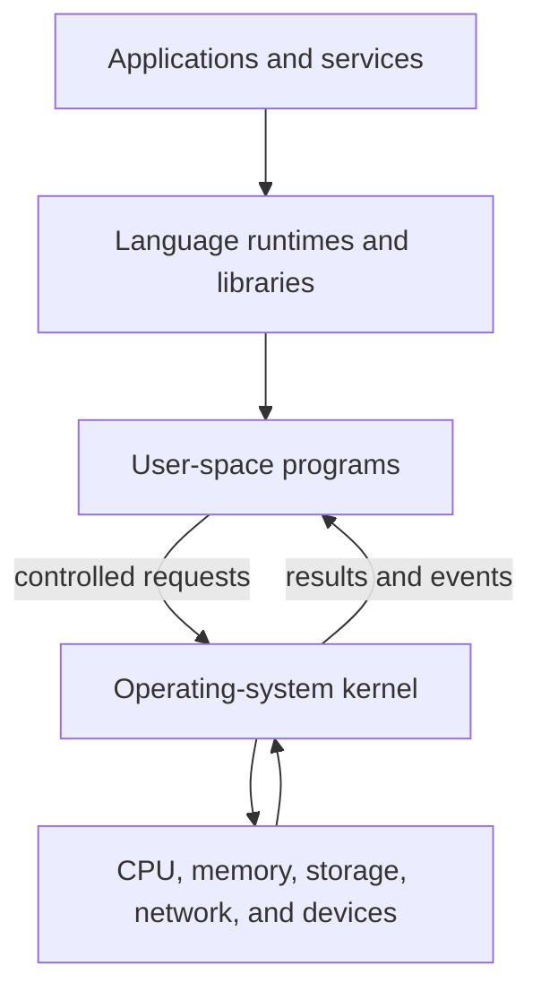
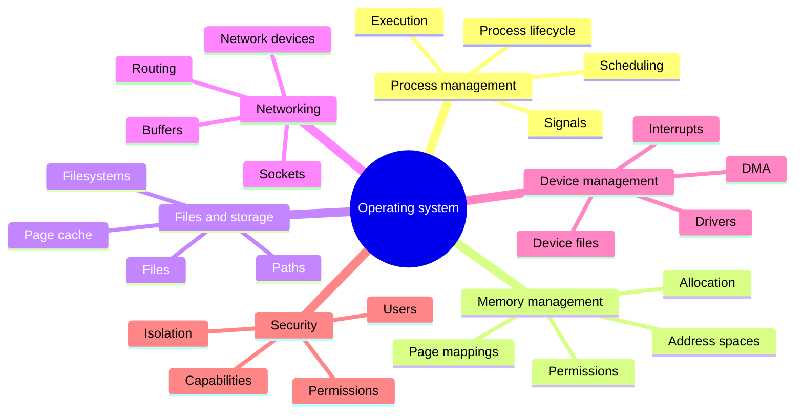
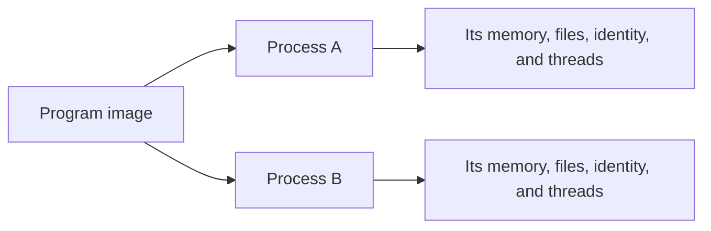
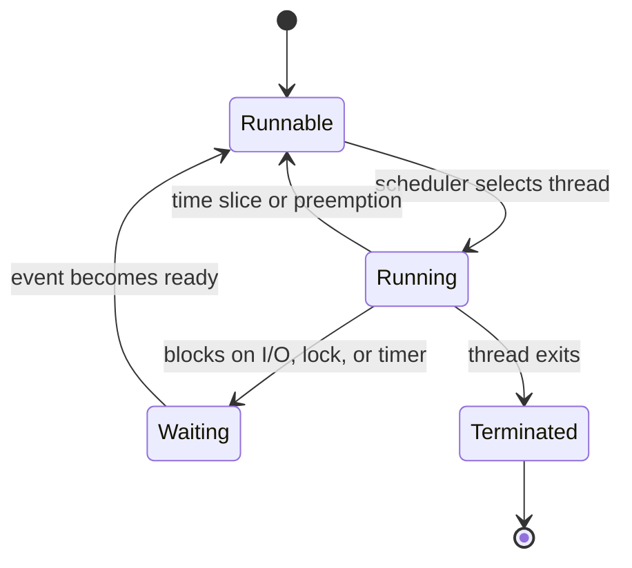
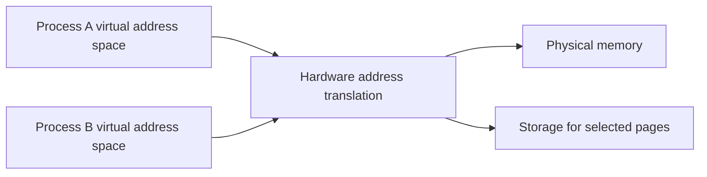
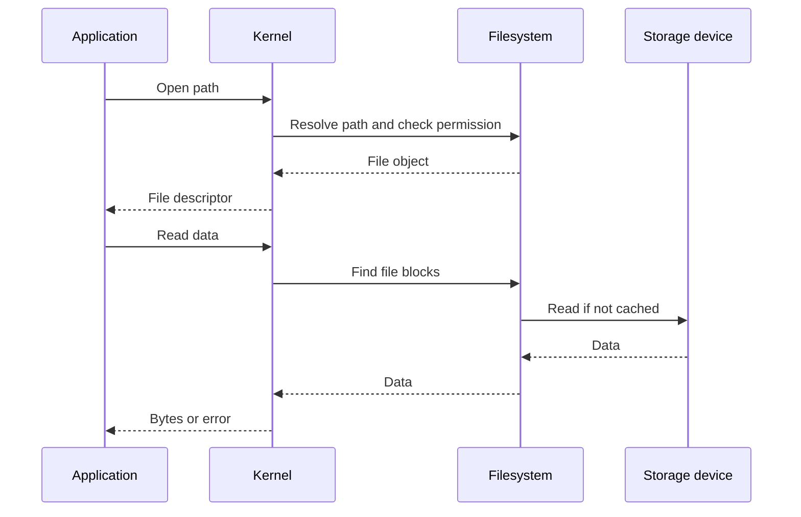
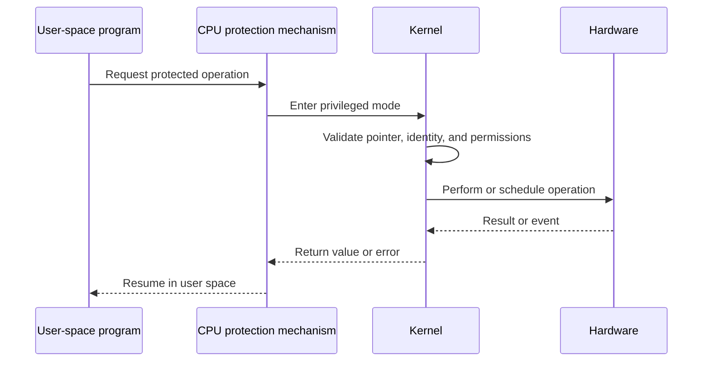

> Stage 2 — Linux and Operating System Internals  
> Subject area 2.1 — The Operating System Model  
> Article 1

## The short version

An operating system is the software layer that manages hardware and provides controlled services to programs. It decides how processes use CPU time, how memory is mapped and protected, how files and devices are accessed, how network communication is handled, and which operations each program is allowed to perform.

The operating system does not make the hardware unlimited or failure-free. It provides abstractions that make hardware usable, isolation that prevents programs from interfering with one another, and policies that control how shared resources are allocated.

Most application code does not interact with hardware directly. It asks the operating system, usually through a library or runtime, to perform operations such as creating a process, opening a file, allocating memory, sending data, or communicating with a device.

## Where this article fits

This is the first article in Stage 2, where the roadmap moves from general systems thinking to the concrete behavior of operating systems.

The next article will explain system calls in detail. Later articles will examine processes, signals, scheduling, memory mappings, filesystems, devices, and Linux resource limits. This article introduces the responsibilities of the operating system so those mechanisms have a clear place in the overall model.

## The operating system sits between programs and hardware

A computer contains hardware that can execute instructions, store bits, move data, and communicate with devices. Hardware alone does not provide the policies needed to run many independent programs safely.

The operating system supplies those policies and interfaces.



User space is the part of the system where ordinary programs run. Kernel space is the privileged part where the operating-system kernel runs. The distinction is not simply about where files are stored. It is a protection boundary enforced by the processor and operating system.

An application cannot normally execute privileged instructions, change another process's page tables, or program a device directly. It must request those operations through an operating-system interface. The kernel checks the request, performs the operation if allowed, and returns a result or error.

## Why programs need an operating system

Without an operating system, a program could theoretically control the hardware directly. That can be appropriate for a small embedded program with one purpose, but it becomes difficult when several programs need to share the same machine.

The operating system solves several problems at once:

- It gives each program a controlled execution environment.
- It shares the CPU between runnable work.
- It maps and protects memory.
- It provides common interfaces for storage and devices.
- It moves network data between programs and interfaces.
- It checks permissions and separates trust levels.
- It tracks resources and enforces limits.
- It handles hardware events and interrupts.
- It provides mechanisms for programs to communicate.

The operating system is therefore both a resource manager and a protection system. These roles are connected. Sharing a resource safely requires controlling who can access it and how much they can consume.

## The main services of an operating system

The exact design differs between Linux, Windows, macOS, and other systems, but the major responsibilities are similar.



These services are not independent. A network socket is represented through file-descriptor-like state. A process has a virtual address space. A file read may use memory for caching and CPU time for copying data. Security checks can affect access to files, processes, devices, and network operations.

## Process management

A process is a running program together with its execution state and resources. The program is the code and data stored in an executable. The process is the operating system's managed instance of that program while it runs.

The operating system gives a process:

- An address space
- One or more threads of execution
- Open file and socket references
- Environment variables and arguments
- Identity and permissions
- Resource limits
- Signal state
- Scheduling state

Two processes can run the same executable but have different arguments, environment variables, open files, memory contents, and permissions.



The operating system creates, schedules, pauses, resumes, and terminates processes. It also provides ways for processes to communicate and for a parent to observe a child's exit.

The process is an important isolation boundary, but it is not the smallest unit of execution. Threads inside the same process share much of the process's memory and resources. The process and thread articles will separate those concepts carefully.

## CPU management and scheduling

The CPU can execute only a limited amount of work at one time. The operating system scheduler chooses which runnable thread should execute on which processor.

When a thread is waiting for a file, network operation, lock, or timer, it may not need CPU time. The scheduler can run another thread instead. When the operation becomes ready, the waiting thread can become runnable again.



Scheduling is not only about fairness. It affects latency, throughput, priorities, CPU affinity, cache locality, and behavior under overload. A process may have enough total CPU capacity but still experience delays because its threads are waiting behind other work or competing for a lock.

Later articles will explain context switches, scheduling policies, priorities, affinity, and the cost of too much concurrency.

## Memory management

The operating system gives each process a virtual address space. A virtual address is an address used by a process. The operating system and hardware translate it to a physical memory location or identify that the page is not currently available.

This gives processes the impression that they own a large, private memory space even though physical memory is shared.



The operating system uses memory protection to prevent a process from normally reading or writing another process's memory. It also marks regions as readable, writable, or executable and manages page faults when a process accesses a page that needs operating-system attention.

Memory management includes more than giving programs bytes. It includes:

- Creating and destroying address spaces
- Mapping code, data, stacks, heaps, and shared libraries
- Enforcing page permissions
- Sharing pages when safe
- Reclaiming memory under pressure
- Handling page faults
- Accounting for memory usage
- Protecting the kernel from user programs

Virtual memory, page tables, address translation, and page faults will receive separate deep articles because they are central systems concepts.

## Files, filesystems, and storage

The operating system provides a file interface so programs can store and retrieve data without managing the physical layout of every storage device directly.

A file is a named object with data and metadata. A filesystem organizes files, directories, permissions, timestamps, and storage allocation. The operating system resolves a path, checks access, finds the relevant filesystem objects, and moves data through the page cache or storage device.



The file abstraction hides physical details, but storage latency, caching, durability, permissions, and filesystem semantics can still affect the program.

The operating system also exposes devices through drivers and interfaces. A device driver translates general operating-system operations into commands understood by a particular device. Drivers may manage interrupts, DMA, queues, and device-specific errors.

## Networking

The operating system provides networking interfaces so programs can communicate without controlling the network card directly. Applications usually use sockets. A socket represents one endpoint of a communication channel managed by the kernel.

The kernel handles or coordinates many network tasks:

- Creating and tracking sockets
- Managing send and receive buffers
- Connecting ports and addresses
- Routing packets
- Applying firewall rules
- Handling retransmission for reliable protocols such as TCP
- Delivering received data to the correct process
- Interacting with network devices

```text
Application
    ↓ socket API
Kernel networking stack
    ↓ driver
Network interface
    ↓
Physical or virtual network
```

The network interface is another shared resource. Many processes may send data through it, and buffers can fill when applications produce data faster than the network or receiver can accept it.

The socket and networking articles will later explain connection state, TCP segments, UDP datagrams, event-driven I/O, and the relationship between kernel buffers and application buffers.

## Device management

Hardware devices differ widely. A storage device, keyboard, network card, GPU, and sensor do not expose the same operations. The operating system uses device drivers to provide a common interface where possible and device-specific behavior where necessary.

A driver may manage:

- Device initialization
- Register access
- Interrupts
- DMA transfers
- Request queues
- Device state
- Error recovery
- Power management

DMA, or direct memory access, allows a device to transfer data to or from memory without requiring the CPU to copy every byte itself. The operating system must still configure the transfer, protect memory, and handle completion or failure.

Devices can be represented through special files or other operating-system interfaces. The representation is an abstraction, not proof that the device behaves exactly like a regular disk file. Device operations may have different blocking, error, and ordering behavior.

## Security and protection

The operating system enforces boundaries between users, processes, devices, and privileged operations.

Important security mechanisms include:

- User and group identity
- File permissions
- Access-control lists
- Capabilities
- Process isolation
- Memory permissions
- Privilege levels
- Sandboxing
- Resource limits
- Security modules and audit records

Authentication answers who a user or process is. Authorization answers what that identity is allowed to do. The operating system participates mainly in enforcing authorization for local resources, although applications and services often implement their own authorization rules.

A process may have permission to open one file but not another. It may be able to create a network connection but not bind to a privileged port. It may be prevented from accessing another process's memory even if it knows the address.

Security checks are part of normal operating-system behavior. They can also add cost and create failure paths that applications must handle.

## User space and kernel space

User space is the restricted execution environment for ordinary programs. Kernel space is the privileged environment for the operating-system kernel and trusted kernel components.

The CPU has modes that control which instructions and memory regions code may access. When a user-space program needs a privileged service, it performs a system-call transition. The processor changes execution mode, the kernel validates the request, performs or starts the operation, and then returns to user space.



The kernel must treat user-space input as untrusted, even when the program is running under the same user account. Pointers may be invalid, lengths may be malicious, and memory may change while the kernel is checking or using it. System-call validation is therefore both a correctness and security responsibility.

The next article will focus on system calls and explain arguments, return values, transitions, validation, and common examples in detail.

## Resource management and accounting

The operating system must track resources so that it can enforce limits and make scheduling decisions. It records information about processes, threads, open files, memory mappings, sockets, users, and devices.

Resource accounting can answer questions such as:

- How much CPU time did a process use?
- How much memory is resident?
- How many file descriptors are open?
- Which process owns a socket?
- Which user opened a file?
- How many processes are in a control group?

Accounting supports debugging and operations, but it also has limits. A process's memory usage may include shared pages. A connection may consume resources in several processes and devices. A service's total database connections may be the sum of many process-local pools.

The numbers are useful when interpreted in the right scope.

## Interprocess communication

Processes are isolated by default, but real systems need them to cooperate. The operating system provides interprocess communication mechanisms such as:

- Pipes
- Signals
- Unix domain sockets
- Network sockets
- Shared memory
- Message queues
- File-based coordination

Each mechanism makes different tradeoffs around copying, ordering, buffering, failure, and security.

For example, a pipe carries a byte stream between processes. Shared memory can avoid copying large data but requires synchronization and careful ownership. A Unix domain socket can provide local message communication and pass file descriptors.

IPC is another place where the operating system is both a provider and a boundary. The processes must agree on a protocol, and each process must handle the other process disappearing or sending invalid data.

## The operating system is not the same as the kernel

The kernel is the privileged core that manages hardware, memory, processes, filesystems, networking, and security mechanisms. An operating system distribution includes much more:

```text
Operating system environment
├── Kernel
├── System libraries
├── Init and service manager
├── Shells and command-line tools
├── Device management
├── Filesystem utilities
├── Network utilities
├── Package management
└── Applications and services
```

When engineers say “Linux,” they may mean the Linux kernel, a complete Linux distribution, or the environment inside a container. Those are related but not identical.

The kernel provides the core mechanisms. User-space libraries and tools provide convenient interfaces and operational behavior on top of them.

## A request crosses multiple layers

Consider an application reading a file:

```text
Application function
    ↓
Language runtime or standard library
    ↓
System-call interface
    ↓
Kernel file and filesystem code
    ↓
Device driver
    ↓
Storage device
```

Each layer has its own contract and failure modes. The application may receive an error from the library. The library may have translated an operating-system error. The kernel may have returned data from the page cache without touching the device. The device may have reported an I/O error.

When debugging, the engineer may need to identify which layer produced the observed behavior. A high-level error message often does not reveal the complete path.

## A realistic production example

Imagine a service that cannot accept new client connections. The application reports a generic “server busy” error.

The investigation finds that the CPU is only moderately used and memory is available. The process has reached its file-descriptor limit because a code path failed to close connections after a protocol error. The kernel is still healthy, but the process cannot create the descriptors required for new sockets.

The operating system provided the limit and returned the failure. The application was responsible for closing resources and exposing enough metrics to identify the leak.

The fix is not simply to increase the limit. The team should close the connection on every path, add tests for protocol errors, monitor descriptor usage, and choose a limit that provides enough capacity without hiding future leaks.

This example shows why the operating system and application share responsibility. The kernel enforces a boundary. The application must behave correctly within it.

## How experienced engineers use the operating-system model

When an application behaves strangely, experienced engineers place the symptom in the operating-system model.

They ask:

- Is the process running, blocked, or stopped?
- Is the thread waiting for CPU, a lock, a file, or a network event?
- Is the memory mapped and resident?
- Is the file operation using the page cache or the storage device?
- Is the socket connected, buffered, or waiting for the peer?
- Which identity and permissions apply?
- Which resource limit could be involved?
- Did the request cross into the kernel or another machine?
- Which layer produced the error?

They then choose a tool that can observe the relevant layer: process inspection, system-call tracing, memory statistics, filesystem tools, socket inspection, packet capture, or a debugger.

The model is not a substitute for evidence. It tells the engineer where to look.

## Interview definitions

### What does an operating system provide?

> An operating system manages hardware resources and provides controlled interfaces for programs to use CPU, memory, storage, networking, devices, and interprocess communication.

### What is the kernel?

> The kernel is the privileged core of the operating system that manages hardware, processes, memory, filesystems, networking, and protection mechanisms.

### What is a process?

> A process is a running program together with its address space, execution state, identity, and operating-system-managed resources.

### What is user space?

> User space is the restricted environment where ordinary programs run without direct access to privileged instructions or protected kernel state.

### What is kernel space?

> Kernel space is the privileged execution environment where the operating-system kernel manages hardware and provides protected services to user-space programs.

### What is a system call?

> A system call is a controlled entry point that allows a user-space program to request a service from the kernel.

### Why does the operating system provide abstractions?

> It provides abstractions so programs can use common interfaces for resources without managing every hardware detail directly, while still enforcing protection, sharing, and resource limits.

## Interview follow-up questions

### Why can an application not access hardware directly?

> Direct access would allow one program to interfere with other programs, corrupt shared state, or bypass security checks. The operating system provides controlled interfaces that validate requests and coordinate access to shared hardware.

### What is the difference between a process and a program?

> A program is the code and data stored in an executable. A process is a running instance of that program with its own execution state, address space, identity, and resources.

### What happens when a program needs a privileged operation?

> It enters the kernel through a system call. The kernel validates the arguments and permissions, performs or schedules the operation, and returns a result or error to user space.

### Why does the kernel validate system-call arguments?

> User-space pointers and lengths cannot be trusted. They may be invalid, point outside the process, change during the operation, or be deliberately crafted to bypass checks. Validation protects correctness and the kernel's security boundary.

### Is the kernel the entire operating system?

> No. The kernel is the privileged core. A complete operating-system environment also includes system libraries, service managers, shells, device tools, package management, and other user-space programs.

### Why can a file read be fast sometimes and slow at other times?

> The data may already be in the kernel's page cache, or the system may need to read it from storage. Memory pressure, storage load, filesystem behavior, and concurrent access can also change the latency.

## Common misconceptions

### “The operating system only manages CPU and memory.”

It also manages files, storage, network interfaces, devices, security, process communication, timers, resource limits, and many other shared services.

### “A process is just a program currently running.”

A process includes execution state, an address space, identity, open resources, limits, and relationships with other processes.

### “Kernel space is just another folder.”

Kernel space is a privileged execution environment protected by the processor and operating system. It is not a directory or ordinary storage location.

### “A system call is the same as a normal function call.”

A normal function call stays within the current process and privilege level. A system call crosses from user space into the privileged kernel and follows a different validation and execution path.

### “The operating system hides all hardware behavior.”

It hides many details through abstractions, but hardware latency, device errors, cache behavior, capacity limits, and ordering guarantees can still affect programs.

### “If the kernel reclaims resources after a crash, application cleanup does not matter.”

The kernel can reclaim many local resources, but it cannot undo every external effect. Persistent data, messages, remote requests, and distributed state still need application-level recovery.

## Summary

The operating system is the layer that manages shared hardware and provides controlled services to programs. It manages processes, scheduling, memory, files, storage, networking, devices, security, resource limits, and interprocess communication.

User space and kernel space form an important protection boundary. Programs request privileged operations through system calls, and the kernel validates those requests before accessing protected state or hardware.

The operating system provides useful abstractions, but the details underneath can still affect correctness, performance, security, and failure behavior. When debugging a system, place the symptom in the operating-system model and identify which layer is responsible for the observed result.

## If you want to build this later

Build a small Linux process-inspection tool that reports the operating-system resources of a target process.

Start with the process ID and command line. Then read information from `/proc` such as memory usage, open file descriptors, CPU time, and status. Add a mode that watches the process over time and reports changes.

The goal is not to recreate every feature of `ps` or `top`. It is to connect an ordinary process to the operating-system services introduced in this article and prepare for the deeper articles about system calls, processes, memory, files, and resource limits.
