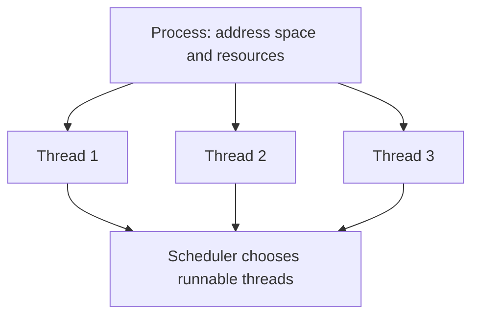
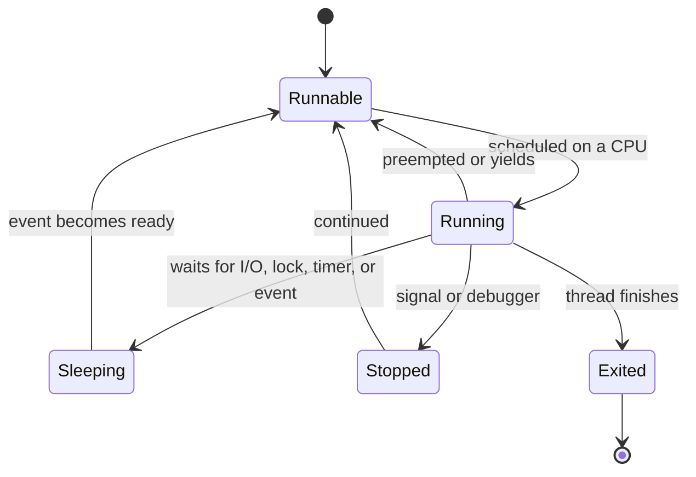
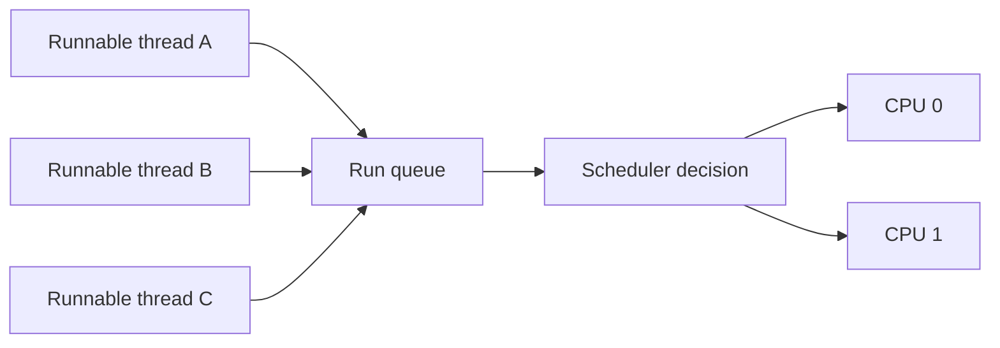
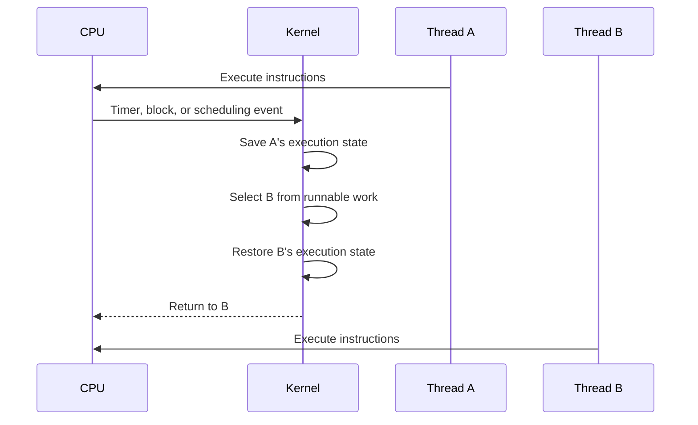
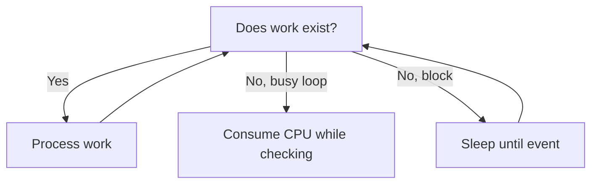

> Stage 2 — Linux and Operating System Internals  
> Subject area 2.2 — Scheduling and Resource Control  
> Article 1

## The short version

A CPU can execute only a limited number of threads at the same time. A machine may have many processes and thousands of threads, so the operating system scheduler decides which runnable thread should run on which CPU and when another thread should get a turn.

The scheduler tries to balance several goals: fair access to CPU time, good interactive response, high throughput, priority requirements, and support for real-time work. These goals can conflict. Giving one task more CPU can delay another. Running too many threads can create waiting and context-switch overhead instead of more useful work.

A context switch occurs when the CPU stops running one thread and resumes another. The kernel saves enough execution state for the old thread and restores the state of the new one. The switch itself has a cost, and the new thread may also lose useful CPU-cache and translation-cache locality.

The central question is:

> When more work wants the CPU than can run immediately, how does Linux decide what runs next, and what does that decision cost?

## Where this article fits

The previous article explained how Linux exposes process state and how engineers inspect live systems. This article explains one of the most important pieces of that state: whether a thread is running, runnable, or waiting, and how it receives CPU time.

Later articles will connect scheduling to processes, threads, synchronization, memory locality, NUMA, containers, real-time systems, and performance profiling.

## A process is not the scheduler's smallest unit

Linux schedules threads. A process is a resource and isolation container that may contain one or many threads.

A single-threaded process has one schedulable execution path. A multi-threaded process has several threads that can run independently and share the process's address space and many resources.



This distinction matters when interpreting CPU usage. A process may report high CPU usage because one thread is busy, or because many threads are running. A process with many threads can still make little progress if most threads are blocked or competing for a lock.

## Thread states

A thread is not continuously running. It moves through states as it executes, waits, and stops.



### Running

A running thread is currently executing instructions on a CPU.

### Runnable

A runnable thread is ready to execute but is not currently running. It may be waiting for a CPU because all CPUs are busy, because another thread has a higher scheduling priority, or because it is waiting for its turn under the scheduler's policy.

Runnable is different from sleeping. A runnable thread needs CPU time. A sleeping thread is waiting for another event and does not need to be scheduled until that event occurs.

### Sleeping or blocked

A sleeping thread is waiting for something such as data from a file or socket, a lock, a timer, a child process, or a condition variable. The operating system can run other work while it waits.

### Stopped

A stopped thread is not allowed to run until it is continued. A debugger or signals such as `SIGSTOP` can stop it.

## Why scheduling is necessary

If one thread ran forever without interruption, other programs could not make progress. The operating system uses scheduling to share CPUs and prevent one normal process from taking all available execution time.



On a multi-core system, several threads can run at the same time, but there may still be more runnable threads than CPUs. Each CPU has scheduling work associated with it, and the kernel may move runnable threads between CPUs to balance work.

## Preemptive scheduling

Preemptive scheduling means that the operating system can interrupt a running thread and give the CPU to another thread. The thread does not need to voluntarily call a yield function for this to happen.

Preemption is important for fairness and responsiveness. A CPU-bound program that never blocks or yields should not prevent other normal programs from running.

The kernel can make a scheduling decision after events such as:

- A timer interrupt
- A thread becoming runnable
- A running thread blocking
- A thread changing priority
- A CPU becoming idle
- A system call returning
- A higher-priority task becoming available

Preemption has a cost. The kernel must preserve the interrupted thread's state, choose another thread, restore its state, and return to execution. Frequent preemption can reduce cache locality and increase overhead.

## Cooperative behavior still matters

Even with preemptive scheduling, programs should cooperate with the system by blocking when they have no work, waiting efficiently, releasing locks, and avoiding busy loops.

A busy loop repeatedly checks a condition while consuming CPU:

```c
while (!work_available) {
    // Repeatedly checking without sleeping or blocking.
}
```

If `work_available` changes rarely, this wastes CPU that could run other work. A condition variable, event, file descriptor, timer, or another blocking mechanism lets the thread sleep until progress is possible.

Preemption prevents starvation in many normal cases, but it does not make busy waiting free.

## Scheduling policies and priorities

The scheduler uses policies and priorities to decide which runnable work should run. Linux supports normal scheduling behavior for ordinary tasks and special policies for real-time or deadline-sensitive work.

For ordinary workloads, the scheduler aims to distribute CPU time fairly while keeping the system responsive. A process's nice value can influence its relative priority: a nicer process gives other work more preference, while a less nice process requests more CPU preference.

Real-time policies can give tasks stronger scheduling priority or deadline behavior. They are useful for specific workloads, but they can also starve normal tasks if used incorrectly.

Priority is not the same as importance in a business sense. If a task has a high operating-system priority, it may receive CPU time even when that causes other tasks to miss their deadlines. Priority decisions should be made with the whole system in mind.

## Fairness and starvation

Fairness means that runnable work receives a reasonable share of CPU according to the scheduling policy and priority. Starvation occurs when a runnable task waits for an unacceptably long time because other work continually receives preference.

Fairness is not always equal CPU time. A high-priority task may intentionally receive more CPU. A task that is sleeping should not receive CPU while it has no work. A task in a constrained control group may have a smaller share than a task in another group.

The scheduler's implementation changes across Linux versions and configurations. It is better to reason in terms of policies, priorities, runnable work, waiting time, and observed behavior than to memorize one internal algorithm as if it were permanent.

## Time slices and scheduling periods

A time slice is a period during which a thread may run before the scheduler considers giving another runnable thread a turn. Modern Linux scheduling behavior is more complex than assigning every task a simple fixed slice, but the time-slice model is still useful for understanding preemption.

The effective run time of a thread depends on the number of runnable tasks, their priorities, the scheduling class, blocking behavior, CPU affinity, and system events. A thread that runs for a short period and blocks may receive many opportunities to run without consuming an entire CPU.

The scheduler tries to balance responsiveness and throughput. Very frequent switching improves interactivity but adds overhead. Very infrequent switching improves long-running throughput for CPU-bound tasks but can make interactive work feel slow.

## What a context switch does

A context switch changes which thread is executing on a CPU. The kernel must preserve the old thread's execution state and restore the new thread's state.

The state can include:

- General-purpose registers
- Instruction pointer
- Stack pointer
- Processor flags
- Floating-point or vector state when relevant
- Scheduling metadata
- Memory-management state when the address space changes



The switch does not copy the entire process memory. It saves and restores the execution context needed to resume the thread. If the new thread belongs to another process, the kernel may also change the active address-space mapping.

## Thread switch versus process switch

Switching between two threads in the same process may be cheaper than switching between threads in different processes because the threads can share the same address space and some related state.

Switching between processes may require changing the active memory-management context. Modern processors and operating systems reduce some of this cost with translation-cache identifiers and other techniques, but the cost can still differ.

The exact cost depends on the CPU, kernel version, architecture, workload, cache state, and what the threads were doing. It is not accurate to assign one universal number to a context switch.

## Why context switches cost more than register changes

The direct state save and restore is only part of the cost. After a switch, the new thread may not find its useful instructions and data in the CPU caches. It may also experience translation-cache misses when accessing memory.

```text
Thread A's cache working set
        ↓ switch
Thread B's cache working set
        ↓
Some data and instructions must be fetched again
        ↓
CPU spends time waiting for cache and memory access
```

This is why a program with many threads can be slower even when every thread is individually efficient. The threads may constantly displace one another's working sets.

Context-switch overhead also includes scheduler work, lock contention in kernel paths, CPU migrations, and the cost of waking and sleeping tasks.

## Voluntary and involuntary context switches

A voluntary context switch occurs when a thread gives up the CPU because it blocks or explicitly yields. It may be waiting for I/O, a lock, a timer, or another event.

An involuntary context switch occurs when the scheduler interrupts a running thread because its time or priority relationship requires another decision, or because higher-priority runnable work became available.

The distinction helps diagnose behavior:

- Many voluntary switches may indicate heavy I/O or lock waiting.
- Many involuntary switches may indicate CPU contention, high concurrency, or frequent preemption.

Neither type is automatically bad. The useful question is whether the switching and waiting match the workload and latency requirements.

## CPU migration and cache locality

On a multi-core system, a thread may run on different CPUs over time. Moving a thread can help load balancing, but it may reduce cache locality because the new CPU may not have the thread's working data in its local caches.

CPU migration is especially important on NUMA systems, where memory access cost can depend on which CPU and memory node are involved. Pinning a thread to one CPU can improve predictability for a specialized workload, but it can also create imbalance if that CPU becomes overloaded.

The default scheduler usually has more information than an application about balancing work. Pinning should be based on measurement and a clear reason such as latency isolation, cache locality, device affinity, or real-time behavior.

## CPU affinity and pinning

CPU affinity restricts a process or thread to a set of CPUs. Pinning is the stronger case where the set contains one or a small number of CPUs.

Affinity can be useful for:

- Keeping a latency-sensitive task away from noisy workloads
- Matching a thread to a device interrupt or network queue
- Improving cache locality
- Isolating real-time work
- Reducing migrations during a benchmark

Affinity can be harmful when:

- The selected CPU is overloaded
- Work is unevenly distributed
- The program has more runnable threads than allowed CPUs
- Memory is remote on a NUMA system
- The constraint prevents the scheduler from balancing bursts

The command-line tools `taskset` and `numactl` can inspect or set affinity, but using them safely requires understanding the whole workload.

## Blocking is better than spinning when no work exists

A thread that has no work should usually block on an appropriate event instead of repeatedly polling.



Busy polling can be appropriate when the expected wait is extremely short and latency matters more than CPU efficiency. It is also used in specialized high-performance systems. For ordinary application work, blocking or event-driven waiting is usually a better tradeoff.

The decision depends on the cost of wake-up, expected wait time, CPU availability, and latency target.

## Too many threads

Threads are not free. Each thread needs a stack, scheduling state, kernel bookkeeping, and usually application-level state. If too many threads are runnable, they compete for CPUs and increase context switching.

If most threads are blocked on I/O, a larger number may be reasonable. If most are CPU-bound, the useful number is usually related to available CPU capacity and the amount of parallel work.

Thread pools make the bound explicit, but the correct size depends on the workload. A pool that is too small limits throughput. A pool that is too large increases memory use, contention, and queueing.

The right question is not “How many threads can the machine create?” It is:

> How many concurrent operations can the CPU, memory, dependencies, and latency target support?

## Real-time scheduling

Real-time work has deadlines that matter more than average throughput. Hard real-time systems must guarantee deadlines under defined conditions. Soft real-time systems try to meet deadlines but may occasionally miss them.

Real-time scheduling policies can give certain tasks strong priority or deadline treatment. This can protect critical work, but a misconfigured real-time task can prevent normal system tasks from running and make the machine unusable.

Real-time behavior also depends on interrupt handling, memory allocation, page faults, locks, device latency, and other parts of the system. Choosing a real-time scheduling class alone does not create a complete real-time guarantee.

## Inspecting scheduling behavior

Linux exposes scheduling information through process tools and performance counters.

Useful commands include:

```bash
ps -eLo pid,tid,psr,stat,pri,ni,pcpu,comm
pidstat -w -p 2450 1
taskset -pc 2450
perf stat -e context-switches,cpu-migrations ./program
```

These commands can show:

- Process and thread IDs
- The CPU currently running a thread
- Process state
- Priority and nice value
- CPU utilization
- Voluntary and involuntary context switches
- CPU migrations

The exact output depends on the system and permissions. A number is useful only when compared with a workload, baseline, and latency result.

For example, high context-switch counts may indicate many runnable threads, frequent blocking, lock contention, or a design that wakes more work than necessary. The count alone does not identify which cause applies.

## A realistic production example

Imagine a service that becomes slower after the team increases its worker pool from 16 to 256 threads. CPU utilization increases, but throughput barely improves and p99 latency becomes much worse.

The team measures context switches, CPU migrations, lock wait time, and database connection wait time. The workers are mostly CPU-bound during request parsing and also compete for a shared cache lock. The larger pool creates more runnable work than the machine can execute, increases switching, and increases lock contention.

The team reduces the worker count, partitions the cache to reduce sharing, and measures again. Throughput improves slightly and tail latency falls significantly.

The lesson is not that 256 threads is always wrong. It is that concurrency must match CPU capacity, blocking behavior, shared-state design, and dependency limits. More runnable work is not the same as more useful work.

## How experienced engineers reason about scheduling problems

They first distinguish the state of the work:

- Is it running on a CPU?
- Is it runnable but waiting for a CPU?
- Is it sleeping on I/O, a lock, or a timer?
- Is it stopped by a signal or debugger?
- Is it repeatedly waking and blocking?

Then they compare scheduling evidence with the user-visible result:

- CPU utilization
- Run-queue length
- Context switches
- CPU migrations
- Thread count
- Lock wait time
- I/O wait time
- Tail latency
- Throughput

They avoid pinning CPUs or changing priorities just because those actions sound low-level. The change should address a measured problem and include a way to verify that it did not create starvation or overload elsewhere.

## Interview definitions

### What is CPU scheduling?

> CPU scheduling is the operating system's process of choosing which runnable thread should execute on each CPU and when another thread should receive a turn.

### What is a runnable thread?

> A runnable thread is ready to execute but is waiting for a CPU or scheduling opportunity.

### What is preemptive scheduling?

> Preemptive scheduling allows the operating system to interrupt a running thread and schedule another one without waiting for the first thread to voluntarily yield.

### What is a context switch?

> A context switch is the process of saving one thread's execution state and restoring another thread's state so the CPU can resume different work.

### What is a voluntary context switch?

> A voluntary context switch occurs when a thread gives up the CPU because it blocks, waits, or explicitly yields.

### What is an involuntary context switch?

> An involuntary context switch occurs when the scheduler interrupts a running thread to schedule other work.

### What is CPU affinity?

> CPU affinity restricts a process or thread to a selected set of CPUs, sometimes to improve locality, isolation, or timing predictability.

## Interview follow-up questions

### What is the difference between a process and a thread from the scheduler's perspective?

> Linux schedules threads. Threads in one process share an address space and many resources, while threads in different processes have separate address spaces and stronger isolation.

### Why does a context switch have a cost?

> The kernel must save and restore execution state, and the new thread may lose useful CPU-cache and translation-cache locality. Scheduling and CPU migration can add more overhead.

### Why can too many threads reduce performance?

> They consume memory and scheduling state, compete for CPUs and shared locks, increase context switches, and may overload downstream resources. More concurrency helps only while the system has useful independent capacity.

### What is the difference between a runnable and a sleeping thread?

> A runnable thread is ready but waiting for CPU time. A sleeping thread is waiting for another event such as I/O, a lock, or a timer and should not consume CPU while waiting.

### When might CPU pinning help?

> Pinning can help with latency isolation, cache locality, device affinity, or specialized real-time work. It can hurt when it prevents load balancing or pins work to an overloaded or distant NUMA node, so it should be measured.

### What is starvation?

> Starvation occurs when a runnable task waits for an unacceptably long time because other work continually receives scheduling preference.

### Is high context-switch activity always bad?

> No. Context switches are necessary when work blocks or multiple tasks share a CPU. It becomes a problem when switching, migrations, or wakeups consume significant capacity or contribute to poor latency.

## Common misconceptions

### “The scheduler runs processes, not threads.”

Processes provide isolation and resources, but Linux schedules individual threads.

### “A context switch copies the whole process memory.”

The kernel saves and restores execution state. It does not copy the entire address space for every switch, although changing address spaces can affect memory-translation state and locality.

### “More CPU cores always solve scheduling problems.”

More cores can provide capacity, but locks, memory bandwidth, I/O, dependencies, and serial portions of the workload may remain bottlenecks.

### “A sleeping process is wasting CPU.”

A sleeping thread is usually waiting for an event and is not consuming CPU while it sleeps. A busy loop is the pattern that wastes CPU when no work is available.

### “CPU affinity always improves performance.”

Affinity can improve locality or isolation, but it can also create imbalance and prevent the scheduler from moving work to an available CPU.

### “Real-time priority guarantees real-time behavior.”

Real-time scheduling helps prioritize work, but deadlines also depend on memory, interrupts, locks, devices, page faults, and the rest of the system design.

## Summary

Linux schedules threads, not abstract programs. Threads move between running, runnable, sleeping, stopped, and exited states as they use the CPU, wait for events, and complete work.

Preemptive scheduling protects fairness and responsiveness, but it adds context-switch and locality costs. A context switch saves and restores execution state; it may also disturb caches, translation state, and CPU affinity. Too many runnable threads can increase overhead and contention without increasing useful throughput.

Scheduling problems should be investigated with evidence: thread states, CPU utilization, run-queue behavior, context switches, migrations, lock waits, I/O waits, latency, and throughput. Affinity, priority changes, and larger thread pools are tools for specific measured problems, not universal performance fixes.

## If you want to build this later

Build a small scheduling experiment that starts configurable numbers of CPU-bound and sleeping threads.

Measure elapsed time, throughput, CPU usage, context switches, and migrations as you change the number of threads. Add a lock shared by all workers, then partition the work so that threads use less shared state. Compare normal scheduling with a controlled CPU-affinity experiment.

The goal is to observe the difference between running, runnable, and sleeping work, and to see when more concurrency changes from useful parallelism into scheduling and contention overhead.
