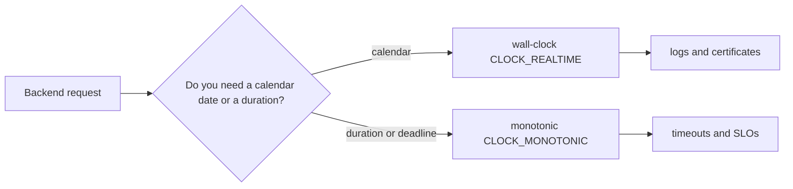
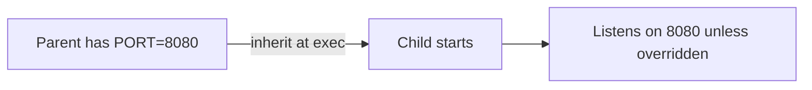

> Stage 2 — Linux and Operating System Internals  
> Subject area 2.1 — The Operating System Model  
> Article 6

## The short version

Linux gives you different ways to talk about time, identity, and configuration, and mixing them up causes subtle failures. Clocks tell you what time it is or how long something took. Hostnames tell you a machine's local name. Environment variables tell a new process how to start.

Wall-clock time is the calendar time you see in logs. It can move forward or backward when NTP corrects it or an administrator changes it. Monotonic time is different. It always moves forward and is meant for measuring how long an operation took. A hostname is a local name for a machine. It is convenient for prompts and logs, but it is not a secure identity. An environment variable is a string passed to a child when it is created with `exec`. The child inherits it, but changing the parent later does not update a running child.

The problems come from assumptions. Code that uses wall-clock time for a timeout can see the timeout fire early or late when the clock steps. Code that trusts a hostname to prove which service it talked to can be misled when a container restarts with a new name. Code that reads a secret from the environment without checking can miss it and fall back to a dangerous default.

## Where this article fits

The previous article showed how `/proc`, `/sys`, and `/dev` expose live kernel state as file-like views. This article is about the configuration side of that state. How does the system know what time it is, what it is called, and what a new process should do?

You need this before CPU scheduling, because a timer expiry is just a monotonic deadline that the scheduler will act on. You will use the same ideas later for network timeouts, SLO measurement with `CLOCK_MONOTONIC`, and for understanding why TLS uses a certificate name instead of a hostname string.

## Time appears simple until you measure

A backend often needs three kinds of time. One is for people, like the timestamp in a log line. One is for measuring, like how long a request took. One is for deciding, like giving up after 500 milliseconds. Linux keeps these separate for a reason.

Imagine a request that needs to decide whether to give up. You can picture it as a choice between two clocks.



The diagram says most of what you need. If you are showing a time to a person, use the wall clock. If you are measuring how long something took, use the monotonic clock. Getting this wrong creates bugs that only appear when time is corrected.

## Wall-clock time

Wall-clock time, `CLOCK_REALTIME` on Linux, is the calendar time. It is the time you see with `date` or `timedatectl`. Because it is meant to match the real world, it can be stepped forward or backward. NTP synchronization, a manual `date -s`, or a timezone change can move it.

This makes it the right clock for anything that is about a point in time. Log timestamps, certificate validity, and user-visible dates should use it. It is the wrong clock for measuring a duration. The reason is straightforward. If you take two wall-clock readings and subtract them, the result can be wrong when the clock moved between the readings.

The following code looks reasonable, but it has that exact problem.

```c
struct timespec a, b;
clock_gettime(CLOCK_REALTIME, &a);
do_work();
clock_gettime(CLOCK_REALTIME, &b);
long duration = b.tv_sec - a.tv_sec;
```

If NTP steps the clock back by two seconds while `do_work` runs, the calculated duration can be negative. If you used this to implement a 500 ms timeout, the timeout could appear to take 2.5 seconds, or never fire at all. This is not a theoretical concern. It happens in production when a VM's clock is disciplined after a pause.

## Monotonic time

A monotonic clock, `CLOCK_MONOTONIC` on Linux, is built for measuring. It always moves forward. On Linux, NTP may change how fast it ticks to keep it close to real time, but it will not make it jump.

You should use it whenever you care about how much time has passed. Request timeouts, deadlines, retry budgets, and latency histograms all fit here. In Go, `time.Now` and `time.Since` already use this clock in their internal representation. In C, you ask for it explicitly.

```c
struct timespec start, now;
clock_gettime(CLOCK_MONOTONIC, &start);
// deadline is start + 500ms
```

Choosing the wrong clock is a common mistake because both clocks look similar in a small test. The test runs when the wall clock is stable, so subtracting it works. The failure only shows up later when time is corrected.

## Timers

A timer asks the kernel to wake a thread after a certain amount of time. It might be a `timerfd`, an `epoll` timeout, or a `sleep` in a language runtime. Two things can still go wrong.

First, when a timer expires, that only means the event is ready. It does not mean your thread runs immediately. The scheduler still has to give it a CPU, and under load that can take extra time.

Second, a timer built on the wrong clock will fire at the wrong moment. A `timerfd` created with `CLOCK_REALTIME` will be affected by a step, while one created with `CLOCK_MONOTONIC` will not. The correct pattern for a deadline is to compute the remaining time from a monotonic clock.

```text
deadline = monotonic_now() + 200ms
while work not done:
    remaining = deadline - monotonic_now()
    wait_for_event(remaining)
```

If you compute that remaining time with the wall clock, a step can make `remaining` suddenly large or negative, and a caller that retries on timeout can create a storm.

## Hostnames and identity

A hostname is the name a machine calls itself. You can see it with `hostname`, from `/proc/sys/kernel/hostname`, or in a container with its own network namespace. It is useful for log lines, shell prompts, and as a hint for service discovery.

It is not proof of identity. A hostname can change after a reboot or when a container is rescheduled. It may not be unique, because two clusters can both have a machine called `web-1`. It can resolve to different addresses depending on whether you look at DNS or `/etc/hosts`. Inside a container, the hostname is different from the host's hostname, because they are in different network namespaces.

Backend systems therefore keep several separate ideas of identity. The kernel hostname is for local display. A fully qualified DNS name is for routing. A machine ID or cloud instance ID is for inventory or autoscaling. A container hostname is only local to that pod. For authentication, a service identity carried in a TLS certificate is what you should verify. If you log that you talked to `host=web-3`, that only proves which log line was written, not which service you authenticated with. Use service discovery together with certificate verification, not string matching on hostnames.

## Environment variables and process configuration

An environment variable is a key and a value that a parent passes to a child when it calls `exec`. The child inherits the values that exist at that moment. Changing the parent's environment afterward does not change a child that is already running. The child would need to be restarted to see the new value.

This inheritance is convenient, but it brings limitations that cause real outages. An environment variable is just a string, so there is no type checking. One program might expect `TIMEOUT=500` to mean milliseconds, while another expects `TIMEOUT=0.5s`. If `PORT` is missing, code that silently defaults to 8080 in production but 3000 on a laptop can start on the wrong port. Because the environment is inherited, changing a unit file's `Environment=` in `systemd` has no effect until you run `daemon-reload` and restart the service. The environment is also visible in `/proc/<pid>/environ` and can appear in crash dumps, so putting a raw `DATABASE_URL` there can leak a secret through `ps e` or an error reporter. For sensitive values, a file mount or secret manager is safer.

Good configuration code validates at startup, fails quickly if a required value is missing, states the allowed range and default, and documents whether an old name is still supported.



Treat writing to `/proc/sys/kernel/hostname` or running `timedatectl set-ntp` as calling a typed kernel API. It changes live state immediately and is not like editing a file that will be read later. A diagnostic command that accidentally writes there can affect the running machine.

## A small code example

Go already does the right thing in its standard library. `time.Since(start)` subtracts monotonic time, while `time.Unix` is wall-clock time. In C you choose explicitly. The following function waits for an event but uses the correct clock for the deadline and keeps wall-clock only for logging.

```c
#include <time.h>

int wait_with_deadline_ms(long timeout_ms) {
    struct timespec start, now, deadline, wall;

    clock_gettime(CLOCK_MONOTONIC, &start);
    deadline = start;
    deadline.tv_sec  += timeout_ms / 1000;
    deadline.tv_nsec += (timeout_ms % 1000) * 1000000;
    if (deadline.tv_nsec >= 1000000000) {
        deadline.tv_sec++;
        deadline.tv_nsec -= 1000000000;
    }

    clock_gettime(CLOCK_REALTIME, &wall);
    // wall is only for a log line like "started at 2026-08-23T12:00:00Z"

    do {
        clock_gettime(CLOCK_MONOTONIC, &now);
        long remaining_ms = (deadline.tv_sec - now.tv_sec) * 1000
                          + (deadline.tv_nsec - now.tv_nsec) / 1000000;
        if (remaining_ms <= 0) return -1;
        // poll with remaining_ms
    } while (1);
}
```

The important line is the first `clock_gettime` with `CLOCK_MONOTONIC`. That is the clock used for the deadline. The wall-clock read is only for display. If you run this and step the wall clock in a VM, the timeout still fires after about 500 ms. If you replace `CLOCK_MONOTONIC` with `CLOCK_REALTIME`, the same step makes it fire early or late. The code does not handle scheduler delays, so in a real service you would still add a small jitter and measure the actual wakeup time.

## A realistic production example

A small Go service used `time.Now().Add(200*time.Millisecond)` for a downstream call. That part was correct, because Go's `time.Now` includes monotonic time. After a deployment, a teammate added a new database host through an environment file but forgot to run `systemctl daemon-reload`. The old process kept the old `DB_HOST` value that you could still see in `/proc/<pid>/environ`, so requests went to the wrong shard. The hostname in that environment, `db-primary`, also resolved to an old address because of a stale entry in `/etc/hosts`. At the same time, a dashboard calculated p99 latency by subtracting wall-clock timestamps. When NTP stepped the clock, the graph showed a two-second spike that did not exist, and the alert fired.

The team fixed it in a few places. They made the program check for `DB_HOST` at startup and exit with a clear error if it was missing. They stopped using the hostname string for routing and relied on service discovery with a TLS certificate for identity. They kept `time.Since` for durations and used wall-clock only for log timestamps, and they changed the alert to use the monotonic-based histogram. Each change matches the earlier rule. For display, use wall-clock. For how long, use monotonic. For identity, verify the service, not the name. For configuration, validate at start.

## How experienced engineers handle this

They ask different questions for each interface. For time, they ask whether the value is for a person or for measuring, and they choose the clock before any code is written. In tests they inject a fake clock so they can simulate a step without changing the real machine. For identity, they ask which name the peer will actually verify — a local hostname, a DNS entry, or a name inside a certificate — and they document which one is authoritative. For environment variables, they ask who sets the value, who inherits it, whether it is a secret, and what happens if it is missing. They validate required keys at boot and restart the process to pick up changes.

You can see which path a program uses with ordinary tools. `strace -e clock_gettime` shows which clock is asked for. `date` and `timedatectl status` show wall-clock versus NTP discipline. `hostname` and `hostname -f` show the local name versus the DNS name, while `cat /etc/machine-id` shows a more stable identifier. `tr '\0' '\n' < /proc/<pid>/environ` shows exactly what a running service saw at start.

## Interview definitions

### What is wall-clock time?

> Wall-clock time is the calendar time that can be adjusted to match the real world. It is the time you display in logs and use for certificate checks, but subtracting two wall-clock readings can give the wrong duration if the clock steps.

### What is monotonic time?

> Monotonic time always moves forward and is meant for measuring how long something took. NTP may adjust how fast it ticks, but it will not make it jump, so timeouts and SLO measurements should use it.

### What is a hostname?

> A hostname is the local name a machine calls itself. It is useful for logs and prompts, but it can change, it may not be unique, and it can resolve differently in DNS and `/etc/hosts`. It does not prove which service you talked to.

### What is an environment variable?

> An environment variable is a string passed from a parent to a child at `exec`. The child inherits it once, and a later change in the parent does not affect a running child. Because it is just a string and often visible in `/proc`, you should validate it at startup and avoid putting high-value secrets there.

## Interview follow-up questions

### Why is monotonic time better for timeouts?

> Wall-clock time can jump because of NTP or a manual change. If you compute how much time is left with wall-clock time, a step can make the remaining time suddenly long or negative. Monotonic time does not jump, so the remaining budget stays correct.

### Why can a hostname not be used as a secure identity?

> The name can change when a machine or container restarts, two clusters can use the same name, and DNS and `/etc/hosts` can give different answers. A TLS certificate or a cloud instance identity is the right thing to verify.

### Why does changing an environment variable not update a running service?

> The variable is copied once when the child is created. A running process keeps the old copy. You need to restart or reload the service to make it see the new value.

## Common misconceptions

### “Changing an environment variable updates a running service.”

It does not. The value is inherited at start. An already running process keeps what it got. You need to restart the service.

### “A hostname proves which service I talked to.”

It is only a hint. A local name can collide or be changed. Prove identity with a certificate or with the platform's instance identity, not with a string comparison on the hostname.

### “Wall-clock time is fine for timeouts.”

It can be stepped. If you subtract two wall-clock times, the result can be negative or very large. Use monotonic time for deadlines and keep wall-clock time for display.

## Summary

Time, hostname, and environment look small, but they sit on every request. Use wall-clock time for when something happened and monotonic time for how long it took. Treat a hostname as a hint for humans, not as proof for authentication. Treat environment variables as input that is copied once, so validate it early, document defaults, and restart to pick up changes.

The habit to keep is to ask where each value comes from, whether it can change underneath you, and who the correct consumer is. Is the value for a person, for measuring, or for identity?

## If you want to build this later

Extend the inspection tool from the previous article. Add a mode that prints both clocks every half second and a mode that simulates a deadline with each clock. Add another mode that reads `/proc/<pid>/environ` and prints the keys, redacting anything that looks like a secret, and that prints `hostname`, `hostname -f`, and `machine-id` side by side.

Run it in a VM where you can step the wall clock. The monotonic deadline should stay close to correct while the wall-clock deadline moves. Restart a child after changing the parent's environment and show that the old child still sees the old value while a new child sees the new one. The exercise makes it clear which values are live observations and which are one-time inputs.
