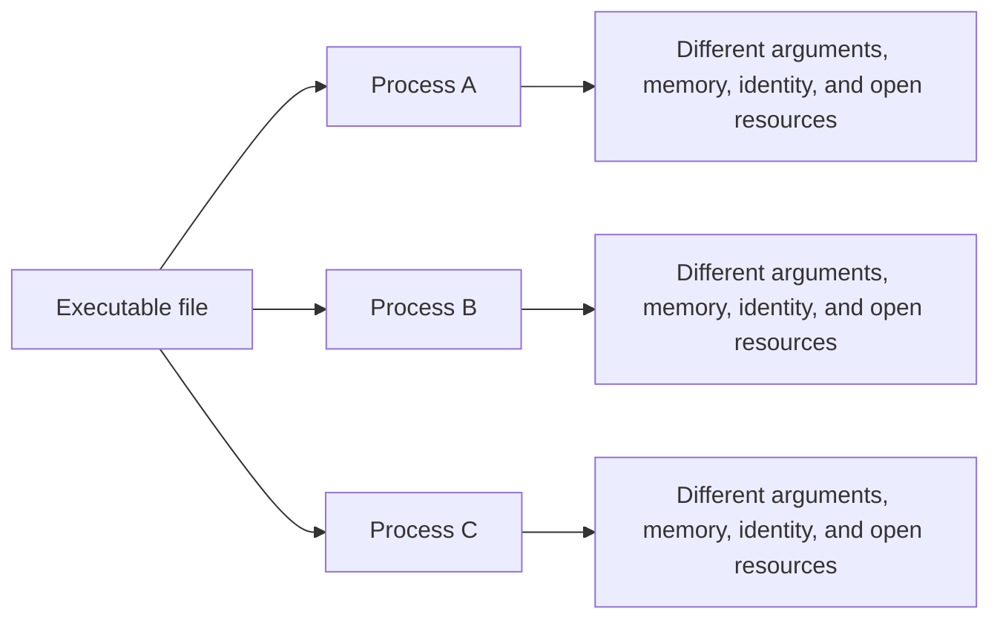
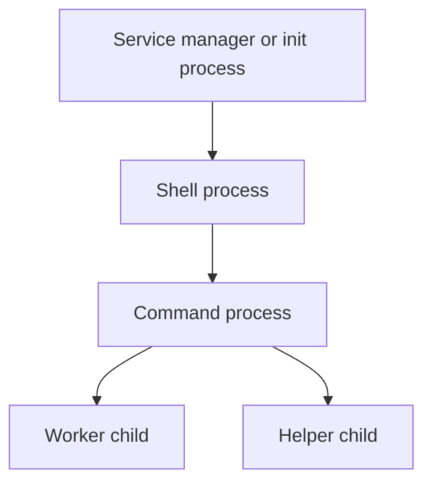
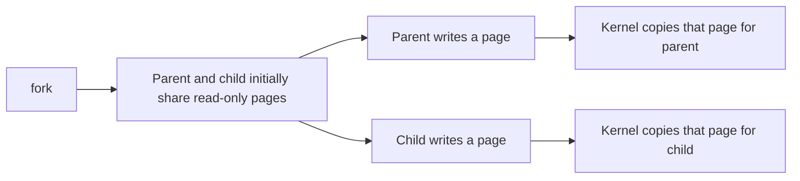
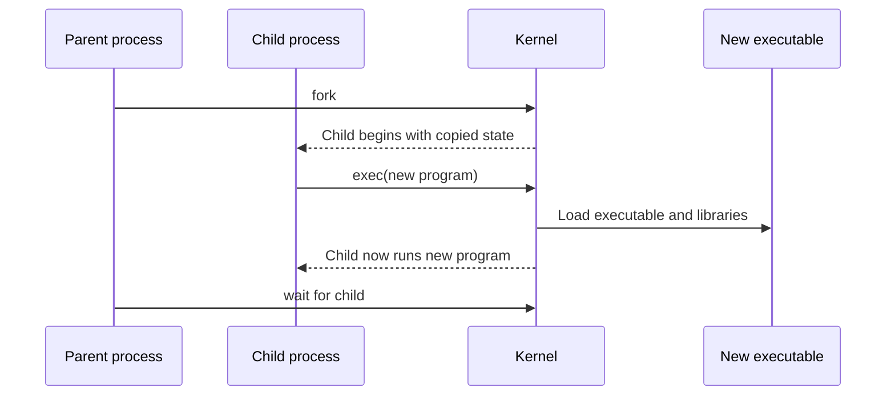

> Stage 2 — Linux and Operating System Internals  
> Subject area 2.1 — The Operating System Model  
> Article 3

## The short version

A process is a running instance of a program together with its address space, threads, identity, open resources, and operating-system state. A simple way to picture it is as an isolated resource container. The container holds the running program, and the kernel manages its lifecycle.

Linux creates a process with `fork` or `clone`, replaces its image with `exec`, and tracks its exit with `wait`. The same executable can become many processes with different PIDs, arguments, and resources. Whether a child becomes a zombie that still occupies a table entry or is reparented as an orphan depends on whether the parent collects the exit status. In a backend, forgetting to `wait` can fill the process table with zombies, and forking without `close-on-exec` can leak file descriptors into the next program.

The central lifecycle is:

```text
Create (fork) → Run → Replace (exec) → Exit → Reap (wait)
```

## Where this article fits

The previous article explained how programs enter the kernel through system calls. This article explains the lifecycle of the resource that makes those calls — the process.

**Prerequisites:** System Calls — how a program crosses into the kernel.  
**Next:** Linux Signals and Service Supervision — how the kernel or another process notifies a process and how a service is supervised.

Later articles will examine scheduling, memory, files, and concurrency inside this lifecycle.

## A program is not a process

A program is a stored set of instructions and data, usually represented by an executable file. A process is a live execution context created from that program.

The same executable can produce many independent processes:



The executable file is not the process's complete state. The process also has:

- A process identifier
- An address space
- One or more threads
- A current working directory
- Environment variables
- Command-line arguments
- User and group identity
- Signal dispositions and masks
- Open file descriptors
- Resource limits
- Scheduling state
- Parent and child relationships

Two processes running the same program can behave differently because these parts of their state differ.

## Process identifiers and relationships

Linux assigns a process identifier, or PID, to a process. Other processes use the PID when sending signals, waiting for termination, inspecting state, or applying resource policies.

Processes also have relationships. A process that creates another process is usually called its parent, and the newly created process is its child.



The relationship matters because the parent may be responsible for collecting the child's exit status. It also affects signal delivery, process groups, job control, and what happens if the parent exits first.

The PID is meaningful only within a PID namespace. Containers can use namespaces so that a process sees a different process-numbering environment from the host. The underlying process still has a host-level identity, but the visible PID depends on the namespace.

## What Linux creates when it creates a process

Creating a process requires more than choosing a PID. Linux must create or establish execution state, memory mappings, credentials, file-descriptor state, signal state, scheduling information, and relationships with other processes.

Some of these resources can be shared between related processes. Others are copied or created independently. The exact behavior depends on the creation interface and flags.

The traditional Unix model is often explained with two operations:

1. `fork` creates a child process based on the calling process.
2. `exec` replaces the current process image with another program.

Linux also provides the more general `clone` and related interfaces, which can create processes or threads while choosing which parts of the execution state are shared. The simple `fork` and `exec` model is still the best starting point.

## `fork`: creating a child

`fork` creates a child process that initially resembles the calling process. The child receives a different PID and begins execution near the return from `fork`.

The call returns different values:

- In the child, it returns `0`.
- In the parent, it returns the child's PID.
- If creation fails, the parent receives `-1` and an error.

```c
pid_t child = fork();

if (child < 0) {
    perror("fork");
    return 1;
}

if (child == 0) {
    // Child process.
    printf("child: pid=%ld\n", (long)getpid());
} else {
    // Parent process.
    printf("parent: child pid=%ld\n", (long)child);
}
```

The return value tells the parent and the child apart. The parent sees the child's PID, the child sees zero, and that is how a shell decides which branch should become the command. Logically `fork` duplicates the address space, but the kernel uses copy-on-write to make it cheap until the child calls `exec`. If you run the program, you should see two lines, one from the parent with the child's PID and one from the child with its own PID.

After `fork`, both processes continue from the same point in the source, but they have separate execution contexts. A variable that appears to have the same value in both processes is no longer shared memory simply because it had the same value before the fork.

### Copy-on-write

Copying an entire address space immediately would be expensive. Linux commonly uses copy-on-write. The parent and child initially refer to shared physical pages marked so that a write causes a private copy to be created.



Copy-on-write makes process creation cheaper when the child quickly calls `exec` and replaces its address space. It still has costs: page-table work, memory pressure when pages are modified, and complications for large processes or memory-heavy workloads.

## `exec`: replacing the process image

An `exec` operation loads a new executable into the current process and replaces the old program image. It does not normally create a new PID. The process keeps its identity while its code, data, stack, and other program image state are replaced.



This separation is useful. A shell can create a child and then ask that child to become any command. The shell keeps running while the child process runs the selected program.

The `exec` family differs in how it specifies the program path, arguments, and environment. The common behavior is that successful `exec` does not return to the old program because the old process image no longer exists. If `exec` returns, it failed and the child must handle the error.

## File descriptors across `fork` and `exec`

Open file descriptors are part of process state. After `fork`, the child normally inherits descriptors that refer to the same underlying open file descriptions as the parent.

This is how a shell can create a pipeline:

```text
process A stdout → pipe write end
process B stdin  → pipe read end
```

The parent creates a pipe, forks children, and connects each child's standard input or output with `dup2`. The children then call `exec` to become the requested commands.

Descriptors can also remain open across `exec` unless they have the close-on-exec flag. Accidental descriptor inheritance can keep pipes from reaching end-of-file, keep files open longer than expected, or give a new program access to a resource it should not have.

The close-on-exec rule is therefore both a correctness and security concern.

## `wait`: collecting a child

When a child process exits, the kernel records information such as its exit status and keeps a small process-table entry until the parent collects it. The parent collects that state with `wait`, `waitpid`, or a related interface.

```c
int status;
pid_t result = waitpid(child, &status, 0);

if (result == -1) {
    perror("waitpid");
    return 1;
}

if (WIFEXITED(status)) {
    printf("child exit code: %d\n", WEXITSTATUS(status));
} else if (WIFSIGNALED(status)) {
    printf("child was terminated by signal %d\n", WTERMSIG(status));
}
```

The call lets the parent collect the child's exit status so the child does not stay a zombie. `WIFEXITED` and `WIFSIGNALED` tell the parent whether the child exited normally or was terminated by a signal, which is how a supervisor decides whether to restart. When you run it, it prints the exit code or the signal number.

The parent can choose to wait for a specific child, wait for any child, or use a non-blocking mode to check whether a child has changed state.

## Zombies and orphans

A zombie is a child that has exited but whose parent has not yet collected its exit status. The child is no longer executing and its memory has been reclaimed, but the kernel keeps a small record so the parent can learn how it ended.

```text
Child exits
    ↓
Kernel releases most child resources
    ↓
Exit status remains
    ↓
Parent calls waitpid
    ↓
Zombie record is removed
```

A few short-lived zombies may be harmless, but a parent that continually creates children and never reaps them can exhaust process-table resources.

An orphan is a process whose parent has exited. Linux reparents it to an appropriate system process, often PID 1 inside its PID namespace, or to a configured subreaper. The new parent can then perform required supervision or reaping.

Zombies and orphans are different:

- A zombie has exited but has not been reaped.
- An orphan is still running but has lost its original parent.

Confusing these terms can lead to incorrect debugging and cleanup decisions.

## Exit status

A process can exit normally with an integer status, or it can be terminated by a signal. The parent can inspect which occurred.

Exit status conventions are not a complete error-reporting system, but they are useful for scripts, service managers, and parent processes. A program should choose meaningful status values and avoid treating every nonzero value as the same kind of failure.

When a process is terminated by a signal, the parent can identify the signal. A service manager may use that information to distinguish a deliberate stop from a crash or resource failure.

## A realistic production example

A backend job runner forks a worker per job but forgets to `wait` in the parent when the job succeeds quickly. Under load, `ps` shows dozens of `defunct` entries. New `fork` calls begin failing with `EAGAIN` — not because memory is full, but because the process table is full of zombies.

The fix is not to raise `RLIMIT_NPROC`. It is to reap every child path, including the success path: `fork → child exec worker → parent waitpid` with `SIGCHLD` handling, and monitor `ps` `stat=Z` count. The next article will add `SIGTERM` handling so workers stop gracefully instead of being killed.

## How experienced engineers investigate a process problem

When a process behaves unexpectedly, experienced engineers check:

- Is the process running, sleeping, or becoming a zombie (`ps -o stat`)?
- What is its PID, parent PID, and PID namespace (`/proc/<pid>/status`)?
- Which file descriptors are inherited across `exec` (`/proc/<pid>/fd`, `lsof`)?
- Is the parent reaping children (`strace -e waitpid`, `pstree`)?

Tools such as `ps`, `/proc`, `pstree`, `lsof`, and `strace` answer different parts of this investigation. The tool output becomes useful only when connected to a lifecycle hypothesis.

## Interview definitions

### What is a process?

> A process is a running instance of a program with its own address space, execution state, identity, and operating-system-managed resources. The same executable can become many processes, each with its own PID, arguments, environment, and file descriptors.

### What does `fork` do?

> `fork` creates a child process that initially resembles the parent. In the child it returns zero, in the parent it returns the child's PID.

### What does `exec` do?

> `exec` replaces the current process image with a new executable. The PID stays the same, but the old code and data are gone.

### What does `waitpid` do?

> `waitpid` lets a parent collect a child's exit status so the child does not remain a zombie. A zombie has exited but not been reaped, while an orphan is still running after its parent exited and has been reparented.

### Why can a restart policy hide a bug?

> If a service fails for the same persistent reason, restarting it immediately just repeats the failure, fills logs, and hides the original configuration error. A delay with `RestartSec` and different exit codes for config versus transient errors prevents the loop.

## Interview follow-up questions

### Why are `fork` and `exec` separate?

> Separating them lets a parent configure the child's descriptors, env, and process group with `dup2`/`setpgid` before the child becomes the desired program — how shells build pipelines.

### Does `exec` create a new PID?

> No. It replaces the image in place; `fork` creates the new PID.

### Why do zombies exist?

> The kernel keeps a small exit record until `wait` so the parent can learn the exit code or terminating signal.

## Common misconceptions

### “`fork` copies all memory immediately.”

Copy-on-write shares pages until a write — logical spaces are separate, physical pages temporarily shared.

### “`exec` starts a child.”

It replaces the current image; it does not create a new PID.

### “A zombie holds all its memory.”

Most resources are reclaimed; only a small exit record remains, but many zombies exhaust the process table.

## Summary

A process is the kernel's lifecycle abstraction: `fork` creates, `exec` replaces, `wait` reaps. Copy-on-write, descriptor inheritance with `close-on-exec`, and zombie/orphan handling determine whether a backend leaks resources or cleans up. The next layer is *notification* — signals and supervision — which decides how a process is asked to stop.

## If you want to build this later

Build a tiny shell that does one `fork → exec → wait` pipeline. Start with a single command, then add `close-on-exec` verification by listing `/proc/self/fd` before and after `exec`. Inject a bug where the parent skips `wait` on success and observe zombies with `ps`. Fix it and add `waitpid(-1, &status, WNOHANG)` in a loop to reap all children. This connects lifecycle, descriptor inheritance, and reaping before you add signals in the next article.
