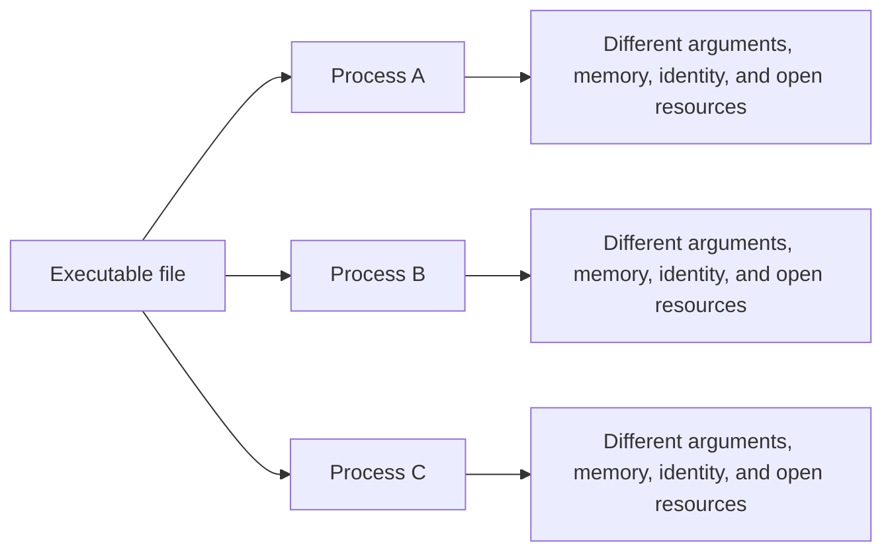
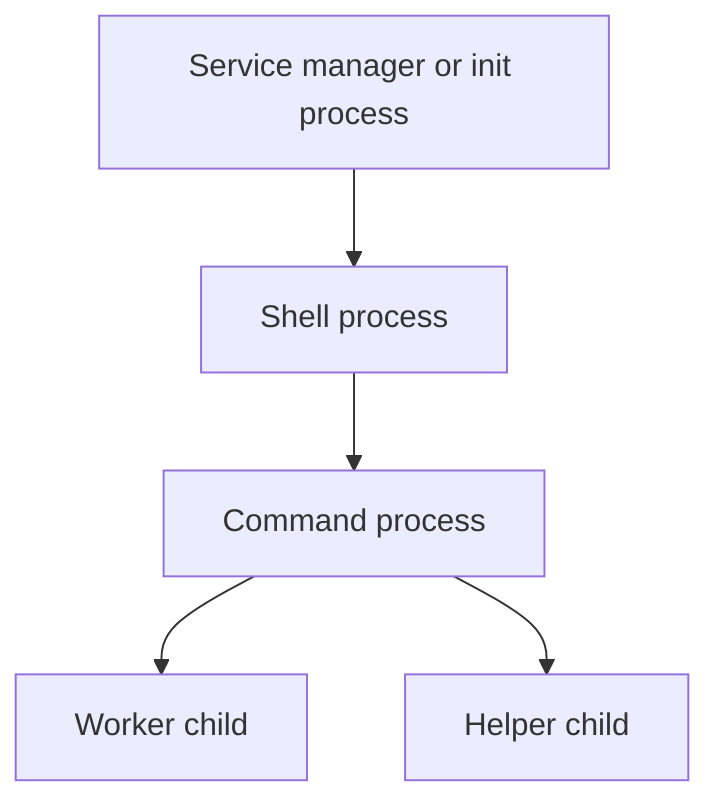
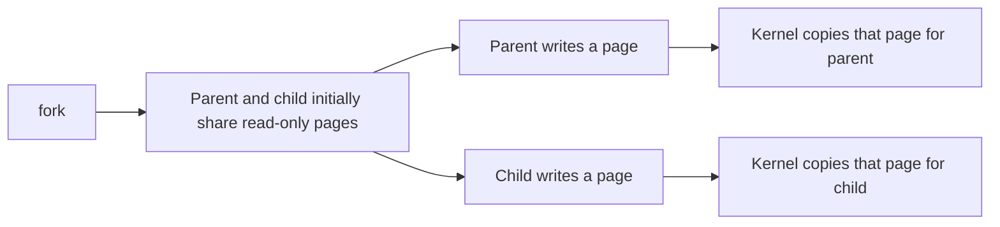
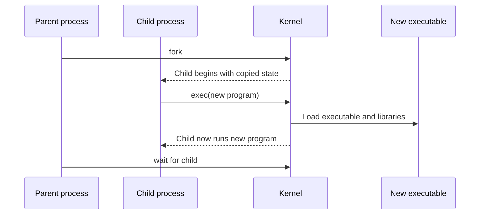
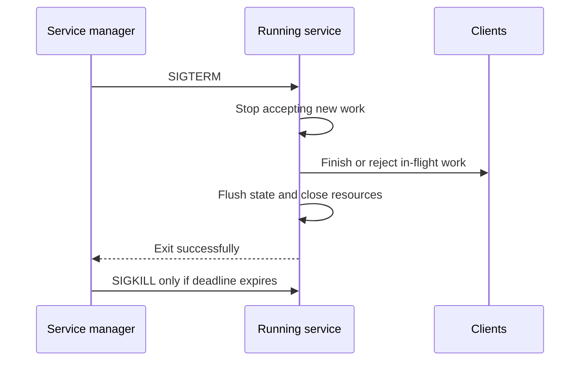
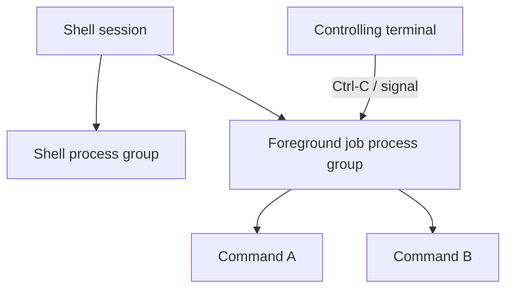

> Stage 2 — Linux and Operating System Internals  
> Subject area 2.1 — The Operating System Model  
> Article 3

## The short version

A process is a running instance of a program together with its address space, threads, identity, open resources, and operating-system state. Linux creates processes, schedules them, lets them communicate, records how they exit, and reclaims their resources when their lifecycle is complete.

Signals are small asynchronous notifications that the kernel or another process can deliver to a process. They are used for events such as termination requests, invalid operations, child-process state changes, and user interrupts. A signal is not a general-purpose message queue; it carries limited information and can arrive at an inconvenient time.

A service is a program that performs ongoing work for other programs or users. Running a program as a service requires more than starting it once. The system must decide how to supervise it, restart it, stop it, provide logs, apply limits, and handle shutdown.

The central lifecycle is:

```text
Create → Run → Wait or communicate → Stop → Reap and clean up
```

## Where this article fits

The previous article explained how programs enter the kernel through system calls. Process creation, execution, waiting, signals, and termination are all operating-system services reached through those interfaces.

Later articles will examine scheduling, threads, memory, files, and concurrency in more depth. This article gives the process lifecycle that those topics operate inside.

## A program is not a process

A program is a stored set of instructions and data, usually represented by an executable file. A process is a live execution context created from that program.

The same executable can produce many independent processes:



The executable file is not the process's complete state. The process also has:

- A process identifier
- An address space
- One or more threads
- A current working directory
- Environment variables
- Command-line arguments
- User and group identity
- Signal dispositions and masks
- Open file descriptors
- Resource limits
- Scheduling state
- Parent and child relationships

Two processes running the same program can behave differently because these parts of their state differ.

## Process identifiers and relationships

Linux assigns a process identifier, or PID, to a process. Other processes use the PID when sending signals, waiting for termination, inspecting state, or applying resource policies.

Processes also have relationships. A process that creates another process is usually called its parent, and the newly created process is its child.



The relationship matters because the parent may be responsible for collecting the child's exit status. It also affects signal delivery, process groups, job control, and what happens if the parent exits first.

The PID is meaningful only within a PID namespace. Containers can use namespaces so that a process sees a different process-numbering environment from the host. The underlying process still has a host-level identity, but the visible PID depends on the namespace.

## What Linux creates when it creates a process

Creating a process requires more than choosing a PID. Linux must create or establish execution state, memory mappings, credentials, file-descriptor state, signal state, scheduling information, and relationships with other processes.

Some of these resources can be shared between related processes. Others are copied or created independently. The exact behavior depends on the creation interface and flags.

The traditional Unix model is often explained with two operations:

1. `fork` creates a child process based on the calling process.
2. `exec` replaces the current process image with another program.

Linux also provides the more general `clone` and related interfaces, which can create processes or threads while choosing which parts of the execution state are shared. The simple `fork` and `exec` model is still the best starting point.

## `fork`: creating a child

`fork` creates a child process that initially resembles the calling process. The child receives a different PID and begins execution near the return from `fork`.

The call returns different values:

- In the child, it returns `0`.
- In the parent, it returns the child's PID.
- If creation fails, the parent receives `-1` and an error.

```c
pid_t child = fork();

if (child < 0) {
    perror("fork");
    return 1;
}

if (child == 0) {
    // Child process.
    printf("child: pid=%ld\n", (long)getpid());
} else {
    // Parent process.
    printf("parent: child pid=%ld\n", (long)child);
}
```

After `fork`, both processes continue from the same point in the source, but they have separate execution contexts. A variable that appears to have the same value in both processes is no longer shared memory simply because it had the same value before the fork.

### Copy-on-write

Copying an entire address space immediately would be expensive. Linux commonly uses copy-on-write. The parent and child initially refer to shared physical pages marked so that a write causes a private copy to be created.



Copy-on-write makes process creation cheaper when the child quickly calls `exec` and replaces its address space. It still has costs: page-table work, memory pressure when pages are modified, and complications for large processes or memory-heavy workloads.

## `exec`: replacing the process image

An `exec` operation loads a new executable into the current process and replaces the old program image. It does not normally create a new PID. The process keeps its identity while its code, data, stack, and other program image state are replaced.



This separation is useful. A shell can create a child and then ask that child to become any command. The shell keeps running while the child process runs the selected program.

The `exec` family differs in how it specifies the program path, arguments, and environment. The common behavior is that successful `exec` does not return to the old program because the old process image no longer exists. If `exec` returns, it failed and the child must handle the error.

## File descriptors across `fork` and `exec`

Open file descriptors are part of process state. After `fork`, the child normally inherits descriptors that refer to the same underlying open file descriptions as the parent.

This is how a shell can create a pipeline:

```text
process A stdout → pipe write end
process B stdin  → pipe read end
```

The parent creates a pipe, forks children, and connects each child's standard input or output with `dup2`. The children then call `exec` to become the requested commands.

Descriptors can also remain open across `exec` unless they have the close-on-exec flag. Accidental descriptor inheritance can keep pipes from reaching end-of-file, keep files open longer than expected, or give a new program access to a resource it should not have.

The close-on-exec rule is therefore both a correctness and security concern.

## `wait`: collecting a child

When a child process exits, the kernel records information such as its exit status and keeps a small process-table entry until the parent collects it. The parent collects that state with `wait`, `waitpid`, or a related interface.

```c
int status;
pid_t result = waitpid(child, &status, 0);

if (result == -1) {
    perror("waitpid");
    return 1;
}

if (WIFEXITED(status)) {
    printf("child exit code: %d\n", WEXITSTATUS(status));
} else if (WIFSIGNALED(status)) {
    printf("child was terminated by signal %d\n", WTERMSIG(status));
}
```

The status is not just one integer in practice. It can describe normal exit, termination by signal, stopping, or continuation. The macros interpret the encoded status safely.

The parent can choose to wait for a specific child, wait for any child, or use a non-blocking mode to check whether a child has changed state.

## Zombies and orphans

A zombie is a child that has exited but whose parent has not yet collected its exit status. The child is no longer executing and its memory has been reclaimed, but the kernel keeps a small record so the parent can learn how it ended.

```text
Child exits
    ↓
Kernel releases most child resources
    ↓
Exit status remains
    ↓
Parent calls waitpid
    ↓
Zombie record is removed
```

A few short-lived zombies may be harmless, but a parent that continually creates children and never reaps them can exhaust process-table resources.

An orphan is a process whose parent has exited. Linux reparents it to an appropriate system process, often PID 1 inside its PID namespace, or to a configured subreaper. The new parent can then perform required supervision or reaping.

Zombies and orphans are different:

- A zombie has exited but has not been reaped.
- An orphan is still running but has lost its original parent.

Confusing these terms can lead to incorrect debugging and cleanup decisions.

## Exit status

A process can exit normally with an integer status, or it can be terminated by a signal. The parent can inspect which occurred.

Exit status conventions are not a complete error-reporting system, but they are useful for scripts, service managers, and parent processes. A program should choose meaningful status values and avoid treating every nonzero value as the same kind of failure.

When a process is terminated by a signal, the parent can identify the signal. A service manager may use that information to distinguish a deliberate stop from a crash or resource failure.

## Signals are asynchronous notifications

A signal is a small notification delivered to a process or thread. Signals can come from the kernel, another process, a terminal, a timer, or the process itself.

Common signals include:

- `SIGINT`: commonly generated by pressing Ctrl-C in a terminal
- `SIGTERM`: a request to terminate cleanly
- `SIGKILL`: immediate termination that cannot be handled or ignored
- `SIGSTOP`: stop execution; it cannot be handled or ignored
- `SIGHUP`: historically associated with a terminal closing; often used by services as a reload request
- `SIGCHLD`: notifies a parent that a child changed state
- `SIGSEGV`: invalid memory access or another segmentation fault condition
- `SIGPIPE`: writing to a closed pipe or stream in common cases
- `SIGUSR1` and `SIGUSR2`: application-defined notifications

The exact default action depends on the signal. It may terminate the process, stop it, continue it, ignore it, or create a core dump.

Signals are deliberately limited. They are useful for notification, but they are not a reliable queue of arbitrary messages. Multiple instances of some signals may be coalesced, and a process may receive them at an inconvenient point in its execution.

## Signal dispositions and masks

A process has a disposition for each signal: the default action, ignore, or a handler function. A signal handler is code the process asks the kernel to run when the signal is delivered.

A process can also block a signal temporarily. A blocked signal becomes pending and may be delivered when it is unblocked. Blocking is useful when a program needs to update shared state without being interrupted by a signal at a dangerous point.

Threads complicate delivery. A signal may be directed to one specific thread or to the process, in which case the kernel chooses an eligible thread according to signal rules. A program should not assume that a process-wide signal arrives on the thread it would prefer.

## Signal handlers must be very small

A signal can arrive between almost any two instructions. The handler therefore runs in an execution context where many normal library operations are unsafe.

The handler should do as little as possible, usually setting a flag of type `volatile sig_atomic_t` or writing a byte to a dedicated file descriptor. It should not call functions such as `printf`, allocate memory, acquire a mutex, or use data structures that another operation may be modifying.

```c
static volatile sig_atomic_t stop_requested = 0;

static void handle_term(int signal_number) {
    (void)signal_number;
    stop_requested = 1;
}

int main(void) {
    struct sigaction action = {0};
    action.sa_handler = handle_term;
    sigemptyset(&action.sa_mask);
    sigaction(SIGTERM, &action, NULL);

    while (!stop_requested) {
        do_one_unit_of_work();
    }

    release_resources_and_exit();
}
```

The handler only records that termination was requested. The main loop notices the flag and performs cleanup in normal execution.

This is a simple pattern, but real programs also need to handle blocking calls, cancellation, memory visibility, and the possibility that another signal arrives. The important rule is to keep asynchronous signal code minimal.

## `SIGTERM` and graceful shutdown

`SIGTERM` is commonly used to ask a process to terminate. The word “ask” matters. A process can handle the signal, finish a current unit of work, stop accepting new work, close resources, flush important state, and exit.

A graceful shutdown often follows this sequence:



The service needs a shutdown deadline. If it waits forever for one broken dependency, the manager may eventually send `SIGKILL`, which cannot be handled and may interrupt cleanup.

Graceful shutdown is a protocol between the supervisor and the service. The supervisor sends a signal and waits. The service changes behavior and exits within the allowed time.

## `SIGKILL` is not graceful

`SIGKILL` terminates a process immediately. The process cannot catch it, ignore it, or run a handler before termination.

The kernel still releases many local process resources after termination, but application-level cleanup code does not run. Buffered data may not be flushed, temporary state may remain, and external operations may be left uncertain.

`SIGKILL` is useful when a process is stuck or refuses to stop, but it should be a last resort for services that need graceful shutdown.

## Signals, pipes, and robust control

Signals are not always the best way to coordinate complex application behavior. A program that needs reliable commands, payloads, ordering, acknowledgments, or backpressure should use a pipe, socket, queue, or another explicit protocol.

Signals are a good fit for small notifications such as:

- Stop soon
- Reload configuration
- Reap children
- Dump diagnostic state
- Wake up and check work

They are a poor fit for sending a large job description or a sequence of commands that must not be lost.

## Process groups and sessions

A process group is a collection of related processes. A session is a higher-level collection that can contain process groups and may have a controlling terminal.

Shell job control depends on these concepts. When a shell starts a pipeline, it can place the processes into a process group. The terminal can then deliver Ctrl-C to the foreground process group rather than only to one process.



Process groups also matter when a supervisor needs to terminate a service and all of its children. Sending a signal only to the parent may leave workers running. The supervisor may need to target the appropriate process group or use a cgroup.

## Daemons and long-running services

A daemon is a long-running background process that performs work without an interactive terminal. Examples include web servers, schedulers, logging agents, and database servers.

Older daemonization patterns often involved forking, creating a new session, changing the working directory, resetting file permissions, and redirecting standard streams. Modern Linux systems usually prefer starting services under a service manager rather than making every program perform all daemonization steps itself.

The important service responsibilities remain:

- Start with a known configuration
- Report startup failure clearly
- Handle signals
- Write or expose logs
- Stop accepting work during shutdown
- Release or persist state
- Exit with a meaningful status
- Avoid leaving unmanaged children

## Service supervision

A service manager starts and supervises long-running processes. It can provide environment configuration, restart policies, resource limits, dependency ordering, logging integration, and shutdown deadlines.

On many Linux systems, `systemd` is the service manager. A simple unit might look like this:

```ini
[Unit]
Description=Example worker
After=network-online.target

[Service]
ExecStart=/usr/local/bin/example-worker
Restart=on-failure
RestartSec=2
TimeoutStopSec=30

[Install]
WantedBy=multi-user.target
```

The unit says that the manager should start the program, restart it after failure, wait two seconds before a restart, and give it up to 30 seconds to stop after a termination request.

This configuration does not make the program graceful automatically. The program still needs to handle `SIGTERM`, stop new work, finish or cancel existing work, and exit within the deadline.

## Crash loops

A restart policy can improve availability when a process fails temporarily. It can also create a crash loop when the process starts, encounters the same bad configuration or dependency failure, exits, and is immediately restarted.

```text
Start
  ↓
Fail during initialization
  ↓
Restart immediately
  ↓
Fail for the same reason
  ↓
Consume CPU and fill logs
  ↓
Repeat
```

A good supervisor uses restart delays, rate limits, and status reporting. A good service distinguishes configuration errors that require human action from transient failures that may recover automatically.

Restarting is recovery only when the new process has a reasonable chance of making progress.

## Parent death and orphaned children

A service that creates workers must define what happens if the parent exits. Workers may continue running, become reparented, or become part of a supervisor's process group or cgroup.

Unmanaged children can continue serving traffic, hold ports, keep files open, or perform work after the service that created them is gone. A supervisor should know which processes belong to the service and should be able to stop the whole group when necessary.

This is one reason process supervision is more than checking whether one PID is alive.

## A realistic production example

Imagine a service that receives `SIGTERM` during a rolling deployment. The process exits immediately because it uses the default signal action. Existing requests are interrupted, messages in memory are lost, and clients retry some operations.

The retries create duplicate work while the new instance is starting. A database connection pool shows a spike, and a downstream service receives more requests than normal.

The team changes the shutdown protocol:

1. The service stops accepting new requests.
2. The load balancer stops sending traffic after the readiness state changes.
3. Existing requests receive a deadline to finish.
4. Background workers stop taking new jobs.
5. Important in-memory state is flushed or handed to durable storage.
6. Connections and file descriptors are closed.
7. The service exits before the supervisor's stop timeout.

The deployment now has a chance to be safe because process termination became an explicit protocol instead of an immediate event.

## How experienced engineers investigate a process problem

When a process behaves unexpectedly, experienced engineers usually check:

- Is the process running, sleeping, stopped, or becoming a zombie?
- What is its PID, parent PID, process group, and session?
- What executable and arguments does it have?
- Which user and groups does it run as?
- Which file descriptors and sockets does it hold?
- How much CPU and memory does it use?
- Which signals are blocked or pending?
- Does it have children that outlived it?
- Is a service manager restarting it?
- Is it stuck waiting for a resource or failing during startup?

Tools such as `ps`, `/proc`, `pstree`, `lsof`, `ss`, `strace`, `journalctl`, and `systemctl` answer different parts of this investigation. The tool output becomes useful only when connected to a lifecycle hypothesis.

## Interview definitions

### What is a process?

> A process is a running instance of a program with its own address space, execution state, identity, and operating-system-managed resources.

### What does `fork` do?

> `fork` creates a child process that initially resembles the calling process. The parent and child continue independently, and the return value tells each one which process it is.

### What does `exec` do?

> `exec` replaces the current process image with a new executable. It normally keeps the same PID, but the old code, data, and execution image are replaced.

### What does `waitpid` do?

> `waitpid` lets a parent observe and collect a child process's state, including its exit status, so the child does not remain a zombie.

### What is a signal?

> A signal is a small asynchronous notification delivered to a process or thread to report an event or request an action such as termination, reload, or child-state handling.

### What is a zombie process?

> A zombie is a process that has exited but whose parent has not yet collected its exit status.

### What is an orphan process?

> An orphan is a still-running process whose original parent has exited and which has been reparented to another supervising process.

### What is graceful shutdown?

> Graceful shutdown is an intentional process-stopping procedure that stops new work, finishes or cancels existing work, releases resources, and exits within a defined deadline.

## Interview follow-up questions

### Why are `fork` and `exec` separate operations?

> Separating them lets a parent create a child, configure its file descriptors, environment, identity, or process group, and then replace the child image with the desired program. A shell uses this model to implement commands and pipelines.

### Does `exec` create a new process?

> No. It replaces the current process image and normally keeps the same PID. A new process is typically created with `fork` or a related creation interface before `exec` is called.

### Why do zombies exist?

> The kernel keeps a small exit record so the parent can learn how the child finished. The record remains until the parent calls a wait operation, so a parent that does not reap children can accumulate zombies.

### What is the difference between `SIGTERM` and `SIGKILL`?

> `SIGTERM` is a request that the process can handle to shut down cleanly. `SIGKILL` cannot be caught or ignored and terminates the process immediately, so application cleanup code does not get a chance to run.

### Why should a signal handler do very little?

> Signals can arrive asynchronously while normal code is in the middle of an operation. Many library functions and synchronization operations are unsafe in a handler, so the handler should usually record the event and let the main loop perform the real work.

### How should a service handle `SIGTERM`?

> It should stop accepting new work, let existing work finish or cancel within a deadline, flush important state, release resources, and exit. The supervisor should use a forced kill only if the service exceeds the shutdown deadline.

### Why can a restart policy create an outage?

> If the service fails for a persistent reason, rapid restarts create a crash loop that consumes resources, fills logs, and prevents operators from seeing the original failure clearly. Restart delays and failure-rate limits help contain this behavior.

## Common misconceptions

### “`fork` copies all process memory immediately.”

Linux commonly uses copy-on-write, so parent and child can initially share physical pages until one of them writes. The logical address spaces are separate even when physical pages are temporarily shared.

### “`exec` starts a child process.”

`exec` replaces the current process image. It does not normally create a new PID.

### “A zombie is using all the memory of its old process.”

Most process resources are released when the child exits. A zombie mainly retains a small exit record until the parent reaps it, but many zombies can still consume process-table resources.

### “An orphan process is automatically a leak.”

An orphan is reparented and may be intentional, although an unexpected orphan can indicate a supervision problem. A zombie is the process state that specifically indicates an unreaped exit.

### “Signals are reliable messages.”

Signals are limited asynchronous notifications. They do not provide the payload, ordering, buffering, and acknowledgment guarantees of a proper IPC protocol.

### “A service is reliable if its process is alive.”

A process can be alive but stuck, unable to accept work, disconnected from dependencies, or returning errors. Supervision should include health and readiness behavior, not only PID existence.

## Summary

Linux processes are running programs with identity, memory, execution state, relationships, and operating-system-managed resources. `fork` creates a child, `exec` replaces a process image, and `waitpid` lets a parent collect a child's exit state.

Signals provide lightweight asynchronous notifications, but they must be handled carefully because they can arrive at any time and carry limited information. `SIGTERM` supports graceful shutdown, while `SIGKILL` ends a process without giving application code a chance to clean up.

Long-running services need supervision, restart policies, shutdown deadlines, logging, resource limits, and clear ownership of child processes. A healthy service is not merely a live PID; it is a process that can make progress, report its state, and stop safely when required.

## If you want to build this later

Build a small shell that supports one command at a time, then extend it gradually.

The first version should create a child with `fork`, replace the child with `exec`, and wait for it with `waitpid`. Add background execution, pipelines, process groups, Ctrl-C handling, and graceful cleanup. Finally, run the shell's commands under a simple service supervisor and observe what happens when a child crashes or refuses to stop.

This project connects process creation, file descriptors, signals, process groups, exit status, zombies, and supervision in one system.
