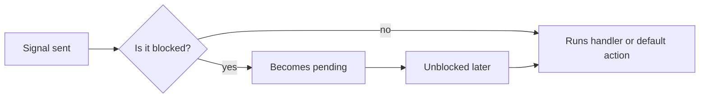
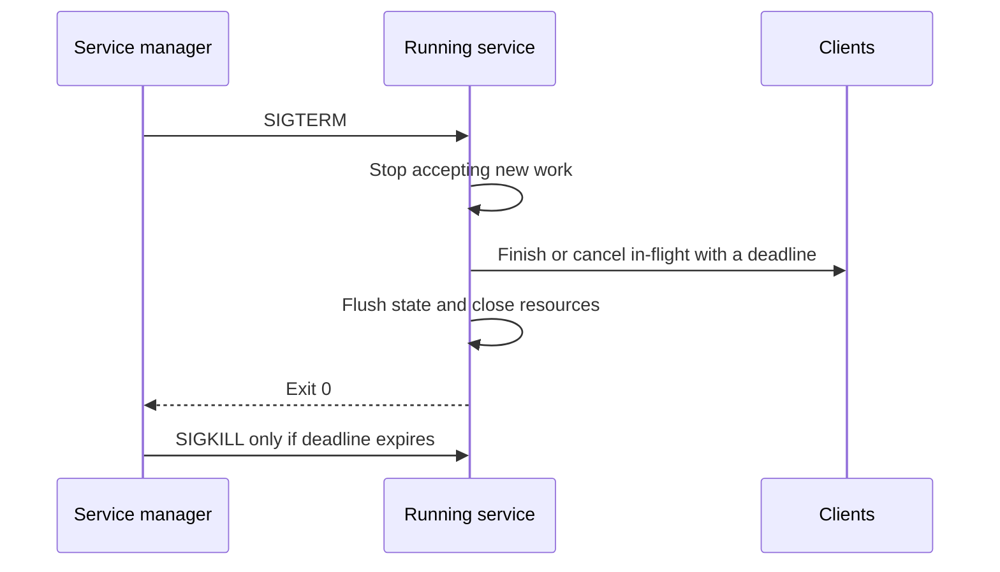
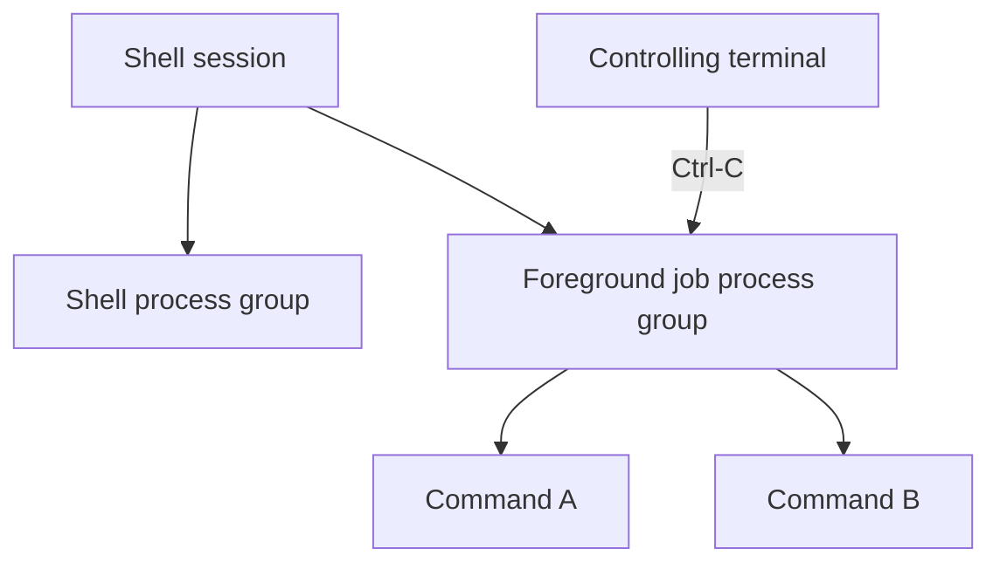

> Stage 2 — Linux and Operating System Internals  
> Subject area 2.1 — The Operating System Model  
> Article 4

## The short version

A process does not only exit when it finishes its work. It can be notified from outside at any moment. A signal is that notification. It is small, it carries little data, and it can arrive between any two instructions.

A signal can mean that a user pressed Ctrl-C, that a child finished, that memory was accessed incorrectly, or that a supervisor wants the service to stop. The most important signal for a backend is `SIGTERM`. It asks a service to stop, but it does not force it. The service is expected to finish what it is doing, stop accepting new work, and exit within a deadline. If it takes too long, the supervisor sends `SIGKILL`, which cannot be handled and ends the process immediately.

The supervisor, often `systemd` on Linux, is the program that starts the service, restarts it on failure, sets its limits, and sends the shutdown signal. A service that does not handle `SIGTERM` correctly can look alive while it is dropping requests, and a supervisor that restarts too quickly can turn a configuration error into a crash loop.

A useful picture for shutdown is simple. `SIGTERM` should start a drain, not an immediate exit. Stop accepting new connections, let in-flight requests finish or cancel within a timeout, flush what must be saved, and then exit. The supervisor waits until `TimeoutStopSec` and only then uses `SIGKILL`.

## Where this article fits

The previous article followed the lifecycle of a process, from `fork` and `exec` to `wait` and reaping zombies. This article is about the events that interrupt that lifecycle.

You need this to understand process state in `/proc`, to debug why a container does not stop, and to build a backend that can be deployed without dropping traffic. Scheduling, filesystem views, and resource limits all build on the idea that a service is a supervised group of processes, not a single PID.

## Signals are asynchronous notifications

A signal can be sent by the kernel itself, by another process with `kill`, by a terminal when you press Ctrl-C, or by the process that raised it. The signal does not carry a payload like a message queue. It is just a number with a meaning.

Some signals appear often enough to remember. `SIGINT` is what the terminal sends on Ctrl-C. `SIGTERM` is the polite request to terminate. `SIGKILL` and `SIGSTOP` are the two that cannot be caught or ignored. `SIGHUP` once meant a terminal closed, and many services now use it to reload configuration. `SIGCHLD` tells a parent that a child changed state. `SIGSEGV` usually means an invalid memory access. `SIGPIPE` often means writing to a pipe whose reader closed. `SIGUSR1` and `SIGUSR2` are left for an application to define.

A signal is not a reliable message queue. If the same signal is sent twice quickly, the kernel may coalesce them and deliver it once. The default action for a signal depends on the signal. It may terminate the process, stop it, resume it, ignore it, or dump core. Because delivery is asynchronous, the signal can arrive while the program is in the middle of holding a lock or updating a structure.

## Signal dispositions and masks

For each signal, a process has a disposition. It can be the default action, it can be ignored, or it can be a handler function that the kernel will run. A process can also block a signal. A blocked signal does not disappear. It becomes pending and will be delivered when the process unblocks it. This is useful when a short section of code must not be interrupted, for example while updating a global list of children.



The diagram shows the path, but the explanation after matters more. Blocking does not mean the signal is lost, only delayed. Threads make this more subtle. A signal can be directed to a specific thread, or to the process as a whole. In the second case, the kernel chooses a thread that is allowed to handle it. You should not assume that `SIGTERM` sent to a multi-threaded HTTP server arrives on the thread running your handler.

## Signal handlers must be very small

Because a signal can arrive between any two instructions, the handler runs in a context where most library functions are not safe. Calling `printf`, allocating memory, or taking a mutex inside a handler can corrupt the same state the interrupted code was using.

The safe pattern is to do as little as possible in the handler and let the main loop do the real work. Usually that means setting a flag of type `volatile sig_atomic_t` or writing a single byte to a `self-pipe` that the main loop watches.

The following program shows the flag pattern.

```c
static volatile sig_atomic_t stop_requested = 0;

static void handle_term(int signal_number) {
    (void)signal_number;
    stop_requested = 1;
}

int main(void) {
    struct sigaction action = {0};
    action.sa_handler = handle_term;
    sigemptyset(&action.sa_mask);
    sigaction(SIGTERM, &action, NULL);

    while (!stop_requested) {
        do_one_unit_of_work();
    }

    release_resources_and_exit();
}
```

The handler only records that termination was requested. The loop sees the flag on its next iteration, stops taking new work, and cleans up in ordinary code where `printf` and locks are safe again. In a real program you also need to plan for blocking calls like `read` or `accept`. A signal may make them return with `errno == EINTR`, or you may need to use `pselect` or `signalfd` so the wait can be interrupted cleanly. The important rule stays the same. Keep the asynchronous part minimal and move decisions to the synchronous loop.

## `SIGTERM` and graceful shutdown

When a supervisor wants a service to stop, it sends `SIGTERM`. The word asks is important. `SIGTERM` does not mean the process must disappear instantly. It means the process should start shutting down.

A graceful shutdown follows a protocol between the manager and the service. The manager sends `SIGTERM` and waits.



For a backend, that means a few concrete steps. Close the listening socket so the load balancer can route new requests elsewhere. That is why a readiness probe should start failing as soon as `SIGTERM` is received. Give in-flight requests a deadline that is shorter than the supervisor's `TimeoutStopSec`, so they have time to finish or cancel. For HTTP handlers that is where `context.WithTimeout` belongs. Tell background workers to stop taking new jobs, flush what must be durable, and close file descriptors. If the service needs more than the time allowed, the manager will send `SIGKILL` and the remaining state will be lost, so each stage should have its own timeout.

## `SIGKILL` is not graceful

`SIGKILL` ends a process immediately. The kernel still releases memory and file descriptors, but the program's own cleanup does not run. Buffered logs may not be flushed, temporary files can be left behind, and a message that was already sent but not acknowledged will remain uncertain.

It is the right tool when a process is stuck and does not respond to `SIGTERM`, but it should not be the normal way to stop a service. A deployment that routinely uses `kill -9` is hiding a shutdown bug.

## Signals are not a general control plane

Signals are good for small, infrequent notifications. Telling a process to stop soon, to reload configuration, to reap children, or to dump diagnostics all fit. They are not good for sending work descriptions, payloads, or ordered commands. A program that needs those should use a pipe, a socket, or a queue where bytes are buffered, ordered, and acknowledged. If you need backpressure, signals cannot provide it.

## Process groups and sessions

A process group is a set of processes that the shell manages together. A session is a set of process groups, often associated with a terminal. When you run a pipeline in a shell and press Ctrl-C, the terminal sends `SIGINT` to the foreground process group, not to a single PID.



The same idea matters for a supervisor. If a service started several workers and you only send `SIGTERM` to the parent, the workers can keep running and hold the listening port. The supervisor should send the signal to the process group or, more reliably, track the whole control group so it can stop everything that belongs to the service.

## Daemons and long-running services

A daemon is just a long-running service without a terminal, like a web server or a scheduler. Older guides tell you to double-fork, create a new session, change directories, and close standard streams. On modern Linux, the service manager already does that. You get more value by making the service itself behave well. Start with known configuration and validate it at boot. Report a clear error if startup fails. Handle `SIGTERM` and `SIGHUP`. Expose logs and a readiness endpoint. Drain on shutdown and exit with a status that tells the manager whether to restart.

## Service supervision

On most systems today, `systemd` is that manager. It provides environment setup, restart policy, resource limits, dependency ordering, logging, and a deadline for shutdown.

A small unit shows the important fields.

```ini
[Unit]
Description=Example worker
After=network-online.target

[Service]
ExecStart=/usr/local/bin/example-worker
Restart=on-failure
RestartSec=2
TimeoutStopSec=30

[Install]
WantedBy=multi-user.target
```

The file says to start the binary, restart it a few seconds after a failure, and wait up to thirty seconds for it to stop after `SIGTERM`. The unit does not make the program graceful on its own. The program still has to handle the signal, stop new work, and exit before the deadline.

## Crash loops

A restart policy helps when a failure is temporary, like a downstream dependency that is briefly unavailable. It hurts when the failure is persistent, like a bad configuration file. Then the service starts, fails for the same reason, exits, and is restarted immediately. It burns CPU, fills logs, and hides the original error.

A good supervisor adds a delay and a rate limit, and a good service uses different exit codes for different cases. A code that means a configuration error should tell the manager not to restart, while a code that means a transient error can allow a restart.

The same check applies to health probes. A liveness probe that restarts a container while it is still warming up can create the loop it was meant to cure.

## Parent death and orphaned children

When a parent exits, its children do not necessarily exit. Linux reparents them to PID 1 or to a configured subreaper in that PID namespace. An orphaned worker can keep serving traffic, hold a port, or keep files open after the service that created it is gone. This is why checking only whether one PID exists is not enough. The supervisor should know which control group or process group belongs to the service and be able to stop the whole group. Health checks should test whether the service can handle a request, not just whether a process is alive.

## A realistic production example

A service received `SIGTERM` during a rolling deployment and exited immediately because it had not installed a handler. It used the default action, so in-flight HTTP handlers were cut, messages that lived only in memory were lost, and clients retried. Those retries created duplicate work while the new replica was still starting, and a downstream connection pool spiked.

The team made shutdown explicit. On `SIGTERM` the service marked itself as not ready so the load balancer would drain. It stopped the accept loop, gave in-flight requests a deadline a few seconds shorter than `TimeoutStopSec`, told background workers to stop taking new jobs, flushed important state to durable storage, closed listeners and idle connections, and then exited. When the next deployment sent `SIGTERM`, traffic drained instead of dropping. The change was not about adding a new library. It was about treating termination as a protocol with a deadline.

## How experienced engineers investigate

When a process does not behave as expected, they rarely look at signals first. They start with the lifecycle they already know. Is the process running, sleeping, stopped, or a zombie? What are its PID, parent PID, and process group? Which user and groups does it run as? Which file descriptors and sockets does it hold? How much CPU and memory does it use? Are any signals blocked or pending in `/proc/<pid>/status`? Does it have children that outlived it, visible in `pstree`? Is a service manager restarting it, visible in `systemctl status` and `journalctl -u example-worker`?

The tools answer only when connected to a hypothesis. Knowing that `SIGTERM` was delivered but the handler blocked on `accept` without handling `EINTR` explains why the process did not stop, while just seeing that the PID exists does not.

## Interview definitions

### What is a signal?

> A signal is a small asynchronous notification that the kernel or another process sends to a process, for example to tell it to terminate, to report that a child changed state, or to indicate an invalid memory access. It carries little data, it can be coalesced, and it can arrive between any two instructions.

### What is the difference between `SIGTERM` and `SIGKILL`?

> `SIGTERM` asks a process to terminate and can be handled, so the process can drain and clean up. `SIGKILL` cannot be caught or ignored and ends the process immediately, so no application cleanup runs.

### What is graceful shutdown?

> Graceful shutdown is a procedure where a process stops accepting new work, finishes or cancels in-flight work within a deadline, flushes important state, releases resources, and exits, so the supervisor only needs to use `SIGKILL` if the deadline expires.

### What is a zombie process? An orphan?

> A zombie is a process that has exited but whose parent has not yet collected its status with `wait`. An orphan is a still-running process whose parent has exited and which has been reparented to another supervisor.

## Interview follow-up questions

### Why should a signal handler do very little?

> The handler can run between any two instructions, while the interrupted code might hold a lock or be in the middle of updating a structure. Many library functions are not safe there, so the handler should just set a flag and let the main loop do the work.

### How should a backend handle `SIGTERM`?

> It should mark itself not ready, stop accepting, give in-flight handlers a timeout shorter than `TimeoutStopSec`, stop workers from taking new jobs, flush state, and exit before the deadline.

### Why can a restart policy create an outage?

> If the service exits because of a persistent configuration error, restarting it immediately just repeats the failure, burns resources, and hides the original error. A delay and a rate limit, plus distinct exit codes for config versus transient errors, prevent the loop.

## Common misconceptions

### “A service is healthy if its PID exists.”

A PID can exist while the process is stuck, blocked on a resource, or returning errors to every request. Check readiness and metrics, not just whether the process is alive.

### “Signals are reliable messages.”

They are not. They carry little information, they can be coalesced, and they have no acknowledgment. Use a pipe or a queue when you need payloads and ordering.

### “`SIGKILL` is the safe way to stop a service.”

It skips cleanup. Buffered data can be lost and external leases can be left in an uncertain state. Prefer `SIGTERM` with a deadline.

## Summary

A process gives you a container for execution. Signals give you a way to notify it. `SIGTERM` asks for a graceful drain, `SIGKILL` forces an immediate end, and a handler should do almost nothing except tell the main loop what happened. Long-running services need a supervisor that provides configuration, restart policy, resource limits, logging, and a deadline for shutdown. A healthy service is not just a live PID. It is a process that can make progress, report whether it is ready, and stop without dropping correctness.

## If you want to build this later

Extend the small shell from the previous article. Make it handle `SIGTERM` with the flag pattern and make a supervisor that respects a timeout. The supervisor should send `SIGTERM`, wait for `TimeoutStopSec`, and then send `SIGKILL` if the process has not exited. Have it kill the whole process group, not just the parent. Test it with a handler that sleeps through `SIGTERM` and with a pipeline where one stage ignores the signal. Check that the group is stopped and that zombies are still reaped. Then run the same logic as a `systemd` unit and watch how it throttles a crash loop.
