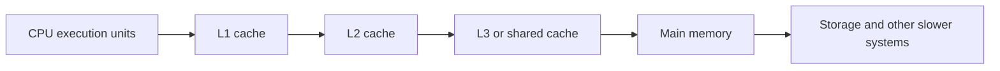
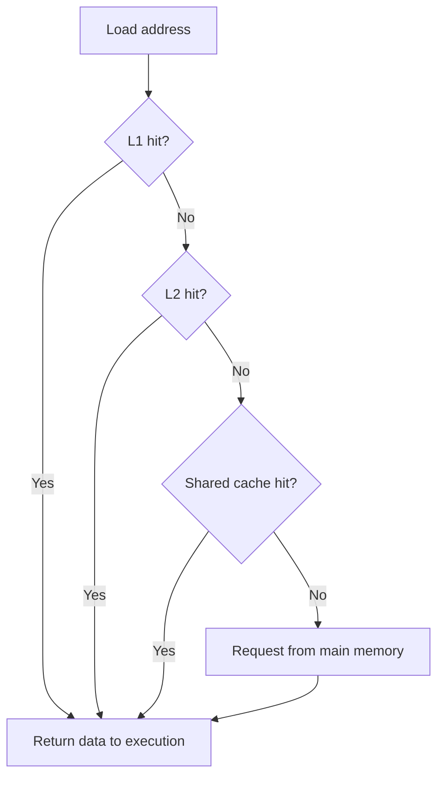
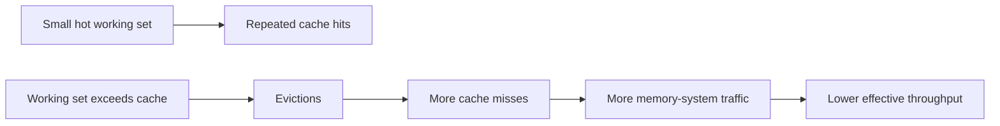
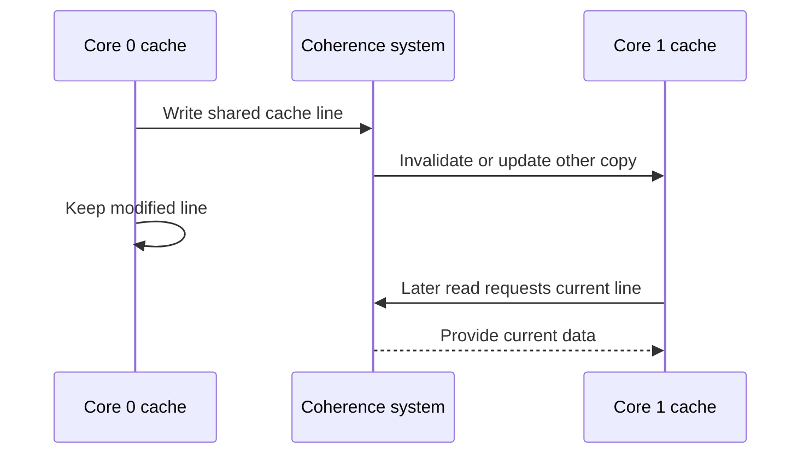

The previous chapter showed how to read cycles, instructions, IPC, branch misses, and cache counters to spot a slowdown. This chapter explains the memory behavior behind those numbers. It is the third chapter of Stage 3.

A CPU does math much faster than main memory can supply new data. Caches close this gap. They keep recently used data in small, fast storage near the processor. When a load asks for an address, the CPU first checks the nearby cache levels. If the data is there, the load is a cache hit. If not, the CPU must fetch it from a slower level or from main memory. That is a cache miss.

Caches work because programs often show locality. Temporal locality means a program reuses recent data. Spatial locality means a program soon uses data near a recently used address. A loop that reads an array from start to end shows good spatial locality. A program that reuses a small set of values shows good temporal locality.

The key lesson for systems engineering is this. Memory speed depends not only on how much data a program uses, but also on how it arranges and visits that data. Two algorithms with similar source code can run at very different speeds. One keeps its working data near the CPU. The other waits for memory again and again.

## Why caches exist

The processor runs in cycles measured in fractions of a nanosecond. Main memory sits farther from the CPU and takes much longer to reach. If every load waited for main memory, the CPU would sit idle much of the time.



The exact cache layout depends on the processor. A typical multi-core machine has small private L1 caches, larger L2 caches, and a shared cache used by several or all cores. Some processors differ. The cache names do not guarantee the same behavior across CPU families.

The hierarchy is a trade-off. Small storage can sit close to the execution units and be reached quickly. Large storage holds more data but usually takes longer to search or reach. The CPU tries to make most accesses hit in a nearby level.

## What a cache actually stores

A cache does not usually store one variable at a time. It moves and tracks fixed-size blocks called cache lines. A cache line holds several adjacent bytes. On modern systems it is often 64 bytes, but the exact size depends on the architecture.

If a program loads one byte from an address, the CPU may bring the whole cache line into the cache. A later load from a nearby address can then hit, because that data arrived inside the same line.

```text
Cache line:  [byte 0 ... byte 63]
Address:                  ^
                        requested byte
```

This is the hardware reason that sequential access is often fast. The program asks for one element, and the cache brings nearby elements with it. It is also why touching one byte in each of many far-apart regions wastes most of every fetched line.

## Tags, sets, and cache lookup

At a high level, a cache splits an address into parts. It uses some bits to pick a set. It stores some address bits as a tag. It uses the offset bits to find the byte inside the cache line.

```text
Address bits:
    [              tag ][ set index ][ line offset ]
                               |              |
                               |              +-- byte inside the cache line
                               +----------------- cache set to inspect
```

The exact bit layout depends on the cache size, line size, number of sets, and associativity. A set-associative cache lets several lines with the same set index live in one set. If too many active addresses map to the same set, they can evict each other. This can happen even when the total working data could fit in the cache. This is called conflict pressure.

Software engineers usually do not compute cache index bits during normal app development. The useful idea is that a cache has a fixed capacity and placement rules. A working set can miss for three reasons. It may be too large. The access pattern may cause conflicts. Or other cores and programs may be using the cache.

## Cache hits and misses

A cache hit happens when the requested cache line is present at the level being checked and can be used. A cache miss happens when it is absent from that level.

A miss in L1 does not mean a trip to main memory. The CPU may find the line in L2, L3, or another cache. A miss at every cache level needs a slower request to memory.



A miss costs the most when a later instruction cannot run without the data. The CPU can sometimes hide a miss. It runs independent instructions while the request is in flight. If many loads miss at once, the memory system can saturate. This limits throughput even when single misses overlap.

## Temporal locality

Temporal locality means a program reuses recent data soon. A small hot set of data can stay in a cache and be reused without rereading it from slower memory.

```c
for (size_t round = 0; round < 1000; round++) {
    for (size_t i = 0; i < 1024; i++) {
        totals[i] += 1;
    }
}
```

If totals is small enough for the relevant cache, later rounds can reuse the same cache lines. The program still runs many additions, but it does not need to fetch the same data from main memory each time.

Temporal locality also matters in services. A routing table, config object, allocator metadata, or often-read user record can become a hot data set. If this hot set grows past a cache level, latency can rise even when the algorithm has not changed.

## Spatial locality

Spatial locality means a program uses nearby addresses close together in time. Arrays show this well, because adjacent elements sit in adjacent memory.

```c
for (size_t i = 0; i < n; i++) {
    sum += values[i];
}
```

When `values[i]` causes a cache line to be fetched, the line usually contains several later elements. The next iterations can therefore use data that is already nearby.

Spatial locality can be damaged by a large stride or by pointer chasing:

```c
for (size_t i = 0; i < n; i += 1024) {
    sum += values[i];
}
```

This loop may use only one element from each fetched line. This is not always wrong. Sometimes the algorithm requires this access pattern. But it gives the cache less useful work per fetched line.

Pointer-based structures can be even harder for the hardware:

```c
node = node->next;
```

The address of the next node is not known until the current node is loaded. The CPU cannot easily prefetch a chain of unrelated nodes far in advance, and each load may depend on the previous one.

## Arrays, structures, and data layout

Data layout determines which values share cache lines. Consider an array of structures:

```c
struct Particle {
    float x;
    float y;
    float z;
    float mass;
    int active;
};

struct Particle particles[count];
```

If a loop updates only `x`, `y`, and `z`, each cache line also brings `mass`, `active`, and possibly padding. That may be acceptable, but it is extra data traffic.

A structure-of-arrays layout stores each field separately:

```c
struct Particles {
    float x[count];
    float y[count];
    float z[count];
    float mass[count];
    int active[count];
};
```

Now a loop that updates positions can read the position arrays without loading unrelated fields. This layout can improve locality and vectorization, but it may make operations that need an entire particle less convenient. The right choice depends on the dominant access patterns.

The general rule is not arrays are always better than structures. The rule is: organize data around the operations that are actually hot. A layout that is excellent for one access pattern may be poor for another.

## Working sets and cache capacity

A working set is the data a workload actively needs during a period of execution. If the working set fits comfortably in a cache level, repeated access may be fast. If it exceeds that cache, lines are evicted and later accesses must fetch them again.



There is not one global cache-friendly size. L1, L2, and shared caches have different capacities. Other threads, the operating system, and unrelated processes also consume cache capacity. A data set that fits in L2 on an otherwise idle machine may not behave the same way under a real multi-threaded workload.

Blocking, also called tiling, is a technique for processing a large problem in smaller pieces so that a piece stays in cache while it is reused. Matrix multiplication is a classic example. Instead of operating on an entire large matrix at once, the algorithm works on smaller blocks.

```text
Large matrix:
    [ block ][ block ][ block ]
    [ block ][ block ][ block ]
    [ block ][ block ][ block ]

Process one group of blocks while they are still cache-resident.
```

Blocking does not make the cache larger. It changes the order of work so that the program reuses data before the cache has to evict it.

## A concrete locality example

For a two-dimensional array stored in row-major order, adjacent elements in a row are adjacent in memory:

```c
for (size_t row = 0; row < rows; row++) {
    for (size_t col = 0; col < cols; col++) {
        sum += matrix[row][col];
    }
}
```

This usually has good spatial locality. The following loop visits columns first:

```c
for (size_t col = 0; col < cols; col++) {
    for (size_t row = 0; row < rows; row++) {
        sum += matrix[row][col];
    }
}
```

If each row is far apart, the inner loop may touch one element from many different cache lines before returning to the next element of the first row. The algorithm performs the same number of additions, but the memory behavior can be much worse.

This example depends on the language's layout, dimensions, cache sizes, compiler transformations, and machine. Measure it rather than treating the loop order as a universal rule.

## Cache coherence between cores

Each CPU core may have private caches. If two cores access the same memory, the processor must maintain a coherent view of which value is current. Cache coherence is the mechanism that keeps cached copies consistent according to the architecture's rules.

Suppose Core 0 and Core 1 both have a cache line containing a shared counter. If Core 0 writes to the counter, Core 1's copy cannot remain silently valid. The hardware communicates between cores and changes ownership or invalidates stale copies according to its coherence protocol.



The exact protocol is processor-specific, but the performance consequence is general: sharing data between cores creates communication traffic. Frequent writes to the same line can make a multi-threaded program spend time transferring ownership instead of doing useful work.

Coherence is not the same as the language-level memory model. Coherence concerns the consistency of cached memory locations in the hardware. Atomic operations and memory-ordering rules determine what threads are allowed to observe and when. Those topics will be covered separately.

## False sharing

False sharing occurs when independent variables used by different cores happen to occupy the same cache line. The variables are logically unrelated, but the hardware tracks and transfers the line as one unit.

```c
struct Counters {
    uint64_t requests_core_0;
    uint64_t requests_core_1;
};
```

If two threads repeatedly increment these fields on different cores, each write can invalidate or transfer the cache line used by the other thread. The threads are not sharing the same counter, but they are sharing the cache line.

Padding or separating frequently written per-core data can reduce false sharing:

```c
struct PaddedCounter {
    uint64_t value;
    char padding[64 - sizeof(uint64_t)];
};
```

This example assumes a 64-byte cache line and needs careful handling in real code. Hard-coding a size without considering the target platform can be incorrect. Many languages and libraries provide alignment or cache-line-size facilities.

Padding consumes memory and can sometimes make locality worse. Use it when measurements show contention caused by adjacent writes, not as a decoration on every shared structure.

## Hardware prefetching

A prefetcher observes memory-access patterns and requests data before the CPU explicitly needs it. Sequential and regular-stride access patterns are often easy to prefetch. When the load arrives, the cache line may already be available or closer in the hierarchy.

Prefetching can hide memory latency, but it is not free. An incorrect prediction can consume cache space and memory bandwidth. A scattered or data-dependent access pattern may be difficult to prefetch. Software prefetch instructions exist on some architectures, but they are specialized tools and can hurt when used without measurement.

The practical approach is to write a clear access pattern with good locality first. Let the hardware prefetcher help when it can. Consider manual prefetching only after profiling shows that a predictable, important access is missing in a way the hardware does not handle well.

## Memory latency versus memory bandwidth

Memory latency is the time needed to begin receiving or complete a particular memory request. Memory bandwidth is the amount of data that can be transferred per unit of time once the system is moving data.

A pointer-chasing workload may be latency-bound. Each load depends on the previous load, so the CPU cannot issue many requests ahead of time:

```c
for (size_t i = 0; i < steps; i++) {
    node = node->next;
}
```

A sequential copy may be bandwidth-bound. It can issue many independent transfers, but eventually the memory channels or cache hierarchy reach their transfer limit.

Improving locality can reduce latency and traffic. Increasing parallelism can improve bandwidth utilization, but it cannot make the memory system transfer unlimited data. The right optimization depends on which limit the workload has reached.

## Cache behavior in multi-threaded services

A service can have good single-threaded cache behavior and still scale poorly across cores. Threads may contend for shared cache capacity, repeatedly update shared structures, or cause cache lines to move between cores.

For example, a request counter updated by every worker can become a coherence hotspot. Replacing one global counter with per-thread counters and periodically combining them may reduce sharing, although it introduces aggregation work and makes the value less immediately current.

Similarly, a shared hash table may have good average lookup complexity but poor locality if its buckets and entries are scattered across memory. A compact table with predictable probing may use the cache more effectively, but it may have different resizing and collision tradeoffs.

Production performance is therefore shaped by both the algorithm and the data movement. At scale, moving a cache line between cores or fetching data from memory can matter more than the few arithmetic instructions used to process it.

## Seeing locality with a benchmark

Here is a small C example that compares a contiguous walk with a strided walk:

```c
#include <stddef.h>
#include <stdint.h>

uint64_t sequential_sum(const uint64_t *values, size_t n) {
    uint64_t sum = 0;
    for (size_t i = 0; i < n; i++) {
        sum += values[i];
    }
    return sum;
}

uint64_t strided_sum(const uint64_t *values, size_t n, size_t stride) {
    uint64_t sum = 0;
    for (size_t i = 0; i < n; i += stride) {
        sum += values[i];
    }
    return sum;
}
```

Compile with optimization and make sure the returned result is used so the compiler cannot remove the loop:

```bash
cc -O2 -g locality.c -o locality
perf stat -e cycles,instructions,cache-references,cache-misses ./locality
```

A useful experiment varies the array size. Very small arrays may fit in a cache and show little difference. Larger arrays can expose memory latency and bandwidth. Vary the stride as well. A stride of one uses every element. A large stride may use only a small portion of each fetched line.

Do not expect the same numbers on every machine. Cache sizes, line sizes, prefetchers, memory channels, compiler vectorization, and operating-system behavior differ. The purpose is to observe the relationship, not memorize a particular timing.

## How to investigate a cache-related slowdown

Start with a workload that reproduces the slowdown. Measure wall-clock time, CPU time, instructions, cycles, and IPC. If the changed version has more cache misses, inspect how the working set and access pattern changed.

Ask concrete questions:

- Did the data set become larger than a cache level?
- Did a contiguous array become a pointer-heavy structure?
- Did the loop change from sequential access to a large stride?
- Did a new field make each structure much larger?
- Are multiple threads writing different values on the same cache line?
- Is the workload limited by individual load latency or total memory bandwidth?
- Did the compiler stop vectorizing or change the generated access pattern?

Then test one change at a time. Reorder fields, change the layout, block the operation, separate contended counters, or alter the access order only when the proposed change addresses an observed behavior.

## Write-back caching and the cost of a write

How a store behaves in the cache matters as much as how a load behaves. Most caches use a write-back design. A store updates the line in the cache and marks it dirty. The new value is not sent to main memory right away. The cache writes it back later. This happens when the dirty line must be evicted to make room or when another core asks for the current value. This is why a process can do millions of stores per second without each one becoming a memory write. It is also why a value written by one thread is not instantly visible to another until the line leaves the cache.

A subtler cost is read-for-ownership. Suppose a core wants to write a cache line it does not already own by itself. It must first get the line in exclusive state. This means it invalidates every other core's copy. That single action turns a cheap local store into a coherence transaction across the chip. This is the real machinery behind false sharing. Every update to a shared line issues a read-for-ownership that bounces the line between cores. The cost grows with the number of cores fighting over the line.

## The MESI coherence protocol

Cache coherence is usually explained with four states. Every cache line can occupy one of these states. Modified means the line is dirty and only this core has it. Exclusive means this core has the only copy and it matches memory. It can be written without telling anyone. Shared means other cores may also have readable copies. A write needs permission first. Invalid means this core's copy is not usable.

The practical result is that reads are cheap and can be shared. Many cores can hold a line in Shared state and read it freely without traffic. Writes are the costly transition. Moving from Shared to Modified requires invalidating the other copies. That is the read-for-ownership transaction. A workload that only reads shared data can scale across cores. A workload where every core writes its own field on a shared line thrashes the line through Modified and Invalid again and again. This is why the earlier advice to give each core its own counter is not a small tweak. It is a basic way to cut coherence traffic.

## Streaming stores and cache replacement

For bulk work limited by bandwidth, such as copying or zeroing large buffers, ordinary stores are counterproductive. They pull each cache line into the cache, modify it, and then evict it. This pollutes the cache with data that will never be read again. Streaming stores are also called non-temporal stores. They write straight to memory without caching the line. This keeps the working set of real hot data intact. memmove and memset use these for large blocks. Languages expose them through intrinsics when you move data that will not be reused soon.

Replacement also matters when the cache fills. Most caches approximate least-recently-used eviction. They discard the line least likely to be needed. When the working set exceeds capacity, lines are evicted before reuse. This is the eviction pressure described earlier. Inclusive caches keep a copy of every lower-level line in the shared cache. Exclusive caches do not. This changes how much useful capacity the levels appear to have. The systems-engineering point is this. Neither layout nor size alone decides hit rate. What matters is whether the data you touch repeatedly still fits in the level that serves it fastest.

## Definitions

### A CPU cache

> A CPU cache is a small, fast memory layer that stores recently or nearby used data so the processor can avoid waiting for slower memory.

### Locality

> Locality is the tendency of a program to reuse recently accessed data or access data near an address it already used, allowing the cache to serve more loads as hits.

### False sharing

> False sharing occurs when independent variables used by different cores occupy the same cache line. Writes to one variable then cause unnecessary cache-line invalidation or transfer for the other core.

## Beyond the definitions

### Temporal versus spatial locality

> Temporal locality means recently used data is likely to be used again soon. Spatial locality means nearby addresses are likely to be used soon. Sequential array traversal mainly benefits from spatial locality, while repeatedly reusing a hot data set benefits from temporal locality.

### Why arrays often beat linked lists

> Array elements are usually contiguous, so one cache-line fetch brings several useful neighboring elements and hardware prefetching can recognize the pattern. Linked-list nodes may be scattered, and each next address depends on the previous load, reducing locality and parallelism.

### Does a miss always reach memory

> No. A miss at one cache level can still hit in a lower cache. The request reaches main memory only when the line is absent from the relevant cache hierarchy or must be supplied from there.

### How to investigate poor cache behavior

> I would measure the workload, inspect cache-related events and runtime, then examine the working set, data layout, access stride, pointer chasing, and cross-core sharing. I would change one access pattern or layout decision and measure again.

## Common misconceptions

**"Caches make memory free."** Caches reduce the average cost of access; they do not remove capacity limits, misses, coherence traffic, or memory bandwidth limits.

**"A cache miss always costs the same amount."** The cost depends on which level supplies the line, whether the request is on the critical path, whether it overlaps with other work, and what the rest of the memory system is doing.

**"Using less memory always improves cache performance."** Smaller data can help capacity and bandwidth, but compressing or packing data may add decoding work, reduce useful alignment, or create other costs.

**"False sharing means two threads access the same variable."** That is ordinary sharing. False sharing means the variables are different but happen to occupy the same cache line.

**"Manual prefetching is always an optimization."** A bad prefetch can waste bandwidth and evict useful data. It should be introduced only after measurement shows a relevant miss pattern.

**"Changing a structure to a structure-of-arrays layout is automatically better."** It may improve a hot field-wise loop but make whole-object operations less convenient or increase complexity. Layout should follow the dominant workload.

## Summary

The CPU moves data in cache lines, not in isolated source-level variables. A cache hit is fast because the required line is already nearby. A miss requires data to travel through a slower part of the hierarchy. Programs run well when they reuse data and access nearby addresses in patterns the hardware can predict.

The important concepts are capacity, locality, latency, bandwidth, and coherence. A single thread can suffer from poor locality, for example scanning a matrix in the wrong order for how it is stored, while multiple threads can suffer from cache-line movement and false sharing when they update nearby counters. The right fix depends on the actual access pattern, so look at the hot data layout and measure the workload instead of applying cache advice mechanically.
