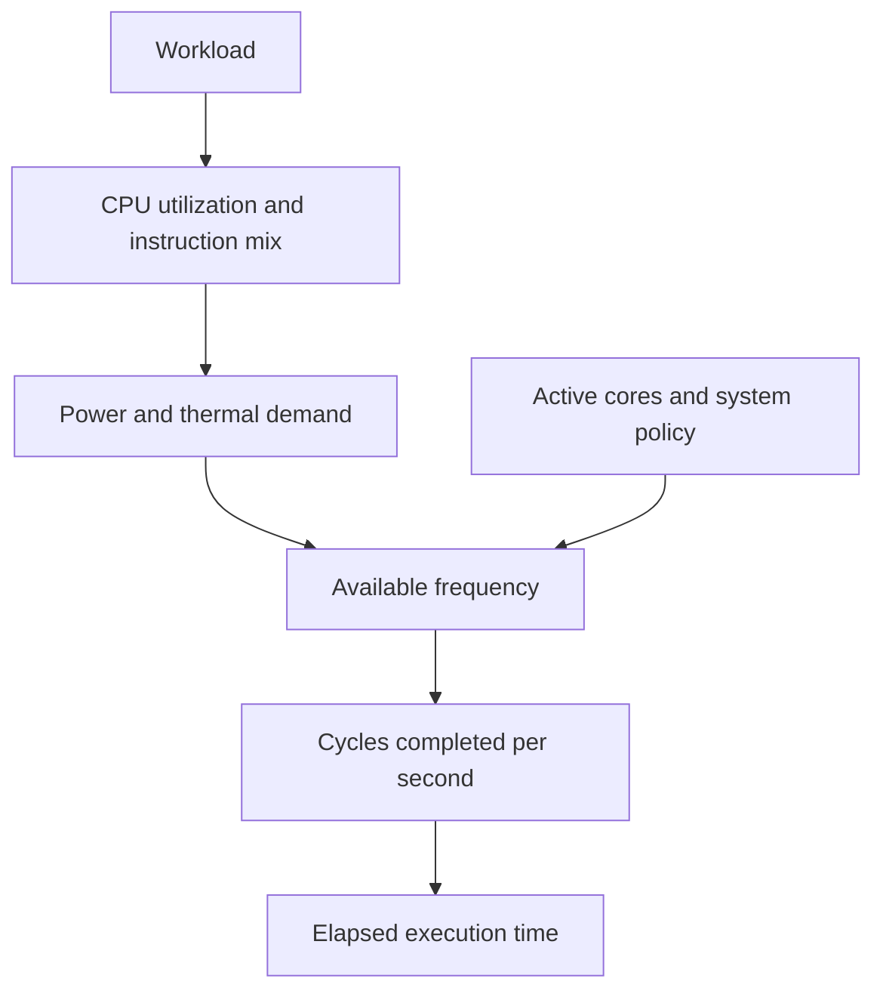
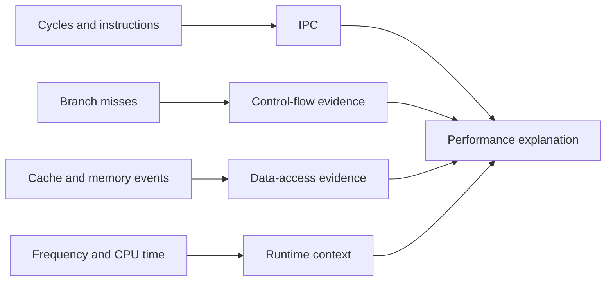

The previous chapter showed how a CPU works. It fetches instructions, reads registers, and runs work through a pipeline. It runs independent operations out of order and predicts branches. This chapter shows how to watch those mechanisms in a real program. It is the second chapter of Stage 3.

CPU performance is the useful work a processor finishes in a given time. A simple first model is:

```text
execution time = instructions × cycles per instruction ÷ clock frequency
```

This model does not predict performance exactly. It still gives us three useful questions. How many instructions did the program run? How many cycles did those instructions need? What frequency did the processor use?

Modern processors make each question harder. The compiler may remove or change work that the source code implies. The processor may run instructions in parallel, wait for memory, predict branches, and change its frequency because of heat or power limits. That is why experienced engineers do not stop when the code looks fast or when the CPU runs at 4 GHz. They measure the workload. Then they build an explanation from the measurements.

Hardware performance counters are counters that the processor keeps. They record events. Examples are retired instructions, CPU cycles, branch instructions, branch mispredictions, cache references, and cache misses. A retired instruction is one whose result the CPU has written into the program's state. Tools such as Linux `perf` read these counters. They turn the numbers into evidence about what the CPU was doing.

Do not try to collect every counter. Instead, pick one specific performance question. Then choose measurements that separate the possible explanations.

## What performance actually means

When engineers say one version is faster, they usually mean it finishes the same required work in less time. For one operation or one request, that time is wall-clock latency. For a service, they may also care about throughput. Throughput is how many operations finish each second.

Latency and throughput are related but not the same. A system can process many independent operations with high throughput. At the same time, each operation may still have noticeable latency. A CPU can also have high arithmetic throughput while one dependency chain has high latency. The reason is that every operation in the chain waits for the one before it.

Before measuring, define the quantity that matters:

- Request latency: how long one request takes from the caller's perspective.
- Throughput: how many operations complete in a period of time.
- CPU time: how much time a CPU spends running the process or thread.
- Wall-clock time: elapsed time, including time waiting for other processes, the scheduler, or I/O.
- Tail latency: a high percentile such as p95 or p99, which shows slow cases that an average can hide.

A change that improves average latency but makes p99 latency worse may be bad for a production service. A change that cuts CPU time but raises memory use may help one workload and hurt another.

## The basic performance equation

For a single thread, a useful approximation is:

```text
time = instruction count × cycles per instruction × seconds per cycle
```

Since seconds per cycle is the inverse of frequency:

```text
time = instruction count × CPI ÷ frequency
```

`CPI` means cycles per instruction. `IPC`, instructions per cycle, is its reciprocal in a simplified setting:

```text
IPC = instructions ÷ cycles
CPI = cycles ÷ instructions
```

This relationship is useful. Real processors, however, retire instructions unevenly. They may also run at changing frequencies. A measured IPC is only an average over a time interval. It is not a promise that every cycle retires the same number of instructions.

This equation gives three broad ways to improve CPU-bound code:

1. Execute fewer instructions.
2. Make the same instructions require fewer cycles by improving dependencies, branches, or memory behavior.
3. Run at a higher effective frequency, when the hardware and workload allow it.

Application code usually does not control the third option directly. Frequency depends on the processor, power limits, temperature, number of active cores, and workload. Software engineers usually focus first on instruction count and cycles per instruction.

## Clock frequency is not work completed

Clock frequency tells us how many clock cycles happen each second. A 4 GHz processor has roughly four billion cycles per second while it is actually running at 4 GHz. A cycle is a chance for internal CPU work. It is not one finished instruction.

One CPU might retire several independent instructions per cycle. Another might retire fewer. A program with long dependency chains may retire less work per cycle, even on a wide processor. A program waiting for memory may spend cycles while its execution units sit idle.

This is why comparing processors by GHz alone is unreliable. The processor's microarchitecture matters. So do the compiler output, the instruction mix, the memory behavior, the branch behavior, and the number of active cores.

## Frequency, turbo behavior, and throttling

Modern CPUs do not always run at one fixed frequency. They may raise frequency above a nominal value when there is enough power and thermal headroom. People commonly call this behavior turbo or boost.

The processor may reduce frequency when it hits a power limit or gets too hot. Thermal throttling means lowering the operating speed to control temperature. A workload that uses vector units heavily may hit power or thermal limits faster than a workload doing ordinary integer operations.

Frequency can also vary because of the number of active cores, the operating-system policy, battery settings, virtualization, and background work. Two runs of the same benchmark can therefore show different cycle counts, elapsed times, or effective frequencies.



When a benchmark reports a time improvement, ask a question. Did the code become more efficient, or did the processor simply run at a different frequency? Both affect the result, but they lead to different engineering conclusions.

## Retired instructions and cycles

The processor may fetch, decode, and speculatively execute instructions that it later discards. A retired instruction is an instruction whose result the CPU has committed to the program's state. Retired instructions are usually a better measure of completed program work than fetched instructions. They exclude speculative and wrong-path work.

The exact event names differ between processors. Tools, however, often provide a general instruction count and a cycle count. Their ratio gives an approximate IPC:

```text
IPC = retired instructions / CPU cycles
```

Suppose two versions execute these measured values:

```text
Version A: 1.0 billion instructions, 2.0 billion cycles
Version B: 0.8 billion instructions, 1.8 billion cycles
```

Version B executes fewer instructions and fewer cycles. It is therefore likely faster on the same machine and workload. Its IPC is also higher:

```text
Version A: 0.50 IPC
Version B: 0.44 IPC
```

The lower IPC of Version B does not contradict its improvement. It executes so much less work that the total cycle count still falls. IPC is a diagnostic signal. It is not a score that must always increase.

## What IPC can and cannot tell you

High IPC usually means the processor found enough independent work. It also means the needed data and execution resources were available. Low IPC can point to dependency chains, cache or translation misses, branch recovery, front-end limits, execution-unit contention, or a workload that naturally has little parallelism.

IPC alone does not identify the cause. A low-IPC program may be memory-bound. It may also be waiting on a serial dependency chain. A high-IPC program may still be inefficient if it performs far more instructions than necessary.

The correct interpretation compares IPC with other evidence:



An explanation such as IPC is low, so the cache is the problem is a hypothesis. It is not a conclusion.

## Branch instructions and branch misses

A branch instruction changes control flow. It can be a source-level `if`, loop condition, `switch`, function return, indirect call, or jump created by the compiler.

The branch predictor guesses the direction and sometimes the target of a branch before the condition is fully known. A branch miss, or more precisely a branch misprediction, occurs when that guess is wrong. The CPU must discard instructions fetched from the wrong path. It must also redirect execution to the correct path.

A useful derived value is the branch-miss rate:

```text
branch miss rate = branch misses ÷ branch instructions
```

A high miss rate often points to irregular control flow. The cost also depends on how often branches occur and how expensive recovery is on that CPU. A 50% miss rate on a rare branch may matter less than a 2% miss rate on a branch executed billions of times.

Branch prediction is usually good for stable patterns. A loop that runs the same number of iterations repeatedly is easy to predict after warm-up. A branch whose result follows random data is much harder to predict.

Do not treat every branch as a problem. Branches can avoid unnecessary work, protect invalid accesses, and make code clear. Replacing a branch with arithmetic or a lookup can raise instruction count, memory traffic, or security risk. Measure the complete workload.

## Cache references, misses, and memory stalls

The CPU uses caches to keep recently or frequently used data close to the execution units. A cache hit finds the requested data at that level. A cache miss requires a look in a slower level or in main memory.

Cache counters are easy to misunderstand. Cache miss may refer to a particular cache level, a particular type of access, or an event whose meaning depends on the processor. A miss does not always equal a long stall. The request may be served by another cache, overlap with independent work, or be prefetched.

Still, cache-related measurements are valuable when combined with code and memory-access patterns. Sequential traversal often benefits from spatial locality. Spatial locality means nearby addresses are used close together in time. Reusing the same data benefits from temporal locality. Temporal locality means the same data is used again before it leaves the cache.

```c
// Usually cache-friendly: adjacent elements are read together.
for (size_t i = 0; i < n; i++) {
    sum += values[i];
}

// May be cache-unfriendly when indexes are scattered.
for (size_t i = 0; i < n; i++) {
    sum += values[indexes[i]];
}
```

The second loop is not automatically slow. The indexes may happen to be local. The data may fit in cache. The access pattern may be predictable. The code gives us a hypothesis. Measurement tells us whether it matters.

## Front-end and back-end limits

You can view a modern CPU as having a front end and a back end. The front end fetches instruction bytes, predicts control flow, and decodes instructions. The back end schedules and executes decoded work. It uses arithmetic units, load/store units, and other resources.

If the front end cannot provide decoded instructions quickly enough, execution units may be underused. This can happen even when the program has independent work. Large instruction footprints, hard-to-decode instruction sequences, instruction-cache misses, and branch redirection can all add front-end pressure.

If the back end cannot execute the available instructions quickly enough, the limit may be arithmetic throughput, load/store capacity, memory latency, dependency chains, or a busy execution unit.

This separation helps you avoid vague explanations. Saying the CPU is slow is not a diagnosis. A better statement is that the workload is spending cycles waiting for data dependencies. Or the front end is repeatedly redirected by unpredictable branches. Such statements need support from measurements.

## Why no single counter tells the whole story

Hardware counters measure events. They are not direct explanations. Several events can occur together. One event can have multiple causes.

For example, a cache miss can cause a load to wait. The program may still continue executing independent instructions. A branch miss can reduce IPC. Low IPC can also come from memory latency. A high instruction count may result from a compiler decision, input-dependent behavior, or a hot library function.

Counters can also be multiplexed. If a processor cannot measure all requested events at once, the operating system may measure different events during different time intervals. It then scales the results. Scaled values are useful, but they are less direct than events measured continuously. Virtual machines may expose incomplete or virtualized counters.

The reliable process is:

1. Measure a stable baseline.
2. Form one concrete hypothesis.
3. Choose counters that could support or reject it.
4. Change one relevant factor.
5. Measure again under equivalent conditions.
6. Explain the result in terms of the workload and hardware.

## Measuring with perf stat

On Linux, a common starting point is:

```bash
perf stat ./program
```

This commonly reports elapsed time, task-clock time, context switches, CPU migrations, page faults, cycles, instructions, branches, and branch misses. The exact output depends on the kernel, the permissions, and the processor.

For a focused run, request a smaller group of events:

```bash
perf stat -e cycles,instructions,branches,branch-misses ./program
```

To include cache-related events when supported:

```bash
perf stat -e cycles,instructions,cache-references,cache-misses ./program
```

The command measures the complete program, including startup and shutdown. If the interesting operation is short, repeat it many times inside the program. Or use a benchmark harness so setup costs do not dominate the result.

For a process that is already running, `perf stat -p PID` can attach to it. Production profiling requires care. The measurement itself can add overhead. Attaching to a sensitive process may change its behavior. Start with a staging environment or a controlled sample when possible.

## A benchmark that teaches useful lessons

The following program creates three different kinds of work. The first loop contains a serial dependency chain. The second provides several independent accumulators. The third makes branch outcomes depend on the input data.

```c
#include <stdint.h>
#include <stdio.h>
#include <stdlib.h>
#include <time.h>

static uint64_t serial_sum(const uint32_t *values, size_t n) {
    uint64_t sum = 0;
    for (size_t i = 0; i < n; i++) {
        sum += values[i];
    }
    return sum;
}

static uint64_t parallel_sum(const uint32_t *values, size_t n) {
    uint64_t a = 0, b = 0, c = 0, d = 0;
    size_t i = 0;

    for (; i + 3 < n; i += 4) {
        a += values[i];
        b += values[i + 1];
        c += values[i + 2];
        d += values[i + 3];
    }

    for (; i < n; i++) {
        a += values[i];
    }

    return a + b + c + d;
}

static uint64_t branch_work(const uint32_t *values, size_t n) {
    uint64_t result = 0;
    for (size_t i = 0; i < n; i++) {
        if (values[i] & 1u) {
            result += values[i];
        }
    }
    return result;
}

int main(void) {
    const size_t n = 64 * 1024 * 1024;
    uint32_t *values = malloc(n * sizeof(*values));
    if (values == NULL) {
        return 1;
    }

    for (size_t i = 0; i < n; i++) {
        values[i] = (uint32_t)(i * 2654435761u);
    }

    printf("%llu\n", (unsigned long long)serial_sum(values, n));
    printf("%llu\n", (unsigned long long)parallel_sum(values, n));
    printf("%llu\n", (unsigned long long)branch_work(values, n));

    free(values);
    return 0;
}
```

This is an educational benchmark, not a laboratory-quality benchmark suite. The compiler may transform the functions. The array may not fit in cache. The memory allocation and initialization can affect the run. Compile it, inspect the assembly, and measure each function separately if you want a cleaner comparison.

```bash
cc -O2 -g benchmark.c -o benchmark
perf stat -e cycles,instructions,branches,branch-misses,cache-misses ./benchmark
objdump -d -Mintel benchmark > benchmark.asm
```

One important lesson is that the compiler may already turn the second loop into a vectorized implementation. If you want to understand what happened, check the disassembly. Do not assume that the source loop is the final loop.

## Benchmarking without fooling yourself

A benchmark is a controlled experiment that measures a defined workload. A timing printed by a program is not automatically a useful benchmark.

Run enough work for the signal to rise above startup noise. Warm up code when runtime compilation, lazy linking, cache filling, or branch-predictor training matters. Use the same input and output requirements for both versions. Stop the compiler from deleting work that has no observable result. Repeat runs and report a distribution rather than one lucky number.

Control or record factors that can change the result:

- CPU model and number of active cores
- operating-system version and power policy
- background processes and CPU migrations
- turbo or boost behavior
- thermal state
- input size and data distribution
- compiler version and optimization flags
- whether data is warm in cache or newly loaded
- whether the program is running inside a virtual machine

If a change improves a five-microsecond operation by 0.2 microseconds, the result may be real. It may also be dominated by measurement overhead or environmental noise. If the change improves a ten-minute workload by 10%, the evidence is usually easier to establish.

Wall-clock time and CPU counters answer different questions. Wall-clock time tells you what the caller experienced. CPU time tells you how much processor time was consumed. Counters explain what happened inside that processor time. A useful investigation often needs all three.

## A practical diagnosis example

Suppose a request handler becomes slower after a code change. Start with a representative benchmark or production trace and measure:

```text
elapsed time
CPU time
retired instructions
cycles
IPC
branch misses
cache or memory events when available
```

Consider three possible outcomes.

If instructions increase by 40% while IPC and frequency stay similar, the code is probably doing more work. Inspect the compiler output and the new algorithm or data path.

If instructions stay similar but cycles increase and cache misses rise, the new access pattern may have reduced locality. Or it may have increased the working set. Inspect data layout, allocation behavior, and access order.

If instructions and cache behavior stay similar but branch misses increase sharply, the new input distribution or control flow may be harder to predict. Test whether the branch is actually hot before you change it.

If CPU time stays similar but wall-clock latency increases, the bottleneck may be scheduling, lock contention, I/O, CPU migration, or another process. It is not instruction execution. CPU counters alone cannot explain a problem that sits mostly outside the CPU.

This is how measurements become engineering reasoning. Each observation narrows the set of plausible causes.

## Hardware counters in production

Counters are useful in production, but continuous collection has costs and risks. Sampling every process at high frequency can add overhead and produce a large volume of data. Some counters are only available with elevated permissions. Virtualized or cloud environments may restrict access.

Teams often use a combination of approaches. They use application metrics for request latency and throughput. They use system metrics for CPU utilization and load. They use sampled profiles for hot functions. They run targeted hardware-counter tests during an investigation or performance test.

The most useful production question is usually not what is the CPU doing globally. It is which service, endpoint, workload, or deployment changed. Then what evidence explains the change. Correlate CPU measurements with version, input shape, traffic level, and latency percentiles.

## What the memory hierarchy costs in cycles

The performance equation hides a sharp asymmetry. An add that hits registers and L1 cache may retire in a few cycles. A load that misses every level of cache and reaches main memory can stall for a few hundred cycles on a modern server. The rough magnitudes are worth remembering. L1 cache is often a few cycles. L2 is around ten to twenty. L3 is tens of cycles. A main-memory access is frequently a few hundred cycles. It can be more if it crosses a NUMA node.

This is why the same instruction count can have wildly different cycle counts. A workload that streams through cache-friendly data may retire several instructions per cycle. A workload that chases pointers across memory may spend most cycles waiting for the data path. When `perf` shows low IPC and high cache-miss or stall counts, ask a different question. Do not ask how many instructions the program ran. Ask how many of them were stuck behind a memory access. Memory latency, not arithmetic, is the usual ceiling for non-trivial services.

## Finding the hot path with perf record and flame graphs

`perf stat` tells you what kinds of events happened, but not where in the code. For that you sample. `perf record -g ./program` periodically interrupts the program and records the instruction pointer and call stack. Then `perf report` shows which functions and lines took the most samples. Sampling is statistical. A function that owns most samples is the hot path. You can target it directly instead of guessing.

Flame graphs make this even clearer. Tools such as `FlameGraph` turn folded stacks into a chart. The width of each frame is the fraction of samples. You can see at a glance whether time goes to JSON parsing, compression, locking, or allocation. `perf annotate` goes one level deeper. It shows the assembly with sample counts per instruction. This is how you learn whether a hot loop is limited by a specific instruction or by the accesses around it. Sampling has overhead and should be used in staging or on a canary. It is the fastest way from I am slow to the function that is slow.

## Top-down microarchitecture analysis

Do not guess whether the front end or back end is the problem. Intel's top-down method classifies every cycle into four buckets. Retiring is the useful work actually completed. Frontend Bound is when the decoder or instruction cache cannot feed the back end. Backend Bound is when execution units wait for data or execution resources. Bad Speculation is when the CPU discarded work after a misprediction. Linux `perf stat --topdown` approximates this split on supported CPUs.

The value is that the buckets tell you which lever to pull. Frontend Bound suggests smaller or hotter code and fewer taken branches. Bad Speculation suggests predictable control flow or fewer indirect calls. Backend Bound splits further into memory-bound and core-bound. Then you know whether to attack data layout or arithmetic throughput. A diagnosis that stops at low IPC becomes actionable once you can say the cycles are mostly backend memory-bound. The fix is then locality, not more parallelism.

## Detecting false sharing with perf mem and perf c2c

Some cache misses are not about locality but about contention. False sharing happens when two cores write different variables that sit on the same cache line. Each write invalidates the other core's copy. The line bounces between caches and the program pays coherence traffic for data it never shared by intent. It looks like high cache-miss or bus traffic. It appears as mysterious scaling cliffs where adding cores makes things slower.

`perf mem record` samples memory accesses with their source. `perf c2c` specifically reports cache-line contention between CPUs, naming the variables and offsets involved. Finding a hot cache line that two cores fight over is the smoking gun. The usual fix is to pad or align the contended variables to separate cache lines. Or give each core its own copy that is merged occasionally. This is exactly the per-thread counter pattern from the concurrency chapter.

## Definitions

### Hardware performance counters

> Hardware performance counters are measurements that the processor keeps. They record events such as CPU cycles, retired instructions, branch misses, and cache misses. Engineers use them with timing and profiling data. They investigate where a program spends its time.

### IPC

> IPC means instructions per cycle. It is the number of retired instructions divided by the number of CPU cycles over a measured interval. It shows how much instruction work the processor completed per cycle. It does not identify the bottleneck by itself.

### Why clock speed is not enough

> Frequency tells us how many cycles occur per second. It does not tell us how much useful work completes in each cycle. Instruction dependencies, branch prediction, memory behavior, execution resources, and microarchitecture also determine performance.

## Beyond the definitions

### How to investigate a slowdown

> I would set up a reproducible baseline. I would measure elapsed and CPU time. I would compare retired instructions and cycles and calculate IPC. Then I would use branch and memory-related counters to test specific hypotheses. I would also inspect the generated code and repeat the measurement under equivalent conditions.

### Does a cache miss always stall

> No. The miss may be served by another cache. It may overlap with independent instructions. It may be hidden by out-of-order execution. It matters most when it is on the critical dependency path or occurs often enough to consume memory-system capacity.

### Lower IPC but still faster

> IPC is only work completed per cycle. A version can have lower IPC but execute substantially fewer instructions. This results in fewer total cycles and lower runtime.

## Common misconceptions

**"More IPC is always better."** Higher IPC can be good. But executing fewer total instructions may be a larger improvement. IPC must be considered with instruction count and total cycles.

**"A cache miss counter directly gives the time lost to cache misses."** It reports an event according to the processor's definition. Misses can overlap. They can have different service costs. They can affect only some instructions.

**"One benchmark run proves the optimization works."** One run cannot separate the change from frequency variation, background work, cache state, scheduling, or measurement noise.

**"CPU utilization tells you whether the CPU is the bottleneck."** High utilization suggests the process is using available CPU time. It does not identify whether the code is using the CPU efficiently. Low utilization may still coexist with latency caused by one busy core or waiting on another resource.

**"The compiler output is stable because the source code is unchanged."** Compiler version, flags, target CPU options, link-time optimization, libraries, and profile information can all change generated instructions.

**"Hardware counters are exact and universal."** Event definitions, availability, skid, multiplexing, virtualization, and kernel support vary by processor and environment. Treat counter output as evidence with a measurement context.

## Summary

CPU performance is not explained by clock speed alone. A useful first model is instruction count, cycles per instruction, and effective frequency. Hardware counters help connect that model to reality. They show how much work retired, how many cycles were spent, and which events may be contributing to stalls.

The disciplined approach is to measure before you change code. Form a specific hypothesis about where time goes. Select counters that can test it. Look at the generated instructions. Repeat the experiment. Counters do not replace understanding. They make your explanation testable.
