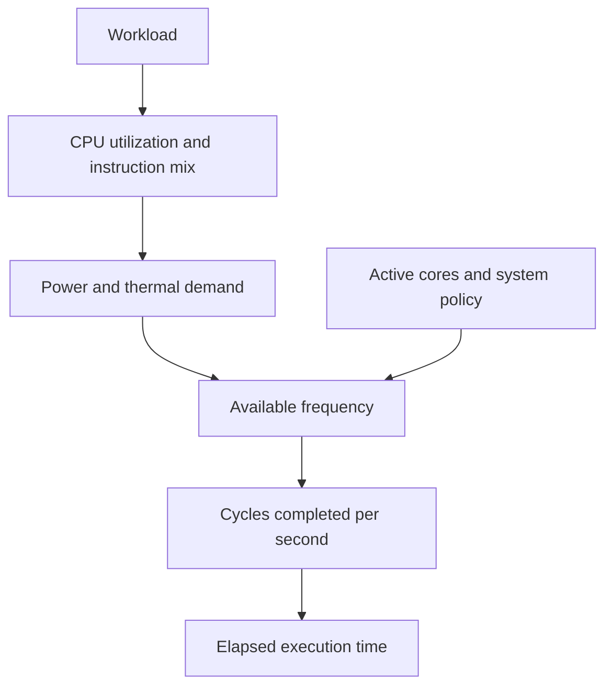
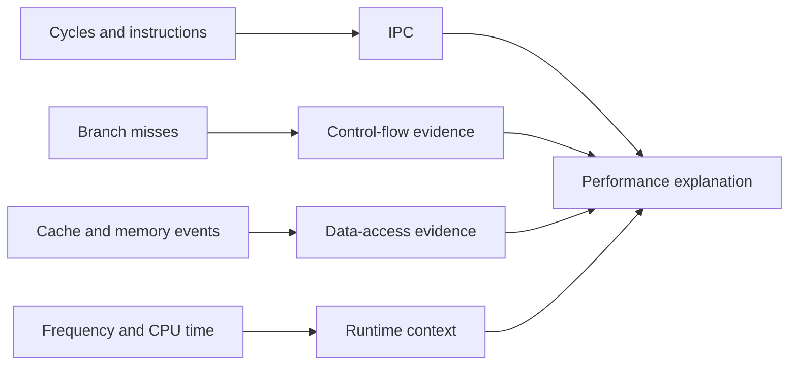

## The short version

CPU performance is the amount of useful work a processor completes in a given amount of time. A useful first model is:

```text
execution time = instructions × cycles per instruction ÷ clock frequency
```

This model is not a complete prediction of performance, but it gives us three important questions. How many instructions did the program execute? How many cycles did those instructions require? At what frequency did the processor run?

Modern processors make each question more complicated. The compiler may remove or transform source-level work. The processor may execute independent instructions in parallel, wait for memory, predict branches, and change its frequency because of temperature or power limits. That is why experienced engineers do not stop at “the code looks fast” or “the CPU is running at 4 GHz.” They measure the workload and then build an explanation from the measurements.

Hardware performance counters are processor-maintained counters that record events such as retired instructions, CPU cycles, branch instructions, branch mispredictions, cache references, and cache misses. Tools such as Linux `perf` read these counters and turn them into evidence about what the CPU was doing.

The goal is not to collect every available counter. The goal is to answer a specific performance question with measurements that distinguish competing explanations.

## Where this article fits

The previous article explained how a CPU fetches instructions, uses registers, pipelines work, executes independent operations out of order, and predicts branches. This article explains how to observe those mechanisms in a real program.

Later articles will study caches, memory locality, memory ordering, interrupts, and I/O in more detail. Here, cache misses and stalls appear as performance signals, but the focus is learning how to measure and reason about them without pretending that one counter explains the whole machine.

## What performance actually means

When engineers say that one version is faster, they usually mean that it completes the same required work in less elapsed time. That is wall-clock latency for one operation or one request. For a service, they may also care about throughput, which is how many operations complete per second.

Latency and throughput are related but different. A system can process many independent operations at high throughput while each individual operation still has noticeable latency. A CPU can also have high arithmetic throughput while one dependency chain has high latency because every operation waits for the previous one.

Before measuring, define the quantity that matters:

- Request latency: how long one request takes from the caller's perspective.
- Throughput: how many operations complete in a period of time.
- CPU time: how much time a CPU spends running the process or thread.
- Wall-clock time: elapsed time, including time waiting for other processes, the scheduler, or I/O.
- Tail latency: a high percentile such as p95 or p99, which shows slow cases that an average can hide.

A change that improves average latency but worsens p99 latency may be a bad change for a production service. A change that reduces CPU time but increases memory usage may be worthwhile in one workload and harmful in another.

## The basic performance equation

For a single thread, a useful approximation is:

```text
time = instruction count × cycles per instruction × seconds per cycle
```

Since seconds per cycle is the inverse of frequency:

```text
time = instruction count × CPI ÷ frequency
```

`CPI` means cycles per instruction. `IPC`, instructions per cycle, is its reciprocal in a simplified setting:

```text
IPC = instructions ÷ cycles
CPI = cycles ÷ instructions
```

The relationship is useful, but real processors retire instructions unevenly and may run at changing frequencies. A measured IPC is an average over an interval, not a promise that every cycle retires the same number of instructions.

This equation gives three broad ways to improve CPU-bound code:

1. Execute fewer instructions.
2. Make the same instructions require fewer cycles by improving dependencies, branches, or memory behavior.
3. Run at a higher effective frequency, when the hardware and workload allow it.

The third option is usually not something application code controls directly. Frequency depends on the processor, power limits, temperature, number of active cores, and workload. Software engineers usually focus first on instruction count and cycles per instruction.

## Clock frequency is not work completed

Clock frequency tells us how many clock cycles occur per second. A 4 GHz processor has roughly four billion cycles per second while it is actually running at 4 GHz. A cycle is an opportunity for internal CPU work; it is not one completed instruction.

One CPU might retire several independent instructions per cycle. Another might retire fewer. A program with long dependency chains may retire less work per cycle even on a wide processor. A program waiting for memory may spend cycles with execution units that could otherwise perform useful work.

This is why comparing processors by GHz alone is unreliable. The processor's microarchitecture, compiler output, instruction mix, memory behavior, branch behavior, and number of active cores all matter.

## Frequency, turbo behavior, and throttling

Modern CPUs do not necessarily run at one fixed frequency. They may raise frequency above a nominal value when there is enough power and thermal headroom. This behavior is commonly called turbo or boost.

The processor may reduce frequency when it reaches a power limit or becomes too hot. Thermal throttling means lowering operating speed to control temperature. A workload that uses vector units heavily may reach power or thermal limits more quickly than a workload doing ordinary integer operations.

Frequency can also vary because of the number of active cores, operating-system policy, battery settings, virtualization, and background work. Two runs of the same benchmark can therefore have different cycle counts, elapsed times, or effective frequencies.



When a benchmark reports a time improvement, ask whether the code became more efficient or whether the processor simply ran at a different frequency. Both affect the result, but they imply different engineering conclusions.

## Retired instructions and cycles

The processor may fetch, decode, and speculatively execute instructions that are later discarded. A retired instruction is an instruction whose result has been committed to the architectural state. Retired instructions are usually a better measure of completed program work than fetched instructions because speculative and wrong-path work is excluded.

The exact event names differ between processors, but tools often provide a general instruction count and a cycle count. Their ratio gives an approximate IPC:

```text
IPC = retired instructions / CPU cycles
```

Suppose two versions execute these measured values:

```text
Version A: 1.0 billion instructions, 2.0 billion cycles
Version B: 0.8 billion instructions, 1.8 billion cycles
```

Version B executes fewer instructions and fewer cycles, so it is likely faster on the same machine and workload. Its IPC is also higher:

```text
Version A: 0.50 IPC
Version B: 0.44 IPC
```

The lower IPC of Version B does not contradict its improvement. It executes so much less work that the total cycle count still falls. IPC is a diagnostic signal, not a score that must always increase.

## What IPC can and cannot tell you

High IPC usually means that the processor found enough independent work and had the required data and execution resources available. Low IPC can indicate dependency chains, cache or translation misses, branch recovery, front-end limits, execution-unit contention, or a workload that naturally contains little parallelism.

IPC by itself does not identify the cause. A low-IPC program may be memory-bound, but it may also be waiting on a serial dependency chain. A high-IPC program may still be inefficient if it performs far more instructions than necessary.

The correct interpretation compares IPC with other evidence:



An explanation such as “IPC is low, so the cache is the problem” is a hypothesis, not a conclusion.

## Branch instructions and branch misses

A branch instruction changes control flow. It can be a source-level `if`, loop condition, `switch`, function return, indirect call, or jump created by the compiler.

The branch predictor guesses the direction and sometimes the target of a branch before the condition is fully known. A branch miss, more precisely a branch misprediction, occurs when that guess is wrong. The CPU must discard instructions fetched from the wrong path and redirect execution to the correct path.

A useful derived value is the branch-miss rate:

```text
branch miss rate = branch misses ÷ branch instructions
```

A high miss rate often indicates irregular control flow, but the cost also depends on how frequently branches occur and how expensive recovery is on that CPU. A 50% miss rate on a rare branch may matter less than a 2% miss rate on a branch executed billions of times.

Branch prediction is usually good for stable patterns. A loop that runs the same number of iterations repeatedly is easy to predict after warm-up. A branch whose result follows random data is much harder.

Do not treat every branch as a problem. Branches can avoid unnecessary work, protect invalid accesses, and make code clear. Replacing a branch with arithmetic or a lookup can increase instruction count, memory traffic, or security risk. Measure the complete workload.

## Cache references, cache misses, and memory stalls

The CPU uses caches to keep recently or frequently used data close to the execution units. A cache hit finds the requested data at that level. A cache miss requires looking in a slower level or in main memory.

Cache counters are easy to misunderstand. “Cache miss” may refer to a particular cache level, a particular type of access, or an event whose meaning depends on the processor. A miss does not always equal a long stall: the request may be served by another cache, overlap with independent work, or be prefetched.

Still, cache-related measurements are valuable when combined with code and memory-access patterns. Sequential traversal often benefits from spatial locality, meaning nearby addresses are used close together in time. Reusing the same data benefits from temporal locality, meaning the same data is used again before it leaves the cache.

```c
// Usually cache-friendly: adjacent elements are read together.
for (size_t i = 0; i < n; i++) {
    sum += values[i];
}

// May be cache-unfriendly when indexes are scattered.
for (size_t i = 0; i < n; i++) {
    sum += values[indexes[i]];
}
```

The second loop is not automatically slow. The indexes may happen to be local, the data may fit in cache, or the access pattern may be predictable. The code gives us a hypothesis; measurement tells us whether it matters.

## Front-end and back-end limits

A modern CPU can be viewed as having a front end and a back end. The front end fetches instruction bytes, predicts control flow, and decodes instructions. The back end schedules and executes decoded work using arithmetic units, load/store units, and other resources.

If the front end cannot provide decoded instructions quickly enough, execution units may be underused even though the program has independent work. Large instruction footprints, difficult-to-decode instruction sequences, instruction-cache misses, and branch redirection can contribute to front-end pressure.

If the back end cannot execute the available instructions quickly enough, the limitation may be arithmetic throughput, load/store capacity, memory latency, dependency chains, or a busy execution unit.

This separation helps avoid vague explanations. “The CPU is slow” is not a diagnosis. A better statement is “the workload is spending cycles waiting for data dependencies” or “the front end is repeatedly redirected by unpredictable branches,” provided measurements support it.

## Why one counter is never the whole story

Hardware counters are measurements of events, not direct explanations. Several events can occur together, and one event can have multiple causes.

For example, a cache miss can cause a load to wait, but the program may continue executing independent instructions. A branch miss can reduce IPC, but low IPC can also come from memory latency. A high instruction count may result from a compiler decision, input-dependent behavior, or a hot library function.

Counters can also be multiplexed. If a processor cannot measure all requested events at once, the operating system may measure different events during different time intervals and scale the results. Scaled values are useful, but they are less direct than events measured continuously. Virtual machines may expose incomplete or virtualized counters.

The reliable process is:

1. Measure a stable baseline.
2. Form one concrete hypothesis.
3. Choose counters that could support or reject it.
4. Change one relevant factor.
5. Measure again under equivalent conditions.
6. Explain the result in terms of the workload and hardware.

## Measuring with `perf stat`

On Linux, a common starting point is:

```bash
perf stat ./program
```

This commonly reports elapsed time, task-clock time, context switches, CPU migrations, page faults, cycles, instructions, branches, and branch misses. The exact output depends on the kernel, permissions, and processor.

For a focused run, request a smaller group of events:

```bash
perf stat -e cycles,instructions,branches,branch-misses ./program
```

To include cache-related events when supported:

```bash
perf stat -e cycles,instructions,cache-references,cache-misses ./program
```

The command measures the complete program, including startup and shutdown. If the interesting operation is short, repeat it many times inside the program or use a benchmark harness so setup costs do not dominate the result.

For a process that is already running, `perf stat -p PID` can attach to it. Production profiling requires care: the measurement itself can have overhead, and attaching to a sensitive process may affect behavior. Start with a staging environment or a controlled sample when possible.

## A small benchmark that teaches useful lessons

The following program creates three different kinds of work. The first loop contains a serial dependency chain. The second provides several independent accumulators. The third makes branch outcomes depend on input data.

```c
#include <stdint.h>
#include <stdio.h>
#include <stdlib.h>
#include <time.h>

static uint64_t serial_sum(const uint32_t *values, size_t n) {
    uint64_t sum = 0;
    for (size_t i = 0; i < n; i++) {
        sum += values[i];
    }
    return sum;
}

static uint64_t parallel_sum(const uint32_t *values, size_t n) {
    uint64_t a = 0, b = 0, c = 0, d = 0;
    size_t i = 0;

    for (; i + 3 < n; i += 4) {
        a += values[i];
        b += values[i + 1];
        c += values[i + 2];
        d += values[i + 3];
    }

    for (; i < n; i++) {
        a += values[i];
    }

    return a + b + c + d;
}

static uint64_t branch_work(const uint32_t *values, size_t n) {
    uint64_t result = 0;
    for (size_t i = 0; i < n; i++) {
        if (values[i] & 1u) {
            result += values[i];
        }
    }
    return result;
}

int main(void) {
    const size_t n = 64 * 1024 * 1024;
    uint32_t *values = malloc(n * sizeof(*values));
    if (values == NULL) {
        return 1;
    }

    for (size_t i = 0; i < n; i++) {
        values[i] = (uint32_t)(i * 2654435761u);
    }

    printf("%llu\n", (unsigned long long)serial_sum(values, n));
    printf("%llu\n", (unsigned long long)parallel_sum(values, n));
    printf("%llu\n", (unsigned long long)branch_work(values, n));

    free(values);
    return 0;
}
```

This is an educational benchmark, not a laboratory-quality benchmark suite. The compiler may transform the functions, the array may not fit in cache, and the memory allocation and initialization can affect the run. Compile it, inspect the assembly, and measure each function separately if you want a cleaner comparison.

```bash
cc -O2 -g benchmark.c -o benchmark
perf stat -e cycles,instructions,branches,branch-misses,cache-misses ./benchmark
objdump -d -Mintel benchmark > benchmark.asm
```

One important lesson is that the compiler may already turn the second loop into a vectorized implementation. If you want to understand what happened, check the disassembly instead of assuming that the source loop is the final loop.

## Benchmarking without fooling yourself

A benchmark is a controlled experiment that measures a defined workload. A timing printed by a program is not automatically a useful benchmark.

Run enough work for the signal to be larger than startup noise. Warm up code when runtime compilation, lazy linking, cache filling, or branch-predictor training matters. Use the same input and output requirements for both versions. Prevent the compiler from deleting work that has no observable result. Repeat runs and report a distribution rather than one lucky number.

Control or record factors that can change the result:

- CPU model and number of active cores
- operating-system version and power policy
- background processes and CPU migrations
- turbo or boost behavior
- thermal state
- input size and data distribution
- compiler version and optimization flags
- whether data is warm in cache or newly loaded
- whether the program is running inside a virtual machine

If a change improves a five-microsecond operation by 0.2 microseconds, the result may be real, but it may also be dominated by measurement overhead or environmental noise. If the change improves a ten-minute workload by 10%, the evidence is usually easier to establish.

Wall-clock time and CPU counters answer different questions. Wall-clock time tells you what the caller experienced. CPU time tells you how much processor time was consumed. Counters explain what happened inside that processor time. A useful investigation often needs all three.

## A practical diagnosis example

Suppose a request handler becomes slower after a code change. Start with a representative benchmark or production trace and measure:

```text
elapsed time
CPU time
retired instructions
cycles
IPC
branch misses
cache or memory events when available
```

Consider three possible outcomes.

If instructions increase by 40% while IPC and frequency remain similar, the code is probably doing more work. Inspect the compiler output and the new algorithm or data path.

If instructions stay similar but cycles increase and cache misses rise, the new access pattern may have reduced locality or increased the working set. Inspect data layout, allocation behavior, and access order.

If instructions and cache behavior stay similar but branch misses increase sharply, the new input distribution or control flow may be harder to predict. Test whether the branch is actually hot before changing it.

If CPU time stays similar but wall-clock latency increases, the bottleneck may be scheduling, lock contention, I/O, CPU migration, or another process rather than instruction execution. CPU counters alone cannot explain a problem that is mostly outside the CPU.

This is how measurements become engineering reasoning: each observation narrows the set of plausible causes.

## Hardware counters in production

Counters are useful in production, but continuous collection has costs and operational risks. Sampling every process at high frequency can add overhead and produce a large volume of data. Some counters are only available with elevated permissions, and virtualized or cloud environments may restrict access.

Teams often use a combination of approaches. They use application metrics for request latency and throughput, system metrics for CPU utilization and load, sampled profiles for hot functions, and targeted hardware-counter runs during an investigation or performance test.

The most useful production question is usually not “what is the CPU doing globally?” It is “which service, endpoint, workload, or deployment changed, and what evidence explains the change?” Correlate CPU measurements with version, input shape, traffic level, and latency percentiles.

## Interview definitions

### What are hardware performance counters?

> Hardware performance counters are processor-maintained measurements of events such as CPU cycles, retired instructions, branch misses, and cache misses. Engineers use them with timing and profiling data to investigate where a program spends its time.

### What is IPC?

> IPC, or instructions per cycle, is the number of retired instructions divided by the number of CPU cycles over a measured interval. It indicates how much instruction work the processor completed per cycle, but it does not identify the bottleneck by itself.

### Why is clock frequency not enough to compare performance?

> Frequency tells us how many cycles occur per second, but not how much useful work completes in each cycle. Instruction dependencies, branch prediction, memory behavior, execution resources, and microarchitecture also determine performance.

## Interview follow-up questions

### How would you investigate a CPU slowdown?

> I would establish a reproducible baseline, measure elapsed and CPU time, compare retired instructions and cycles, calculate IPC, and then use branch and memory-related counters to test specific hypotheses. I would also inspect the generated code and repeat the measurement under equivalent conditions.

### Does a cache miss always stall the CPU?

> No. The miss may be served by another cache, overlap with independent instructions, or be hidden by out-of-order execution. It matters most when it is on the critical dependency path or occurs frequently enough to consume memory-system capacity.

### Why can a version with lower IPC still be faster?

> IPC is only work completed per cycle. A version can have lower IPC but execute substantially fewer instructions, resulting in fewer total cycles and lower runtime.

## Common misconceptions

**“More IPC is always better.”** Higher IPC can be good, but executing fewer total instructions may be a larger improvement. IPC must be considered with instruction count and total cycles.

**“A cache miss counter directly gives the time lost to cache misses.”** It reports an event according to the processor's definition. Misses can overlap, have different service costs, and affect only some instructions.

**“One benchmark run proves the optimization works.”** One run cannot separate the change from frequency variation, background work, cache state, scheduling, or measurement noise.

**“CPU utilization tells you whether the CPU is the bottleneck.”** High utilization suggests the process is using available CPU time, but it does not identify whether the code is efficiently using the CPU. Low utilization may still coexist with latency caused by one busy core or waiting on another resource.

**“The compiler output is stable because the source code is unchanged.”** Compiler version, flags, target CPU options, link-time optimization, libraries, and profile information can all change generated instructions.

**“Hardware counters are exact and universal.”** Event definitions, availability, skid, multiplexing, virtualization, and kernel support vary by processor and environment. Treat counter output as evidence with a measurement context.

## What to remember

CPU performance is not explained by clock speed alone. A useful first model is instruction count, cycles per instruction, and effective frequency. Hardware counters help connect that model to reality by showing how much work retired, how many cycles were spent, and which events may be contributing to stalls.

The disciplined approach is to measure before changing code, form a specific hypothesis, select counters that can test it, inspect the generated instructions, and repeat the experiment. Counters do not replace understanding; they make your explanation testable.

## Optional project for your next break

Build a **microbenchmark and counter report tool**. It should run several small workloads, measure wall-clock time, and invoke or document the relevant `perf stat` commands. For each workload, report instructions, cycles, IPC, branches, branch misses, and cache events when available.

Then write a short report answering three questions for every workload: what was the limiting factor, what evidence supports that conclusion, and what measurement could still prove you wrong? That final question is important. Good performance engineering is not finding a counter that agrees with your first guess; it is reducing uncertainty until the bottleneck is clear.
