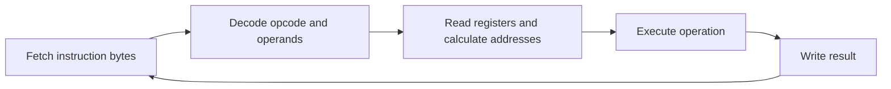
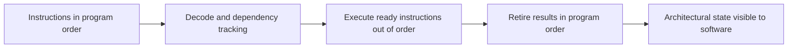

```mermaid
gantt
    title Simplified instruction pipeline
    dateFormat  X
    axisFormat %s
    section Instruction 1
    Fetch       :a1, 0, 1
    Decode      :a2, 1, 1
    Execute      :a3, 2, 1
    Write       :a4, 3, 1
    section Instruction 2
    Fetch       :b1, 1, 1
    Decode      :b2, 2, 1
    Execute      :b3, 3, 1
    Write       :b4, 4, 1
    section Instruction 3
    Fetch       :c1, 2, 1
    Decode      :c2, 3, 1
    Execute      :c3, 4, 1
    Write       :c4, 5, 1
```

## The short version

A CPU executes a program by reading machine instructions, interpreting what each instruction means, operating on registers or memory, and advancing to the next instruction. That description is correct, but it hides the reason modern programs can execute billions of instructions per second.

Modern CPUs do not simply finish one instruction before starting the next one. They fetch and decode several instructions, place independent work in different execution units, predict branches, execute work out of order, and finally make the results visible in the original program order. This lets the hardware use its pipelines and execution units efficiently while preserving the behavior promised by the instruction set.

The most useful systems-engineering question is not only “how many instructions does this code contain?” It is also “which instructions depend on each other, which ones wait for memory, and which parts of the CPU can work in parallel?”

## Where this article fits

This is the first article in Stage 3, Hardware and Computer Architecture. Earlier articles explained that a system is built around limited resources and that performance depends on latency, throughput, locality, and contention. This article moves one level lower: it explains what the processor does with the instructions produced by the compiler.

Later articles will study privilege levels, virtual memory, caches, memory ordering, interrupts, and I/O in more depth. Those topics are easier to understand once the basic execution path is clear.

## From source code to instructions

The CPU does not execute C, Rust, Go, or another high-level language directly. The compiler translates source code into an object file containing machine instructions for a particular instruction set architecture. The linker combines that object file with other objects and libraries to create an executable. The loader maps the executable into memory and starts a thread at its entry point.


The same source code can produce different instructions for x86-64 and ARM64. It can also produce very different instructions for the same CPU depending on compiler options. Optimization level, inlining, vectorization, debugging information, and the selected target architecture all affect the final machine code.

For example, a simple loop may be transformed into fewer instructions, unrolled so that several iterations are handled together, or converted to vector instructions that operate on multiple values at once. To reason about performance, you eventually need to inspect the generated code rather than assuming that the source structure maps directly to CPU work.

## What an instruction is

An instruction is a binary encoding that tells the processor what operation to perform. The encoding usually contains an operation code, called an opcode, and information about its operands.

An operand can be a register, a constant embedded in the instruction, or a memory location described by an address calculation. Common operations include adding values, comparing values, loading data from memory, storing data to memory, jumping to another instruction, and calling or returning from a function.

Consider this simplified operation:

```text
add rax, rbx
```

It means: read the values in two registers, add them, and place the result in `rax`. The actual machine instruction is encoded as bytes. The names `rax` and `rbx` are x86-64 register names; they are not universal CPU concepts. ARM64 uses a different register naming scheme and a different instruction encoding.

The CPU does not need to understand the original variable names, loops, classes, or functions. It sees instruction bytes, register values, memory addresses, and control-flow decisions.

## The registers that matter

Registers are small storage locations inside the CPU. They are much closer to the execution units than main memory, so instructions can usually use register values with very low latency.

The exact register set depends on the architecture, but a useful mental model includes these roles:

- General-purpose registers hold integer values, addresses, and temporary results.
- Floating-point and vector registers hold floating-point values or multiple packed values.
- The instruction pointer, also called the program counter, identifies the address of the next instruction in the current control flow.
- The stack pointer identifies the current location of the thread's stack.
- A status or flags register records results such as zero, negative, carry, or overflow, depending on the architecture.

The instruction pointer is not simply incremented forever. It normally advances to the next sequential instruction, but a branch, function call, function return, interrupt, or exception can replace it with another address.

The register state is part of a thread's architectural state. When the operating system stops one thread and runs another, it must preserve the first thread's registers and restore the second thread's registers. The deeper CPU pipeline state is handled by the processor; the operating system is responsible for the architectural state it exposes to software.

## The fetch-decode-execute model

The classic teaching model is:



During fetch, the CPU reads instruction bytes from the address indicated by the instruction pointer. During decode, it determines what the bytes mean and what resources the instruction needs. The instruction then reads its inputs, performs an operation, and writes a result to a register or memory.

This model is useful for learning, but it is not a description of the timing of a modern CPU. The processor overlaps these stages. While one instruction is executing, another can be decoded and another can be fetched. Several instructions may be partly processed at the same time.

## The instruction set and the microarchitecture

The instruction set architecture, or ISA, is the contract visible to software. It defines the instructions, registers, data types, memory behavior, exceptions, and other rules that compiled programs depend on. x86-64 and ARM64 are two different ISAs.

The microarchitecture is the internal design used to implement that contract. It includes the pipeline, caches, branch predictor, execution units, instruction decoder, register renaming machinery, and retirement logic.

Two processors can implement the same ISA and run the same executable while having very different performance. One may have a wider pipeline, better branch prediction, larger caches, or more execution units. This is why “the program uses x86-64” does not tell you how fast it will run on every x86-64 processor.

The ISA tells the compiler what behavior is allowed. The microarchitecture determines how efficiently a particular sequence of allowed instructions runs.

## RISC, CISC, x86-64, and ARM64

RISC and CISC describe broad ISA design traditions. RISC designs traditionally favor a smaller set of regular instructions, while CISC designs traditionally provide more complex instructions and richer addressing modes.

The distinction is useful historically, but it should not be used as a shortcut for modern performance. Modern x86 processors often decode complex instructions into simpler internal micro-operations. Modern ARM processors also contain sophisticated decoders, predictors, caches, and out-of-order execution machinery.

x86-64 and ARM64 differ in instruction encodings, registers, calling conventions, memory-ordering rules, and available instructions. A compiler can hide many of these differences, but systems code still encounters them when it uses assembly, writes a compiler backend, analyzes performance counters, builds operating-system components, or moves software between machines.

The practical rule is simple: write to the intended architectural contract, then measure the behavior on the actual processors that matter. Do not assume that an ISA label alone predicts performance.

## Why CPUs use pipelines

Suppose a processor had to fetch, decode, execute, and finish one instruction before beginning the next. Much of the hardware would sit idle during each stage. A pipeline allows different instructions to occupy different stages at the same time.



The first instruction still takes several stages to pass through the pipeline. The benefit appears after the pipeline fills: the processor can complete instructions regularly instead of waiting for the entire path to finish before starting more work.

Pipeline depth is not the same as performance. A deeper pipeline can support a high clock frequency, but a mistake in branch prediction may require more work to be discarded. The useful measure is how much correct work the CPU completes over time and how much latency individual dependencies experience.

## Pipeline hazards and dependencies

The CPU cannot execute every instruction independently. A hazard is a situation that prevents an instruction from safely moving forward at the desired time.

A data hazard occurs when one instruction needs a result produced by another instruction:

```text
a = b + c
d = a + 1
```

The second calculation cannot use the new value of `a` until the first calculation produces it. The processor may forward the result directly between execution stages, but a true dependency still limits how much parallelism is available.

A control hazard occurs around a branch. The CPU does not know which instructions come next until it determines whether a condition is true. A structural hazard occurs when multiple instructions need the same internal resource at the same time.

Compilers reduce some hazards by reordering independent operations, keeping values in registers, unrolling loops, and using vector instructions. The CPU handles many remaining cases dynamically. Neither the compiler nor the CPU can remove a dependency that is fundamental to the algorithm.

## Superscalar execution

A superscalar CPU can issue more than one instruction in a cycle when the instructions are independent and the required execution units are available. One unit may handle integer arithmetic while another handles loads, stores, branches, or vector operations.

For example, these operations have little direct dependency on each other:

```text
x = a + b
y = c * d
```

The processor may execute them at the same time if it has suitable resources. In contrast, a long chain such as `x = x + 1` repeated many times creates a dependency from each operation to the next. The code may contain many instructions, but the CPU has less freedom to overlap them.

This is why instruction count alone is not enough to explain performance. The shape of the dependency graph matters.

## Out-of-order execution

Program instructions are written in a specific order, but the CPU may execute independent instructions in a different order. This is called out-of-order execution.

Imagine that one instruction is waiting for data from memory while a later instruction uses values already available in registers. The processor can execute the later instruction while the memory request is outstanding. If it had to wait strictly in program order, the execution units would be idle even though useful independent work was available.

The CPU tracks dependencies and keeps temporary results in internal structures. It can rename registers internally so that unrelated uses of the same architectural register do not create false dependencies. It can then execute ready operations as resources become available.

The results must still appear to software as if the instructions followed the architectural rules. Modern processors therefore retire, or commit, instructions in program order. If an instruction causes an exception, the processor can present a precise architectural state corresponding to the correct point in the program.



Out-of-order execution improves throughput; it does not change the program's defined result. It also cannot create unlimited parallelism. A long dependency chain, a full execution unit, or a cache miss can still become the limiting factor.

## Branch prediction and speculation

A branch changes the instruction pointer based on a condition:

```c
if (request_is_valid) {
    handle_request();
} else {
    reject_request();
}
```

The CPU may not know the condition immediately, but waiting would leave the front end of the pipeline empty. A branch predictor guesses which path will be taken and begins fetching instructions from that path.

This is speculative execution. If the prediction is correct, the CPU has saved time. If it is wrong, the speculative work is discarded and the correct path is fetched. The cost of a misprediction depends on the processor, but it can be significant because the pipeline must be redirected and refilled.

Predictable branches are usually easier for the processor than branches whose outcome changes in an irregular pattern. This does not mean that every branch should be removed or replaced with clever arithmetic. Branchless code can introduce extra operations, harder-to-read logic, or memory accesses that are worse than a well-predicted branch. Measure the real workload.

Speculation is also relevant to security. A CPU may perform work speculatively even though the architectural result will later be discarded. Some historical vulnerabilities showed that discarded speculative work could influence microarchitectural state, such as caches, in ways observable by an attacker. The security details belong in the later security articles, but the important foundation is that “not architecturally committed” does not always mean “had no physical effect inside the processor.”

## Loads, stores, and why memory matters

Arithmetic on registers is only useful when the required values are available. A load reads data from memory into a register. A store writes a register value to memory.

```text
load  r1, [address_of_a]
add   r1, r1, r2
store [address_of_a], r1
```

The brackets represent a memory access in this simplified example. The actual instruction syntax depends on the ISA.

Memory access is not one fixed-cost operation. If the data is already available in a nearby cache, the load may complete quickly. If the CPU must request it from a slower level of the memory hierarchy or from main memory, the dependent instructions may wait much longer.

Out-of-order execution can hide some of that latency by doing independent work. It cannot hide a miss that sits directly on the critical path of a computation. This is the connection between CPU execution and the earlier discussion of locality: the processor can be very fast at arithmetic and still spend much of its time waiting for data.

The details of cache levels, cache coherence, and memory ordering deserve separate articles. For now, remember that a machine instruction that looks small in source code may include an address calculation, a memory request, permission checks, cache lookup, and dependency waiting.

## What a function call looks like to the CPU

At the source level, a function call looks like a transfer of control:

```c
int total(int left, int right) {
    return left + right;
}
```

At the machine level, a calling convention defines how the caller and callee exchange arguments, return values, and saved state. A convention is an agreement between separately compiled code. It specifies which registers carry early arguments, where additional arguments go, which registers a function must preserve, and where the return value is placed.

A call instruction normally records a return location and transfers control to the function. The callee may create a stack frame by reserving stack space and saving registers. It performs its work, places the result in the agreed register, restores required state, and returns to the caller.

The exact sequence varies by architecture, compiler, optimization level, and whether the function is recursive, variadic, or called across a binary interface. An optimizer may inline a small function, which removes the call and allows more optimization across the original function boundary.

On x86-64, a compiler might produce assembly resembling this for a simple addition:

```asm
; x86-64 illustration, syntax and register choices are architecture-specific
lea     eax, [rdi + rsi]
ret
```

This example assumes the calling convention placed the two integer arguments in `rdi` and `rsi`, and that the result is returned in `eax`. The important lesson is not to memorize these registers for every platform. The important lesson is that source-level function calls become a calling-convention protocol implemented with instructions, registers, the stack, and control-flow changes.

## What the operating system sees

The operating system schedules threads, not individual source-level functions. A thread runs a sequence of instructions using a register state and an address space. When the scheduler decides to run another thread, the kernel saves the current thread's architectural register state and restores another thread's state.

The CPU continues to execute instructions according to its architecture. The kernel controls when a thread is allowed to run, which memory mappings it can use, and which privilege level it runs at. A system call, interrupt, or exception transfers control into the kernel through an architecture-defined mechanism.

The operating system does not normally inspect every instruction or decide the order of independent instructions inside a thread. That work belongs to the CPU. This boundary is important: the scheduler controls thread-level execution, while the processor controls instruction-level execution within the running thread.

## A performance example: dependency versus available parallelism

Compare these two loops conceptually:

```c
// One long dependency chain.
for (size_t i = 0; i < n; i++) {
    total = total + values[i];
}

// Several partial sums create more independent work.
for (size_t i = 0; i < n; i += 4) {
    sum0 += values[i];
    sum1 += values[i + 1];
    sum2 += values[i + 2];
    sum3 += values[i + 3];
}
```

The second form gives the compiler and CPU several partial-sum chains instead of forcing every addition to wait for the previous addition. The final partial sums still need to be combined, but much of the loop has more instruction-level parallelism.

This transformation is not automatically better in every situation. The loop may be limited by memory bandwidth, the values may not be safely readable in groups of four, or the compiler may already perform the transformation. The engineering method is to inspect the generated code and measure representative input rather than changing code based only on intuition.

## Seeing instructions and measuring behavior

A small experiment can connect the concepts in this article without requiring a large project. Create a program that performs arithmetic, branches over predictable and unpredictable data, and reads a large array.

Compile it with debug information and optimization enabled:

```bash
cc -O2 -g example.c -o example
```

Disassemble the executable:

```bash
objdump -d -Mintel example
```

Use a debugger when you want to stop at a function and inspect registers or the instruction pointer:

```bash
gdb ./example
```

On Linux, `perf stat` can report hardware and software counters:

```bash
perf stat -e cycles,instructions,branches,branch-misses,cache-misses ./example
```

Counter names and availability depend on the processor and operating system. Treat the output as evidence about one machine and one workload, not as a universal constant. Useful questions include whether the program is retiring many instructions per cycle, whether branch misses are unusually high, and whether cache misses are contributing to stalls.

The most valuable habit is to connect three views of the same behavior:

1. The source code describes the algorithm and intended work.
2. The disassembly shows the instructions the compiler actually produced.
3. Performance counters and measurements show where the processor spent time.

Systems engineers use all three because each view hides something important.

## Interview definitions

### What does a CPU do when it executes an instruction?

> A CPU executes machine instructions by fetching and decoding them, operating on registers or memory, and updating the architectural state while advancing the instruction pointer.

### What is the difference between an ISA and a microarchitecture?

> An ISA defines the instructions and behavior visible to software, while a microarchitecture is the internal CPU design used to implement that contract.

### What is out-of-order execution?

> Out-of-order execution allows a CPU to execute ready, independent instructions before earlier instructions that are waiting, while retiring results in program order so software observes the required behavior.

## Interview follow-up questions

### Why does out-of-order execution not change the program's result?

> The processor may execute independent operations in a different internal order, but it preserves the architectural rules of the ISA and retires results in program order. This also allows it to present a precise state when an exception occurs.

### What limits instruction-level parallelism?

> True data dependencies, branch decisions, limited execution resources, and memory latency can prevent instructions from running in parallel. The CPU can hide some waiting with independent work, but it cannot remove a dependency that the algorithm requires.

### What does a context switch have to do with CPU execution?

> The kernel saves one thread's architectural register state and restores another thread's state. The CPU then executes the new thread's instructions; scheduling between individual instructions remains the processor's responsibility.

## Common misconceptions

**“The CPU executes one line of source code at a time.”** Source lines are not CPU instructions. One source statement can become many instructions, several statements can be optimized together, and some statements can disappear completely.

**“A higher clock speed always means a faster program.”** Clock speed describes cycles per second, not how much useful work completes per cycle. Pipeline stalls, branch mispredictions, cache misses, dependencies, and execution-unit limits also matter.

**“Out-of-order execution means the program runs in a different order.”** Internal execution can be reordered, but the processor preserves the architectural behavior required by the ISA and retires results carefully.

**“RISC is fast and CISC is slow.”** These labels describe ISA design traditions. Modern performance depends on the complete implementation, compiler output, workload, memory behavior, and processor design.

**“A branchless rewrite is automatically faster.”** Removing a branch can help when prediction is poor, but it can also add instructions or memory work. Measure both versions on realistic input.

**“A memory access has one predictable cost.”** The cost depends on where the data is found, whether the access is dependent on earlier work, whether other cores are modifying it, and whether the access causes translation or cache misses.

## What to remember

The CPU executes an architectural instruction stream, but it does so using a much more complicated internal machine. It fetches ahead, predicts control flow, decodes several instructions, tracks dependencies, executes ready work, and retires results in order.

The key performance question is whether the processor has useful independent work available. A program slows down when instructions depend on a long chain, wait for memory, compete for an execution resource, or repeatedly mispredict control flow. The only reliable way to understand a real case is to connect source code, generated instructions, and measurements.

## Optional project for your next break

Build a small **CPU behavior laboratory** in C. Include benchmarks for a dependency chain, several independent accumulators, predictable branches, unpredictable branches, and sequential versus scattered array access. Add a command-line option for the input size.

For each benchmark, record the runtime, inspect the disassembly, and collect `perf stat` counters when Linux is available. Write a short explanation for every difference you observe. The purpose is not to create a production benchmark suite; it is to train yourself to explain CPU behavior using evidence instead of only source-level intuition.
