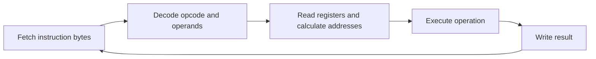
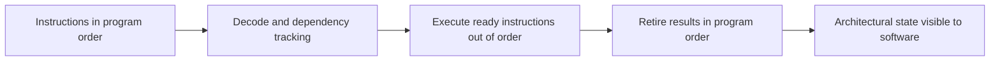

This is the first chapter of Stage 3. Stage 3 covers hardware and computer architecture. Earlier stages showed that a system runs on limited resources. They also showed that the kernel schedules runnable threads across a few CPUs. This chapter goes one level lower. It explains what the processor does with the instructions that the compiler produces. How those instructions run affects both performance and failure behavior.

A CPU runs a program in four steps. It reads a machine instruction. It works out what the instruction means. It uses registers or memory to do the work. Then it moves to the next instruction. This is correct. But it hides why modern programs can run billions of instructions per second.

Modern CPUs do not finish one instruction before starting the next. They fetch and decode several instructions at once. They send independent work to different execution units. They guess which way a branch will go. They run work out of order. Then they show the results in the original program order. This keeps the hardware busy and efficient. It also keeps the behavior the instruction set promises.

A systems engineer should ask more than how many instructions the code has. Ask which instructions depend on each other. Ask which ones wait for memory. Ask which parts of the CPU can work at the same time.

## From source code to instructions

The CPU does not run C, Rust, Go, or another high-level language directly. The compiler turns source code into an object file. That file holds machine instructions for a specific instruction set architecture. The ISA is the set of rules that the CPU follows. The linker joins the object file with other objects and libraries to build an executable. The loader places the executable in memory and starts a thread at its first instruction.


The same source code can produce different instructions for x86-64 and ARM64. It can also produce very different instructions for the same CPU when compiler options change. Many settings change the final machine code. They include the optimization level, inlining, vectorization, debug info, and target architecture.

For example, the compiler may turn a simple loop into fewer instructions. It may unroll the loop so several steps run together. It may convert it to vector instructions that act on many values at once. To reason about performance, you must look at the generated code. Do not assume the source structure maps directly to CPU work.

## What an instruction actually is

An instruction is a binary pattern. It tells the processor what operation to do. The pattern usually holds an operation code, or opcode. It also holds details about the inputs, which we call operands.

An operand can be a register. It can be a constant placed inside the instruction. It can be a memory location found by an address calculation. Common operations add values. They compare values. They load data from memory. They store data to memory. They jump to another instruction. They call a function or return from one.

Consider this simplified operation:

```text
add rax, rbx
```

It means: read the values in two registers, add them, and put the result in `rax`. The real machine instruction is stored as bytes. The names `rax` and `rbx` are x86-64 register names. They are not universal CPU ideas. ARM64 uses different register names and a different way to encode instructions.

The CPU does not need to know the original variable names, loops, classes, or functions. It sees instruction bytes, register values, memory addresses, and control-flow choices.

## The registers that matter

Registers are small storage spots inside the CPU. They sit much closer to the execution units than main memory. Instructions can usually read register values very fast.

The exact register set depends on the architecture, but a useful mental model includes these roles:

- General-purpose registers hold integer values, addresses, and temporary results.
- Floating-point and vector registers hold floating-point values or multiple packed values.
- The instruction pointer, also called the program counter, identifies the address of the next instruction in the current control flow.
- The stack pointer identifies the current location of the thread's stack.
- A status or flags register records results such as zero, negative, carry, or overflow, depending on the architecture.

The instruction pointer is not just counted up forever. It normally moves to the next instruction in order. But a branch, function call, function return, interrupt, or exception can replace it with a different address.

The register state is part of a thread's architectural state. This is the state that software can see. When the operating system stops one thread and runs another, it must save the first thread's registers and restore the second thread's registers. The processor handles the deeper pipeline state itself. The operating system only manages the architectural state that it shows to software.

## The fetch-decode-execute model

The classic teaching model is:



During fetch, the CPU reads instruction bytes from the address in the instruction pointer. During decode, it works out what the bytes mean and what resources the instruction needs. The instruction then reads its inputs, does the operation, and writes a result to a register or memory.

This model helps you learn, but it does not show the timing of a modern CPU. The processor overlaps these stages. While one instruction runs, another can be decoded and a third can be fetched. Several instructions can be partly handled at the same time.

## The instruction set and the microarchitecture

The instruction set architecture, or ISA, is the contract that software sees. It defines the instructions, registers, data types, memory behavior, exceptions, and other rules that compiled programs rely on. x86-64 and ARM64 are two different ISAs.

The microarchitecture is the internal design that carries out that contract. It includes the pipeline, caches, branch predictor, execution units, instruction decoder, register renaming hardware, and retirement logic.

Two processors can use the same ISA and run the same executable but perform very differently. One may have a wider pipeline, better branch prediction, bigger caches, or more execution units. This is why saying a program uses x86-64 does not tell you how fast it runs on every x86-64 chip.

The ISA tells the compiler what behavior is allowed. The microarchitecture decides how well a given sequence of allowed instructions runs.

## RISC, CISC, x86-64, and ARM64

RISC and CISC are two broad ISA design traditions. RISC designs favor a smaller set of regular instructions. CISC designs provide more complex instructions and richer ways to address memory.

The difference matters in history, but do not use it as a shortcut for modern performance. Modern x86 processors often decode complex instructions into simpler internal micro-operations. Modern ARM processors also have advanced decoders, predictors, caches, and out-of-order execution.

x86-64 and ARM64 differ in instruction encodings, registers, calling conventions, memory-ordering rules, and available instructions. A calling convention is the set of rules for passing arguments. A compiler hides many of these differences. But systems code still meets them when it uses assembly, writes a compiler backend, reads performance counters, builds OS parts, or moves software between machines.

The practical rule is simple. Write to the intended architectural contract. Then measure the behavior on the actual processors that matter. Do not assume an ISA label alone predicts performance.

## Why CPUs use pipelines

Suppose a processor had to fetch, decode, execute, and finish one instruction before the next begins. Much of the hardware would sit idle during each stage. A pipeline lets different instructions use different stages at the same time.

```mermaid
gantt
    title Simplified instruction pipeline
    dateFormat  X
    axisFormat %s
    section Instruction 1
    Fetch       :a1, 0, 1
    Decode      :a2, 1, 1
    Execute      :a3, 2, 1
    Write       :a4, 3, 1
    section Instruction 2
    Fetch       :b1, 1, 1
    Decode      :b2, 2, 1
    Execute      :b3, 3, 1
    Write       :b4, 4, 1
    section Instruction 3
    Fetch       :c1, 2, 1
    Decode      :c2, 3, 1
    Execute      :c3, 4, 1
    Write       :c4, 5, 1
```



The first instruction still needs several stages to pass through the pipeline. The benefit appears after the pipeline fills. The processor can then finish instructions steadily instead of waiting for the whole path before starting more work.

Pipeline depth is not the same as performance. A deeper pipeline can support a high clock speed. But a wrong branch prediction may force more work to be thrown away. The useful measure is how much correct work the CPU finishes over time and how much delay each dependency adds.

## Pipeline hazards and dependencies

The CPU cannot run every instruction on its own. A hazard is a situation that stops an instruction from safely moving forward when we want it to.

A data hazard occurs when one instruction needs a result produced by another instruction:

```text
a = b + c
d = a + 1
```

The second calculation cannot use the new value of `a` until the first produces it. The processor may forward the result directly between execution stages. But a true dependency still limits how much parallelism is possible.

A control hazard happens around a branch. The CPU does not know which instructions come next until it checks whether a condition is true. A structural hazard happens when several instructions need the same internal resource at the same time.

Compilers reduce some hazards by reordering independent operations, keeping values in registers, unrolling loops, and using vector instructions. The CPU handles many other cases on the fly. Neither the compiler nor the CPU can remove a dependency that the algorithm truly needs.

## Superscalar execution

A superscalar CPU can issue more than one instruction in a single cycle. The instructions must be independent. The needed execution units must be available. One unit may handle integer arithmetic. Another may handle loads, stores, branches, or vector operations.

For example, these operations have little direct dependency on each other:

```text
x = a + b
y = c * d
```

The processor may execute them at the same time if it has suitable resources. In contrast, a long chain such as `x = x + 1` repeated many times creates a dependency from each operation to the next. The code may contain many instructions, but the CPU has less freedom to overlap them.

This is why instruction count alone is not enough to explain performance. The shape of the dependency graph matters.

## Out-of-order execution

Program instructions are written in a specific order, but the CPU may execute independent instructions in a different order. This is called out-of-order execution.

Imagine that one instruction is waiting for data from memory while a later instruction uses values already available in registers. The processor can execute the later instruction while the memory request is outstanding. If it had to wait strictly in program order, the execution units would be idle even though useful independent work was available.

The CPU tracks dependencies and keeps temporary results in internal structures. It can rename registers internally so that unrelated uses of the same architectural register do not create false dependencies. It can then execute ready operations as resources become available.

The results must still appear to software as if the instructions followed the architectural rules. Modern processors therefore retire instructions in program order. To retire an instruction means to commit its result. If an instruction causes an exception, the processor can present a precise architectural state at the correct point in the program.



Out-of-order execution improves throughput. It does not change the program's defined result. It also cannot create unlimited parallelism. A long dependency chain, a full execution unit, or a cache miss can still become the limiting factor.

## Branch prediction and speculation

A branch changes the instruction pointer based on a condition:

```c
if (request_is_valid) {
    handle_request();
} else {
    reject_request();
}
```

The CPU may not know the condition right away. Waiting would leave the front end of the pipeline empty. A branch predictor guesses which path will be taken. It then begins fetching instructions from that path.

This is speculative execution. If the prediction is correct, the CPU has saved time. If it is wrong, the speculative work is discarded and the correct path is fetched. The cost of a misprediction depends on the processor, but it can be significant because the pipeline must be redirected and refilled.

Predictable branches are usually easier for the processor than branches whose outcome changes in an irregular pattern. This does not mean that every branch should be removed or replaced with clever arithmetic. Branchless code can introduce extra operations, harder-to-read logic, or memory accesses that are worse than a well-predicted branch. Measure the real workload.

Speculation is also relevant to security. A CPU may perform work speculatively even though the architectural result will later be discarded. Some historical vulnerabilities showed that discarded speculative work can influence microarchitectural state. An example is the cache. An attacker can observe these effects. The security details belong in the later security articles. The key point is this. Work that is not committed architecturally can still have a physical effect inside the processor.

## Loads, stores, and why memory matters

Arithmetic on registers is only useful when the required values are available. A load reads data from memory into a register. A store writes a register value to memory.

```text
load  r1, [address_of_a]
add   r1, r1, r2
store [address_of_a], r1
```

The brackets represent a memory access in this simplified example. The actual instruction syntax depends on the ISA.

Memory access is not one fixed-cost operation. If the data is already available in a nearby cache, the load may complete quickly. If the CPU must request it from a slower level of the memory hierarchy or from main memory, the dependent instructions may wait much longer.

Out-of-order execution can hide some of that latency by doing independent work. It cannot hide a miss that sits directly on the critical path of a computation. This connects CPU execution to the earlier discussion of locality. The processor can be very fast at arithmetic. It may still spend much of its time waiting for data.

The details of cache levels, cache coherence, and memory ordering deserve separate articles. For now, remember this. A machine instruction that looks small in source code may include an address calculation, a memory request, permission checks, a cache lookup, and dependency waiting.

## What a function call looks like to the CPU

At the source level, a function call looks like a transfer of control:

```c
int total(int left, int right) {
    return left + right;
}
```

At the machine level, a calling convention defines how the caller and callee exchange arguments, return values, and saved state. A convention is an agreement between separately compiled code. It specifies which registers carry early arguments, where additional arguments go, which registers a function must preserve, and where the return value is placed.

A call instruction normally records a return location and transfers control to the function. The callee may create a stack frame by reserving stack space and saving registers. It performs its work, places the result in the agreed register, restores required state, and returns to the caller.

The exact sequence varies by architecture, compiler, optimization level, and whether the function is recursive, variadic, or called across a binary interface. An optimizer may inline a small function, which removes the call and allows more optimization across the original function boundary.

On x86-64, a compiler might produce assembly resembling this for a simple addition:

```asm
; x86-64 illustration, syntax and register choices are architecture-specific
lea     eax, [rdi + rsi]
ret
```

This example assumes the calling convention placed the two integer arguments in `rdi` and `rsi`, and that the result is returned in `eax`. The important lesson is not to memorize these registers for every platform. The important lesson is that source-level function calls become a calling-convention protocol implemented with instructions, registers, the stack, and control-flow changes.

## What the operating system sees

The operating system schedules threads, not individual source-level functions. A thread runs a sequence of instructions using a register state and an address space. When the scheduler decides to run another thread, the kernel saves the current thread's architectural register state and restores another thread's state.

The CPU continues to execute instructions according to its architecture. The kernel controls when a thread is allowed to run, which memory mappings it can use, and which privilege level it runs at. A system call, interrupt, or exception transfers control into the kernel through an architecture-defined mechanism.

The operating system does not normally inspect every instruction. It does not decide the order of independent instructions inside a thread. That work belongs to the CPU. This boundary is important. The scheduler controls thread-level execution. The processor controls instruction-level execution within the running thread.

## A performance example

Compare these two loops conceptually:

```c
// One long dependency chain.
for (size_t i = 0; i < n; i++) {
    total = total + values[i];
}

// Several partial sums create more independent work.
for (size_t i = 0; i < n; i += 4) {
    sum0 += values[i];
    sum1 += values[i + 1];
    sum2 += values[i + 2];
    sum3 += values[i + 3];
}
```

The second form gives the compiler and CPU several partial-sum chains instead of forcing every addition to wait for the previous addition. The final partial sums still need to be combined, but much of the loop has more instruction-level parallelism.

This transformation is not automatically better in every situation. The loop may be limited by memory bandwidth, the values may not be safely readable in groups of four, or the compiler may already perform the transformation. The engineering method is to inspect the generated code and measure representative input rather than changing code based only on intuition.

## Seeing instructions and measuring behavior

A small experiment can connect the concepts in this article without a large project. Create a program that performs arithmetic. Make it branch over predictable and unpredictable data. Make it read a large array.

Compile it with debug information and optimization enabled:

```bash
cc -O2 -g example.c -o example
```

Disassemble the executable:

```bash
objdump -d -Mintel example
```

Use a debugger when you want to stop at a function and inspect registers or the instruction pointer:

```bash
gdb ./example
```

On Linux, `perf stat` can report hardware and software counters:

```bash
perf stat -e cycles,instructions,branches,branch-misses,cache-misses ./example
```

Counter names and availability depend on the processor and operating system. Treat the output as evidence about one machine and one workload, not as a universal constant. Useful questions include whether the program is retiring many instructions per cycle, whether branch misses are unusually high, and whether cache misses are contributing to stalls.

The most valuable habit is to connect three views of the same behavior:

1. The source code describes the algorithm and intended work.
2. The disassembly shows the instructions the compiler actually produced.
3. Performance counters and measurements show where the processor spent time.

Systems engineers use all three because each view hides something important.

## SIMD and vector instructions: data parallelism inside one core

So far the operations have applied to one value at a time. Most modern CPUs also provide vector instructions. They are called SIMD, which means single instruction, multiple data. SIMD works on several values packed into one wide register. x86-64 calls these SSE, AVX, and AVX-512. ARM64 calls them NEON. A single vector add can add four, eight, or sixteen values at once. This is why copying or transforming arrays can be many times faster than scalar code.

Compilers often perform this automatically through auto-vectorization when a loop is simple and the data is laid out contiguously. You can also write it explicitly with intrinsics or with a language's SIMD library. The payoff is large for image processing, checksumming, compression, and any loop that touches independent elements, but it disappears when the loop has complex control flow, scattered memory access, or dependencies between iterations. A program that wants vector speed should keep its hot loops simple, aligned, and branch-free, then confirm with `perf` that vector instructions actually appear in the disassembly.

## Instruction latency versus throughput: why dependency chains dominate

Each instruction has two related costs. Latency is how many cycles the result takes to be ready. A later instruction that needs that result cannot start until then. Throughput is how often the execution unit can start another independent instruction of that kind. It is often given as reciprocal throughput. An add may have a latency of one cycle. Its throughput lets the CPU start a new one every cycle. A chain of dependent adds is limited by latency. Many independent adds are limited only by how many the scheduler can issue.

This distinction explains the partial-sum example earlier. A single running total creates a dependency chain. Its length equals the number of additions. It is limited by add latency no matter how wide the CPU is. Multiple partial sums create several shorter chains. The superscalar engine runs them in parallel. They are limited by throughput instead. When you profile a tight loop, ask more than how many instructions it has. Ask whether its critical path is a long single chain or many short ones that the hardware can overlap.

## The pipeline as front-end and back-end, and simultaneous multithreading

A modern core is usually described as two halves. The front-end fetches and decodes instructions. It breaks them into micro-operations. It feeds them into a decoded instruction cache. Repeated code does not pay the decode cost again. The back-end allocates registers. It renames them to remove false dependencies. It schedules micro-operations onto execution units. It executes them and retires them in order. A performance problem can live in either half. A large, cold code path can starve the front-end. A dependency chain or a busy execution unit can starve the back-end.

Simultaneous multithreading is called Hyper-Threading on Intel. It lets two hardware threads share one core's execution resources. The scheduler sees two logical CPUs. They compete for the same decoders, caches, and arithmetic units. SMT helps when one thread is stalled waiting for memory. The other thread can use the idle units. This raises total throughput. It does not make a single thread run faster. Two threads that both want the same busy unit get less than each would alone. This is the CPU-side view of the sibling CPUs from the scheduling chapter. The operating system sees two CPUs. They are one execution engine shared by time and by stalls.

## Store buffers and store-to-load forwarding

When a store writes a value to memory, the CPU does not always wait for it to reach the cache before continuing. It places the store in a store buffer. It lets later instructions proceed. It commits the store to the cache hierarchy later. If a later load reads the same address, the CPU can forward the value directly from the store buffer. It does not wait for memory. This keeps a single thread fast even though the store has not yet become globally visible.

This internal forwarding is why a normal program sees its own writes immediately. Another core may not see them until the store is committed and propagated. The gap between a value written by one thread and observed by another is what the memory-ordering chapter examines. The store buffer is the hardware reason it exists. A store is locally instant but globally delayed. Understanding this bridges how one CPU executes instructions to how several CPUs agree on memory.

## Definitions

### What execution means

> A CPU executes machine instructions by fetching and decoding them, operating on registers or memory, and updating the architectural state while advancing the instruction pointer.

### ISA versus microarchitecture

> An ISA defines the instructions and behavior visible to software, while a microarchitecture is the internal CPU design used to implement that contract.

### Out-of-order execution

> Out-of-order execution allows a CPU to execute ready, independent instructions before earlier instructions that are waiting, while retiring results in program order so software observes the required behavior.

## Beyond the definitions

### Why reordering preserves the result

> The processor may execute independent operations in a different internal order, but it preserves the architectural rules of the ISA and retires results in program order. This also allows it to present a precise state when an exception occurs.

### What limits parallelism

> True data dependencies, branch decisions, limited execution resources, and memory latency can prevent instructions from running in parallel. The CPU can hide some waiting with independent work, but it cannot remove a dependency that the algorithm requires.

### Context switches and execution

> The kernel saves one thread's architectural register state and restores another thread's state. The CPU then executes the new thread's instructions; scheduling between individual instructions remains the processor's responsibility.

## Common misconceptions

**"The CPU executes one line of source code at a time."** Source lines are not CPU instructions. One source statement can become many instructions, several statements can be optimized together, and some statements can disappear completely.

**"A higher clock speed always means a faster program."** Clock speed describes cycles per second, not how much useful work completes per cycle. Pipeline stalls, branch mispredictions, cache misses, dependencies, and execution-unit limits also matter.

**"Out-of-order execution means the program runs in a different order."** Internal execution can be reordered, but the processor preserves the architectural behavior required by the ISA and retires results carefully.

**"RISC is fast and CISC is slow."** These labels describe ISA design traditions. Modern performance depends on the complete implementation, compiler output, workload, memory behavior, and processor design.

**"A branchless rewrite is automatically faster."** Removing a branch can help when prediction is poor, but it can also add instructions or memory work. Measure both versions on realistic input.

**"A memory access has one predictable cost."** The cost depends on where the data is found, whether the access is dependent on earlier work, whether other cores are modifying it, and whether the access causes translation or cache misses.

## Summary

The CPU executes an architectural instruction stream. It does so using a much more complicated internal machine. It fetches ahead. It predicts control flow. It decodes several instructions. It tracks dependencies. It executes ready work. It retires results in order.

The key question is whether the processor has useful independent work available. A program slows down when instructions depend on a long chain. It slows down when they wait for memory. It slows down when they compete for an execution resource. It slows down when they repeatedly mispredict control flow. The only reliable way to understand a real case is to connect the source code, the generated instructions, and measurements.
