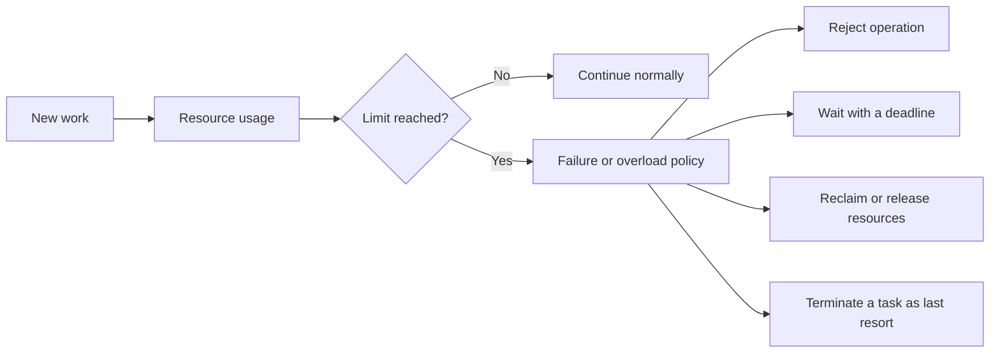
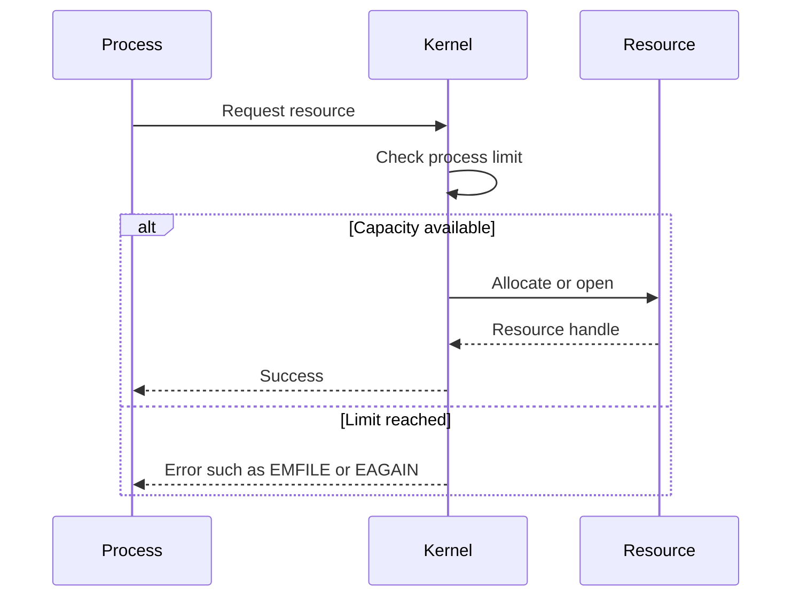
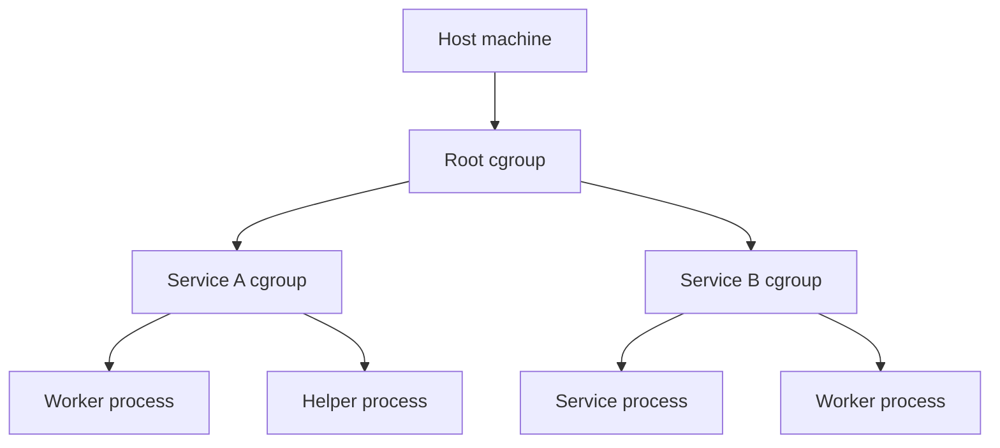
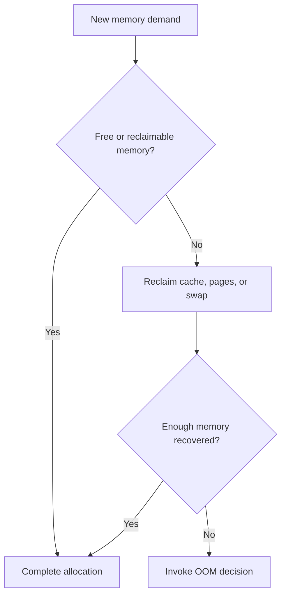

> Stage 2 — Linux and Operating System Internals  
> Subject area 2.2 — Scheduling and Resource Control  
> Article 2

## The short version

Linux resources are finite. A process can run out of file descriptors, threads, address space, CPU time, locked memory, or other resources even when the machine as a whole still appears healthy. A group of processes can also exceed its memory budget and trigger reclaim, throttling, allocation failures, or the out-of-memory killer.

Resource limits exist to contain consumption and protect the system from one process or service taking everything. A limit is useful only when the application understands what failure looks like and the operator can observe usage before the boundary is reached.

The out-of-memory killer, usually called the OOM killer, is a last-resort mechanism. When Linux cannot reclaim enough memory to satisfy an important allocation, it selects a process or memory-control group to terminate so that the rest of the system can continue. It is not a memory-management strategy and it is not a substitute for setting reasonable limits.

The central question is:

> How does Linux contain resource usage, and what happens when a process or service reaches its limits?

## Where this article fits

The previous article explained how Linux schedules threads and shares CPU time. This article explains the limits that constrain processes and the memory-pressure behavior that appears when capacity is exhausted.

Later articles will explain virtual memory, page faults, allocators, containers, cgroups, storage, and production capacity planning in more depth. This article gives us the practical limit-and-failure model that connects those topics.

## Why limits are necessary

Without limits, one program could create processes until the system could not schedule useful work, open files until other operations failed, allocate memory until the machine became unstable, or create connections until a shared dependency collapsed.

Limits serve two purposes:

1. They prevent uncontrolled usage from spreading through the system.
2. They create a defined point where the program must handle exhaustion.

The second purpose is easy to miss. A limit does not remove failure. It moves failure to a known boundary where the system can reject work, shed load, restart a component, or alert an operator.



A good system knows which policy applies to each resource. Running out of a file descriptor should not be handled like running out of memory. A full worker queue should not be handled like a crashed process.

## Per-process limits: `RLIMIT`

Linux provides per-process resource limits through the `getrlimit`, `setrlimit`, and `prlimit` interfaces. A process has a soft limit and a hard limit for many resources.

The soft limit is the value currently enforced for the process. The hard limit is the maximum value to which an unprivileged process can raise its soft limit. Increasing a hard limit generally requires appropriate privileges.

```text
Hard limit
    └── Maximum allowed soft limit
          └── Current enforced soft limit
```

A shell often exposes these limits through `ulimit`:

```bash
ulimit -a
ulimit -n
```

The exact output depends on the shell and environment. A limit set in one shell affects processes started from that shell, but a service manager, container runtime, or login system may configure different limits for a service.

## Important per-process limits

Linux supports many resource-limit categories. The most useful ones to understand first are these.

### `RLIMIT_NOFILE`

This limits the number of file descriptors a process may have open. File descriptors refer to files, sockets, pipes, devices, event objects, and other kernel-managed resources.

When the limit is reached, operations such as `open`, `socket`, or `accept` can fail. A service may report “too many open files” even when the disk, memory, and CPU are otherwise healthy.

The cause may be legitimate concurrency, an undersized limit, or a descriptor leak. Raising the limit without finding the cause can hide the leak and allow the process to hold more resources than the system can safely support.

### `RLIMIT_NPROC`

On Linux, this limit controls the number of processes, or more precisely threads, associated with a real user ID. Reaching it can cause process or thread creation to fail with `EAGAIN`.

This is different from a per-service process limit or a container cgroup limit. A user can have several services, and their combined process or thread usage may reach the user-level boundary.

### `RLIMIT_AS`

This limits the total address space of a process. It is not the same as the amount of physical RAM currently resident. A process can have a large virtual address space with only part of it backed by physical memory.

An address-space limit can cause memory mappings or allocations to fail even when the system has available physical memory.

### `RLIMIT_CPU`

This limits the amount of CPU time consumed by a process. It measures CPU time, not wall-clock time. A process that sleeps for an hour may consume very little CPU time, while a busy loop may reach the limit quickly.

### `RLIMIT_STACK`

This limits the stack size for the process's main thread or, depending on the design, affects how stack resources are configured. A stack limit that is too small can cause deep recursion, large local allocations, or thread startup to fail.

### `RLIMIT_MEMLOCK`

This limits how much memory an unprivileged process may lock into RAM so that it cannot be swapped out. Locked memory is used by some real-time, security, and high-performance applications, but allowing unlimited locked memory could starve the rest of the system.

The important practice is to read the documentation for the specific limit. Similar names do not imply identical units, enforcement points, or failure results.

## Limits are not the same as usage

A configured limit tells you what the process may consume. It does not tell you how much it is using now.

For example:

- `RLIMIT_NOFILE` is a descriptor ceiling; `/proc/<pid>/fd` shows current descriptor entries.
- `RLIMIT_AS` is an address-space limit; `/proc/<pid>/maps` shows mappings, while resident memory needs different measurements.
- `RLIMIT_CPU` is a CPU-time ceiling; process statistics show usage so far.
- A memory cgroup's `memory.max` is a group limit; `memory.current` shows current accounted usage.

Diagnosis requires comparing current usage, limit, rate of change, and the operation that failed.

## What happens when a per-process limit is reached

The kernel usually rejects the operation that would exceed the limit. The exact error depends on the resource and system call.



The process must handle the error. The kernel cannot know whether the application should retry, release an old resource, reject the request, or terminate.

For example, if a connection accept fails because file descriptors are exhausted, retrying immediately will not help. The service may need to close leaked or idle descriptors, reject new clients, reduce concurrency, or alert an operator.

## Resource limits and service boundaries

A process limit applies to one process. A service often consists of many processes or containers, so a service-level limit must account for all of them.

Suppose a database allows 200 connections. A service runs 20 replicas, and each replica can open 20 connections. The theoretical maximum is 400 connections, even though every individual process stays within its local configuration.

```text
Per-process connection limit
    × number of replicas
    = possible shared-resource demand
```

The same reasoning applies to memory, threads, file descriptors, temporary files, and network ports. A local limit does not automatically protect a shared global resource.

## Cgroups: controlling a group of processes

A control group, commonly called a cgroup, is a Linux mechanism for organizing processes and controlling or accounting for their resource usage. A cgroup can contain a service and its child processes, a container, a user workload, or another operational group.



Cgroups can manage or account for resources such as:

- CPU usage
- Memory usage
- Number of processes
- Block-I/O activity
- Device access
- CPU sets and affinity

They are important in containers and service managers because a workload is usually more than one process. If a service starts workers, subprocesses, or helper programs, grouping only the parent PID does not necessarily contain all of the service's resource usage.

## Cgroup v2 memory controls

Modern Linux systems commonly use cgroup v2, which provides a unified hierarchy and memory-control files for each cgroup. The exact available files depend on the kernel and configuration, but several concepts are especially important.

### `memory.current`

This reports the memory currently used by a cgroup and its descendants according to the memory controller's accounting.

It is useful for observing current usage, but it is not a complete explanation of memory pressure. A workload may use memory as a cache and still operate well, or use less memory but suffer from high reclaim and page-fault costs.

### `memory.peak`

This records the highest usage observed for the cgroup since creation or reset. Peak usage is valuable because a current measurement taken after a burst may look healthy even though the workload previously approached its limit.

### `memory.high`

`memory.high` is a throttling boundary. When a cgroup exceeds it, processes are put under heavy reclaim pressure and may be slowed while the kernel tries to reduce usage. Crossing it does not directly invoke the OOM killer.

This makes `memory.high` useful as an early-pressure mechanism. It can expose a workload to gradual slowdown and give an external manager time to respond.

### `memory.max`

`memory.max` is the hard memory limit for the cgroup. If usage reaches the limit and reclaim cannot reduce it, the cgroup can enter an out-of-memory condition and the OOM killer may terminate tasks within that cgroup.

The limit is a final safety boundary. It should not be the only memory-management strategy because reaching it means the workload is already failing to satisfy its demand.

### `memory.events`

`memory.events` reports memory-pressure and limit events, including activity around the high and max boundaries, OOM conditions, and OOM kills. These counters are useful for alerting and post-incident analysis.

An operator should distinguish “the cgroup was throttled under high pressure” from “the cgroup killed a task because it reached the hard limit.” They imply different urgency and recovery behavior.

### `memory.oom.group`

When enabled, `memory.oom.group` tells the OOM killer to treat the cgroup as an indivisible workload. If the group OOMs, all tasks in the cgroup or relevant descendants can be killed together rather than leaving a partially alive service with an incomplete set of workers.

Whether group killing is appropriate depends on the workload. A stateless worker group may be safe to restart together. A group containing unrelated processes may need more selective behavior.

## Memory pressure before OOM

Out-of-memory killing is not the first thing Linux does when memory becomes scarce. The kernel tries to reclaim memory first.

Reclaim may remove clean page-cache pages, write dirty pages back to storage, swap anonymous pages if configured, or shrink reclaimable kernel caches. Reclaim itself consumes CPU and can delay application work.



A system can therefore be severely degraded before the OOM killer runs. High reclaim activity, swapping, page faults, and allocation stalls can produce high latency and low throughput even when no process has been killed yet.

## The system-wide OOM condition

The system-wide OOM killer is invoked when the kernel cannot reclaim enough memory to satisfy an important allocation and the normal recovery paths are not sufficient.

The kernel selects a task to sacrifice in an attempt to free enough memory for the system to continue. It uses heuristics based on memory usage and process properties. The selection is not simply “kill the process with the largest RSS,” and administrators can influence the relative score with `oom_score_adj`.

The selected task may not be the one that caused the underlying memory growth. The task that happens to request memory when the system reaches the crisis may be different from the process that gradually consumed most of the memory.

This is why an OOM log must be investigated as an event in a memory-pressure story, not treated as proof that the killed process was the original bug.

## The OOM score and `oom_score_adj`

Linux exposes an OOM-related score through `/proc/<pid>/oom_score` and an adjustment through `/proc/<pid>/oom_score_adj`.

The adjustment lets a privileged operator make a process more or less likely to be selected. A value of `-1000` provides complete OOM protection for the task, while positive values make it more eligible.

Protecting a process is dangerous if the process is not genuinely essential. If every service is protected, the kernel loses useful victims and the system may remain under pressure longer or take a more severe action.

The adjustment should be used as part of an intentional service policy, not as a way to hide memory leaks.

## Memcg OOM versus system OOM

A cgroup can hit its `memory.max` even when the host still has free memory. In that case, the OOM decision is constrained to the memory cgroup rather than selecting an unrelated process elsewhere on the machine.

The distinction matters operationally:

```text
System-wide memory pressure
    → OOM decision may affect a task across the host

Cgroup memory.max pressure
    → OOM decision is contained within the cgroup
```

A container being killed for exceeding its memory limit does not necessarily mean the host ran out of memory. Conversely, a host-level OOM can affect workloads that are individually below their configured limits if the overall host has insufficient reclaimable memory.

## What an OOM kill looks like

The killed process may receive `SIGKILL`, so it cannot run cleanup code. The process's local memory and file descriptors will eventually be reclaimed by the kernel, but application-level external effects may remain.

Observable signs can include:

- Kernel log messages describing an OOM event
- A process exit caused by signal 9
- A service manager reporting a killed or failed process
- Container runtime reporting an OOM kill
- Increasing memory pressure before the kill
- Rising reclaim or swap activity
- `memory.events` counters increasing in a cgroup
- Restart loops after the victim exits

The application may not produce a useful final log because `SIGKILL` cannot be handled. Kernel and supervisor logs become especially important.

## OOM is not the same as a normal allocation failure

An application can receive an allocation failure without the OOM killer terminating a process. A memory allocation can fail because of a process address-space limit, a cgroup limit, an overcommit policy, a mapping restriction, or a temporary inability to satisfy a particular request.

Some kernel allocations do not invoke the OOM killer. Some may return an error, retry, or fail for a reason specific to the requested allocation.

The application must still check allocation results and handle failure. It should not assume that “the kernel will kill something” is a valid error-handling strategy.

## Overcommit and address space

Linux can allow a process to reserve more virtual address space than can immediately be backed by physical memory. This is called memory overcommit.

Overcommit can be useful because programs often reserve address space without touching every page. The risk is that many processes may eventually touch their promised pages at the same time, creating more demand than the system can satisfy.

The kernel's overcommit configuration affects when allocations are accepted and how much memory is considered commit-able. The exact policy is system-wide and should be treated as an operational configuration, not an application assumption.

The distinction is important:

```text
Virtual address reservation
    ≠
Physical memory currently available
```

Calling `malloc` successfully does not necessarily mean every byte can be used forever without memory pressure. A program still needs to monitor real usage and handle failures.

## Why memory usage can be confusing

Memory accounting includes several categories:

- Anonymous memory used by heaps and stacks
- File-backed memory mappings
- Page cache
- Shared pages
- Kernel data structures
- Socket buffers
- Memory used by child processes

The same physical page may be shared by several processes. Adding every process's virtual or resident values can overstate physical consumption. A cgroup or system-level view may account for shared resources differently from a per-process view.

This is why diagnosing memory requires comparing multiple measurements: process RSS, mappings, allocation profiles, cgroup usage, page cache, swap, pressure, and kernel logs.

## A realistic production example

Imagine a service running inside a container with a 2 GiB memory limit. Its current application heap is 1.4 GiB, and an in-memory cache grows during a traffic burst. At the same time, the process uses several hundred megabytes of page cache and socket buffers.

The container reaches `memory.max`. The kernel tries reclaim, but the workload's active anonymous memory cannot be reclaimed enough. A task in the cgroup is killed. The host still has free memory, so other containers remain healthy.

The team initially increases the container limit to 4 GiB. The service survives the next burst, but memory continues to grow. The real problem is an unbounded cache combined with a missing eviction policy.

The durable fix includes:

1. Bounding the cache by size and entry lifetime.
2. Measuring heap, cache, page-cache, and cgroup usage separately.
3. Using `memory.high` as an early pressure signal where appropriate.
4. Alerting on `memory.events`, peak usage, and restart counts.
5. Keeping enough headroom for normal bursts and deployment overlap.
6. Testing behavior when memory becomes unavailable.

The memory limit remains useful as containment, but it is not the cure for unbounded growth.

## Diagnosing “too many open files”

A practical investigation can follow this path:

1. Confirm the error and identify the process.
2. Check the process's soft and hard `RLIMIT_NOFILE` values.
3. Count entries under `/proc/<pid>/fd`.
4. Classify descriptors as files, sockets, pipes, and other objects.
5. Check whether usage grows over time.
6. Compare descriptor lifetime with request or connection lifetime.
7. Inspect error paths that may skip cleanup.
8. Raise the limit only if legitimate workload capacity requires it.

The key distinction is between “the limit is too low for expected use” and “the process is leaking resources.” Both can produce the same immediate error.

## Diagnosing an OOM event

A practical investigation can follow this path:

1. Identify whether the event was host-wide or cgroup-local.
2. Check kernel logs and service-manager or container-runtime events.
3. Identify the killed task and its `oom_score_adj`.
4. Inspect memory usage and peak usage before the event.
5. Check allocation rate, cache growth, page faults, reclaim, and swap.
6. Compare the workload with its configured memory limit and expected working set.
7. Check whether another process caused the gradual pressure.
8. Decide whether the fix is a leak correction, cache bound, workload limit, scaling change, or capacity change.

The killed process is evidence, not automatically the root cause.

## Limits and graceful overload

A resource limit should connect to a behavior that protects the rest of the system. For memory, possible behaviors include:

- Rejecting new work before allocating more state
- Evicting cache entries
- Limiting concurrent requests
- Spilling work to durable storage
- Degrading optional features
- Restarting a stateless worker
- Killing an entire disposable workload through a cgroup policy

The best policy depends on what the process owns. A cache can be evicted. A payment operation cannot be silently discarded. A background job may be delayed. A health-check endpoint may need to remain available while optional work is shed.

Limits are therefore part of application design, not only kernel configuration.

## How experienced engineers choose limits

They begin with observed workload and failure requirements.

They ask:

- What is the normal usage and peak usage?
- What burst must be absorbed?
- What resources are shared with other workloads?
- What is the safe working set?
- What can be reclaimed or evicted?
- What work can be rejected or delayed?
- What should happen when the limit is reached?
- How quickly can the service scale or restart?
- What happens during deployment overlap or node failure?
- Which signals show that the limit is being approached?

They avoid choosing a limit only from a single successful test. A limit must account for concurrency, data size, traffic shape, background work, fragmentation, runtime behavior, and recovery.

## Interview definitions

### What is a resource limit?

> A resource limit is a boundary on how much CPU, memory, processes, file descriptors, or another finite resource a process or workload may consume.

### What is the difference between a soft and hard limit?

> A soft limit is the current enforced value, while a hard limit is the maximum value an unprivileged process may raise its soft limit to.

### What is `RLIMIT_NOFILE`?

> `RLIMIT_NOFILE` limits how many file descriptors a process can have open, including descriptors for files, sockets, pipes, and other kernel-managed objects.

### What is a cgroup?

> A cgroup is a Linux mechanism for grouping processes so their resource usage can be accounted for and controlled together.

### What is the OOM killer?

> The OOM killer is a last-resort kernel mechanism that terminates a selected task when the system or a memory cgroup cannot reclaim enough memory to satisfy an important allocation.

### What is `memory.high`?

> `memory.high` is a cgroup v2 memory-pressure boundary that throttles a workload and forces reclaim when it is exceeded, without directly invoking the OOM killer.

### What is `memory.max`?

> `memory.max` is the hard cgroup v2 memory limit. If usage cannot be reduced below it, the cgroup can enter OOM and tasks inside it may be killed.

## Interview follow-up questions

### Why is increasing a resource limit not always the correct fix?

> The limit may be exposing a leak or unbounded workload. Increasing it can delay the failure or move the pressure to a shared downstream resource. I would first identify the current consumer, usage rate, and intended capacity.

### What is the difference between a process limit and a cgroup limit?

> A process limit applies to one process, while a cgroup limit applies to a group of processes and their descendants. A service-level limit usually needs a cgroup because the service may contain workers and helpers.

### Does the OOM killer always kill the process using the most memory?

> No. It uses a selection heuristic influenced by memory usage, process properties, and `oom_score_adj`. The task that triggers the allocation failure may not be the task that caused the gradual memory growth.

### What is the difference between host OOM and container OOM?

> A container or cgroup can reach its memory limit while the host still has free memory, causing a cgroup-local OOM. A host OOM occurs when the machine as a whole cannot reclaim enough memory and the decision may affect a workload outside the original container.

### What should an application do when allocation fails?

> It should check the failure, release or reduce optional memory where possible, reject or defer work according to its contract, and report enough context for diagnosis. It should not assume that the kernel will kill another process or that retrying immediately will help.

### How would you investigate an OOM kill?

> I would check kernel and supervisor logs, determine whether the event was host-wide or cgroup-local, inspect memory and peak usage, examine reclaim and swap behavior, identify the killed task and its score adjustment, and look for the workload that caused usage to grow.

## Common misconceptions

### “The OOM killer is a memory allocator.”

It is a last-resort recovery mechanism. Normal memory management uses allocation, mapping, reclaim, cache eviction, and possibly swap before an OOM decision is needed.

### “An OOM kill proves the killed process had a memory leak.”

The killed process may have triggered the final allocation failure while another workload caused the gradual pressure. Logs and usage history are needed to identify the cause.

### “A container memory limit protects the entire host.”

A cgroup limit contains that workload, but the host still needs enough memory for the kernel, other workloads, and system services. A host can OOM even when each individual service appears within its local limit.

### “More swap always prevents OOM.”

Swap can provide additional backing for some anonymous memory, but it is slower than RAM and cannot solve unbounded allocation or every type of memory pressure. Heavy swap activity can make a system unusable before an OOM kill occurs.

### “`memory.high` and `memory.max` mean the same thing.”

`memory.high` is primarily a throttling and reclaim-pressure boundary. `memory.max` is the hard limit that can lead to cgroup-local OOM killing when reclaim cannot reduce usage.

### “Per-process limits are enough for a service.”

A service often contains many processes or replicas and shares resources with other workloads. Service-level containment usually requires group-level accounting and limits as well as process limits.

## Summary

Linux resource limits contain usage and create explicit boundaries around finite capacity. Per-process `RLIMIT` values limit resources such as file descriptors, processes or threads, address space, CPU time, stack, and locked memory. Cgroups apply accounting and control to a group of processes, which is important for services and containers.

Memory pressure normally causes reclaim and may cause throttling before an OOM event. In cgroup v2, `memory.high` is an early pressure boundary, while `memory.max` is the hard limit that can trigger a cgroup-local OOM decision. The system-wide OOM killer is a last resort when the kernel cannot reclaim enough memory to continue safely.

The OOM killer protects the system, but it does not repair the workload. Reliable services use bounded caches and queues, controlled concurrency, graceful overload behavior, appropriate limits, and observability for usage, peaks, pressure, and kill events.

## If you want to build this later

Build a small resource-limit laboratory on Linux.

Create programs that open files until `RLIMIT_NOFILE` is reached, create threads until a configured limit is reached, and allocate memory inside a controlled cgroup. Record the errors, observe `/proc`, inspect kernel logs, and compare a process-local limit with a cgroup memory limit.

For the memory experiment, use a disposable workload and a conservative limit. Observe `memory.current`, `memory.peak`, and `memory.events`, then make the program release memory or reduce its cache when pressure appears. The goal is to understand containment and failure behavior without treating the OOM killer as a normal control mechanism.
