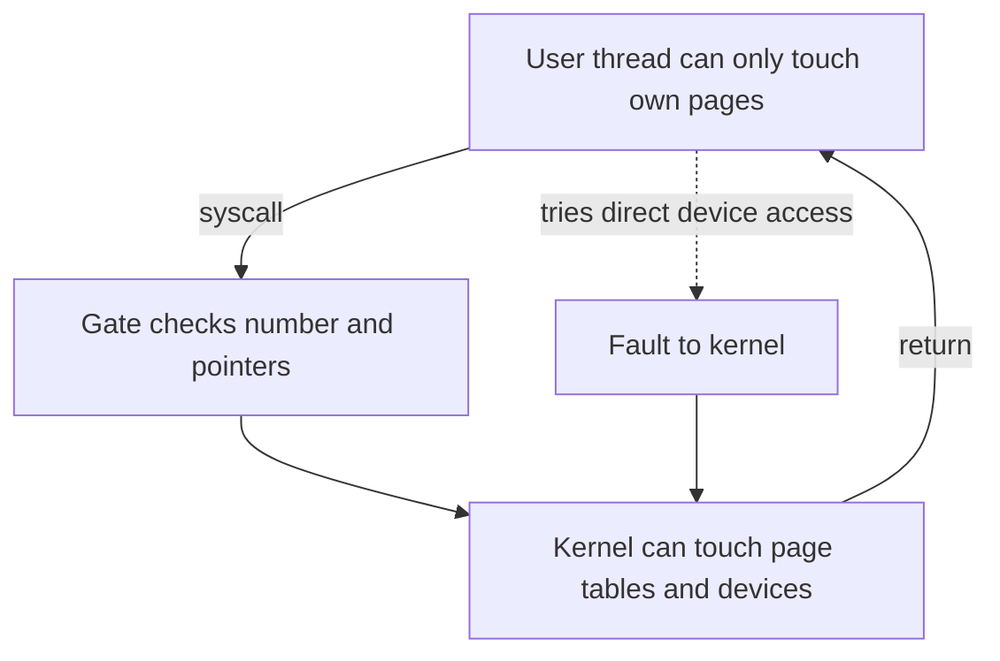
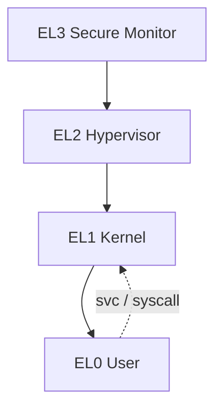
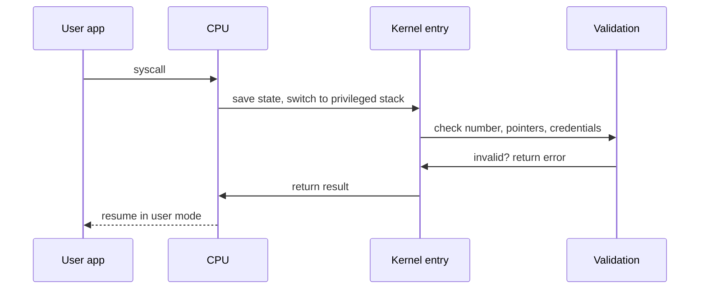

The previous chapter described how control moves to the kernel through interrupts and traps. This chapter explains why that move is safe. It is the sixth and final chapter of Stage 3.

A modern CPU runs in at least two modes. The ordinary mode runs user programs. The privileged mode runs the kernel. In user mode your program can do math and use its own memory. It cannot change the page tables, turn off interrupts, or program a device. Only the kernel can do those jobs. The hardware enforces this split. It lets a program change modes only through gates that it controls.

Picture it like this. User mode can ask. Kernel mode can act. On x86-64 these modes are called protection rings. On ARM64 they are called exception levels. Each page table entry holds bits that say whether user code may read, write, or run that page. Every system call, interrupt, and fault must pass through a gate. The kernel checks the request at the gate. Hardware features such as Secure Boot, the IOMMU (a chip that gives devices their own memory rules), and other memory protections all build on this same boundary.

For your backend, this boundary explains why things behave as they do. Suppose your service calls `mmap` with the wrong protection. The call fails and the kernel raises `SIGSEGV` (a signal for a bad memory access). A container with `seccomp` (a filter that limits system calls) can block `mprotect`. Your service cannot skip the kernel and talk to a disk on its own.

## Why privilege is needed

If every program could run any instruction, there would be no isolation (separation between programs). A program could read another process's memory by mapping any physical page. It could overwrite the kernel's scheduling tables and starve other programs. It could tell a network card to send any packet it wanted.

Without hardware privilege, the operating system would be just a library that a buggy program could ignore. Hardware privilege turns the OS into an enforcer. Even when user code is buggy or malicious, it cannot skip the checks. The CPU itself refuses the operation.



The diagram shows the two paths. The intended path goes through a gate that checks the request. Any attempt to go around the gate faults (fails and traps to the kernel). The fault is delivered to the kernel, and the kernel decides what to do.

## User mode and supervisor mode

Your program runs in user mode most of the time. It can use ordinary instructions. It can touch pages that are marked as open to user code. It cannot use instructions like `cli` to disable interrupts on x86. It cannot write to the register that holds the page table base.

Supervisor mode, also called kernel mode, can do those things. It can reach all memory, including pages marked for the kernel only. It can program devices.

A thread spends almost all of its time in user mode. It enters kernel mode only when a defined event happens. That event is a system call, an interrupt from a device, or an exception from its own instruction. When it returns, it uses a special instruction: `sysret` on x86-64 or `eret` on ARM64. That instruction restores the previous mode.

Do not confuse kernel mode with kernel space as a software idea. In the earlier overview article, user space and kernel space were about which software owns the memory and which interfaces are used. Privilege levels are the hardware that makes that ownership stick. The CPU enforces the limits on user space. The limits exist because the hardware enforces them, not because files are organized in a certain way.

## Protection rings and exception levels

Different CPU designs give these modes different names. The idea is the same.

On x86-64 the specification defines four rings, but modern operating systems use only two. Ring 3 is user mode. Ring 0 is kernel mode. The middle rings are mostly unused. Virtualization adds another layer below the kernel. It is often called ring minus 1, and that is where the hypervisor (the virtualization layer) runs.

On ARM64 there are exception levels. EL0 is user mode. EL1 is the kernel. EL2 is the hypervisor. EL3 is the secure monitor that starts the machine. A system call from user code is `svc`. It moves from EL0 to EL1. Other transitions use `hvc` or `eret`.

The exact number of levels matters less than the rule they enforce. More privileged code can look at less privileged memory if it chooses. Less privileged code cannot reach more privileged state except through a gate.



## Memory protection on every page

The CPU checks permission on every memory access. That check lives in the page table entry. On x86-64 a page can be marked readable, writable, or executable. The `U` bit controls user access. The `NX` bit means no-execute (do not run code here). On ARM64 the fields `AP`, `XN`, and `PXN` do the same job with more detail.

For example, a page that holds your program's code might be marked as user-readable and executable, but not writable. A page that holds the heap might be readable and writable, but not executable. A page that holds kernel data is marked as not open to user code at all.

When user code tries to write a read-only page, or run code on a page marked `NX`, the access faults (fails and traps). The CPU sends the fault to the kernel, which then sends `SIGSEGV` to the process. When kernel code touches user memory by mistake, extra guards like SMAP on x86 or PAN on ARM can also fault. This is on purpose. It stops an attacker who controls a user pointer from tricking the kernel into using it.

Guard pages use the same mechanism. The kernel leaves an empty, unmapped page at the end of a stack. If recursion goes too far and touches it, the access faults at once. It does not silently corrupt the next mapping.

Your backend meets this when you call `mmap` with `PROT_READ` and then try to write. You also meet it when you `mprotect` a page to make it executable. The call can fail. An access can fault later. Both cases are the hardware saying the permission was not allowed.

## Controlled transitions

User code cannot jump to any address in the kernel. The CPU only allows entry through addresses stored in tables that the kernel set up. On x86-64 this is the interrupt descriptor table. On ARM64 it is the vector table. Each entry says what privilege is needed to use it.

A system call is one of those entries. User code puts a number in `rax` on x86-64 or `x8` on ARM64. It puts the arguments in the other registers. Then it runs `syscall` or `svc`. The CPU switches to the kernel stack, saves the registers, and jumps to the single kernel entry point. From there the kernel checks the number. It validates every user pointer and length. It checks the process's capabilities. Then it decides what to do. If the number is wrong or a pointer is invalid, it returns `EPERM` or `EFAULT` instead of crashing.



The kernel copies user memory with helpers like `copy_from_user` for a good reason. Between the time it checks a pointer and the time it uses it, the user thread could change the memory. The helper does the copy safely. This is the same point the system call article made about trusting user pointers.

## Secure Boot and other hardware protections

Privilege protects the machine while it runs. Secure Boot protects which code is allowed to get privilege at all. Firmware checks the bootloader's signature. The bootloader checks the kernel's signature. The kernel checks module signatures. The chain starts from a key burned into hardware or stored in a TPM (a secure chip). If a step fails, the machine stops or falls back. It will not run a tampered kernel with full privilege.

Two other protections matter for a backend. An IOMMU (a chip that gives devices their own memory rules) gives devices their own page tables. Without it, a device doing DMA (direct memory access) could write to any physical page. With it, DMA is limited to the pages the kernel mapped for that device. A network card cannot overwrite kernel memory even if its firmware is buggy. A TPM or secure enclave stores keys and can prove which software booted. This is how a cloud VM proves to a peer that it is truly the payment service and not an impostor.

In production, your service often relies on all three together. Secure Boot makes sure the right kernel gained ring 0. The IOMMU bounds DMA. A certificate name proves which service you talked to. A hostname string alone does not prove that.

## Seeing protection without a kernel module

You do not need to write kernel code to observe this. The kernel already exposes the protections.

```bash
cat /proc/self/maps | head
```

The first columns show the address range and permissions. `r--p` or `rw-p` are ordinary user pages. Later lines show where the heap and stack sit.

You can provoke a fault safely from a scripting language.

```bash
python3 -c "import mmap; m=mmap.mmap(-1, 4096, prot=mmap.PROT_READ); m[0]=1"
```

The write to a read-only mapping raises `SIGBUS` or `SIGSEGV` instead of corrupting another mapping.

System calls still cross the gate, and you can watch them.

```bash
strace -e trace=mmap,mprotect ./program
```

Protection details appear in kernel logs and in process status.

```bash
dmesg | grep -i "NX\|SMEP\|SMAP"
cat /proc/self/status | grep -E "CapEff|Seccomp"
```

If you run the same binary under a tighter `seccomp` filter, the same `mprotect` can return `EPERM` even though the page exists. The error comes from the gate, not from the math in your program.

A deeper experiment maps a page as readable, fills it, then changes it to readable and executable and calls it through a function pointer. First, try mapping it as writable and executable at the same time. Some configurations reject this, because write and execute together is treated as a risk. Then map it writable, write your code, and `mprotect` it to executable afterward. These separate steps are usually allowed.

## A realistic production example

A team added a native Python extension. It used `mmap` and `mprotect` with `PROT_WRITE|PROT_EXEC` to build a small JIT (a just-in-time code generator). It worked on their laptops. In production the service crashed on startup with `SIGSEGV` and `EPERM` in `strace`. The container runtime there enabled a `seccomp` profile that blocks `mprotect` with execute permission. The kernel enforced `W^X`, which means a page should not be both writable and executable at once.

The first reaction was to disable the filter. That would have worked, but it would have removed a mitigation. The mitigation stops an attacker from writing code and then running it. The better fix kept the mitigation and changed the allocation. The code allocated a page writable, wrote the generated instructions, and then changed the mapping to readable and executable before calling it. It never asked for write and execute together. It used an approved JIT path that the platform allowed. Latency stayed the same. The service no longer needed to weaken the boundary.

The lesson was not that protection is slow. The extra `mprotect` is cheap. The lesson is this. When `mmap` succeeds but `mprotect` or an access fails, the layer that rejected you is the privilege boundary. The correct fix is to follow its rules instead of disabling them.

## How engineers actually think about privilege

When a call fails with `EPERM`, `EFAULT`, or `SIGSEGV`, engineers check the boundary before blaming logic. They look at `errno`. They look at the mapping in `/proc/<pid>/maps`. They look at `CapEff` and `Seccomp` in `/proc/<pid>/status`. They run `strace` to see whether a `syscall` was rejected at the gate or whether the error happened after. They check `dmesg` for IOMMU messages when DMA is involved. For a production service, they check whether Secure Boot or TPM attestation is part of how the peer proves its identity.

The habit is to ask which level said no. A page permission fault, a `seccomp` filter, and a normal permission check all look similar at first. They are enforced by different layers and have different fixes.

## SMEP, SMAP, PXN, and PAN: keeping the kernel away from user memory

Privilege does not only protect user code from the kernel. Recent CPUs add protections that stop the kernel from carelessly touching user memory. SMEP (supervisor-mode execution prevention) marks user pages as non-executable even when the CPU is in kernel mode. A kernel bug or exploit cannot jump into shellcode placed in user memory. SMAP (supervisor-mode access prevention) blocks the kernel from reading or writing user pages. The kernel must explicitly open a window with a special instruction to do so. On ARM these are PXN (privileged execute never) and PAN (privileged access never).

These matter because many kernel exploits work by getting the kernel to dereference an attacker-controlled user pointer as code or data. With these bits on, that path faults by hardware, not by convention. This is why `dmesg` shows `SMEP` and `SMAP` enabled as a line item in a security audit. They are the per-access complement to the page-table permission bits. The same page that is writable by the user is now also off-limits to the kernel unless the kernel asks for it on purpose.

## Linux capabilities: fine-grained privilege without root

On Linux, `root` is not one switch. Privilege is split into about forty capabilities, each granting one class of operation. `CAP_NET_BIND_SERVICE` lets a process bind a port below 1024. `CAP_SYS_ADMIN` covers a broad set of administrative actions. `CAP_SYS_PTRACE` allows debugging other processes, and so on. A program can drop every capability it does not need. It keeps only the few it must have.

This is why the article's distinction between `root` and the privilege boundary matters. A container running as `root` may still have an empty capability set. It cannot load a kernel module or change the system clock. A non-root process granted `CAP_NET_BIND_SERVICE` can bind port 80 without being root at all. `CapEff` in `/proc/<pid>/status` shows the effective set. The engineering practice is least privilege. Grant exactly the capabilities a service needs and drop the rest at startup. This shrinks what a compromise could do.

## seccomp-bpf: shrinking the syscall surface

A process under Linux can install a seccomp filter. This is a tiny program written in BPF. It inspects each syscall number and arguments and decides allow, deny, or trap. The common case is the default-deny profile used by containers and runtimes. Only a small allowlist of syscalls is permitted. Anything else returns `EPERM`. This is exactly the mechanism that blocked the `mprotect` with execute permission in the production example. The filter did not know about the service's JIT, so it rejected the call at the gate.

The value is attack-surface reduction. Even if an attacker gains code execution inside a process, they can only invoke the syscalls the filter permits. This often removes the ones needed for further escape. `seccomp` is the deepest layer shown here. It sits below capabilities and below page permissions, because it is checked at the syscall gate before the kernel validates arguments. Combined with dropping capabilities and running unprivileged, it is the core of container sandboxing.

## The kernel lives in your address space: KPTI and PCID

A convenient detail of Linux is that the kernel is mapped into the top of every process's virtual address space. A `syscall` therefore changes privilege level but usually does not switch page tables. The kernel's code and data are already present, just marked inaccessible to user mode. This keeps system calls cheap. There is no full page-table reload on every call.

Two refinements modify this. The first is KPTI, kernel page-table isolation. It was added to defend against Meltdown-class attacks that let user code read kernel memory through speculative execution. KPTI keeps a separate kernel page table and switches to it on entry. The kernel mapping is not present in user mode at all. The cost is an extra TLB flush on every crossing. The second is PCID on x86 or ASID on ARM. This is a tag that lets the TLB keep entries for both address spaces, so switching does not invalidate everything. Both are reminders that the privilege gate and the page tables are linked. The same transition that the syscall article described as a mode switch is also a possible page-table switch, depending on the mitigation.

## Definitions

### Privilege levels

> Hardware modes that separate user code, which is restricted, from kernel code, which is privileged. On x86 user code runs in ring 3 and the kernel in ring 0, on ARM in EL0 and EL1, and transitions are only allowed through gates like `syscall`.

### User mode versus kernel mode

> User mode runs ordinary code with access only to its own virtual pages. Kernel mode can manage page tables, program devices, and touch other processes' state. A user thread must trap to do privileged work. If it tries directly, the access faults.

### Memory protection

> Each page has permission bits that are checked on every access, such as readable, writable, executable, and user accessible. If user code tries to break them, the access faults and the kernel delivers `SIGSEGV`. This is how the system enforces `W^X` and keeps one process from reading another's memory.

### Controlled transitions

> The only legal way to enter privileged mode. User code runs `syscall` or `svc`, the CPU looks up the handler in the IDT or vector table, switches to the kernel stack, and the kernel validates the number, pointers, and credentials before dispatching.

### Secure Boot

> A hardware-rooted chain that checks each boot stage's signature before that stage is given privilege. Firmware checks the bootloader, the bootloader checks the kernel, and the chain starts from a key in hardware.

## Beyond the definitions

### Why user code cannot change page tables

> The page table decides which physical page a virtual address maps to. If user code could write the table, it could map any physical page, including kernel memory, and break isolation. Only privileged mode may write the table base register.

### What NX and W^X enforce

> `NX` marks a page as not executable, so trying to run code there faults. `W^X` is the rule that a page should not be both writable and executable at once, which stops an attacker from writing shellcode and then running it.

### How the kernel reads user pointers safely

> It checks that the range is inside user space, verifies the user-accessible bit, and then copies with a helper like `copy_from_user` that handles the case where the user thread changes the memory during the check.

### What the IOMMU does

> It gives I/O devices their own page tables, so DMA is limited to the pages the kernel mapped for that device. Without it, a device could overwrite any RAM, including kernel memory.

## Common misconceptions

**"Kernel space is just a folder."** It is a privilege mode enforced by hardware. Directories like `/boot` have nothing to do with it. One is about files, the other is about which instructions the CPU will allow.

**"More privilege is always faster."** Entering the kernel is slower because the CPU must switch mode, save state, and validate. Privilege is for protection, not speed. If you cross it often, batch system calls or use `io_uring` to reduce trips.

**"If I am root, privilege does not matter."** `root` is a software identity. Even as `root`, user code still runs in user mode until it traps. Container `root` can still be blocked by `seccomp`, capabilities, and page protections.

**"Secure Boot is just for laptops."** Cloud VMs and containers use measured boot to seal keys and attest which kernel booted. That attestation is how you know the kernel that gained privilege is the one you expected.

## Summary

Privilege levels are the hardware reason the operating system can actually enforce isolation. User code asks through traps, the CPU only allows entry through gates, each page carries its own permission bits, and features like IOMMU and Secure Boot extend the same idea beyond the basic rings. For a backend, the difference between `EPERM`, `EFAULT`, and `SIGSEGV`, or between `mmap` succeeding and `mprotect` failing, is the sound of this boundary doing its job.

With this chapter, Stage 3 ends. We moved from how a single instruction is executed, through the counters that measure it, the caches and memory ordering that sit underneath it, and the device interrupts and privilege gates that let it talk to the rest of the machine safely. The next stage looks at how that source code becomes an executable in the first place.
