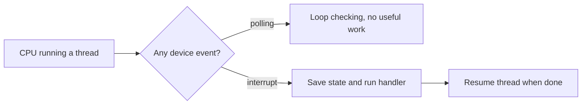
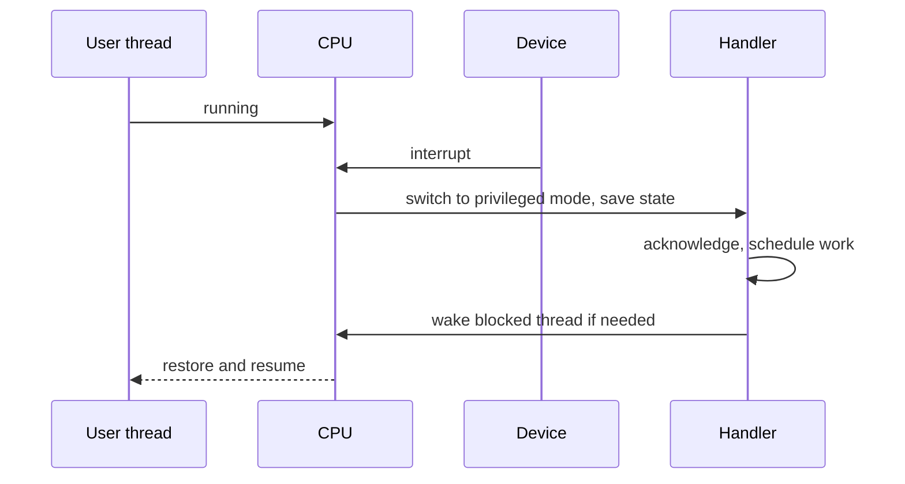
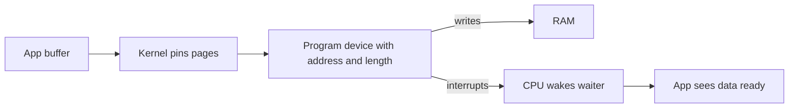
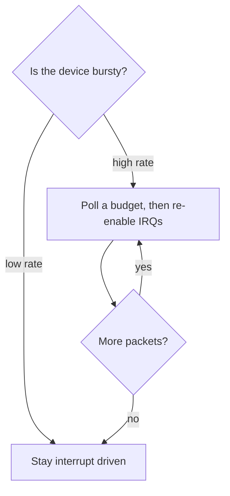

> Stage 3 — Hardware and Computer Architecture  
> Subject area 3.2 — Memory Hardware and Ordering  
> Article 5

## The short version

A CPU spends most of its time running the current thread's instructions. Something else will eventually need its attention. A device may have finished moving data, a program may have asked for a kernel service, or an instruction may have faulted because a page was not mapped.

The hardware has three names for these detours. An interrupt comes from a device and is asynchronous, like a network card saying a packet arrived. A trap is synchronous and intentional, like the `syscall` instruction that asks the kernel to open a file. An exception is also synchronous, but it is a fault, like a page fault or a divide by zero. In all three cases the CPU saves enough state to come back, switches to a privileged mode, runs a handler, and then returns.

Devices move data in different ways. Some use memory-mapped registers where a normal load or store reaches the hardware. Others use DMA, which lets the device write directly to RAM without the CPU copying every byte. A driver is the kernel code that sets these mechanisms up and handles their errors.

You feel this in a backend whenever a `read` from disk or a `recv` from the network completes. The completion is an interrupt, then a DMA write, then a handler that wakes your thread. Whether the system uses interrupts or polling changes tail latency and CPU usage.

## Where this article fits

Earlier articles explained how caches and memory ordering let cores share data. This article is about how the CPU talks to devices, and how user code enters the kernel without constantly checking.

You should read this after the CPU execution article, because it uses the same idea of a mode switch, and after the system call article, because a system call is one kind of trap. The next article explains why that mode switch is safe, which is the privilege boundary that makes all of this possible.

Later, when you study `epoll`, `mmap`, and storage, you will see the same path again. A packet arrival wakes `epoll` through an interrupt, and a file read may avoid a copy through DMA.

## The CPU cannot poll everything

A device is asynchronous. A packet can arrive at any moment, a disk can finish a request after a varying time, and a timer can fire. If the CPU checked each device in a tight loop, it would waste cycles when there is nothing to do and still react late when something happens.

Interrupts solve this by turning the direction around. The CPU runs useful work until the device tells it there is work to do.



The point of the diagram is not that polling is always wrong. Polling can be the right choice when events are very frequent, but for most devices waking only when needed is cheaper.

## Interrupts, traps, and exceptions are different

It helps to separate the three, because they come from different places and have different handlers. An interrupt comes from outside the CPU, from a device or a timer, and it is not tied to the current instruction. A trap is caused by the current instruction on purpose. The program executes `syscall` on x86-64 or `svc` on ARM64 because it wants the kernel to do something. An exception is also caused by the current instruction, but it is a fault that the program did not intend, like touching an unmapped page or executing a privileged instruction in user mode.

An interrupt might mean a network packet is ready. A trap might mean the program wants to open a file. An exception might mean the program used an address that has no page behind it and the kernel must handle the page fault or send `SIGSEGV`.

All three use a table that tells the CPU where the handler lives. On x86-64 this is the IDT, on ARM64 it is the vector table. The CPU looks up the number for the event and jumps to that address in privileged mode.

## What an interrupt handler does

The hardware does a small sequence when an interrupt arrives. It finishes the current instruction, saves the program counter and flags, switches to the kernel stack, consults the vector, and jumps to the handler. The handler acknowledges the device, moves the data or schedules more work, and wakes any thread that was waiting. Then the CPU restores the saved state and returns to what it was doing.



Two details matter here. First, the handler runs between any two instructions of the interrupted thread, so from that thread's point of view it is atomic. Second, the handler itself is short. It cannot sleep, it should not take locks that might sleep, and it should not allocate much. If there is more to do, it schedules it for later.

## Deferred work

The rule is to handle the urgent part now and the rest later. The first part, often called the top half or hard IRQ context, only acknowledges the hardware, copies a small amount of state, and schedules the second part. It runs with interrupts disabled on that CPU, so staying long would delay other devices.

The second part, the bottom half, does the heavier work. On Linux this can be a softirq, a tasklet, a workqueue, or a threaded interrupt. There, the code can take normal locks, run the network protocol, or do filesystem writeback.

A useful way to picture a network packet is a short hard IRQ that moves the packet into memory and schedules a softirq, which then parses headers and wakes the socket. If the softirq part becomes heavy, it can starve user threads on that CPU. You can see this with `mpstat -I` where softirq time is high, or by looking at `/proc/interrupts` and seeing one CPU handle all the network interrupts.

When a device is very busy, Linux can switch from interrupts to polling for a while. The network subsystem calls this NAPI. After a burst of interrupts, it stops taking interrupts and polls a budget of packets. When the burst is done, it goes back to interrupts. This keeps the cost bounded when the packet rate is high.

## How devices move data

A device has registers that control it. Older machines used special port instructions, `in` and `out` on x86, to reach those registers. Most modern devices use memory-mapped I/O. Their registers appear as memory addresses. A normal load or store to that address goes to the device instead of RAM. The page tables mark that range as uncacheable and with ordering that preserves side effects, because a read from a device register can clear an interrupt, which is not true for normal memory.

Bulk data is different. Copying every byte with the CPU would keep the core busy and pollute the caches. Direct memory access lets the device write directly to RAM. The kernel pins the pages so they cannot be swapped out, tells the device the physical address and length, and lets it write. When the write is done, the device interrupts.



Without DMA, the CPU would loop and copy. With DMA, the CPU does the setup, the device does the transfer, and an interrupt tells the CPU when to wake the waiting thread. Zero-copy paths like `sendfile` or `io_uring` with fixed buffers build on this, plus keeping pages pinned so no extra copy is needed.

A driver is the kernel code that knows how to do this for one device. It initializes the hardware, programs queues, registers the interrupt with `request_irq`, maps DMA buffers, and handles errors and power management. A common bug is to sleep inside a hard IRQ handler or to forget to unmap a DMA buffer, which leaks or corrupts.

## Polling versus interrupts

Interrupts and polling trade latency for CPU. At low rates, interrupts are better because the CPU can sleep until work arrives. At very high rates, each interrupt adds overhead, and the system can spend more time entering and exiting handlers than doing useful work. Polling avoids that per-event cost but burns cycles even when there is nothing to do.

A table makes the tradeoff more concrete, but the exact numbers depend on the machine.

Interrupts have a small wakeup delay and use little CPU when idle, but they can storm under load. Polling has no per-event wakeup cost and its CPU usage is predictable, but it wastes work when idle. Linux uses a hybrid. At low rates it is interrupt driven, at high rates it polls a budget of packets and then re-enables interrupts. For a backend, you would only enable busy polling like `SO_BUSY_POLL` or `io_uring`'s `SQPOLL` after measuring that p99 improves more than CPU rises.



## Seeing interrupts on a real machine

You can observe these mechanisms without writing a driver. Look at the per-CPU interrupt counts to see which CPU handles which device.

```bash
cat /proc/interrupts | head
```

For storage, you can watch queue depth and wait time while you copy a large file.

```bash
cat /sys/block/nvme0n1/queue/nr_requests
iostat -x 1
```

For networking, `mpstat` shows how much time is spent in softirqs, and tracing can show the vector that fired.

```bash
mpstat -I SUM -P ALL 1
perf stat -e irq_vectors:local_timer_entry ./program
```

On a virtual machine the numbers are virtualized and less meaningful. On bare metal, balance matters. If a network card's interrupts are pinned to one CPU, that CPU can become the bottleneck while others are idle. The affinity is visible in `/proc/irq/*/smp_affinity` and can be changed.

A small experiment helps make DMA concrete. Read the same large file once normally and once with `O_DIRECT`, and compare the time, the `r_await` in `iostat`, and the `nvme` interrupt count. One path goes through the page cache with copies, the other avoids the cache and completes through DMA and an interrupt. The point is not that one is always better, but that the difference shows up in those counters.

## A realistic production example

A team ran a Go HTTP service at about 80k requests per second. Median latency was fine, but p99 `recv` latency spiked to 20 ms while overall CPU was only 40 percent. `mpstat -I` showed one CPU saturated with softirq time while the others were idle. `/proc/interrupts` showed all network interrupts on CPU 0. The NAPI budget was being hit, and the burst of hard interrupts left little time for user handlers.

Adding more HTTP workers did not help, because the bottleneck was not in the workers. The team spread the interrupts across CPUs by writing to `smp_affinity`, enabled RPS to spread protocol processing, and later changed the hottest path to use `io_uring` with polling instead of interrupts. After spreading, p99 fell to a couple of milliseconds and CPU rose to about 55 percent. The extra CPU was the measured cost of better latency. The takeaway was that not every slow backend is slow in application code. Sometimes the notification path itself is saturated.

## How experienced engineers investigate

They start with whether the interrupt is firing at all, which you can see from the count in `/proc/interrupts`. Then they check balance, whether one CPU does all the work. They look at whether softirqs are starving user threads, which shows up in `mpstat` or `perf`. They check `dmesg` for IOMMU or driver errors that would mean DMA was not mapped correctly, and they look at driver messages in the journal. Finally they ask whether the choice between interrupts and polling matches the actual rate, comparing p99 before and after a change instead of guessing.

## Interview definitions

### What is an interrupt?

> An interrupt is an asynchronous signal from a device that tells the CPU to pause the current thread, run a kernel handler, and then return. A network card uses it to say a packet is ready, and the handler wakes the thread that was waiting.

### What is a trap? An exception?

> A trap is a synchronous, intentional transfer to the kernel, like the `syscall` instruction that asks to open a file. An exception is also synchronous, but it is a fault, like a page fault when an address has no mapped page. Both are looked up in the vector table, but they have different handlers.

### What is a hard interrupt versus deferred work?

> The hard interrupt is the tiny first part that runs immediately with interrupts disabled. It only acknowledges the device and schedules more work. Deferred work, like a softirq or workqueue, runs later and does the heavier parsing or filesystem work where it can sleep.

### What is DMA?

> DMA lets a device transfer bulk data directly to and from RAM without the CPU copying each byte. The kernel pins the pages, tells the device the address and length, the device writes and then interrupts, and the waiting thread is woken. This is how zero-copy works.

### What is MMIO?

> Memory-mapped I/O exposes a device's registers as memory addresses. A normal load or store to that address talks to the hardware. The mapping is marked uncacheable, and a read can have side effects, so it needs ordering barriers.

## Interview follow-up questions

### Why must a handler be short?

> It runs in an atomic context with interrupts disabled on that CPU. It cannot sleep, it should not take sleeping locks, and it delays everything else on that core, so heavy work is deferred to a softirq or workqueue.

### When would you use polling instead of interrupts?

> At a sustained high rate where the per-interrupt entry and exit cost is higher than busy polling and you care about tail latency. At low rates polling wastes CPU, so Linux normally uses interrupts and switches to polling only during bursts, like NAPI does.

### How does DMA differ from a CPU copy?

> A CPU copy loops on the core, uses cycles, and moves data through caches. With DMA, the kernel programs the device once and the device moves the data. The CPU only handles the final interrupt and wakes the waiter.

### How do you see which device is interrupting?

> `cat /proc/interrupts` shows per-CPU counts for each vector, `mpstat -I` shows how much time is spent in softirqs, and `dmesg` or `journalctl -k` shows driver errors.

## Common misconceptions

### “Interrupts are just system calls.”

A system call is a trap that the program runs on purpose. An interrupt comes from a device at an arbitrary time. They use the same entry mechanism but come from different sources and run in different contexts.

### “DMA means no CPU work.”

DMA avoids copying every byte, but the CPU still has to pin pages, program the device, handle the interrupt, and wake the waiter. The work is smaller, not zero.

### “More interrupts always means faster.”

At high rates a storm of interrupts and softirqs can saturate a core and delay user threads. Coalescing or polling can be faster when measured.

### “MMIO memory is normal RAM.”

It is not. A read can clear a status register, caching is disabled, and ordering requires barriers. It behaves like device communication, not storage.

## Summary

Devices and the CPU coordinate through interrupts that arrive from hardware, traps that user code runs intentionally, and exceptions that are faults. The first handler must be tiny and atomic, and heavier work is deferred to softirqs or workqueues. Data reaches devices through memory-mapped registers and reaches RAM in bulk through DMA, both managed by drivers. Polling trades steady CPU for lower tail latency when the rate is high. For a backend, a packet or a disk completion follows the same path every time, from interrupt to DMA to softirq to wakeup, and where that interrupt lands determines latency.

## If you want to build this later

You can study this without custom hardware. Write one program that blocks on a pipe read and another that waits with `epoll`, and compare the wakeup latency. Look at `/proc/interrupts` before and after copying a large file with `dd`, and note how the count grows. If you can, trace softirq time with `mpstat -I` at low and high load, then enable busy polling with `SO_BUSY_POLL` and see how p99 and CPU change. The goal is to decide for your own workload whether the notification path should be interrupt driven or polled.
