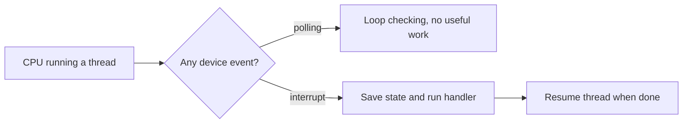
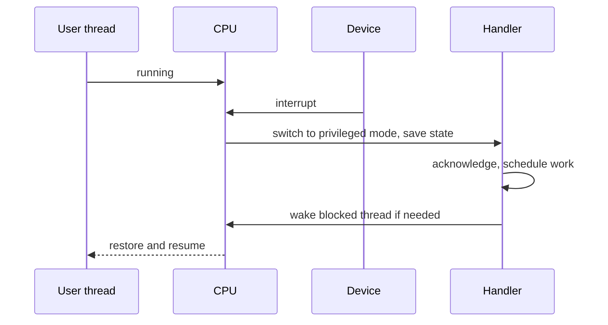
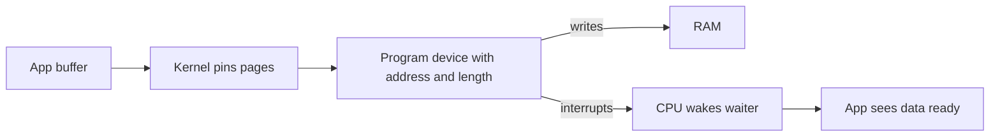
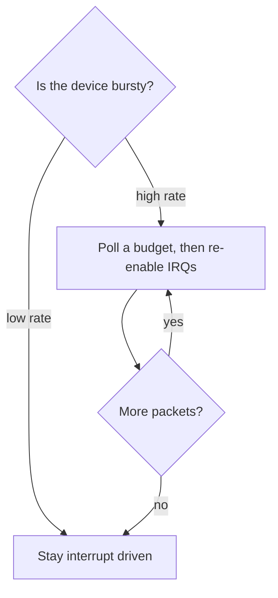

The last chapter showed how cores share memory. It showed how ordering rules decide what a thread can trust. This chapter shows how the CPU talks to devices. It shows how user code enters the kernel without checking all the time. This is the fifth chapter of Stage 3.

A CPU runs one thread's instructions most of the time. Sooner or later, something else needs its attention. A device may finish moving data. A program may ask the kernel for a service. Or an instruction may fault. A fault means the instruction cannot finish. For example, the page it needs is not mapped.

The hardware gives these events three names. An interrupt comes from a device. It is asynchronous, which means it does not line up with any specific instruction. A network card raises an interrupt when a packet arrives. A trap is synchronous and intended. The program runs the `syscall` instruction to ask the kernel to open a file. An exception is also synchronous, but it is a fault. A page fault or a divide by zero raises an exception. In all three cases the CPU saves its state, switches to a privileged mode, runs a handler, and returns.

Devices move data in two main ways. Some use memory-mapped registers. A memory-mapped register is a device control slot that acts like a memory address. A normal load or store to that address goes to the hardware. Others use DMA. DMA stands for direct memory access. It lets the device write to RAM on its own, so the CPU does not copy each byte. A driver is the kernel code that sets up these mechanisms and handles errors.

You feel this in a backend when a `read` from disk or a `recv` from the network finishes. The finish starts with an interrupt. Then a DMA write puts the data in RAM. Then a handler wakes your thread. The choice between interrupts and polling changes tail latency. Tail latency is the time of your slowest responses, such as the 99th percentile. It also changes CPU use.

## The CPU cannot poll everything

A device is asynchronous. A packet can arrive at any time. A disk can finish a request after an unknown delay. A timer can fire on its own. If the CPU checked each device in a loop, it would waste cycles when nothing happens. It would still react late when something does happen.

Interrupts solve this by turning the direction around. The CPU runs useful work until the device tells it there is work to do.



The point of the diagram is not to say polling is always wrong. Polling can be the right choice when events are very frequent. But for most devices, waking only when needed is cheaper.

## Interrupts, traps, and exceptions are different

It helps to separate the three. They come from different places and use different handlers. An interrupt comes from outside the CPU. It comes from a device or a timer. It is not tied to the current instruction. A trap is caused by the current instruction on purpose. The program runs `syscall` on x86-64 or `svc` on ARM64 because it wants the kernel to do something. An exception is also caused by the current instruction. It is a fault that the program did not intend. For example, it touches an unmapped page or runs a privileged instruction in user mode.

An interrupt might mean a network packet is ready. A trap might mean the program wants to open a file. An exception might mean the program used an address that has no page behind it and the kernel must handle the page fault or send `SIGSEGV`.

All three use a table that tells the CPU where each handler lives. On x86-64 this table is the IDT, the interrupt descriptor table. On ARM64 it is the vector table. The CPU looks up the number for the event and jumps to that address in privileged mode.

## What an interrupt handler does

The hardware follows a small sequence when an interrupt arrives. It finishes the current instruction. It saves the program counter and the flags. It switches to the kernel stack. It looks up the vector and jumps to the handler. The handler acknowledges the device. It moves the data or schedules more work. It wakes any thread that was waiting. Then the CPU restores the saved state and returns to what it was doing.



Two details matter here. First, the handler runs between any two instructions of the interrupted thread. From that thread's point of view the handler is atomic. Atomic means the thread never sees a half-done interruption. Second, the handler itself is short. It cannot sleep. It should not take locks that might sleep. It should not allocate much. If there is more to do, it schedules the rest for later.

## Deferred work

The rule is to handle the urgent part now and the rest later. The first part is often called the top half or hard IRQ context. It only acknowledges the hardware. It copies a small amount of state. It schedules the second part. It runs with interrupts disabled on that CPU. Staying long would delay other devices.

The second part is the bottom half. It does the heavier work. On Linux this can be a softirq. A softirq is a lightweight deferred handler that runs after the hard IRQ. It can also be a tasklet, a workqueue, or a threaded interrupt. In the bottom half, the code can take normal locks. It can run the network protocol or do filesystem writeback.

Picture a network packet this way. A short hard IRQ moves the packet into memory and schedules a softirq. The softirq then parses the headers and wakes the socket. If the softirq part becomes heavy, it can starve user threads on that CPU. Starve means the threads wait while the softirq keeps running. You can see this with `mpstat -I` when softirq time is high. You can also look at `/proc/interrupts` and see one CPU handle all the network interrupts.

When a device is very busy, Linux can switch from interrupts to polling for a while. The network subsystem calls this NAPI. After a burst of interrupts, it stops taking interrupts. It polls a budget of packets. A budget is a fixed number of packets per pass. When the burst is done, it goes back to interrupts. This keeps the cost bounded when the packet rate is high.

## How devices move data

A device has registers that control it. Older machines used special port instructions, `in` and `out` on x86, to reach those registers. Most modern devices use memory-mapped I/O. Their registers appear as memory addresses. A normal load or store to that address goes to the device instead of RAM. The page tables mark that range as uncacheable. They also add ordering that preserves side effects. A side effect is a change the read itself causes. For example, a read from a device register can clear an interrupt. That is not true for normal memory.

Bulk data is different. Copying every byte with the CPU would keep the core busy. It would also pollute the caches. Direct memory access lets the device write directly to RAM. The kernel pins the pages so they cannot be swapped out. It tells the device the physical address and the length. Then it lets the device write. When the write is done, the device interrupts.



Without DMA, the CPU would loop and copy. With DMA, the CPU does the setup. The device does the transfer. An interrupt tells the CPU when to wake the waiting thread. Zero-copy paths build on this. `sendfile` and `io_uring` with fixed buffers keep pages pinned so no extra copy is needed.

A driver is the kernel code that knows how to do this for one device. It initializes the hardware. It programs queues. It registers the interrupt with `request_irq`. It maps DMA buffers. It handles errors and power management. A common bug is to sleep inside a hard IRQ handler. Another common bug is to forget to unmap a DMA buffer. That leaks memory or corrupts data.

## Polling versus interrupts

Interrupts and polling make a trade. Interrupts give lower latency but cost some CPU. Polling costs steady CPU but avoids per-event overhead. At low rates, interrupts are better because the CPU can sleep until work arrives. At very high rates, each interrupt adds overhead. The system can spend more time entering and exiting handlers than doing useful work. Polling avoids that per-event cost. It burns cycles even when there is nothing to do.

You can compare the two directly to see the trade. The exact numbers depend on the machine.

At low rates, interrupts have a small wakeup delay. They use little CPU when idle. They can storm under load. At high rates, polling has no per-event wakeup cost. Its CPU usage is predictable. It wastes work when idle. Linux uses a hybrid. At low rates it is interrupt driven. At high rates it polls a budget of packets and then re-enables interrupts. For a backend, only enable busy polling after you measure it. Use `SO_BUSY_POLL` or `io_uring`'s `SQPOLL` only if p99 improves more than CPU rises.



## Seeing interrupts on a real machine

You can observe these mechanisms without writing a driver. Look at the per-CPU interrupt counts. They show which CPU handles which device.

```bash
cat /proc/interrupts | head
```

For storage, you can watch queue depth and wait time while you copy a large file.

```bash
cat /sys/block/nvme0n1/queue/nr_requests
iostat -x 1
```

For networking, `mpstat` shows how much time is spent in softirqs. Tracing can show the vector that fired.

```bash
mpstat -I SUM -P ALL 1
perf stat -e irq_vectors:local_timer_entry ./program
```

On a virtual machine the numbers are virtualized and less meaningful. On bare metal, balance matters. If a network card's interrupts are pinned to one CPU, that CPU can become the bottleneck while others are idle. Pinned means stuck to one core. The affinity is visible in `/proc/irq/*/smp_affinity`. It can be changed.

A small experiment makes DMA concrete. Read the same large file once normally. Read it again with `O_DIRECT`. Compare the time, the `r_await` in `iostat`, and the `nvme` interrupt count. One path goes through the page cache with copies. The other avoids the cache and completes through DMA and an interrupt. The point is not that one is always better. The point is that the difference shows up in those counters.

## A realistic production example

A team ran a Go HTTP service at about 80k requests per second. Median latency was fine. But p99 `recv` latency spiked to 20 ms while overall CPU was only 40 percent. `mpstat -I` showed one CPU saturated with softirq time. The others were idle. `/proc/interrupts` showed all network interrupts on CPU 0. The NAPI budget was being hit. The burst of hard interrupts left little time for user handlers.

Adding more HTTP workers did not help. The bottleneck was not in the workers. The team spread the interrupts across CPUs by writing to `smp_affinity`. They enabled RPS to spread protocol processing. Later they changed the hottest path to use `io_uring` with polling instead of interrupts. After spreading, p99 fell to a couple of milliseconds. CPU rose to about 55 percent. The extra CPU was the measured cost of better latency. The takeaway is that not every slow backend is slow in application code. Sometimes the notification path itself is saturated.

## How engineers actually investigate

Engineers start by checking whether the interrupt fires at all. You can see this from the count in `/proc/interrupts`. Then they check balance. They ask whether one CPU does all the work. They look at whether softirqs are starving user threads. This shows up in `mpstat` or `perf`. They check `dmesg` for IOMMU or driver errors. Such errors would mean DMA was not mapped correctly. They look at driver messages in the journal. Last, they ask whether the choice between interrupts and polling matches the actual rate. They compare p99 before and after a change instead of guessing.

## How an interrupt reaches a core: APIC, MSI-X, and per-queue vectors

A device does not send an interrupt straight to a CPU. On x86, each core has a local APIC. The chipset has an I/O APIC. Together they route interrupts. The kernel's `/proc/interrupts` counts are per-vector and per-CPU entries. Older systems used a single shared line per device. This forced many devices to share one handler and one CPU. Modern devices use MSI or MSI-X. MSI-X stands for message-signaled interrupts. The device writes a small message with a vector number directly to a CPU's local APIC.

MSI-X matters for performance. A device such as a network card can request many vectors. It gets one vector per receive or transmit queue. The kernel can steer each vector to a different CPU. This is called receive-side scaling. Each queue's completions land on the CPU that owns that flow. Cache locality is preserved. No single core becomes the interrupt bottleneck described in the production example. When you see all network interrupts on CPU 0, it usually means the vectors were not spread. It can also mean the affinity masks were left at their default. That is exactly what the fix in that example changed.

## The trap into the kernel, and the vDSO shortcut

A trap such as `syscall` on x86-64 or `svc` on ARM64 is the door from user code to kernel code. The CPU switches to a privileged mode. It saves the user registers. It swaps to the kernel stack. It jumps to the kernel's entry point. The kernel then dispatches on the system call number. Every call such as `read`, `write`, or `open` pays this entry and exit cost. The cost is small but not zero. It shows up as syscall overhead in profiles.

Not every kernel service needs a trap. Linux maps a small read-only page of kernel-maintained code into every process. This page is called the vDSO. It answers certain calls entirely in user space. These calls only need values the kernel already shares, such as the current time or the CPU number. `clock_gettime`, `gettimeofday`, and `getcpu` often run through the vDSO without ever trapping. This is why a tight timing loop does not show up as a storm of syscalls. Knowing which calls trap and which do not helps you understand latency in services that measure time often.

## Exceptions classified: faults, traps, and aborts

The word exception covers several different things. The distinction changes how the CPU resumes. A fault is a synchronous condition. It can be corrected and the instruction restarted. A page fault is an example. The kernel maps the page and the instruction runs again. A trap is also synchronous but intentional. A breakpoint or the `INT3` instruction used by debuggers is an example. The saved instruction pointer points to the instruction after the trap. The program continues from there. An abort is a more serious condition. A machine-check or bus error is an example. It may not be recoverable. It often ends the process or panics the kernel.

This classification explains the earlier phrasing. A page fault is a fault. Once the kernel fixes the mapping, execution resumes as if nothing happened. A `syscall` instruction is closer to a trap. It is intentional and continues after the kernel returns. Confusing them is harmless in conversation. It matters when you reason about which events are restartable and which force a different control flow.

## Interrupt coalescing and the latency trade

Devices do not always raise an interrupt the instant one packet arrives. A network card or storage controller often uses interrupt coalescing. This means it waits until a few events accumulate. It can also wait until a short timer expires before raising the line. A burst then produces one interrupt instead of thousands. The kernel and `ethtool -C` expose this as parameters. Examples are the completion coalescing delay and the packet count.

Coalescing is the device-level twin of the polling decision. More coalescing means fewer interrupts and less CPU. It adds latency because the first packet waits for the batch. Less coalescing lowers latency. The cost is more interrupts under load. NAPI already handles the high-rate case by switching to polling. At moderate rates the coalescing delay is the lever. Lowering it is a common way to shave microseconds off p99 receive latency. The price is more softirq time. Measure both sides. A change that helps one request rate can hurt another.

## Definitions

### An interrupt

> An interrupt is an asynchronous signal from a device. Asynchronous means it arrives at any time, not tied to any instruction. It tells the CPU to pause the current thread, run a kernel handler, and then return. A network card uses it to say a packet is ready. The handler wakes the thread that was waiting.

### A trap and an exception

> A trap is a synchronous, intentional transfer to the kernel. The `syscall` instruction that asks to open a file is an example. An exception is also synchronous, but it is a fault. A page fault is an example, when an address has no mapped page. Both are looked up in the vector table, but they have different handlers.

### Hard interrupt versus deferred work

> The hard interrupt is the tiny first part that runs immediately with interrupts disabled. It only acknowledges the device and schedules more work. Deferred work runs later. A softirq or workqueue does it. It does the heavier parsing or filesystem work where it can sleep.

### DMA

> DMA lets a device transfer bulk data directly to and from RAM. The CPU does not copy each byte. The kernel pins the pages. It tells the device the address and the length. The device writes and then interrupts. The waiting thread is woken. This is how zero-copy works.

### MMIO

> Memory-mapped I/O exposes a device's registers as memory addresses. A normal load or store to that address talks to the hardware. The mapping is marked uncacheable. A read can have side effects. So it needs ordering barriers.

## Beyond the definitions

### Why a handler must be short

> It runs in an atomic context with interrupts disabled on that CPU. Atomic means it cannot be split. It cannot sleep. It should not take sleeping locks. It delays everything else on that core. Heavy work is deferred to a softirq or workqueue.

### When polling beats interrupts

> Polling wins at a sustained high rate. There, the per-interrupt entry and exit cost is higher than busy polling. You also care about tail latency. At low rates polling wastes CPU. Linux normally uses interrupts. It switches to polling only during bursts, like NAPI does.

### DMA versus a CPU copy

> A CPU copy loops on the core. It uses cycles. It moves data through caches. With DMA, the kernel programs the device once. The device moves the data. The CPU only handles the final interrupt and wakes the waiter.

### How to see which device is interrupting

> `cat /proc/interrupts` shows per-CPU counts for each vector. `mpstat -I` shows how much time is spent in softirqs. `dmesg` or `journalctl -k` shows driver errors.

## Common misconceptions

**"Interrupts are just system calls."** A system call is a trap that the program runs on purpose. An interrupt comes from a device at an arbitrary time. They use the same entry mechanism. They come from different sources and run in different contexts.

**"DMA means no CPU work."** DMA avoids copying every byte. But the CPU still has to pin pages, program the device, handle the interrupt, and wake the waiter. The work is smaller, not zero.

**"More interrupts always means faster."** At high rates a storm of interrupts and softirqs can saturate a core. It can delay user threads. Coalescing or polling can be faster when measured.

**"MMIO memory is normal RAM."** It is not. A read can clear a status register. Caching is disabled. Ordering requires barriers. It behaves like device communication, not storage.

## Summary

Devices and the CPU coordinate in three ways. Interrupts arrive from hardware. Traps are run by user code on purpose. Exceptions are faults. The first handler must be tiny and atomic. Heavier work is deferred to softirqs or workqueues. Data reaches devices through memory-mapped registers. It reaches RAM in bulk through DMA. Drivers manage both. Polling trades steady CPU for lower tail latency when the rate is high. For a backend, a packet or a disk completion follows the same path every time. It goes from interrupt to DMA to softirq to wakeup. Where that interrupt lands determines latency.
