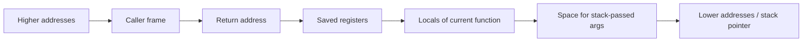

The previous chapter followed your source text as it became object files. This chapter opens up one step: code generation. This is the step where a call stops being a name and becomes registers, a stack frame, and a jump. This is the second article in Stage 4.

A call in source code becomes a set of low-level steps. The caller puts the arguments where the callee expects them. It saves the place to return to. Then it jumps. The callee may reserve stack space for its own variables. It does its work. It puts the result where the caller expects it. Then it jumps back.

The places where values go are not decided fresh for each function. They follow a shared rule called a calling convention. A calling convention is part of a larger rule called an ABI. The ABI also says how the stack grows and what each register means. A stack frame is the area a function keeps for its local variables, saved registers, and bookkeeping. The code that sets up the frame is the prologue. The code that removes it is the epilogue.

The same Go source can use different calling conventions on `amd64` and `arm64`. Different compilers and versions can differ too. A debugger shows you this mapping when it prints a backtrace. `objdump` shows the instructions that make it work.

## Registers and instructions

A register is a small storage slot inside the CPU. An instruction can use it quickly. General-purpose registers hold integers, addresses, and temporary results. Other registers hold floating-point values, vector values, the current stack location, and the address of the next instruction.

An instruction is a binary pattern. It says what operation to run and which operands to use. An operand can be a register, a constant written into the instruction, or a memory location worked out from registers. Common operations move data between memory and registers. Others add or compare values. Others jump to another address. Some call and return from functions.

Here is a very small Go function. The name `add` and the type `int` exist for source code. The CPU sees only registers and jumps.

```go
package main

func add(a, b int) int {
    return a + b
}
```

If you ask the Go compiler to show the assembly for the package, you see how that return is lowered to machine code.

```bash
go tool compile -S -o /tmp/p.o main.go 2>&1 | grep -A 10 '"".add'
```

On `amd64` you will see a line like `TEXT "".add(SB), $0-24`. It uses `MOVQ` and `ADDQ` with registers such as `AX` and `BX`. On `arm64` you will see `MOV` and `ADD` with registers such as `R0` and `R1`. The names differ because the processors use different registers and encodings. The idea is the same. The function reads two values, adds them, and hands the result to the caller.

## Function calls, arguments, and return values

At source level you write `add(x, y)`. At machine level this becomes a protocol between the caller and the callee.

An ABI says which registers carry the first arguments. It says where the rest of the arguments go. It says which registers a callee must keep. It says where the return value is left. On Go's `amd64` `ABIInternal`, the first arguments and results often travel in registers instead of on the stack. That is why `go tool compile -S` shows `AX` and `BX`. On `arm64` the first arguments sit in `R0` to `R7`. The C System V ABI on `amd64` uses `DI`, `SI`, `DX`, `CX`, `R8`, `R9` for integer arguments and `XMM0` for floating point.

A call instruction usually saves a return address and hands over control. On `amd64` the return address is pushed onto the stack. On `arm64` it is saved in a link register. A `ret` instruction uses that saved address to go back.

A tiny caller shows this in practice. The small program calls `os.ReadFile`. That call later reaches runtime helpers. Even a call you did not write, such as the hidden call that grows a goroutine's stack, follows the same ABI.

```go
// in main.go
data, err := os.ReadFile(path)
```

If you take apart the built binary, you see the `CALL` for `os.ReadFile`. You also see the code that checks `err` after it returns.

```bash
go build -o tiny main.go
go tool objdump -s "main.main" tiny | head -n 40
```

Look for `CALL` and for the instructions that move the results into the slots the caller reserved. The check `if err != nil` becomes a test and a conditional jump. This is the same control flow from the CPU pipeline article, but now you can see it as `JE` or `B.EQ`.

## Stack frames, prologues, and epilogues

A stack is a region of memory. It grows when functions are called and shrinks when they return. A stack frame is the part that one active call keeps for itself. It may hold the return address, the previous frame pointer if one is kept, saved registers the function must keep, the function's local variables, and space for arguments that did not fit in registers.

The code that creates a frame is called the prologue. It subtracts from the stack pointer to reserve space and saves registers. The code that removes the frame is the epilogue. It restores registers, adds back the stack size, and returns.



The diagram shows the layout from high to low addresses on a typical `amd64` stack that grows downward. The exact order depends on the ABI, the compiler, and whether a frame pointer is kept. Go's toolchain often drops the traditional frame pointer in optimized builds. It records frame sizes in tables for the garbage collector and for stack traces. That is why `go tool objdump` shows `TEXT "".add(SB), $0-24`, where `$0` is the frame size for that function. It is also why `gdb` can show a backtrace even when not every frame has a saved `RBP`.

The number after the dash is `-24` in that example. This is the space the caller reserves for arguments and results when they do not fit in registers. The callee reads and writes that space as part of the call.

## ABI differences you will actually see

An ABI is the binary contract that lets separately compiled pieces work together. It covers how arguments and returns are passed. It covers how the stack is aligned. It covers which registers are caller-saved and which are callee-saved. It covers how the stack is unwound for a backtrace or for garbage collection.

Go has its own ABI called `ABIInternal` for most non-assembly functions. It has `ABI0` for the few places where it must work with C. The C System V ABI is the more widely documented example. You see it in `objdump` for programs that call the OS through `libc`. This is why a Go function and a C function with the same signature can use different registers for the same call.

A simple way to see this is to build the tiny program for two architectures and compare the prologues.

```bash
GOARCH=amd64 go tool compile -S -o /tmp/a.o main.go 2>&1 | grep -A 8 '"".add'
GOARCH=arm64 go tool compile -S -o /tmp/b.o main.go 2>&1 | grep -A 8 '"".add'
```

You will see that the `amd64` version mentions `AX`, `BX`, `SP`, and `CALL`. The `arm64` version mentions `R0`, `R1`, `SP`, and `BL`. The source `add` did not change. The instructions that implement it did, because the calling convention is per architecture.

Another difference is whether a frame pointer is kept. A frame pointer such as `RBP` on `amd64` makes walking the stack easy for a debugger. It costs one register and a couple of instructions. An optimized Go build often drops this cost and keeps precise tables for stack walking instead. This is why `gdb` can show a Go backtrace even when no `RBP` chain exists.

## Seeing frames with a debugger

A basic read you can do with no extra setup is to build the tiny program with debug information. Then ask a debugger where the program is.

```bash
go build -o tiny main.go
gdb -ex "break main.main" -ex "run" -ex "backtrace" -ex "info registers" --args ./tiny 2>&1 | head -n 40
```

This shows that a source-level call is now a set of frames. Each line of the backtrace is one frame. The debugger shows the function name. It shows the source file and line that the debug information records. It shows the address where the thread stopped. Registers such as `RSP` show the current stack pointer. `RIP` or `PC` shows the next instruction.

If you run `info frame` or `info registers` at that breakpoint, you will see the saved return address. You will see the local variables that the compiler decided to keep. In an optimized build some locals may show as `<optimized out>`. This is not a debugger bug. It means the value lives in a register or was removed entirely, as described in the pipeline article.

A second exercise makes the convention visible by forcing a difference.

```bash
go tool compile -S -o /tmp/inline.o main.go 2>&1 | grep -A 5 'CALL.*add'
go build -gcflags="all=-l" -o tiny.noinline main.go
go tool objdump -s "main.main" tiny.noinline | grep -A 5 'CALL.*add'
```

With inlining allowed, the call to a small helper like `add` may disappear. The body was inlined into the caller. With `-l` to disable inlining, the `CALL` remains. You can see the argument moves before it and the result use after it. The same program gives different call sequences. The convention is about the boundary, and inlining removes the boundary.

## A realistic production example

A team saw a crash in a mixed Go and C service. It used `cgo` to call a C helper for a fast checksum. The helper took a pointer and a length. The crash happened only on `arm64` and only when the helper was called from a hot path. The stack trace showed the C helper reading past its buffer. The Go code always passed a valid slice.

The source for the call looked correct. The Go code passed the slice header as a pointer and a length. The helper expected the C layout, where a pointer and a length are two separate arguments with C ABI alignment. On `amd64`, the Go `ABIInternal` and the C ABI happened to place the two values in the same registers. The helper read them as if they were one struct. The length was read correctly by chance because the stack was aligned. On `arm64`, the two ABIs place arguments in different registers. The helper received the pointer correctly but read an old value for the length.

The fix was to stop passing a Go slice directly to C. The Go side copied the slice header into a C struct with explicit `C.size_t` fields. It called a helper with that struct. It added a check that the length matched `cap`. It also added a test that built and ran for both `GOARCH` values in CI with `go vet` and `cgo` checks. The instructions that make a call are not just a jump. They are a contract about where each byte lives. The contract changes when the architecture changes.

## How engineers actually use this

Engineers do not memorize every register for every processor. They ask where the call boundary is. They ask what the ABI says about that boundary. They ask what the tools show was actually generated. If a debugger shows a variable as optimized away, they check whether inlining removed the frame. If `cgo` corrupts a value, they compare the Go assembly for the caller with the C assembly for the callee. They check which registers each side expects. If a backtrace looks wrong, they check whether the binary was stripped. They check whether frame tables are present.

## Definitions

### A calling convention

> The calling convention is the agreement between the caller and the callee. It says where arguments are placed. It says where a return value is left. It says which registers are preserved. It says how the return address is saved. This lets separately compiled code call each other correctly.

### A stack frame

> A stack frame is the region of stack memory that one active function call reserves. It holds the return address, saved registers, local variables, and space for arguments that do not fit in registers. Each active call has one frame. A backtrace walks those frames.

### A prologue and an epilogue

> The prologue is the code at the start of a function. It reserves a frame and saves registers. The epilogue is the code at the end. It restores registers, frees the frame, and returns.

### An ABI

> An ABI (application binary interface) is the rule set that says how separately built pieces talk at the instruction level. It covers the calling convention, register use, and stack layout. Examples are Go's `ABIInternal` and the C System V ABI.

### Why registers differ by architecture

> The source describes a call, but the calling convention is per architecture. The compiler lowers the same call to `AX` on `amd64` and `R0` on `arm64`. Those are the registers the ABI says to use.

## Beyond the definitions

### Why a debugger can miss a variable

> The compiler may have inlined the function that held it. It may have kept it in a register that has already been reused. It may have removed it as dead code. The source still names the variable, but the optimized code has no single place for it.

### Why Go has its own convention

> Go can choose a convention that fits its runtime. It can use fast calls with registers and precise tables for garbage collection and stack traces. Where it must call C, it uses the C ABI so the two sides agree.

### Frame pointers: cost and benefit

> A saved frame pointer makes walking the stack cheap and simple for a debugger. Omitting it frees a register and removes instructions. The compiler uses tables instead when it can.

## Common misconceptions

**"A function call is just a jump."** It is a jump with a contract. Where arguments and return values live, which registers are saved, and where the return address is stored must match on both sides. If they do not, the callee reads the wrong bytes.

**"The same source gives the same registers everywhere."** Registers and instruction names differ by architecture and ABI. The source `add(a,b)` can use `AX` on one machine and `R0` on another.

**"The debugger is wrong when it shows optimized out."** The debugger is showing what the binary contains. The optimizer may have inlined the call. It may have kept the value only in a register that is no longer live.

**"Stack frames are always the same size."** Frame size depends on locals, saved registers, and whether arguments spill to the stack. Inlined functions may have no frame at all.

## Summary

A call becomes a protocol. The caller puts arguments where the ABI says. It saves the return address and jumps. The callee builds a frame in its prologue. It uses registers and stack slots for locals. It puts a result where the caller expects it. It restores the frame in its epilogue. The same source can give different registers and stack layouts on `amd64` and `arm64`. The convention is per architecture. A debugger and `objdump` show you that mapping. An optimized build can hide it by inlining the call entirely.
