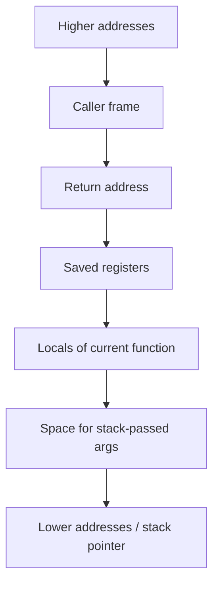

The previous chapter followed source text to object files through the compiler pipeline. This chapter looks inside one step, code generation, which is where a call stops being a name and becomes registers, a stack frame, and a jump. It is the second article of Stage 4.

A function call in source code becomes a set of low-level steps. The caller puts arguments where the callee expects them, saves the place to return to, and jumps. The callee may reserve space on the stack for its own variables, do its work, put a result where the caller expects it, and jump back.

Those where values go and who saves what are not decided anew for each function. They are a shared agreement called a calling convention, which is part of a larger agreement called an ABI that also says how the stack grows and which registers have which meaning. A stack frame is the region a function reserves for its locals, saved registers, and bookkeeping. The code that sets it up and tears it down is the prologue and epilogue.

The same Go source can produce different calling conventions on `amd64` and `arm64`, and different compilers or versions can differ as well. A debugger shows you this mapping when it prints a backtrace, and `objdump` shows the instructions that implement it.

## Registers and instructions

A register is a small storage location inside the CPU that an instruction can use quickly. General-purpose registers hold integers, addresses, and temporary results. Other registers hold floating-point or vector values, the current stack location, and the address of the next instruction.

An instruction is a binary pattern that says what operation to do and with which operands. An operand can be a register, a constant written into the instruction, or a memory location computed from registers. Common operations are to move data between memory and registers, to add or compare values, to jump to another address, and to call and return from functions.

Consider a very small Go function. The name `add` and the type `int` are for source code. The CPU sees only registers and jumps.

```go
package main

func add(a, b int) int {
    return a + b
}
```

If you ask the Go compiler to show the assembly for the current package, you see the lowering of that return.

```bash
go tool compile -S -o /tmp/p.o main.go 2>&1 | grep -A 10 '"".add'
```

On `amd64` you will see something like `TEXT "".add(SB), $0-24` with `MOVQ` and `ADDQ` using registers like `AX` and `BX`. On `arm64` you will see `MOV` and `ADD` with registers like `R0` and `R1`. The names differ because the processors have different registers and encodings, but the idea is the same. The function reads two values, adds them, and makes the result available to the caller.

## Function calls, arguments, and return values

At source level you write `add(x, y)`. At machine level that becomes a protocol between the caller and the callee.

An ABI says which registers carry the first few arguments, where additional arguments go, which registers a callee must preserve, and where the return value is left. On Go's `amd64` `ABIInternal`, the first arguments and results are often passed in registers rather than on the stack, which is why `go tool compile -S` shows `AX` and `BX` being used. On `arm64` the first arguments are in `R0` to `R7`. C's System V ABI on `amd64` uses `DI`, `SI`, `DX`, `CX`, `R8`, `R9` for integer arguments and `XMM0` for floating point.

A call instruction usually saves a return address and transfers control. On `amd64` that return address is pushed, on `arm64` it is saved in a link register. A `ret` instruction uses that saved address to go back.

A tiny caller makes this concrete. The tiny program calls `os.ReadFile`, which eventually calls runtime helpers. Even a call you did not write directly, like the implicit call that grows the stack for a goroutine, follows the same ABI.

```go
// in main.go
data, err := os.ReadFile(path)
```

If you disassemble the built binary you see the `CALL` for `os.ReadFile` and the code that checks `err` after it returns.

```bash
go build -o tiny main.go
go tool objdump -s "main.main" tiny | head -n 40
```

Look for `CALL` and for the instructions that move the results into the slots the caller reserved. The `if err != nil` becomes a test and a conditional jump, which is the same control flow you saw in the CPU pipeline article, now visible as `JE` or `B.EQ`.

## Stack frames, prologues, and epilogues

A stack is a region of memory that grows and shrinks as functions call and return. A stack frame is the portion a single active call reserves for its own use. It may hold the return address, the previous frame pointer where one is kept, saved registers the function must preserve, the function's local variables, and space for arguments that did not fit in registers.

The code that creates a frame is often called the prologue. It subtracts from the stack pointer to reserve space and saves registers. The code that removes the frame is the epilogue. It restores registers, adds back the stack size, and returns.



The diagram shows the layout from high to low addresses on a typical `amd64` stack that grows downward, but the exact order depends on the ABI, the compiler, and whether a frame pointer is kept. Go's toolchain often omits a traditional frame pointer in optimized builds and records frame sizes in tables for the garbage collector and for stack traces. That is why `go tool objdump` shows `TEXT "".add(SB), $0-24` where `$0` is the frame size for that function, and why `gdb` may still show a backtrace without every frame having a saved `RBP`.

The size after the dash, `-24` in that example, is the space the caller reserves for arguments and results when they do not fit in registers. The callee will read and write that space as part of the call.

## ABI differences you will actually see

An ABI is the binary contract that lets separately compiled pieces work together. It covers how arguments and returns are passed, how the stack is aligned, which registers are caller-saved versus callee-saved, and how the stack is unwound for a backtrace or for garbage collection.

Go has its own ABI called `ABIInternal` for most non-assembly functions, and `ABI0` for the few places where it must interoperate with C. The C System V ABI is the more widely documented example you see in `objdump` for programs that call the OS through `libc`. The difference is why a Go function and a C function with the same signature can use different registers for the same call.

A simple way to see the effect is to build the tiny program for two architectures and compare the prologues.

```bash
GOARCH=amd64 go tool compile -S -o /tmp/a.o main.go 2>&1 | grep -A 8 '"".add'
GOARCH=arm64 go tool compile -S -o /tmp/b.o main.go 2>&1 | grep -A 8 '"".add'
```

You will see that the `amd64` version mentions `AX`, `BX`, `SP`, and `CALL`, while the `arm64` version mentions `R0`, `R1`, `SP`, and `BL`. The source `add` did not change, but the instructions that implement it did, because the calling convention is per architecture.

Another difference is whether a frame pointer is kept. A frame pointer, like `RBP` on `amd64`, makes walking the stack trivial for a debugger, but it costs a register and a couple of instructions. An optimized Go build often recovers that cost and keeps precise tables for stack walking instead. That is why `gdb` can show a Go backtrace even when no `RBP` chain exists.

## Seeing frames with a debugger

A basic read you can do without any extra setup is to build the tiny program with debug information and ask a debugger where it is.

```bash
go build -o tiny main.go
gdb -ex "break main.main" -ex "run" -ex "backtrace" -ex "info registers" --args ./tiny 2>&1 | head -n 40
```

What it demonstrates is that a source-level call is now a set of frames. Each line of the backtrace is a frame. The debugger shows the function name, the source file and line that the debug information records, and the address where the thread stopped. Registers like `RSP` show the current stack pointer, and `RIP` or `PC` shows the next instruction.

If you run `info frame` or `info registers` at that breakpoint, you will see the saved return address and the locals that the compiler decided to keep. In an optimized build some locals may be reported as `<optimized out>`, which is not a debugger bug. It means the value lives in a register or was removed entirely, as described in the pipeline article.

A second exercise makes the convention visible by forcing a difference.

```bash
go tool compile -S -o /tmp/inline.o main.go 2>&1 | grep -A 5 'CALL.*add'
go build -gcflags="all=-l" -o tiny.noinline main.go
go tool objdump -s "main.main" tiny.noinline | grep -A 5 'CALL.*add'
```

With inlining allowed, the call to a small helper like `add` may disappear because the body was inlined. With `-l` to disable inlining, the `CALL` remains and you can see the argument moves before it and the result use after it. The same program semantics produce different call sequences because the convention is about the boundary, and inlining removes the boundary.

## A realistic production example

A team saw a crash in a mixed Go and C service that used `cgo` to call a C helper for a fast checksum. The helper took a pointer and a length. The crash only happened on `arm64` and only when the helper was called from a hot path. The stack trace showed the C helper reading past its buffer, but the Go code always passed a valid slice.

The source for the call looked correct. The Go code passed the slice header as a pointer and length, but the helper expected the C layout where a pointer and a length are two separate arguments with C ABI alignment. On `amd64` the Go `ABIInternal` and the C ABI happened to place the two values in registers that the helper read as if they were one struct, and the length was read correctly by chance because the stack happened to be aligned. On `arm64` the two ABIs place arguments in different registers, so the helper received the pointer correctly but read an old value for the length.

The fix was to not pass a Go slice directly to C. The Go side copied the slice header into a C struct with explicit `C.size_t` fields and called a helper with that struct, and added a check that the length matched `cap`. It also added a test that built and ran for both `GOARCH` values in CI with `go vet` and `cgo` checks. The instructions that implement a call are not just a jump. They are a contract about where each byte lives, and the contract changes when the architecture changes.

## How engineers actually use this

They do not memorize every register for every processor. They ask where the call boundary is, what the ABI says about that boundary, and what the tools show was actually generated. If a debugger shows a variable as optimized away, they check whether inlining removed the frame. If `cgo` corrupts a value, they compare the Go assembly for the caller with the C assembly for the callee and check which registers each expects. If a backtrace looks wrong, they check whether the binary was stripped and whether frame tables are present.

## Definitions

### A calling convention

> The agreement between caller and callee about where arguments are placed, where a return value is left, which registers are preserved, and how the return address is saved, so separately compiled code can call each other correctly.

### A stack frame

> The region of stack memory a single active function call reserves for its return address, saved registers, locals, and space for arguments that do not fit in registers. Each active call has one frame, and a backtrace walks those frames.

### A prologue and an epilogue

> The prologue is the code at the start of a function that reserves a frame and saves registers. The epilogue is the code at the end that restores registers, frees the frame, and returns.

### An ABI

> An application binary interface, like Go's `ABIInternal` or the C System V ABI, which says how separately built pieces communicate at the instruction level, including calling convention, register use, and stack layout.

### Why registers differ by architecture

> The source describes a call, but the calling convention is per architecture. The compiler lowers the same call to `AX` on `amd64` and `R0` on `arm64` because those are the registers the ABI says to use.

## Beyond the definitions

### Why a debugger can miss a variable

> The compiler may have inlined the function that held it, kept it in a register that has already been reused, or removed it as dead. The source still names the variable, but the optimized code has no single location for it.

### Why Go has its own convention

> Go can choose a convention that fits its runtime, like fast calls with registers and precise tables for garbage collection and stack traces. Where it must call C, it uses the C ABI so the two sides agree.

### Frame pointers: cost and benefit

> A saved frame pointer makes walking the stack cheap and simple for a debugger. Omitting it frees a register and removes instructions, so the compiler uses tables instead when it can.

## Common misconceptions

**"A function call is just a jump."** It is a jump with a contract. Where arguments and return values live, which registers are saved, and where the return address is stored must match on both sides, otherwise the callee reads the wrong bytes.

**"The same source gives the same registers everywhere."** Registers and instruction names differ by architecture and ABI. The source `add(a,b)` can be `AX` on one machine and `R0` on another.

**"The debugger is wrong when it shows optimized out."** The debugger is showing what the binary contains. The optimizer may have inlined the call or kept the value only in a register that is no longer live.

**"Stack frames are always the same size."** Frame size depends on locals, saved registers, and whether arguments spill to the stack. Inlined functions may have no frame at all.

## Summary

A call becomes a protocol. The caller puts arguments where the ABI says, saves the return address, and jumps. The callee builds a frame in its prologue, uses registers and stack slots for locals, puts a result where the caller expects it, and restores the frame in its epilogue. The same source can give different registers and stack layouts on `amd64` and `arm64` because the convention is per architecture. A debugger and `objdump` show you that mapping, and an optimized build can hide it by inlining the call entirely.
