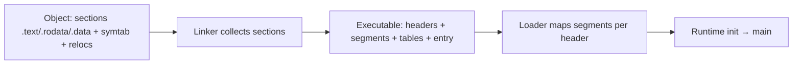
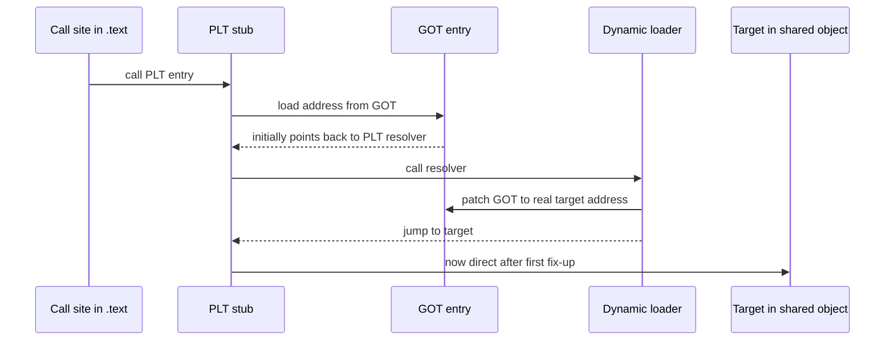
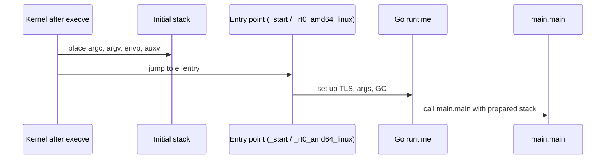

The last chapter showed how linking collects object files, resolves symbols, and patches relocations. This chapter shows what linking produces. It shows how the kernel and the runtime turn that file into a running process. This is the last article in Stage 4.

An executable file is more than machine code. It is a structured file. Its headers say how to map it into memory. Its tables say where each piece should live. Its metadata tells the loader where to start.

An object file and an executable look similar, but they serve different stages. The object file is for the linker. It has sections, symbols, and relocations. The executable is for the loader. It has segments. A segment says that a range of the file should be mapped at a certain virtual address with certain permissions. It has an entry point where the first instruction lives. When needed, it has tables that let the loader bring in shared objects and fix lazy bindings. When the kernel starts the program, it maps those segments. It sets up arguments and environment on the stack. Then it jumps to the entry point. A small runtime initializes the language's state before the `main` you wrote runs.

Executable formats differ by platform. ELF is used on Linux. PE is used on Windows. Mach-O is used on macOS. All three describe the same ideas. They have headers, sections for the toolchain, and segments for the loader. They have an entry and data for dynamic loading. They add hardening such as address randomization, position-independent code, stack canaries, and non-executable memory.

## From object to executable

An object file is organized for the linker. It keeps code and data in sections. It keeps a symbol table that says which names are defined or needed. It keeps relocations that say where to patch. An executable keeps those ideas but adds a view for the loader.

Headers sit at the front of the file. They say what kind of file this is and for which architecture. They say where to find the tables that describe the file. Sections are the toolchain's view. They separate `.text` for instructions, `.rodata` for constants, and `.data` for initialized data. They keep tables like `.symtab` and `.debug_info` for tools. Segments are the loader's view. A segment says a range of file bytes should be mapped as one contiguous virtual region. The region gets permissions like read, write, or execute.



The difference between sections and segments is not just naming. A debugger uses sections to find source lines. The kernel uses segments to map the program. An executable still contains section headers for tools. At startup the kernel follows the segments.

## Headers, sections, and segments in an ELF executable

ELF is the format on Linux. It starts with an `Elf64_Ehdr` header. That header says the file is ELF. It says whether the file is 64-bit. It says the endianness, the architecture, and the file type. It says where the program header table and the section header table live. The program header table describes segments. The section header table describes sections.

A section header says a chunk of the file holds a certain kind of data. For example, `.text` at offset `0x401000` with size `0x12000` and flags `AX` holds executable code. A program header says a segment should be mapped at a certain virtual address. For example, a `LOAD` segment at file offset `0x0` for `0x200000` bytes maps at virtual address `0x400000` with permissions `R E`.

Entry points and interpreters are also in the headers. The `e_entry` field holds the virtual address of the first instruction the kernel runs after mapping. For a dynamically linked executable, a `PT_INTERP` segment names the loader to run first, such as `/lib64/ld-linux-x86-64.so.2`. For a statically linked Go program, the entry points straight into Go's runtime.

You can see these tables for the tiny program without running it.

```bash
go build -o tiny main.go
readelf -h tiny | head -n 20
readelf -l tiny | head -n 40
readelf -S tiny | head -n 40
```

Look at `readelf -h` and check `Type`, `Machine`, and `Entry point address`. In `readelf -l`, each `LOAD` line shows `Offset`, `VirtAddr`, `FileSiz`, `MemSiz`, and `Flags` such as `R E` or `RW`. In `readelf -S`, the same bytes appear as sections with `Addr`, `Off`, and flags `AX` for execute or `WA` for write-allocate. You can read the file either way. The segments tell the loader what to map. The sections tell tools what to inspect. Both views describe the same bytes.

## ELF, PE, and Mach-O compared

All three formats solve the same problems. They organize the answers in different ways. The table below is a reference. You can check it with `readelf`, `objdump`, or `otool`.

| Idea | ELF (Linux) | PE (Windows) | Mach-O (macOS) |
|---|---|---|---|
| Magic and header | `7f 45 4c 46` `Elf64_Ehdr` at 0, says ELF, 32/64, endian, `EM_X86_64` or `EM_AARCH64` | `MZ` DOS header at 0, `e_lfanew` points to `PE\0\0` + `IMAGE_FILE_HEADER` + `IMAGE_OPTIONAL_HEADER` | `FEEDFACE`/`FEEDFACF`/`CFFAEDFE` `mach_header_64`, says `MH_EXECUTE`/`MH_DYLIB`, `CPU_TYPE_X86_64`/`ARM64` |
| Section view (toolchain) | Section header table, names in `.shstrtab`, sections `.text/.rodata/.data/.bss/.symtab/.strtab/.debug_*` | Section table after optional header, names `.text/.rdata/.data/.reloc`, data directories for imports/exports | `LC_SEGMENT_64` load commands contain sections, names like `__TEXT.__text`, `__DATA.__data`, `__DWARF.__debug_info` |
| Segment view (loader) | Program header table, types `PT_LOAD`, `PT_INTERP`, `PT_DYNAMIC`, `PT_GNU_STACK` | `IMAGE_OPTIONAL_HEADER` `AddressOfEntryPoint` + section `Characteristics`, imports via `IMAGE_DIRECTORY_ENTRY_IMPORT`, relocations in `.reloc` | Load commands `LC_SEGMENT_64` with `vmaddr/vmsize/filesize/maxprot/initprot`, `LC_DYLD_INFO`, `LC_LOAD_DYLIB` |
| Entry point | `e_entry` virtual address | `AddressOfEntryPoint` RVA plus `ImageBase` | `LC_MAIN` or `LC_UNIXTHREAD` entry |
| Loader path | `PT_INTERP` string like `/lib64/ld-linux-x86-64.so.2` | Data directory import table that the Windows loader walks | `LC_LOAD_DYLINKER` like `/usr/lib/dyld` |
| Symbols | `.symtab` + `.strtab`, global vs local, `.dynsym` for dynamic | `COFF` symbol table and import/export tables, `IMAGE_DIRECTORY_ENTRY_EXPORT` | `LC_SYMTAB` + `LC_DYSYMTAB`, two-level namespace |
| Debug info | DWARF `.debug_info`/`.debug_line` | PDB via CodeView in `.debug` directory (often external `.pdb`) | DWARF in `__DWARF` or external `.dSYM` |
| Typical tool | `readelf -h -S -l`, `objdump -h`, `nm` | `dumpbin /headers`, `objdump -p`, `x64dbg` | `otool -l -h`, `nm -m`, `otool -L` |

A few differences matter in practice. ELF keeps program headers and section headers as separate top-level tables. PE gets its segment-like behavior from section characteristics and data directories. Mach-O nests sections inside segment load commands. ELF dynamic linking uses `.dynamic` and an interpreter string. PE uses import tables. Mach-O uses `LC_LOAD_DYLIB` commands. Go's toolchain hides most of this when you run `go build`. The file it produces still follows the platform's rules. That is why `file tiny` reports `ELF 64-bit LSB executable` on Linux and `PE32+ executable` on Windows for the same Go source.

## Entry points and the dynamic loader

An executable says where its first instruction lives. That first instruction is not usually the `main` you wrote. For a dynamically linked program, the kernel first maps the executable and the interpreter named in `PT_INTERP`. Then the interpreter maps shared objects and fixes relocations. Only then does control go to the entry.

Some programs use position-independent code, also called PIC, which can load at any address. PIC uses two tables to call functions in shared libraries. The Global Offset Table, or GOT, holds the real addresses. The Procedure Linkage Table, or PLT, holds small stubs. The first call to a shared function goes through one of those stubs.



The first call is slower. The loader must resolve the symbol and write the real address into the GOT. Later calls jump directly. This is lazy binding. The symbol is resolved only when it is first used. A Go program that is statically linked for Go code has fewer of these stubs for its own packages. A Go program that uses `cgo` still has a dynamic import for `libc`.

You can see the loader and the tables without running the program.

```bash
readelf -l tiny | grep -A 2 INTERP
readelf -d tiny | head -n 20
objdump -R tiny | head -n 20
```

`readelf -l` shows the interpreter path when there is one. `readelf -d` shows the `NEEDED` shared objects. `objdump -R` shows the dynamic relocations that the loader will patch at startup. For a pure Go `tiny` with `CGO_ENABLED=0`, `NEEDED` is often empty. That is why `ldd tiny` reports `not a dynamic executable`.

## Arguments, environment, and the stack at entry

When the kernel creates a new address space for `execve`, it puts data on the stack before jumping to the entry. It places the argument strings and the environment strings. It also places an auxiliary vector. An auxiliary vector is a list of key and value pairs. It carries information the runtime needs, such as the address of the program headers, the page size, and a random value for the stack canaries.

From your program you see this as the Go variables `os.Args` and `os.Environ`. A debugger shows it as the initial stack layout.



You can see this for the tiny program without writing any C.

```bash
go build -o tiny main.go
strace -e trace=execve ./tiny 2>&1 | head -n 5
strings -a tiny | grep -E "TINY_FILE|message.txt" | head
```

`strace` shows the `execve` that the shell ran for you. It shows the filename, the argument vector, and the environment pointer. `strings` shows that the literal `"message.txt"` is in `.rodata`. The program will reference it after the stack is set up.

## Runtime initialization before your main

The first instruction in the file is not `main.main`. On Linux a tiny ELF has an entry like `_rt0_amd64_linux`. It comes from the Go runtime. It sets up thread-local storage. It parses the auxiliary vector. It starts the scheduler and the garbage collector. It prepares `os.Args`. Only then does it call the `main` you wrote.

You can see the chain with tools.

```bash
readelf -h tiny | grep Entry
go tool objdump -s "runtime.rt0_go" tiny 2>&1 | head -n 20
go tool objdump -s "main.main" tiny 2>&1 | head -n 20
gdb -ex "break main.main" -ex "run" -ex "backtrace" --args ./tiny 2>&1 | head -n 30
```

This shows the boundary between the file format and the language runtime. The kernel jumps to `e_entry`. The runtime in `_rt0_*` prepares the world that Go code expects. Then `main.main` runs with a stack that already holds `argc` and `envp`. A `panic` before `main` that shows `runtime` frames is not mysterious once you see this chain. It is the runtime initializing.

## Hardening: ASLR, PIE, canaries, and non-executable memory

An executable says what should be mapped. The loader also decides where to map it and with what protections. Modern systems add several defenses. You can see them in the headers.

Address space layout randomization, also called ASLR, picks a different base address for the executable and for the shared objects each time. For ASLR to work on the main executable, the file must be position independent. A position independent executable, or PIE, can load at any base address. A Go binary built with `go build -buildmode=pie` has type `DYN`. It can be placed at a randomized base. The normal `go build` produces an `EXEC` that historically had a fixed base. Both run, but `readelf -h` shows the difference in `Type`. `ldd` or `/proc/<pid>/maps` shows the actual base at runtime.

Non-executable memory marks regions that must not be run as code. The `PT_GNU_STACK` program header and the section flags tell the loader whether the stack may be executed. A `RW` stack without the `E` flag is the normal and safer choice.

A stack canary is a value the compiler places near the return address. It checks the value when the function returns. If an overflow overwrites the canary, the check fails and the program stops. The random value for the canary comes from the auxiliary vector that the kernel placed on the initial stack. That is why startup and the loader take part in this defense.

You can check these properties for the Go binary you just built.

```bash
go build -o tiny main.go
go build -buildmode=pie -o tiny.pie main.go
readelf -h tiny | grep Type
readelf -h tiny.pie | grep Type
readelf -Wl tiny | grep -E "GNU_STACK|LOAD"
checksec --file=tiny 2>&1 | head -n 20
```

This is not just about file size. The PIE file is built to allow randomization. The `GNU_STACK` line shows `RWE` versus `RW` and tells you whether the stack is executable. Stripping with `-s -w` does not change these load properties. It removes the section names and debug information that tools use to show your source. The loader still maps the same segments.

## A realistic production example

A team shipped a Go service as a container image built from `scratch`. They built the binary on their laptops with `CGO_ENABLED=1` and `go build -o tiny`. On their machines this binary was dynamically linked against the host's `glibc`. The binary ran locally. In the `scratch` container it failed at once with `no such file or directory` from `execve`. The file was clearly there when they listed the image. They first thought the image was corrupt.

They ran `readelf -l tiny | grep INTERP`. It showed `/lib64/ld-linux-x86-64.so.2` as the interpreter. `ldd tiny` showed `libc.so.6` as `NEEDED`. The error `no such file or directory` was not about `tiny`. It was about its interpreter, which was not present in `scratch`. A pure Go build with `CGO_ENABLED=0` had no `INTERP` and no `NEEDED` for `libc`. It started in the same container. A second team built a macOS binary on Linux with `GOOS=darwin`. They tried to run it on Linux. `file` reported `Mach-O 64-bit executable` and the kernel refused to start it. The format was wrong for the Linux loader.

They fixed the pipeline instead of the image. The `scratch` image kept the statically linked pure Go binary. They built it with `CGO_ENABLED=0` and `go build -buildmode=pie -ldflags="-s -w"` for hardening and size. A separate image based on a full distribution kept the `cgo` binary where it was needed. They added a CI step that runs `readelf -l` and `ldd` on the artifact. It fails if an unexpected `NEEDED` appears. The file format did not hide a bug. It described exactly what the loader would need. That is what the error was reporting.

## How engineers actually use this

Engineers look at the executable format when a program fails to start, crashes before `main`, or shows a surprising address. If `execve` returns `ENOENT` for a file that exists, they check `readelf -l` for `INTERP`. If a debugger shows raw addresses instead of Go names, they check whether the file was stripped. They also check whether `readelf -S` still has `.debug_info`. If an address is randomized on each run, they check `readelf -h` for `Type: DYN`. They check `/proc/<pid>/maps` for the actual base.

## Definitions

### ELF, PE, and Mach-O

> These are the executable file formats for Linux, Windows, and macOS. Each one has a header. The header says the file type and the architecture. Each has a section view for the toolchain to use when debugging. Each has a segment or load command view for the loader to use when mapping. Each has an entry point where the first instruction lives. Each has data for dynamic linking.

### Sections versus segments

> Sections are the toolchain's view. Examples are `.text` and `.debug_info`. They keep code separate from debug data. Segments are the loader's view. A `LOAD` segment says a file range should be mapped as a readable and executable region. An executable contains both views. The kernel maps the segments at startup.

### An entry point

> The entry point is the virtual address in the header. The kernel jumps there after mapping the file and its interpreter. For a Go program it points into the runtime's startup code. That code starts the scheduler before calling `main.main`.

### The dynamic loader, PLT, and GOT

> The dynamic loader is the program named in `PT_INTERP`. On Windows and macOS it is the system loader. It maps shared objects at startup. The PLT is a small stub for each imported call. The GOT is a table of addresses that the loader fills. The first call goes through the PLT. It reads the GOT, calls the loader to find the real address, and later calls use the filled GOT entry.

### ASLR, PIE, canaries, and NX

> ASLR picks a new place to map the executable and its libraries each time. PIE is a position independent executable. It can be randomized and has type `DYN`. A stack canary is a random value the kernel puts on the initial stack. The compiler checks it on return to catch overflow. NX means the stack and data cannot be run as code. An overflow cannot directly run injected code.

## Beyond the definitions

### Telling static from dynamic in Go

> Run `ldd` and `readelf -d`. A pure Go `tiny` with `CGO_ENABLED=0` often shows no `NEEDED`. `ldd` reports it is not dynamic for Go code. A `CGO_ENABLED=1` binary shows `libc` in `NEEDED`. That library must be present at runtime.

### Why execve reports a missing file

> The error is often about the interpreter named in `PT_INTERP`, not the file itself. `readelf -l` shows that interpreter path. If that loader file is not in the image, the kernel cannot start the program. The executable is there, but the loader is not.

### Why a stripped binary still runs

> Stripping with `-s -w` removes `.symtab` and `.debug_info`. These are section data for tools, not segment data for the loader. The instructions in `LOAD` segments are still mapped, so the program runs. A debugger or profiler has no names to map addresses to lines.

## Common misconceptions

**"A binary is just its sections."** Sections are for the toolchain. The kernel maps the segments. An executable needs both views. Stripping sections does not change which segments are mapped.

**"The entry point is `main`."** The entry is the runtime's startup code, such as `_rt0_*`. It prepares thread-local storage and the Go scheduler. `main.main` runs after that preparation.

**"The same source gives the same file type everywhere."** The format follows the target system. The same Go source built with `GOOS=linux` gives an ELF. Built with `GOOS=windows` it gives a PE. Built with `GOOS=darwin` it gives a Mach-O. The loader on each system expects that header.

**"`exec` replaces every byte of the old address space with file bytes."** It maps segments from the file. It places arguments and environment on the stack. It sets up the auxiliary vector. Some regions such as `heap` and `thread stacks` are allocated fresh. Hardening decides where each segment is placed and with what permissions.

## Summary

Source text becomes an executable through headers that say what kind of file it is. Sections keep code, data, and debug information separate. A symbol table and relocations were resolved by the linker. When needed, a dynamic section names shared objects and tables for lazy binding. ELF on Linux, PE on Windows, and Mach-O on macOS describe the same ideas with different tables. At startup the kernel maps the `LOAD` segments. It sets up argument, environment, and auxiliary values on the stack. It jumps to the entry in the runtime. The runtime initializes before calling the `main` you wrote. Hardening such as PIE for ASLR, non-executable memory, and stack canaries is visible in the same headers.
