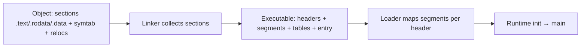
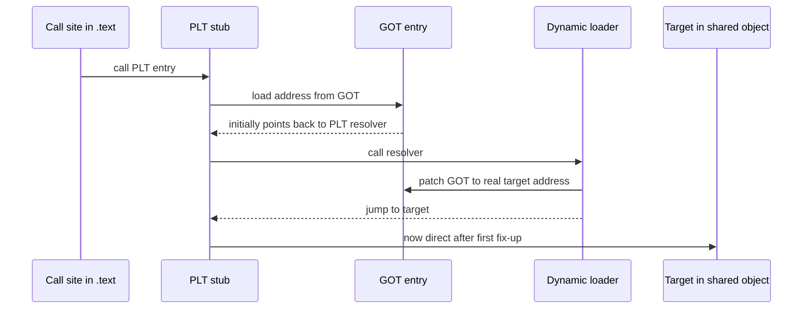
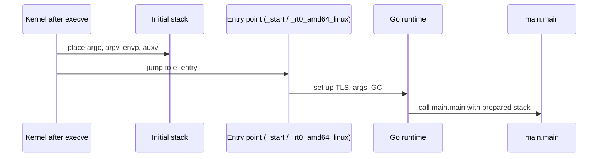

> Stage 4 — From Source Code to Execution  
> Subject area 4.2 — Linking and Loading  
> Article 5

## The short version

An executable file is more than just machine code. It is a structured file with headers that describe how to map it, tables that describe where each piece should live, and metadata that tells the loader where to start.

An object file and an executable look similar, but they serve different stages. An object file is for the linker. It has sections, symbols, and relocations. An executable is for the loader. It has segments that say a range of the file should be mapped at a certain virtual address with certain permissions, an entry point where the first instruction lives, and, when needed, tables that let the loader bring shared objects and fix lazy bindings. When the kernel starts the program, it maps those segments, sets up arguments and environment on the stack, and jumps to the entry point. A small runtime then initializes the language's state before the `main` you wrote runs.

Executable formats differ by platform. ELF is used on Linux, PE on Windows, and Mach-O on macOS, but all three describe the same ideas: headers, sections for the toolchain, segments for the loader, an entry, and data for dynamic loading, plus hardening like address randomization, position-independent code, stack canaries, and non-executable memory.

## Where this article fits

The previous article showed how linking collects object files, resolves symbols, and patches relocations. This article shows what linking produces and how the kernel and the runtime turn that file into a running process.

You need this before processes and virtual memory, because `exec` is the system call that takes an executable file and replaces the current address space with the mappings those headers describe. The same tiny program that was compiled, examined as assembly, and inspected as an object will now be inspected as an executable and traced from `execve` to the first line of `main`.

## From object to executable

An object file is organized for the linker. It keeps code and data in sections, keeps a symbol table that says which names are defined or needed, and keeps relocations that say where to patch. An executable keeps those ideas but adds a view for the loader.

Headers sit at the front and say what kind of file this is, for which architecture, and where to find the tables that describe it. Sections are the toolchain's view. They separate `.text` for instructions, `.rodata` for constants, `.data` for initialized data, and they keep tables like `.symtab` and `.debug_info` for tools. Segments are the loader's view. A segment says a range of file bytes should be mapped as a contiguous virtual region with permissions like read, write, or execute.



The distinction between sections and segments is not just naming. A debugger uses sections to find source lines, while the kernel uses segments to map the program. An executable still contains section headers for tools, but at startup the kernel follows segments.

## Headers, sections, and segments in an ELF executable

ELF, the format on Linux, starts with an `Elf64_Ehdr` header that says the file is ELF, whether it is 64-bit, its endianness, the architecture, the file type, and where the program and section header tables live. The program header table describes segments, and the section header table describes sections.

A section header says a chunk of the file, like `.text` at offset `0x401000` with size `0x12000` and flags `AX`, holds executable code. A program header says a segment like `LOAD` at file offset `0x0` for `0x200000` bytes should be mapped at virtual address `0x400000` with permissions `R E`.

Entry points and interpreters are also in headers. `e_entry` says the virtual address of the first instruction the kernel should run after mapping. For a dynamically linked executable, a `PT_INTERP` segment says which loader to run first, like `/lib64/ld-linux-x86-64.so.2`. For a statically linked Go program, the entry points directly into Go's runtime.

You can see these tables for the tiny program without running it.

```bash
go build -o tiny main.go
readelf -h tiny | head -n 20
readelf -l tiny | head -n 40
readelf -S tiny | head -n 40
```

Look at `readelf -h` for `Type`, `Machine`, and `Entry point address`. In `readelf -l`, each `LOAD` line shows `Offset`, `VirtAddr`, `FileSiz`, `MemSiz`, and `Flags` like `R E` or `RW`. In `readelf -S`, the same bytes appear as sections with `Addr`, `Off`, and flags `AX` for execute or `WA` for write-allocate. The executable can be understood either way, as segments to map or as sections to inspect, and both views describe the same bytes.

## ELF, PE, and Mach-O compared in depth

All three formats solve the same problems, but they organize the answers differently. The table below is a reference you can check with `readelf`, `objdump`, or `otool`.

| Idea | ELF (Linux) | PE (Windows) | Mach-O (macOS) |
|---|---|---|---|
| Magic and header | `7f 45 4c 46` `Elf64_Ehdr` at 0, says ELF, 32/64, endian, `EM_X86_64` or `EM_AARCH64` | `MZ` DOS header at 0, `e_lfanew` points to `PE\0\0` + `IMAGE_FILE_HEADER` + `IMAGE_OPTIONAL_HEADER` | `FEEDFACE`/`FEEDFACF`/`CFFAEDFE` `mach_header_64`, says `MH_EXECUTE`/`MH_DYLIB`, `CPU_TYPE_X86_64`/`ARM64` |
| Section view (toolchain) | Section header table, names in `.shstrtab`, sections `.text/.rodata/.data/.bss/.symtab/.strtab/.debug_*` | Section table after optional header, names `.text/.rdata/.data/.reloc`, data directories for imports/exports | `LC_SEGMENT_64` load commands contain sections, names like `__TEXT.__text`, `__DATA.__data`, `__DWARF.__debug_info` |
| Segment view (loader) | Program header table, types `PT_LOAD`, `PT_INTERP`, `PT_DYNAMIC`, `PT_GNU_STACK` | `IMAGE_OPTIONAL_HEADER` `AddressOfEntryPoint` + section `Characteristics`, imports via `IMAGE_DIRECTORY_ENTRY_IMPORT`, relocations in `.reloc` | Load commands `LC_SEGMENT_64` with `vmaddr/vmsize/filesize/maxprot/initprot`, `LC_DYLD_INFO`, `LC_LOAD_DYLIB` |
| Entry point | `e_entry` virtual address | `AddressOfEntryPoint` RVA plus `ImageBase` | `LC_MAIN` or `LC_UNIXTHREAD` entry |
| Loader path | `PT_INTERP` string like `/lib64/ld-linux-x86-64.so.2` | Data directory import table that the Windows loader walks | `LC_LOAD_DYLINKER` like `/usr/lib/dyld` |
| Symbols | `.symtab` + `.strtab`, global vs local, `.dynsym` for dynamic | `COFF` symbol table and import/export tables, `IMAGE_DIRECTORY_ENTRY_EXPORT` | `LC_SYMTAB` + `LC_DYSYMTAB`, two-level namespace |
| Debug info | DWARF `.debug_info`/`.debug_line` | PDB via CodeView in `.debug` directory (often external `.pdb`) | DWARF in `__DWARF` or external `.dSYM` |
| Typical tool | `readelf -h -S -l`, `objdump -h`, `nm` | `dumpbin /headers`, `objdump -p`, `x64dbg` | `otool -l -h`, `nm -m`, `otool -L` |

A few differences matter in practice. ELF keeps program headers and section headers as separate top-level tables, while PE derives segment-like behavior from section characteristics and data directories, and Mach-O nests sections inside segment load commands. ELF dynamic linking uses `.dynamic` and an interpreter string, while PE uses import tables and Mach-O uses `LC_LOAD_DYLIB` commands. Go's toolchain hides most of this when you run `go build`, but the file it produces still follows the platform's rules, which is why `file tiny` reports `ELF 64-bit LSB executable` on Linux and `PE32+ executable` on Windows for the same Go source.

## Entry points and the dynamic loader

An executable says where its first instruction lives, but that first instruction is not usually the `main` you wrote. For a dynamically linked program, the kernel first maps the executable and the interpreter named in `PT_INTERP`, then the interpreter maps shared objects and fixes relocations. Only then does control go to the entry.

When position-independent code used a Global Offset Table and a Procedure Linkage Table, the first call to a shared function goes through a stub.



The first call is slower because the loader must resolve the symbol and write the real address into the GOT. Later calls jump directly. This is often called lazy binding, because a symbol is only resolved when it is first used. A Go program that is statically linked for Go code has fewer of these stubs for its own packages, but a Go program that uses `cgo` still has a dynamic import for `libc`.

You can see the loader and the tables without running the program.

```bash
readelf -l tiny | grep -A 2 INTERP
readelf -d tiny | head -n 20
objdump -R tiny | head -n 20
```

`readelf -l` shows the interpreter path when there is one, `readelf -d` shows the `NEEDED` shared objects, and `objdump -R` shows the dynamic relocations that the loader will patch at startup. For a pure Go `tiny` with `CGO_ENABLED=0`, `NEEDED` is often empty, which is why `ldd tiny` reports `not a dynamic executable`.

## Program arguments, environment, and stack at entry

When the kernel creates a new address space for `execve`, it places argument strings, environment strings, and an auxiliary vector on the stack before jumping to the entry. The auxiliary vector carries information the runtime needs, like the address of the program headers, the page size, and a random value for stack canaries.

From user space you see this as the Go variables `os.Args` and `os.Environ`, and as the initial stack layout that a debugger shows.



A Level 1 read makes this concrete for the tiny program without any C.

```bash
go build -o tiny main.go
strace -e trace=execve ./tiny 2>&1 | head -n 5
strings -a tiny | grep -E "TINY_FILE|message.txt" | head
```

`strace` shows the `execve` that the shell performed for you, including the filename, argument vector, and environment pointer. `strings` shows that the literal `"message.txt"` is in `.rodata` and will be referenced after the stack is set up.

## Runtime initialization before your `main`

The first instruction in the file is not `main.main`. On Linux a tiny ELF has an entry like `_rt0_amd64_linux` from the Go runtime, which sets up thread-local storage, parses the auxiliary vector, initializes the scheduler and garbage collector, and prepares `os.Args`. Only then does it call the `main` you wrote.

You can see the chain with tools.

```bash
readelf -h tiny | grep Entry
go tool objdump -s "runtime.rt0_go" tiny 2>&1 | head -n 20
go tool objdump -s "main.main" tiny 2>&1 | head -n 20
gdb -ex "break main.main" -ex "run" -ex "backtrace" --args ./tiny 2>&1 | head -n 30
```

What it demonstrates is the boundary between the file format and the language runtime. The kernel jumps to `e_entry`, the runtime in `_rt0_*` prepares the world that Go code expects, and then `main.main` runs with the stack that already holds `argc` and `envp`. A `panic` before `main` that shows `runtime` frames is not mysterious once you see this chain. It is the runtime initializing.

## Hardening: ASLR, PIE, stack canaries, and non-executable memory

An executable says what should be mapped, but the loader also decides where and with what protections. Modern systems add several defenses that are visible in the headers.

Address space layout randomization chooses a different base for the executable and for shared objects each time. For it to work for the main executable, the file must be position independent. A Go binary built with `go build -buildmode=pie` has type `DYN` and can be placed at a randomized base, while the normal `go build` produces an `EXEC` that historically had a fixed base. Both are executable, but `readelf -h` shows the difference in `Type`, and `ldd` or `/proc/<pid>/maps` shows the actual base at runtime.

Non-executable memory marks regions that should not be executed. The `PT_GNU_STACK` program header and section flags tell the loader whether the stack should be executable. A `RW` stack without `E` is the normal, safer choice.

Stack canaries are values the compiler places near the return address and checks on return, so an overflow that overwrites the canary is detected. The random value for the canary is one of the auxiliary vector entries the kernel placed on the initial stack, which is why startup and the loader are involved in a compiler defense.

You can check these properties for the Go binary you just built.

```bash
go build -o tiny main.go
go build -buildmode=pie -o tiny.pie main.go
readelf -h tiny | grep Type
readelf -h tiny.pie | grep Type
readelf -Wl tiny | grep -E "GNU_STACK|LOAD"
checksec --file=tiny 2>&1 | head -n 20
```

What it demonstrates is not just file size. The PIE file is built to allow randomization, and the `GNU_STACK` line shows `RWE` versus `RW` and whether the stack is executable. Stripping with `-s -w` does not change these load properties. It removes the section names and debug information that tools use to show you source, but the loader still maps the same segments.

## A realistic production example

A team shipped a Go service as a container image built from `scratch`. They built the binary on their laptops with `CGO_ENABLED=1` and `go build -o tiny`, which on their machines was dynamically linked against the host's `glibc`. The binary ran locally, but in the `scratch` container it failed immediately with `no such file or directory` from `execve`. The file was clearly there when they listed the image, so they first thought the image was corrupt.

The file `readelf -l tiny | grep INTERP` showed `/lib64/ld-linux-x86-64.so.2` as the interpreter, and `ldd tiny` showed `libc.so.6` as `NEEDED`. The error `no such file or directory` was not about `tiny`. It was about its interpreter, which was not present in `scratch`. A pure Go build with `CGO_ENABLED=0` had no `INTERP` and no `NEEDED` for `libc`, and it started in the same container. A second team built a macOS binary on Linux with `GOOS=darwin` and tried to run it on Linux, where `file` reported `Mach-O 64-bit executable` and the kernel again refused to start it, this time because the format was wrong for the loader.

They fixed the pipeline instead of the image. The `scratch` image kept the statically linked pure Go binary built with `CGO_ENABLED=0` and `go build -buildmode=pie -ldflags="-s -w"` for hardening and size, while a separate image based on a full distribution kept the `cgo` binary where it was needed. They added a CI step that runs `readelf -l` and `ldd` on the artifact and fails if an unexpected `NEEDED` appears. The file format did not hide a bug. It described exactly what the loader would need, which is what the error was reporting.

## How experienced engineers use this

They look at executable format when a program fails to start, crashes before `main`, or shows a surprising address. If `execve` returns `ENOENT` for a file that exists, they check `readelf -l` for `INTERP`. If a debugger shows raw addresses instead of Go names, they check whether the file was stripped and whether `readelf -S` still has `.debug_info`. If an address is randomized on each run, they check `readelf -h` for `Type: DYN` and `/proc/<pid>/maps` for the actual base.

## Interview definitions

### What is ELF, PE, and Mach-O?

> The executable file formats for Linux, Windows, and macOS. Each has a header that says the file type and architecture, a section view that the toolchain uses for debugging, a segment or load command view that the loader uses for mapping, an entry point where the first instruction lives, and data for dynamic linking.

### What is the difference between sections and segments?

> Sections are the toolchain's view, like `.text` or `.debug_info`, and they keep code separate from debug data. Segments are the loader's view, like a `LOAD` that says a file range should be mapped as a readable and executable region. An executable contains both, but the kernel maps segments at startup.

### What is an entry point?

> The virtual address in the header where the kernel jumps after mapping the file and its interpreter. For a Go program it points into the runtime's startup code, which initializes the scheduler before calling `main.main`.

### What is the dynamic loader and what are PLT and GOT?

> The dynamic loader is the program named in `PT_INTERP` or the Windows/macOS loader that maps shared objects at startup. The PLT is a small stub for each imported call and the GOT is a table of addresses that the loader fills. The first call goes through the PLT, consults the GOT, calls the loader to resolve the real address, and later calls use the filled GOT entry.

### What are ASLR, PIE, stack canaries, and NX?

> ASLR randomizes where the executable and its libraries are mapped each time. PIE is a position-independent executable that can be randomized, with type `DYN`. A stack canary is a random value the kernel places on the initial stack and the compiler checks on return to detect overflow. NX means the stack and data are not executable, so an overflow cannot directly run injected code.

## Interview follow-up questions

### How do you tell whether a Go program is statically or dynamically linked?

> Run `ldd` and `readelf -d`. A pure Go `tiny` with `CGO_ENABLED=0` often shows no `NEEDED` and `ldd` reports it is not dynamic for Go code. A `CGO_ENABLED=1` binary shows `libc` in `NEEDED`, which must be present at runtime.

### Why does `execve` report `no such file or directory` when the file exists?

> The error is often about the interpreter named in `PT_INTERP`, not the file itself. `readelf -l` shows that interpreter path, and if that loader file is not in the image, the kernel cannot start the program even though the executable is there.

### Why does a stripped binary still run but a debugger shows less?

> Stripping with `-s -w` removes `.symtab` and `.debug_info`, which are section data for tools, not segment data for the loader. The instructions in `LOAD` segments are still mapped, so the program runs, but a debugger or profiler has no names to map addresses to lines.

## Common misconceptions

### “A binary is just its sections.”

Sections are for the toolchain. The kernel maps segments. An executable needs both views, and stripping sections does not change which segments are mapped.

### “The entry point is `main`.”

The entry is the runtime's startup code like `_rt0_*` that prepares thread-local storage and the Go scheduler. `main.main` is called after that preparation.

### “The same source gives the same file type everywhere.”

The format follows the target. The same Go source built with `GOOS=linux` gives an ELF, with `GOOS=windows` a PE, and with `GOOS=darwin` a Mach-O, because the loader on each system expects that header.

### “`exec` replaces every byte of the old address space with file bytes.”

It maps segments from the file, places arguments and environment on the stack, and sets up the auxiliary vector. Some regions like `heap` and `thread stacks` are allocated fresh, and hardening decides where and with what permissions each segment is placed.

## Summary

Source text becomes an executable through headers that say what kind of file it is, sections that keep code, data, and debug information separate, a symbol table and relocations that the linker resolved, and, when needed, a dynamic section that names shared objects and tables for lazy binding. ELF on Linux, PE on Windows, and Mach-O on macOS all describe the same ideas with different tables. At startup the kernel maps the `LOAD` segments, sets up argument, environment, and auxiliary values on the stack, jumps to the entry in the runtime, and the runtime initializes before calling the `main` you wrote. Hardening like PIE for ASLR, non-executable memory, and stack canaries is visible in the same headers.

## If you want to build this later

Build the tiny program four ways and record `file`, `readelf -h`, `readelf -l`, `readelf -S`, `ldd`, and `size` for each: a normal `go build -o tiny`, a pie `go build -buildmode=pie -o tiny.pie`, a stripped `go build -ldflags="-s -w" -o tiny.stripped`, and a cross `GOOS=windows go build -o tiny.exe` or `GOOS=darwin go build -o tiny.macho`. Compare `Type: EXEC` versus `DYN`, note where `PT_INTERP` appears, and note which file has no `.debug_info`. Run `strace -e execve ./tiny` and note the `execve` arguments, then break in `gdb` at `main.main` and walk the initial stack that holds `argc` and `envp`. Keep the unstripped ELF for debugging and ship the stripped or pie binary, and write down which header field made each choice possible.
