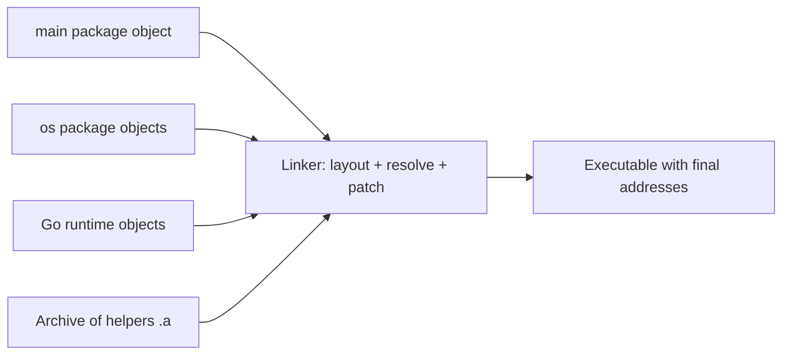
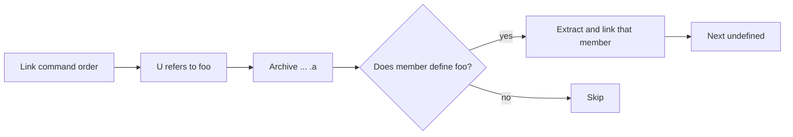
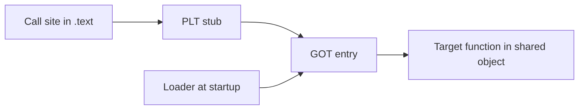

The previous chapter looked inside one object file at sections, symbols, and relocations. This chapter follows those files to the next stage, where they are combined. It is the fourth article of Stage 4.

An object file for one package is not a program. It contains code and data, a list of names it defines, a list of names it needs, and notes about where addresses must be patched. Linking collects many such files, decides where each section will live in the final address space, resolves which definition satisfies each need, and writes the correct addresses into the instructions and data references.

Linking can be static or dynamic. Static linking copies the code for the needed symbols into the executable, so the result is self-contained. Dynamic linking leaves a reference to an external shared object and arranges for the loader to bring that object at startup or when it is first called. Shared objects are usually built as position-independent code so they can be placed at different addresses, and symbol visibility controls which names are available to be linked.

The order in which archives are searched, whether a shared object is found at runtime, and whether code is position independent all change the size, startup time, and behavior of the final binary.

## What the linker does

The linker has three main jobs. It lays out the sections from many inputs into one address space, it resolves symbols by matching each undefined reference to a global definition, and it applies relocations by patching the bytes that refer to those symbols.

An undefined symbol is not an error by itself. The object for `main` leaves `os.ReadFile` undefined and expects the object for the `os` package to define it. An error happens when no input defines a needed symbol, or when two inputs define the same global symbol in a way that conflicts.



The diagram shows why an object file alone cannot run. Until the linker has placed all sections and patched relocations, calls and data references still contain placeholders.

## Static linking

Static linking copies the needed code into the executable. When the linker sees a reference to `os.ReadFile` and finds that symbol in an archive or object, it extracts just that part and adds its code and data to the output. The final file contains everything it needs to run on its own for those symbols.

A Go program built with `go build -o tiny main.go` is normally statically linked for Go code. The runtime and all Go packages it uses are copied into one file. You can see that no Go shared objects are needed at runtime.

```bash
go build -o tiny main.go
ldd tiny 2>&1 | head
file tiny
```

On a typical Linux build, `ldd` will report that `tiny` is not a dynamic executable for Go parts, or that it only needs the system loader and a few system libraries like `libc` when `cgo` is enabled. `file` will say the executable is `statically linked` in the Go sense.

The advantage of static linking is that the binary does not depend on separate files being present on the target machine. The tradeoff is size. Copying everything makes the file larger, and if many programs use the same library, that library is duplicated on disk and in memory rather than shared.

## Dynamic linking and shared objects

Dynamic linking leaves a reference rather than a copy. The executable records that it needs a shared object, like `libfoo.so`, and that a certain symbol will come from there. At startup the dynamic loader brings that shared object into the address space, or the program loads it later.

A shared object, often called a shared library, is a binary that was built to be mapped at different addresses in different programs. To allow that, it is usually built as position-independent code. Position-independent code does not assume it will live at a fixed address. Instead of writing an absolute address into an instruction, it loads the address through a table that the loader fills when the final location is known.

You can build the tiny program to show the difference, even when the program itself is pure Go.

```bash
go build -o tiny.static main.go
go build -buildmode=pie -o tiny.pie main.go
ls -lh tiny.static tiny.pie
readelf -h tiny.static | grep Type
readelf -h tiny.pie | grep Type
```

The static file is often shown as `EXEC` and the PIE file as `DYN`, but both can be executed because the kernel's loader knows how to start a PIE executable at a randomized address. The important distinction is that the PIE file can be placed at a different base with address randomization, which helps security.

A truly dynamic Go case appears when `cgo` is enabled or when you build a shared library from Go.

```bash
CGO_ENABLED=1 go build -o tiny.cgo main.go
ldd tiny.cgo | head
```

Now `ldd` shows dynamic dependencies like `libc.so.6` and `libpthread.so.0`, because the C parts of the runtime are linked dynamically. A pure Go build with `CGO_ENABLED=0` removes those.

## Symbol resolution

When several inputs define names, the linker must decide which definition wins. For Go's own packages, the rule is simpler than in C because Go does not have a global namespace that lets two packages define the same top-level name for the same import path. A reference to `fmt.Fprintf` should resolve to exactly one definition in the `fmt` package's object.

In a C-like model you more often see the effects of resolution. An archive is a collection of object files. When the linker walks an archive, it only extracts the members that define a currently undefined symbol. If the archive appears before any object that needs it, nothing will be extracted.



This is why link order matters when archives are used. Placing a library before the object that needs it can lead to an unresolved symbol even though the library contains the definition. The fix is to place dependents first and their dependencies after, or to repeat the archive.

## Shared objects, visibility, and position-independent code

A shared object exposes some symbols for others to use and hides the rest. Visibility controls which global symbols are available to the dynamic linker. A library that makes every internal helper global makes linking easier in the short term, but it increases the chance that two libraries expose the same name and interfere.

Position-independent code adds a layer of indirection. A call through the Procedure Linkage Table and a table of addresses called the Global Offset Table lets the call target be filled by the loader after the shared object has been placed. A direct call can be patched once, while an indirect call needs that table.



When the program is still static, the call is fixed at link time. When it goes through a shared object, the final address is not known until the loader runs, which is why the first call can be slower and why more indirection exists.

## Link order and binary size

The order of inputs and the choice between static and shared change the size and sharing of the final binary.

A static Go binary that includes the runtime, `os`, and `fmt` is larger than the sum of their source files, because it contains the compiled code for each. Stripping debug information with `go build -ldflags="-s -w"` removes symbol and debug sections and makes it smaller, as you saw in the object file article.

A dynamic build that leaves a dependency as a shared object is smaller on its own, but it is not self-contained. If that shared object is not present at runtime, the program fails to start with an error from the loader, like `error while loading shared libraries: libfoo.so: cannot open shared object file`.

## Seeing linking with Go

The following sequence is a basic read that you can run on Linux without any extra setup beyond the toolchain. It makes static, PIE, and dynamic differences concrete for the same tiny program.

```bash
go build -x -o tiny main.go 2>&1 | grep "link"
ls -lh tiny
ldd tiny 2>&1 | head -n 10
nm -g tiny 2>&1 | grep -E " main\.| os\." | head
```

What it demonstrates is that `go build` invokes `link` after compiling the packages. The `ldd` line shows whether any shared objects are needed. The `nm` lines show global symbols that the linker kept, like `main.main`.

A second exercise compares visibility and size.

```bash
go build -o tiny.base main.go
go build -ldflags="-s -w" -o tiny.stripped main.go
go build -buildmode=pie -o tiny.pie main.go
ls -lh tiny.base tiny.stripped tiny.pie
size tiny.base tiny.stripped tiny.pie
readelf --dynsym tiny.pie 2>&1 | head -n 20
```

You will typically see that the stripped file loses `.symtab` and `.debug_*` sections, the PIE file has type `DYN` but is still executable, and the dynamic symbol table lists only the symbols that need to be visible to the loader. The difference between `size` for the three files shows how much of the file is code that will be mapped as executable and how much is data that will be writable.

To see link order, you can force the toolchain to show the link line and read it.

```bash
go build -x -o tiny main.go 2>&1 | grep -E "compile|link"
```

The line that starts with `link` lists the objects and archives in the order the linker sees them. If you built a small helper as an archive with `go tool pack`, swapping its position relative to the object that uses it would change which members are extracted, which is why the order is part of the contract, not just aesthetics.

## A realistic production example

A team built a Go service with `CGO_ENABLED=1` because they added a small C helper for a checksum. The binary ran correctly on their development machines, but it failed to start in a minimal container with `exec format error` or `cannot open shared object file` depending on how it was built. Another build of the same source with `CGO_ENABLED=0` started fine, but the checksum was slower.

The binary that used C was dynamically linked against the system's C library, which was present on the development machines but not in the minimal container image. The statically built pure Go binary did not need that library, so it started everywhere. The minimal image had no loader for the expected library path, so the dynamic loader reported the missing object before `main` ever ran.

The team first tried to copy the missing `.so` into the image. That made the program start, but it introduced a second failure. The copied library was built for a different distribution and depended on another library with a different version, so the loader found the file but failed on a symbol version. They fixed the build rather than the image. Pure Go packages stayed statically linked and self-contained. The C helper was replaced with a Go implementation for the container image, and the `CGO_ENABLED=1` build was kept only where the full base image was required. They also added a test in CI that runs `ldd` or `readelf -d` on the artifact and fails the build if an unexpected `NEEDED` entry appears. The link step did not hide a bug. It showed which runtime the binary actually needed.

## How engineers actually use this

They look at linking when a binary is too large, fails to start, or has symbol conflicts. If a binary grew suddenly, they compare `size` and `readelf -S` before and after. If it fails with `undefined symbol` or `cannot open shared object`, they check `ldd`, `readelf -d` for `NEEDED`, and the link order. If two shared objects export the same global name, they reduce visibility so only the intended names are exported.

A useful habit for the tiny program is to always note the build that produced the binary you are running, including `go version`, `GOARCH`, `GOOS`, `CGO_ENABLED`, and the flags in `go build -x`. Those decide whether a reference was resolved statically or left for the loader.

## Definitions

### Static linking

> Static linking copies the code for the symbols a program needs into the executable, so the result is self-contained and does not need those shared objects at runtime, at the cost of a larger file.

### Dynamic linking

> Dynamic linking leaves a reference to a shared object in the executable and lets the loader bring that object at startup, so the file is smaller and can share the library in memory, but it will not start if the object is missing.

### Symbol resolution

> The linker's decision for each undefined reference about which global definition from the inputs satisfies it. An archive member is only extracted when it defines a currently needed symbol, which is why archive order matters.

### A shared object

> A binary like `libfoo.so` built to be mapped at different addresses in different programs, usually with position-independent code and tables that the loader fills at startup.

### Position-independent code

> Code that does not assume a fixed address and instead reaches external symbols through an indirection table that the loader patches after the final base address is chosen, so the same shared object can be used at different addresses.

## Beyond the definitions

### Why archive order matters

> The linker walks inputs left to right and only extracts archive members that define a currently undefined symbol. If the archive appears before any object that needs it, that member is skipped and the reference can remain undefined.

### Why a dynamic build can fail at startup

> Linking recorded that the program needs a shared object, but the loader must find that object at runtime via `rpath`, `LD_LIBRARY_PATH`, or the system library path. If the file is missing or has the wrong version, the loader fails before `main` runs.

### Why visibility matters for shared objects

> Only global symbols with default visibility are available for dynamic linking. Making every internal helper globally visible increases the chance that two libraries export the same name and interfere, so well-designed libraries hide what is not part of their interface.

## Common misconceptions

**"A larger object file always makes a larger executable by the same amount."** The linker only extracts from archives the members it needs, and it discards unused sections. An object may be large on its own, but only a part of it may be included.

**"Static binaries have no dependencies."** A statically linked Go binary still needs the kernel to map it, and a binary built with `cgo` can still need `libc` at runtime. Static for Go code does not automatically mean static for every system library.

**"Dynamic linking is just a smaller static link."** A dynamic reference adds a runtime dependency on a file and on the loader's search, plus indirection through tables for position-independent code. It trades file size for a startup requirement.

**"The linker error tells you which library to add."** It tells you which symbol is undefined. Which library defines that symbol is something you find with `nm` or `readelf` on the candidate inputs.

## Summary

Object files describe what is defined and what is needed. The linker decides where each section will live, matches each needed name with a definition, and patches code and data references that depend on those addresses. Static linking copies the needed code into the executable, while dynamic linking records a shared object to be loaded at startup. Archives are only searched for currently needed symbols, so order matters, and shared objects rely on position-independent code and visibility to be safely mapped at different addresses.
