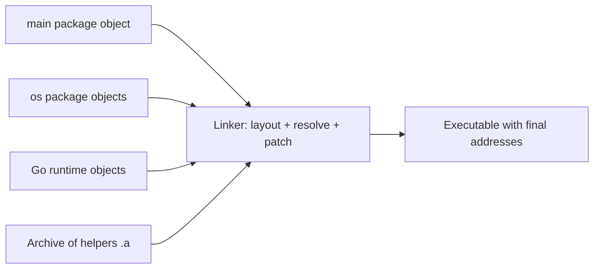
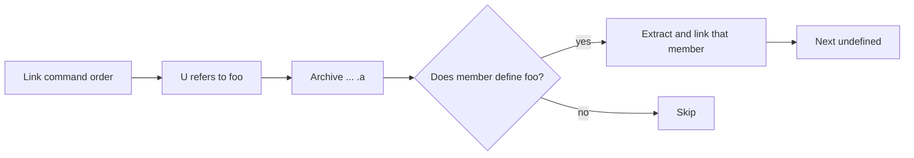
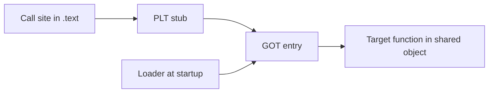

The last chapter looked inside one object file. We saw sections, symbols, and relocations. This chapter follows those files to the next stage, where they join. It is the fourth article in Stage 4.

An object file for one package is not a program. It holds code and data. It lists names it defines and names it needs. It also notes where addresses must be patched later. Linking collects many such files. It decides where each section will live in the final address space. It finds which definition meets each need. Then it writes the correct addresses into the instructions and data references.

Linking can be static or dynamic. Static linking copies the code for the needed symbols into the executable. The result is self-contained. Dynamic linking leaves a reference to an outside shared object. It asks the loader to bring that object at startup or on first call. A shared object (also called a shared library) is a binary built to load at different addresses in different programs. Shared objects are usually built as position-independent code. That means the code does not assume a fixed address. Symbol visibility controls which names other programs may link to.

The order in which the linker searches archives changes the final binary. Whether a shared object is found at runtime changes it too. So does position-independent code. All three affect the file size, startup time, and behavior.

## What the linker does

The linker has three main jobs. First, it lays out sections from many inputs into one address space. Second, it resolves symbols by matching each undefined reference to a global definition. Third, it applies relocations by patching the bytes that refer to those symbols.

An undefined symbol is not an error by itself. The object for `main` leaves `os.ReadFile` undefined. It expects the `os` package object to define it. An error happens only when no input defines a needed symbol. An error also happens when two inputs define the same global symbol and conflict.



The diagram shows why an object file alone cannot run. Until the linker places all sections and patches relocations, calls and data references still hold placeholders.

## Static linking

Static linking copies the needed code into the executable. Suppose the linker sees a reference to `os.ReadFile`. It finds that symbol in an archive or object. It extracts just that part and adds its code and data to the output. The final file holds everything it needs to run on its own for those symbols.

A Go program built with `go build -o tiny main.go` is normally statically linked for Go code. The runtime and all Go packages it uses are copied into one file. At runtime, it needs no Go shared objects.

```bash
go build -o tiny main.go
ldd tiny 2>&1 | head
file tiny
```

On a typical Linux build, `ldd` reports that `tiny` is not a dynamic executable for Go parts. With `cgo` enabled, it needs the system loader and a few system libraries like `libc`. The `file` tool says the executable is `statically linked` in the Go sense.

Static linking has one clear advantage. The binary does not depend on separate files on the target machine. The tradeoff is size. Copying everything makes the file larger. If many programs use the same library, that library is duplicated on disk and in memory instead of shared.

## Dynamic linking and shared objects

Dynamic linking leaves a reference instead of a copy. The executable records that it needs a shared object, such as `libfoo.so`. It also records that a certain symbol will come from there. At startup, the dynamic loader brings that shared object into the address space. Or the program loads it later.

A shared object (often called a shared library) is a binary built to be mapped at different addresses in different programs. To allow that, it is usually built as position-independent code. Position-independent code does not assume a fixed address. Instead of writing an absolute address into an instruction, it loads the address from a table. The loader fills that table when the final location is known.

You can build the tiny program to see the difference, even when the program itself is pure Go.

```bash
go build -o tiny.static main.go
go build -buildmode=pie -o tiny.pie main.go
ls -lh tiny.static tiny.pie
readelf -h tiny.static | grep Type
readelf -h tiny.pie | grep Type
```

The static file shows as `EXEC` and the PIE file as `DYN`. Both can run. The kernel's loader knows how to start a PIE executable at a randomized address. The key difference is that the PIE file can be placed at a different base with address randomization. That helps security.

A truly dynamic Go case appears when `cgo` is enabled. It also appears when you build a shared library from Go.

```bash
CGO_ENABLED=1 go build -o tiny.cgo main.go
ldd tiny.cgo | head
```

Now `ldd` shows dynamic dependencies like `libc.so.6` and `libpthread.so.0`. The C parts of the runtime are linked dynamically. A pure Go build with `CGO_ENABLED=0` removes those.

## Symbol resolution

When several inputs define names, the linker must pick which definition wins. For Go's own packages, the rule is simpler than in C. Go does not have a global namespace that lets two packages define the same top-level name for one import path. A reference to `fmt.Fprintf` should resolve to exactly one definition in the `fmt` package object.

In a C-like model you see the effects of resolution more often. An archive is a collection of object files. When the linker walks an archive, it extracts only the members that define a currently undefined symbol. If the archive appears before any object that needs it, nothing is extracted.



This is why link order matters with archives. If you place a library before the object that needs it, the symbol can stay unresolved even though the library holds the definition. The fix is to place dependents first and their dependencies after. Or repeat the archive.

## Shared objects, visibility, and position-independent code

A shared object exposes some symbols for others to use and hides the rest. Visibility controls which global symbols the dynamic linker can see. A library that makes every internal helper global makes linking easier at first. Yet it raises the chance that two libraries expose the same name and interfere.

Position-independent code adds one layer of indirection. A call goes through the Procedure Linkage Table and the Global Offset Table. These tables of addresses let the loader fill the call target after the shared object is placed. A direct call can be patched once. An indirect call needs that table.



When the program is static, the call is fixed at link time. When it goes through a shared object, the final address is unknown until the loader runs. That is why the first call can be slower and why more indirection exists.

## Link order and binary size

The order of inputs and the choice between static and shared change the size and sharing of the final binary.

A static Go binary that includes the runtime, `os`, and `fmt` is larger than the sum of their source files. It contains the compiled code for each. You can strip debug information with `go build -ldflags="-s -w"`. That removes symbol and debug sections and makes the file smaller, as you saw in the object file article.

A dynamic build that leaves a dependency as a shared object is smaller on its own. It is not self-contained. If that shared object is missing at runtime, the program fails to start. The loader reports an error such as `error while loading shared libraries: libfoo.so: cannot open shared object file`.

## Seeing linking with Go

The following steps are a basic check you can run on Linux. You only need the toolchain. It makes the static, PIE, and dynamic differences real for the same tiny program.

```bash
go build -x -o tiny main.go 2>&1 | grep "link"
ls -lh tiny
ldd tiny 2>&1 | head -n 10
nm -g tiny 2>&1 | grep -E " main\.| os\." | head
```

This shows that `go build` invokes `link` after compiling the packages. The `ldd` line shows whether shared objects are needed. The `nm` lines show the global symbols the linker kept, such as `main.main`.

A second exercise compares visibility and size.

```bash
go build -o tiny.base main.go
go build -ldflags="-s -w" -o tiny.stripped main.go
go build -buildmode=pie -o tiny.pie main.go
ls -lh tiny.base tiny.stripped tiny.pie
size tiny.base tiny.stripped tiny.pie
readelf --dynsym tiny.pie 2>&1 | head -n 20
```

You will usually see that the stripped file loses the `.symtab` and `.debug_*` sections. The PIE file has type `DYN` but still runs. The dynamic symbol table lists only the symbols the loader must see. The `size` output for the three files shows how much is code mapped as executable and how much is data that is writable.

To see link order, you can make the toolchain show the link line and read it.

```bash
go build -x -o tiny main.go 2>&1 | grep -E "compile|link"
```

The line that starts with `link` lists the objects and archives in the order the linker sees them. Suppose you built a small helper as an archive with `go tool pack`. If you swap its position relative to the object that uses it, the extracted members change. That is why order is part of the contract, not just style.

## A realistic production example

A team built a Go service with `CGO_ENABLED=1`. They added a small C helper for a checksum. The binary ran on their development machines. In a minimal container, it failed to start. It showed `exec format error` or `cannot open shared object file` depending on the build. Another build of the same source with `CGO_ENABLED=0` started fine, but the checksum was slower.

The binary that used C was dynamically linked to the system C library. That library was on the development machines but not in the minimal container image. The statically built pure Go binary did not need that library, so it started everywhere. The minimal image had no loader for the expected library path. The dynamic loader reported the missing object before `main` ran.

The team first tried to copy the missing `.so` into the image. The program then started, but it broke in a second way. The copied library was built for a different distribution. It depended on another library of a different version. The loader found the file but failed on a symbol version. The team fixed the build instead of the image. Pure Go packages stayed statically linked and self-contained. For the container image, the C helper was replaced with a Go version. The `CGO_ENABLED=1` build was kept only where the full base image was required. They also added a CI test. It runs `ldd` or `readelf -d` on the artifact and fails the build if an unexpected `NEEDED` entry appears. The link step did not hide a bug. It showed which runtime the binary truly needed.

## How engineers actually use this

Engineers look at linking when a binary is too large, fails to start, or has symbol conflicts. If a binary grew suddenly, they compare `size` and `readelf -S` before and after. If it fails with `undefined symbol` or `cannot open shared object`, they check `ldd` and `readelf -d` for `NEEDED`, plus the link order. If two shared objects export the same global name, they reduce visibility. Then only the intended names are exported.

A useful habit is to note the build that produced the binary you run. Record `go version`, `GOARCH`, `GOOS`, `CGO_ENABLED`, and the flags in `go build -x`. Those decide whether a reference was resolved statically or left for the loader.

## Definitions

### Static linking

> Static linking copies the code for the symbols a program needs into the executable. The result is self-contained and does not need those shared objects at runtime. The cost is a larger file.

### Dynamic linking

> Dynamic linking leaves a reference to a shared object in the executable. It lets the loader bring that object at startup. The file is smaller and can share the library in memory. It will not start if the object is missing.

### Symbol resolution

> For each undefined reference, the linker decides which global definition from the inputs satisfies it. An archive member is extracted only when it defines a currently needed symbol. That is why archive order matters.

### A shared object

> A binary like `libfoo.so` built to be mapped at different addresses in different programs. It usually uses position-independent code and tables that the loader fills at startup.

### Position-independent code

> Code that does not assume a fixed address. It reaches external symbols through an indirection table. The loader patches that table after the final base address is chosen. The same shared object can then be used at different addresses.

## Beyond the definitions

### Why archive order matters

> The linker walks inputs left to right. It extracts only archive members that define a currently undefined symbol. If the archive appears before any object that needs it, that member is skipped. The reference can stay undefined.

### Why a dynamic build can fail at startup

> Linking recorded that the program needs a shared object. The loader must find that object at runtime through `rpath`, `LD_LIBRARY_PATH`, or the system library path. If the file is missing or has the wrong version, the loader fails before `main` runs.

### Why visibility matters for shared objects

> Only global symbols with default visibility are available for dynamic linking. Making every internal helper globally visible raises the chance that two libraries export the same name and interfere. Well-designed libraries hide what is not part of their interface.

## Common misconceptions

**"A larger object file always makes a larger executable by the same amount."** The linker extracts only the archive members it needs. It discards unused sections. An object may be large on its own, but only part of it is included.

**"Static binaries have no dependencies."** A statically linked Go binary still needs the kernel to map it. A binary built with `cgo` can still need `libc` at runtime. Static for Go code does not mean static for every system library.

**"Dynamic linking is just a smaller static link."** A dynamic reference adds a runtime dependency on a file and on the loader's search. It also adds indirection through tables for position-independent code. It trades file size for a startup requirement.

**"The linker error tells you which library to add."** It tells you which symbol is undefined. To find which library defines that symbol, use `nm` or `readelf` on the candidate inputs.

## Summary

Object files describe what is defined and what is needed. The linker decides where each section will live. It matches each needed name with a definition. It patches code and data references that depend on those addresses. Static linking copies the needed code into the executable. Dynamic linking records a shared object to be loaded at startup. Archives are searched only for currently needed symbols, so order matters. Shared objects rely on position-independent code and visibility to be mapped safely at different addresses.
