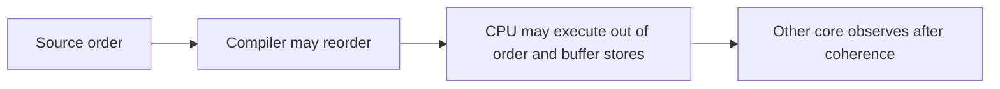
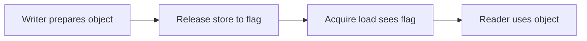
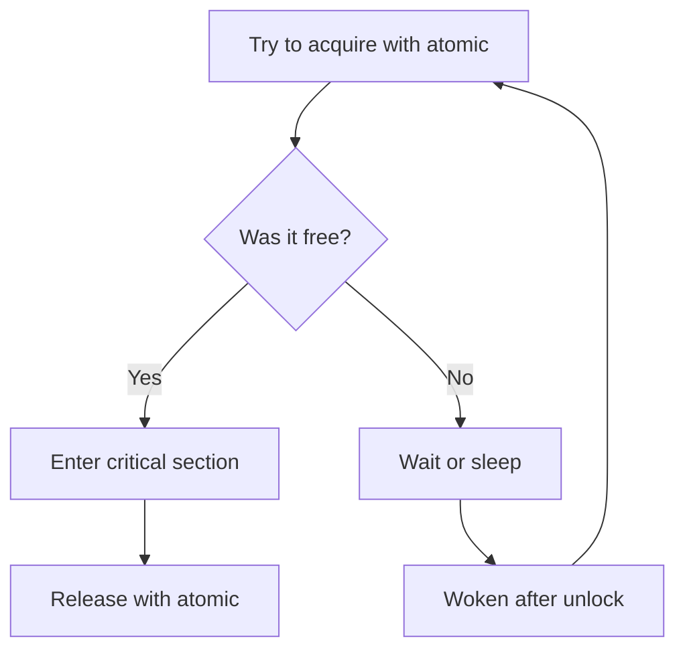

Earlier we explained caches and how cores keep their copies in sync. This chapter gives the rules. The rules say what one thread can trust when it reads memory written by another thread. This is the fourth chapter in Stage 3.

When threads share memory, the real question is not how fast a write is. It is when the other thread can see that write. It is also what else the other thread sees at that moment.

A shared counter shows the first problem. Two threads each add one to a counter that starts at zero. You expect the answer to be two. Without protection, the answer can be one because the two updates clash. An atomic operation cannot be seen partway through. It fixes the counter.

A flag that publishes data shows the second problem. One thread fills a buffer with data. Then it sets a flag to say the data is ready. Another thread waits for the flag. Then it reads the buffer. You expect the reader to see the data after the flag is set. That only works if the program links the flag to the data with synchronization. The link does not come from the order you wrote the lines. It comes from the ordering guarantee you pick. The writer uses release. The reader uses acquire.

## Start with a counter

A counter that many threads increment looks simple. In truth it is a read, an add, and a write.

```text
counter starts at 0

Worker A reads 0
Worker B reads 0
Worker A writes 1
Worker B writes 1

expected: 2
actual: 1
```

Both workers read the old value before either writes the new one. One update is lost. This happens when the result depends on timing of operations that can clash. We call this a race condition. A data race is one kind of race. Two threads touch the same memory. At least one of them writes. The accesses are not ordered by synchronization.

To fix counting, make the increment indivisible. An atomic operation on a shared object cannot be seen as a partial update. No other thread sees half old bits and half new bits. With an atomic increment, the final value is correctly two.

Atomicity fixes the counter. It does not by itself fix publishing other data with a flag. That needs ordering.

## Three questions worth separating

When you look at shared memory, ask three separate questions.

First, is the operation atomic? This asks whether another thread can see it partway through. A store of an atomic integer is never seen as half old and half new.

Second, does a write become visible to another thread? The hardware will make it visible eventually. You can only rely on that when you use the required synchronization. Without it, the access may be a data race. In C and C++, this is undefined behavior. That means the language makes no promise about what the program does.

Third, are the operations ordered? Suppose a thread sees that a flag is set. Is it guaranteed to see the data written before the flag? Atomicity of the flag alone does not promise this. Ordering decides which other writes travel with the flag.

## The compiler reorders too

Before the CPU runs the code, the compiler may change the order of operations. It may do this as long as the current thread still behaves as the language requires. It can move independent stores. It can keep a value in a register instead of reloading it. It can drop a load whose result is never used.

The two lines below look ordered. For another thread, the order only matters if you use synchronization.

```c
data = 42;
ready = 1;
```

In a single thread, the compiler must keep the effect the program can observe. For another thread, the compiler need not keep the order. It only keeps it when the accesses use atomics or locks that make a rule between threads. Adding `volatile` does not fix this. `volatile` tells the compiler that an access has observable side effects. That is useful for a device register. It does not make the access atomic. It does not publish the writes around it.

The rule is to use the memory model of the language. Do not trust the order you wrote in source. Do not trust the order from one build's assembly.

## The CPU and its buffers reorder as well

The CPU also reorders. It can run independent instructions out of order to keep its units busy. It can hold stores in a small store buffer (a holding area for writes) before other cores see them. It can track loads in a buffer and finish them when data arrives.

These buffers help performance. A core need not stop each time a store waits for a cache line. It can keep doing useful work while the store waits.

The result is three different orders. The order you wrote. The order the CPU runs inside. The order another core sees. These can all differ. The language and the hardware together decide which observations a program may rely on.



Application code does not control these buffers directly. They explain why you need explicit ordering operations. They explain why a program that looks ordered can still need synchronization.

## The flag that publishes data

Suppose one thread prepares data and then signals another thread. The simplest attempt uses plain variables.

```c
int data = 0;
int ready = 0;

// writer
data = 42;
ready = 1;

// reader
if (ready == 1) {
    printf("%d\n", data);
}
```

This program has a race. The reader is never promised to see `data` as 42 after seeing `ready` as 1. In C, the unsynchronized accesses give the program undefined behavior. A correct version uses an atomic flag. The writer publishes and the reader observes.

```c
#include <stdatomic.h>

int data = 0;
_Atomic int ready = 0;

// writer
data = 42;
atomic_store_explicit(&ready, 1, memory_order_release);

// reader
if (atomic_load_explicit(&ready, memory_order_acquire) == 1) {
    printf("%d\n", data);
}
```

The release store publishes the earlier write to `data`. The acquire load reads the value written by that release. The reader can rely on the published data. The key point is the pair. The writer's release and the reader's acquire work together to make the link. An atomic flag alone, without that pair, does not publish the data around it. This example publishes once. It assumes `data` is not changed again after the flag is set.

## Happens-before as a reasoning tool

Happens-before is a way to reason about ordering. It says one operation happens before another from the program's view. If a write happens before a read, the read can rely on that write.

In the publication above, the relationship looks like this.

```text
writer: write data
           |
           | sequenced before the release store
           v
writer: release store to ready = 1
           |
           | synchronizes with the acquire load that reads 1
           v
reader: read data
```

The release and the acquire make the edge across threads. Without that edge, the source order inside the writer does not give the reader a guarantee. Happens-before is a way to reason about the program. It is not a wire between cores. The hardware gives the guarantee with fences, cache messages, and the right instructions for the processor.

## Release and acquire

Release and acquire are built for publishing. A release store says the earlier writes in that thread should be made available to any thread that does a matching acquire. An acquire load says the later reads in that thread can rely on what was published. This holds once the acquire has seen the release.



This does not stop the whole machine. It makes a targeted link around that flag. It is often cheaper than a stronger ordering that would order many more operations. The link only exists if the reader's acquire actually reads the value from the writer's release. If it reads a different value, the publication did not happen for that read.

## When you want one global order

Sometimes you want atomic operations to appear in one global order that respects each thread's own order. That stronger model is called sequential consistency, often written as `seq_cst`.

It gives a simpler way to reason about the atomic operations themselves, because they seem to happen in one shared sequence. It does not make ordinary non-atomic accesses safe. It does not fix a bad algorithm on its own. It is a good choice when the synchronization is not on a hot path and clarity matters. If performance requires it and you can reason precisely, a weaker ordering can be correct. Using a weaker ordering than the algorithm needs is wrong.

## When atomicity without ordering is enough

An atomic operation that uses `memory_order_relaxed` is still atomic, but it does not order surrounding memory. It participates in the order of that one object, but it does not publish other data.

This is useful when the atomic object itself is the only shared state you care about, like a counter of requests or an identifier allocator.

```c
_Atomic unsigned long requests = 0;
atomic_fetch_add_explicit(&requests, 1, memory_order_relaxed);
```

If the only promise you need is that increments are not lost and you will eventually see a count, relaxed can be right. If reading the count should also mean that other writes are visible, you need release and acquire or a lock.

## Fences

A fence, also called a barrier, is an operation that limits how the code around it may be reordered. The compiler must also respect its meaning.

You sometimes see a pattern where a fence is placed before publishing or after observing.

```text
write shared data
release fence
publish flag
```

```text
observe flag
acquire fence
read shared data
```

The exact instruction and its cost depend on the processor. On some architectures an acquire load or a release store may already be strong enough that no extra instruction is needed. On others an explicit barrier is required. You should not judge correctness by looking at one assembly listing. The guarantee that matters is the one in the language, because a different processor may need different instructions to keep the same promise.

## Store buffers and a small test

A store buffer (a small holding area for writes) lets a core keep a write while it continues. That is why another core may not see the write at the exact moment the first core executed the store.

Consider two atomic flags that start at zero and two threads that each set one flag and read the other, both using relaxed ordering.

```c
// Thread 0
atomic_store_explicit(&x, 1, memory_order_relaxed);
int r0 = atomic_load_explicit(&y, memory_order_relaxed);

// Thread 1
atomic_store_explicit(&y, 1, memory_order_relaxed);
int r1 = atomic_load_explicit(&x, memory_order_relaxed);
```

It is possible for both reads to see zero, even though each thread set its own flag. Each core can read the other flag before the other core's store has become visible to it. This surprises people who picture a single global timeline. It can happen with weaker ordering.

With a stronger ordering like sequential consistency, the outcomes are more restricted. The details depend on the language rules and the architecture. The lesson is stable. Seeing a write from another core is not instant. The ordering you chose decides which outcomes are allowed.

This kind of small program is sometimes called a litmus test. It is useful for learning and for checking a low-level assumption. Not seeing a result in a test does not prove the result can never happen.

## Loads, speculation, and early reads

Cores also track outstanding loads. They can issue a later load before an earlier operation has finished when the architecture allows it. Speculation lets the CPU guess a path and then discard the work if the guess was wrong.

This is another reason source order alone is not a guarantee for other threads. The architecture decides whether a later read that was issued early can affect what the program is allowed to observe.

Again, these buffers are implementation details, not something application code controls. They matter because they explain why ordering operations exist.

## Operations that read and write in one step

Some algorithms need to read a value, compute a new one, and publish it as a single indivisible step. These are atomic read-modify-write operations. Examples include atomic increment, exchange, fetch-and-add, and compare-and-swap.

Compare-and-swap checks whether the memory still holds an expected value and, if it does, replaces it.

```text
if memory == expected:
    memory = desired, report success
else:
    report failure and return current value
```

The check and the update happen together with respect to other threads. A common use is to claim a state once.

```c
#include <stdbool.h>
#include <stdatomic.h>

bool try_claim(_Atomic int *state) {
    int expected = 0;
    return atomic_compare_exchange_strong_explicit(
        state, &expected, 1,
        memory_order_acquire, memory_order_relaxed);
}
```

The function tries to change the state from available to claimed. If another thread claimed it first, the call fails. The example shows only the indivisible transition, not a full lock.

A loop that retries compare-and-swap can build counters, stacks, and queues. It can be fast when contention is low. Many threads retrying can become expensive. It also brings hard problems like the ABA problem, safe memory reclamation, and progress guarantees. In many cases a mutex is the simpler and better choice.

## The ABA problem

ABA happens when a thread reads a value `A`. Another thread changes it to `B` and then back to `A`. The first thread's compare-and-swap sees `A` and succeeds, even though the value went through another state in between.

```text
Thread 0 reads A
Thread 1 changes A to B then back to A
Thread 0 compare-and-swap for A succeeds, but missed the intermediate change
```

Whether this matters depends on what the value represents. For a pointer to a node that can be removed, freed, and reused at the same address, it can be a real bug. You need techniques like version counters, tagged pointers, hazard pointers, or epoch reclamation. This is why swapping to atomics from locks is not just a shortcut. The hardware gives you building blocks. The algorithm must still define ownership, lifetime, and what happens under contention.

## A mutex also uses atomic hardware

A mutex looks like a higher-level blocking primitive. Its fast path is built from atomics. A thread tries to change the mutex from unlocked to locked as one atomic step. If it cannot acquire it, the runtime may put it to sleep and wake it later.



The atomic operation protects the lock state itself. Releasing the lock with release makes writes inside the critical section available. Acquiring the lock with acquire lets the next owner see them.

## Atomicity is not lock-freedom

An atomic operation is indivisible for that object. Lock-freedom is a different kind of progress guarantee. A lock-free algorithm promises that the system as a whole keeps making progress even if one thread is delayed. A single thread may still starve, which means it can wait forever. Wait-freedom is stronger. It promises that every operation finishes in a bounded number of its own steps.

```text
Atomic:    this operation is indivisible
Lock-free: some thread makes progress
Wait-free: every operation finishes in a bounded number of steps
```

A loop that retries compare-and-swap uses atomics. It can be lock-free if some thread always succeeds. It is not necessarily wait-free for each thread. A mutex can be correct and fast enough while it blocks instead of giving lock-free progress.

## Why code can work on one CPU and fail on another

Different processors give different ordering guarantees for ordinary loads and stores. Code that happens to work on x86 (which is relatively strong) may fail on ARM (which is weaker). The compiler can also reorder. So the program may already be undefined in the language before it runs. This is common when code is only tested on one kind of machine and later runs on another.

Portable concurrent code should use the atomics and synchronization that the language provides. Architecture-specific instructions are appropriate only in a small, carefully reviewed low-level piece that states the required guarantee for each target.

## A correct single-writer example

The following publishes one integer with a flag. One thread writes the integer and then publishes. The other thread checks the flag and then reads.

```c
#include <stdatomic.h>
#include <stdio.h>

struct Message {
    int value;
    _Atomic int published;
};

void publish(struct Message *m, int v) {
    m->value = v;
    atomic_store_explicit(&m->published, 1, memory_order_release);
}

int try_read(const struct Message *m, int *out) {
    if (atomic_load_explicit(&m->published, memory_order_acquire) == 0)
        return 0;
    *out = m->value;
    return 1;
}
```

The store with release is the point where the earlier write to `value` is published. The load with acquire is the point where a reader that sees the published value can safely read it. This example publishes once. A reusable queue needs more. It needs to know who owns each slot and when it can be overwritten. You cannot skip that just because the flag is atomic.

## How to look for ordering problems

Ordering problems are hard to see because they are rare and depend on timing. Adding logging can hide them by changing timing. A passing test does not prove ordering is correct.

Start with the code and the language rules. List every shared object, who writes it, who reads it, and which operation links them. If you cannot point to a link between the writer and the reader, the code deserves a closer look.

Thread sanitizers can find many data races. They do not prove that the ordering you intended is correct. Stress tests help. Run the protocol many times with different inputs and thread counts. Running on different architectures can show hidden assumptions. Counters can show contention. They usually cannot prove a particular ordering bug. A program can be correct but slow because many cores fight over one atomic. It can also be fast in a short test while still being wrong.

On Linux, a C program can be built with ThreadSanitizer where the compiler supports it.

```bash
cc -fsanitize=thread -g -O1 program.c -o program-tsan
```

A good stress test runs the algorithm many times with varied scheduling rather than just once.

## Choosing between a mutex and an atomic

Use a mutex when the work is naturally a critical section. Use it when contention is moderate, or when blocking is acceptable. A mutex gives a clear ownership rule. It makes more complex invariants easier to protect.

Use an atomic variable when the state is small. Use it when the operation is naturally indivisible and the ordering need is easy to state. Counters, flags, reference counts, and simple state changes are typical cases.

Use a lock-free or wait-free structure only when measurement shows that blocking is a real problem and the team can maintain the more complex code. The design must cover memory reclamation, shutdown, starvation, testing, and observability.

Pass work through a queue instead of sharing memory when too many threads need synchronization on the same data. Moving an item through a queue makes ownership clear. The queue itself still needs synchronization. It can become a source of backpressure.

In production, the question is rarely which primitive is fastest in theory. It is which design is correct. It must have acceptable latency. It must be understandable. The team must be able to maintain it at a cost they can carry.

## How the hardware actually implements an atomic

Atomicity has to come from somewhere below the language. On x86, most read-modify-write atomic operations use a `LOCK` prefix on the instruction. The prefix tells the CPU to lock the cache line for the duration of the operation. It performs the read, the modification, and the write as one coherent transaction. It issues a read-for-ownership (a request that grabs exclusive control of a cache line) that makes other cores wait for that line. This is why an atomic increment is not three separate visible steps. It is also why it costs a coherence transaction.

On ARM and other weak-memory architectures, atomics are usually built from load-link and store-conditional, written `LL` and `SC`. The core loads a value and tags the line as monitored. The store-conditional writes only if no other core modified that line in between. If another core did, the store fails and the loop retries. Both approaches turn an atomic into a cache-line ownership event. This is the bridge between this chapter and the cache coherence chapter. At the hardware level, an atomic is an enforced exclusive access to a cache line.

## Double-checked locking: a real acquire and release pattern

A recurring need is lazy initialization. You create an expensive object the first time it is requested, then reuse it. The unsafe version checks a flag. If it is unset, the code builds the object and sets the flag. The bug is that another thread can see the flag set but read the object before its fields are initialized. The writes can be reordered.

The fix uses release on the publishing store and acquire on the reading load, with the check done twice:

```c
// first check without locking
if (atomic_load_explicit(&ready, memory_order_acquire) == 0) {
    lock(&mutex);
    if (atomic_load_explicit(&ready, memory_order_relaxed) == 0) {
        build_object();
        atomic_store_explicit(&ready, 1, memory_order_release);
    }
    unlock(&mutex);
}
// now ready == 1 implies the object is fully built
```

The outer acquire load lets most threads skip the lock after initialization. The release store guarantees that any thread that sees `ready` also sees the completed object. This is the prototypical example of release and acquire protecting data other than the flag itself.

## The cost of a contended atomic and the per-core counter pattern

An atomic is cheap when few writers touch it. A single shared atomic counter written by every core becomes a coherence bottleneck. Every successful write goes through a read-for-ownership that bounces the cache line between cores. The writers serialize on that line even though the increment itself is small. Under many cores, throughput can fall as you add writers. This is the same as false sharing (two cores fighting over the same cache line), but for one genuinely shared atomic.

The scalable answer is the per-core counter pattern. Each core increments a counter in its own cache line. That stays local and cheap. The program sums the per-core counters when it needs the total. The tradeoff is that the total is slightly stale between merges. This fits request counts and statistics more than a value that must be exactly current on every read. The pattern appears throughout the concurrency and scheduler chapters. Prefer ownership by one core over constant cross-core writes.

## Why the same atomic costs differently on x86 and ARM

The correctness rules are the same once you use the language's atomics. The performance differs by architecture. x86 has a relatively strong memory model. Even sequential consistency often maps to ordinary cache-line locking without an extra barrier. This is why code that relies on accidental ordering sometimes appears to work there. ARM and similar weak-memory designs need an explicit barrier, such as a `DMB` instruction, to honor acquire, release, or sequential consistency. The same source can run more barrier instructions and run slower.

This is why a benchmark that passes on a developer's x86 laptop can behave differently on an ARM server. The laptop may hide a missing barrier because the hardware rarely reorders that pattern. The server both can reorder and must pay for the barrier to stay correct. The rule is to write the ordering the algorithm needs, then measure. Do not assume the cheaper architecture is the correct one.

## Definitions

### What is memory ordering?

> Memory ordering is the set of rules that decides how one thread's reads and writes are seen by other threads.

### What is an atomic operation?

> An atomic operation on a shared object cannot be seen halfway through by other threads.

### Atomicity versus visibility

> Atomicity means the operation itself cannot be seen as a partial update. Visibility is about when another thread can see the result. An atomic flag alone does not make surrounding data visible.

### What are acquire and release?

> A store with release publishes earlier writes in the same thread, and a load with acquire that sees that store can rely on what was published.

### What is sequential consistency?

> Sequential consistency is a stronger model where atomic operations appear to happen in a single global order that respects each thread's own order.

## Beyond the definitions

### Why the compiler reorders concurrent operations

> The compiler may reorder as long as the current thread still behaves as required by the language. For other threads, only atomics and synchronization create a guarantee. Without them, the source order does not promise an order across threads.

### Is volatile enough for sharing between threads?

> No. `volatile` can make an access visible for a device register, but it does not make the operation atomic and it does not publish surrounding writes with acquire and release.

### Why an atomic flag is needed to publish data

> The flag gives a point to link the writer and the reader. The writer publishes with release, the reader observes with acquire, and then the reader can safely use the data that was written before the flag.

### Relaxed versus acquire and release

> Relaxed keeps atomicity but does not order other memory. Acquire and release create a link that publishes and observes surrounding writes.

### What is compare-and-swap?

> Compare-and-swap checks whether the memory still holds an expected value and, if it does, replaces it in one atomic step. It is used for state transitions and for building some lock-free structures.

### Does using atomics make code lock-free?

> No. Atomics are operations. Lock-freedom is a progress guarantee. Code that uses atomics can still block, starve, or retry many times and need careful reclamation.

### Why code can work on x86 and fail on ARM

> The architectures give different default ordering, and compilers can generate different instruction sequences. Code that relies on what happened to work on one CPU needs to state its ordering with the language's atomics to be portable.

### How to look for a suspected ordering problem

> I would list all shared state and the links between threads, check the language rules, run a thread sanitizer and stress tests, look at state transitions, and test on different architectures where possible. One passing run does not prove correctness.

## Common misconceptions

**"Atomic means synchronized."** Atomicity protects one operation on one object. It does not by itself publish other data.

**"If a write eventually becomes visible, the program is correct."** A reader may need to see several writes in a specific order. Eventual visibility without the required ordering is not enough.

**"Source order is execution order."** The compiler and the CPU can transform and overlap work when allowed. Synchronization says what order another thread can rely on.

**"Flushing a cache line fixes sharing."** Cache maintenance is architecture specific and is about caches, while thread synchronization needs the ordering that the language provides.

**"Sequential consistency fixes every bug."** It gives a strong order for atomic operations. It does not fix wrong ownership, missing lifetime handling, or data races on non-atomic objects.

**"Lock-free means faster."** Lock-free can avoid blocking. It often costs more under contention and is harder to check and maintain.

## Summary

When threads share memory, three questions matter. Can an operation be seen partially, when does another thread see it, and what other operations are ordered around it. Atomicity, visibility, and ordering answer different parts.

The compiler and the CPU reorder work to make it faster. Atomics, release and acquire, sequential consistency, fences, and locks give you the guarantees you choose. Use the smallest ordering that is clearly correct when performance requires it. Prefer a simpler design when the cost has not been measured. The most reliable way to reason about concurrent code is to name who owns what. List the shared state, draw the links, and state which transitions are allowed. If the explanation relies on what the CPU probably does first, it is not a correctness argument yet.
