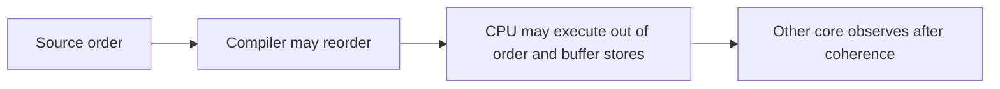
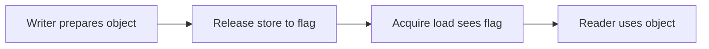
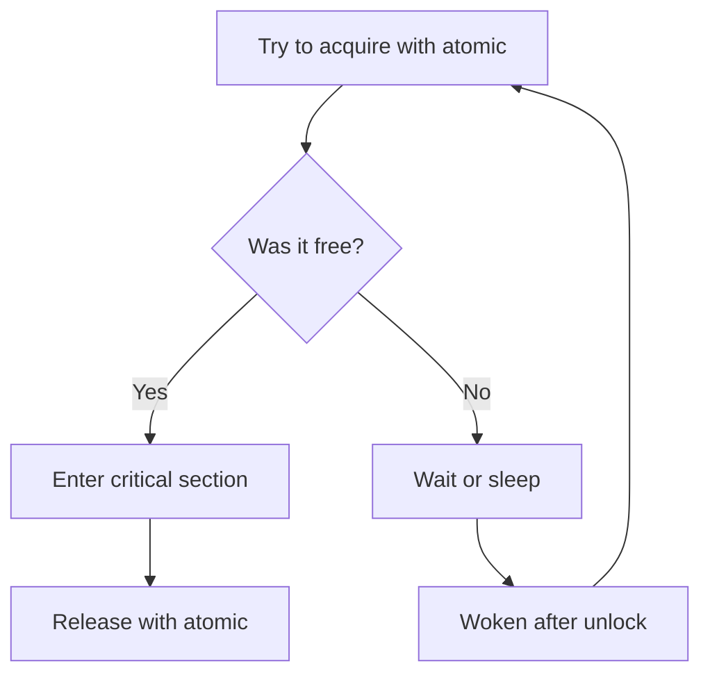

## The short version

When several threads use the same memory, the question is not how fast a single write is. It is when another thread can see that write, and what else it sees at the same time.

A shared counter shows the first part. Two threads each try to add one to a counter that starts at zero. You expect the result to be two. Without a rule, it can be one, because the operations interleave. An atomic operation is one that cannot be seen halfway through, so it fixes the counter.

A flag that publishes other data shows the second part. One thread prepares data and then sets a flag to say it is ready. Another thread waits for the flag and then reads the data. You expect the reader to see the prepared data once the flag is set. That expectation is only true if the program uses synchronization that links the flag to the data. The link is not the order in which you wrote the lines. It is the ordering guarantee you choose, like release on the writer and acquire on the reader.

## Where this article fits

The previous article explained caches and how cores keep copies consistent. This article is about the rules that decide what a thread can rely on when it reads memory written by another thread.

You need this before mutexes and lock-free structures, because those are just ways to get the ordering right. You will use the same ideas later for transactions and replication, where seeing a commit must also mean seeing the data that was committed.

## Start with a counter

A counter that many threads increment looks simple, but it is a read, an addition, and a write.

```text
counter starts at 0

Worker A reads 0
Worker B reads 0
Worker A writes 1
Worker B writes 1

expected: 2
actual: 1
```

Both workers read the old value before either writes the new one, so one update is lost. This happens when the result depends on the timing of operations that can interleave. In that case we say there is a race condition. A data race is the specific case where two threads access the same memory, at least one is a write, and the accesses are not ordered by synchronization.

The fix for counting is to make the increment indivisible. An atomic operation on a shared object cannot be observed as a partial update. Another thread does not see half the old bits and half the new bits. With an atomic increment, the final value is correctly two.

Atomicity fixes the counter, but it does not by itself fix publishing other data together with a flag. That needs ordering.

## Three questions that are easy to confuse

When you look at shared memory, it helps to ask three separate questions.

The first is whether an operation is atomic. This asks whether another thread can see the operation halfway through. A store of an atomic integer is not seen as half old and half new.

The second is whether a write becomes visible to another thread. Eventually hardware will make it visible, but the language only lets you rely on it when you use the required synchronization. Without that, the access may be a data race and the program has undefined behavior in C and C++.

The third is whether operations are ordered. If one thread sees that a flag is set, is it guaranteed to see the data that was written before the flag? Atomicity of the flag alone does not promise that. Ordering decides what other writes travel with the flag.

## The compiler can reorder first

Before the CPU runs anything, the compiler is allowed to change the order of operations as long as the current thread still behaves as required by the language. It can move independent stores, keep a value in a register instead of reloading it, or remove a load whose result is not used.

The following two lines look ordered, but for another thread the order only matters if you use synchronization.

```c
data = 42;
ready = 1;
```

In a single thread, the compiler must keep the effect that the program can observe. For another thread, the compiler is not required to keep the order unless the accesses use atomics or locks that create a rule between threads. Adding `volatile` does not fix this in general. `volatile` tells the compiler that an access has observable side effects, which is useful for a device register, but it does not make the access atomic and it does not publish surrounding writes.

The rule is to use the memory model of the language, not the order you wrote the source or the assembly one build produced.

## The CPU and its buffers can reorder as well

The CPU also reorders. It can execute independent instructions out of order to keep its execution units busy, and it can keep stores in a small buffer before they become visible to other cores. Loads can be tracked in a buffer and completed when data arrives.

These buffers help performance. A core does not have to stop every time a store waits for a cache line to be obtained. It can continue with useful work while the store waits.

The effect is that three orders are different. The order you wrote, the order the CPU executes internally, and the order another core observes can be different. The language and the architecture together decide which observations a program may rely on.



You do not control these buffers directly from application code. They explain why you need explicit ordering operations and why a program that looks ordered can still need synchronization.

## The flag that publishes data

Suppose one thread prepares data and then signals another thread. The simplest attempt uses ordinary variables.

```c
int data = 0;
int ready = 0;

// writer
data = 42;
ready = 1;

// reader
if (ready == 1) {
    printf("%d\n", data);
}
```

This program has a race. The reader may never be promised to see `data` as 42 after seeing `ready` as 1, and in C the unsynchronized accesses make the program undefined. A correct version uses an atomic flag where the writer publishes and the reader observes.

```c
#include <stdatomic.h>

int data = 0;
_Atomic int ready = 0;

// writer
data = 42;
atomic_store_explicit(&ready, 1, memory_order_release);

// reader
if (atomic_load_explicit(&ready, memory_order_acquire) == 1) {
    printf("%d\n", data);
}
```

The store that uses release publishes the earlier write to `data`. The load that uses acquire and reads the value written by that release is allowed to rely on the published data. The important point is the pair. The writer's release and the reader's acquire together create the link. An atomic flag alone, without that pairing, does not publish surrounding data. This example publishes once and assumes `data` is not changed again after the flag is set.

## Happens-before as a reasoning tool

It helps to speak of one operation happening before another from the program's point of view. If a write happens before a read, the read can rely on that write.

In the publication above, the relationship looks like this.

```text
writer: write data
          |
          | sequenced before the release store
          v
writer: release store to ready = 1
          |
          | synchronizes with the acquire load that reads 1
          v
reader: read data
```

The release and the acquire create the edge across threads. Without that edge, the source order inside the writer does not by itself give the reader a guarantee. Happens-before is a way to reason about the program, not a wire between cores. The hardware provides the guarantee with fences, cache messages, and the right instructions for the processor.

## Release and acquire

Release and acquire are designed for publishing. A store with release says that earlier writes in the same thread should be made available to a thread that does a matching acquire. A load with acquire says that later reads in the same thread can rely on what was published, once the acquire has observed the release.



This does not stop the whole machine. It creates a targeted link around that flag. It is often cheaper than a stronger ordering that would order many more operations. The link only exists if the reader's acquire actually reads the value written by the writer's release. If it reads a different value, the publication did not happen for that read.

## When you want a single global order

Sometimes you want atomic operations to appear in one global order that respects each thread's own order. That stronger model is called sequential consistency, often written as `seq_cst`.

It gives a simpler way to reason about the atomic operations themselves, because they seem to happen in one shared sequence. It does not make ordinary non-atomic accesses safe, and it does not fix a bad algorithm on its own. It is often a good choice when the synchronization is not on a hot path and clarity matters. If performance requires it and you can reason precisely, a weaker ordering can be correct, but using a weaker ordering than the algorithm needs is wrong.

## When atomicity without ordering is enough

An atomic operation that uses `memory_order_relaxed` is still atomic, but it does not order surrounding memory. It participates in the order of that one object, but it does not publish other data.

This is useful when the atomic object itself is the only shared state you care about, like a counter of requests or an identifier allocator.

```c
_Atomic unsigned long requests = 0;
atomic_fetch_add_explicit(&requests, 1, memory_order_relaxed);
```

If the only promise you need is that increments are not lost and you will eventually see a count, relaxed can be right. If reading the count should also mean that other writes are visible, you need release and acquire or a lock.

## Fences

A fence, also called a barrier, is an operation that constrains ordering around it. The compiler must also respect its meaning.

You sometimes see a pattern where a fence is placed before publishing or after observing.

```text
write shared data
release fence
publish flag
```

```text
observe flag
acquire fence
read shared data
```

The exact instruction and its cost depend on the processor. On some architectures an acquire load or a release store may already be strong enough that no extra instruction is needed. On others an explicit barrier is required. You should not judge correctness by looking at one assembly listing. The guarantee that matters is the one in the language, because a different processor may need different instructions to keep the same promise.

## Store buffers and a small test

A store buffer lets a core keep a write while it continues. That is why another core may not see the write at the exact moment the first core executed the store.

Consider two atomic flags that start at zero and two threads that each set one flag and read the other, both using relaxed ordering.

```c
// Thread 0
atomic_store_explicit(&x, 1, memory_order_relaxed);
int r0 = atomic_load_explicit(&y, memory_order_relaxed);

// Thread 1
atomic_store_explicit(&y, 1, memory_order_relaxed);
int r1 = atomic_load_explicit(&x, memory_order_relaxed);
```

It is possible for both reads to see zero, even though each thread set its own flag. Each core can read the other flag before the other core's store has become visible to it. This surprises people who picture a single global timeline, but it can happen with weaker ordering.

With a stronger ordering like sequential consistency, the outcomes are more restricted. The details depend on the language rules and the architecture, but the lesson is stable. Seeing a write from another core is not instantaneous, and the ordering you chose decides which outcomes are allowed.

This kind of small program is sometimes called a litmus test. It is useful for learning and for checking a low-level assumption, but not seeing a result in a test does not prove the result can never happen.

## Loads, speculation, and later reads

Cores also keep track of outstanding loads and can issue a later load before an earlier operation has fully completed when the architecture allows it. Speculation lets the CPU guess a path and then discard work if the guess was wrong.

This is another reason source order alone is not a guarantee for other threads. The architecture decides whether a later read that was issued early can affect what the program is allowed to observe.

Again, these buffers are implementation details, not something application code controls. They matter because they explain why ordering operations exist.

## Operations that read and write as one

Some algorithms need to read a value, compute a new one, and publish it as a single indivisible step. These are atomic read-modify-write operations. Examples are atomic increment, exchange, fetch-and-add, and compare-and-swap.

Compare-and-swap checks whether the memory still holds an expected value and, if it does, replaces it.

```text
if memory == expected:
    memory = desired, report success
else:
    report failure and return current value
```

The check and the update happen together with respect to other threads. A common use is to claim a state once.

```c
#include <stdbool.h>
#include <stdatomic.h>

bool try_claim(_Atomic int *state) {
    int expected = 0;
    return atomic_compare_exchange_strong_explicit(
        state, &expected, 1,
        memory_order_acquire, memory_order_relaxed);
}
```

The function tries to change the state from available to claimed. If another thread claimed it first, the call fails. The example shows only the indivisible transition, not a full lock.

A loop that retries compare-and-swap can build counters, stacks, and queues. It can be fast when contention is low, but many threads retrying can become expensive. It also brings hard problems like the ABA problem, safe memory reclamation, and progress guarantees. In many cases a mutex is the simpler and better choice.

## The ABA problem

ABA happens when a thread reads a value `A`, another thread changes it to `B` and then back to `A`, and the first thread's compare-and-swap sees `A` and succeeds even though the value went through another state in between.

```text
Thread 0 reads A
Thread 1 changes A to B then back to A
Thread 0 compare-and-swap for A succeeds, but missed the intermediate change
```

Whether this matters depends on what the value represents. For a pointer to a node that can be removed, freed, and reused at the same address, it can be a real bug. Techniques like version counters, tagged pointers, hazard pointers, or epoch reclamation are needed. This is why using atomics instead of locks is not just a replacement. The hardware gives you building blocks. The algorithm must still define ownership, lifetime, and what happens under contention.

## A mutex also uses atomic hardware

A mutex looks like a higher-level blocking primitive, but its fast path is built from atomics. A thread tries to change the mutex from unlocked to locked as an atomic step. If it cannot acquire it, the runtime may put it to sleep and wake it later.



The atomic operation protects the lock state itself. Releasing the lock with release makes writes inside the critical section available, and acquiring the lock with acquire lets the next owner see them.

## Atomicity is not lock-freedom

An atomic operation is indivisible for that object. Lock-freedom is a different kind of guarantee about progress. A lock-free algorithm promises that the system as a whole keeps making progress even if one thread is delayed, but a single thread may still starve. Wait-freedom is stronger. It promises that every operation finishes in a bounded number of its own steps.

```text
Atomic:    this operation is indivisible
Lock-free: some thread makes progress
Wait-free: every operation finishes in a bounded number of steps
```

A loop that retries compare-and-swap uses atomics and can be lock-free if some thread always succeeds, but it is not necessarily wait-free for each thread. A mutex can be correct and fast enough while providing blocking instead of lock-free progress.

## Why the same code can work on one CPU and fail on another

Different processors provide different ordering guarantees for ordinary loads and stores. Code that happens to work on x86, which is relatively strong, may fail on ARM, which is weaker. The compiler can also reorder, so the program may already be undefined in the language even before it runs. This is common when code is only tested on one kind of machine and later runs on another.

Portable concurrent code should use the atomics and synchronization that the language provides. Architecture-specific instructions are appropriate only in a small, carefully reviewed low-level piece that states the required guarantee for each target.

## A correct single-writer example

The following publishes one integer with a flag. One thread writes the integer and then publishes, the other thread checks the flag and then reads.

```c
#include <stdatomic.h>
#include <stdio.h>

struct Message {
    int value;
    _Atomic int published;
};

void publish(struct Message *m, int v) {
    m->value = v;
    atomic_store_explicit(&m->published, 1, memory_order_release);
}

int try_read(const struct Message *m, int *out) {
    if (atomic_load_explicit(&m->published, memory_order_acquire) == 0)
        return 0;
    *out = m->value;
    return 1;
}
```

The store with release is the point where the earlier write to `value` is published. The load with acquire is the point where a reader that sees the published value can safely read it. This example publishes once. A reusable queue needs more, like who owns each slot and when it can be overwritten, which cannot be omitted just because the flag is atomic.

## How to look for ordering problems

Ordering problems are hard to see because they are rare and timing dependent. Adding logging can hide them by changing timing. A passing test does not prove ordering is correct.

Start with the code and the language rules. List every shared object, who writes it, who reads it, and which operation links them. If you cannot point to a link between the writer and the reader, the code deserves a closer look.

Thread sanitizers can find many data races, but they do not prove that the ordering you intended is correct. Stress tests that run the protocol many times with different inputs and thread counts help, and running on different architectures can show assumptions. Counters can show contention, but they usually cannot prove a particular ordering bug. A program can be correct but slow because many cores fight over one atomic, or it can be fast in a short test while still being wrong.

On Linux, a C program can be built with ThreadSanitizer where the compiler supports it.

```bash
cc -fsanitize=thread -g -O1 program.c -o program-tsan
```

A good stress test runs the algorithm many times with varied scheduling rather than just once.

## How to choose between a mutex, an atomic, or something else

Use a mutex when the work is naturally a critical section, when contention is moderate, or when blocking is acceptable. A mutex gives a clear ownership rule and makes more complex invariants easier to protect.

Use an atomic variable when the state is small, the operation is naturally indivisible, and the ordering need is easy to state. Counters, flags, reference counts, and simple state changes are typical cases.

Consider a lock-free or wait-free structure only when measurement shows that blocking is a real problem and the team can maintain the more complex code. The design must cover memory reclamation, shutdown, starvation, testing, and observability.

Consider passing work through a queue instead of sharing memory when too many threads need synchronization on the same data. Moving an item through a queue makes ownership clear, although the queue itself still needs synchronization and can become a source of backpressure.

For production, the question is rarely which primitive is fastest in theory. It is which design is correct, has acceptable latency, is understandable, and can be maintained at a cost the team can carry.

## Interview definitions

### What is memory ordering?

> Memory ordering is the set of rules that decides how one thread's reads and writes are seen by other threads.

### What is an atomic operation?

> An atomic operation on a shared object cannot be seen halfway through by other threads.

### What is the difference between atomicity and visibility?

> Atomicity means the operation itself cannot be seen as a partial update. Visibility is about when another thread can see the result. An atomic flag alone does not make surrounding data visible.

### What are acquire and release?

> A store with release publishes earlier writes in the same thread, and a load with acquire that sees that store can rely on what was published.

### What is sequential consistency?

> Sequential consistency is a stronger model where atomic operations appear to happen in a single global order that respects each thread's own order.

## Interview follow-up questions

### Why can the compiler reorder concurrent operations?

> The compiler may reorder as long as the current thread still behaves as required by the language. For other threads, only atomics and synchronization create a guarantee. Without them, the source order does not promise an order across threads.

### Is `volatile` enough for sharing between threads?

> No. `volatile` can make an access visible for a device register, but it does not make the operation atomic and it does not publish surrounding writes with acquire and release.

### Why is an atomic flag needed to publish data?

> The flag gives a point to link the writer and the reader. The writer publishes with release, the reader observes with acquire, and then the reader can safely use the data that was written before the flag.

### What is the difference between relaxed and acquire/release?

> Relaxed keeps atomicity but does not order other memory. Acquire and release create a link that publishes and observes surrounding writes.

### What is compare-and-swap?

> Compare-and-swap checks whether the memory still holds an expected value and, if it does, replaces it in one atomic step. It is used for state transitions and for building some lock-free structures.

### Does using atomics make code lock-free?

> No. Atomics are operations. Lock-freedom is a progress guarantee. Code that uses atomics can still block, starve, or retry many times and need careful reclamation.

### Why can code work on x86 and fail on ARM?

> The architectures give different default ordering, and compilers can generate different instruction sequences. Code that relies on what happened to work on one CPU needs to state its ordering with the language's atomics to be portable.

### How would you look for a suspected ordering problem?

> I would list all shared state and the links between threads, check the language rules, run a thread sanitizer and stress tests, look at state transitions, and test on different architectures where possible. One passing run does not prove correctness.

## Common misconceptions

**“Atomic means synchronized.”** Atomicity protects one operation on one object. It does not by itself publish other data.

**“If a write eventually becomes visible, the program is correct.”** A reader may need to see several writes in a specific order. Eventual visibility without the required ordering is not enough.

**“Source order is execution order.”** The compiler and the CPU can transform and overlap work when allowed. Synchronization says what order another thread can rely on.

**“Flushing a cache line fixes sharing.”** Cache maintenance is architecture specific and is about caches, while thread synchronization needs the ordering that the language provides.

**“Sequential consistency fixes every bug.”** It gives a strong order for atomic operations, but it does not fix wrong ownership, missing lifetime handling, or data races on non-atomic objects.

**“Lock-free means faster.”** Lock-free can avoid blocking, but it often costs more under contention and is harder to check and maintain.

## Summary

When threads share memory, three questions matter. Can an operation be seen partially, when does another thread see it, and what other operations are ordered around it. Atomicity, visibility, and ordering answer different parts.

The compiler and the CPU reorder work to make it faster. Atomics, release and acquire, sequential consistency, fences, and locks give you the guarantees you choose. Use the smallest ordering that is clearly correct when performance requires it, but prefer a simpler design when the cost has not been measured. The most reliable way to reason about concurrent code is to name who owns what, list the shared state, draw the links, and state which transitions are allowed. If the explanation relies on what the CPU probably does first, it is not yet a correctness argument.

## If you want to build this later

Build a bounded queue that has one producer and one consumer and uses atomics. Start with a version that uses a mutex so you have a clearly correct baseline. Then build a ring buffer where the producer and consumer each track a position, state who owns each slot, and use release to publish a new entry and acquire to observe it.

Test when the queue is empty and full, when the indices wrap around, when the program shuts down, and when the handoff is repeated many times. Build with ThreadSanitizer where it is available, stress with different sizes, and compare against the mutex version. End by writing down why each atomic uses its ordering and what would break if you made that ordering weaker.
