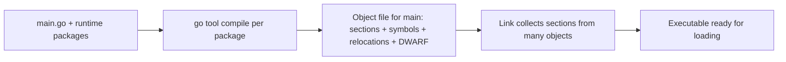

The previous chapter showed how a call becomes registers and a stack frame. This chapter shows where those instructions live after code generation. It is the third article of Stage 4.

An object file is the compiler's output for one package. It holds machine code and data that are not yet runnable, together with tables that describe where things are and what still needs to be fixed.

The code and data are organized into sections. `.text` holds executable instructions, `.rodata` holds string constants and other read-only data, `.data` holds initialized writable data, and `.bss` reserves space for zero-initialized data that takes no place in the file. A symbol table records names like `main.main` or `os.ReadFile`, whether they are defined here or needed from elsewhere, and whether they are visible outside this file. Relocations are notes that say an instruction refers to a symbol whose final address is not yet known and must be patched during linking. Debug symbols in DWARF record how to map those addresses back to Go source lines and types.

## Why an object file is not a program

An object file produced for one Go package cannot be run by itself. It refers to names that live in other packages, like `runtime.mallocgc` or `os.ReadFile`, and it contains placeholders where the address of such a name must be filled in later. The linker will collect many such files, lay out their sections, and patch those placeholders.



The diagram separates what the compiler knows now, which is the layout inside one file, from what the linker decides later, which is the final addresses for the whole program.

## Sections hold different kinds of bytes

Sections let the toolchain treat code as code and data as data. The loader, the linker, and debuggers all rely on that separation.

- `.text` holds executable instructions. On Linux it will be marked as readable and executable when it is eventually mapped. Writing to it at runtime should fault, because code should not be writable.
- `.rodata` holds constants that the program reads but should not change, like string literals, jump tables, and constant structs. The tiny program's `"read %s: %v\n"` lives here.
- `.data` holds writable values that start with a specific pattern, like a global `var counter = 3` that must be 3 at startup.
- `.bss` does not store bytes in the file. It records that a region of writable memory should be zeroed at startup. A `var buf [4096]byte` that starts zero is described here, so the file stays smaller.
- Other sections hold tables. `.symtab` is the symbol table, `.strtab` is the strings for those symbols, `.rel.text` holds relocations for `.text`, and `.debug_info` and `.debug_line` hold DWARF.

For Go, there are also Go-specific sections like `gopclntab` that the runtime uses for stack traces and line numbers. They serve the same role as DWARF for Go's own tools.

## Symbols name what is defined or needed

A symbol is a name plus metadata. It says what the name refers to, where it lives, which section it is in, how many bytes it covers, and whether it is visible outside this file.

A symbol can be local, meaning it is only visible inside this file, or global, meaning the linker may use it to resolve references from other files. A variable named inside a function is usually local and may not appear in the table at all when it was optimized away. A top-level function like `main.main` is global when it must be found by the linker or by the runtime.

Symbols also say whether they are defined here or undefined. An object for `main` will define `main.main` but leave `os.ReadFile` as undefined, because that function lives in the `os` package's object. The linker will later find the definition and connect the two.

## Relocations say what still needs fixing

When the compiler sees a call or a reference to a symbol defined elsewhere, it cannot know the final address at the time it writes the object file. Instead it writes a relocation. A relocation is a record that says, at a certain offset in a certain section, patch the bytes so they refer to a given symbol, possibly added to a constant.

A call is the simplest example. The compiler knows the call should go to `os.ReadFile`, but the address of `os.ReadFile` will only be known after all objects are laid out.

```text
section: .text
offset: 0x42
kind: R_X86_64_PLT32 or R_ARM64_CALL26
symbol: os.ReadFile
addend: -4
```

The linker will later place `os.ReadFile` at some address, compute the distance, and write the correct relative offset into the instruction bytes. Other relocations do the same for data references, like loading the address of a string in `.rodata`.

## Debug symbols and DWARF

Debug symbols are not the same as ordinary symbols. Ordinary symbols say where a function starts and how large it is. Debug symbols say which source line, file, and variable correspond to each address, and where that variable lives at each point.

DWARF is the format most tools on Linux use for this. It is split into several sections, like `.debug_info` for types and declarations and `.debug_line` for the mapping from addresses to file and line. When you run `gdb` and it shows you are at `main.go:12`, or when `go tool pprof` shows a Go function name for a sample, DWARF is what lets it do so.

A symbol table lets the linker connect objects. DWARF lets a human connect the final addresses back to the source.

## Seeing sections and symbols with Go

You can inspect the same tiny program at the object level without any extra setup beyond the Go toolchain and standard Linux tools.

```bash
go build -o tiny main.go
file tiny
size tiny
readelf -S tiny | head -n 30
```

`file` tells you the kind of executable, `size` shows how many bytes are in `text`, `data`, and `bss`, and `readelf -S` lists the section headers. Look for `.text`, `.rodata`, `.data`, `.bss`, `.symtab`, and `.debug_info` among many Go-specific sections like `.gopclntab`. The short strings in the output, `AX` for execute or `WA` for write-allocate, tell you how the loader will map each section.

To see symbols, ask for the table with demangled Go names.

```bash
go tool nm tiny | grep "main\."
nm -g tiny | head
```

What it demonstrates is which names are global and where they live. You should see `main.main` as a global text symbol with a type `T`, and `os.ReadFile` resolved to its address. Before linking, an intermediate object would have shown `os.ReadFile` as undefined.

To see relocations as they looked before linking, ask the compiler to keep the object for one package.

```bash
go tool compile -S -o /tmp/main.o main.go
readelf --relocs /tmp/main.o 2>&1 | head -n 40
```

The relocation entries show where the compiler left holes that the linker later fixed. Each line names the offset, the relocation type, and the symbol.

A second exercise shows why debug information matters.

```bash
go build -o tiny.withdbg main.go
go build -ldflags="-s -w" -o tiny.stripped main.go
ls -lh tiny.withdbg tiny.stripped
readelf -S tiny.withdbg | grep debug
readelf -S tiny.stripped | grep debug
size tiny.withdbg tiny.stripped
addr2line -e tiny.withdbg 0x401000 2>&1 | head
addr2line -e tiny.stripped 0x401000 2>&1 | head
```

With `-s -w` the linker removed the symbol table and DWARF. The stripped file still runs, because the instructions and relocations were resolved, but tools have less to show. `addr2line` can translate an address to a line in the unstripped file and fails in the stripped one. A profile that collected raw addresses will look empty without that mapping, which is why many teams keep one unstripped file for diagnostics.

## A realistic production example

A team shipped a Go service with a stripped binary to save a few megabytes of distribution size. The service ran correctly, but when it panicked in production the alert included only raw addresses like `0x4a3f10` and the profile collected with `pprof` showed many entries as `unknown`. The developers tried to reproduce locally with `go run`, where the binary still had symbols, and could not map the production addresses to any line.

The problem was not the code. It was the artifact. The object files had been produced with full information, but the final executable that was shipped had been stripped, so the data needed to connect addresses back to Go source was gone. The sections that were stripped hold no instructions that affect whether the program can run. They affect whether a human can understand it afterward.

The team changed the build to keep both artifacts. The deployment used the stripped binary, while the build stored an unstripped copy with the same git hash. When an alert arrived, they ran `addr2line` or loaded the unstripped file into the debugger, and the same addresses now pointed to `main.go` lines that showed which `os.ReadFile` call had returned the error. The file size saving remained, but observability was restored because the data that describes the program was not discarded.

## How engineers actually use this

They do not look at sections to admire the file. They look when a reference cannot be resolved, when a string they expect is not where they thought, or when a profile is missing names. If `nm` does not show a symbol they expect, it may be local, inlined away, or stripped. If `readelf --relocs` shows a relocation for a name that remains undefined after linking, the build did not include the object that defines it. If a debugger shows the wrong line, they compare `objdump` with the DWARF line table instead of assuming the source is wrong.

## Definitions

### An object file

> A file the compiler produces for one package that holds code and data in sections, a table of symbols, relocations that say where addresses must be fixed, and debug information. It is not runnable until it is linked.

### The main sections

> `.text` holds executable instructions. `.rodata` holds read-only constants like string literals. `.data` holds writable data that starts with a specific value. `.bss` reserves zero-initialized writable space without storing those zeros in the file.

### A symbol table

> A table that records each name, whether it is defined here or needed from elsewhere, whether it is visible outside this file, and where it lives and how large it is.

### A relocation

> A record that says at a given offset in a section, patch the bytes to refer to a symbol whose final address will only be known at link time, like the target of a call to another package.

### Debug symbols and DWARF

> Debug symbols record how to map an address back to a source file, line, type, and variable location. DWARF is the format that holds this on Linux, split into sections like `.debug_info` and `.debug_line`, and it is what lets a debugger show Go source while the CPU runs instructions.

## Beyond the definitions

### Defined here or needed elsewhere

> In the symbol table or `nm` output an undefined symbol is marked with `U` and has no address in this file. A defined global symbol is marked with `T` for text or `D` for data and has an address. The linker must find a definition for every `U` that is actually used.

### Why .bss keeps the file small

> `.bss` describes memory that should be zeroed at startup. Storing millions of zeros in the file would waste space, so the file only records how many bytes are needed and the loader reserves the space when the program starts.

### What happens if a relocation is not fixed

> The instruction would still contain a placeholder and would jump or load the wrong address. The linker is the step that writes the correct relative or absolute value, so an executable with unresolved relocations cannot be started correctly.

## Common misconceptions

**"A symbol table is just a list of function names."** It also records visibility, size, and whether a name is defined or needed, and it is what the linker uses to decide if a reference can be resolved.

**"`.data` and `.bss` are the same."** `.data` stores bytes in the file for initialized data, while `.bss` only records how much zeroed space to reserve, which keeps the file smaller.

**"Debug symbols change whether the program runs."** They change whether tools can map an address back to source. The instructions and relocations are what decide whether the program can run. A stripped program still runs, but profiles and stack traces have fewer names.

**"The compiler leaves no notes for the linker."** Relocations are those notes. They say exactly where to patch once the final layout is known.

## Summary

Object files separate concerns. Sections keep code, read-only data, initialized data, and zeroed space distinct. The symbol table says which names are defined here and which are needed elsewhere. Relocations say where the final addresses must be written. Debug information records how to translate the result back to Go source. None of these run by themselves. They are what the linker will collect and patch to build the executable the loader can map.
