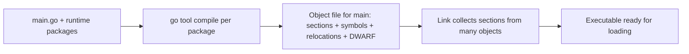

The previous chapter showed how a call turns into registers and a stack frame. This chapter shows where those instructions live after the compiler makes code. This is the third article in Stage 4.

An object file is what the compiler makes for one package. It holds machine code and data that cannot run yet. It also holds tables that show where things are and what still needs fixing.

A section is a block of bytes with one purpose. The code and data are split into sections. `.text` holds the instructions the CPU runs. `.rodata` holds string constants and other read-only data. `.data` holds writable data that starts with a value. `.bss` reserves space for data that starts at zero, but it stores nothing in the file.

A symbol table lists names such as `main.main` or `os.ReadFile`. For each name, it says whether this file defines it or needs it from another file. It also says whether other files can see it.

A relocation is a note. It says an instruction points at a symbol whose final address is not yet known. The linker must patch that instruction later.

Debug symbols use a format called DWARF. DWARF records how to map an address back to the Go source line and type that made it.

## Why an object file is not a program

An object file for one Go package cannot run by itself. It refers to names that live in other packages, such as `runtime.mallocgc` or `os.ReadFile`. It leaves placeholders where the address of such a name must be filled in later. The linker collects many such files, arranges their sections, and patches those placeholders.



The diagram separates two jobs. The compiler knows the layout inside one file. The linker later decides the final addresses for the whole program.

## Sections hold different kinds of bytes

Sections let the toolchain treat code as code and data as data. The loader, the linker, and debuggers all rely on that split.

- `.text` holds the instructions the CPU runs. On Linux, the loader maps it as readable and executable. Writing to it at runtime should crash the program, because code should not be writable.
- `.rodata` holds constants that the program reads but must not change. String literals, jump tables, and constant structs live here. The tiny program's `"read %s: %v\n"` lives here.
- `.data` holds writable values that start with a known value. For example, the global `var counter = 3` must be 3 at startup, so it lives here.
- `.bss` stores no bytes in the file. It records that a region of writable memory should be set to zero at startup. A `var buf [4096]byte` starts at zero, so it is described here and the file stays small.
- Other sections hold tables. `.symtab` is the symbol table. `.strtab` holds the strings for those symbols. `.rel.text` holds the relocations for `.text`. `.debug_info` and `.debug_line` hold DWARF data.

For Go, there are also Go-specific sections such as `gopclntab`. The Go runtime uses it for stack traces and line numbers. It plays the same role as DWARF for Go's own tools.

## Symbols name what is defined or needed

A symbol is a name plus some facts about that name. It says what the name refers to, where it lives, which section holds it, how many bytes it covers, and whether other files can see it.

A symbol can be local or global. A local symbol is visible only inside this file. A global symbol can be used by the linker to resolve references from other files. A variable named inside a function is usually local. It may not appear in the table at all if the compiler optimized it away. A top-level function such as `main.main` is global when the linker or the runtime must find it.

Symbols also say whether they are defined here or left undefined. An object for `main` defines `main.main`. It leaves `os.ReadFile` as undefined, because that function lives in the `os` package object. The linker later finds the definition and connects the two.

## Relocations say what still needs fixing

When the compiler sees a call or a reference to a symbol defined elsewhere, it cannot know the final address yet. Instead it writes a relocation. A relocation is a record. It says: at a given offset in a given section, patch the bytes so they point at a symbol, possibly plus a constant.

A call is the simplest example. The compiler knows the call should go to `os.ReadFile`. But the address of `os.ReadFile` is known only after all objects are laid out.

```text
section: .text
offset: 0x42
kind: R_X86_64_PLT32 or R_ARM64_CALL26
symbol: os.ReadFile
addend: -4
```

The linker later places `os.ReadFile` at an address. It computes the distance and writes the correct relative offset into the instruction bytes. Other relocations do the same for data references, such as loading the address of a string in `.rodata`.

## Debug symbols and DWARF

Debug symbols are not the same as ordinary symbols. Ordinary symbols say where a function starts and how large it is. Debug symbols say which source line, file, and variable match each address, and where that variable lives at each step.

DWARF is the format most Linux tools use for this job. It is split into several sections. `.debug_info` holds types and declarations. `.debug_line` holds the mapping from addresses to file and line. When you run `gdb` and it shows you are at `main.go:12`, DWARF makes that possible. When `go tool pprof` shows a Go function name for a sample, DWARF makes that possible too.

A symbol table lets the linker connect objects. DWARF lets a human connect the final addresses back to the source.

## Seeing sections and symbols with Go

You can inspect the same tiny program at the object level. You only need the Go toolchain and standard Linux tools.

```bash
go build -o tiny main.go
file tiny
size tiny
readelf -S tiny | head -n 30
```

`file` tells you what kind of executable it is. `size` shows how many bytes sit in `text`, `data`, and `bss`. `readelf -S` lists the section headers. Look for `.text`, `.rodata`, `.data`, `.bss`, `.symtab`, and `.debug_info`. You will also see Go-specific sections such as `.gopclntab`. The short codes in the output tell you how the loader maps each section. `AX` means execute. `WA` means write-allocate.

To see symbols, print the table with readable Go names.

```bash
go tool nm tiny | grep "main\."
nm -g tiny | head
```

These commands show which names are global and where they live. You should see `main.main` as a global text symbol with type `T`. You should see `os.ReadFile` resolved to its address. Before linking, an intermediate object would have shown `os.ReadFile` as undefined.

To see relocations before linking, ask the compiler to keep the object for one package.

```bash
go tool compile -S -o /tmp/main.o main.go
readelf --relocs /tmp/main.o 2>&1 | head -n 40
```

The relocation entries show where the compiler left holes. The linker later fills those holes. Each line names the offset, the relocation type, and the symbol.

A second exercise shows why debug information matters.

```bash
go build -o tiny.withdbg main.go
go build -ldflags="-s -w" -o tiny.stripped main.go
ls -lh tiny.withdbg tiny.stripped
readelf -S tiny.withdbg | grep debug
readelf -S tiny.stripped | grep debug
size tiny.withdbg tiny.stripped
addr2line -e tiny.withdbg 0x401000 2>&1 | head
addr2line -e tiny.stripped 0x401000 2>&1 | head
```

With `-s -w` the linker removes the symbol table and DWARF. The stripped file still runs, because the instructions and relocations were resolved. But tools have less to show. `addr2line` can turn an address into a line in the unstripped file, and it fails on the stripped one. A profile that collected raw addresses looks empty without that mapping. This is why many teams keep one unstripped file for debugging.

## A realistic production example

A team shipped a Go service with a stripped binary. They wanted to save a few megabytes of download size. The service ran correctly. But when it panicked in production, the alert showed only raw addresses such as `0x4a3f10`. The profile from `pprof` showed many entries as `unknown`. The developers tried to reproduce it with `go run`, where the binary still had symbols. They could not map the production addresses to any source line.

The problem was not the code. It was the build artifact. The object files had full information. But the shipped executable had been stripped, so the data that connects addresses back to Go source was gone. The stripped sections hold no instructions that affect whether the program runs. They affect whether a human can understand the program later.

The team changed the build to keep both artifacts. The deployment used the stripped binary. The build stored an unstripped copy with the same git hash. When an alert arrived, they ran `addr2line` or loaded the unstripped file in the debugger. The same addresses now pointed to `main.go` lines that showed which `os.ReadFile` call had returned the error. The size saving remained. Observability returned because the data that describes the program was kept.

## How engineers actually use this

Engineers do not look at sections to admire the file. They look when a reference will not resolve. They look when a string is not where they expected. They look when a profile is missing names. If `nm` does not show a symbol they expect, it may be local, inlined away, or stripped. If `readelf --relocs` shows a relocation for a name that stays undefined after linking, the build did not include the object that defines it. If a debugger shows the wrong line, they compare `objdump` with the DWARF line table. They do not assume the source is wrong.

## Definitions

### An object file

> A file the compiler makes for one package. It holds code and data in sections. It holds a table of symbols. It holds relocations that say where addresses must be fixed. It holds debug information. It cannot run until it is linked.

### The main sections

> `.text` holds the instructions the CPU runs. `.rodata` holds read-only constants like string literals. `.data` holds writable data that starts with a value. `.bss` reserves writable space that starts at zero, without storing those zeros in the file.

### A symbol table

> A table that records each name. For each name it says whether it is defined here or needed from elsewhere. It says whether other files can see it. It says where it lives and how large it is.

### A relocation

> A record that says: at a given offset in a section, patch the bytes to point at a symbol. The symbol's final address is known only at link time. A call to another package is a common example.

### Debug symbols and DWARF

> Debug symbols record how to map an address back to a source file, line, type, and variable location. DWARF is the format that holds this on Linux. It is split into sections such as `.debug_info` and `.debug_line`. It lets a debugger show Go source while the CPU runs instructions.

## Beyond the definitions

### Defined here or needed elsewhere

> In the symbol table or `nm` output, an undefined symbol is marked with `U` and has no address in this file. A defined global symbol is marked with `T` for text or `D` for data, and it has an address. The linker must find a definition for every `U` that the program actually uses.

### Why .bss keeps the file small

> `.bss` describes memory that should be zeroed at startup. Storing millions of zeros in the file would waste space. So the file records only how many bytes are needed. The loader reserves that space when the program starts.

### What happens if a relocation is not fixed

> The instruction would still hold a placeholder. It would jump or load the wrong address. The linker is the step that writes the correct relative or absolute value. An executable with unresolved relocations cannot start correctly.

## Common misconceptions

**"A symbol table is just a list of function names."** It also records visibility, size, and whether a name is defined or needed. The linker uses it to decide if a reference can be resolved.

**"`.data` and `.bss` are the same."** `.data` stores bytes in the file for initialized data. `.bss` only records how much zeroed space to reserve. That keeps the file smaller.

**"Debug symbols change whether the program runs."** They change whether tools can map an address back to source. The instructions and relocations decide whether the program can run. A stripped program still runs, but profiles and stack traces show fewer names.

**"The compiler leaves no notes for the linker."** Relocations are those notes. They say exactly where to patch once the final layout is known.

## Summary

Object files separate concerns. Sections keep code, read-only data, initialized data, and zeroed space apart. The symbol table says which names are defined here and which are needed elsewhere. Relocations say where the final addresses must be written. Debug information records how to map the result back to Go source. None of these run by themselves. The linker collects them, patches them, and builds the executable that the loader can map.
