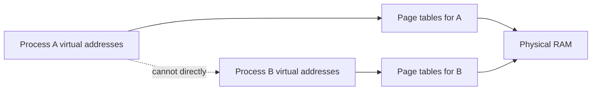
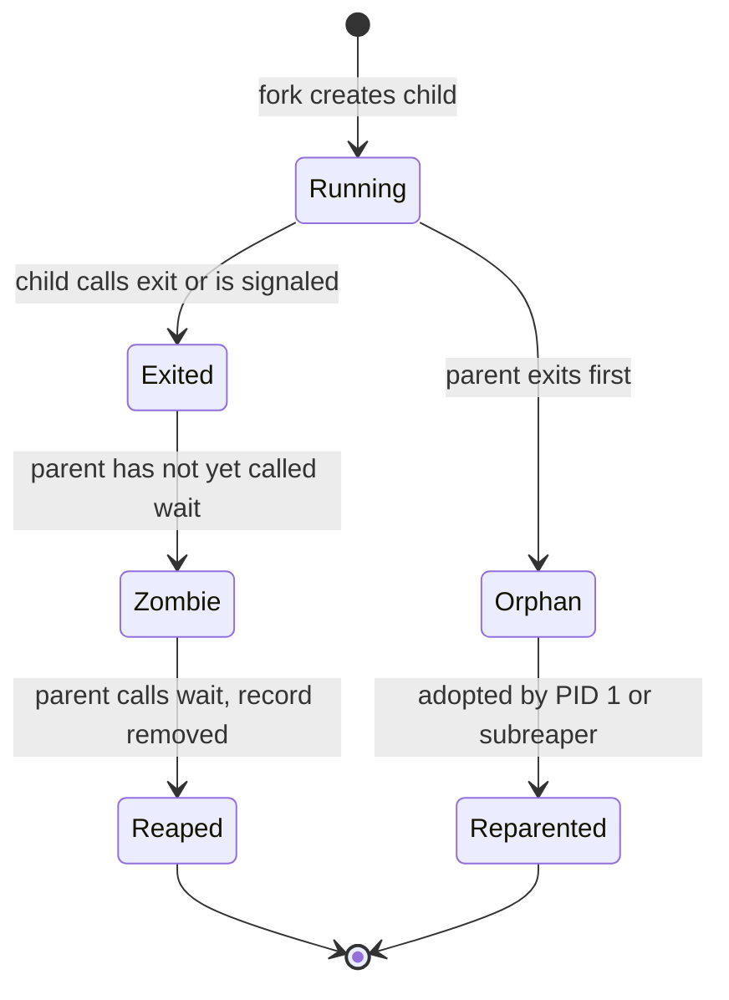
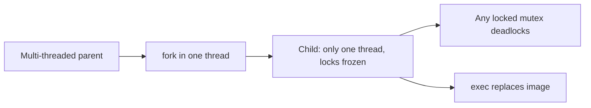

Stage 4 ended with the kernel mapping an executable and jumping to its entry point. This chapter is the first part of Stage 5. Stage 5 is about how concurrent work is structured. It starts with the container that work runs in. That container is the process.

A process is a running program. The kernel keeps it separate from other programs. The separation is real, not just an idea. Each process gets its own virtual address space. It gets its own table of file descriptors. It gets its own identity and limits. The kernel tracks the process through its lifecycle.

That separation lets many programs share one machine. One program cannot read another's memory. If one program crashes, the others keep running. This holds as long as the kernel enforces the boundaries it provides.

A process is created. It runs. It may create children and wait for them. Then it terminates. The way you do these steps decides what is shared, copied, or inherited. The parent must reap a dead child, or that child becomes a zombie. A zombie is a dead child that still holds a slot in the process table. Long-running work adds a supervisor. The supervisor starts the process. It restarts the process when it fails. It stops the process with a deadline.

## What isolation means

Isolation means one process cannot normally read or change another process's memory. The process must ask the kernel to change shared or protected state.

The kernel gives each process a virtual address space. A virtual address space is the set of addresses a program may use. For example, the address `0x7ffc8a0000` in one process points to a different physical spot than the same address in another process. If that page is not mapped, the address points to no memory at all. The hardware turns each access into a physical access through page tables. The kernel controls those tables. Permission bits decide whether the page is readable, writable, or executable for that process.



The diagram shows the separation. Two processes can use the same virtual address for different data. The translation picks the physical pages for each. The dotted line says there is no direct path from one process's memory to another's. You must ask the kernel to share. A pipe or a shared memory mapping created on purpose will do it.

Isolation also covers file descriptors. A file descriptor is a small number, like `3`, that a process uses to refer to an open file or other kernel object. Each process has its own table that maps these numbers to objects. Two processes can both have descriptor `3`, but the numbers point to different objects. This is true unless the descriptor was inherited across `fork` or passed on purpose. The same rule applies to process identifiers, signal settings, working directories, and resource limits. Each process has its own copy.

This differs from a thread. A thread is one path of execution inside a process. Threads in the same process share the same address space and most kernel objects. You choose a process when you want strong separation. You pay for that separation with separate tables.

## Address spaces

An address space is the set of virtual addresses a process may use. It also includes the rules for each region. A typical process has code and read-only data from its executable and libraries. It has a heap that grows as the program asks for memory. It has stacks for its threads. It has regions for shared libraries and for mappings made with `mmap`. Each region has permissions. Code is readable and executable. Constants are readable. The heap and stack are readable and writable. Guard pages are inaccessible.

The kernel creates the address space when the program starts. The program can change it later. It can map files, allocate memory, or map shared regions. When the program uses an address that is not mapped, the CPU faults and the kernel sends `SIGSEGV`. This is not a bug in the translation. It is the protection working as intended. It tells you the program used an address it was not allowed to use.

Address spaces explain why two processes can load the same shared library at different addresses. This happens when address randomization is on. Each process sees its own virtual base. The physical pages for read-only parts may be shared.

## Creating and replacing a process

Unix creates a new process in a way that looks odd at first. It makes a child that starts as a copy of the parent. Then the child can replace itself with a different program.

The first part is `fork`. On Linux the more general call is `clone`, which takes flags that choose what to share. A plain `fork` makes a child. The child starts with the same memory contents as the parent. It starts with the same file descriptor table that points to the same kernel objects. It has the same working directory and signal settings. It gets a new process identifier and its own scheduling state. The return value tells the two apart. In the parent, `fork` returns the child's PID. In the child, it returns zero. On failure, the parent gets `-1` and no child exists.

The second part is `exec`. It loads a new executable into the calling process. It replaces the old code, data, and stack. It keeps the process identifier and many kernel objects. After a successful `exec`, the old program is gone. Only the new program remains. It uses the arguments and environment from the caller.

Go does not expose `fork` directly. The runtime has threads and locks that would be unsafe to copy. But the standard library uses the same mechanism. The Go program below shows the lifecycle without calling `fork` itself.

```go
package main

import (
    "fmt"
    "os"
    "os/exec"
)

func main() {
    cmd := exec.Command("/bin/sleep", "2")
    cmd.Stdout = os.Stdout
    cmd.Stderr = os.Stderr
    if err := cmd.Start(); err != nil {
        fmt.Fprintf(os.Stderr, "start: %v\n", err)
        os.Exit(1)
    }
    fmt.Printf("started child pid %d\n", cmd.Process.Pid)
    if err := cmd.Wait(); err != nil {
        fmt.Printf("child finished with error: %v\n", err)
    } else {
        fmt.Println("child finished cleanly")
    }
}
```

The call to `Start` asks the library to create a new process. On Linux it uses `clone` or `fork`, then `exec` on the named program. The parent can keep going while the child runs. `Wait` collects the child's status later. The important line is `cmd.Wait`. Without it, the child becomes a zombie after it exits. The kernel keeps a small record until the parent collects it.

A clearer view uses `syscall`. It shows what the child inherits. The parent opens a file. The child then inherits a reference to the same kernel file description.

```go
package main

import (
    "fmt"
    "os"
    "syscall"
)

func main() {
    f, _ := os.OpenFile("/tmp/tiny.log", os.O_CREATE|os.O_WRONLY|os.O_APPEND, 0644)
    defer f.Close()

    attr := &os.ProcAttr{
        Files: []*os.File{os.Stdin, os.Stdout, f},
    }
    proc, _ := os.StartProcess("/bin/sh", []string{"sh", "-c", "echo hello from child >> /tmp/tiny.log"}, attr)
    fmt.Printf("child %d started\n", proc.Pid)
    proc.Wait()
}
```

The child inherits descriptor numbers `0`, `1`, and `2` as set in `Files`. Both parent and child have a descriptor that points to the same open file description. Writes from the child append to the same file. If the parent did not mean to share that file, it should have marked the descriptor close-on-exec or not passed it.

A shell uses the same mechanism for a pipeline. The shell holds a pipe with a read end and a write end. It forks a child for the left command. That child's standard output connects to the write end. It forks a child for the right command. That child's standard input connects to the read end. The shell closes the ends it no longer needs. Then it waits.

## Termination

A process ends in three ways. It calls `exit`. It returns from `main`. Or a signal terminates it. `exit` takes a small integer status. The value is between 0 and 255. Zero usually means success. Termination by a signal is different. The kernel records which signal caused it. The parent can tell the difference with `wait`.

Termination does not undo all effects. The kernel reclaims the address space, file descriptors, and many kernel objects. It cannot undo work that already left the machine. Examples are data written to a file, a message sent through a socket, or a lock held in another service. A process killed with `SIGKILL` runs no handler. Buffered data that the program had not flushed may be lost.

A useful check for the tiny program is to run it and look at the exit code.

```bash
go build -o tiny main.go
./tiny; echo "exit $?"
TIMY_FILE=/tmp/missing ./tiny; echo "exit $?"
```

The first run should print the file and exit zero. The second run fails to open the missing file. It writes to standard error. It exits with a non-zero status that `echo` then shows. The parent that started `tiny` sees the same status with `wait`.

### How the exit status is encoded

The kernel packs the child's outcome into one wait status word. A supervisor must unpack it to learn what happened. `WIFEXITED(status)` is true when the child ended through `exit` or a return from `main`. `WEXITSTATUS(status)` then gives the low eight bits of the exit code. This is why a status is clamped to the range 0 to 255. `WIFSIGNALED(status)` is true when a signal killed it. `WTERMSIG(status)` gives the signal number. `WCOREDUMP(status)` says whether a core file was made. The difference matters for restart policy. A service that exits with code 1 because of bad config differs from one killed by `SIGSEGV`. A good supervisor treats the two differently. It does not restart both on the same timer.

## Parent and child relationships

Every process except the first has a parent. The parent can wait for its children. It decides what happens to its children if it exits. Its identity affects signal delivery and job control.

When a child exits, it becomes a zombie until the parent collects its status. A zombie still holds a slot in the process table. The parent can learn how the child finished. Most of the child's memory is already reclaimed. Many short-lived zombies are not a problem. But a parent that keeps creating children and never calls `wait` can fill the table. Then future `fork` calls fail.



An orphan is the opposite case. The child is still running. Its original parent has exited. The kernel reparents it to a supervising process. That is usually PID 1 in that PID namespace or a set subreaper. The new parent can then wait for it.

Process groups and sessions build on the parent and child tree for job control. A shell places a pipeline into a process group. The terminal sends `SIGINT` on Ctrl-C to the whole group. A supervisor that only signals the parent may leave workers running. Those workers may keep holding a listening port. It should signal the group. Better yet, it should signal the whole control group.

## Supervision

A process that does work by itself is often not enough. Long-running programs need more. They must start after the machine boots. They must restart when they fail. They must stop with a deadline. They must report through logs and resource accounting. A service manager does these jobs.

On most Linux systems today, `systemd` is that manager. A unit file says what to start. It says what the service depends on. It sets the environment. It sets limits. It says how to restart the service and how to stop it.

```ini
[Unit]
Description=Tiny reader
After=network-online.target

[Service]
ExecStart=/usr/local/bin/tiny
Restart=on-failure
RestartSec=2
TimeoutStopSec=30

[Install]
WantedBy=multi-user.target
```

The file says to start the program. It restarts it a few seconds after a failure. It waits up to thirty seconds after `SIGTERM` before sending `SIGKILL`. The program must still handle `SIGTERM` itself to drain work. The manager only enforces the deadline. The same binary that runs on your laptop with `go run` will run under `systemd`. It will have a different parent. If it is contained, it will have a different PID namespace. It will have different limits from `LimitNOFILE` or `MemoryMax`.

Supervision also decides what to do with children. A manager that tracks the whole control group can stop all workers that belong to a service. A manager that tracks only the main PID may leave orphans. Health checks should test readiness. They should not just check whether the main PID exists. This tells the manager whether to restart.

A simple way to see supervision is to run the tiny program under a temporary unit. No extra service is needed.

```bash
go build -o /tmp/tiny main.go
systemd-run --user --unit=tiny-demo /tmp/tiny
systemctl --user status tiny-demo --no-pager -l
journalctl --user -u tiny-demo -n 20 --no-pager
```

The `systemd-run` line asks the manager to start a process. The process gets its own control group. `status` shows the main PID and whether it is active. `journalctl` shows the standard output that the manager collected.

A second exercise shows the restart policy.

```bash
systemd-run --user --unit=tiny-fail --property=Restart=on-failure --property=RestartSec=2 /bin/sh -c 'echo failing; exit 1'
watch -n 1 'systemctl --user show tiny-fail -p ActiveState -p SubState -p NRestarts 2>&1 | head'
```

It shows that a program which exits right away with a persistent error gets restarted again and again. The manager keeps starting it because the policy says to. This burns CPU and fills logs. A program can exit with a different code for a config error. It can tell the manager not to restart by using a condition or a different policy.

## Worker processes and process pools

A single process can do only one thing at a time. This holds unless it uses threads or events inside. Another way to do more work is to make a pool of worker processes. The pool holds a fixed number of children. It gives each a task. It collects results. It replaces workers that exit. It respects a deadline when shutting down.

A pool gives you strong isolation. Each worker has its own address space. It has its own file descriptor table. It has its own crash boundary. A heap corruption or a leak in one worker does not corrupt another. The tradeoff is that sharing is explicit. Workers that need to share data must use a pipe, a socket, or a shared mapping made on purpose. Passing that data costs time.

Go's `os/exec` can build a simple pool. The main process starts a fixed number of children. It sends each a task on its standard input or through a pipe. It reads results back. A supervisor watches for exits.

```go
package main

import (
    "bufio"
    "fmt"
    "os"
    "os/exec"
)

func startWorker(id int) *exec.Cmd {
    cmd := exec.Command(os.Args[0], "-worker")
    cmd.Env = append(os.Environ(), fmt.Sprintf("WORKER_ID=%d", id))
    stdin, _ := cmd.StdinPipe()
    cmd.Stdout = os.Stdout
    cmd.Stderr = os.Stderr
    cmd.Start()
    // tiny protocol: one line per task
    go func() {
        defer stdin.Close()
        w := bufio.NewWriter(stdin)
        for i := 0; i < 5; i++ {
            fmt.Fprintf(w, "task %d\n", i)
        }
        w.Flush()
    }()
    return cmd
}

func main() {
    if len(os.Args) > 1 && os.Args[1] == "-worker" {
        s := bufio.NewScanner(os.Stdin)
        for s.Scan() {
            fmt.Printf("worker %s handled %s\n", os.Getenv("WORKER_ID"), s.Text())
        }
        return
    }
    // supervisor part
    var cmds []*exec.Cmd
    for i := 0; i < 3; i++ {
        cmds = append(cmds, startWorker(i))
    }
    for _, c := range cmds {
        c.Wait()
        fmt.Printf("worker pid %d finished with %v\n", c.Process.Pid, c.ProcessState)
    }
}
```

The important lines are `StdinPipe` and `Wait`. `StdinPipe` creates a pipe. The parent writes to it. The child reads it as its standard input. `Wait` lets the parent avoid a zombie. It also tells the parent whether the worker exited cleanly or due to a signal. A real pool adds a deadline on shutdown. The supervisor first closes the pipe to show there are no more tasks. It waits with a timeout. Only then does it send `SIGTERM` to the workers' process group.

### What gets copied and what gets shared

`fork` is a special case of `clone` on Linux. `clone` takes flags that choose what to share. `CLONE_VM` shares the address space. `CLONE_FILES` shares the descriptor table by reference instead of copying it. `CLONE_FS` shares the working directory and root. `CLONE_SIGHAND` shares signal handlers. A normal `fork` is `clone` without those sharing flags. The child gets its own copies. A thread made with `pthread_create` is `clone` with `CLONE_VM` and several sharing flags. This is why threads share memory while processes do not. Go avoids exposing `fork` directly. The runtime has background threads and locks. If they were copied, they would be in an unknown state in the child.

### PID namespaces

A PID is unique only inside its PID namespace. A container is often a set of namespaces. The first process in it sees itself as PID 1. Its children have small numbers. From the host, those same processes have larger host PIDs. You can see both views.

```bash
ps -o pid,ppid,comm
ls /proc/self/ns/pid -l
unshare --pid --fork --mount-proc ps -o pid,ppid,comm
```

It shows that `ps` inside the new namespace shows a different PID for the same process. A signal sent to a PID must be sent in the right namespace. A manager outside must use the host PID. The reparenting described above goes to PID 1. That is PID 1 inside the same namespace. This is why a container's init must reap.

### Sharing a descriptor on purpose

Inheritance across `fork` is not the only way to share a descriptor. It is not always the right way. When a parent wants to give an already running worker a new file, it uses a Unix domain socket. It sends the `SCM_RIGHTS` message. This asks the kernel to install a duplicate descriptor in the target process.

```go
// parent sends an open file to a worker over a Unix socket
// socketpair, then sendmsg with SCM_RIGHTS
```

The key difference is intent. Inheritance shares everything the parent had at `fork` time. This includes descriptors the child did not ask for. The exception is descriptors marked close-on-exec. `SCM_RIGHTS` shares one descriptor on purpose. It has a clear sender and receiver. It works even when the processes are not parent and child. A descriptor leak is usually the first kind. A deliberate hand-off should be the second.

### Waiting with options

`wait` is not just one call. `waitpid` can wait for a specific child. It can wait for any child in a process group. It can wait for any child at all. Flags change whether it blocks. `WNOHANG` says return at once if no child has exited. This lets a supervisor poll for exits while it does other work. `WUNTRACED` and `WCONTINUED` let it see when a child stops or continues. They show more than just exits. `waitid` with `P_PIDFD` on newer kernels lets a manager wait on a pid file descriptor. That descriptor cannot be reused. This avoids a race where a PID is recycled between the check and the wait.

A common pattern for a supervisor is to block on `wait` in one goroutine. It handles `SIGCHLD` in another. Or it uses `signal.Notify` with `SIGCHLD`. Then it loops over `waitpid(-1, WNOHANG)` to reap all children that have exited.

```go
for {
    var ws syscall.WaitStatus
    pid, err := syscall.Wait4(-1, &ws, syscall.WNOHANG, nil)
    if pid <= 0 {
        break
    }
    fmt.Printf("reaped %d status %v\n", pid, ws)
}
```

The loop matters. One signal can mean many children exited. The parent should reap in a loop. It should keep going until `Wait4` says there is nothing left.

### Daemonization and readiness notification

An older way to make a daemon was to fork. Then it called `setsid` to become a new session leader. It forked again so it could not get a terminal. It changed directory. It closed descriptors. The second fork made the daemon a child of PID 1. The original shell did not wait for it. Modern managers like `systemd` prefer that the service not daemonize itself. The program stays in the foreground. The manager tracks its main PID in the control group.

When a service needs time to start, it can use `Type=notify`. The service calls `sd_notify(0, "READY=1")` from `libsystemd`. It does this after it binds its socket and is ready to serve. The manager waits for that notification. It does not just watch the PID. This avoids a race. The manager might think the service is ready because the first fork returned. In fact the service is still starting up.

## How to observe isolation and lifecycle

You can see the current lifecycle with ordinary tools. No special setup is needed.

```bash
go build -o tiny main.go
./tiny &
pid=$!
ps -o pid,ppid,pgid,stat,cmd -p $pid
cat /proc/$pid/status | grep -E "PPid|VmPeak|Threads|CapEff"
ls -l /proc/$pid/fd
ps -o pid,stat,cmd -p $pid
wait $pid; echo "exit $?"
```

It shows that the shell started a child with a new PID. The child has a parent identifier equal to the shell. Its file descriptors are visible under `/proc`. After it exits, `wait` reaps it and reports the status. If you run the same program twice, the two processes have different PIDs and different descriptor tables. This is true even though the binary is the same file on disk.

A second check for a pool is to start three workers as above. Watch their process state while they run.

```bash
go run pool.go &
pool_pid=$!
pstree -p $pool_pid
ps -o pid,ppid,stat,cmd --forest | grep -A 5 pool
kill -TERM $pool_pid
```

The `pstree` line shows the supervisor and its children. The `kill` line exercises the shutdown path. If the supervisor waited for only one child, the others would stay as orphans and be reparented. This is why a real supervisor waits for all children. Or it stops the whole control group.

## A realistic production example

A team ran a Go job runner. It started a new process per job by forking a helper. Under steady load it worked. During a traffic spike, `fork` began failing with `EAGAIN`. Memory and disk looked fine. At the same time `ps` showed many entries in `Z` state. `systemctl status` showed the main process at 100 percent CPU in `wait` for a moment. Then the failures resumed.

The problem was not memory. The parent created workers quickly during the spike. It only called `wait` on the success path. That is the path where the child printed its result. On the error path, `exec` failed. The parent logged and kept going without collecting the child. Each failed launch left a zombie. The zombie held a slot in the process table. After several hundred, the user hit their limit. That limit is set by `RLIMIT_NPROC` and by `TasksMax` on the control group.

The team first raised `TasksMax` and the `NOFILE` limit. The rate of zombies slowed, but the table still filled. The real fix was to collect every child. This included the error path. They used a loop around `wait`. They also marked descriptors that should not be inherited with close-on-exec. This stopped a worker from holding the supervisor's listening socket. They changed the pool to a fixed size instead of one process per job. After the fix, `ps` showed no `Z` entries under load. `fork` succeeded. Tail latency fell. The spike no longer left the table full of zombies for the kernel to scan.

The lesson is this. A process looks cheap when you create it. It becomes expensive when you forget its lifecycle. The kernel gives you isolation. It also asks the parent to do the bookkeeping that completes the separation.

## How engineers actually reason about processes

They start with the resource that is limited or leaking. Is it a slot in the process table. Is it a file descriptor that was inherited. Is it a page that was copied. Is it a signal that was not handled. Then they link that resource to the lifecycle step that manages it. A descriptor leak points to `fork` and `exec` and to close-on-exec. A zombie points to `wait`. An orphan that keeps serving points to parent death and to supervision that tracks only one PID.

They also ask whether a process is the right unit. If workers share a lot of data and need fine coordination, threads or events inside one process may be cheaper. They avoid many address spaces and many pipes. If workers must be isolated, processes are the clearer choice. A corruption in one must not affect another. Or they must run a different binary entirely.

## Why fork is dangerous in a multithreaded program, and where posix_spawn fits

The copy model breaks down once a process has more than one thread. `fork` copies the whole address space. But only the calling thread exists in the child. Every other thread vanishes. Its stack, its locks, and its state vanish with it. Suppose another thread held a mutex when `fork` ran. That mutex is still locked in the child. No thread will ever unlock it. Any function that takes that lock deadlocks. Worse, the set of safe functions to call between `fork` and `exec` is small. They are async-signal-safe functions. Calling `malloc`, `printf`, or most of the standard library is undefined behavior. They may touch a lock left in an inconsistent state. This is why Go hides `fork` behind `os/exec`. The helper runs in a fresh single-threaded process.



`posix_spawn` is the modern answer. It does not copy the process and then repair it. It describes the child you want. It lists the file actions and attributes. Then it does the clone and `exec` in one kernel step. There is no window where the child is a half-copied multithreaded image. It is both safer and faster. Many runtimes now use it under the hood. The practical rule is simple. If you are in a multithreaded program and need to run another program, use a spawn-style API or a dedicated helper process. Do not use a raw `fork`.

## Resource isolation beyond the address space: limits and cgroups

Address-space separation is only one axis of isolation. A process can still exhaust the machine. It can open ten million files. It can spawn ten thousand children. It can allocate until the host swaps. The kernel offers two more axes. One is resource limits. You set them with `setrlimit`. They cap a single process or its descendants. `RLIMIT_NOFILE` bounds open descriptors. `RLIMIT_NPROC` bounds the count of user processes. `RLIMIT_AS` bounds total address space. `RLIMIT_CPU` bounds CPU seconds. `RLIMIT_CORE` bounds core-dump size. These are inherited across `fork` and `exec`. A supervisor sets them once and they propagate.

Control groups add a second axis that the limits do not. They account for a whole tree of processes together. They throttle that tree. A cgroup v2 limits memory, CPU weight, I/O, and the number of tasks. It does this for every process placed in it. The kernel charges usage to the group, not to individual PIDs. This is how a container or a `systemd` slice keeps one service from starving the rest of the box. The two mechanisms work together. Per-process limits protect against a single runaway thread. The cgroup protects against a whole pool. When a process fails to start, the cause is often a limit on one of these axes. It is not memory or disk.

## Process self-protection with prctl and death signals

A process can ask the kernel to help it survive or clean up. It uses `prctl`. `PR_SET_PDEATHSIG` tells the kernel to send a chosen signal to the process if its parent dies. The signal is usually `SIGKILL` or `SIGTERM`. This is how a worker guarantees it does not linger as an orphan. It works when the supervisor it relied on disappears. It is more reliable than polling for parent death. `PR_SET_DUMPABLE` controls whether the process's memory can be dumped or read via `/proc/pid/mem`. This matters for secrets in memory and for debuggability. `PR_SET_NO_NEW_PRIVS` stops a later `exec` from gaining privileges. It blocks setuid or file capabilities. This is a prerequisite for a seccomp filter. It is the basis of many sandboxes. These are small calls with large safety effects. A service that runs untrusted input should set them at startup. A service that must not outlive its parent should also set them.

## Definitions

### A process

> A process is a running program. It has its own virtual address space. It has its own table of file descriptors. It has its own identity. The kernel manages its lifecycle. The kernel's translation and permission checks isolate it from other processes.

### `fork` and `exec`

> `fork` or `clone` creates a child. The child starts with a copy of the parent's address space and descriptor table. It gets a new PID. `exec` replaces the calling process's program with a new executable. It keeps the PID and many kernel objects.

### The parent-child relationship

> Every process except the first has a parent that created it. The parent can wait for the child's exit status. If the parent exits first, the kernel reparents the child to a supervisor. The relationship also affects signal delivery and job control.

### A zombie and an orphan

> A zombie is a child that has exited. Its parent has not yet called `wait`. An orphan is a child that is still running. Its parent has exited. It has been reparented to PID 1 or a subreaper.

### Process supervision

> A manager like `systemd` manages a long-running program. It starts the program. It restarts it on failure. It stops it with a deadline. It keeps its logs and resource accounting in a control group.

### A process pool

> A fixed set of worker processes. A supervisor keeps them. It gives tasks to them. It collects results. It replaces a worker when it exits. This bounds concurrency. Each worker has its own address space and crash boundary.

## Beyond the definitions

### Why the split into two steps

> The split lets the parent change the child's file descriptors. It can change the environment, working directory, and process group between the two calls. This is how a shell builds a pipeline. Each stage gets different standard input and output before it becomes the requested program.

### What close-on-exec does

> It marks a descriptor so the kernel closes it automatically when `exec` succeeds. Without it, the new program inherits descriptors it did not ask for. It may hold a listening socket. It may keep a pipe from reaching end of file.

### How isolation is enforced

> Each process has its own page tables. They translate its virtual addresses to physical pages. Each page has its own permissions. The same virtual address in two processes can point to different physical pages. The CPU faults if a process touches a page it was not allowed to use.

### Why fork fails with EAGAIN

> The system may have hit a per-user process limit. Or it hit a control group's `TasksMax`. Or the process table may be full of zombies. Zombies still occupy slots until their parents call `wait`.

### Choosing processes over threads

> Use processes when you want strong isolation. A fault in one worker cannot corrupt another. Use them when workers should run different binaries. Use them when you need a clear crash boundary. The cost is more explicit communication.

## Common misconceptions

**"A program and a process are the same."** A program is a file of instructions and data. A process is a running instance of that program. It has its own address space, file descriptors, and lifecycle that the kernel tracks.

**"`fork` copies all memory immediately."** It logically copies. But the kernel uses copy-on-write. Parent and child share physical pages until one writes. `fork` is cheap when the child soon calls `exec`.

**"`exec` creates a new PID."** It replaces the program in the existing process. The PID stays the same. This is why a shell can fork a child and then make that child become any command. The parent still waits for the same process.

**"A zombie still uses all its memory."** Most of its memory has been reclaimed. Only a small record with the exit status remains. It stays until the parent calls `wait`.

**"A process is the right unit for every concurrent task."** Isolation has a cost. It costs file descriptors, address space, and communication. Inside one service, threads or events that share an address space are often cheaper. This is true when isolation is not the primary need.

## Summary

A process gives you a container. It has its own virtual addresses. It has its own table of file descriptors. The kernel tracks its lifecycle from creation through exit. `fork` or `clone` creates a child that starts as a copy. `exec` replaces the program in a process while keeping its identity. `wait` lets a parent collect a child's status and avoid a zombie. Parent and child relationships shape reparenting, process groups, and who is signaled. Supervision with a manager adds restart policy, resource limits, and a deadline for shutdown. A process pool uses that supervision to bound concurrency. It keeps strong isolation between workers.
