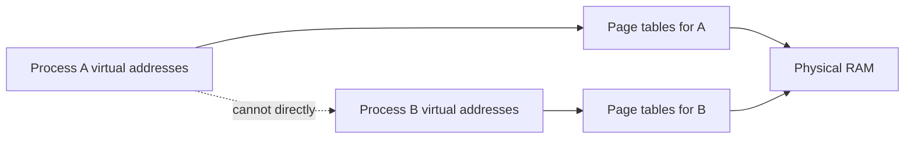
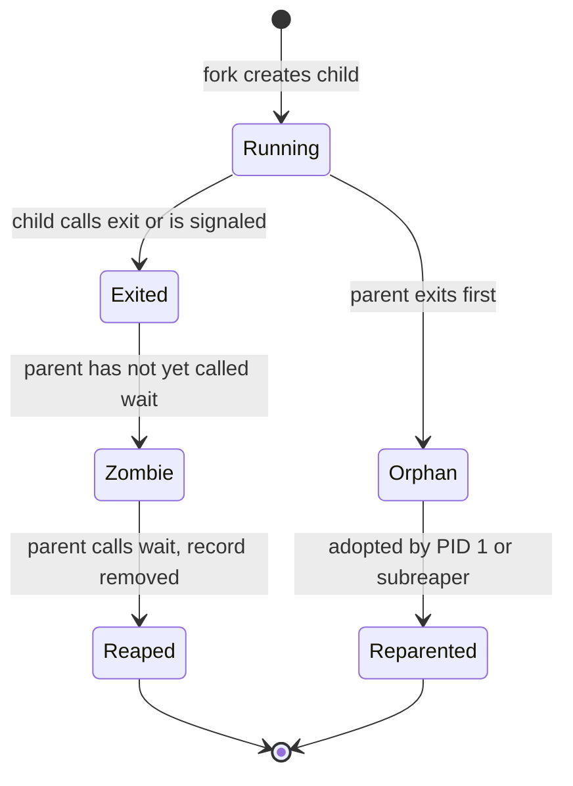

> Stage 5 — Processes, Threads, and Concurrency Models  
> Subject area 5.1 — Processes and Threads  
> Article 1

## The short version

A process is a running program that the kernel keeps separate from other programs. The separation is not just an idea. Each process gets its own virtual address space, its own file descriptor table, its own identity and limits, and its own lifecycle that the kernel tracks.

That separation is what lets many programs share one machine without free access to each other's memory and without one program's crash taking the others with it, as long as the kernel enforces the boundaries it provides.

A process is created, it runs, it may create children and wait for them, and it eventually terminates. How those steps are done decides what resources are shared, what is copied, what is inherited, and what the parent must do to avoid leaving a zombie. Long-running work adds a supervisor that starts the process, restarts it when it fails, and stops it with a deadline.

## Where this article fits

This is the first deep article in Stage 5, which is about choosing how concurrent work is structured. Before choosing threads, events, or pipelines, you need to be precise about what a process is and how it lives and dies.

The previous stage showed how source becomes an executable. This article shows what happens when that executable is given to the kernel with `exec`. It builds on address spaces from the privilege article, on file descriptors from the filesystem article, and on `fork` and `exec` from the process lifecycle overview. Later articles in this stage will put threads inside this container and compare processes with other concurrency models, and the article on supervision here connects directly to service supervision and resource limits.

## What isolation means

Isolation means that one process cannot normally read or change another process's memory, and that it must ask the kernel to perform operations that affect shared or protected state.

The kernel gives each process a virtual address space. A virtual address like `0x7ffc8a0000` in one process refers to a different physical location than the same address in another process, or to no physical memory at all if that page is not mapped. The hardware translates each access through page tables that the kernel controls, and permission bits decide whether the page is readable, writable, or executable for that process.



The diagram shows the separation. Two processes can use the same virtual address for different data, and the translation chooses the physical pages. The dotted line says there is no direct path from one process's memory to another's. A separate request through the kernel, like a pipe or shared memory mapping created on purpose, is needed to share.

Isolation also covers file descriptors. Each process has its own table that maps a small integer like `3` to a kernel object. Two processes can both have a descriptor `3`, but those integers refer to different objects unless the descriptor was inherited across `fork` or passed intentionally. The same is true for process identifiers, signal dispositions, working directories, and resource limits. Each process has its own copy.

This is different from a thread. A thread is an execution path inside a process that shares the same address space and most of the same kernel objects. Isolation is the reason you choose a process when you want strong separation and pay the cost of separate tables.

## Address spaces

An address space is the set of virtual addresses a process may use and the rules for each region. A typical process has code and read-only data from the executable and its libraries, a heap that can grow as the program allocates, stacks for its threads, and regions for shared libraries and for mappings created with `mmap`. Each region has permissions. Code is readable and executable, constants are readable, the heap and stack are readable and writable, and guard pages are inaccessible.

The kernel creates the address space when the program starts, and the program can change it later by mapping files, allocating memory, or mapping shared regions. When the program accesses an address that is not mapped or with the wrong permission, the CPU faults and the kernel delivers `SIGSEGV`. That fault is not a bug in the translation. It is the intended protection telling you the program used an address it was not allowed to use.

Address spaces are the reason two processes can load the same shared library at different addresses when address randomization is enabled. Each process sees its own virtual base, while the physical pages for read-only parts may be shared.

## Creation and replacement

Unix creates a new process in a way that looks odd at first. It makes a child that starts as a copy of the parent, and then the child can replace itself with a different program.

The first part is `fork`, and on Linux more generally `clone` with flags that say what to share. A plain `fork` creates a child that starts with the same virtual memory contents, the same file descriptor table referring to the same kernel objects, the same working directory and signal dispositions, but a different process identifier and its own scheduling state. The return value tells the two apart. In the parent, `fork` returns the child's PID. In the child, it returns zero. On failure, the parent gets `-1` and no child exists.

The second part is `exec`, which loads a new executable into the calling process and replaces the old code, data, and stack while keeping the process identifier and many of its kernel objects. After a successful `exec`, the old program no longer exists in that process. Only the new one remains, with arguments and environment taken from the caller.

Go does not expose `fork` directly because the runtime has threads and locks that would be unsafe to copy, but it uses the same mechanism in the standard library. The following Go program shows the lifecycle without calling `fork` itself.

```go
package main

import (
    "fmt"
    "os"
    "os/exec"
)

func main() {
    cmd := exec.Command("/bin/sleep", "2")
    cmd.Stdout = os.Stdout
    cmd.Stderr = os.Stderr
    if err := cmd.Start(); err != nil {
        fmt.Fprintf(os.Stderr, "start: %v\n", err)
        os.Exit(1)
    }
    fmt.Printf("started child pid %d\n", cmd.Process.Pid)
    if err := cmd.Wait(); err != nil {
        fmt.Printf("child finished with error: %v\n", err)
    } else {
        fmt.Println("child finished cleanly")
    }
}
```

The call to `Start` asks the library to create a new process. On Linux it will use `clone` or `fork` and then `exec` the named program. The parent can continue while the child runs, and `Wait` later collects the child's status. The important line is `cmd.Wait`. Without it, the child becomes a zombie after it exits, because the kernel keeps a small record until the parent collects it.

A more explicit view with `syscall` shows the inherit column. The parent opens a file and then the child inherits a reference to the same kernel file description.

```go
package main

import (
    "fmt"
    "os"
    "syscall"
)

func main() {
    f, _ := os.OpenFile("/tmp/tiny.log", os.O_CREATE|os.O_WRONLY|os.O_APPEND, 0644)
    defer f.Close()

    attr := &os.ProcAttr{
        Files: []*os.File{os.Stdin, os.Stdout, f},
    }
    proc, _ := os.StartProcess("/bin/sh", []string{"sh", "-c", "echo hello from child >> /tmp/tiny.log"}, attr)
    fmt.Printf("child %d started\n", proc.Pid)
    proc.Wait()
}
```

The child inherits descriptor numbers `0`, `1`, and `2` as wired in `Files`. Both parent and child have a descriptor that refers to the same open file description, so writes from the child append to the same file. If the parent had not intended to share that file, it should have marked the descriptor close-on-exec or not passed it.

The same mechanism is what a shell uses for a pipeline. The shell holds a pipe with a read end and a write end, forks a child for the left command with its standard output connected to the write end, forks a child for the right command with its standard input connected to the read end, closes the ends it no longer needs, and then waits.

## Termination

A process ends when it calls `exit`, when it returns from `main`, or when it is terminated by a signal. `exit` takes a small integer status between 0 and 255 where zero usually means success. Termination by a signal is different. The kernel records which signal caused it, and the parent can tell the difference with `wait`.

Termination does not mean all effects are undone. The kernel reclaims the address space, file descriptors, and many kernel objects, but it cannot undo work that already left the machine, like data written to a file, a message sent through a socket, or a lock held in another service. A process that is killed with `SIGKILL` does not run any handler, so buffered data that the program had not yet flushed may be lost.

A useful check for the tiny program is to run it and look at the exit code.

```bash
go build -o tiny main.go
./tiny; echo "exit $?"
TIMY_FILE=/tmp/missing ./tiny; echo "exit $?"
```

The first run should print the file and exit zero. The second fails to open the missing file, writes to standard error, and exits with a non-zero status that `echo` then shows. The parent that started `tiny` can see that same status with `wait`.

## Parent and child relationships

Every process except the first has a parent. The parent can wait for its children, it determines what happens to its children if it exits, and its identity affects signal delivery and job control.

When a child exits, it becomes a zombie until the parent collects its status. A zombie still occupies a slot in the process table so the parent can learn how it finished, but most of its memory has already been reclaimed. Many short-lived zombies are not a problem, but a parent that keeps creating children and never calls `wait` can fill the table and make future `fork` fail.



An orphan is the opposite situation. The child is still running, but its original parent has exited. The kernel reparents it to a supervising process, usually PID 1 in that PID namespace or a configured subreaper. The new parent can then wait for it.

Process groups and sessions build on this parent and child tree for job control. A shell places a pipeline into a process group, and the terminal delivers `SIGINT` on Ctrl-C to that whole group. A supervisor that only signals the parent may leave workers running and holding a listening port, so it should signal the group or, more reliably, the whole control group.

## Supervision

A process that does work by itself is often not enough. Long-running programs need to be started after the machine boots, restarted when they fail, stopped with a deadline, and observed through logs and resource accounting. A service manager does those jobs.

On most Linux systems today, `systemd` is that manager. A unit file says what to start, what it depends on, what environment to give it, what limits to apply, how to restart it, and how to stop it.

```ini
[Unit]
Description=Tiny reader
After=network-online.target

[Service]
ExecStart=/usr/local/bin/tiny
Restart=on-failure
RestartSec=2
TimeoutStopSec=30

[Install]
WantedBy=multi-user.target
```

The file says to start the program, restart it a few seconds after a failure, and wait up to thirty seconds after `SIGTERM` before sending `SIGKILL`. The program must still handle `SIGTERM` itself to drain work. The manager only enforces the deadline. The same binary that runs on your laptop with `go run` will run under `systemd` with a different parent, a different PID namespace when contained, and different limits from `LimitNOFILE` or `MemoryMax`.

Supervision also decides what to do with children. A manager that tracks the whole control group can stop all workers that belong to a service. One that tracks only the main PID may leave orphans. Health checks that test readiness, not just whether the main PID exists, are what tell the manager whether to restart.

A Level 1 read that makes supervision concrete without any extra service is to run the tiny program under a temporary unit.

```bash
go build -o /tmp/tiny main.go
systemd-run --user --unit=tiny-demo /tmp/tiny
systemctl --user status tiny-demo --no-pager -l
journalctl --user -u tiny-demo -n 20 --no-pager
```

The `systemd-run` line asks the manager to start a process with its own control group. `status` shows the main PID and whether it is active, and `journalctl` shows its standard output that the manager collected.

A Level 2 exercise makes restart policy visible.

```bash
systemd-run --user --unit=tiny-fail --property=Restart=on-failure --property=RestartSec=2 /bin/sh -c 'echo failing; exit 1'
watch -n 1 'systemctl --user show tiny-fail -p ActiveState -p SubState -p NRestarts 2>&1 | head'
```

What it demonstrates is that a program that exits immediately with a persistent error is restarted repeatedly. The manager keeps starting it because the policy says to do so, which burns CPU and fills logs. A program that exits with a different code for a configuration error can tell the manager not to restart by using a condition or a different policy.

## Worker processes and process pools

A single process can only do one thing at a time unless it uses threads or events inside. Another way to do more work is to make a pool of worker processes. The pool holds a fixed number of children, gives each a task, collects results, replaces workers that exit, and respects a deadline when shutting down.

A pool gives you strong isolation. Each worker has its own address space, its own file descriptor table, and its own crash boundary. A heap corruption or a leak in one worker does not directly corrupt another. The tradeoff is that sharing is explicit. Workers that need to share data must use a pipe, a socket, or a shared mapping created on purpose, and passing that data costs.

Go's `os/exec` can build a simple pool. The main process starts a fixed number of children, sends each a task on its standard input or through a pipe, and reads results back, while a supervisor watches for exits.

```go
package main

import (
    "bufio"
    "fmt"
    "os"
    "os/exec"
)

func startWorker(id int) *exec.Cmd {
    cmd := exec.Command(os.Args[0], "-worker")
    cmd.Env = append(os.Environ(), fmt.Sprintf("WORKER_ID=%d", id))
    stdin, _ := cmd.StdinPipe()
    cmd.Stdout = os.Stdout
    cmd.Stderr = os.Stderr
    cmd.Start()
    // tiny protocol: one line per task
    go func() {
        defer stdin.Close()
        w := bufio.NewWriter(stdin)
        for i := 0; i < 5; i++ {
            fmt.Fprintf(w, "task %d\n", i)
        }
        w.Flush()
    }()
    return cmd
}

func main() {
    if len(os.Args) > 1 && os.Args[1] == "-worker" {
        s := bufio.NewScanner(os.Stdin)
        for s.Scan() {
            fmt.Printf("worker %s handled %s\n", os.Getenv("WORKER_ID"), s.Text())
        }
        return
    }
    // supervisor part
    var cmds []*exec.Cmd
    for i := 0; i < 3; i++ {
        cmds = append(cmds, startWorker(i))
    }
    for _, c := range cmds {
        c.Wait()
        fmt.Printf("worker pid %d finished with %v\n", c.Process.Pid, c.ProcessState)
    }
}
```

The important lines are `StdinPipe` and `Wait`. `StdinPipe` creates a pipe that the parent can write to and the child reads as its standard input. `Wait` is the parent's way to avoid a zombie and to learn whether the worker exited cleanly or due to a signal. A real pool adds a deadline on shutdown, where the supervisor first closes the pipe to signal no more tasks, waits with a timeout, and only then sends `SIGTERM` to the workers' process group.

### Which parts are copied and which are shared

`fork` is a special case of `clone` on Linux. `clone` takes flags that say what to share. `CLONE_VM` would share the address space, `CLONE_FILES` would share the descriptor table by reference rather than copying it, `CLONE_FS` would share the working directory and root, `CLONE_SIGHAND` would share signal handlers. A normal `fork` is `clone` without those sharing flags, so the child gets its own copies. A thread created with `pthread_create` is `clone` with `CLONE_VM` and several sharing flags, which is why threads share memory while processes do not. Go avoids exposing `fork` directly because the runtime has background threads and locks that would be in an unknown state in the child if they were copied.

### PID namespaces

A PID is only unique inside its PID namespace. A container is often a set of namespaces where the first process sees itself as PID 1 and its children have small numbers, while from the host those same processes have larger host PIDs. You can see both views.

```bash
ps -o pid,ppid,comm
ls /proc/self/ns/pid -l
unshare --pid --fork --mount-proc ps -o pid,ppid,comm
```

What it demonstrates is that `ps` inside the new namespace shows a different PID for the same process. A signal sent to a PID must be sent in the right namespace, and a manager outside must use the host PID. The reparenting that was described as to PID 1 is to PID 1 inside the same namespace, which is why a container's init must reap.

### Passing a descriptor when you want to share

Inheritance across `fork` is not the only way to share a descriptor, and it is not always the right one. When a parent wants to give an already-running worker a new file, it uses a Unix domain socket with the `SCM_RIGHTS` message, which asks the kernel to install a duplicate descriptor in the target process.

```go
// parent sends an open file to a worker over a Unix socket
// socketpair, then sendmsg with SCM_RIGHTS
```

The important distinction is intent. Inheritance shares everything the parent had at `fork` time, including descriptors the child did not ask for, unless they were marked close-on-exec. `SCM_RIGHTS` shares one descriptor explicitly, with a clear sender and receiver, and it works even when the processes are not parent and child. A descriptor leak is usually the first kind. A deliberate hand-off should be the second.

### Waiting with options

`wait` is not just one call. `waitpid` can wait for a specific child, for any child in a process group, or for any child at all. Flags change whether it blocks. `WNOHANG` says to return immediately if no child has exited, which lets a supervisor poll for exits while it does other work. `WUNTRACED` and `WCONTINUED` let it see when a child stops or continues, not just when it exits. `waitid` with `P_PIDFD` on newer kernels lets a manager wait on a pid file descriptor that cannot be reused, which avoids the race where a PID is recycled between checking it and waiting on it.

A common pattern for a supervisor is to block on `wait` in one goroutine and handle `SIGCHLD` in another, or to use `signal.Notify` with `SIGCHLD` and then loop over `waitpid(-1, WNOHANG)` to reap all children that have exited.

```go
for {
    var ws syscall.WaitStatus
    pid, err := syscall.Wait4(-1, &ws, syscall.WNOHANG, nil)
    if pid <= 0 {
        break
    }
    fmt.Printf("reaped %d status %v\n", pid, ws)
}
```

The loop matters. One signal can mean many children exited, so the parent should reap in a loop until `Wait4` says there is nothing left.

### Double fork and `sd_notify`

An older way to make a daemon was to fork, call `setsid` to become a new session leader, fork again so it cannot acquire a terminal, change directory, and close descriptors. The second fork made the daemon a child of PID 1 so the original shell did not wait for it. Modern managers like `systemd` prefer that the service not daemonize itself at all. The program stays in the foreground and the manager tracks its main PID in the control group.

When a service needs time to start, it can use `Type=notify`. The service calls `sd_notify(0, "READY=1")` from `libsystemd` after it has bound its socket and is ready to serve, and the manager waits for that notification instead of just watching the PID. That avoids the race where the manager thinks the service is ready because the first fork returned, while the service is still initializing.

## How to observe isolation and lifecycle

You can see the current lifecycle with ordinary tools without any special setup. The following sequence is a Level 1 read that connects the model to the machine.

```bash
go build -o tiny main.go
./tiny &
pid=$!
ps -o pid,ppid,pgid,stat,cmd -p $pid
cat /proc/$pid/status | grep -E "PPid|VmPeak|Threads|CapEff"
ls -l /proc/$pid/fd
ps -o pid,stat,cmd -p $pid
wait $pid; echo "exit $?"
```

What it demonstrates is that the shell started a child with a new PID, the child has a parent identifier equal to the shell, its file descriptors are visible under `/proc`, and after it exits `wait` reaps it and reports the status. If you run the same program twice, the two processes have different PIDs and different descriptor tables, even though the binary is the same file on disk.

A Level 2 check for a pool is to start three workers as above and watch process state while they run.

```bash
go run pool.go &
pool_pid=$!
pstree -p $pool_pid
ps -o pid,ppid,stat,cmd --forest | grep -A 5 pool
kill -TERM $pool_pid
```

The `pstree` line shows the supervisor and its children. The `kill` line exercises the shutdown path. If the supervisor only waited for one child, the others would remain as orphans and be reparented, which is why a real supervisor waits for all children or stops the whole control group.

## A realistic production example

A team ran a Go job runner that started a new process per job by forking a helper. Under steady load it worked, but during a traffic spike `fork` began failing with `EAGAIN` even though memory and disk looked fine. At the same time `ps` showed many entries in `Z` state and `systemctl status` showed the main process at 100 percent CPU in `wait` for a moment, then the failures resumed.

The problem was not memory. The parent created workers quickly during the spike but only called `wait` on the success path where the child printed its result. On the error path where `exec` failed, it logged and continued without collecting the child. Each failed launch left a zombie that kept a slot in the process table. After several hundred, the limit for the user, controlled by `RLIMIT_NPROC` and by `TasksMax` on the control group, was reached.

The team first raised `TasksMax` and the `NOFILE` limit. The rate of zombies slowed, but the table still filled. The real fix was to collect every child, including the error path, with a loop around `wait`. They also marked descriptors that should not be inherited with close-on-exec so a worker could not hold the supervisor's listening socket, and they changed the pool to a fixed size of workers instead of one process per job. After the fix `ps` showed no `Z` entries under load, `fork` succeeded, and tail latency fell because the spike no longer left the table full of zombies that the kernel had to scan.

The lesson was that a process that looks cheap when you create it becomes expensive when you forget its lifecycle. The kernel gives you isolation, but it also asks the parent to do the bookkeeping that completes the separation.

## How experienced engineers think about processes

They start with the resource that is limited or leaking. Is it a slot in the process table, a file descriptor that was inherited, a page that was copied, or a signal that was not handled. Then they connect that resource to the lifecycle step that manages it. A descriptor leak points to `fork` and `exec` and to close-on-exec. A zombie points to `wait`. An orphan that keeps serving points to parent death and to supervision that tracks only one PID.

They also ask whether a process is the right granularity. If workers share a lot of data and need fine-grained coordination, threads or events inside one process may be cheaper than many address spaces and many pipes. If workers must be isolated so a corruption in one cannot affect another, or if they must run a different binary entirely, processes are the clearer choice.

## Interview definitions

### What is a process?

> A process is a running program with its own virtual address space, file descriptor table, identity, and kernel-managed lifecycle. It is isolated from other processes by the kernel's translation and permission checks.

### What does `fork` do and what does `exec` replace?

> `fork` or `clone` creates a child that starts with a copy of the parent's address space and descriptor table and a new PID. `exec` replaces the calling process's program with a new executable while keeping its PID and many of its kernel objects.

### What is a parent-child relationship?

> Every process except the first has a parent that created it. The parent can wait for the child's exit status, and if the parent exits first the kernel reparents the child to a supervisor. The relationship also affects signal delivery and job control.

### What is a zombie and an orphan?

> A zombie is a child that has exited but whose parent has not yet called `wait`. An orphan is a still-running child whose parent has exited and which has been reparented to PID 1 or a subreaper.

### What is process supervision?

> The management of a long-running program by a manager like `systemd` that starts it, restarts it on failure, stops it with a deadline, and keeps its logs and resource accounting in a control group.

### What is a process pool?

> A fixed set of worker processes that a supervisor keeps, gives tasks to, collects results from, and replaces when a worker exits, so concurrency is bounded and each worker has its own address space and crash boundary.

## Interview follow-up questions

### Why are `fork` and `exec` two steps?

> The split lets the parent change the child's file descriptors, environment, working directory, and process group between the two calls, which is how a shell builds a pipeline where each stage has different standard input and output before it becomes the requested program.

### What does close-on-exec do?

> It marks a descriptor so it is automatically closed when `exec` succeeds. Without it, the new program inherits descriptors it did not ask for and may hold a listening socket or keep a pipe from reaching end of file.

### How is an address space isolated?

> Each process has its own page tables that translate its virtual addresses to physical pages with per-page permissions. The same virtual address in two processes can refer to different physical pages, and the CPU faults if a process touches a page it was not allowed to use.

### Why can `fork` fail with `EAGAIN` when memory looks free?

> The system may have hit a per-user process limit or a control group's `TasksMax`, or the process table may be full of zombies that still occupy slots until their parents call `wait`.

### When would you choose processes over threads?

> When you want strong isolation so a fault in one worker cannot corrupt another, when workers should run different binaries, or when you need a clear crash boundary at the cost of more explicit communication.

## Common misconceptions

### “A program and a process are the same.”

A program is a file of instructions and data. A process is a running instance of that program with its own address space, file descriptors, and lifecycle that the kernel tracks.

### “`fork` copies all memory immediately.”

It logically copies, but the kernel uses copy-on-write. Parent and child share physical pages until one writes, so `fork` is cheap when the child soon calls `exec`.

### “`exec` creates a new PID.”

It replaces the program in the existing process. The PID stays the same, which is why a shell can fork a child and then make that child become any command without changing which process the parent waits for.

### “A zombie still uses all its memory.”

Most of its memory has been reclaimed. Only a small record with the exit status remains until the parent calls `wait`.

### “A process is the right unit for every concurrent task.”

Isolation has a cost in file descriptors, address space, and communication. Inside one service, threads or events that share an address space are often cheaper when isolation is not the primary need.

## Summary

A process gives you a container with its own virtual addresses, its own table of file descriptors, and a lifecycle that the kernel tracks from creation through exit. `fork` or `clone` creates a child that starts as a copy, `exec` replaces the program in a process while keeping its identity, and `wait` lets a parent collect a child's status and avoid a zombie. Parent and child relationships shape reparenting, process groups, and who is signaled. Supervision with a manager adds restart policy, resource limits, and a deadline for shutdown, and a process pool uses that supervision to bound concurrency while keeping strong isolation between workers.

## If you want to build this later

Build a small process pool that starts three workers and keeps them. The supervisor should create each worker with a pipe for tasks, mark file descriptors close-on-exec, and wait for any child that exits to replace it. Add a mode where a worker is killed with a signal and watch the supervisor restart it. Then add a graceful shutdown where the supervisor closes the task pipes, waits up to five seconds, and only then sends `SIGTERM` to the workers' process group. Write down where a descriptor leak would show in `/proc/<pid>/fd` and where a missing `wait` would show `Z` in `ps`.
