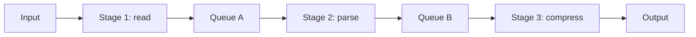
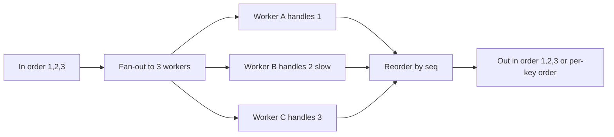
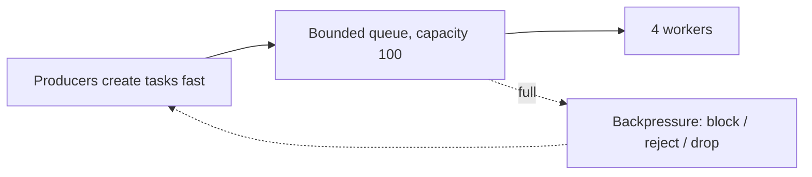
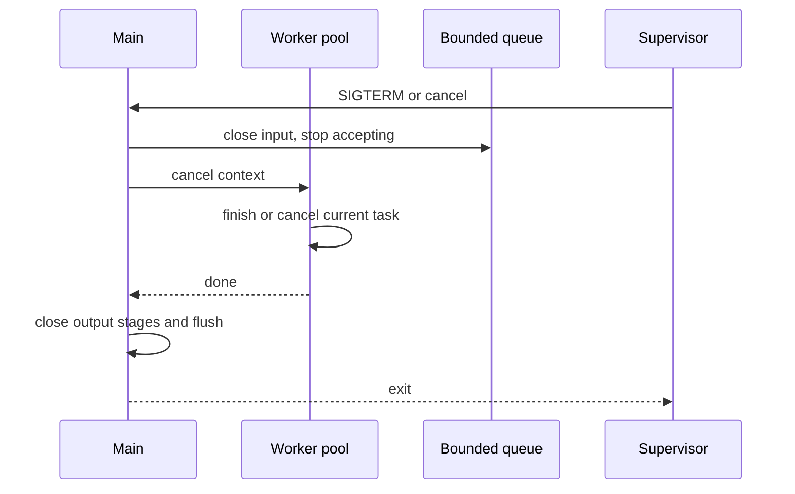
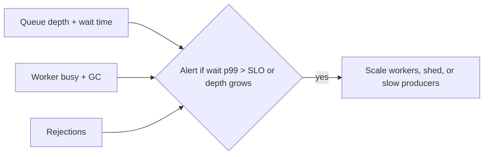

The previous chapter compared processes, threads, and events as ways to hold concurrent work. This chapter is about the structures that connect those workers and about the policies that keep those structures from growing without bound. It is the final article of Stage 5.

A queue holds work that has arrived but is not yet being processed. A pipeline is a chain of stages where each stage does one kind of work and passes the result to the next. The way the program behaves when a queue is full and the way it stops work that is no longer needed decide whether the system stays stable under load.

A bounded queue has a fixed capacity. When it is full, the program must decide what to do with new work. It can block the producer, drop the work, or reject it with an error that the caller can see. That decision is backpressure. It tells the producer that the downstream cannot keep up.

Cancellation says that work should stop because its result is no longer needed or a deadline passed. Timeouts place an upper bound on how long to wait, and graceful shutdown lets in-flight work finish or cancel within a deadline before resources are released.

## Work queues

A work queue is where tasks wait before a worker takes them. It decouples the producer that creates work from the consumer that does it. The producer does not need to know which worker will take the task, and the consumer does not need to know which producer created it.

A queue has a few properties that affect the program. One is order. A first-in first-out queue preserves arrival order, while a priority queue reorders by importance. One is where it lives. An in-memory queue is fast but loses tasks if the process exits. A durable queue keeps tasks after a crash. One is whether one queue is shared by many workers or each worker has its own queue that can be stolen from.

In Go, an unbuffered channel is a queue with capacity zero. A send blocks until a receiver is ready. A buffered channel is a queue with a fixed capacity.

```go
tasks := make(chan string, 20)

go func() {
    for t := range tasks {
        fmt.Println(t)
    }
}()

tasks <- "hello"
tasks <- "world"
close(tasks)
```

What it demonstrates is the boundary between arrival and processing. The sender can continue after `tasks <- "hello"` as long as the channel is not full. The receiver iterates until the channel is closed, which is the Go way to say there will be no more tasks.

What matters for the system is not just the send, but whether the channel can grow. A buffered channel that is made larger and larger to avoid blocking just moves the problem to memory.

## Pipeline stages

A pipeline breaks work into stages where each stage does one transformation and passes the result to the next stage through a queue. Reading a file, parsing it, and compressing it can be three stages. Handling a request can be parsing, authorization, business logic, and encoding response as four stages.



The diagram shows the separation. Each stage can have its own concurrency. Stage 1 may have one reader, stage 2 may have four parsers, and stage 3 may have two compressors. Each queue between stages is a place where work waits, so each queue is a place where backpressure and cancellation must be decided.

A pipeline written with goroutines and channels makes the stages visible.

```go
package main

func stage1(in <-chan string, out chan<- string) {
    defer close(out)
    for s := range in {
        out <- "parsed:" + s
    }
}

func stage2(in <-chan string, out chan<- string) {
    defer close(out)
    for s := range in {
        out <- "compressed:" + s
    }
}

func main() {
    in := make(chan string, 10)
    mid := make(chan string, 10)
    out := make(chan string, 10)

    go stage1(in, mid)
    go stage2(mid, out)

    in <- "hello"
    close(in)
    for r := range out {
        _ = r
    }
}
```

The important lines are the `defer close(out)` in each stage, which says this stage will not send more after its input ends. The pipeline as a whole finishes when every stage has seen its input close and has closed its output. If a stage fails to close or to handle cancellation, the downstream stage waits forever.

A pipeline can be linear like the example, it can have a fan-out where one input goes to many workers, or a fan-in where many producers feed one consumer. The same queue questions apply at each edge.

### Fan-out, fan-in, and ordering

A fan-out makes a stage faster by running many workers on the same queue. A fan-in merges many producers into one consumer that needs a single view. Both break the simple order of the linear example. If order still matters, the program must put it back.

A common pattern is to give each task a sequence number at the fan-out and have the stage after the fan-in reorder by that number before it forwards. Another pattern is to shard by key, where all tasks for the same key go to the same worker so order per key is preserved while different keys run in parallel. A pipeline that fans out without a plan for ordering and then claims to be ordered will reorder under load when one worker is slower than another.



What it demonstrates is that concurrency and order are a choice. A fan-out without reordering is faster but not ordered, while a reorder buffer adds latency and memory to restore order. The queue between stages is where that buffer lives.

## Bounded queues

A bounded queue has a fixed capacity. When it is full, a send must decide what to do. In Go with `select` and `default`, the program can try to send without blocking and handle the case where the queue is full.

```go
select {
case tasks <- task:
    // accepted
default:
    // full, decide
    fmt.Println("dropping", task)
}
```

An unbounded queue is often described as a queue with no limit, but in a real program it is bounded by memory. Making the buffered channel larger just lets the program hold more tasks before it fails. Each task holds memory, and each goroutine that will process it holds a stack and possibly a descriptor, so the cost grows with the number of pending tasks.

A useful way to think about a bounded queue is as a counter for concurrency that is waiting. The queue length tells you how many tasks have arrived but have not started, while the number of workers tells you how many are running at once. If tasks arrive faster than workers can finish them for a sustained period, the queue will stay full and the system must reject, drop, or block.

### How a bounded queue is built

Most bounded queues are a ring buffer with a head and a tail index and a fixed array. A send writes at the tail and advances it, a receive reads at the head and advances it, and both wrap around. The count is `(tail - head) mod capacity`. When the count equals capacity the queue is full, when it equals zero the queue is empty. A `sync.Cond` or a semaphore wakes a waiter when the count changes.

A Go buffered channel is a ring buffer with that logic built in, plus the close state. An unbounded queue is often a linked list that allocates a new node per task. It appears to have no limit, but each node is a heap allocation that the garbage collector must track, so throughput can fall as the queue grows even before memory is exhausted.

### Little's Law and what the queue stores

A queue stores not just tasks, but time. Little's Law says that for a stable system, the average number of tasks in the system equals the arrival rate multiplied by the average time a task spends in the system.

```text
L = λ × W
L is tasks in queue + in service, λ is arrivals per second, W is time in system
```

If tasks arrive at 100 per second and each waits an average of 2 seconds before a worker starts it, the system holds about 200 tasks on average. Doubling the queue capacity without adding workers does not change `W`. It just lets `L` grow, which is why tail latency grows with an unbounded queue even when throughput looks fine.

## Backpressure

Backpressure is the signal a downstream stage sends to an upstream stage that it should slow down. It is not a single mechanism. It is a policy that the program chooses when a queue is full.

The simplest policy is to block the producer. The call that submits work waits until there is space. The producer feels the slowness immediately and cannot create work faster than it is consumed. The tradeoff is that the block propagates. The caller's caller now waits, and so on, until the whole chain slows.

Another policy is to reject or drop. The submitter gets an error like `busy` and can retry later, shed lower-priority work, or tell its own caller. The downstream is protected, but the caller must have a way to handle rejection that does not retry immediately in a tight loop.

A third policy is to use a bounded queue with a single shared queue and a fixed pool, which is backpressure by design. When all workers are busy and the queue is full, the submitter blocks or is rejected. When the queue is large but not bounded, the system appears to accept everything while memory grows and latency becomes unpredictable.



The diagram shows the feedback. The queue is the sensor, and the policy is the line that goes back to the producer. Without that line, the queue is just a place where tasks accumulate until memory is exhausted.

The earlier resource ownership article showed a bounded connection pool with the same tradeoff. A bounded queue protects the system, while an unbounded queue hides overload until a limit elsewhere fails.

## Cancellation

Cancellation says that work that was started should stop because its result will not be used, or because a higher-level operation was cancelled. The program must decide how that signal flows and where it is checked.

In Go, cancellation is usually carried by a `context.Context`. A context is created with a parent, it can be cancelled by calling a `cancel` function, and every operation that should be cancellable selects on its `Done` channel.

```go
package main

import (
    "context"
    "fmt"
    "time"
)

func worker(ctx context.Context, tasks <-chan string) {
    for {
        select {
        case <-ctx.Done():
            fmt.Println("worker: context cancelled", ctx.Err())
            return
        case t, ok := <-tasks:
            if !ok {
                return
            }
            // check context also while doing work
            select {
            case <-ctx.Done():
                return
            case <-time.After(10 * time.Millisecond):
                fmt.Println("handled", t)
            }
        }
    }
}

func main() {
    ctx, cancel := context.WithCancel(context.Background())
    tasks := make(chan string, 10)
    go worker(ctx, tasks)
    tasks <- "a"
    cancel()
    close(tasks)
}
```

The important lines are the two selects on `ctx.Done()`. One is at the top of the loop where the worker decides whether to take the next task. The other is inside the handling where the worker decides whether to continue the current task. Without the second check, a worker that is already doing work would keep doing it even though the caller gave up.

Cancellation should be cooperative. The signal is a request, not a forced kill. The worker chooses safe points to check it, releases any resources it holds, and returns. A worker that is terminated abruptly while holding a lock can leave shared state inconsistent.

Structured concurrency, described in the previous article, adds the rule that a parent that started concurrent work waits for that work before it returns and that cancellation of the parent cancels the children. In Go, an `errgroup.Group` with a context shows this.

```go
g, ctx := errgroup.WithContext(ctx)
g.Go(func() error { return do(ctx) })
if err := g.Wait(); err != nil {
    fmt.Println("group finished", err)
}
```

What it demonstrates is ownership. `Wait` does not return until every goroutine started through the group has finished, and cancelling the context signals those goroutines at places where they check `Done`.

## Timeouts

A timeout places an upper bound on how long an operation may take before it is considered failed. A timeout should be carried by the same context that carries cancellation, so the deadline is visible to every stage.

```go
ctx, cancel := context.WithTimeout(context.Background(), 30*time.Millisecond)
defer cancel()
select {
case <-doWork(ctx):
    fmt.Println("done")
case <-ctx.Done():
    fmt.Println("timed out", ctx.Err())
}
```

The important lines are the `WithTimeout` and the `defer cancel`. The context is done either when the work finishes or when the deadline expires, and the deferred `cancel` releases the timer. A common mistake is to create a timeout for a downstream call but not give it to the actual I/O, so the outer timer fires while a lower layer keeps running without knowing it should stop.

Timeouts have two failure modes. A timeout that is too short fails work that could have succeeded if it had a little more time. A timeout that is too long holds a worker, a buffer, and possibly a file descriptor for longer than the caller is willing to wait, which reduces the capacity for other work.

A pipeline that has a timeout on each stage and a timeout on the whole pipeline must decide how they compose. The whole pipeline's deadline should bound the sum, not be added to each stage's deadline, otherwise the total can be much longer than the caller expected.

### Composing timeouts without adding them

The correct way to compose timeouts is to derive each stage's context from the same parent deadline. The parent has a deadline like `now + 100ms`, and each stage does `context.WithTimeout(parent, 30ms)` only if it needs a tighter bound than the parent, or it simply uses the parent directly. The remaining time is `deadline - now`, not a fresh 30 ms per stage.

```go
parent, cancel := context.WithTimeout(context.Background(), 100*time.Millisecond)
defer cancel()

// stage 1 gets 30ms but never beyond parent
s1ctx, s1cancel := context.WithTimeout(parent, 30*time.Millisecond)
defer s1cancel()
doStage1(s1ctx)

// stage 2 uses parent directly, so it sees the 100ms deadline minus time already spent
doStage2(parent)
```

What it demonstrates is that `context.Deadline()` travels. If stage 1 took 80 ms, stage 2 sees only 20 ms left even though its own timeout says 30 ms, because the parent expires first. Adding a fresh timeout per stage without linking to the parent would let a three-stage pipeline take 90 ms when the caller asked for 100 ms total, while still reporting success per stage. The deferred `cancel` for each derived context is still needed to release the timer even when the parent fires first.

## Graceful shutdown

Graceful shutdown is the procedure a program follows when it is told to stop. It stops accepting new work, lets in-flight work finish or cancels it within a deadline, releases resources, and then exits. A parent that shuts down gracefully does not leave a task stuck in a queue that will never be drained.

A small supervisor shows the steps.



The important lines in code are `close(in)` to signal no more input, `cancel()` to signal running tasks, and a `Wait` that the main function does not skip. The close tells workers that will not receive more tasks, the cancel tells workers that are already running that their result may not be needed, and the wait ensures the main function does not return and reclaim resources while a worker still touches them.

A basic read that makes graceful shutdown visible without writing a supervisor is to run the tiny program under a timeout.

```bash
go run main.go &
pid=$!
sleep 0.1
kill -TERM $pid
wait $pid; echo "exit $?"
```

What it demonstrates is whether the program handles the signal and exits with a status the parent can see. A program that ignores `SIGTERM` will be killed later with `SIGKILL`, while a program that handles it can flush and exit cleanly.

A second exercise adds a cancellable pipeline where each stage respects context.

```go
func stage(ctx context.Context, in <-chan string, out chan<- string) {
    defer close(out)
    for {
        select {
        case <-ctx.Done():
            return
        case s, ok := <-in:
            if !ok {
                return
            }
            select {
            case <-ctx.Done():
                return
            case out <- s:
            }
        }
    }
}
```

The double select is the important pattern. The outer select decides whether to take the next input, the inner select decides whether to send the result or stop because the context was cancelled while waiting to send. Without the inner select, a stage that blocks on `out <- s` when the downstream is full would ignore cancellation.

## Observing queues, pipelines, and cancellation

You can see queue behavior without any special tooling by exposing a few numbers. One is how many tasks are currently queued. One is how long a task waited before a worker started it. One is how many workers are busy. And one is how often the program rejected or blocked because the queue was full. For cancellation, the useful numbers are how many tasks were cancelled before they started and how many were cancelled while they were running.

In Go you can expose those with the race detector and with simple metrics around the channel operations, and you can watch the scheduler with `GODEBUG=gctrace`.

A useful check for the tiny pipeline is to run it with the race detector and with varying queue sizes.

```bash
go run -race pipeline.go 2>&1 | head
go run pipeline.go -queue 1
go run pipeline.go -queue 100
```

What it demonstrates is that the same logic behaves differently when the queue is tiny versus large. A tiny queue applies backpressure early, while a large queue hides it until memory pressure appears.

### What to measure and alert on

A queue that is not measured is a queue that will surprise you. Four numbers decide whether a pipeline is healthy.

One is `queue_depth`, how many tasks sit in each inter-stage channel right now. One is `wait_duration`, how long a task waited before a worker took it, which is the `W` in Little's Law and the main contributor to tail latency. One is `worker_busy`, how many workers are doing work versus idle, which tells you whether adding workers would help. And one is `rejected_or_dropped`, how often submission failed because the first queue was full, which is the backpressure you chose.



A dashboard that shows all four together lets you tell the difference between a downstream that is slow, where `wait_duration` grows while `worker_busy` is high, and a producer that is too fast, where `rejected` grows while `depth` stays at capacity. A pipeline that only shows `queue_depth` will look fine when a large queue hides growing `wait_duration` until the next limit fails.

## A realistic production example

A team ran a service that read events from a file, parsed them, and wrote results to a downstream service through a pipeline of three stages. Each stage had a buffered channel that the team had sized to 10,000 to avoid blocking the producer. The program created a goroutine per event without a pool, because that seemed simpler than managing workers.

Under steady load the pipeline worked, but during a backfill it read millions of lines quickly. The first channel filled to 10,000, then the first stage kept reading because the channel was unbounded in practice and the producer did not block. The second stage could not keep up because the downstream was slow, so the second channel also filled. Memory grew because each pending task kept a buffer, and the garbage collector ran more often and used more CPU. Many tasks held a file descriptor to the downstream connection while they waited in the queue, so the process hit `too many open files` even though the downstream was the real bottleneck. When the operator sent `SIGTERM` to deploy a fix, the main function returned immediately without cancelling the workers or closing the input, so workers kept holding memory and descriptors after the parent had exited and had to be killed.

The team fixed the pipeline in stages. They added a fixed worker pool for the middle stage and a bounded channel of 100 where the producer would block and then return `busy` to its caller instead of holding more tasks. They made the block visible with a metric for queue length and for how long a task waited before it started. They changed the goroutine-per-event pattern to the pool so the number of live goroutines stayed near the pool size plus a small queue. They threaded a single `context.Context` through the whole pipeline, where the main context was cancelled on `SIGTERM` and each stage checked `ctx.Done()` both before taking the next input and while blocked on sending. They added a shutdown sequence where the main function closed the input channel, cancelled the context, waited for workers with `Wait`, and only then closed the output and flushed. Under the next backfill the first stage blocked quickly, the producer slowed, memory stayed flat, and a `SIGTERM` drained or cancelled within the deadline instead of leaking.

## How engineers actually reason about pipelines

They start with the bound. How many tasks can wait and how many can run at once, and what happens to the next task when both are full. Then they ask where the signal flows. Does cancellation go from the caller through every stage to the work that is already running, and does the main function wait for that work before it returns.

They treat a queue as a place where time is stored. A task that waits in a queue adds to tail latency, and a queue that grows without bound adds to memory without adding to useful throughput. A pipeline that cannot reject when full is not a pipeline with backpressure. It is a buffer that will overflow at the next limit.

They also keep timeouts and cancellation together. A timeout is a cancellation that happens because a deadline expired, and the same `ctx.Done()` path should handle both, so a stage does not need two different ways to stop.

## Queueing theory in one formula: utilization and the latency cliff

Little's Law says how much work is in the system, but it does not say how the wait grows as the system fills. For a single-server queue where tasks arrive at rate `lambda` and are served at rate `mu`, utilization is `rho = lambda / mu`. As `rho` approaches one, the average wait grows without bound following roughly `W = 1 / (mu - lambda)`. At half utilization the wait is modest. At ninety percent it is ten times larger. At ninety-nine percent it is a hundred times larger for the same arrival rate.

This is the latency cliff that every queue-based system hits. Adding a bigger queue does not move `rho`. It only lets more tasks wait, so the wait time each task experiences grows with the queue. The real levers are to reduce `lambda` with backpressure or rate limiting, to raise `mu` with more or faster workers, or to keep utilization below the knee where the curve explodes. A healthy pipeline measures `wait_duration` against utilization, not just `queue_depth`, because the depth can look fine while the wait is already climbing.

## Head-of-line blocking and per-key sharding

A single first-in first-out queue between stages has a quiet failure mode. If one task takes much longer than the others, every task behind it waits, even if another worker is free and could have handled those tasks. This is head-of-line blocking, and it is why a single shared queue with one slow item can stall an entire stage's throughput even when workers are idle.

The common fix is to shard the queue by a key, so all tasks for the same key go to the same worker but different keys go to different workers. A slow task for key A then blocks only key A, while keys B and C keep moving. This is the same trick used to preserve per-key order while still allowing parallelism, described earlier. A related pattern is to separate fast and slow work into different lanes, so a bulk export does not sit in front of interactive requests. The cost is more queues to manage and the risk that one shard becomes hot while others are idle.

## Poison messages, dead-letter queues, and idempotency

Some tasks cannot be completed no matter how many times they are retried, because the input is malformed, references a deleted entity, or always triggers a bug. If such a poison message stays in the queue, it is retried forever and blocks everything behind it, or it is dropped and the failure is silent. The robust pattern is a dead-letter queue: after a task fails a bounded number of times, it is moved to a side queue for later inspection instead of being retried in the main path.

Retries are driven by exactly the cancellation and timeout machinery described above, and they make idempotency a requirement rather than a nicety. If a timeout fires after the work was actually done but before the result was confirmed, the caller may retry and the work runs twice, so the handler must tolerate a duplicate by checking a key or recording that the operation already completed. Deduplication and idempotency keys are what let a pipeline retry safely under timeouts without double-charging, double-sending, or double-writing.

## Batching and rate limiting at the edge

Two more patterns change the shape of a queue-based system. Batching groups several tasks into one unit of work so the fixed cost of a call, a lock, or a network round trip is amortized across many items. A stage that writes to a database per task may instead accumulate a batch and issue one multi-row statement, raising `mu` without adding workers. The tradeoff is added `wait_duration` while the batch fills, which a timeout should bound.

Rate limiting is preventive backpressure placed before the queue. A token bucket or leaky bucket at the entry rejects or delays requests when the arrival rate exceeds a chosen limit, so the queue never fills from a spike it could not serve anyway. This moves the backpressure decision to the cheapest possible place, the request boundary, instead of letting the system absorb a flood and then pay for it in memory and latency. Rate limiting and bounded queues are complements: the queue absorbs short bursts the limiter admits, and the limiter keeps a sustained overload from ever reaching the queue.

## Definitions

### A work queue

> A work queue holds tasks that have arrived but have not yet started. It decouples a producer that creates work from the consumers that do it, and its order, capacity, and what happens when it is full decide how the system behaves under load.

### A pipeline

> A pipeline is a chain of stages where each stage does one transformation and passes the result to the next stage through a queue. Each stage can have its own concurrency, and each queue between stages is a place where backpressure and cancellation must be decided.

### A bounded queue

> A queue with a fixed capacity where a send must handle the case that the queue is full, by blocking, rejecting, or dropping, rather than growing without bound. A queue that can grow until memory is exhausted is bounded by memory, not by design.

### Backpressure

> The policy a program uses when a downstream queue is full to tell the upstream to slow down. It can be to block the producer, to reject with an error the caller can handle, or to drop lower-priority work, and the choice decides whether overload is visible or hidden.

### Cancellation

> A signal that work that was started should stop because its result will not be used or a deadline passed. In Go it is usually carried by a `context.Context` that each stage checks at safe points, so the signal can flow from a parent to its children.

### A timeout

> An upper bound on how long an operation may take before it is considered failed, usually carried as a deadline in the same context that carries cancellation, so the operation and its stages share one signal.

### Graceful shutdown

> The procedure where a program stops accepting new work, cancels or lets in-flight work finish within a deadline, waits for workers to return, and only then releases resources and exits, so no task is left stuck in a queue that will never be drained.

## Beyond the definitions

### Why bound a queue

> A bounded queue makes overload visible as waiting or rejection, which the caller can handle. An unbounded queue accepts everything until memory or another limit is hit, where the failure is harder to connect to the queue.

### Blocking versus rejecting

> Blocking makes the producer wait and propagates the slowness to its caller. Rejecting returns an error immediately so the caller can retry later, shed work, or tell its own caller. Blocking is not better by itself, because it can propagate and stall the whole chain.

### How cancellation should flow

> A single parent context should be given to every stage, and each stage should check `ctx.Done()` both before taking the next input and while blocked on sending, and the main function should wait for all stages after cancelling.

### Where to set timeouts

> As a deadline on the whole operation that is shared through the context, not as separate timeouts added per stage, otherwise the sum can be much longer than the caller expected.

### Using close correctly

> Closing a channel that still has senders causes a panic. Not closing when the input is done leaves the downstream stage waiting forever. Each stage should close its output after its input ends or its context is cancelled, and no other owner should close it.

## Common misconceptions

**"A larger queue protects the system from overload."** It hides overload. A larger queue lets more tasks wait, which grows memory and latency without adding useful throughput when the downstream is the real bottleneck.

**"Backpressure is just a bigger queue."** Backpressure is the policy when the queue is full, like block, reject, or drop. A bigger queue without a policy only delays when that policy will be needed.

**"Cancellation should kill a thread immediately."** It should be cooperative. The worker checks the signal at a safe point, releases resources, and returns, so it does not leave a lock held or a file descriptor half closed.

**"A timeout and cancellation are different."** A timeout is a cancellation that happens because a deadline expired. The same `Done` channel should handle both, so a stage has one way to stop.

**"Graceful shutdown just means handling `SIGTERM`."** Handling the signal is one part. Draining the input queues, cancelling in-flight work, waiting for workers, and flushing are what make it graceful. Without the wait, the signal alone still leaks.

## Summary

A queue is where waiting is stored, a pipeline is a chain of queues and stages, and the capacity of those queues decides whether overload is visible or hidden. A bounded queue forces a choice when it is full, and backpressure is that choice, whether it is to block, reject, or drop. Cancellation tells work that its result is no longer needed, timeouts bound how long to wait, and graceful shutdown is the sequence where the program stops accepting, cancels what is running, waits for that cancellation, and then exits.
