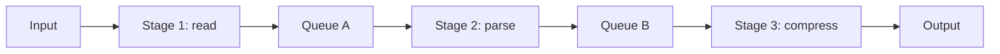
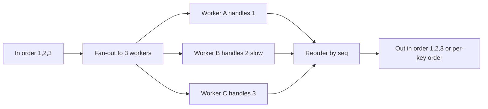
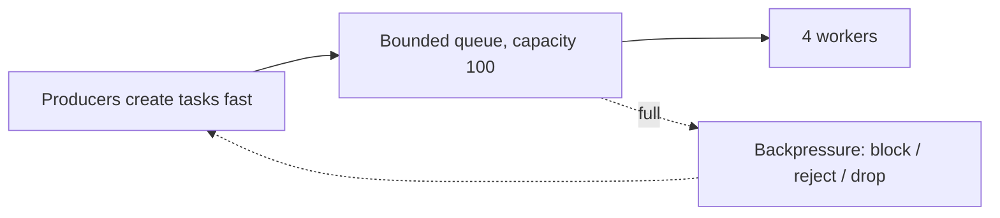
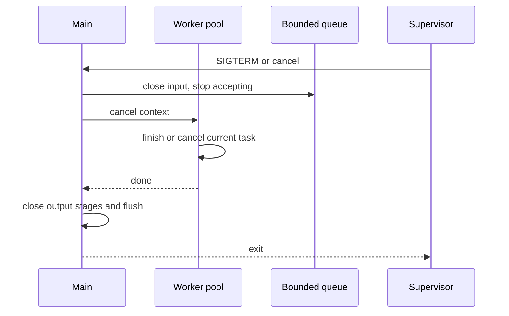
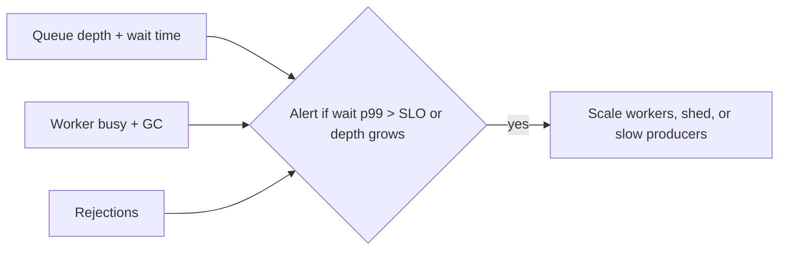

The last chapter compared processes, threads, and events as ways to run work at the same time. This chapter covers the structures that connect those workers. It also covers the rules that keep those structures from growing without limit. This is the last article in Stage 5.

A queue holds work that has arrived but is not yet being processed. A pipeline is a chain of stages. Each stage does one kind of work and passes the result to the next stage. How the program behaves when a queue is full decides whether the system stays stable. How it stops work that is no longer needed also matters.

A bounded queue has a fixed size. When it is full, the program must decide what to do with new work. It can block the producer. It can drop the work. Or it can reject it with an error the caller can see. That decision is backpressure. It tells the producer that the next stage cannot keep up.

Cancellation means the work should stop. It stops because the result is no longer needed, or because a deadline passed. A timeout sets a limit on how long to wait. Graceful shutdown lets work that is already running finish or cancel within a deadline, before the program frees its resources.

## Work queues

A work queue is where tasks wait before a worker takes them. It separates the producer that creates work from the consumer that does it. The producer does not need to know which worker will take the task. The consumer does not need to know which producer made it.

A queue has a few traits that change how the program behaves. First is order. A first-in first-out queue keeps arrival order. A priority queue reorders by importance. Second is where it lives. An in-memory queue is fast but loses tasks if the process exits. A durable queue keeps tasks after a crash. Third is ownership. One queue can be shared by many workers, or each worker can have its own queue that others can steal from.

In Go, an unbuffered channel is a queue with capacity zero. A send blocks until a receiver is ready. A buffered channel is a queue with a fixed capacity.

```go
tasks := make(chan string, 20)

go func() {
    for t := range tasks {
        fmt.Println(t)
    }
}()

tasks <- "hello"
tasks <- "world"
close(tasks)
```

This shows the boundary between arrival and processing. The sender can keep going after `tasks <- "hello"` as long as the channel is not full. The receiver loops until the channel is closed. Closing is the Go way to say no more tasks will come.

What matters for the system is not just the send. It is whether the channel can grow. A buffered channel that you keep making larger to avoid blocking just moves the problem into memory.

## Pipeline stages

A pipeline breaks work into stages. Each stage does one change and passes the result to the next stage through a queue. Reading a file, then parsing it, then compressing it can be three stages. Handling a request can be four stages: parse, authorize, run business logic, and encode the response.



The diagram shows the separation. Each stage can run at its own speed. Stage 1 may have one reader. Stage 2 may have four parsers. Stage 3 may have two compressors. Each queue between stages is a place where work waits. Each queue is also where you must decide on backpressure and cancellation.

A pipeline written with goroutines and channels makes the stages visible.

```go
package main

func stage1(in <-chan string, out chan<- string) {
    defer close(out)
    for s := range in {
        out <- "parsed:" + s
    }
}

func stage2(in <-chan string, out chan<- string) {
    defer close(out)
    for s := range in {
        out <- "compressed:" + s
    }
}

func main() {
    in := make(chan string, 10)
    mid := make(chan string, 10)
    out := make(chan string, 10)

    go stage1(in, mid)
    go stage2(mid, out)

    in <- "hello"
    close(in)
    for r := range out {
        _ = r
    }
}
```

The key lines are the `defer close(out)` in each stage. They say this stage will send no more after its input ends. The whole pipeline finishes when every stage has seen its input close and has closed its own output. If a stage fails to close, or fails to handle cancellation, the stage after it waits forever.

A pipeline can be linear like the example. It can have a fan-out, where one input goes to many workers. Or it can have a fan-in, where many producers feed one consumer. The same queue questions apply at each edge.

### Fan-out, fan-in, and ordering

A fan-out speeds up a stage by running many workers on the same queue. A fan-in merges many producers into one consumer that needs a single view. Both break the simple order of the linear example. If order still matters, the program must restore it.

A common pattern is to give each task a sequence number at the fan-out. Then the stage after the fan-in reorders by that number before it forwards. Another pattern is to shard by key. All tasks for the same key go to the same worker, so order per key is kept while different keys run in parallel. A pipeline that fans out without a plan for order and then claims to be ordered will reorder under load. This happens when one worker is slower than another.



This shows that concurrency and order are a choice. A fan-out without reordering is faster but not ordered. A reorder buffer adds latency and memory to restore order. The queue between stages is where that buffer lives.

## Bounded queues

A bounded queue has a fixed capacity. When it is full, a send must decide what to do. In Go with `select` and `default`, the program can try to send without blocking and handle the case where the queue is full.

```go
select {
case tasks <- task:
    // accepted
default:
    // full, decide
    fmt.Println("dropping", task)
}
```

People often call a queue unbounded when it has no limit. In a real program it is limited by memory. Making the buffered channel larger just lets the program hold more tasks before it fails. Each task uses memory. Each goroutine that will process it uses a stack and possibly a descriptor. So the cost grows with the number of pending tasks.

Think of a bounded queue as a counter of waiting work. The queue length tells you how many tasks have arrived but have not started. The number of workers tells you how many are running at once. If tasks arrive faster than workers can finish them for a long time, the queue stays full. Then the system must reject, drop, or block.

### How a bounded queue is built

Most bounded queues are a ring buffer. It has a head index, a tail index, and a fixed array. A send writes at the tail and moves it forward. A receive reads at the head and moves it forward. Both wrap around. The count is `(tail - head) mod capacity`. When the count equals capacity, the queue is full. When it equals zero, the queue is empty. A `sync.Cond` or a semaphore wakes a waiter when the count changes.

A Go buffered channel is a ring buffer with that logic built in, plus the close state. An unbounded queue is often a linked list that makes a new node per task. It seems to have no limit. But each node is a heap allocation the garbage collector must track. So throughput can fall as the queue grows, even before memory runs out.

### Little's Law and what the queue stores

A queue stores more than tasks. It stores time. Little's Law says that for a stable system, the average number of tasks in the system equals the arrival rate times the average time a task spends in the system.

```text
L = λ × W
L is tasks in queue + in service, λ is arrivals per second, W is time in system
```

Suppose tasks arrive at 100 per second. Suppose each waits an average of 2 seconds before a worker starts it. Then the system holds about 200 tasks on average. Doubling the queue capacity without adding workers does not change `W`. It only lets `L` grow. This is why tail latency grows with an unbounded queue even when throughput looks fine.

## Backpressure

Backpressure is the signal a stage sends upstream to say slow down. It is not one single mechanism. It is a policy the program picks when a queue is full.

The simplest policy is to block the producer. The call that submits work waits until there is space. The producer feels the slowness at once. It cannot create work faster than it is consumed. The cost is that the block spreads. The caller's caller now waits, and so on, until the whole chain slows.

Another policy is to reject or drop. The submitter gets an error like `busy`. It can retry later, drop lower-priority work, or tell its own caller. The downstream is protected. But the caller must handle rejection in a way that does not retry at once in a tight loop.

A third policy is to use a bounded queue with a single shared queue and a fixed pool. This is backpressure by design. When all workers are busy and the queue is full, the submitter blocks or is rejected. When the queue is large but not bounded, the system seems to accept everything. Meanwhile memory grows and latency becomes hard to predict.



The diagram shows the feedback. The queue is the sensor. The policy is the line that goes back to the producer. Without that line, the queue is just where tasks pile up until memory runs out.

The earlier article on resource ownership showed a bounded connection pool with the same tradeoff. A bounded queue protects the system. An unbounded queue hides overload until a limit elsewhere fails.

## Cancellation

Cancellation says that work which started should stop. It stops because the result will not be used, or because a higher-level operation was cancelled. The program must decide how that signal flows and where it is checked.

In Go, a `context.Context` usually carries cancellation. You create a context with a parent. You cancel it by calling a `cancel` function. Every operation that should be cancellable selects on its `Done` channel.

```go
package main

import (
    "context"
    "fmt"
    "time"
)

func worker(ctx context.Context, tasks <-chan string) {
    for {
        select {
        case <-ctx.Done():
            fmt.Println("worker: context cancelled", ctx.Err())
            return
        case t, ok := <-tasks:
            if !ok {
                return
            }
            // check context also while doing work
            select {
            case <-ctx.Done():
                return
            case <-time.After(10 * time.Millisecond):
                fmt.Println("handled", t)
            }
        }
    }
}

func main() {
    ctx, cancel := context.WithCancel(context.Background())
    tasks := make(chan string, 10)
    go worker(ctx, tasks)
    tasks <- "a"
    cancel()
    close(tasks)
}
```

The key lines are the two selects on `ctx.Done()`. One is at the top of the loop. There the worker decides whether to take the next task. The other is inside the handling. There the worker decides whether to keep going on the current task. Without the second check, a worker that is already doing work would keep doing it even though the caller gave up.

Cancellation should be cooperative. The signal is a request, not a forced kill. The worker picks safe points to check it. It releases any resources it holds and returns. A worker killed abruptly while holding a lock can leave shared state broken.

Structured concurrency, described in the previous article, adds a rule. A parent that started concurrent work waits for that work before it returns. Cancelling the parent cancels the children. In Go, an `errgroup.Group` with a context shows this.

```go
g, ctx := errgroup.WithContext(ctx)
g.Go(func() error { return do(ctx) })
if err := g.Wait(); err != nil {
    fmt.Println("group finished", err)
}
```

This shows ownership. `Wait` does not return until every goroutine started in the group has finished. Cancelling the context signals those goroutines at the points where they check `Done`.

## Timeouts

A timeout sets an upper bound on how long an operation may take before it is treated as failed. A timeout should ride on the same context that carries cancellation. Then the deadline is visible to every stage.

```go
ctx, cancel := context.WithTimeout(context.Background(), 30*time.Millisecond)
defer cancel()
select {
case <-doWork(ctx):
    fmt.Println("done")
case <-ctx.Done():
    fmt.Println("timed out", ctx.Err())
}
```

The key lines are the `WithTimeout` and the `defer cancel`. The context is done when the work finishes or when the deadline expires. The deferred `cancel` frees the timer. A common mistake is to make a timeout for a downstream call but not give it to the actual I/O. Then the outer timer fires while a lower layer keeps running without knowing it should stop.

Timeouts have two failure modes. A timeout that is too short fails work that could have succeeded with a little more time. A timeout that is too long holds a worker, a buffer, and possibly a file descriptor longer than the caller will wait. This reduces capacity for other work.

A pipeline may have a timeout on each stage and a timeout on the whole pipeline. It must decide how they fit together. The whole pipeline's deadline should bound the sum. It should not be added to each stage's deadline. Otherwise the total can be much longer than the caller expected.

### Composing timeouts without adding them

The correct way to compose timeouts is to derive each stage's context from the same parent deadline. The parent has a deadline like `now + 100ms`. Each stage does `context.WithTimeout(parent, 30ms)` only if it needs a tighter bound than the parent. Or it simply uses the parent directly. The remaining time is `deadline - now`, not a fresh 30 ms per stage.

```go
parent, cancel := context.WithTimeout(context.Background(), 100*time.Millisecond)
defer cancel()

// stage 1 gets 30ms but never beyond parent
s1ctx, s1cancel := context.WithTimeout(parent, 30*time.Millisecond)
defer s1cancel()
doStage1(s1ctx)

// stage 2 uses parent directly, so it sees the 100ms deadline minus time already spent
doStage2(parent)
```

This shows that `context.Deadline()` travels. If stage 1 took 80 ms, stage 2 sees only 20 ms left even though its own timeout says 30 ms, because the parent expires first. Adding a fresh timeout per stage without linking to the parent would let a three-stage pipeline take 90 ms when the caller asked for 100 ms total, while still reporting success per stage. The deferred `cancel` for each derived context is still needed to free the timer even when the parent fires first.

## Graceful shutdown

Graceful shutdown is the steps a program follows when told to stop. It stops accepting new work. It lets in-flight work finish or cancels it within a deadline. It frees resources, then exits. A parent that shuts down gracefully does not leave a task stuck in a queue that will never drain.

A small supervisor shows the steps.



The key lines in code are `close(in)` to say no more input, `cancel()` to signal running tasks, and a `Wait` that the main function does not skip. The close tells workers they will not get more tasks. The cancel tells workers that are already running that their result may not be needed. The wait ensures the main function does not return and free resources while a worker still touches them.

A simple way to see graceful shutdown without writing a supervisor is to run the tiny program under a timeout.

```bash
go run main.go &
pid=$!
sleep 0.1
kill -TERM $pid
wait $pid; echo "exit $?"
```

This shows whether the program handles the signal and exits with a status the parent can see. A program that ignores `SIGTERM` will be killed later with `SIGKILL`. A program that handles it can flush and exit cleanly.

A second exercise adds a cancellable pipeline where each stage respects the context.

```go
func stage(ctx context.Context, in <-chan string, out chan<- string) {
    defer close(out)
    for {
        select {
        case <-ctx.Done():
            return
        case s, ok := <-in:
            if !ok {
                return
            }
            select {
            case <-ctx.Done():
                return
            case out <- s:
            }
        }
    }
}
```

The double select is the key pattern. The outer select decides whether to take the next input. The inner select decides whether to send the result or stop because the context was cancelled while waiting to send. Without the inner select, a stage that blocks on `out <- s` when the downstream is full would ignore cancellation.

## Observing queues, pipelines, and cancellation

You can see queue behavior without special tools by exposing a few numbers. One is how many tasks are queued right now. One is how long a task waited before a worker started it. One is how many workers are busy. One is how often the program rejected or blocked because the queue was full. For cancellation, the useful numbers are how many tasks were cancelled before they started and how many were cancelled while running.

In Go you can expose those with the race detector and simple metrics around the channel operations. You can watch the scheduler with `GODEBUG=gctrace`.

A useful check for the tiny pipeline is to run it with the race detector and with varying queue sizes.

```bash
go run -race pipeline.go 2>&1 | head
go run pipeline.go -queue 1
go run pipeline.go -queue 100
```

This shows that the same logic behaves differently when the queue is tiny versus large. A tiny queue applies backpressure early. A large queue hides it until memory pressure appears.

### What to measure and alert on

A queue that is not measured is a queue that will surprise you. Four numbers decide whether a pipeline is healthy.

One is `queue_depth`, how many tasks sit in each inter-stage channel right now. One is `wait_duration`, how long a task waited before a worker took it. This is the `W` in Little's Law and the main cause of tail latency. One is `worker_busy`, how many workers are doing work versus idle. It tells you whether adding workers would help. One is `rejected_or_dropped`, how often submission failed because the first queue was full. This is the backpressure you chose.



A dashboard that shows all four lets you tell two cases apart. A slow downstream shows `wait_duration` growing while `worker_busy` is high. A too-fast producer shows `rejected` growing while `depth` stays at capacity. A pipeline that shows only `queue_depth` looks fine when a large queue hides growing `wait_duration` until the next limit fails.

## A realistic production example

A team ran a service. It read events from a file, parsed them, and wrote results to a downstream service through a three-stage pipeline. Each stage had a buffered channel the team sized to 10,000 to avoid blocking the producer. The program made a goroutine per event with no pool, because that seemed simpler than managing workers.

Under steady load the pipeline worked. During a backfill it read millions of lines fast. The first channel filled to 10,000. Then the first stage kept reading because the channel was unbounded in practice and the producer did not block. The second stage could not keep up because the downstream was slow, so the second channel also filled. Memory grew because each pending task kept a buffer. The garbage collector ran more often and used more CPU. Many tasks held a file descriptor to the downstream connection while they waited in the queue. So the process hit `too many open files` even though the downstream was the real bottleneck. When the operator sent `SIGTERM` to deploy a fix, the main function returned at once. It did not cancel the workers or close the input. The workers kept holding memory and descriptors after the parent had exited, and had to be killed.

The team fixed the pipeline in stages. They added a fixed worker pool for the middle stage. They added a bounded channel of 100. There the producer would block and then return `busy` to its caller instead of holding more tasks. They made the block visible with a metric for queue length and for how long a task waited before it started. They changed the goroutine-per-event pattern to the pool. Now the number of live goroutines stayed near the pool size plus a small queue. They passed a single `context.Context` through the whole pipeline. The main context was cancelled on `SIGTERM`. Each stage checked `ctx.Done()` both before taking the next input and while blocked on sending. They added a shutdown sequence. The main function closed the input channel, cancelled the context, and waited for workers with `Wait`. Only then did it close the output and flush. Under the next backfill the first stage blocked quickly. The producer slowed, memory stayed flat, and a `SIGTERM` drained or cancelled within the deadline instead of leaking.

## How engineers actually reason about pipelines

They start with the bound. How many tasks can wait, and how many can run at once. What happens to the next task when both are full. Then they ask where the signal flows. Does cancellation go from the caller through every stage to the work that is already running. Does the main function wait for that work before it returns.

They treat a queue as a place where time is stored. A task that waits in a queue adds to tail latency. A queue that grows without bound adds to memory without adding useful throughput. A pipeline that cannot reject when full is not a pipeline with backpressure. It is a buffer that overflows at the next limit.

They also keep timeouts and cancellation together. A timeout is a cancellation that happens because a deadline expired. The same `ctx.Done()` path should handle both. Then a stage does not need two different ways to stop.

## Queueing theory in one formula: utilization and the latency cliff

Little's Law says how much work is in the system. It does not say how the wait grows as the system fills. For a single-server queue where tasks arrive at rate `lambda` and are served at rate `mu`, utilization is `rho = lambda / mu`. As `rho` nears one, the average wait grows without bound, roughly `W = 1 / (mu - lambda)`. At half utilization the wait is modest. At ninety percent it is ten times larger. At ninety-nine percent it is a hundred times larger for the same arrival rate.

This is the latency cliff that every queue-based system hits. Adding a bigger queue does not change `rho`. It only lets more tasks wait. So the wait each task feels grows with the queue. The real levers are to reduce `lambda` with backpressure or rate limiting, to raise `mu` with more or faster workers, or to keep utilization below the knee where the curve explodes. A healthy pipeline measures `wait_duration` against utilization, not just `queue_depth`. The depth can look fine while the wait is already climbing.

## Head-of-line blocking and per-key sharding

A single first-in first-out queue between stages has a quiet failure mode. If one task takes much longer than the others, every task behind it waits. This happens even if another worker is free and could have handled those tasks. This is head-of-line blocking. It is why a single shared queue with one slow item can stall a whole stage's throughput even when workers are idle.

The common fix is to shard the queue by a key. All tasks for the same key go to the same worker. Different keys go to different workers. A slow task for key A then blocks only key A. Keys B and C keep moving. This is the same trick used to keep per-key order while still allowing parallelism, described earlier. A related pattern is to split fast and slow work into different lanes. Then a bulk export does not sit in front of interactive requests. The cost is more queues to manage. There is also the risk that one shard gets hot while others sit idle.

## Poison messages, dead-letter queues, and idempotency

Some tasks cannot be completed no matter how many times you retry them. The input is malformed, references a deleted entity, or always triggers a bug. If such a poison message stays in the queue, it is retried forever and blocks everything behind it. Or it is dropped and the failure is silent. The robust pattern is a dead-letter queue. After a task fails a bounded number of times, move it to a side queue for later inspection. Do not retry it in the main path.

Retries use the same cancellation and timeout machinery described above. They make idempotency a requirement, not a nice-to-have. If a timeout fires after the work was done but before the result was confirmed, the caller may retry and the work runs twice. So the handler must tolerate a duplicate. It checks a key or records that the operation already completed. Deduplication and idempotency keys let a pipeline retry safely under timeouts. They prevent double-charging, double-sending, or double-writing.

## Batching and rate limiting at the edge

Two more patterns change the shape of a queue-based system. Batching groups several tasks into one unit of work. Then the fixed cost of a call, a lock, or a network round trip is spread across many items. A stage that writes to a database per task may instead build a batch and issue one multi-row statement. This raises `mu` without adding workers. The tradeoff is added `wait_duration` while the batch fills, which a timeout should bound.

Rate limiting is preventive backpressure placed before the queue. A token bucket or leaky bucket at the entry rejects or delays requests when the arrival rate passes a chosen limit. Then the queue never fills from a spike it could not serve anyway. This moves the backpressure decision to the cheapest place, the request boundary. The system does not absorb a flood and then pay for it in memory and latency. Rate limiting and bounded queues work together. The queue absorbs short bursts the limiter admits. The limiter keeps a sustained overload from ever reaching the queue.

## Definitions

### A work queue

> A work queue holds tasks that have arrived but have not yet started. It separates the producer that creates work from the consumers that do it. Its order, capacity, and what happens when it is full decide how the system behaves under load.

### A pipeline

> A pipeline is a chain of stages. Each stage does one transformation and passes the result to the next stage through a queue. Each stage can run at its own speed. Each queue between stages is a place where backpressure and cancellation must be decided.

### A bounded queue

> A queue with a fixed capacity. A send must handle the case that the queue is full. It blocks, rejects, or drops rather than growing without bound. A queue that grows until memory runs out is bounded by memory, not by design.

### Backpressure

> The policy a program uses when a downstream queue is full to tell the upstream to slow down. It can block the producer, reject with an error the caller can handle, or drop lower-priority work. The choice decides whether overload is visible or hidden.

### Cancellation

> A signal that work which started should stop. It stops because the result will not be used or a deadline passed. In Go it is usually carried by a `context.Context` that each stage checks at safe points. Then the signal can flow from a parent to its children.

### A timeout

> An upper bound on how long an operation may take before it is treated as failed. It is usually carried as a deadline in the same context that carries cancellation. Then the operation and its stages share one signal.

### Graceful shutdown

> The steps where a program stops accepting new work. It cancels or lets in-flight work finish within a deadline. It waits for workers to return. Only then does it free resources and exit. No task is left stuck in a queue that will never drain.

## Beyond the definitions

### Why bound a queue

> A bounded queue makes overload visible as waiting or rejection, which the caller can handle. An unbounded queue accepts everything until memory or another limit is hit. There the failure is harder to connect to the queue.

### Blocking versus rejecting

> Blocking makes the producer wait and spreads the slowness to its caller. Rejecting returns an error at once so the caller can retry later, shed work, or tell its own caller. Blocking is not better by itself, because it can spread and stall the whole chain.

### How cancellation should flow

> A single parent context should be given to every stage. Each stage should check `ctx.Done()` both before taking the next input and while blocked on sending. The main function should wait for all stages after cancelling.

### Where to set timeouts

> As a deadline on the whole operation, shared through the context. Not as separate timeouts added per stage. Otherwise the sum can be much longer than the caller expected.

### Using close correctly

> Closing a channel that still has senders causes a panic. Not closing when the input is done leaves the downstream stage waiting forever. Each stage should close its output after its input ends or its context is cancelled, and no other owner should close it.

## Common misconceptions

**"A larger queue protects the system from overload."** It hides overload. A larger queue lets more tasks wait. That grows memory and latency without adding useful throughput when the downstream is the real bottleneck.

**"Backpressure is just a bigger queue."** Backpressure is the policy when the queue is full, like block, reject, or drop. A bigger queue without a policy only delays when that policy will be needed.

**"Cancellation should kill a thread immediately."** It should be cooperative. The worker checks the signal at a safe point, releases resources, and returns. Then it does not leave a lock held or a file descriptor half closed.

**"A timeout and cancellation are different."** A timeout is a cancellation that happens because a deadline expired. The same `Done` channel should handle both, so a stage has one way to stop.

**"Graceful shutdown just means handling `SIGTERM`."** Handling the signal is one part. Draining the input queues, cancelling in-flight work, waiting for workers, and flushing are what make it graceful. Without the wait, the signal alone still leaks.

## Summary

A queue is where waiting is stored. A pipeline is a chain of queues and stages. The capacity of those queues decides whether overload is visible or hidden. A bounded queue forces a choice when it is full. Backpressure is that choice, to block, reject, or drop. Cancellation tells work that its result is no longer needed. Timeouts bound how long to wait. Graceful shutdown is the sequence where the program stops accepting, cancels what is running, waits for that cancellation, and then exits.
