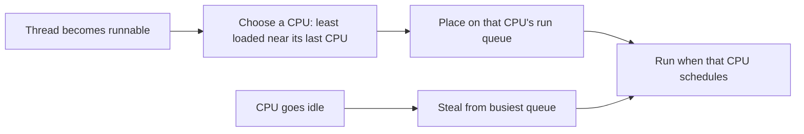
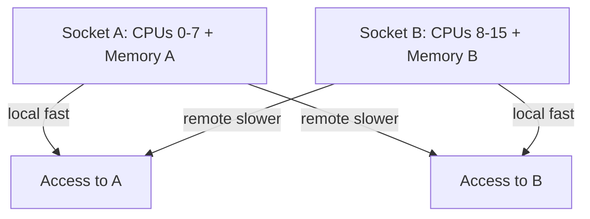
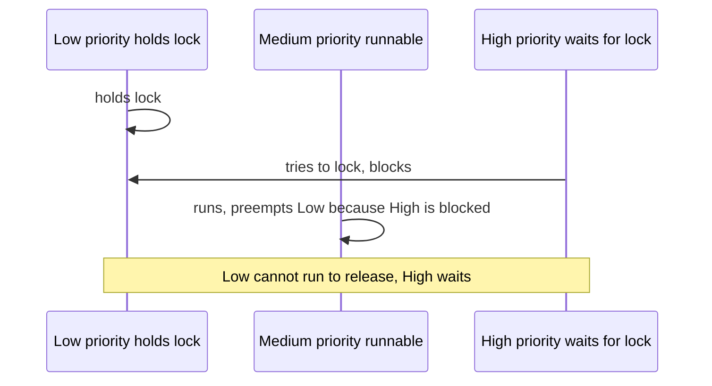

> Stage 5 — Processes, Threads, and Concurrency Models  
> Subject area 5.1 — Processes and Threads  
> Article 3

## The short version

Scheduling decides which thread runs on which CPU at each moment. Affinity says where a thread is allowed to run. NUMA describes which memory is close to which CPU. Together they decide whether a thread runs quickly on a nearby core with nearby memory or slowly while waiting for a distant core or distant memory.

Load balancing moves runnable threads between CPUs so no CPU is idle while work waits elsewhere. Pinning keeps a thread on a set of CPUs to keep its caches warm or to keep it near a device queue, at the cost of making balance harder. Priority inversion, starvation, and real-time deadlines are the failure modes that appear when priority and affinity are chosen poorly.

## Where this article fits

The previous article showed that a process holds an address space and that many threads can live inside it. This article follows those threads to the CPUs where they actually run.

It builds on the earlier scheduling overview, but it is more specific. There we asked what a context switch costs. Here we ask where that switch should happen and which memory the new thread will touch. The next article will compare larger concurrency models, like many processes versus many threads versus an event loop, and this article's numbers about affinity and NUMA are what let you compare them honestly. Later articles about allocators and page caches will show the same locality principle for memory.

## How the scheduler sees the machine

A modern machine has several cores, sometimes grouped into sockets, and each socket may have its own memory controller and a set of cores that are closer to that memory than to others. The kernel keeps a run queue of runnable threads for each scheduling domain, which often corresponds to a core or a cache domain.

When a thread becomes runnable, the scheduler chooses a CPU for it. When a CPU becomes idle, the scheduler may steal a runnable thread from another CPU's queue. The goal is to keep cores busy while keeping latency reasonable. The same mechanism also tries to keep a thread on the CPU where it last ran, because its code and data may still be in that CPU's caches.



The diagram shows the two directions. Placement on wakeup and stealing on idle both move work, but they move it at different times and for different reasons. If the machine is lightly loaded, the same thread may run on the same CPU repeatedly and keep its cache warmth. If the machine is heavily loaded, threads move more often.

### How CFS decides with vruntime

Linux's normal scheduler is called the Completely Fair Scheduler. Each runnable thread has a virtual runtime that grows as the thread runs, scaled by its nice value and weight. The scheduler keeps runnable threads in a red-black tree ordered by that virtual time and picks the thread with the smallest value, which is the thread that has had the least fair share so far. A thread with a lower nice value grows slower and is chosen more often, but the tree still ensures every runnable thread eventually gets a turn, which is how the scheduler avoids starvation without a fixed time slice table.

### Scheduling domains and cache awareness

The scheduler does not treat all CPUs as equal. It groups them into domains for a single hardware thread, a core with two threads, a set of cores sharing a cache, and a socket with its own memory. Balancing happens at each level with different costs. Moving a thread within a core's shared cache is cheap, moving it across sockets is more expensive because its cache warmth is lost and its next accesses may be remote. That is why the scheduler prefers the least loaded CPU that is still near the thread's previous cache, not just the absolute least loaded CPU in the machine.

## Affinity and pinning

Affinity is the set of CPUs a thread is allowed to run on. Pinning is the extreme case where that set is one CPU or a small group. By default, affinity is all CPUs, which lets the scheduler use the whole machine. Restricting it keeps a thread and its data close to a particular core, but it can also leave that core overloaded while others are free.

A common way to see affinity is with `taskset`.

```bash
ps -o pid,psr,comm -p 2450
taskset -pc 2450
taskset -pc 0-1 2450
```

The first line shows the process and which CPU its threads last ran on. The second line shows the current allowed mask as a bitmask. The third line changes the mask to only CPUs 0 and 1. The change stays until it is changed again or the process exits.

In Go you can keep a goroutine on a fixed kernel thread for a short section.

```go
package main

import (
    "runtime"
    "sync"
)

func pinnedWork(wg *sync.WaitGroup) {
    defer wg.Done()
    runtime.LockOSThread()
    defer runtime.UnlockOSThread()
    // work that benefits from staying on this thread, like touching a per-CPU structure
    for i := 0; i < 1000000; i++ {
    }
}
```

`LockOSThread` says the current goroutine should stay on its current kernel thread, and the thread stays where the scheduler placed it, subject to the process's affinity. A matching `UnlockOSThread` lets the goroutine move again. The pattern is useful around code that uses thread-local storage or a device queue that is per CPU.

Pinning helps when you know that a thread and a device queue share a cache domain, or when you want to keep a latency-sensitive thread away from noisy neighbors. It hurts when the pinned CPU becomes the bottleneck while other CPUs could have taken the work, or when a pinned thread touches memory that is far away on a NUMA machine.

A Level 1 read that makes affinity concrete without writing any pinning is to watch where a busy program runs.

```bash
go run cpu_busy.go &
pid=$!
mpstat -P ALL 1 2 | head -n 20
ps -o pid,tid,psr,comm -p $pid -L | head
taskset -pc $pid
```

What it demonstrates is that the same process appears on different CPUs over time when affinity is wide, and stays where you put it when affinity is narrow. The cost of narrow affinity shows up as higher run queue latency on the chosen CPU.

A Level 2 exercise forces the tradeoff. Run two CPU-bound workers, first with wide affinity and then with both pinned to the same CPU, and compare elapsed time and context switches.

```bash
go run two_workers.go
taskset -c 0 go run two_workers.go
perf stat -e context-switches,cpu-migrations ./two_workers 2>&1 | head
```

You will typically see that pinning both workers to one CPU makes them take turns on the same core while the other cores are idle, so elapsed time grows even though the work is the same.

## NUMA locality

NUMA means that the time to access memory depends on which CPU touches which memory. A machine with two sockets has two memory controllers. Memory attached to the socket where a thread runs is local. Memory attached to the other socket is remote and must cross an interconnect.

Local access is faster and has more bandwidth. Remote access adds latency, often a few tens of nanoseconds more, and it shares the interconnect with other remote traffic. The effect is not a sharp failure. A program still runs, but a workload that touches a lot of memory can be noticeably slower when its memory is on the wrong socket.



The diagram says most of what matters for placement. Threads and the data they touch most often should be on the same socket when possible. An allocator that is NUMA aware allocates from local memory, and a scheduler that is NUMA aware tries to wake a thread on a CPU near its previous memory.

You can see the topology with `numactl` and `lscpu`.

```bash
numactl --hardware
lscpu | grep NUMA
numactl --cpunodebind=0 --membind=0 go run mem_touch.go
numactl --cpunodebind=0 --membind=1 go run mem_touch.go
```

What it demonstrates is that the same access pattern with the same CPU can have different times when the memory is bound to the local node versus the remote node. The difference is not always large for one access, but it adds up when the workload touches gigabytes. The earlier cache locality article showed how a core likes data that is already close in caches. NUMA adds that some memory is closer in the first place.

A Level 2 exercise measures whether a real program is sensitive. Run the tiny program's larger variant that touches a few hundred megabytes, bind it both ways, and compare `perf stat` for `cycles` and `cache-misses` and wall time. A workload that is limited by memory bandwidth shows a clearer NUMA effect than one that fits in cache.

### First-touch, interleaving, and pinning memory

On Linux, the node where anonymous memory is allocated is often decided by first touch, which means the CPU that first writes the page determines which node's memory backs it. If the main thread allocates and first touches a large buffer on node 0 and then workers on node 1 use it, the buffer stays on node 0 even though the workers run on node 1. Allocating in the worker that will use the memory, or using `mbind` with `MPOL_BIND` or `MPOL_INTERLEAVE` to spread pages, changes the placement.

```bash
numactl --membind=0 ./tiny  # all pages on node 0
numactl --interleave=all ./tiny  # spread pages round-robin
numactl --membind=1 --cpunodebind=0 ./tiny  # CPU 0 with remote memory
cat /proc/<pid>/numa_maps | head
```

What it demonstrates is that affinity and memory policy are two different knobs. `cpunodebind` says where the thread runs, `membind` says where its pages come from, and `numa_maps` shows per-mapping counters for `N0` versus `N1`. Huge pages, often 2 MiB, make translation cheaper but make placement coarser, so a huge page that straddles a boundary can keep remote pages longer.

## Load balancing

Load balancing is the kernel's way to keep the machine even. When a new thread becomes runnable, the scheduler prefers a CPU that is least loaded but still near the thread's previous cache. When a CPU goes idle, it looks for a busy queue to steal from.

Balancing is not free. Moving a thread means its cache warmth is lost and its next accesses will miss. Moving a thread that just touched a large buffer can be worse than leaving it where its data is, even if another CPU is a little less loaded. The scheduler therefore balances with thresholds and with awareness of cache domains.

A more application-level balance happens in a worker pool. When tasks are small and arrive quickly, a single shared queue lets any idle worker take the next task, which balances naturally. When tasks are long or need locality, a per-CPU or per-socket queue with stealing can keep data close while still moving work when a queue is empty. Go's own scheduler uses a similar idea for goroutines, with per-processor queues and stealing.

## Priority inversion

Priority inversion happens when a lower-priority thread holds a resource that a higher-priority thread needs, and a medium-priority thread prevents the lower-priority thread from running and releasing it.



The high-priority thread is ready but cannot make progress because the low-priority holder cannot run. The medium thread, which does not even need the lock, keeps the low thread from being scheduled. The fix is to temporarily raise the holder's priority while it holds the lock, which is called priority inheritance, or to use a lock that is aware of priority, or to avoid the shared lock entirely by moving the data to a channel or a per-CPU structure.

A simple way to see inversion without writing a priority scheduler is to run a Go program that mimics it with a mutex and three workers that log when they hold the lock.

```go
package main

import (
    "fmt"
    "sync"
    "time"
)

func main() {
    var mu sync.Mutex
    var wg sync.WaitGroup
    wg.Add(3)
    go func() { // low holds lock
        defer wg.Done()
        mu.Lock()
        fmt.Println("low holds")
        time.Sleep(200 * time.Millisecond)
        mu.Unlock()
        fmt.Println("low released")
    }()
    time.Sleep(10 * time.Millisecond)
    go func() { // medium keeps CPU
        defer wg.Done()
        for i := 0; i < 5; i++ {
            fmt.Println("medium running")
            time.Sleep(30 * time.Millisecond)
        }
    }()
    go func() { // high waits for lock
        defer wg.Done()
        time.Sleep(20 * time.Millisecond)
        fmt.Println("high waits")
        mu.Lock()
        fmt.Println("high got lock")
        mu.Unlock()
    }()
    wg.Wait()
}
```

What it demonstrates is not a true kernel priority inversion, because Go's scheduler is not a strict priority scheduler, but it shows the ordering problem. The high waiter cannot proceed until the low holder runs, and any other runnable work that keeps the low holder from being scheduled makes the wait longer. In a real kernel with strict priorities, the same pattern would make a deadline miss.

## Starvation

Starvation is what happens when a thread that is runnable keeps not being chosen because other threads with higher priority or better balance always win. Fairness in the kernel's complete fair scheduler tries to avoid this by tracking virtual runtime and by periodically considering all runnable threads, but a thread that is given a very low priority or that shares a heavily loaded control group can still see long delays.

Starvation does not always look like a crash. It can look like high tail latency for one tenant while others are fine, or like a background job that never finishes when the machine is busy. The symptom is that `runnable` time grows while `running` time does not, which you can infer from run queue length and from lock wait time that is actually scheduling wait in disguise.

## Real-time scheduling

Real-time work has a deadline that is part of correctness, not just performance. A hard real-time system must meet its deadline under its stated conditions, while a soft real-time system tries to meet it but can miss occasionally and recover.

Linux has real-time classes that give stronger priority than the normal fair class. A thread in a real-time class can preempt normal threads and can run until it blocks. That guarantee is useful for work like audio or control loops that must run at a precise time, but it is dangerous when used without care. A real-time thread that loops without blocking can starve not only other applications but also kernel threads that the system needs.

Real-time behavior also depends on more than the scheduling class. Interrupt handling, page faults, allocations that fault, and locks shared with normal threads all affect whether a deadline is met. Choosing a real-time policy without also pinning the thread, locking its memory so it does not fault, and avoiding blocking on a lock held by a normal thread is incomplete. Tools like `chrt` set the class and priority from the command line, but they do not create a full real-time system by themselves.

```bash
chrt -f 10 ./rt_task
chrt -r 20 ./rt_task
```

What it demonstrates is that the same binary can be started in the normal fair class or in a real-time FIFO or round-robin class with a priority. The real-time instance will preempt the fair instance, which is helpful for the deadline and harmful if the real-time thread is buggy.

### Priority inheritance with futexes

A `pthread_mutex` that is created with `PTHREAD_PRIO_INHERIT` uses the kernel's PI futex. When a higher-priority waiter blocks on the futex, the kernel temporarily raises the holder's priority to that of the waiter until it releases. Without that flag, the holder stays at its normal priority and can be preempted by medium-priority work, which recreates the inversion. A Go `sync.Mutex` does not have kernel priority inheritance, which is why the earlier fix replaced the shared lock with a single owner goroutine and a channel. The kernel primitive exists, but the language runtime may not use it.

### SCHED_DEADLINE and bandwidth

For stricter deadlines, Linux has `SCHED_DEADLINE`, which is not a fixed priority but a reservation. Each task declares a runtime, a period, and a deadline, and the kernel's `SCHED_DEADLINE` scheduler uses Earliest Deadline First and Constant Bandwidth Server to guarantee that the task gets its runtime every period as long as total reservations fit. A task that exceeds its runtime is throttled until the next period, which contains a real-time loop that would otherwise starve the machine. The tradeoff is that admission control can refuse a new deadline task when the system is already fully reserved, where `SCHED_FIFO` would have let it start and then missed deadlines.

```bash
chrt -d --sched-runtime 5000000 --sched-period 20000000 --sched-deadline 20000000 ./periodic_task
```

What it demonstrates is that the task says it needs 5 ms every 20 ms before its deadline, and the kernel decides whether that fits with existing reservations.

## How to look at affinity and NUMA

You can see where threads run, what affinity they have, and which NUMA node their memory is on.

```bash
numactl --hardware
taskset -pc 2450
ps -o pid,tid,psr,comm -L -p 2450
numactl --show
perf stat -e cycles,cache-misses,cpu-migrations ./tiny 2>&1 | head
```

What it demonstrates is the boundary between the kernel's view and the application's design. `numactl --hardware` shows which CPUs belong to which node and which memory is local. `taskset` shows the allowed mask. `psr` shows where each thread last ran. `perf` shows whether pinning reduced migrations and whether it hurt or helped.

A more complete check adds memory binding.

```bash
numactl --cpunodebind=0 --membind=0 ./tiny
numactl --cpunodebind=0 --membind=1 ./tiny
```

The first run keeps memory near the CPU, the second forces remote memory and will usually be slower for a memory-heavy workload.

## A realistic production example

A team ran a Go service that handled events with a pool of workers. Each worker kept a per-worker buffer of a few megabytes that it reused to avoid allocation. The service ran on a two-socket machine. At first the pool was created with no affinity and no NUMA awareness, and the buffer for each worker was allocated on the node where the worker first ran.

Under light load the service was fast, because a worker usually ran on the same socket where its buffer lived. Under heavier load the scheduler began to steal workers across sockets to balance. A worker that had built a buffer on node 0 was woken on node 1, and its next batch of events touched that buffer as remote memory. Cache misses rose and `perf` showed more cycles per request. At the same time the workers all updated a shared counter protected by a single mutex, and one low-priority background job that held that mutex was preempted by medium-priority workers, which made the high-priority request path wait longer than expected.

The team first tried to fix it by pinning all workers to the same socket. Tail latency for the pinned workers improved, but throughput fell because the second socket was idle and latency for traffic that arrived when the pinned socket was busy got worse. They instead made two changes. They partitioned the pool by socket, so a request was handed to a worker on the same socket where its buffer lived, and they replaced the shared counter with per-worker counters that were merged infrequently. For the mutex, they removed the shared state entirely and moved it to a single goroutine that owned the data and received updates through a channel, which removed the priority inversion without needing a special lock.

After the changes `numactl --hardware` still showed two nodes, but workers stayed near their memory, coherence traffic fell, and the run queue on each socket stayed short. The machine did the same work with fewer cycles and more predictable latency, not because they added cores, but because they kept work near the memory it touches and removed the single lock that made priority matter.

## How experienced engineers think about scheduling, affinity, and NUMA

They start with whether the machine is balanced and where memory lives. Is one socket much busier than the other, is one run queue longer, are many threads migrating, and is the workload's working set near the CPUs that run it.

Then they decide whether the fix is to let the scheduler do more or less. Allowing wide affinity and relying on the scheduler's cache-aware placement is right when the workload has little per-thread state. Narrowing affinity or partitioning per socket is right when each worker reuses a large buffer or a per-CPU structure and the cost of moving is larger than the benefit of perfect balance.

For priority they ask whether the shared resource can be removed. A lock that must be held across a priority boundary is a design risk. If it must stay, they use priority inheritance where available or make the holder very short, so inversion cannot last long. For real-time they check the whole path, not just the scheduling class, including page faults, interrupts, and locks.

## Interview definitions

### What is CPU affinity?

> CPU affinity is the set of CPUs a thread is allowed to run on. Pinning is the case where that set is one CPU or a small group, which keeps the thread's caches warm but can make load balance harder.

### What is NUMA?

> Non-uniform memory access, where the time and bandwidth to access memory depend on which CPU touches which memory. Memory attached to the same socket as the CPU is local and faster, while memory on another socket is remote and slower.

### What is load balancing?

> The kernel's work to keep CPUs busy and run queues short, by placing a new runnable thread on a least-loaded CPU and by letting idle CPUs steal work from busy ones.

### What is priority inversion?

> The condition where a lower-priority thread holds a lock that a higher-priority thread waits for, and a medium-priority thread keeps the lower-priority holder from running, so the high-priority thread waits longer than it should.

### What is starvation?

> The condition where a runnable thread keeps not being chosen because other threads with higher priority or better placement always win, so it makes little progress even though it is ready.

### What is real-time scheduling?

> Scheduling that tries to meet deadlines, where a real-time class can preempt normal work and run until it blocks. It helps deadline work but can starve the system if the real-time thread loops or holds a lock needed by others.

## Interview follow-up questions

### When would you pin a thread?

> When you want to keep it near its data or near a per-CPU device queue and you have measured that the cache warmth or locality gain outweighs the loss of balance.

### How do you see NUMA effects?

> Run the same memory-heavy workload with `numactl --membind` on the local node versus the remote node and compare time and cache misses, or look at `numactl --hardware` and `perf` for the node where the memory was allocated.

### How do you fix priority inversion without raising priority?

> Remove the shared lock by moving the data to one owner that receives updates through a channel, or make the critical section very short so the inversion cannot last long.

### Why can pinning hurt?

> The chosen CPU can become overloaded while other CPUs are idle, and on NUMA the pinned thread may touch remote memory, so balance and locality get worse even though placement looks more controlled.

### What is the difference between fairness and throughput for the scheduler?

> Fairness gives each runnable thread a reasonable turn, while throughput finishes the most work per second. The scheduler trades the two, and giving one thread more time can increase throughput for that thread while hurting tail latency for others.

## Common misconceptions

### “Pinning always makes things faster.”

It keeps caches warm, but it can make balance worse and force remote memory accesses, so it can be slower when the pinned CPU is busy.

### “NUMA is just about memory size.”

Size matters, but NUMA is about which memory is near which CPU. A program can have enough memory and still be slow because it touches the far node.

### “Priority inversion is just low priority being slow.”

It is a specific case where a low-priority holder blocks a high-priority waiter while a medium-priority thread keeps the holder from running. The medium thread is what makes it inversion.

### “Real-time priority makes a program real-time.”

The scheduling class is one part. Page faults, interrupts, and locks shared with normal threads also affect whether a deadline is met.

### “Load balancing always helps.”

Moving a thread helps balance, but it also makes the new CPU miss in its caches. Balance helps when a CPU is idle, but not when the cost of moving exceeds the wait it avoids.

## Summary

Scheduling chooses which runnable thread runs on which CPU, affinity restricts where a thread may run, and NUMA says which memory is near which CPU. Load balancing moves work to keep the machine even, pinning keeps work near its data, and the two can conflict. Priority inversion, starvation, and real-time deadlines are the failure modes that appear when priority and placement are chosen poorly. The right choice is not a fixed rule about pinning or priority. It is where the working set lives, how long a thread holds a shared resource, and whether moving work helps balance more than it hurts locality.

## If you want to build this later

Write a program that can start a fixed number of workers that each touch a few megabytes of private buffer and also update a shared counter. First run it with no affinity and record time, `perf` cache misses, and migrations. Then pin the workers to one socket with `taskset` and repeat. Then partition the workers per socket with separate buffers and compare again. Add a mode that binds memory with `numactl --membind` to the local versus remote node. The goal is to see when keeping work near its memory helps, when pinning hurts balance, and how removing a single shared lock changes the picture more than any affinity.
