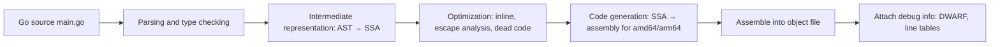

Stage 3 ended with the question of how source code becomes an executable in the first place. This chapter begins that answer. Stage 4 follows the path from source text to a running process, and this is its first article.

Source code is text a compiler turns into machine instructions, tables, and metadata that together become a runnable program. That transformation is not one step. The compiler reads the text, checks what it means, builds an intermediate representation of the program, improves that representation, generates assembly for the target processor, assembles it into an object file, and records information to help debugging.

That pipeline decides what instructions the CPU will actually execute and what information a debugger can show you. Optimization levels choose different tradeoffs. More optimization can remove allocations, inline function calls, and keep values in registers, which makes the binary faster but harder to debug and sometimes changes which undefined behavior matters. Debug information records how to map the optimized instructions back to the source lines you wrote.

## The small program we will follow

To keep the series connected, we will use one small Go program through all of Stage 4. It reads a file whose path is in an environment variable and prints its contents. It touches compilation, assembly, symbols, linking, and startup, and it is small enough to inspect with local tools.

```go
package main

import (
    "fmt"
    "os"
)

func main() {
    path := os.Getenv("TINY_FILE")
    if path == "" {
        path = "message.txt"
    }
    data, err := os.ReadFile(path)
    if err != nil {
        fmt.Fprintf(os.Stderr, "read %s: %v\n", path, err)
        os.Exit(1)
    }
    fmt.Print(string(data))
}
```

The program looks ordinary, but the toolchain will decide how the `if` becomes branches, whether `path` lives in a register, what sections the string `"read %s: %v\n"` goes in, and what debug records map the `Exit(1)` back to this line.

## The stages as the compiler sees them

Different compilers name the stages differently, but the flow is similar. Source text is preprocessed or parsed, turned into an intermediate representation that is easier to analyze, improved, and then lowered to machine code.



The diagram is a simplification, but it helps you ask the right question when something surprises you. If a variable disappears in a debugger, you are probably looking at the effect of optimization or debug information, not at a bug in the logic.

Go's toolchain makes the stages visible. `go build -x` shows the commands it runs, `go tool compile -S` shows the assembly it generated, and `go build -gcflags="-m"` explains inlining and whether a value escapes to the heap.

## Parsing and type checking

The first step reads the text as tokens, builds a tree that shows the structure of the program, and checks that the structure makes sense. The tree is often called an abstract syntax tree. It records that `os.Getenv` is a call with one argument and that `if path == ""` is a condition.

Type checking then asks whether those operations are allowed. Is `path` a string, does `os.ReadFile` exist for the target operating system, and does the call have the right number of arguments. If not, the compiler stops before any machine code is made.

This stage is the place where most everyday errors are caught, and it is also where the compiler builds the information that later stages will use to decide what code is correct to keep or remove.

## An intermediate representation

After parsing, the compiler lowers the tree into a form that is easier to improve. Go uses Static Single Assignment, where each variable is assigned once and each use is explicit. Other compilers use their own forms, like LLVM IR, but the purpose is the same. The representation makes control flow, data flow, and dependencies visible, so the compiler can reason about the program without getting distracted by syntax.

A representation also lets the compiler work at a level above one processor. An optimization that removes an unused result or moves a loop invariant does not need to know every detail of `x86-64` or `ARM64` yet.

## Optimization and what it changes

Optimization improves the representation before it becomes machine code. Common improvements are inlining, which replaces a call with the body of the function, escape analysis, which decides whether a value can stay on the stack or must go on the heap, dead code elimination, and register allocation.

A small example helps. The call `os.Getenv("TINY_FILE")` is a function call with allocation implications. The compiler may inline the check `if path == ""` or keep `path` in a register instead of the stack. These decisions change which instructions you will see in `objdump`, which variables a debugger can show, and sometimes which panics or races are visible.

Optimization levels choose the tradeoff. With `go build -gcflags="all=-l -B"` you disable inlining and optimization, which keeps the binary closer to the source and easier to step through. With the normal `go build -o tiny` you allow inlining and the usual optimizations, which makes the binary smaller and faster but can make a single source line correspond to no single instruction, or to instructions that have been reordered.

The effect on debugging is direct. Debug information tries to map the optimized code back to source lines, but an inlined function may not have its own frame, and a value that lives in a register may be reported as optimized away.

## Code generation, assembly, and object files

Code generation turns the improved representation into assembly for the target. Assembly is the textual form of machine instructions, like `MOVQ AX, BX` or `CALL runtime.mallocgc`. That text is then assembled into an object file, which is a binary container with sections, symbols, and relocations. An object file is not yet runnable, because it may refer to symbols like `os.ReadFile` that live in other files or in the runtime.

A Go build produces one package at a time and writes an object-like file in its build cache, then the linker combines them. You can see the assembly for the current package without linking the whole program.

```bash
go tool compile -S -o /tmp/main.o main.go | head -n 40
```

The output shows Go assembly, which is higher level than `x86-64` but already close to it. An instruction like `MOVQ $0, AX` moves a value into a register, and a `CALL` lowers a Go function call to a jump. The same program built for `GOARCH=arm64` would show `MOV` and `BL` with different registers, because code generation targets the processor you asked for.

## Debug information

Debug information is extra data the compiler can emit to help a debugger map the binary back to source. On Go and C binaries on Linux this is often DWARF. It includes line tables that say which address came from which line, and information about types, variables, and where they live at each point.

Building with `go build -o tiny` already includes debug information. Building with `go build -ldflags="-s -w" -o tiny.stripped` asks the linker to strip symbol tables and DWARF with `-s` and `-w`. The stripped binary is smaller, but `gdb` and `go tool addr2line` have less to work with, and a profile has fewer names.

Debug information does not affect the instructions that fix correctness. It does affect whether you can see a variable that was optimized away or whether a sample in a profile can be mapped to a line.

## Undefined behavior and the optimizer

The compiler is allowed to assume the program is valid according to the language rules. Code that breaks those rules is said to have undefined behavior. When it does, the compiler may make assumptions that make the result surprising after optimization.

In C, signed integer overflow, using memory after it was freed, or reading an uninitialized value are classic examples. The optimizer may assume such a program never does those things and remove a check that seemed necessary.

In Go, the language makes fewer things undefined, but some still are. A data race on ordinary memory is undefined in the sense that the program has no defined meaning, and the race detector `go build -race` exists to find it. Calling assembly that breaks the calling convention, or relying on the exact layout of a map, also has no guaranteed meaning. The debugger may warn about `optimized away`, and `go vet` and `staticcheck` catch some of these cases before you run.

The practical habit is to fix the rule violation, not to argue that the optimizer is wrong. If a program is correct at `-O0` but fails at `-O2`, the first question is whether the source broke a language rule that the optimizer assumed would not happen.

## Seeing the pipeline with Go

The following sequence is a basic read that you can run without any setup beyond a Go toolchain on Linux. It makes the pipeline concrete for the tiny program.

```bash
go version
go build -x -o tiny main.go 2>&1 | head -n 20
ls -lh tiny && file tiny
go tool compile -S -o /tmp/main.o main.go | head -n 30
```

What it demonstrates is the boundary between source and binary. The first command shows the toolchain invoking `compile` and `link`. The second shows the size and type of the executable. The third shows the assembly before it is linked.

You should see that `go tool compile -S` prints Go assembly with labels like `TEXT main.main(SB), $40-0`. The important line is `TEXT`, which says this is a function body with a stack frame size, and the `$` value, which is how much stack space the function reserves. On `amd64` you will see `AX`, `BX`, `CX` registers, on `arm64` you will see `R0`, `R1`.

A second exercise compares optimization and debug information.

```bash
go build -gcflags="all=-l -B" -o tiny.noopt main.go
go build -o tiny.opt main.go
ls -lh tiny.noopt tiny.opt

go build -o tiny.withdbg main.go
go build -ldflags="-s -w" -o tiny.stripped main.go
ls -lh tiny.withdbg tiny.stripped
size tiny.withdbg tiny.stripped
```

You will typically see that the optimized binary is smaller and that the stripped binary loses the symbol and DWARF sections. The difference is not just cosmetic. A debugger will show fewer variables in the stripped case, and a profiler will show raw addresses instead of Go function names. In a production service you often want one binary with debug information for profiling and a stripped one for distribution, or you keep the debug info separately.

The same program built for another architecture shows why intermediate representation matters.

```bash
GOARCH=arm64 go tool compile -S -o /tmp/main_arm64.o main.go | head -n 30
```

The structure of the function is the same, but the registers and instructions differ. The compiler chose the same optimizations on a different target, which is exactly the separation the pipeline is meant to provide.

## A realistic production example

A team had a small Go tool that built correctly locally but failed in CI with a different Go version. The tool also crashed only when built with `-ldflags="-s"` in production. Locally, developers used `go run` which builds with the local toolchain and leaves symbols, so the profile they collected had clear names and the crash report had line numbers. In CI, the builder used a newer Go where a small inlining change moved an allocation, and the stripped production binary had no line tables, so the stack trace was just addresses.

The team first assumed the CI machine was at fault. The actual causes were in the pipeline. One was that the code relied on the exact timing of a goroutine without synchronization, which is a race. The race only showed as a failure after an inlining decision changed. The other was that the production artifact was the stripped binary, so the crash reporter could not map it. They fixed the race by adding the missing synchronization instead of adding `//go:noinline` everywhere, built a `-race` binary for tests, kept one unstripped binary with `go build -o tiny.dbgsym` for diagnostics, and shipped the stripped one. The pipeline did not hide a bug. It showed where the real bug was.

## How engineers actually use the pipeline

They start by asking which stage would explain what they see. If a variable is missing in `gdb`, they ask whether debug information was stripped or the value was optimized away. If two binaries behave differently but the source is the same, they compare `go version`, `GOARCH`, `GOOS`, and the flags in `go build -x`. If an inlined function appears to have no frame, they look at `go tool compile -S` or `objdump` rather than assuming the source is wrong.

A useful check for the tiny program is to ask whether the binary contains the file name you wrote. `strings tiny | grep main.go` will show it when debug info is present, and `readelf --debug-dump=info` will show the DWARF entries. When those are stripped, the binary is still correct, but it is harder to observe.

## Definitions

### The compilation pipeline

> The sequence where a compiler turns source text into an executable, through parsing and type checking, an intermediate representation, optimization, code generation to assembly, assembly into object files, and linking, with optional debug information to map the result back to source.

### An object file

> A binary file produced for one package that holds machine code in sections, a table of symbols defined or needed, and relocations that say where addresses must be fixed later. It is not runnable until it is linked.

### An intermediate representation

> A form of the program that is easier for the compiler to analyze and improve than source text, like Go SSA. The compiler optimizes there and only then lowers it to a specific processor's instructions.

### Debug information

> Extra data, often DWARF, that records which address came from which source line and where each variable lives, so a debugger or profiler can show you the program in terms you wrote, even after optimization.

### Undefined behavior

> Code that breaks the language's rules so the standard gives it no meaning, which lets the optimizer assume it never happens. The fix is to make the program valid, not to expect the optimizer to preserve the buggy behavior.

## Beyond the definitions

### Why the same source gives different assembly

> The intermediate representation is optimized differently before code generation. Inlining, register allocation, and other passes change which instructions are kept and where values live. Debug information then records the new mapping, which is why a variable can appear optimized away.

### Why a stripped binary still runs

> Stripping removes the symbol table and DWARF that a debugger uses to translate addresses to names and lines. The instructions are still there, so the program runs, but tools have less to show you.

### How the pipeline exposes a hidden race

> Different toolchain versions or flags can inline or reorder differently, changing timing. The race existed before, but the new code generation makes it visible. The fix is the missing synchronization, not pinning the old compiler version.

## Common misconceptions

**"Optimization is just making the same instructions faster."** It can remove instructions, inline calls, move allocations from heap to stack, and keep values in registers. The same source line may correspond to many instructions, no instruction, or a value that lives in a register instead of memory.

**"If the program works at `-O0`, it is correct."** The optimizer is allowed to assume the program follows the language rules. A bug like a data race can hide at low optimization and appear at higher optimization, not because the optimizer is wrong but because the program was already invalid.

**"The compiler output is stable across machines."** Toolchain version, `GOARCH`, `GOOS`, `CGO_ENABLED`, and flags in `go build -x` all affect which instructions are generated. You need to record the build that produced the binary you are debugging.

**"A binary is just its sections."** An object file and an executable also carry symbols, relocations, and debug information that are not code, but they decide whether a reference can be resolved and whether a debugger can map an address to a line.

## Summary

Source text becomes a running program through several stages. Parsing and type checking ensure the program is valid, an intermediate representation makes it easy to improve, optimization chooses tradeoffs between speed and observability, code generation lowers it to the target processor, assembly turns it into object files with sections and symbols, and debug information records how to map the result back to source. The same program can look very different after those stages, which is why you record the toolchain version and flags that built the binary you are debugging.
