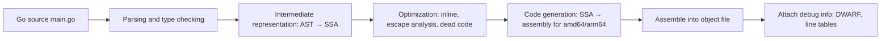

Stage 3 asked how source code becomes an executable. This chapter starts the answer. Stage 4 follows the path from source text to a running program. This article is the first in that stage.

Source code is text. The compiler turns it into machine instructions, tables, and metadata. Together, these become a runnable program. The change is not one step. The compiler reads the text and checks what it means. It builds an intermediate representation of the program, which is a simpler form the compiler can work on. The compiler improves that form, makes assembly for the target processor, assembles it into an object file, and records debug information.

The pipeline decides which instructions the CPU runs. It also decides what a debugger can show you. Optimization levels make different tradeoffs. More optimization can remove allocations, inline function calls, and keep values in registers. The result is a faster binary that is harder to debug. It can also change how undefined behavior shows up. Undefined behavior means code that breaks the language rules, so the result is not defined. Debug information records how to map the optimized instructions back to the source lines you wrote.

## The small program we will follow

We use one small Go program through all of Stage 4 so the series stays connected. The program reads a file. The file path comes from an environment variable. The program prints the file contents. It covers compilation, assembly, symbols, linking, and startup. It is small enough to inspect with local tools.

```go
package main

import (
    "fmt"
    "os"
)

func main() {
    path := os.Getenv("TINY_FILE")
    if path == "" {
        path = "message.txt"
    }
    data, err := os.ReadFile(path)
    if err != nil {
        fmt.Fprintf(os.Stderr, "read %s: %v\n", path, err)
        os.Exit(1)
    }
    fmt.Print(string(data))
}
```

The program looks ordinary. The toolchain still decides many things. It decides how the `if` becomes branches. It decides whether `path` lives in a register. It decides which section holds the string `"read %s: %v\n"`. It decides which debug records map `Exit(1)` back to this line.

## The stages as the compiler sees them

Compilers name the stages in different ways. The flow is similar though. The compiler reads source text and parses it. It turns the program into an intermediate representation that is easier to analyze. It improves that form and then lowers it to machine code.



The diagram is a simplification. It still helps when something surprises you. Suppose a variable disappears in the debugger. The cause is probably optimization or missing debug information, not a bug in your logic.

Go's toolchain shows each stage. Run `go build -x` to see the commands it runs. Run `go tool compile -S` to see the assembly it made. Run `go build -gcflags="-m"` to see inlining and whether a value escapes to the heap. A value escapes when it must live in the heap instead of the stack.

## Parsing and type checking

The first step reads the text as tokens. It builds a tree that shows the program's structure. It checks that the structure makes sense. This tree is the abstract syntax tree. It records that `os.Getenv` is a call with one argument. It records that `if path == ""` is a condition.

Type checking asks whether the operations are allowed. Is `path` a string? Does `os.ReadFile` exist for the target operating system? Does the call have the right number of arguments? If not, the compiler stops before it makes any machine code.

This stage catches most everyday errors. It also builds the information that later stages use. They use it to decide what code is correct to keep or remove.

## An intermediate representation

After parsing, the compiler lowers the tree into a form that is easier to improve. Go uses Static Single Assignment. In this form, each variable is assigned once and each use is explicit. Other compilers use their own forms, such as LLVM IR. The purpose is the same. The form makes control flow, data flow, and dependencies visible. The compiler can then reason about the program without the distraction of syntax.

The representation also lets the compiler work above the level of one processor. For example, an optimization can remove an unused result. It can move a loop invariant, which is a value that does not change inside the loop. It does not need to know the details of `x86-64` or `ARM64` yet.

## Optimization and what it changes

Optimization improves the representation before it becomes machine code. Common improvements include these. Inlining replaces a call with the body of the function. Escape analysis decides whether a value stays on the stack or goes to the heap. Dead code elimination removes code that is never used. Register allocation picks which values live in CPU registers.

Here is a small example. The call `os.Getenv("TINY_FILE")` is a function call with allocation effects. The compiler may inline the check `if path == ""`. It may keep `path` in a register instead of the stack. These choices change the instructions you see in `objdump`. They change which variables a debugger can show. They can also change which panics or races are visible.

Optimization levels make the tradeoff. Run `go build -gcflags="all=-l -B"` to disable inlining and optimization. The binary then stays close to the source and is easier to step through. Run the normal `go build -o tiny` to allow inlining and the usual optimizations. The binary becomes smaller and faster. One source line may then map to no single instruction, or to instructions that were reordered.

The effect on debugging is direct. Debug information tries to map the optimized code back to source lines. An inlined function may not have its own frame. A value that lives in a register may show up as optimized away.

## Code generation, assembly, and object files

Code generation turns the improved representation into assembly for the target. Assembly is the text form of machine instructions. For example, `MOVQ AX, BX` or `CALL runtime.mallocgc`. That text is then assembled into an object file. An object file is a binary container with sections, symbols, and relocations. It is not yet runnable. It may refer to symbols like `os.ReadFile` that live in other files or in the runtime.

A Go build makes one package at a time. It writes an object-like file in its build cache. The linker then combines them. You can see the assembly for the current package without linking the whole program.

```bash
go tool compile -S -o /tmp/main.o main.go | head -n 40
```

The output shows Go assembly. It is higher level than `x86-64` but already close to it. An instruction like `MOVQ $0, AX` moves a value into a register. A `CALL` lowers a Go function call to a jump. Build the same program for `GOARCH=arm64` and you see `MOV` and `BL` with different registers. Code generation targets the processor you asked for.

## Debug information

Debug information is extra data. The compiler can emit it to help a debugger map the binary back to source. On Go and C binaries on Linux this is often DWARF, which is a standard format for debug data. It includes line tables that say which address came from which line. It includes information about types, variables, and where they live at each point.

Building with `go build -o tiny` already includes debug information. Building with `go build -ldflags="-s -w" -o tiny.stripped` tells the linker to strip symbol tables and DWARF with `-s` and `-w`. The stripped binary is smaller. But `gdb` and `go tool addr2line` have less to work with. A profile then has fewer names.

Debug information does not change the instructions that make the program correct. It does affect whether you can see a variable that was optimized away. It affects whether a sample in a profile can map to a line.

## Undefined behavior and the optimizer

The compiler may assume the program is valid under the language rules. Code that breaks those rules has undefined behavior. When that happens, the compiler may make assumptions. The result can be surprising after optimization.

In C, signed integer overflow is a classic example. So is using memory after it was freed. So is reading an uninitialized value. The optimizer may assume such a program never does those things. It may remove a check that seemed necessary.

In Go, the language makes fewer things undefined, but some still are. A data race on ordinary memory is one. A data race is two goroutines accessing the same memory without synchronization. The program then has no defined meaning. The race detector `go build -race` exists to find it. Calling assembly that breaks the calling convention also has no guaranteed meaning. Relying on the exact layout of a map also has none. The debugger may warn about `optimized away`. `go vet` and `staticcheck` catch some of these cases before you run the program.

The practical habit is to fix the rule violation. Do not argue that the optimizer is wrong. Suppose a program is correct at `-O0` but fails at `-O2`. The first question is whether the source broke a language rule. The optimizer assumed that rule would not be broken.

## Seeing the pipeline with Go

The following commands are a basic walk through. You only need a Go toolchain on Linux. They make the pipeline concrete for the tiny program.

```bash
go version
go build -x -o tiny main.go 2>&1 | head -n 20
ls -lh tiny && file tiny
go tool compile -S -o /tmp/main.o main.go | head -n 30
```

These commands show the boundary between source and binary. The first command shows the toolchain calling `compile` and `link`. The second shows the size and type of the executable. The third shows the assembly before it is linked.

You should see that `go tool compile -S` prints Go assembly. The labels look like `TEXT main.main(SB), $40-0`. The line `TEXT` says this is a function body with a stack frame size. The `$` value is how much stack space the function reserves. On `amd64` you see `AX`, `BX`, and `CX` registers. On `arm64` you see `R0` and `R1`.

A second exercise compares optimization and debug information.

```bash
go build -gcflags="all=-l -B" -o tiny.noopt main.go
go build -o tiny.opt main.go
ls -lh tiny.noopt tiny.opt

go build -o tiny.withdbg main.go
go build -ldflags="-s -w" -o tiny.stripped main.go
ls -lh tiny.withdbg tiny.stripped
size tiny.withdbg tiny.stripped
```

You will usually see the optimized binary is smaller. The stripped binary loses the symbol and DWARF sections. The difference is not just cosmetic. A debugger shows fewer variables in the stripped case. A profiler shows raw addresses instead of Go function names. In a production service, you often want one binary with debug information for profiling. You want a stripped one for distribution. Or you keep the debug info in a separate file.

The same program built for another architecture shows why intermediate representation matters.

```bash
GOARCH=arm64 go tool compile -S -o /tmp/main_arm64.o main.go | head -n 30
```

The function structure is the same. The registers and instructions differ. The compiler chose the same optimizations on a different target. This is exactly the separation the pipeline provides.

## A realistic production example

A team had a small Go tool. It built correctly on local machines. It failed in CI with a different Go version. It also crashed only when built with `-ldflags="-s"` in production. On local machines, developers used `go run`. That builds with the local toolchain and keeps symbols. The profile they collected had clear names. The crash report had line numbers. In CI, the builder used a newer Go. A small inlining change moved an allocation. The stripped production binary had no line tables. The stack trace was just addresses.

The team first blamed the CI machine. The real causes were in the pipeline. First, the code relied on the exact timing of a goroutine without synchronization. That is a race. The race only failed after an inlining decision changed. Second, the production artifact was the stripped binary. The crash reporter could not map it. The team fixed the race by adding the missing synchronization. They did not add `//go:noinline` everywhere. They built a `-race` binary for tests. They kept one unstripped binary with `go build -o tiny.dbgsym` for diagnostics. They shipped the stripped one. The pipeline did not hide a bug. It showed where the real bug was.

## How engineers actually use the pipeline

They start by asking which stage explains what they see. Suppose a variable is missing in `gdb`. They ask whether debug information was stripped. They ask whether the value was optimized away. Suppose two binaries behave differently but the source is the same. They compare `go version`, `GOARCH`, `GOOS`, and the flags in `go build -x`. Suppose an inlined function appears to have no frame. They look at `go tool compile -S` or `objdump`. They do not assume the source is wrong.

For the tiny program, check whether the binary contains the file name you wrote. Run `strings tiny | grep main.go`. It shows the name when debug info is present. Run `readelf --debug-dump=info` to see the DWARF entries. When those are stripped, the binary is still correct. It is just harder to observe.

## Definitions

### The compilation pipeline

> The sequence a compiler uses to turn source text into an executable. It covers parsing and type checking, an intermediate representation, optimization, code generation to assembly, assembly into object files, and linking. Optional debug information maps the result back to source.

### An object file

> A binary file made for one package. It holds machine code in sections. It holds a table of symbols that are defined or needed. It holds relocations that say where addresses must be fixed later. It is not runnable until it is linked.

### An intermediate representation

> A form of the program that is easier for the compiler to analyze and improve than source text. Go SSA is one example. The compiler optimizes here. Only then does it lower the program to a specific processor's instructions.

### Debug information

> Extra data, often DWARF, that records which address came from which source line. It records where each variable lives. A debugger or profiler can then show you the program in the terms you wrote, even after optimization.

### Undefined behavior

> Code that breaks the language's rules. The standard gives it no meaning. That lets the optimizer assume it never happens. The fix is to make the program valid. Do not expect the optimizer to preserve the buggy behavior.

## Beyond the definitions

### Why the same source gives different assembly

> The intermediate representation is optimized differently before code generation. Inlining, register allocation, and other passes change which instructions are kept. They change where values live. Debug information records the new mapping. That is why a variable can appear optimized away.

### Why a stripped binary still runs

> Stripping removes the symbol table and DWARF. A debugger uses these to translate addresses to names and lines. The instructions are still there, so the program runs. Tools have less to show you.

### How the pipeline exposes a hidden race

> Different toolchain versions or flags can inline or reorder differently. This changes timing. The race existed before. The new code generation makes it visible. The fix is the missing synchronization. Do not pin the old compiler version.

## Common misconceptions

**"Optimization is just making the same instructions faster."** It can remove instructions. It can inline calls. It can move allocations from heap to stack. It can keep values in registers. The same source line may map to many instructions, to no instruction, or to a value that lives in a register instead of memory.

**"If the program works at `-O0`, it is correct."** The optimizer may assume the program follows the language rules. A bug like a data race can hide at low optimization. It can appear at higher optimization. The optimizer is not wrong. The program was already invalid.

**"The compiler output is stable across machines."** Toolchain version, `GOARCH`, `GOOS`, `CGO_ENABLED`, and the flags in `go build -x` all affect which instructions are made. You need to record the build that produced the binary you are debugging.

**"A binary is just its sections."** An object file and an executable also carry symbols, relocations, and debug information. These are not code. They decide whether a reference can be resolved. They decide whether a debugger can map an address to a line.

## Summary

Source text becomes a running program through several stages. Parsing and type checking ensure the program is valid. An intermediate representation makes it easy to improve. Optimization chooses tradeoffs between speed and observability. Code generation lowers it to the target processor. Assembly turns it into object files with sections and symbols. Debug information records how to map the result back to source. The same program can look very different after those stages. That is why you record the toolchain version and flags that built the binary you are debugging.
