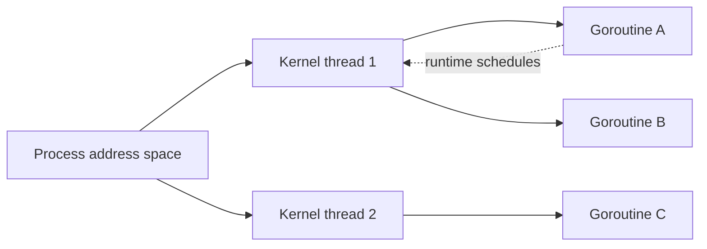
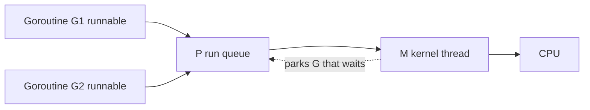

> Stage 5 — Processes, Threads, and Concurrency Models  
> Subject area 5.1 — Processes and Threads  
> Article 2

## The short version

A thread is a path of execution inside a process. It has its own registers, its own stack, and its own scheduling state, but it shares the process's address space, file descriptors, and many kernel objects with the other threads of that process.

That sharing is what makes threads cheap to communicate and what makes them hard to use correctly. Any memory that is not deliberately kept private can be read and written by another thread without a system call, and any mistake in that sharing can be seen immediately as corrupt data or a race.

A thread is created, it runs until it finishes or is asked to stop, and it must be joined or detached so its resources are reclaimed. Because threads are not free, programs that do a lot of concurrent work keep them in a pool with a bound, and that bound is where exhaustion appears.

## Where this article fits

The previous article showed that a process is an isolated container with its own address space and lifecycle. This article opens that container and looks at the threads inside it.

You need this before scheduling and affinity, because those topics describe where a thread runs, and before choosing between threads, processes, and events, because the cost model of threads decides which choice is cheaper. The same tiny program that was examined as a process will now be examined as one or many threads that share its memory.

## User threads and kernel threads

A kernel thread is a thread the kernel knows about and schedules. A user thread is a thread a language runtime creates and schedules itself, often on top of kernel threads.

On Linux, a thread created with `pthread_create` is a kernel thread. The kernel gives it a thread identifier, puts it in the scheduler, and switches to it like any other schedulable entity. It shares the process's address space, but the kernel still tracks its registers and stack.

A Go goroutine is a user thread. The Go runtime multiplexes many goroutines onto a smaller number of kernel threads. From the kernel's point of view, the number of schedulable threads may be much smaller than the number of goroutines a Go program created. When a goroutine blocks on a Go channel, it is the runtime that parks it, not necessarily the kernel.



The distinction matters for what you observe. `ps -o nlwp` shows the number of kernel threads in a process, while runtime metrics like `runtime.NumGoroutine()` show the number of goroutines. A Go program may report thousands of goroutines while the kernel sees only eight threads.

User threads make creation cheaper and let the runtime choose a policy that fits the language. Kernel threads are what the scheduler and cgroup limits actually count.

## What a thread owns and what it shares

A thread's private state is the minimum needed to resume it. That is its general-purpose registers, its instruction pointer, its stack pointer, its thread-local storage, and its scheduling state. Each thread also has its own stack, which is a region of the shared address space that grows for that thread. The stack size is not unlimited. On Linux it is often a few megabytes per kernel thread, and each goroutine starts much smaller.

Everything else in the address space is shared by default. Code, globals, heap objects, memory-mapped files, and file descriptor tables are visible to every thread. Two threads can read the same global without a system call, and two threads can write the same heap object at the same time if nothing stops them.

The shared file descriptor table is a subtle case. Two threads share the same integer table, so closing a descriptor in one thread affects the other immediately. This is why closing a file descriptor from the wrong thread can cause an unrelated operation to fail with the wrong file, and why Go's `os` package counts references for some descriptors instead of closing them blindly.

A simple program makes the sharing concrete. Two goroutines increment a counter without coordination.

```go
package main

import (
    "fmt"
    "sync"
)

func main() {
    var counter int
    var wg sync.WaitGroup
    wg.Add(2)
    go func() {
        for i := 0; i < 100000; i++ {
            counter++
        }
        wg.Done()
    }()
    go func() {
        for i := 0; i < 100000; i++ {
            counter++
        }
        wg.Done()
    }()
    wg.Wait()
    fmt.Println(counter)
}
```

The variable `counter` is in shared heap memory. The two goroutines run concurrently and each does a read, an add, and a write. Without synchronization the final value is not reliably `200000`. The program has no defined meaning for that access in the Go memory model, and the race detector can find it.

## Thread-local storage

Thread-local storage is a small region where each thread has its own copy of a variable. The variable has the same name in source code, but the address is different per thread. The runtime uses this for per-thread data like the current goroutine pointer or the location of a per-thread cache.

Thread-local storage is useful when sharing would cause contention. A per-thread counter that is aggregated infrequently is faster than a single global counter that every thread updates under a lock, because each thread writes to its own cache line and avoids coherence traffic. The tradeoff is that the value is not coherent until it is collected, so it is right for statistics and wrong for a shared invariant that must be seen immediately.

You can think of thread-local storage as the exception to the rule that everything is shared. By default, memory is shared. Thread-local storage is the place you opt into privacy.

### How the Go runtime schedules goroutines

Go does not run one kernel thread per goroutine. It keeps three kinds of structures. A `G` is a goroutine with its stack and where it should resume. An `M` is a kernel thread that can run. A `P` is a processor resource that holds a run queue and a per-P cache for the allocator. A `P` says how many goroutines can run in parallel, which is why `GOMAXPROCS` defaults to the number of CPUs.

A goroutine is queued on a `P`. An `M` that is attached to that `P` picks the next `G` and runs it. If the goroutine blocks on a channel or on network I/O that the runtime knows about, the runtime parks the `G` and the `M` picks another `G` without blocking the kernel thread. If the goroutine blocks in a system call the runtime does not know about, the `M` really blocks and the runtime may create another `M` to keep the `P` busy.



You can see the three counts. `runtime.NumGoroutine()` is `G`, `ps -o nlwp` is `M`, and `GOMAXPROCS` is `P`.

### How thread-local storage is implemented

Thread-local storage is not magic. On `amd64` a segment register points at a per-thread block. The `FS` register on Linux often points at the current thread's control block, while `GS` may point at per-CPU data. A variable declared as thread-local is accessed as an offset from that base, so `mov %fs:0x10, %rax` loads a different address for each thread even though the instruction is the same.

In Go, the current goroutine pointer is kept in a thread-local slot, so `runtime.getg()` is a single load from `FS`. A per-thread allocator cache is also kept there, which is why a small allocation can be fast when it stays on the same thread.

### Stack growth and why a goroutine starts small

A kernel thread starts with a fixed stack, often 8 MiB, and a guard page at the end that faults on overflow. A goroutine starts with a few kilobytes and grows as needed. The runtime inserts a check at function entry that compares the stack pointer to a guard. If the remaining space is too small, it calls `morestack` to allocate a larger stack, copy the active frame, and update pointers.

An overflow in Go therefore looks like a `morestack` call rather than a segfault, but a C thread that overflows its fixed stack still faults on the guard page. The shared address space means a runaway recursion in one goroutine can still grow until the process hits a limit, which is why a pool matters.

## Creating and shutting down a thread

A thread is created when the runtime decides it needs a new execution path. For a kernel thread, the kernel allocates a stack, a thread identifier, and scheduling state. For a goroutine, the runtime allocates a small stack and a control block and places the goroutine in a run queue.

Shutdown is where most bugs live. A thread that was created must eventually be waited for or explicitly detached so its stack and control block can be reused. For a kernel thread, that is `pthread_join` or detaching. For a goroutine, that is waiting on a `WaitGroup`, closing a signal channel, or returning from the function that started it.

An abrupt stop is harder. Terminating a thread with a signal or by cancelling it while it holds a lock can leave shared state inconsistent. A mutex that is locked when its owner disappears will never be unlocked unless the program uses a robust mutex or a timeout. A more reliable pattern is cooperative shutdown. The owner signals the thread with a context or a channel, the thread notices the signal at a place where it is safe to stop, releases its resources, and returns.

```go
package main

import (
    "context"
    "fmt"
    "time"
)

func worker(ctx context.Context) {
    for {
        select {
        case <-ctx.Done():
            fmt.Println("worker: stopping")
            return
        default:
            // do a small unit of work
            time.Sleep(10 * time.Millisecond)
        }
    }
}

func main() {
    ctx, cancel := context.WithCancel(context.Background())
    go worker(ctx)
    time.Sleep(50 * time.Millisecond)
    cancel()
    time.Sleep(20 * time.Millisecond)
}
```

The important lines are the select on `ctx.Done()` and the single place where `cancel` is called. The worker does not need to be killed. It checks the signal at a safe boundary and decides to return. Later articles about queues and cancellation will build a fuller protocol where the worker also stops taking new items and drains what it has.

## Thread pools

Because a kernel thread needs a stack and kernel bookkeeping, creating one for every small task does not scale. A thread pool keeps a fixed set of threads and gives them work through a queue. The pool bounds concurrency, reuses stacks, and limits the number of schedulable entities the kernel must track.

A pool has a few numbers that matter. One is the size, which says how many threads can run at once. One is the queue depth, which says how many tasks can wait. One is the policy when the queue is full, which is backpressure or rejection.

Go's runtime is itself a kind of pool. It keeps a number of kernel threads close to `GOMAXPROCS` and schedules goroutines onto them. An application-level pool on top of that bounds the number of concurrent goroutines that do a specific kind of work, like handling requests.

```go
package main

import (
    "fmt"
    "sync"
)

func main() {
    const workers = 4
    tasks := make(chan int, 20)
    var wg sync.WaitGroup

    wg.Add(workers)
    for i := 0; i < workers; i++ {
        go func(id int) {
            defer wg.Done()
            for t := range tasks {
                fmt.Printf("worker %d handled %d\n", id, t)
            }
        }(i)
    }

    for t := 0; t < 10; t++ {
        tasks <- t
    }
    close(tasks)
    wg.Wait()
}
```

The channel is the queue, the four goroutines are the pool, and closing the channel tells workers there will be no more work. The size `4` is where the tradeoff lives. With a very small pool, work waits even though CPUs are free. With a very large pool, many goroutines are runnable at once and compete for the same CPUs and locks, and memory grows with each stack.

A Level 1 read that makes the pool visible without writing a pool is to run the tiny program with `GOMAXPROCS` set and watch the runtime use it.

```bash
go run main.go
GOMAXPROCS=2 go run main.go
go run -exec "strace -f -e clone,clone3" main.go 2>&1 | head
```

What it demonstrates is how many kernel threads the runtime actually creates. The two runs produce the same result with different parallelism, and the `clone` trace shows how many schedulable entities the kernel saw.

## Exhaustion

A thread pool can run out in several ways at once. It can run out of threads because every worker is blocked on a downstream call. It can run out of queue space because tasks arrive faster than they are processed. It can run out of memory because each thread's stack and each queued task needs space, and it can run out of file descriptors or other kernel objects that the work holds.

Exhaustion looks different depending on where it happens. When the pool is full and the queue is bounded, new work is rejected with an error that the caller can see. When the queue is unbounded, the program keeps accepting and grows until it hits a memory or descriptor limit somewhere else, where the failure is harder to connect to the pool. A pool that blocks the submitter when full creates backpressure that the caller feels immediately, but it can also propagate the block to the caller of the caller.

A practical way to tell the difference is to measure not just the queue length, but how long a task waits before a worker starts it, how long a worker holds a thread, and how often submission is rejected or blocks.

## Observing shared state and threads

You can see how many kernel threads a process has, which addresses it shares, and whether a race exists.

```bash
go build -o tiny main.go
./tiny &
pid=$!
ps -o pid,nlwp,stat,cmd -p $pid
cat /proc/$pid/status | grep -E "Threads|VmPeak"
ls -l /proc/$pid/task
```

What it demonstrates is the boundary between the runtime's view and the kernel's view. `nlwp` is the number of light-weight processes the kernel schedules, while the runtime may report a much larger number of goroutines. The directory `/proc/<pid>/task` lists one entry per kernel thread.

For a shared-memory bug, the race detector is more direct than a debugger.

```bash
go run -race main.go 2>&1 | head -n 20
```

The detector prints which two accesses raced, which goroutines they were in, and which lines created those goroutines. A program that passes without `-race` is not proof that it is race free. The detector only finds races that happened in the run it observed, and the same program can pass and fail depending on timing.

A running process can also be inspected with `pprof` and `trace` without restarting it.

```bash
go tool pprof -top http://localhost:6060/debug/pprof/goroutine
go tool pprof -top http://localhost:6060/debug/pprof/threadcreate
go tool trace -pprof=net http://localhost:6060/debug/pprof/trace?seconds=2
```

What it demonstrates is where goroutines are blocked and where kernel threads were created. The goroutine profile shows how many goroutines are waiting on the same channel or mutex, while `threadcreate` shows how many kernel threads the runtime actually created. Learning to read those two together tells you whether the problem is runnable goroutines waiting for a `P` or kernel threads blocked in the kernel.

When the runtime reports `pthread_create failed: Resource temporarily unavailable`, that is the same `EAGAIN` you would see from `clone` when `ThreadsMax` or `ulimit -u` is hit. The fix is not to raise the limit blindly, but to bound the pool that created the threads, as the next section discusses.

## A realistic production example

A team ran a Go service that handled incoming events by starting a new goroutine per event without any bound. The handler for each event fetched a record from a database, updated an in-memory map protected by a mutex, and wrote a result to a file through a shared descriptor.

At first the pattern worked because the event rate was low. During a traffic spike, the number of live goroutines grew to tens of thousands. Each goroutine held a stack, and the shared map caused many goroutines to wait for the same lock. The number of kernel threads stayed close to `GOMAXPROCS`, but the number of runnable goroutines far exceeded it, so the run queue grew and tail latency rose from milliseconds to seconds. Some goroutines blocked on the database and held their goroutine stacks for a long time. A few closed the shared file descriptor while others still tried to use it, which caused writes to go to the wrong file after the descriptor was reused.

The team first raised `GOMAXPROCS` and increased the database connection limit. The spike still hurt, because the number of concurrent operations was unbounded. They introduced a pool with a fixed number of workers and a bounded channel for pending events, where the submitter would block and then return `busy` if the channel stayed full. They moved the shared map updates behind a single writer goroutine that read from a channel, so the mutex went away, and they stopped sharing the raw descriptor and instead gave each worker its own file or used a single writer with proper reference counting. They also ran `go test -race` and `go run -race` in CI and added a metric for `runtime.NumGoroutine()` and for how long a task waited in the channel.

After the change the number of goroutines stayed near the pool size plus a small queue, memory became predictable, and latency degraded gracefully when the pool filled instead of growing without bound.

## How experienced engineers think about threads

They start with ownership. Which data is shared and which is private, and which synchronization protects each shared field. Then they ask about lifetime. Which goroutine creates which other goroutine, which one waits for it, and where the shutdown signal flows.

They treat a shared address space as the default, not the exception. Any variable that is not on a thread's stack or in thread-local storage is assumed to be reachable by another thread unless proven otherwise. They use tools where appropriate. `go vet`, `-race`, and `ps` show different parts, but none replaces the design question of who owns what and when it is safe to touch.

## Interview definitions

### What is a thread?

> A thread is a path of execution inside a process with its own registers, stack, and scheduling state, but sharing the process's address space and most kernel objects.

### What is the difference between a kernel thread and a user thread?

> A kernel thread is scheduled directly by the kernel and appears in `ps` as a light-weight process. A user thread, like a Go goroutine, is scheduled by the runtime onto a smaller number of kernel threads, so the kernel sees fewer schedulable entities than the language created.

### What is shared memory?

> Shared memory is any memory that more than one thread can reach through the shared address space. By default, heap objects and globals are shared, while a thread's stack and its thread-local storage are private.

### What is thread-local storage?

> A region where each thread has its own copy of a variable with the same name. It is the place to opt into privacy when sharing would cause contention, like per-thread counters that are merged later.

### What is a thread pool?

> A fixed set of threads that take work from a bounded queue. The pool bounds concurrency, reuses stacks, and makes exhaustion visible as queue waiting or rejection instead of unbounded growth.

### What is thread exhaustion?

> The condition where a program cannot make progress because every thread it can use is blocked, or the queue of pending work is full, or the memory needed for more stacks is not available. The symptom is usually higher latency and growing queueing before any explicit error appears.

## Interview follow-up questions

### Why can a program with many goroutines still have few kernel threads?

> The Go runtime schedules many goroutines onto a small number of kernel threads, often around `GOMAXPROCS`. The kernel schedules the threads, while the runtime schedules the goroutines. `ps` shows one count and `runtime.NumGoroutine` shows the other.

### Why does a shared address space make bugs easier to create?

> Any heap or global that is not kept on a stack or in thread-local storage can be read and written by another thread without a system call. A mistake is visible immediately as corrupted data or a race, and the detector can only find races that happened in the run it observed.

### When would you use thread-local storage?

> When many threads update the same counter or buffer and you want to avoid the coherence traffic of a single shared location. Each thread writes its own copy and the copies are merged infrequently, which trades immediate visibility for less contention.

### How do you shut down a thread safely?

> Cooperatively. Signal the thread with a context or channel, have it notice the signal at a point where it does not hold a lock that would be left inconsistent, release its resources, and return, rather than terminating it abruptly.

### How do you size a thread pool?

> By measuring the concurrency the work actually needs, the time a worker holds a thread, how long tasks wait in the queue, and which downstream resource saturates first. A pool that is too small leaves CPUs idle, while one that is too large adds memory, contention, and queueing without more useful throughput.

## Common misconceptions

### “Threads share nothing by default.”

Inside a process, the opposite is true. Stack and thread-local storage are private, but heap, globals, and descriptor tables are shared unless you make them private.

### “More threads always give more concurrency.”

More runnable threads can help while there are independent CPUs and no shared bottleneck, but beyond that they add switching, memory for stacks, and contention without more useful work.

### “A goroutine is a kernel thread.”

It is a user thread managed by the Go runtime. The kernel schedules the smaller number of underlying threads, not the large number of goroutines.

### “Thread-local storage is the same as a global.”

The name is the same, but each thread has its own copy. A write in one thread does not affect the copy in another, which is why it helps with contention.

### “Closing a descriptor in one thread is safe for others.”

The descriptor table is shared. Closing in one thread affects every other thread that shares it, and a new descriptor can reuse the same number, so a later operation may act on the wrong file.

## Summary

A process gives you an isolated address space. Threads give you many execution paths inside that space. Kernel threads are what the kernel schedules, while user threads like goroutines are what the runtime schedules onto them. By default, memory is shared, with a thread's stack and its thread-local storage as the places that are private. Pools bound how many threads can run at once, and exhaustion shows up as waiting, rejection, or growth in memory and queueing. The safe pattern for shutdown is cooperative, where a thread is asked to stop and chooses a safe point to return.

## If you want to build this later

Extend the tiny program so the main goroutine creates a fixed worker pool with a bounded channel. Make the workers touch a shared map, first with a race and then with a correct synchronization where only one goroutine mutates the map. Add a mode where each worker increments a per-goroutine counter in thread-local-like storage and a separate aggregator merges them. Run with `go run -race` to see the race, with `ps` to see kernel threads versus `runtime.NumGoroutine`, and with a blocked downstream to see queue growth. Then add a cancellable context so the main function can signal shutdown and each worker drains or discards pending tasks before returning.
