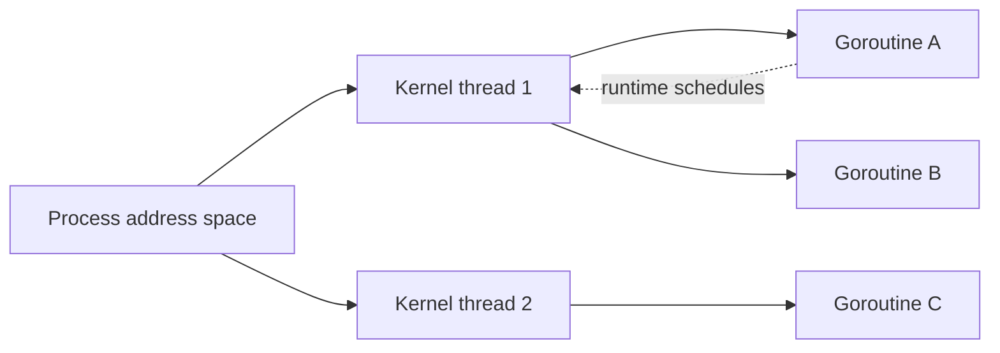
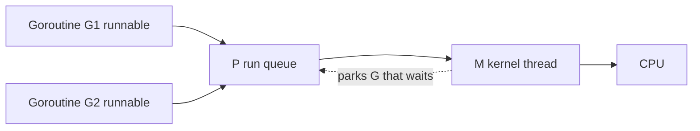
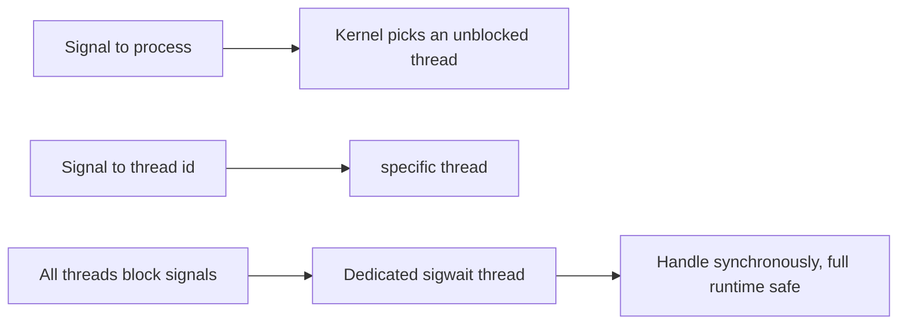

The previous chapter showed that a process is an isolated space with its own memory and lifecycle. This chapter looks inside that space at the threads it contains. This is the second article in Stage 5.

A thread is one path of execution inside a process. It has its own registers, stack, and scheduling state. But it shares the process's memory, open files, and many kernel objects with the other threads in that process.

Sharing makes threads cheap to communicate and hard to use correctly. Any memory that is not kept private can be read or written by another thread without a system call. A mistake in sharing shows up at once as corrupt data or a race.

A thread is created. It runs until it finishes or is asked to stop. It must be joined or detached so its resources are reclaimed. Threads are not free. Programs that do a lot of concurrent work keep them in a pool with a limit. That limit is where exhaustion appears.

## User threads and kernel threads

A kernel thread is one the kernel knows about and schedules. A user thread is one the language runtime creates and schedules itself. The runtime often runs user threads on top of kernel threads.

On Linux, a thread made with `pthread_create` is a kernel thread. The kernel gives it an identifier. It puts the thread in the scheduler and switches to it like any other schedulable entity. The thread shares the process's memory, but the kernel still tracks its registers and stack.

A Go goroutine is a user thread. The Go runtime places many goroutines onto a smaller number of kernel threads. From the kernel's view, the count of schedulable threads may be much smaller than the count of goroutines the program created. When a goroutine waits on a Go channel, the runtime parks it. The kernel does not need to step in.



The difference matters for what you can observe. `ps -o nlwp` shows the number of kernel threads in a process. Runtime metrics like `runtime.NumGoroutine()` show the number of goroutines. A Go program may report thousands of goroutines while the kernel sees only eight threads.

User threads make creation cheaper. They let the runtime pick a policy that fits the language. Kernel threads are what the scheduler and cgroup limits actually count.

## What a thread owns and what it shares

A thread's private state is the minimum it needs to resume. This includes its general-purpose registers, its instruction pointer, its stack pointer, its thread-local storage, and its scheduling state. Each thread has its own stack. The stack is a region of the shared memory that grows for that thread. The stack size is not unlimited. On Linux it is often a few megabytes per kernel thread. Each goroutine starts much smaller.

Everything else in the memory space is shared by default. Code, globals, heap objects, memory-mapped files, and file descriptor tables are visible to every thread. Two threads can read the same global without a system call. Two threads can also write the same heap object at the same time if nothing stops them.

The shared file descriptor table is a tricky case. Two threads share the same integer table. Closing a descriptor in one thread affects the other at once. This is why closing a file descriptor from the wrong thread can make an unrelated operation fail on the wrong file. It is also why Go's `os` package counts references for some descriptors instead of closing them blindly.

A simple program shows the sharing. Two goroutines add to a counter without coordination.

```go
package main

import (
    "fmt"
    "sync"
)

func main() {
    var counter int
    var wg sync.WaitGroup
    wg.Add(2)
    go func() {
        for i := 0; i < 100000; i++ {
            counter++
        }
        wg.Done()
    }()
    go func() {
        for i := 0; i < 100000; i++ {
            counter++
        }
        wg.Done()
    }()
    wg.Wait()
    fmt.Println(counter)
}
```

The variable `counter` lives in shared heap memory. The two goroutines run at the same time. Each one does a read, an add, and a write. Without synchronization the final value is not reliably `200000`. The Go memory model does not define the result of that access. The race detector can find it.

## Thread-local storage

Thread-local storage is a small region. Each thread gets its own copy of a variable there. The variable has the same name in source code, but the address is different for each thread. The runtime uses this for per-thread data such as the current goroutine pointer or the location of a per-thread cache.

Thread-local storage helps when sharing would cause contention. A per-thread counter that you gather now and then is faster than a single global counter that every thread updates under a lock. Each thread writes to its own cache line and avoids coherence traffic. The tradeoff is that the value is not current until you collect it. This makes it good for statistics but wrong for a shared invariant that must be seen at once.

Think of thread-local storage as the exception to the rule that everything is shared. By default, memory is shared. Thread-local storage is where you choose privacy.

### How the Go runtime schedules goroutines

Go does not run one kernel thread per goroutine. It keeps three kinds of structures. A `G` is a goroutine with its stack and where it should resume. An `M` is a kernel thread that can run. A `P` is a processor resource that holds a run queue and a per-P cache for the allocator. A `P` sets how many goroutines can run in parallel. This is why `GOMAXPROCS` defaults to the number of CPUs.

A goroutine is queued on a `P`. An `M` attached to that `P` picks the next `G` and runs it. If the goroutine waits on a channel or on network I/O that the runtime knows about, the runtime parks the `G`. The `M` picks another `G` without blocking the kernel thread. If the goroutine waits in a system call the runtime does not know about, the `M` really blocks. The runtime may then create another `M` to keep the `P` busy.



You can see the three counts. `runtime.NumGoroutine()` is `G`. `ps -o nlwp` is `M`. `GOMAXPROCS` is `P`.

### How thread-local storage is implemented

Thread-local storage is not magic. On `amd64` a segment register points at a per-thread block. The `FS` register on Linux often points at the current thread's control block. The `GS` register may point at per-CPU data. A variable declared as thread-local is reached as an offset from that base. The instruction `mov %fs:0x10, %rax` loads a different address for each thread even though the instruction is the same.

In Go, the current goroutine pointer is kept in a thread-local slot. This makes `runtime.getg()` a single load from `FS`. A per-thread allocator cache is also kept there. This is why a small allocation can be fast when it stays on the same thread.

### Stack growth and why a goroutine starts small

A kernel thread starts with a fixed stack, often 8 MiB, and a guard page at the end. The guard page faults on overflow. A goroutine starts with a few kilobytes and grows as needed. The runtime inserts a check at function entry. It compares the stack pointer to a guard. If the remaining space is too small, it calls `morestack` to allocate a larger stack, copy the active frame, and update pointers.

An overflow in Go looks like a `morestack` call rather than a segfault. A C thread that overflows its fixed stack still faults on the guard page. The shared memory space means a runaway recursion in one goroutine can still grow until the process hits a limit. This is why a pool matters.

## Creating and shutting down a thread

A thread is created when the runtime needs a new execution path. For a kernel thread, the kernel allocates a stack, a thread identifier, and scheduling state. For a goroutine, the runtime allocates a small stack and a control block and places the goroutine in a run queue.

Most bugs live in shutdown. A thread that was created must eventually be waited for or explicitly detached. Then its stack and control block can be reused. For a kernel thread, that means `pthread_join` or detaching. For a goroutine, that means waiting on a `WaitGroup`, closing a signal channel, or returning from the function that started it.

An abrupt stop is harder. Ending a thread with a signal or cancelling it while it holds a lock can leave shared state broken. A mutex locked when its owner disappears will never unlock unless the program uses a robust mutex or a timeout. A more reliable pattern is cooperative shutdown. The owner sends a signal through a context or a channel. The thread sees the signal at a safe point, releases its resources, and returns.

```go
package main

import (
    "context"
    "fmt"
    "time"
)

func worker(ctx context.Context) {
    for {
        select {
        case <-ctx.Done():
            fmt.Println("worker: stopping")
            return
        default:
            // do a small unit of work
            time.Sleep(10 * time.Millisecond)
        }
    }
}

func main() {
    ctx, cancel := context.WithCancel(context.Background())
    go worker(ctx)
    time.Sleep(50 * time.Millisecond)
    cancel()
    time.Sleep(20 * time.Millisecond)
}
```

The key lines are the select on `ctx.Done()` and the single place where `cancel` is called. The worker does not need to be killed. It checks the signal at a safe boundary and chooses to return. Later articles about queues and cancellation will build a fuller protocol. The worker will also stop taking new items and drain what it already has.

## Thread pools

A kernel thread needs a stack and kernel bookkeeping. Making one for every small task does not scale. A thread pool keeps a fixed set of threads and feeds them work through a queue. The pool limits concurrency, reuses stacks, and limits the number of schedulable entities the kernel must track.

A pool has a few numbers that matter. One is the size. It says how many threads can run at once. One is the queue depth. It says how many tasks can wait. One is the policy when the queue is full. That policy is backpressure or rejection.

Go's runtime is itself a kind of pool. It keeps a number of kernel threads close to `GOMAXPROCS` and schedules goroutines onto them. An application-level pool on top of that bounds the number of concurrent goroutines that do a specific kind of work, such as handling requests.

```go
package main

import (
    "fmt"
    "sync"
)

func main() {
    const workers = 4
    tasks := make(chan int, 20)
    var wg sync.WaitGroup

    wg.Add(workers)
    for i := 0; i < workers; i++ {
        go func(id int) {
            defer wg.Done()
            for t := range tasks {
                fmt.Printf("worker %d handled %d\n", id, t)
            }
        }(i)
    }

    for t := 0; t < 10; t++ {
        tasks <- t
    }
    close(tasks)
    wg.Wait()
}
```

The channel is the queue. The four goroutines are the pool. Closing the channel tells workers there will be no more work. The size `4` is where the tradeoff lives. With a very small pool, work waits even though CPUs are free. With a very large pool, many goroutines are runnable at once and compete for the same CPUs and locks. Memory also grows with each stack.

To see the pool without writing one, run the tiny program with `GOMAXPROCS` set. Watch the runtime use it.

```bash
go run main.go
GOMAXPROCS=2 go run main.go
go run -exec "strace -f -e clone,clone3" main.go 2>&1 | head
```

This shows how many kernel threads the runtime actually creates. The two runs produce the same result with different parallelism. The `clone` trace shows how many schedulable entities the kernel saw.

## Exhaustion

A thread pool can run out in several ways at once. It can run out of threads because every worker is blocked on a downstream call. It can run out of queue space because tasks arrive faster than they are processed. It can run out of memory because each thread's stack and each queued task needs space. It can also run out of file descriptors or other kernel objects that the work holds.

Exhaustion looks different depending on where it happens. When the pool is full and the queue is bounded, new work is rejected with an error that the caller can see. When the queue is unbounded, the program keeps accepting and grows until it hits a memory or descriptor limit somewhere else. There the failure is harder to connect to the pool. A pool that blocks the submitter when full creates backpressure that the caller feels at once. It can also push the block to the caller of the caller.

A practical way to tell the difference is to measure more than queue length. Measure how long a task waits before a worker starts it. Measure how long a worker holds a thread. Measure how often submission is rejected or blocks.

## Observing shared state and threads

You can see how many kernel threads a process has. You can see which addresses it shares. You can see whether a race exists.

```bash
go build -o tiny main.go
./tiny &
pid=$!
ps -o pid,nlwp,stat,cmd -p $pid
cat /proc/$pid/status | grep -E "Threads|VmPeak"
ls -l /proc/$pid/task
```

This shows the boundary between the runtime's view and the kernel's view. `nlwp` is the number of light-weight processes the kernel schedules. The runtime may report a much larger number of goroutines. The directory `/proc/<pid>/task` lists one entry per kernel thread.

For a shared-memory bug, the race detector is more direct than a debugger.

```bash
go run -race main.go 2>&1 | head -n 20
```

The detector prints which two accesses raced. It prints which goroutines they were in. It prints which lines created those goroutines. A program that passes without `-race` is not proof that it is race free. The detector only finds races that happened in the run it observed. The same program can pass and fail depending on timing.

A running process can also be inspected with `pprof` and `trace` without restarting it.

```bash
go tool pprof -top http://localhost:6060/debug/pprof/goroutine
go tool pprof -top http://localhost:6060/debug/pprof/threadcreate
go tool trace -pprof=net http://localhost:6060/debug/pprof/trace?seconds=2
```

This shows where goroutines are blocked and where kernel threads were created. The goroutine profile shows how many goroutines are waiting on the same channel or mutex. The `threadcreate` profile shows how many kernel threads the runtime actually created. Reading the two together tells you whether the problem is runnable goroutines waiting for a `P` or kernel threads blocked in the kernel.

When the runtime reports `pthread_create failed: Resource temporarily unavailable`, that is the same `EAGAIN` you would see from `clone` when `ThreadsMax` or `ulimit -u` is hit. The fix is not to raise the limit blindly. It is to bound the pool that created the threads, as the next section discusses.

## A realistic production example

A team ran a Go service. It handled incoming events by starting a new goroutine per event with no bound. The handler for each event fetched a record from a database, updated an in-memory map protected by a mutex, and wrote a result to a file through a shared descriptor.

At first the pattern worked because the event rate was low. During a traffic spike, the number of live goroutines grew to tens of thousands. Each goroutine held a stack. The shared map made many goroutines wait for the same lock. The number of kernel threads stayed close to `GOMAXPROCS`, but the number of runnable goroutines far exceeded it. The run queue grew and tail latency rose from milliseconds to seconds. Some goroutines blocked on the database and held their stacks for a long time. A few closed the shared file descriptor while others still tried to use it. This caused writes to go to the wrong file after the descriptor was reused.

The team first raised `GOMAXPROCS` and increased the database connection limit. The spike still hurt because the number of concurrent operations was unbounded. They introduced a pool with a fixed number of workers and a bounded channel for pending events. The submitter would block and then return `busy` if the channel stayed full. They moved the shared map updates behind a single writer goroutine that read from a channel. The mutex went away. They stopped sharing the raw descriptor and instead gave each worker its own file or used a single writer with proper reference counting. They also ran `go test -race` and `go run -race` in CI and added a metric for `runtime.NumGoroutine()` and for how long a task waited in the channel.

After the change the number of goroutines stayed near the pool size plus a small queue. Memory became predictable. Latency degraded gracefully when the pool filled instead of growing without bound.

## How engineers actually reason about threads

They start with ownership. Which data is shared and which is private. Which synchronization protects each shared field. Then they ask about lifetime. Which goroutine creates which other goroutine. Which one waits for it. Where does the shutdown signal flow.

They treat a shared memory space as the default, not the exception. Any variable that is not on a thread's stack or in thread-local storage is assumed to be reachable by another thread unless proven otherwise. They use tools where appropriate. `go vet`, `-race`, and `ps` show different parts. None of them replaces the design question of who owns what and when it is safe to touch.

## Signals in a multithreaded process: who receives them and how to handle them safely

In a multithreaded process, the question of which thread receives a signal has no single answer. Getting it wrong is a classic source of hangs and missed notifications. A signal sent with `kill` to a PID goes to the process. The kernel picks an arbitrary thread that does not have the signal blocked to handle it. A signal sent with `tgkill` targets a specific thread identifier. This is what a debugger uses to interrupt one thread. Hardware faults such as `SIGSEGV` or `SIGFPE` are delivered to the thread that caused them.



The safe pattern is to block the relevant signals in every thread at startup with `pthread_sigmask`. Then have one dedicated thread call `sigwait` to receive them. That converts asynchronous signal handling into ordinary synchronous handling in a known thread. Asynchronous handlers may only call async-signal-safe functions. With `sigwait` you can use locks, logs, and the full runtime safely. A supervisor that wants to stop a pool can then simply signal that thread. It can also use `tgkill` on a specific worker. If you let any thread take the default handler, a `SIGTERM` may land on a worker that is mid-operation. A `SIGINT` may interrupt a syscall in an unrelated thread.

## Thread lifetime: joinable versus detached, cancellation, and dying while holding a lock

A thread starts as either joinable or detached. A joinable thread keeps its exit status and resources until another thread calls `pthread_join` on it. It works like a zombie child. A detached thread is made with `pthread_detach` or created `PTHREAD_CREATE_DETACHED`. It releases its resources the moment it returns. No join is required, but its exit status cannot be collected. Detached is right for fire-and-forget workers. Use it only if nothing needs their result.

Cancellation is the harder part. `pthread_cancel` asks a thread to stop. By default it is deferred. The thread only checks at cancellation points such as `read`, `write`, `poll`, or `pthread_testcancel`. So the thread stops at a defined, safe spot rather than mid-instruction. Async cancellation, if enabled, can stop the thread anywhere. It is dangerous because it can leave a lock held or a buffer half-written. The lesson for a systems engineer is the same as the cooperative shutdown pattern earlier. Design threads so they reach a safe boundary.

The ugliest case is a thread that dies while holding a lock. If a thread is cancelled or crashes while owning a normal mutex, that mutex is permanently locked. Every future acquirer waits forever. POSIX robust mutexes, created with `PTHREAD_MUTEX_ROBUST`, turn this into a recoverable error. The next acquirer gets `EOWNERDEAD`. It can repair the shared state and mark it consistent. For production services that share state across threads and must survive a worker death, robust mutexes are the difference between a stuck process and a recoverable one.

## Per-thread observability: what /proc reveals about each thread

The kernel tracks each thread as its own schedulable entity. It has its own directory under `/proc/<pid>/task/<tid>`. Inside it you can read `stat` for per-thread scheduling counters, `sched` for the chosen CPU and wait time, `status` for the thread's state and for voluntary versus involuntary context switches, and `stack` for the kernel stack backtrace. This is how you see that one worker thread is stuck in `D` state on I/O while the rest are runnable. It is also how you see that a specific thread is spending all its time in the kernel rather than in your code.

The counts differ from the runtime's. `ps -o nlwp` counts kernel threads, including the Go runtime's worker threads, but not goroutines. `runtime.NumGoroutine()` counts goroutines. The runtime maps them onto far fewer kernel threads. When a profile shows many goroutines blocked on a mutex, the kernel still sees only a handful of threads. You must read the two views together. The goroutine profile tells you where the program is waiting. The per-thread `/proc` data tells you what the underlying CPU time and context switches actually were.

## Definitions

### A thread

> A thread is one path of execution inside a process. It has its own registers, stack, and scheduling state. But it shares the process's memory and most kernel objects.

### Kernel threads versus user threads

> A kernel thread is scheduled directly by the kernel. It appears in `ps` as a light-weight process. A user thread, like a Go goroutine, is scheduled by the runtime onto a smaller number of kernel threads. The kernel sees fewer schedulable entities than the language created.

### Shared memory

> Shared memory is any memory that more than one thread can reach through the shared address space. By default, heap objects and globals are shared. A thread's stack and its thread-local storage are private.

### Thread-local storage

> A region where each thread has its own copy of a variable with the same name. It is the place to choose privacy when sharing would cause contention, such as per-thread counters that are merged later.

### A thread pool

> A fixed set of threads that take work from a bounded queue. The pool limits concurrency, reuses stacks, and makes exhaustion visible as queue waiting or rejection instead of unbounded growth.

### Thread exhaustion

> The condition where a program cannot make progress. Every thread it can use is blocked, or the queue of pending work is full, or the memory needed for more stacks is not available. The symptom is usually higher latency and growing queueing before any explicit error appears.

## Beyond the definitions

### Why many goroutines but few kernel threads

> The Go runtime schedules many goroutines onto a small number of kernel threads, often around `GOMAXPROCS`. The kernel schedules the threads. The runtime schedules the goroutines. `ps` shows one count and `runtime.NumGoroutine` shows the other.

### Why shared memory invites bugs

> Any heap or global that is not kept on a stack or in thread-local storage can be read and written by another thread without a system call. A mistake is visible at once as corrupted data or a race. The detector can only find races that happened in the run it observed.

### When to use thread-local storage

> Use it when many threads update the same counter or buffer and you want to avoid the coherence traffic of a single shared location. Each thread writes its own copy and the copies are merged infrequently. This trades immediate visibility for less contention.

### Shutting a thread down safely

> Do it cooperatively. Send the thread a signal through a context or channel. Have it notice the signal at a point where it does not hold a lock that would be left inconsistent. It releases its resources and returns. Do not terminate it abruptly.

### How to size a thread pool

> Measure the concurrency the work actually needs. Measure the time a worker holds a thread. Measure how long tasks wait in the queue. Measure which downstream resource saturates first. A pool that is too small leaves CPUs idle. One that is too large adds memory, contention, and queueing without more useful throughput.

## Common misconceptions

**"Threads share nothing by default."** Inside a process, the opposite is true. Stack and thread-local storage are private. But heap, globals, and descriptor tables are shared unless you make them private.

**"More threads always give more concurrency."** More runnable threads can help while there are independent CPUs and no shared bottleneck. Beyond that they add switching, memory for stacks, and contention without more useful work.

**"A goroutine is a kernel thread."** It is a user thread managed by the Go runtime. The kernel schedules the smaller number of underlying threads, not the large number of goroutines.

**"Thread-local storage is the same as a global."** The name is the same, but each thread has its own copy. A write in one thread does not affect the copy in another. This is why it helps with contention.

**"Closing a descriptor in one thread is safe for others."** The descriptor table is shared. Closing in one thread affects every other thread that shares it. A new descriptor can reuse the same number, so a later operation may act on the wrong file.

## Summary

A process gives you an isolated address space. Threads give you many execution paths inside that space. Kernel threads are what the kernel schedules, while user threads like goroutines are what the runtime schedules onto them. By default, memory is shared, with a thread's stack and its thread-local storage as the places that are private. Pools limit how many threads can run at once, and exhaustion shows up as waiting, rejection, or growth in memory and queueing. The safe pattern for shutdown is cooperative, where a thread is asked to stop and chooses a safe point to return.
