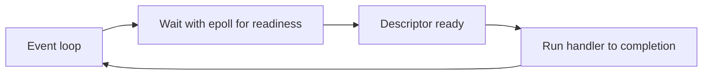
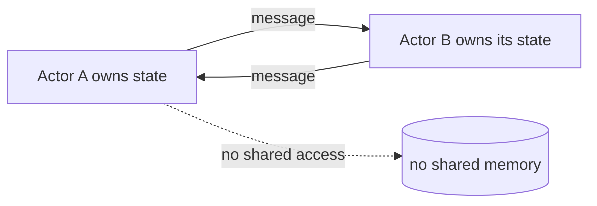
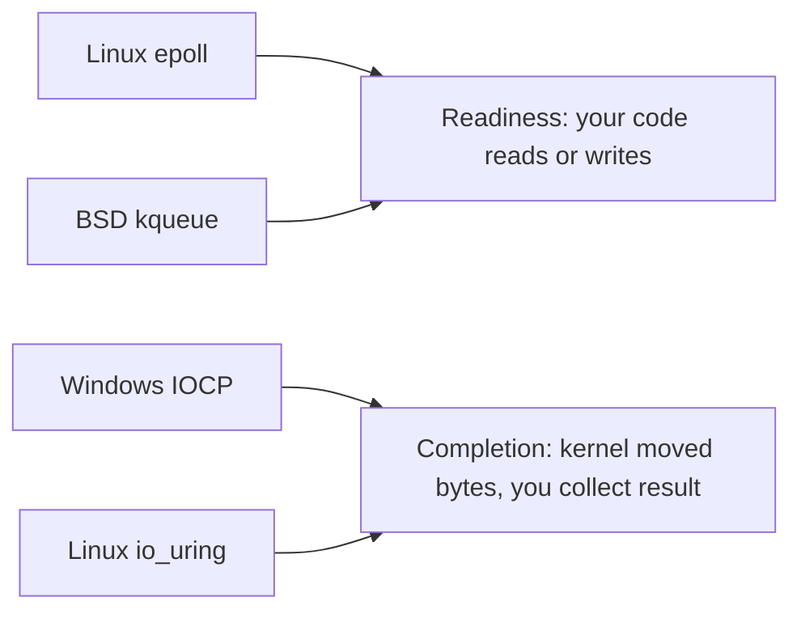

The previous chapters opened a process, looked at its threads, and followed those threads to the CPUs and memory near them. This chapter steps back and asks which container and which waiting model to use for a whole program. It is the fourth article of Stage 5.

Concurrency is about dealing with many things at once, not necessarily doing them at the exact same instant. A program can be concurrent by using many threads, many processes, a single thread that waits for events, a runtime that schedules many small tasks, or a set of actors that only talk through messages.

Each choice shares different things. Threads share an address space, so they can share memory directly but must coordinate every access. Processes share little, so they communicate through pipes, sockets, or shared mappings that are created on purpose. An event loop shares one thread and never runs two handlers at the same time, so it avoids many races by construction. Async runtimes and coroutines look like blocking code but suspend rather than block a thread. Actors isolate state inside one owner and only communicate with messages. Structured concurrency adds the rule that a parent waits for its children and owns their cancellation.

There is no best model. The right choice depends on what is shared, how failures should be contained, and whether the work is limited by CPU, by waiting, or by coordination.

## Multi-threading

A multi-threaded program runs many threads inside one or a few processes. Each thread has its own stack and registers, but all threads see the same heap, globals, and file descriptor table.

This sharing makes communication cheap. A producer can put a pointer to a buffer in a queue and a consumer can read it without copying the buffer's bytes. It also makes every shared write a place where a race can happen. A counter, a cache, a linked list, and a file descriptor are all shared by default unless they are on a private stack or in thread-local storage.

Threads work well when the work shares a lot of state that is naturally in memory, when latency matters and context switches are cheaper than process switches, and when the program is prepared to protect or partition the shared state. The cost is that the program must get every access right. A single missed lock or an inconsistent ordering can corrupt the shared structure, and the fault is not contained to one thread. An address fault or an invalid file descriptor close can affect the whole process.

A basic read that shows threads in the kernel is the same `ps` view from the thread article, but with a shared address space.

```bash
go build -o tiny main.go
./tiny &
pid=$!
ps -o pid,nlwp,cmd -p $pid
cat /proc/$pid/maps | head
ls /proc/$pid/task | wc -l
```

What it demonstrates is that one address space contains many threads. Every line in `maps` is visible to every thread, which is why sharing is cheap and why coordination is not optional.

## Multi-processing

A multi-process program runs many processes instead of many threads. Each process has its own address space and its own table of descriptors, so a bug that corrupts memory in one process does not directly corrupt another.

Communication must be explicit. A parent can create a pipe and fork children that inherit it, it can create a socket pair, or it can map a shared file. All of those require a system call to set up, and the program must decide on a protocol for bytes, ordering, and who closes which end.

```go
package main

import (
    "fmt"
    "os"
    "os/exec"
)

func main() {
    r, w, _ := os.Pipe()
    cmd := exec.Command(os.Args[0], "-child")
    cmd.Stdin = r
    cmd.Stdout = os.Stdout
    cmd.Start()
    fmt.Fprintln(w, "task")
    w.Close()
    cmd.Wait()
}
```

The pipe is the shared channel, but the address spaces stay separate. The child inherits a reference to the read end, the parent keeps the write end, and closing the write end lets the child see end of file.

Processes work well when isolation outweighs sharing cost. A crash in a worker does not take the supervisor with it, and a worker can be started with different privileges, limits, or even a different binary. The tradeoff is that sharing large data costs a copy or a deliberate shared mapping, and the kernel must track more address spaces and page tables.

## Single-threaded event loops

An event loop is a single thread that waits for events and runs a handler for each event until the handler returns. No two handlers run at the same time, so shared state does not need a lock between handlers.

The typical loop uses `epoll` or `kqueue` to wait for many descriptors at once.



The benefit is that concurrency is explicit in the code. There is no preemptive switch in the middle of a handler, so a handler can touch shared structures without locking as long as it does not yield in the middle. The cost is that a handler must never block for a long time. A handler that reads a large file or does a long computation without yielding keeps the loop from handling the next event, and latency for all connections grows. Handlers therefore do a little work, register interest in the next event, and return.

Go's netpoller is an event loop that the runtime uses for network I/O. A goroutine that waits on a socket does not block a kernel thread. The runtime parks the goroutine and the netpoller's loop wakes it when the descriptor is ready.

### Level-triggered versus edge-triggered

`epoll` can be used in two modes. In level-triggered mode, which is the default, the kernel reports a descriptor as ready as long as it is ready. If you do not consume all the data, the next `epoll_wait` will report it again. In edge-triggered mode, set with `EPOLLET`, the kernel reports a transition from not ready to ready only once. If you do not read until `EAGAIN`, you will not get another notification until new data arrives. Edge-triggered needs a loop that reads until `EAGAIN` and is easy to get wrong, but it avoids repeated wakeups. Level-triggered is more forgiving for a handler that does a little work and returns.

```go
// edge-triggered loop must drain
for {
    n, err := syscall.Read(fd, buf)
    if err == syscall.EAGAIN {
        break // must wait for next edge
    }
    // handle n bytes
}
```

What it demonstrates is that the handler, not the kernel, is responsible for knowing it is done. A level-triggered handler that reads one chunk and returns will be woken again, while an edge-triggered handler that does the same will wait forever.

### How Go's netpoller parks a goroutine

When a goroutine does a `net` read, the runtime does not block the underlying kernel thread. It calls `gopark`, records that this goroutine waits on this descriptor, and schedules another goroutine on the same `M`. The netpoller thread, which is its own kernel thread, loops on `epoll_wait`. When the descriptor becomes ready, the netpoller marks the waiting goroutine as runnable and the scheduler later resumes it on a `P`.


The important distinction is between the kernel thread that is parked and the goroutine that is parked. `ps` shows the first, `runtime.NumGoroutine` shows the second. A program that parks ten thousand goroutines on network wait may still show only eight kernel threads.

### `io_uring` as a completion model

`epoll` is a readiness model. It says a descriptor is ready, and the program then does the `read`. `io_uring` is a completion model. The program submits a request like `read at offset` into a submission queue and later looks at a completion queue for the result. The same thread can submit many requests without waiting for each one, and the kernel can do the work with fewer system calls.

The tradeoff is interface complexity. `epoll` is a single `epoll_wait` plus ordinary reads and writes. `io_uring` needs two rings, memory ordering for the rings, and handling of completions that may arrive out of order. For a Go HTTP server that already uses the netpoller, `io_uring` is not automatically faster, but for a storage-heavy program that does many random reads it can reduce the number of context switches.

## Async runtimes

Async runtimes make waiting look like blocking code, but the thread is not blocked. A function that looks like it reads a file actually suspends, lets the runtime run other tasks, and resumes after the data is ready.

In Go, a goroutine that blocks on a channel or on a `net` operation suspends, and the Go scheduler runs another goroutine on the same kernel thread.

```go
package main

import (
    "fmt"
    "sync"
    "time"
)

func fetch(id int) {
    time.Sleep(10 * time.Millisecond)
    fmt.Printf("fetched %d\n", id)
}

func main() {
    var wg sync.WaitGroup
    for i := 0; i < 3; i++ {
        wg.Add(1)
        go func(n int) {
            defer wg.Done()
            fetch(n)
        }(i)
    }
    wg.Wait()
}
```

The three `fetch` calls appear to run together, but on a single kernel thread they are interleaved at the suspension points. The code looks synchronous, while the runtime schedules it as events. This gives some of the simplicity of threads with some of the efficiency of an event loop, as long as the runtime's scheduler is understood. A goroutine that does long computation without a suspension point still keeps its kernel thread busy, so CPU-bound work still needs enough threads or explicit yielding.

## Coroutines and green threads

Coroutines and green threads are names for user-space threads that a language, not the kernel, schedules. Goroutines, Lua coroutines, and Kotlin coroutines all fit here. The kernel sees only the smaller number of carrier threads, while the language sees many small tasks.

The advantage is creation cost. A green thread often starts with a few kilobytes of stack that can grow, while a kernel thread starts with megabytes and kernel bookkeeping. That lets a program keep tens of thousands of concurrent tasks where a thread-per-task model with kernel threads would exhaust memory.

The tradeoff is that the language must be involved. Code that blocks in a system call that the runtime does not know about blocks the carrier thread and can stall other green threads on that carrier. Modern runtimes integrate blocking operations so they suspend the green thread instead, but a call into a C library that blocks can still block a kernel thread.

## Actors

An actor is a concurrency model that removes shared mutable state by rule. Each actor owns its private state and only communicates with messages through a mailbox. No other owner touches that state directly.



An actor processes one message at a time, so inside one actor there is no race on that actor's state. The program scales by having many actors, each small. The cost is that anything that was a direct access becomes a message and a copy, and the program must decide on delivery guarantees, ordering between actors, and what to do when a message queue grows.

Actors are a good fit when the domain is naturally isolated by entity, like one actor per connection or per entity, and when the failure of one entity should not corrupt another's state.

## Structured concurrency

Structured concurrency is a design rule that says a parent task owns its children, waits for them, and propagates cancellation to them. A function that starts concurrent work does not return until that work is done or cancelled, and a failure in a child fails the parent.

In Go, an `errgroup` shows the idea, and `context.Context` carries cancellation.

```go
package main

import (
    "context"
    "fmt"
    "golang.org/x/sync/errgroup"
)

func work(ctx context.Context) error {
    g, ctx := errgroup.WithContext(ctx)
    g.Go(func() error { <-ctx.Done(); return ctx.Err() })
    g.Go(func() error { return doTask(ctx) })
    return g.Wait()
}

func doTask(ctx context.Context) error {
    select {
    case <-ctx.Done():
        return ctx.Err()
    default:
        fmt.Println("doing task")
        return nil
    }
}
```

The important lines are `WithContext` and `Wait`. `Wait` does not return until every goroutine the group started has finished, and cancellation of the context signals those children at a safe point. Without a structure like this, a function can return while a goroutine it started keeps running and holds resources, which looks like a leak and makes shutdown hard to reason about.

Structured concurrency does not say which primitive to use. It says who is responsible for waiting and who owns the signal to stop.

### What survives a failure in each model

A crash or panic has a different blast radius depending on the container.

| Model | What fails together | What survives | What must be restarted |
|---|---|---|---|
| Multi-thread, one process | One thread corrupts shared heap → whole process may be corrupt | Nothing in the same address space can be trusted | Restart the process, or at least re-initialize the shared state |
| Multi-process pool | One worker faults with `SIGSEGV` | Supervisor and other workers, because they have separate address spaces | Supervisor restarts that one worker from its executable |
| Event loop, one thread | One handler panics and is not recovered → loop stops | No handler runs until loop is recovered | `recover` inside the loop or restart the process; other handlers do not run during the panic |
| Goroutines on netpoller | One goroutine panics without `recover` | Other goroutines and the netpoller, but the panic that escapes to the runtime exits the whole program | Use `recover` in the goroutine or `errgroup` to fail the group |
| Actors | One actor panics | Other actors and their mailboxes, if they share nothing | Supervisor restarts that actor from its last snapshot |

What it demonstrates is that isolation is not just about sharing. A thread pool shares the failure domain of the address space, while a process pool shares only the supervisor. An event loop isolates handlers in time, so a long handler delays everyone even when it does not corrupt memory.

## Choosing based on workload and failure behavior

The same work can be organized in any of these models, but the tradeoffs point to different choices for different workloads.

- When the work shares a lot of in-memory data and needs low latency, threads inside one process share that data cheaply. The team must be prepared to protect every shared access or to partition the data so each worker owns its shard.
- When the work must be isolated so a corruption in one worker cannot affect another, or when workers should run different binaries with different limits, processes give the strongest boundary. The program then pays for explicit communication.
- When the work is mostly waiting for many descriptors and each handler is short, a single-threaded event loop avoids many context switches and keeps memory small. The handlers must not block.
- When the code should look synchronous but many tasks should wait at once, an async runtime with coroutines or green threads lets many logical tasks suspend on one kernel thread. Blocking system calls that the runtime does not know about still block a carrier.
- When each entity owns its state and communicates only with messages, actors remove shared-memory races by construction at the cost of copies and message protocol design.
- When lifetime and cancellation must be clear, structured concurrency says a parent waits for its children and owns the cancellation signal, regardless of which primitive it uses.

Failure behavior is often the deciding factor. A process pool contains a crash to one worker and the supervisor can restart that worker. An event loop contains a handler bug to one event but a panic that escapes the loop can take the whole process if not recovered. A set of threads that share a map can corrupt the map for everyone if one thread updates it incorrectly. A set of actors that share no memory can still fill each other's queues if backpressure is missing.

A useful check is to ask three questions for each candidate. What is shared by default and what must be made private on purpose. Where does a failure stop and what must be restarted or reconciled. And what is the bottleneck, CPU, waiting, or coordination, and how does the model move waiting off the limited resource.

A basic read that makes the choice visible is to run the tiny program in two forms.

```bash
go run tiny.go &
ps -o pid,nlwp,cmd -p $!
# compare with a Go event loop that handles many connections in one thread
go run many_tasks_as_goroutines.go &
ps -o pid,nlwp,cmd -p $!
```

What it demonstrates is that the number of kernel threads the kernel schedules is not the same as the number of concurrent tasks the language sees. The first program with many processes shows many PIDs, the second with many goroutines shows one PID with many logical tasks.

A second exercise compares behavior under failure. Start a multi-process pool and kill one worker, then start a multi-threaded program and cause one goroutine to panic without recovery, and note which other work survives in each case.

## Readiness models across platforms: epoll, kqueue, and IOCP

Linux `epoll` is a readiness model: it tells you a descriptor can be read or written without blocking, and then your code performs the `read` or `write`. BSD and macOS offer `kqueue`, which is broader and reports readiness for sockets, files, timers, and signals through one interface. Windows offers `IOCP`, a completion model: you issue the operation, and the kernel tells you when it is done, somewhat like `io_uring`'s completion queue on Linux.



The distinction changes the shape of your code. A readiness model keeps the actual transfer in your thread, so the loop must drain the descriptor carefully and must not issue a blocking call on it. A completion model lets the kernel move the bytes while your thread does other work, and you collect results from a completion port. A systems engineer who writes cross-platform services meets both, and the reactor pattern maps naturally to readiness models while the proactor pattern maps to completion models. Go's netpoller hides this by presenting a blocking-style API on top of whatever the platform provides.

## Why event loops appeared: the C10K problem and one loop per core

Event loops became mainstream because the old model did not scale. A thread-per-connection server spends most of its time with threads blocked waiting on the network, and at ten thousand concurrent connections that is ten thousand stacks, ten thousand context switches, and memory and scheduler pressure that dwarf the actual work. The C10K problem was the name for this wall, and the answer was to stop allocating a thread per connection and instead have one thread wait for many descriptors at once.

The single-threaded loop is simple, but it uses only one CPU. Modern servers run one event loop per core, sometimes called the reactor-per-core pattern, so each core handles its own set of connections and the loops rarely contend on shared state because each owns its connections. This is why nginx-style and Redis-style designs and many Go programs scale: the runtime or framework spreads connections across loops bound to cores, combining the simplicity of one handler at a time with the parallelism of many cores. The lesson is that the event loop solved a scaling problem, not a correctness one, and its benefit is most visible when most of the work is waiting.

## Limits and gotchas of readiness polling

Readiness polling has sharp edges that surprise people. A regular file descriptor is always ready for `epoll` in practice, because file reads do not block on local disks the way sockets do, so you cannot use `epoll` to wait for disk I/O to become non-blocking; you must use a worker thread or `io_uring` for that. Adding a regular file to an `epoll` set typically surfaces as an error or as constant readiness that busy-loops.

The other edge is the handler that must do real work. A loop that handles ten thousand connections but then blocks on a slow database call or a large computation inside a handler holds up every other connection on that loop. The standard fix is to keep the loop only for I/O readiness and hand blocking or CPU-heavy work to a separate worker pool, then notify the loop when the result is ready. Finally, the number of descriptors a loop watches is bounded by the process's file-descriptor limit, so a loop that opens a connection per request without closing them will stop accepting new ones well before memory runs out. These are the operational limits that decide whether an event-loop design holds up under real traffic.

## Definitions

### Concurrency versus parallelism

> Concurrency is dealing with many tasks by interleaving their execution, while parallelism is running tasks at the exact same time on different CPUs. A single-core event loop can be concurrent without being parallel.

### An event loop

> A single thread that waits for many descriptors to become ready and runs one handler at a time to completion. No two handlers overlap, so shared state does not need a lock between them as long as a handler does not block.

### An async runtime

> A runtime that lets code look like it blocks but actually suspends the current task and runs another task on the same thread. In Go, a goroutine that waits on a network socket is parked by the runtime and resumed when the socket is ready.

### Goroutines and green threads

> A user-space thread the language schedules onto a smaller number of kernel threads. It starts with a small stack and is cheap to create, but a blocking system call the runtime does not know about can still block its carrier.

### An actor

> A concurrency model where each owner holds private state and communicates only through messages. No owner touches another's state directly, so races on shared state are avoided by construction at the cost of copies and message protocol design.

### Structured concurrency

> The rule that a parent task that starts concurrent children waits for them and owns their cancellation and error propagation, so a function does not return while work it started keeps running.

## Beyond the definitions

### Why an event loop scales to many connections

> One thread waits for many descriptors with `epoll`, and handlers run without a context switch between them. The cost is that a handler must not block for a long time, or it delays every other connection.

### Choosing processes over threads

> When you want strong isolation so a fault in one worker cannot corrupt another, when workers should run different binaries or with different privileges, and when you are willing to pay for explicit communication through pipes or sockets.

### What an async runtime does not fix

> It does not make CPU-bound work free. A long computation without a suspension point still keeps its kernel thread busy. It also does not make a blocking C call that the runtime does not know about stop blocking.

### Why many goroutines but few kernel threads

> The Go runtime multiplexes many goroutines onto a small number of kernel threads. The kernel schedules the threads, the runtime schedules the goroutines onto them, so `ps` and `runtime.NumGoroutine` show different counts.

### How structured concurrency helps shutdown

> The parent owns a context and waits for its children. Canceling the context signals every child at a safe point, and `Wait` ensures the parent does not return and leak a child that keeps running.

## Common misconceptions

**"Concurrency is the same as parallelism."** It is not. Concurrency is about dealing with many tasks by interleaving, parallelism is about doing work at the exact same time on different CPUs. An event loop can be useful without any parallelism.

**"More threads always give more throughput."** More threads help while there are independent CPUs and no shared bottleneck. Beyond that they add switching, memory for stacks, and contention without more useful work.

**"An event loop never blocks."** The loop itself blocks in `epoll`, but handlers should not block for a long time. A handler that reads a large file without yielding blocks the whole loop.

**"Async code runs in parallel by itself."** Async code is concurrent by interleaving. It only runs in parallel when the runtime schedules it on multiple threads, which depends on configuration and whether the work has suspension points.

**"Goroutines are free."** They are cheap to create, but each has a stack and each holds resources the work needs. An unbounded number of goroutines that each block on a downstream call still exhausts memory and downstream capacity.

## Summary

Threads share an address space and communicate cheaply, but every shared access must be coordinated. Processes share little and communicate through kernel objects, so they isolate failures better at the cost of explicit messages. An event loop avoids preemptive races by running one handler at a time, but handlers must not block. Async runtimes suspend rather than block, coroutines and green threads make many tasks cheap by letting the language schedule them, and actors avoid shared state by using messages. Structured concurrency adds the ownership rule that a parent waits for its children and controls their cancellation. The right model depends on what is shared, where failure should stop, and whether the work is limited by CPU, by waiting, or by coordination.
