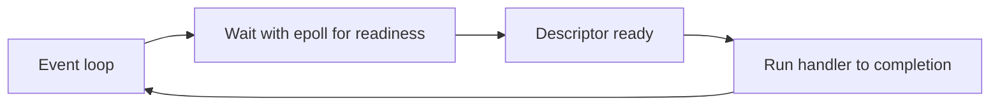
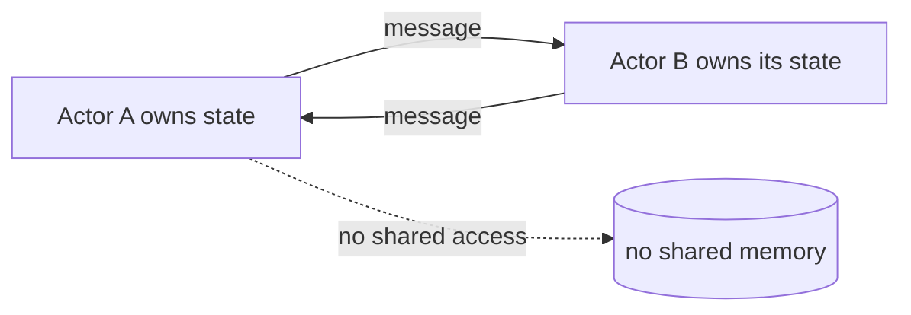
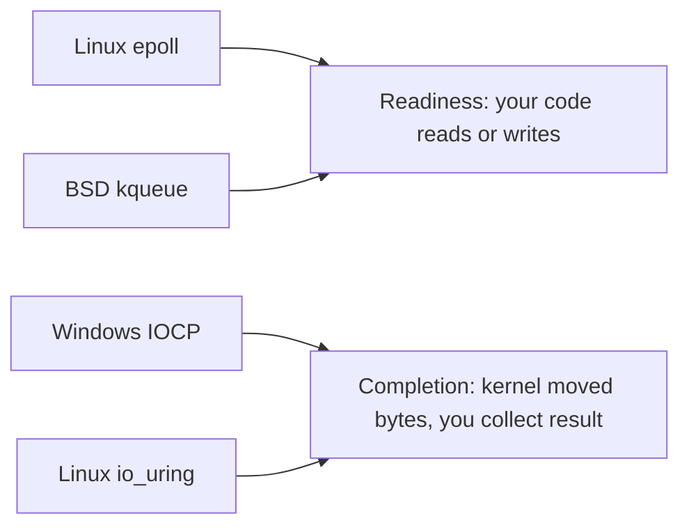

The earlier chapters opened a process and looked at its threads. They followed those threads to the CPUs and memory nearby. This chapter asks a bigger question. Which container and which waiting model should you use for a whole program? This is the fourth article in Stage 5.

Concurrency means handling many things at once. It does not mean doing them at the same instant. A program can be concurrent in several ways. It can use many threads. It can use many processes. It can use one thread that waits for events. It can use a runtime that schedules many small tasks. Or it can use a set of actors that pass messages.

Each choice shares different things. Threads share one address space. This lets them share memory directly, but they must coordinate every access. Processes share little. They talk through pipes, sockets, or shared mappings made on purpose. An event loop uses one thread. It never runs two handlers at the same time. This avoids many races by design. Async runtimes and coroutines look like blocking code, but they suspend instead of blocking a thread. Actors keep state inside one owner. They only send messages. Structured concurrency adds one rule: a parent waits for its children and controls their cancellation.

No model is best. The right choice depends on three things. What is shared. How failures should be contained. And whether the work is limited by CPU, by waiting, or by coordination.

## Multi-threading

A multi-threaded program runs many threads inside one or a few processes. Each thread has its own stack and registers. But all threads see the same heap, globals, and file descriptor table.

This sharing makes communication cheap. A producer can put a buffer pointer in a queue. A consumer can read it without copying the bytes. But every shared write is a place where a race can happen. A counter, a cache, a linked list, and a file descriptor are all shared by default. They are only private if they sit on a private stack or in thread-local storage.

Threads work well when the work shares a lot of in-memory state. They work well when latency matters and context switches are cheaper than process switches. They work well when the program is ready to protect or split the shared state. The cost is that the program must get every access right. A single missed lock or a wrong ordering can corrupt the shared structure. The fault is not contained to one thread. An address fault or a wrong file descriptor close can break the whole process.

You can see threads in the kernel with the same `ps` view from the thread article. The difference here is the shared address space.

```bash
go build -o tiny main.go
./tiny &
pid=$!
ps -o pid,nlwp,cmd -p $pid
cat /proc/$pid/maps | head
ls /proc/$pid/task | wc -l
```

This shows one address space holding many threads. Every line in `maps` is visible to every thread. That is why sharing is cheap and why coordination is required.

## Multi-processing

A multi-process program runs many processes instead of many threads. Each process has its own address space and its own table of descriptors. A bug that corrupts memory in one process does not directly corrupt another.

Communication must be explicit. A parent can create a pipe and fork children that inherit it. It can create a socket pair. Or it can map a shared file. All of these need a system call to set up. The program must choose a protocol for bytes, ordering, and which end closes.

```go
package main

import (
    "fmt"
    "os"
    "os/exec"
)

func main() {
    r, w, _ := os.Pipe()
    cmd := exec.Command(os.Args[0], "-child")
    cmd.Stdin = r
    cmd.Stdout = os.Stdout
    cmd.Start()
    fmt.Fprintln(w, "task")
    w.Close()
    cmd.Wait()
}
```

The pipe is the shared channel, but the address spaces stay separate. The child inherits a reference to the read end. The parent keeps the write end. When the parent closes the write end, the child sees end of file.

Processes work well when isolation matters more than sharing cost. A crash in a worker does not take down the supervisor. A worker can start with different privileges, limits, or even a different binary. The tradeoff is that sharing large data costs a copy or a deliberate shared mapping. The kernel must also track more address spaces and page tables.

## Single-threaded event loops

An event loop is a single thread. It waits for events and runs one handler for each event. It runs the handler until the handler returns. No two handlers run at the same time. So shared state does not need a lock between handlers.

The typical loop uses `epoll` or `kqueue` to wait for many descriptors at once.



The benefit is that the code shows concurrency plainly. No preemptive switch happens in the middle of a handler. So a handler can touch shared structures without locking, as long as it does not yield in the middle. The cost is that a handler must never block for a long time. A handler that reads a large file or runs a long computation without yielding stops the loop from handling the next event. Latency then grows for all connections. Handlers should do a little work, register interest in the next event, and return.

Go's netpoller is an event loop. The runtime uses it for network I/O. A goroutine that waits on a socket does not block a kernel thread. The runtime parks the goroutine. The netpoller's loop wakes it when the descriptor is ready.

### Level-triggered versus edge-triggered

`epoll` has two modes. Level-triggered mode is the default. The kernel reports a descriptor as ready as long as it stays ready. If you do not read all the data, the next `epoll_wait` reports it again. Edge-triggered mode is set with `EPOLLET`. The kernel reports a change from not ready to ready only once. If you do not read until `EAGAIN`, you get no more notice until new data arrives. Edge-triggered needs a loop that reads until `EAGAIN`. It is easy to get wrong, but it avoids repeated wakeups. Level-triggered is more forgiving for a handler that does a little work and returns.

```go
// edge-triggered loop must drain
for {
    n, err := syscall.Read(fd, buf)
    if err == syscall.EAGAIN {
        break // must wait for next edge
    }
    // handle n bytes
}
```

This shows that the handler, not the kernel, must know when it is done. A level-triggered handler that reads one chunk and returns will be woken again. An edge-triggered handler that does the same will wait forever.

### How Go's netpoller parks a goroutine

When a goroutine does a `net` read, the runtime does not block the kernel thread. It calls `gopark`. It records that this goroutine waits on this descriptor. It schedules another goroutine on the same `M`. The netpoller is its own kernel thread. It loops on `epoll_wait`. When the descriptor is ready, the netpoller marks the waiting goroutine as runnable. The scheduler later resumes it on a `P`.


The key difference is between the parked kernel thread and the parked goroutine. `ps` shows the first. `runtime.NumGoroutine` shows the second. A program that parks ten thousand goroutines on network wait may still show only eight kernel threads.

### `io_uring` as a completion model

`epoll` is a readiness model. It says a descriptor is ready, and the program then does the `read`. `io_uring` is a completion model. The program submits a request like `read at offset` into a submission queue and later looks at a completion queue for the result. The same thread can submit many requests without waiting for each one, and the kernel can do the work with fewer system calls.

The tradeoff is interface complexity. `epoll` is one `epoll_wait` plus ordinary reads and writes. `io_uring` needs two rings, correct memory ordering for the rings, and handling of completions that may arrive out of order. For a Go HTTP server that already uses the netpoller, `io_uring` is not automatically faster. For a storage-heavy program that does many random reads, it can reduce the number of context switches.

## Async runtimes

Async runtimes make waiting look like blocking code, but the thread is not blocked. A function that looks like it reads a file actually suspends. It lets the runtime run other tasks. It resumes after the data is ready.

In Go, a goroutine that blocks on a channel or on a `net` operation suspends. The Go scheduler runs another goroutine on the same kernel thread.

```go
package main

import (
    "fmt"
    "sync"
    "time"
)

func fetch(id int) {
    time.Sleep(10 * time.Millisecond)
    fmt.Printf("fetched %d\n", id)
}

func main() {
    var wg sync.WaitGroup
    for i := 0; i < 3; i++ {
        wg.Add(1)
        go func(n int) {
            defer wg.Done()
            fetch(n)
        }(i)
    }
    wg.Wait()
}
```

The three `fetch` calls appear to run together. On a single kernel thread they are interleaved at the suspension points. The code looks synchronous, but the runtime schedules it as events. This gives some of the simplicity of threads with some of the efficiency of an event loop, as long as you understand the runtime's scheduler. A goroutine that runs a long computation without a suspension point still keeps its kernel thread busy. CPU-bound work still needs enough threads or explicit yielding.

## Coroutines and green threads

Coroutines and green threads are names for user-space threads. A language schedules them, not the kernel. Goroutines, Lua coroutines, and Kotlin coroutines all fit here. The kernel sees only the small number of carrier threads. The language sees many small tasks.

The advantage is creation cost. A green thread often starts with a few kilobytes of stack that can grow. A kernel thread starts with megabytes and kernel bookkeeping. This lets a program keep tens of thousands of concurrent tasks. A thread-per-task model with kernel threads would run out of memory.

The tradeoff is that the language must be involved. Code that blocks in a system call the runtime does not know about blocks the carrier thread. It can stall other green threads on that carrier. Modern runtimes integrate blocking operations so they suspend the green thread instead. But a call into a C library that blocks can still block a kernel thread.

## Actors

An actor is a concurrency model. It removes shared mutable state by rule. Each actor owns its private state. It only communicates with messages through a mailbox. No other owner touches that state directly.



An actor processes one message at a time. Inside one actor there is no race on that actor's state. The program scales by having many small actors. The cost is that a direct access becomes a message and a copy. The program must decide on delivery guarantees, ordering between actors, and what to do when a message queue grows.

Actors fit well when the domain is naturally isolated by entity. Use one actor per connection or per entity. They fit when the failure of one entity should not corrupt another's state.

## Structured concurrency

Structured concurrency is a design rule. A parent task owns its children, waits for them, and cancels them. A function that starts concurrent work does not return until that work is done or cancelled. A failure in a child fails the parent.

In Go, an `errgroup` shows the idea. A `context.Context` carries cancellation.

```go
package main

import (
    "context"
    "fmt"
    "golang.org/x/sync/errgroup"
)

func work(ctx context.Context) error {
    g, ctx := errgroup.WithContext(ctx)
    g.Go(func() error { <-ctx.Done(); return ctx.Err() })
    g.Go(func() error { return doTask(ctx) })
    return g.Wait()
}

func doTask(ctx context.Context) error {
    select {
    case <-ctx.Done():
        return ctx.Err()
    default:
        fmt.Println("doing task")
        return nil
    }
}
```

The important lines are `WithContext` and `Wait`. `Wait` does not return until every goroutine the group started has finished. Cancellation of the context signals those children at a safe point. Without a structure like this, a function can return while a goroutine it started keeps running and holds resources. That looks like a leak and makes shutdown hard to reason about.

Structured concurrency does not say which primitive to use. It says who is responsible for waiting and who owns the signal to stop.

### What survives a failure in each model

A crash or panic takes down a different amount of work depending on the container.

| Model | What fails together | What survives | What must be restarted |
|---|---|---|---|
| Multi-thread, one process | One thread corrupts shared heap → whole process may be corrupt | Nothing in the same address space can be trusted | Restart the process, or at least re-initialize the shared state |
| Multi-process pool | One worker faults with `SIGSEGV` | Supervisor and other workers, because they have separate address spaces | Supervisor restarts that one worker from its executable |
| Event loop, one thread | One handler panics and is not recovered → loop stops | No handler runs until loop is recovered | `recover` inside the loop or restart the process; other handlers do not run during the panic |
| Goroutines on netpoller | One goroutine panics without `recover` | Other goroutines and the netpoller, but the panic that escapes to the runtime exits the whole program | Use `recover` in the goroutine or `errgroup` to fail the group |
| Actors | One actor panics | Other actors and their mailboxes, if they share nothing | Supervisor restarts that actor from its last snapshot |

This shows that isolation is not only about sharing. A thread pool shares the failure domain of the address space. A process pool shares only the supervisor. An event loop isolates handlers in time. A long handler delays everyone even when it does not corrupt memory.

## Choosing based on workload and failure behavior

You can organize the same work in any of these models. The tradeoffs point to different choices for different workloads.

- Use threads inside one process when the work shares a lot of in-memory data and needs low latency. Threads share that data cheaply. The team must protect every shared access or split the data so each worker owns its shard.
- Use processes when the work must be isolated. A corruption in one worker must not affect another. Use processes when workers should run different binaries with different limits. Processes give the strongest boundary, but the program pays for explicit communication.
- Use a single-threaded event loop when the work is mostly waiting for many descriptors and each handler is short. It avoids many context switches and keeps memory small. The handlers must not block.
- Use an async runtime with coroutines or green threads when the code should look synchronous but many tasks must wait at once. Many logical tasks suspend on one kernel thread. Blocking system calls the runtime does not know about still block a carrier.
- Use actors when each entity owns its state and communicates only with messages. Actors remove shared-memory races by design. The cost is copies and message protocol design.
- Use structured concurrency when lifetime and cancellation must be clear. A parent waits for its children and owns the cancellation signal, no matter which primitive it uses.

Failure behavior is often the deciding factor. A process pool contains a crash to one worker, and the supervisor can restart that worker. An event loop contains a handler bug to one event. But a panic that escapes the loop can take the whole process if not recovered. A set of threads that share a map can corrupt the map for everyone if one thread updates it wrong. A set of actors that share no memory can still fill each other's queues if backpressure is missing.

A useful check is to ask three questions for each candidate. What is shared by default, and what must be made private on purpose? Where does a failure stop, and what must be restarted or reconciled? What is the bottleneck, CPU, waiting, or coordination, and how does the model move waiting off the limited resource?

You can see the choice by running the tiny program in two forms.

```bash
go run tiny.go &
ps -o pid,nlwp,cmd -p $!
# compare with a Go event loop that handles many connections in one thread
go run many_tasks_as_goroutines.go &
ps -o pid,nlwp,cmd -p $!
```

This shows that the number of kernel threads the kernel schedules is not the same as the number of concurrent tasks the language sees. The first program with many processes shows many PIDs. The second with many goroutines shows one PID with many logical tasks.

A second exercise compares behavior under failure. Start a multi-process pool and kill one worker. Then start a multi-threaded program and cause one goroutine to panic without recovery. Note which other work survives in each case.

## Readiness models across platforms: epoll, kqueue, and IOCP

Linux `epoll` is a readiness model. It tells you a descriptor can be read or written without blocking. Then your code performs the `read` or `write`. BSD and macOS offer `kqueue`. It is broader and reports readiness for sockets, files, timers, and signals through one interface. Windows offers `IOCP`, a completion model. You issue the operation and the kernel tells you when it is done. This is like `io_uring`'s completion queue on Linux.



The distinction changes the shape of your code. A readiness model keeps the actual transfer in your thread. The loop must drain the descriptor carefully and must not issue a blocking call on it. A completion model lets the kernel move the bytes while your thread does other work. You collect results from a completion port. A systems engineer who writes cross-platform services meets both. The reactor pattern maps to readiness models. The proactor pattern maps to completion models. Go's netpoller hides this by presenting a blocking-style API on top of whatever the platform provides.

## Why event loops appeared: the C10K problem and one loop per core

Event loops became mainstream because the old model did not scale. A thread-per-connection server spends most of its time with threads blocked waiting on the network. At ten thousand concurrent connections, that is ten thousand stacks, ten thousand context switches, and memory and scheduler pressure that dwarf the actual work. The C10K problem was the name for this wall. The answer was to stop allocating a thread per connection. Instead, have one thread wait for many descriptors at once.

The single-threaded loop is simple, but it uses only one CPU. Modern servers run one event loop per core. This is sometimes called the reactor-per-core pattern. Each core handles its own set of connections. The loops rarely contend on shared state because each owns its connections. This is why nginx-style and Redis-style designs and many Go programs scale. The runtime or framework spreads connections across loops bound to cores. This combines the simplicity of one handler at a time with the parallelism of many cores. The lesson is that the event loop solved a scaling problem, not a correctness one. Its benefit is most visible when most of the work is waiting.

## Limits and gotchas of readiness polling

Readiness polling has sharp edges that surprise people. A regular file descriptor is always ready for `epoll` in practice. File reads do not block on local disks the way sockets do. You cannot use `epoll` to wait for disk I/O to become non-blocking. You must use a worker thread or `io_uring` for that. Adding a regular file to an `epoll` set usually surfaces as an error or as constant readiness that busy-loops.

The other edge is the handler that must do real work. A loop that handles ten thousand connections but then blocks on a slow database call or a large computation inside a handler holds up every other connection on that loop. The standard fix is to keep the loop only for I/O readiness. Hand blocking or CPU-heavy work to a separate worker pool. Then notify the loop when the result is ready. Finally, the number of descriptors a loop watches is bounded by the process's file-descriptor limit. A loop that opens a connection per request without closing them will stop accepting new ones well before memory runs out. These are the operational limits that decide whether an event-loop design holds up under real traffic.

## Definitions

### Concurrency versus parallelism

> Concurrency is dealing with many tasks by interleaving their execution. Parallelism is running tasks at the exact same time on different CPUs. A single-core event loop can be concurrent without being parallel.

### An event loop

> A single thread that waits for many descriptors to become ready and runs one handler at a time to completion. No two handlers overlap. Shared state does not need a lock between them as long as a handler does not block.

### An async runtime

> A runtime that lets code look like it blocks but actually suspends the current task and runs another task on the same thread. In Go, a goroutine that waits on a network socket is parked by the runtime and resumed when the socket is ready.

### Goroutines and green threads

> A user-space thread the language schedules onto a smaller number of kernel threads. It starts with a small stack and is cheap to create, but a blocking system call the runtime does not know about can still block its carrier.

### An actor

> A concurrency model where each owner holds private state and communicates only through messages. No owner touches another's state directly. Races on shared state are avoided by construction at the cost of copies and message protocol design.

### Structured concurrency

> The rule that a parent task that starts concurrent children waits for them and owns their cancellation and error propagation. A function does not return while work it started keeps running.

## Beyond the definitions

### Why an event loop scales to many connections

> One thread waits for many descriptors with `epoll`. Handlers run without a context switch between them. The cost is that a handler must not block for a long time, or it delays every other connection.

### Choosing processes over threads

> Use processes when you want strong isolation so a fault in one worker cannot corrupt another. Use them when workers should run different binaries or with different privileges. Use them when you are willing to pay for explicit communication through pipes or sockets.

### What an async runtime does not fix

> It does not make CPU-bound work free. A long computation without a suspension point still keeps its kernel thread busy. It also does not stop a blocking C call that the runtime does not know about.

### Why many goroutines but few kernel threads

> The Go runtime multiplexes many goroutines onto a small number of kernel threads. The kernel schedules the threads, the runtime schedules the goroutines onto them, so `ps` and `runtime.NumGoroutine` show different counts.

### How structured concurrency helps shutdown

> The parent owns a context and waits for its children. Canceling the context signals every child at a safe point. `Wait` ensures the parent does not return and leak a child that keeps running.

## Common misconceptions

**"Concurrency is the same as parallelism."** It is not. Concurrency is about dealing with many tasks by interleaving. Parallelism is about doing work at the exact same time on different CPUs. An event loop can be useful without any parallelism.

**"More threads always give more throughput."** More threads help while there are independent CPUs and no shared bottleneck. Beyond that they add switching, memory for stacks, and contention without more useful work.

**"An event loop never blocks."** The loop itself blocks in `epoll`, but handlers should not block for a long time. A handler that reads a large file without yielding blocks the whole loop.

**"Async code runs in parallel by itself."** Async code is concurrent by interleaving. It only runs in parallel when the runtime schedules it on multiple threads. That depends on configuration and whether the work has suspension points.

**"Goroutines are free."** They are cheap to create, but each has a stack and each holds resources the work needs. An unbounded number of goroutines that each block on a downstream call still exhausts memory and downstream capacity.

## Summary

Threads share an address space and communicate cheaply, but every shared access must be coordinated. Processes share little and communicate through kernel objects, so they isolate failures better at the cost of explicit messages. An event loop avoids preemptive races by running one handler at a time, but handlers must not block. Async runtimes suspend rather than block. Coroutines and green threads make many tasks cheap by letting the language schedule them. Actors avoid shared state by using messages. Structured concurrency adds the ownership rule that a parent waits for its children and controls their cancellation. The right model depends on what is shared, where failure should stop, and whether the work is limited by CPU, by waiting, or by coordination.
