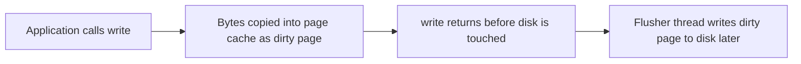
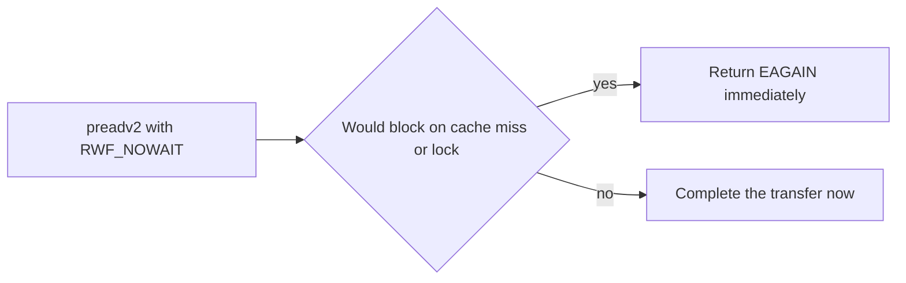

Earlier articles in this stage explained three ideas. They explained what a file descriptor is. A file descriptor is a number your program uses to refer to an open file. They explained how a path name turns into an inode. An inode is the file's metadata record on disk. They explained who may open a file. This article explains a new step. It explains how bytes move after you open the file. It is the fourth article in Stage 7. It is the first article about file I/O correctness.

Suppose your program calls `read` or `write`. That call does not talk to the disk directly. It asks the kernel to move bytes. The kernel is the core part of the operating system that controls hardware. The path the request takes depends on four choices. First, the kernel may keep the data in a cache or not. Second, the call may wait for the device or may return at once. Third, the call may finish the whole transfer or may return early. Fourth, the kernel may store the data for later reads or not. These choices change four things. They change how long the call takes. They change how much CPU the call uses. They change how much memory the call uses. They change what happens when the call is cut short. If you ignore these choices, your code can fail in three ways. It can lose data when a write moves fewer bytes than you asked for. It can waste memory by keeping two copies of the same data. It can block a thread even though you set `O_NONBLOCK`. `O_NONBLOCK` is a flag that asks the kernel not to wait. This article describes each common file I/O path. It also explains when to use each path.

## The basic read and write and the offset

When you call `open`, the kernel creates an open file description. This is a kernel object that tracks the file and the current offset. The offset is the position where the next read or write will start. When you call `read` or `write`, the kernel looks at this offset. It moves bytes starting there. It then adds the number of bytes moved to the offset. It returns that count to your program. All descriptors that point to the same open file description share one offset. The first article in this stage explained this. So two processes that open the same file get two separate open file descriptions. They get two separate offsets. A `dup` call creates a second descriptor that points to the same open file description. Those two descriptors share one offset.



The diagram shows the normal buffered path. Buffered I/O means the kernel keeps file data in memory. That memory is the page cache. The page cache is a set of memory pages the kernel uses to store file data. When your program calls `write`, the kernel copies the bytes into the page cache. It marks the page as dirty. A dirty page is a cached page that has new data not yet written to disk. The `write` call then returns at once. It does not wait for the disk. This makes the call fast. Your program does not wait for the slow device. But the data is not yet durable. Durable means the data will survive a crash or power loss. A later article covers durability.

Suppose your program calls `read` near the end of a file. If the call hits the end of the file, it returns 0. That 0 is the only way to tell end of file apart from a short read. A short read is a read that returns fewer bytes than you asked for but not because the file ended. For example, your program asks for 4096 bytes in the middle of the file. The kernel might return only 1000 bytes. That is a short read. A read at end of file returns 0. If your code treats 0 as "try again", it will loop forever. If your code treats any short read as end of file, it will stop too early and lose data. The rule is simple. 0 means end of file. A positive number smaller than your request means a short transfer. A negative number means the call failed.

## Short reads and short writes

Suppose your service reads a file in a loop and sometimes gets fewer bytes than asked for. This is normal. A `read` does not always fill the buffer you gave it. A `write` does not always write all the bytes you gave it. A `read` can return fewer bytes for three reasons. First, it hit the end of the file. Second, it read from a pipe or terminal. A pipe is a channel between programs. The kernel returned only the bytes that were ready. Third, a signal cut the call short. A signal is an interrupt the kernel sends to your program. A `write` can return fewer bytes for three reasons. First, the pipe that receives the data is full. Second, the disk quota or file size limit blocked more bytes. Third, a signal cut the call short.

A short count is not an error on its own. Your program must handle it. The right pattern is a loop. Each time through the loop, move the pointer forward. Shrink the remaining length. Try again. Stop only when you have moved all bytes or when you get a real error. Many programs make the same bug. They assume one `read` or `write` moves the whole buffer. That bug drops data without warning. It hides during tests. On a local file, a small `write` almost always moves all bytes. The bug shows up later under load, with signals, or on network filesystems.

## Positional I/O and the vector variants

`pread` and `pwrite` are positional versions of `read` and `write`. Positional means you give the offset with the call. The kernel reads or writes at that offset. It does not use the shared current offset. It also does not change the shared offset. This helps in two cases. First, your program needs random access. Second, several threads use the same file descriptor. Each thread can read a different part of the file. They do not need to lock the shared offset. They also do not step on each other's position.

The vector forms add scatter gather. Scatter gather is also called vectored I/O. Vectored I/O moves data to or from several buffers in one call. `preadv` and `pwritev` take an array of buffers and an offset. Suppose a record lives in three separate buffers in memory. Your program can write all three to one file offset in one call. The newer calls `preadv2` and `pwritev2` add a flags argument. The flags use the `RWF_*` set. The table below shows the flags:

| Flag | Meaning |
|---|---|
| `RWF_APPEND` | Atomic append without needing `O_APPEND` |
| `RWF_DSYNC` | Perform this write as if `O_DSYNC` were set, syncing data |
| `RWF_SYNC` | Perform this write as if `O_SYNC` were set, syncing data and metadata |
| `RWF_HIPRI` | Higher priority, polling for the device (used by fast storage) |
| `RWF_NOWAIT` | Do not wait; return `EAGAIN` immediately if the operation would block |

`RWF_NOWAIT` is the closest thing to true non blocking file I/O. Non blocking means the call returns at once if it would have to wait. `RWF_NOWAIT` does not wait when the data is not in cache. A cache miss means the kernel must fetch data from disk. It also does not wait when another thread holds the inode lock. An inode lock protects the file's metadata. Instead the call returns `EAGAIN`. `EAGAIN` is an error code that means try again later. Your program can do other work and retry. This flag lets a regular file work inside a non blocking event loop. An event loop is a single thread that handles many events. Your program does not need a thread pool. For pipes and sockets, `O_NONBLOCK` does the same job. `RWF_NOWAIT` is the file version of `O_NONBLOCK`.



## Vectored I/O and scatter-gather

`readv` and `writev` let one call work with several buffers. Each buffer has a starting address and a length. Suppose a record has a header in one buffer and a body in another. Your program can read or write both with one call. Your program can also gather several pieces into one write. It does not need to copy them into one big buffer first. `preadv` and `pwritev` do the same work but add an offset. `preadv2` and `pwritev2` add the `RWF_*` flags described above.

Vectored I/O still copies data through the kernel. It is not zero copy. Zero copy means the kernel moves data without copying it to user memory. Vectored I/O does copy. But it avoids one extra step. Your program avoids copying pieces into a staging buffer. Your program also avoids making many separate calls. Suppose your web server must send a status line, headers, and a body. It can send all three with one `writev` call. It does not need to join them first. This also helps correctness. One call handles the whole scattered record. You avoid an extra buffer that a short write could leave half written.

## Blocking versus non-blocking behavior

By default, `read` and `write` on a regular file block. Block means the calling thread waits. The thread waits until the kernel moves the bytes you asked for or as many as it can. If the page cache already holds the data, the wait is very short. The page cache is the kernel's memory store for file data. If the data must come from a slow disk, the thread waits longer. The risk is simple. A slow disk can pause your program.

`O_NONBLOCK` changes this behavior for pipes, sockets, and devices. A pipe connects two programs. A socket is a network endpoint. With this flag, the call does not wait. If it would have to wait, it returns `EAGAIN` at once. `EAGAIN` means try again later. For regular files, this flag rarely helps. The kernel usually has the data or gets it quickly and returns. So non blocking mode rarely changes how files behave. For files, the useful non blocking flag is `RWF_NOWAIT`. We described it above. Blocking file I/O still feels fast most of the time. This is true when the system is warm. Warm means the cache already holds the data you need. You can turn `O_NONBLOCK` on or off after you open the file. You do this with `fcntl` and `F_SETFL`. `fcntl` is a call that changes file descriptor flags. `F_SETFL` is the command to set those flags. Servers use this to switch a descriptor between blocking and non blocking without closing it.

## Buffered I/O and the page cache

Buffered I/O is the normal path. It is the topic of the next article. With buffered I/O, reads come from the page cache when possible. The page cache is the kernel's memory store for file data. If you read the same region again, the kernel serves it from memory. It does not touch the disk. Writes go into the cache as dirty pages. A dirty page is a page with new data not yet on disk. A kernel thread called the flusher writes dirty pages to the device later. This path has three benefits. It is fast. It merges many small writes into larger ones. It does readahead. Readahead means the kernel reads the next bytes before you ask for them. This helps when you read a file from start to end.

This path also has costs. A write needs two copies. First the kernel copies data from your buffer to the cache. Later it copies data from the cache to the device. A read needs one copy from device to cache and then to your program, but if the data is already cached it needs only one copy to your program. Buffered I/O also uses memory. This hurts programs that keep their own cache. A database buffer pool is an example. The database already stores pages in memory. The page cache then holds a second copy of the same pages. This is the double buffering problem. It wastes memory.

Your program can give hints to the kernel. The call `posix_fadvise` tells the kernel how you plan to use the data. `POSIX_FADV_SEQUENTIAL` tells the kernel you will read from start to end. The kernel then does strong readahead. `POSIX_FADV_RANDOM` tells the kernel you will jump around. The kernel then turns readahead off. `POSIX_FADV_WILLNEED` asks the kernel to bring a range into cache soon. `POSIX_FADV_DONTNEED` tells the kernel you no longer need a range. The kernel can then free those pages. `POSIX_FADV_NOREUSE` tells the kernel you will use the data only once. The `readahead` call lets your program bring a range into cache by hand. Use `DONTNEED` after you scan a large file once. Suppose your backup job reads a 100 GB file from start to end. Without the hint, that scan could push useful data out of the cache. Other programs would then slow down. `DONTNEED` avoids this.

The filesystem also reports a preferred I/O size. You can read it from `stat` in the field `st_blksize`. The device reports two block sizes. You can read them at `/sys/block/<dev>/queue/logical_block_size` and `physical_block_size`. Logical block size is the smallest unit the device talks in. Physical block size is the true size on the device. If you align your transfers to these sizes and to memory page edges, both buffered and direct I/O run faster.

## Direct I/O and O_DIRECT

`O_DIRECT` is a flag you pass to `open`. It tells the kernel to skip the page cache. The kernel moves data straight between your buffer and the device. It uses DMA to do this. DMA is direct memory access. It lets the device read and write memory without help from the CPU. Your program now must do work the kernel used to do. It must handle its own caching. It must handle its own readahead. It must meet alignment rules. Three values must be aligned. The buffer address must be aligned. The transfer length must be aligned. The file offset must be aligned. The rules usually match the memory page size and the device's logical block size. If any value is not aligned, the call fails with `EINVAL`. `EINVAL` means the argument is not valid. Programs use `posix_memalign` to get aligned buffers. `posix_memalign` is a call that returns memory at a chosen alignment. Some programs use large page allocators for the same reason.


The diagram shows the direct path. Databases and storage engines often use `O_DIRECT`. They do this to avoid double buffering. They also do this to control when data hits the disk. This matters for a write ahead log. A write ahead log is a file where the database records changes before it applies them. Steady latency also matters. The cost is that these programs lose the kernel's help. They lose readahead. They lose caching. They must build those features themselves. A buffer that is not aligned will fail. A small random read with `O_DIRECT` can run slower than a buffered read. Use direct I/O only when your program already manages memory well. Do not use it as a default for every service.

## Synchronous I/O and fsync at write time

Three flags make a write durable at the time of the call. Durable means the data will survive a crash. Without these flags, the kernel writes data later at its own pace. `O_SYNC` is a flag for `open`. With `O_SYNC`, each `write` waits. It waits until both data and metadata reach stable storage. Stable storage is the disk or other device that keeps data without power. Metadata includes file size and timestamps. `O_DSYNC` is similar but lighter. It waits only for the data. It does not wait for unrelated metadata. For a log that only grows at the end, `O_DSYNC` is usually enough. An append only log is a file you only add to. `fdatasync` does the same work as `O_DSYNC` but for one call. You call it after a `write`. `fsync` does the same work as `O_SYNC` but for one call. It waits for data and metadata. A later article covers these in depth. These tools change the meaning of a write. Without them, a write means the kernel accepted your bytes. With them, a write means the bytes are on the device. Opening with `O_SYNC` is simple. Every write becomes durable. That is often slower than a different pattern. You can batch several writes and then call `fsync` once.

## Asynchronous I/O: native AIO and io_uring

Suppose your service must handle many I/O requests at once. If each I/O blocks one thread, you cannot scale. You would need one thread for each active I/O. The Linux native asynchronous I/O interface solves this. Asynchronous means your program can start I/O and do other work before it finishes. One thread can submit many operations. It can collect results later. In the past, programs used `io_submit` with `IOCB_CMD_PREAD` and `IOCB_CMD_PWRITE`. `io_submit` is the call that sends requests to the kernel. The thread then calls `io_getevents` to collect results. It does not wait for each request one by one. This old interface is hard to use. It also has quirks. For example, it once ran buffered reads on a separate kernel thread.

The modern interface is `io_uring`. `io_uring` uses two ring buffers. A ring buffer is a circular queue shared between your program and the kernel. One ring holds requests. The other holds completions. Your program and the kernel pass messages through these rings with very few system calls. `io_uring` supports true non blocking file operations. It also supports polling and linked operations. Polling means the kernel checks for completion without interrupts. Linked operations are chains where one op starts after the last one finishes. `io_uring` is now the best choice for new high speed I/O code. It handles files, sockets, and other descriptors with one model. Both the old AIO and `io_uring` move the wait off the fast path. That answers the question how to do non blocking file I/O at scale.

## Zero-copy and server-side copy helpers

Some system calls avoid copying bytes through your program. `sendfile` moves data from a file to a socket inside the kernel. It can also move data between two file descriptors. Suppose your web server must send a static file. With `sendfile`, the kernel moves the bytes. Your program never reads them into user memory. `splice` and `tee` move data between a pipe and a file or socket. A pipe is a kernel buffer that links two descriptors. They use kernel buffers to move the bytes. `copy_file_range` copies data within one file or between two files. It also avoids moving data through user memory. This is far cheaper than a `read` followed by a `write`. These calls are the zero copy tools. Zero copy means the kernel moves bytes without copying them to your program. The Stage 6 article on zero copy, DMA, and high speed buffers covers them. They matter when your service burns CPU copying data that the kernel could move for you.

## Observing I/O behavior

You can watch I/O with common tools. `strace` traces system calls. It shows whether your program calls `read`, `write`, `pread`, `pwrite`, `writev`, or `splice`. It also shows the size of each transfer. If you see many small transfers in a tight loop, your program may need buffering. Or it may need `writev` to gather small pieces. The page cache appears in `/proc/meminfo`. Look at the fields `Cached` and `Dirty`. `Cached` is memory used for cached files. `Dirty` is cached data not yet on disk. Disk use appears in `iostat -x`. `iostat` reports load on each device. Tools like `vmtouch` and `pcstat` show which pages of a file are in cache. This tells you whether a slow read is a cache miss. A cache miss means the kernel had to fetch data from disk. `blktrace` and `fio` dig deeper. They benchmark the device and track latency at the block layer.

```go
package main

import (
    "fmt"
    "os"
)

// writeAll loops until the whole buffer is written or a real error occurs.
func writeAll(f *os.File, data []byte) error {
    written := 0
    for written < len(data) {
        n, err := f.Write(data[written:])
        if n > 0 {
            written += n
        }
        if err != nil {
            return err
        }
        if n == 0 && err == nil {
            continue
        }
    }
    return nil
}

func main() {
    f, err := os.Create("out.txt")
    if err != nil {
        panic(err)
    }
    defer f.Close()

    // positional write at offset 0 and again at offset 10
    f.WriteAt([]byte("hello"), 0)
    f.WriteAt([]byte("world"), 10)

    buf := make([]byte, 5)
    f.ReadAt(buf, 0)
    fmt.Printf("read back: %s\n", buf)

    big := make([]byte, 1<<16)
    if err := writeAll(f, big); err != nil {
        panic(err)
    }
    fmt.Println("wrote", len(big), "bytes with a short-write-safe loop")
    select {}
}
```

```bash
go build -o iodemo main.go
strace -e trace=read,write,pread,writev -f ./iodemo 2>&1 | head
cat /proc/meminfo | grep -E "Cached|Dirty"
iostat -x 1 2
# which pages of a file are in cache right now
vmtouch -v somefile.dat
# prefetch and drop cache hints from the shell
posix_fadvise()  # via application code, not a standalone command
```

The demo shows two ideas. It shows positional calls in action. It also shows the loop that keeps writes safe when a short write happens. The `strace` output shows the real calls and their sizes. `iostat` shows whether the device is the slow part. `vmtouch` shows whether a read came from cache or disk. If your service gets complaints about slow reads, these tools tell you where time goes. The cost may be in the system call path. It may be in the page cache. It may be on the disk itself.

## A realistic production example

Consider a real service that takes in logs. The team wrote code that added one record at a time. Each record used one `write` call. The code assumed each `write` moved the whole record. Under normal load, that was true. Every `write` moved all bytes. Under a traffic spike, some writes returned short. A short write means the call moved fewer bytes than asked for. Two factors caused the short writes. The destination behaved like a pipe with limited space. A signal handler for shutdown also cut some calls short. The code ignored the return value. So it dropped the tail of each short write. The log file then held broken records that overlapped. Programs that read the log later rejected those records.

The fix was the write all loop shown above. The loop tracks how many bytes it has written. It keeps trying until the whole buffer is done or until a real error occurs. Later the same service changed its hot log segment to use `O_DIRECT`. The hot segment is the file that gets most writes. The service already kept its own buffer pool in memory. It did not want the kernel to keep a second copy of every page. `O_DIRECT` removes that second copy. It also makes write latency more steady. The cost was extra work. The team had to manage alignment and readahead itself. It also had to take control of durability. Old code waited for the flusher thread to write data later. New code called `fdatasync` after each batch. `fdatasync` forces data to stable storage. The next article covers durability. The lesson is simple. The default I/O path is handy until it fails. Two failures can hit you. One is a silent short write. One is a duplicate cache. You avoid both when you know the path your bytes take.

## How engineers actually reason about file I/O

Engineers follow five rules. First, they loop on short transfers. Any `read` or `write` can move fewer bytes than asked for. So the code moves the pointer forward and tries again. It stops only when all bytes are done or when a real error occurs. This is not extra caution. It is the contract the kernel gives you. If you skip the loop, you can lose data without any error.

Second, they pick buffered or direct I/O on purpose. Buffered I/O is the right default for most services. The page cache helps. It caches hot data and does readahead. Direct I/O is for programs that already manage memory. A database is a good example. It uses direct I/O to avoid double caching and to control latency. Direct I/O needs strict alignment. You must align buffer, length, and offset.

Third, they do not confuse fast with safe. A buffered `write` returns fast because it hit the cache. Fast does not mean the data is safe on disk. Safety needs a durability call. Use `fsync` after a batch of writes. Or use `O_SYNC` or `O_DSYNC` at `open` time. The next article covers this. If you think write returned means data is on disk, you get a classic durability bug.

Fourth, they use vectored I/O and `RWF_NOWAIT` on hot paths. A hot path is code that runs very often. `writev` and `readv` save a copy and a call. `RWF_NOWAIT` lets a regular file work in a non blocking event loop. The program does not need a thread pool. For very high load, they use `io_uring`. `io_uring` handles tens of thousands of I/Os without one thread per I/O.

Fifth, they give hints to the cache. They call `posix_fadvise` with `DONTNEED` after a large scan. They call it with `WILLNEED` before they need a range. This keeps the page cache useful. It holds the working set that matters. The working set is the data your program uses most.

## I/O throttling and prioritization with cgroups v2

On a shared host, one service can starve others for I/O. Suppose a batch job and a database run on the same machine. Without limits, the batch job could flood the disk. Linux controls this with cgroups v2. Cgroups v2 groups processes and sets limits for each group. `io.max` sets a hard cap for a group on one device. You set a max for IOPS and for bandwidth. IOPS is the number of I/O operations per second. Bandwidth is bytes per second. You can cap a batch job to a small share of the disk. The database keeps the rest. `io.weight` sets a soft priority. It takes values from 1 to 10000. The default is 100. When the disk is busy, the scheduler gives more time to groups with higher weight. This keeps the database responsive while a backup runs. `io.stat` shows what really happened. It reports how much a group was throttled and how much pressure it saw. That tells you whether a limit is active.

This control works with the buffering model described earlier. A cgroup limit applies to I/O that reaches the device. It does not apply to the copy into the page cache. So a throttled writer can still return fast from a buffered `write`. The bytes go into the cache quickly. Later the flusher thread tries to write dirty pages to the device. That is when the cap bites. The flusher may stall. The practical rule is simple. Use `io.weight` for services that need low latency. Use `io.max` only when you need a hard ceiling. Watch `io.stat` to see what the kernel really did. Do not guess. Kubernetes exposes these controls in the pod spec. You set storage limits and the I/O fields there. You can bound a noisy neighbor without changing its code.

## Definitions

### Buffered I/O

> The normal file I/O path. Reads come from the kernel page cache when possible. The page cache is memory that stores file data. Writes go into the cache as dirty pages. A dirty page holds data not yet on disk. Transfers are fast because they hit memory first. The kernel flusher thread writes dirty pages to the device later.

### Direct I/O

> File I/O that uses `O_DIRECT`. The kernel skips the page cache. Data moves straight between your buffer and the device. Your buffer, the length, and the offset must all be aligned. Aligned means they meet the device size rules. The application must handle caching itself.

### A short read or write

> A transfer that moved fewer bytes than you asked for but did not fail. This is normal. Your code must loop until it has handled all bytes or a real error occurs. A read that returns 0 means end of file. End of file means there is no more data to read.

### Positional and vectored I/O

> `pread` and `pwrite` read or write at an offset you give. They do not read or change the shared current offset. Their `v` variants work with several buffers at once. `preadv2` and `pwritev2` add `RWF_*` flags. Examples are `RWF_NOWAIT` and `RWF_SYNC`.

### Non-blocking and asynchronous I/O

> `O_NONBLOCK` and `RWF_NOWAIT` make a call return `EAGAIN` when it would have to wait. `EAGAIN` means try again later. For regular files, `O_NONBLOCK` rarely changes behavior. `RWF_NOWAIT` and `io_uring` give true non blocking file access. They do this without one thread per I/O.

### Synchronous write flags

> `O_SYNC` and `O_DSYNC` make each write wait for stable storage. Stable storage keeps data without power. `fdatasync` and `fsync` do the same work on demand after a write. They turn a cached write into a durable write. Durable means it will survive a crash.

## Beyond the definitions

### Why does a write return before the disk is written

> Buffered I/O copies bytes into the page cache and marks them dirty. Dirty means not yet on disk. The call then returns. The kernel flusher thread writes the pages to the device later. The call means you handed bytes to the kernel. It does not mean the bytes reached stable storage. Stable storage keeps data without power. That is why you need `fsync`, `fdatasync`, or `O_SYNC` for durability.

### When is O_DIRECT worth the alignment burden

> It is worth it when your program already keeps its own cache. A database is an example. A second copy in the page cache would waste memory and make latency less clear. It is not worth it for normal services. For them, the page cache helps. The alignment rules add risk and extra code. Buffers must be aligned to page size and logical block size. Use `posix_memalign` to get that alignment.

### Why does a short write happen if the disk is not full

> The destination may be a pipe with limited space. Or a signal may cut the call short. A signal is an interrupt from the kernel. Or a device or quota may cap the transfer. The kernel returns the count it did move. It lets your code continue. This is correct behavior. Code that ignores the count misreads it as full success.

### How is pread different from a read plus seek

> `pread` uses the offset you give. It does not read or change the shared file offset. So many threads can use one descriptor at the same time. They can read different regions without locks. `lseek` plus `read` would need a lock on the shared offset. `preadv2` adds vector I/O and `RWF_*` flags on top.

### Does non-blocking help a slow disk read

> No, not with `O_NONBLOCK` for regular files. The kernel still does the read from cache or device and then returns. `RWF_NOWAIT` and `io_uring` are the real tools. `RWF_NOWAIT` returns `EAGAIN` if it would block. `io_uring` completes the read later without blocking your thread.

### Why use io_uring instead of threads

> One thread per I/O does not scale to many thousands of concurrent I/Os. It wastes memory for stacks and time for the scheduler. `io_uring` uses two shared ring buffers and needs very few system calls. It handles files and sockets with one non blocking model.

## Common misconceptions

**"One write moves the whole buffer."** A write can move fewer bytes than you asked for. The kernel reports the short count as success. If your code ignores the returned length, it will drop data without warning. This bug rarely shows in tests. It appears under load or when a signal arrives.

**"A returned write means the data is safe."** A returned write means the kernel took your bytes into its cache. It does not mean the bytes are on disk. Without `fsync`, `fdatasync`, `O_SYNC`, or `O_DSYNC`, the data can be lost on crash or power loss. A later article covers durability in full.

**"O_DIRECT is always faster."** `O_DIRECT` removes the cache. If your workload gained from readahead or caching, it will now run slower. Your program must build those features itself. `O_DIRECT` helps only when your program already manages memory well and can meet the alignment rules.

**"Non-blocking file I/O avoids disk waits."** `O_NONBLOCK` usually does not help for regular files. The call still waits on a cache miss. True non blocking file behavior comes from `RWF_NOWAIT` or `io_uring`. It does not come from `O_NONBLOCK`.

**"Vectored I/O is only for performance tuning."** Vectored I/O also helps correctness. Suppose a record has a header and a body in two buffers. One vectored call can handle both. Your code does not need to join them into one buffer first. This avoids an extra copy and an extra buffer on hot paths.

**"fadvise is optional polish."** `posix_fadvise` changes what the cache keeps and what it prefetches. This directly affects tail latency. It also decides whether a bulk scan pushes the live working set out of cache. The working set is the data your production service needs. If you ignore `fadvise`, you leave cache behavior to chance.

## Summary

File I/O has several paths. Your choice changes how long calls take, how much memory they use, and whether they are correct. The normal buffered path copies data through the page cache. The page cache is memory that stores file data. The `write` call returns before the device is touched. So you need `fsync`, `fdatasync`, `O_SYNC`, or `O_DSYNC` to make the write durable. Durable means it will survive a crash. Short reads and writes are normal. Your code must loop until all bytes are done. A return of 0 means end of file. Positional calls `pread` and `pwrite` and their vectored forms `preadv2` and `pwritev2` make concurrent random access safe. They add `RWF_*` flags such as `RWF_NOWAIT`. Direct I/O with `O_DIRECT` skips the cache. It fits programs that manage their own memory. It needs strict alignment and your own caching. True non blocking file access comes from `RWF_NOWAIT` and `io_uring`. Tools `sendfile`, `splice`, and `copy_file_range` avoid copying bytes through your program. The next article looks at the cache itself. It explains what it takes to make a write durable.
